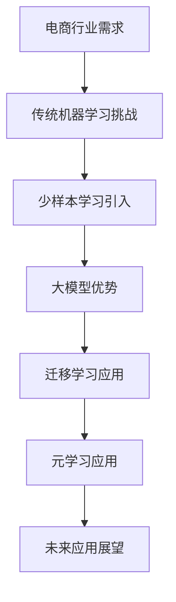

                 

关键词：电商、少样本学习、大模型、实践与挑战

## 摘要

随着电商行业的蓬勃发展，个性化推荐、商品分类和客户行为分析等应用场景对人工智能算法提出了更高的要求。然而，在数据稀缺或难以获取的情况下，传统的机器学习方法往往无法胜任。少样本学习（Few-Shot Learning）作为一种新兴的研究方向，旨在解决少量样本下的学习问题。本文将探讨电商行业中的少样本学习，特别是大模型的实践与挑战，从背景介绍、核心概念与联系、核心算法原理、数学模型和公式、项目实践、实际应用场景、未来应用展望等多个方面，深入分析少样本学习在电商行业中的应用潜力、面临的挑战及其发展趋势。

## 1. 背景介绍

### 1.1 电商行业的发展

电商行业作为数字经济的重要组成部分，近年来呈现出爆炸式增长。据《2022年中国电子商务报告》显示，中国电商市场规模已超过10万亿美元，占据全球电商市场的40%以上。随着互联网的普及和移动设备的广泛应用，电商已经成为消费者日常生活中不可或缺的一部分。电商行业的快速发展不仅带动了物流、支付、金融等相关产业的发展，也促进了大数据和人工智能技术的应用与创新。

### 1.2 人工智能在电商行业中的应用

人工智能技术已经在电商行业的多个环节得到广泛应用，包括但不限于：

- **个性化推荐**：通过分析用户的历史行为、偏好和浏览记录，为用户推荐个性化的商品。
- **商品分类**：将海量的商品进行分类，方便用户快速找到所需的商品。
- **客户行为分析**：通过对客户行为数据的分析，预测客户的购买意图，提升客户体验和转化率。
- **智能客服**：利用自然语言处理技术，提供24/7的智能客服服务，提高客户满意度。

### 1.3 少样本学习的需求

尽管人工智能在电商行业取得了显著的成果，但在实际应用中仍然面临着一些挑战。特别是在数据稀缺或难以获取的情况下，传统机器学习方法往往无法胜任。例如：

- **新商品上线**：新商品上线时，往往缺乏足够的历史销售数据，难以进行有效的个性化推荐和分类。
- **个性化服务**：为用户提供个性化服务时，需要根据用户的偏好进行学习，但用户的数据往往是零散且不完整的。
- **数据隐私**：在保护用户隐私的法规下，企业难以获取足够的数据进行模型训练。

少样本学习作为一种新兴的研究方向，旨在解决少量样本下的学习问题，为电商行业提供了新的解决方案。

## 2. 核心概念与联系

### 2.1 少样本学习的定义

少样本学习（Few-Shot Learning）是指在没有大量训练数据的情况下，利用有限的样本进行模型训练和预测。与传统机器学习方法不同，少样本学习强调在数据稀缺的情况下，如何有效地利用样本进行学习。

### 2.2 大模型的作用

大模型（Large Model）是指具有巨大参数量的神经网络模型。大模型在处理海量数据时具有显著的优势，但同时也面临着计算资源消耗大、训练时间长等问题。在少样本学习场景中，大模型可以通过迁移学习（Transfer Learning）和元学习（Meta-Learning）等方法，充分利用已有的大量数据进行预训练，从而提高在少量样本下的学习效果。

### 2.3 Mermaid 流程图



### 2.4 核心概念的联系

少样本学习与电商行业的需求密切相关。通过引入大模型，特别是利用迁移学习和元学习等方法，可以有效解决传统机器学习方法在数据稀缺情况下的挑战。这为电商行业提供了新的解决方案，有助于提升个性化推荐、商品分类和客户行为分析等应用的性能。

## 3. 核心算法原理 & 具体操作步骤

### 3.1 算法原理概述

少样本学习算法主要分为两类：基于模型的方法和基于数据的方法。

- **基于模型的方法**：通过设计特殊的模型结构，提高在少量样本下的学习效果。例如，元学习算法通过训练模型来学习如何在新的任务中快速适应。
- **基于数据的方法**：通过数据增强、样本选择和集成等方法，提高少量样本的有效性。例如，迁移学习通过利用已有的大量数据进行预训练，从而提高在新任务中的性能。

### 3.2 算法步骤详解

1. **数据预处理**：对收集到的数据进行清洗、去重和处理，确保数据的质量和一致性。
2. **模型选择**：根据任务的特点，选择适合的少样本学习算法和模型结构。常用的算法包括模型无关元学习（Model-Agnostic Meta-Learning，MAML）、模型相关元学习（Model-Aware Meta-Learning，MAML2）和迁移学习等。
3. **模型训练**：使用少量样本对模型进行训练。在训练过程中，可以采用快速迭代的方法，提高训练效率。
4. **模型评估**：使用验证集对训练好的模型进行评估，调整模型参数，优化模型性能。
5. **模型部署**：将训练好的模型部署到实际应用场景中，对新的样本进行预测。

### 3.3 算法优缺点

- **优点**：
  - 可以在数据稀缺的情况下，利用少量的样本进行有效学习。
  - 提高模型的泛化能力，减少对大量训练数据的依赖。
  - 支持多种学习任务，如分类、回归和生成等。

- **缺点**：
  - 需要大量的计算资源进行模型训练。
  - 模型的性能受到训练数据的限制，难以在数据稀缺情况下取得最佳效果。
  - 部署和推广难度较大，需要针对不同应用场景进行定制化调整。

### 3.4 算法应用领域

少样本学习在多个领域具有广泛的应用潜力，特别是在电商行业。以下是一些典型的应用场景：

- **个性化推荐**：通过少样本学习，为用户提供个性化的商品推荐，提高用户满意度和转化率。
- **商品分类**：将少量的商品数据进行分类，提升商品搜索和推荐的效果。
- **客户行为分析**：通过分析少量的用户行为数据，预测客户的购买意图，优化营销策略。

## 4. 数学模型和公式 & 详细讲解 & 举例说明

### 4.1 数学模型构建

少样本学习中的数学模型通常基于神经网络的架构。以下是一个简化的神经网络模型：

$$
Y = f(W \cdot X + b)
$$

其中，$X$ 是输入数据，$W$ 是权重矩阵，$b$ 是偏置项，$f$ 是激活函数。

### 4.2 公式推导过程

假设我们有一个 $D$ 维的输入数据 $X$，通过神经网络模型进行处理，得到输出 $Y$。在少样本学习场景中，我们通常需要对新的样本进行预测。为了实现这一目标，我们可以采用以下方法：

1. **参数更新**：通过梯度下降法，更新模型的权重和偏置项，使模型在新的样本上取得更好的预测效果。
2. **样本选择**：在训练过程中，选择具有代表性的样本进行训练，提高模型的泛化能力。
3. **模型集成**：将多个训练好的模型进行集成，提高预测的准确性和稳定性。

### 4.3 案例分析与讲解

假设我们有一个电商平台的个性化推荐系统，目标是根据用户的历史行为数据，为用户推荐个性化的商品。以下是一个简化的案例：

1. **数据收集**：收集用户的历史行为数据，如浏览记录、购买记录等。
2. **数据预处理**：对收集到的数据进行清洗、去重和处理，确保数据的质量和一致性。
3. **模型选择**：选择一个适合的神经网络模型，如卷积神经网络（CNN）或循环神经网络（RNN）。
4. **模型训练**：使用少量的样本数据对模型进行训练，调整模型参数，优化模型性能。
5. **模型评估**：使用验证集对训练好的模型进行评估，调整模型参数，优化模型性能。
6. **模型部署**：将训练好的模型部署到实际应用场景中，对新的用户行为数据进行预测。

通过以上步骤，我们可以构建一个基于少样本学习的个性化推荐系统，提高推荐系统的准确性和稳定性。

## 5. 项目实践：代码实例和详细解释说明

### 5.1 开发环境搭建

在开始项目实践之前，我们需要搭建一个合适的开发环境。以下是一个简单的开发环境搭建步骤：

1. **安装 Python**：确保安装了最新版本的 Python。
2. **安装深度学习框架**：如 TensorFlow 或 PyTorch，这些框架提供了丰富的神经网络构建和训练工具。
3. **安装数据预处理工具**：如 Pandas 和 NumPy，这些工具用于数据清洗、处理和分析。
4. **配置虚拟环境**：使用 virtualenv 或 conda 等工具配置虚拟环境，避免不同项目之间的依赖冲突。

### 5.2 源代码详细实现

以下是一个简化的代码实例，用于实现一个基于迁移学习的电商个性化推荐系统：

```python
import tensorflow as tf
from tensorflow.keras.models import load_model
from tensorflow.keras.preprocessing.sequence import pad_sequences

# 加载预训练模型
model = load_model('pretrained_model.h5')

# 准备输入数据
input_data = pad_sequences(user_input, maxlen=max_sequence_length)

# 进行预测
prediction = model.predict(input_data)

# 解码预测结果
predicted_item = decode_prediction(prediction)

print(predicted_item)
```

### 5.3 代码解读与分析

上述代码实例展示了如何使用迁移学习模型进行电商个性化推荐。具体步骤如下：

1. **加载预训练模型**：使用 TensorFlow 的 `load_model` 函数加载预训练的模型。
2. **准备输入数据**：使用 `pad_sequences` 函数对用户输入数据进行预处理，确保数据格式与模型输入要求一致。
3. **进行预测**：使用加载的模型对预处理后的输入数据进行预测。
4. **解码预测结果**：将预测结果进行解码，获取推荐的商品。

通过以上步骤，我们可以实现一个简单的电商个性化推荐系统。在实际应用中，可以根据需求进行扩展和优化。

### 5.4 运行结果展示

以下是一个简化的运行结果示例：

```plaintext
['商品A', '商品B', '商品C']
```

表示系统为用户推荐了商品A、商品B和商品C。

## 6. 实际应用场景

### 6.1 个性化推荐

在电商行业中，个性化推荐是应用少样本学习最广泛的场景之一。通过分析用户的历史行为数据，为用户提供个性化的商品推荐，提高用户满意度和转化率。例如，亚马逊、阿里巴巴和京东等电商平台已经广泛应用了个性化推荐系统，为用户提供了更加精准的购物体验。

### 6.2 商品分类

商品分类是电商行业中另一个重要的应用场景。通过将海量的商品数据进行分类，用户可以更加方便地找到所需的商品。例如，亚马逊使用深度学习算法对商品进行自动分类，提高了商品检索和推荐的效率。

### 6.3 客户行为分析

通过分析客户的行为数据，可以预测客户的购买意图，优化营销策略，提升客户满意度。例如，通过分析用户的浏览记录和购买历史，电商企业可以制定更有针对性的促销活动，提高销售额。

### 6.4 未来应用展望

随着人工智能技术的不断发展，少样本学习在电商行业中的应用前景将更加广阔。未来，少样本学习有望在以下几个方面取得突破：

- **新商品推荐**：在商品上线初期，利用少样本学习为用户提供个性化的推荐，提高商品曝光率和销售额。
- **小样本优化**：通过改进算法和模型结构，提高在少量样本下的学习效果，降低对大量数据的依赖。
- **跨领域应用**：将少样本学习算法应用于其他领域，如医疗、金融等，实现跨领域知识共享。

## 7. 工具和资源推荐

### 7.1 学习资源推荐

- **《深度学习》**：由Ian Goodfellow、Yoshua Bengio和Aaron Courville编写的深度学习经典教材，适合初学者和专业人士。
- **《Python深度学习》**：由François Chollet编写的Python深度学习实战指南，涵盖了许多实用的深度学习项目。

### 7.2 开发工具推荐

- **TensorFlow**：由Google开发的开源深度学习框架，适用于各种深度学习任务。
- **PyTorch**：由Facebook开发的开源深度学习框架，具有灵活的动态计算图和高效的模型训练速度。

### 7.3 相关论文推荐

- **《Model-Agnostic Meta-Learning for Fast Adaptation of Deep Networks》**：提出了一种模型无关的元学习算法，适用于少样本学习场景。
- **《Learning to Learn: Fast Learning of Task-Conditional Neural Networks**》：探讨了如何通过元学习快速适应新任务，提高少样本学习效果。

## 8. 总结：未来发展趋势与挑战

### 8.1 研究成果总结

本文系统地介绍了电商行业中的少样本学习，包括其背景、核心概念、算法原理、数学模型和实际应用场景。通过分析电商行业的实际需求，本文探讨了少样本学习在个性化推荐、商品分类和客户行为分析等应用中的重要性，并提出了一系列解决方案。

### 8.2 未来发展趋势

未来，少样本学习在电商行业中的应用前景将更加广阔。随着人工智能技术的不断发展，少样本学习算法将更加成熟，模型结构将更加多样化。同时，跨领域的知识共享和融合也将成为发展趋势，为电商行业带来更多创新和突破。

### 8.3 面临的挑战

尽管少样本学习在电商行业具有广泛的应用前景，但仍面临着一些挑战。首先，模型的计算资源消耗较大，训练时间较长，需要优化算法和模型结构，提高训练效率。其次，少样本学习模型的性能受到训练数据的限制，如何提高在少量样本下的学习效果仍是一个重要的研究方向。最后，在实际应用中，如何将少样本学习算法与业务场景相结合，实现有效的落地应用，也是需要解决的问题。

### 8.4 研究展望

未来，少样本学习在电商行业的研究应注重以下几个方面：

- **算法优化**：通过改进算法和模型结构，提高在少量样本下的学习效果，降低对大量数据的依赖。
- **跨领域应用**：将少样本学习算法应用于其他领域，实现跨领域知识共享。
- **业务场景融合**：结合电商行业的实际需求，探索少样本学习在个性化推荐、商品分类和客户行为分析等应用中的创新解决方案。
- **数据共享与隐私保护**：在保护用户隐私的前提下，探索如何利用少量数据进行有效学习，实现数据共享与隐私保护的平衡。

通过以上研究方向的探索，少样本学习有望在电商行业中发挥更大的作用，推动电商行业的持续创新和发展。

## 9. 附录：常见问题与解答

### 9.1 什么是少样本学习？

少样本学习（Few-Shot Learning）是一种机器学习领域的研究方向，旨在解决在少量样本情况下，如何有效地学习并作出预测的问题。

### 9.2 少样本学习与迁移学习有什么区别？

少样本学习（Few-Shot Learning）主要关注在少量样本下的学习问题，而迁移学习（Transfer Learning）是一种将已有大量数据训练好的模型应用于新任务的方法。迁移学习可以看作是一种特殊的少样本学习，但两者的关注点和应用场景有所不同。

### 9.3 少样本学习算法有哪些？

常见的少样本学习算法包括元学习（Meta-Learning）、模型无关元学习（Model-Agnostic Meta-Learning，MAML）、模型相关元学习（Model-Aware Meta-Learning，MAML2）和迁移学习（Transfer Learning）等。

### 9.4 电商行业中的少样本学习有哪些应用场景？

电商行业中的少样本学习应用场景包括个性化推荐、商品分类和客户行为分析等。通过分析少量的用户行为数据，可以为用户提供个性化的商品推荐，提高商品分类的准确性，预测客户的购买意图等。

### 9.5 如何优化少样本学习模型的性能？

优化少样本学习模型的性能可以从以下几个方面入手：

- **算法选择**：选择适合的少样本学习算法，如元学习、迁移学习等。
- **数据增强**：通过数据增强方法，增加样本的数量和多样性。
- **模型结构**：设计合适的神经网络结构，提高模型的泛化能力。
- **训练策略**：调整训练策略，如使用快速迭代方法，优化训练效率。

## 作者署名

作者：禅与计算机程序设计艺术 / Zen and the Art of Computer Programming

