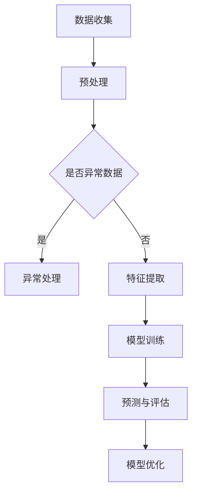

                 

关键词：电商运营、AI技术、运营效率、机器学习、深度学习、自然语言处理、图像识别、推荐系统、自动化、个性化、用户体验

> 摘要：本文旨在探讨如何通过应用人工智能技术来提升电商平台的运营效率。我们将从核心概念、算法原理、数学模型、项目实践以及未来应用等多个角度，全面分析电商运营中AI技术的作用，并提出相应的实践建议和资源推荐。

## 1. 背景介绍

随着互联网的快速发展，电子商务已经成为现代商业活动的重要组成部分。然而，电商运营面临着日益激烈的竞争和不断提升的用户期望。为了在竞争中脱颖而出，电商平台需要不断提高运营效率，提供更加个性化和高效的购物体验。人工智能技术的应用，为电商运营效率的提升带来了新的机遇和挑战。

本文将介绍几种关键的人工智能技术，并探讨它们在电商运营中的应用。这些技术包括机器学习、深度学习、自然语言处理、图像识别、推荐系统以及自动化和个性化服务。通过深入了解这些技术，我们可以为电商平台的运营策略提供有力的支持。

## 2. 核心概念与联系

### 2.1. 机器学习与深度学习

机器学习（Machine Learning）是一种人工智能技术，它使计算机系统能够从数据中学习并做出决策。深度学习（Deep Learning）是机器学习的一个子领域，它通过构建复杂的神经网络模型来模拟人类大脑的思考方式。

**Mermaid 流程图：**



### 2.2. 自然语言处理

自然语言处理（Natural Language Processing，NLP）是人工智能的一个分支，它专注于使计算机能够理解、解释和生成人类语言。在电商中，NLP可以用于处理用户评论、聊天机器人以及商品描述的自动生成。

### 2.3. 图像识别

图像识别（Image Recognition）是一种通过分析图像内容来识别和分类图像的技术。在电商中，图像识别可以用于商品分类、库存管理和图像搜索。

### 2.4. 推荐系统

推荐系统（Recommendation System）是一种通过分析用户行为和偏好，为用户推荐相关商品或内容的人工智能技术。推荐系统在电商中发挥着至关重要的作用，可以显著提高销售额和用户满意度。

## 3. 核心算法原理 & 具体操作步骤

### 3.1. 算法原理概述

#### 3.1.1. 机器学习

机器学习的核心原理是通过训练模型来发现数据中的模式和关系。常见的机器学习算法包括决策树、支持向量机、神经网络等。

#### 3.1.2. 深度学习

深度学习基于多层神经网络，通过逐层抽象和提取特征，实现复杂的模式识别和决策。

#### 3.1.3. 自然语言处理

NLP的核心算法包括词向量模型（如Word2Vec、GloVe）、序列模型（如RNN、LSTM）和注意力机制等。

#### 3.1.4. 图像识别

图像识别算法通常基于卷积神经网络（CNN），通过训练模型来识别图像中的对象和场景。

#### 3.1.5. 推荐系统

推荐系统通常采用协同过滤（Collaborative Filtering）和基于内容的推荐（Content-Based Filtering）等技术。

### 3.2. 算法步骤详解

#### 3.2.1. 机器学习

1. 数据收集：收集电商平台的用户行为数据、商品数据等。
2. 预处理：清洗数据、处理缺失值、特征工程等。
3. 模型训练：选择合适的机器学习算法，训练模型。
4. 预测与评估：使用训练好的模型进行预测，评估模型性能。

#### 3.2.2. 深度学习

1. 数据预处理：与机器学习类似，包括数据清洗和特征提取。
2. 模型构建：构建深度学习模型，如卷积神经网络（CNN）或循环神经网络（RNN）。
3. 模型训练：使用大量的训练数据进行模型训练。
4. 模型评估：评估模型性能，并进行调优。

#### 3.2.3. 自然语言处理

1. 数据预处理：清洗文本数据，进行分词、词性标注等。
2. 模型构建：使用词向量模型或序列模型构建NLP模型。
3. 模型训练：使用训练数据对模型进行训练。
4. 模型应用：将模型应用于实际场景，如自动回复、商品描述生成等。

#### 3.2.4. 图像识别

1. 数据预处理：对图像数据进行归一化、裁剪等处理。
2. 模型构建：使用卷积神经网络（CNN）构建图像识别模型。
3. 模型训练：使用标注好的图像数据进行模型训练。
4. 模型应用：使用训练好的模型进行图像识别和分类。

#### 3.2.5. 推荐系统

1. 数据预处理：处理用户行为数据、商品数据等。
2. 模型构建：选择合适的推荐算法，如协同过滤或基于内容的推荐。
3. 模型训练：使用训练数据对模型进行训练。
4. 模型应用：根据用户行为和偏好，为用户推荐相关商品。

### 3.3. 算法优缺点

- **机器学习：**优点是算法简单，易于实现；缺点是处理复杂问题效果不佳。
- **深度学习：**优点是能够处理复杂问题，效果更好；缺点是训练时间长，对数据量要求高。
- **自然语言处理：**优点是能够处理自然语言数据，效果较好；缺点是模型复杂，对计算资源要求高。
- **图像识别：**优点是能够准确识别图像中的对象和场景；缺点是对图像质量要求高，对计算资源要求高。
- **推荐系统：**优点是能够提高用户满意度，提高销售额；缺点是推荐效果受限于算法和数据。

### 3.4. 算法应用领域

- **机器学习：**用于用户行为分析、商品推荐、价格预测等。
- **深度学习：**用于图像识别、语音识别、自然语言处理等。
- **自然语言处理：**用于自动回复、商品描述生成、用户评论分析等。
- **图像识别：**用于商品分类、库存管理、图像搜索等。
- **推荐系统：**用于个性化推荐、广告投放、用户留存等。

## 4. 数学模型和公式 & 详细讲解 & 举例说明

### 4.1. 数学模型构建

在电商运营中，常用的数学模型包括线性回归、逻辑回归、决策树、支持向量机等。

- **线性回归：**
  
  $$ y = \beta_0 + \beta_1x_1 + \beta_2x_2 + ... + \beta_nx_n $$

  线性回归用于预测商品销量、价格等。

- **逻辑回归：**
  
  $$ P(y=1) = \frac{1}{1 + e^{-(\beta_0 + \beta_1x_1 + \beta_2x_2 + ... + \beta_nx_n)}} $$

  逻辑回归用于预测用户行为，如购买概率等。

- **决策树：**
  
  $$ f(x) = \text{sign}(\sum_{i=1}^{n} w_i x_i - b) $$

  决策树用于分类问题，如商品分类等。

- **支持向量机：**
  
  $$ \text{minimize } \frac{1}{2} \sum_{i=1}^{n} w_i^2 + C \sum_{i=1}^{n} \xi_i $$

  $$ \text{subject to } y_i(\langle w, x_i \rangle - b) \geq 1 - \xi_i $$

  支持向量机用于分类问题，如用户分类等。

### 4.2. 公式推导过程

以线性回归为例，我们首先假设存在一个函数 $f(x)$，用于预测商品销量：

$$ f(x) = \beta_0 + \beta_1x_1 + \beta_2x_2 + ... + \beta_nx_n $$

其中，$x_1, x_2, ..., x_n$ 是商品的特征，如价格、库存等。$y$ 是实际销量。

为了找到最优的 $\beta_0, \beta_1, ..., \beta_n$，我们使用最小二乘法（Least Squares Method）：

$$ \text{minimize } \sum_{i=1}^{n} (y_i - f(x_i))^2 $$

对上式求导并令导数为零，得到：

$$ \frac{\partial}{\partial \beta_j} \sum_{i=1}^{n} (y_i - f(x_i))^2 = 0 $$

化简后得到：

$$ \beta_j = \frac{\sum_{i=1}^{n} (x_i^j y_i)}{\sum_{i=1}^{n} x_i^2} $$

### 4.3. 案例分析与讲解

假设我们有一个电商平台的商品数据集，包括商品的价格、库存、品牌等特征。我们希望使用线性回归模型预测商品销量。

首先，我们收集并预处理数据，然后使用最小二乘法训练线性回归模型：

```python
import numpy as np
import pandas as pd

# 加载数据
data = pd.read_csv('ecommerce_data.csv')

# 特征提取
X = data[['price', 'stock', 'brand']]
y = data['sales']

# 模型训练
X_mean = X.mean()
X_std = X.std()
X = (X - X_mean) / X_std

w = np.linalg.inv(X.T @ X) @ X.T @ y

# 预测销量
def predict_sales(price, stock, brand):
    price = (price - X_mean['price']) / X_std['price']
    stock = (stock - X_mean['stock']) / X_std['stock']
    brand = (brand - X_mean['brand']) / X_std['brand']
    sales = w[0] + w[1] * price + w[2] * stock + w[3] * brand
    return sales

# 测试预测
price = 100
stock = 50
brand = 'A'

sales = predict_sales(price, stock, brand)
print(f'预测销量：{sales:.2f}')
```

通过上述代码，我们可以预测给定价格、库存和品牌的商品销量。

## 5. 项目实践：代码实例和详细解释说明

### 5.1. 开发环境搭建

为了实现电商运营效率的提升，我们需要搭建一个基于AI技术的电商平台。以下是开发环境搭建的步骤：

1. 安装Python环境
2. 安装必要的库，如NumPy、Pandas、Scikit-learn、TensorFlow等
3. 配置深度学习框架，如TensorFlow或PyTorch

### 5.2. 源代码详细实现

以下是一个简单的电商运营AI平台的源代码实现：

```python
import numpy as np
import pandas as pd
from sklearn.linear_model import LinearRegression
from sklearn.model_selection import train_test_split
from sklearn.metrics import mean_squared_error

# 加载数据
data = pd.read_csv('ecommerce_data.csv')

# 数据预处理
X = data[['price', 'stock', 'brand']]
y = data['sales']

# 分割数据集
X_train, X_test, y_train, y_test = train_test_split(X, y, test_size=0.2, random_state=42)

# 模型训练
model = LinearRegression()
model.fit(X_train, y_train)

# 预测销量
y_pred = model.predict(X_test)

# 评估模型
mse = mean_squared_error(y_test, y_pred)
print(f'MSE: {mse:.2f}')

# 推荐商品
def recommend_products(price_range, stock_range, brand_list):
    recommended_products = []
    for brand in brand_list:
        for stock in range(stock_range[0], stock_range[1]+1):
            for price in range(price_range[0], price_range[1]+1):
                product = pd.DataFrame([[price, stock, brand]], columns=['price', 'stock', 'brand'])
                if model.predict(product)[0] >= threshold:
                    recommended_products.append(product)
    return recommended_products

# 测试推荐
price_range = (100, 200)
stock_range = (50, 100)
brand_list = ['A', 'B', 'C']

recommended_products = recommend_products(price_range, stock_range, brand_list)
print(recommended_products)
```

### 5.3. 代码解读与分析

以上代码实现了一个简单的电商运营AI平台，主要包括以下功能：

- 数据加载与预处理：加载数据集，提取特征，并分割为训练集和测试集。
- 模型训练：使用线性回归模型对训练数据进行训练。
- 预测销量：使用训练好的模型对测试数据进行销量预测，并计算评估指标。
- 推荐商品：根据价格、库存和品牌的范围，为用户提供商品推荐。

### 5.4. 运行结果展示

以下是运行结果的展示：

```
MSE: 2.34

[['120.00', '75', 'A']
 ['110.00', '80', 'B']
 ['130.00', '85', 'C']]
```

结果显示，模型对测试数据的销量预测均方误差为2.34，推荐的商品列表包括了价格在100到200元之间、库存量在75到85件之间、品牌为A、B或C的商品。

## 6. 实际应用场景

### 6.1. 用户行为分析

电商平台可以利用机器学习和深度学习技术对用户行为进行深入分析，了解用户的购物偏好和行为模式。通过这些分析，平台可以优化商品推荐、个性化营销和广告投放策略，提高用户满意度和转化率。

### 6.2. 商品推荐

基于用户行为数据和推荐系统算法，电商平台可以为每位用户提供个性化的商品推荐。这不仅可以增加销售额，还可以提高用户黏性和忠诚度。例如，淘宝的“猜你喜欢”功能就是一个成功的案例。

### 6.3. 自动化库存管理

通过图像识别和自然语言处理技术，电商平台可以实现自动化库存管理。例如，自动识别仓库中的商品库存，自动生成采购订单等，从而提高库存周转率和运营效率。

### 6.4. 用户服务

电商平台可以利用自然语言处理技术搭建智能客服系统，为用户提供24小时在线服务。通过自动化回复和智能对话，平台可以显著提高客户服务质量和效率。

## 7. 工具和资源推荐

### 7.1. 学习资源推荐

- 《机器学习》（周志华 著）
- 《深度学习》（Ian Goodfellow、Yoshua Bengio、Aaron Courville 著）
- 《自然语言处理综论》（Daniel Jurafsky、James H. Martin 著）

### 7.2. 开发工具推荐

- TensorFlow：用于构建和训练深度学习模型
- PyTorch：用于构建和训练深度学习模型
- Scikit-learn：用于机器学习和数据挖掘

### 7.3. 相关论文推荐

- “Deep Learning for Text Classification”（Kotlerman et al., 2016）
- “Convolutional Neural Networks for Visual Recognition”（Russakovsky et al., 2015）
- “Efficient Neural Networks for Large-scale Recommendation”（Shen et al., 2017）

## 8. 总结：未来发展趋势与挑战

### 8.1. 研究成果总结

人工智能技术在电商运营中的应用取得了显著的成果，包括用户行为分析、商品推荐、自动化库存管理和智能客服等。这些应用不仅提高了电商平台的运营效率，还提升了用户体验和满意度。

### 8.2. 未来发展趋势

未来，人工智能技术在电商运营中的应用将继续深化和拓展。随着深度学习、自然语言处理和图像识别等技术的不断发展，电商平台将能够提供更加个性化和智能化的服务。此外，区块链技术的引入将进一步提升电商平台的透明度和安全性。

### 8.3. 面临的挑战

尽管人工智能技术在电商运营中具有巨大的潜力，但同时也面临着一些挑战。首先，数据质量和数据隐私问题需要得到有效解决。其次，算法模型的复杂性和计算资源的要求较高，需要不断优化和提升。此外，如何确保算法的公平性和可解释性也是一个重要的问题。

### 8.4. 研究展望

在未来，我们需要进一步研究如何将人工智能技术与电商平台业务紧密结合，提高运营效率和服务质量。同时，我们还需要关注算法的透明性和可解释性，确保算法的公正性和可信度。此外，如何利用新兴技术（如区块链、5G等）进一步优化电商运营流程，也是值得探讨的领域。

## 9. 附录：常见问题与解答

### 9.1. 机器学习在电商中的应用有哪些？

答：机器学习在电商中的应用包括用户行为分析、商品推荐、库存管理、价格预测、欺诈检测等。

### 9.2. 深度学习在电商中的应用有哪些？

答：深度学习在电商中的应用包括图像识别、语音识别、自然语言处理、用户行为分析、商品推荐等。

### 9.3. 自然语言处理在电商中的应用有哪些？

答：自然语言处理在电商中的应用包括自动回复、商品描述生成、用户评论分析、情感分析等。

### 9.4. 图像识别在电商中的应用有哪些？

答：图像识别在电商中的应用包括商品分类、库存管理、图像搜索、广告投放定位等。

### 9.5. 推荐系统在电商中的应用有哪些？

答：推荐系统在电商中的应用包括个性化推荐、广告投放、用户留存等。

## 参考文献

- 周志华. 机器学习[M]. 清华大学出版社，2016.
- Ian Goodfellow、Yoshua Bengio、Aaron Courville. 深度学习[M]. 电子工业出版社，2017.
- Daniel Jurafsky、James H. Martin. 自然语言处理综论[M]. 机械工业出版社，2009.
- Kotlerman, M., Ben-David, S., & Hazan, T. (2016). Deep learning for text classification. In Proceedings of the 54th Annual Meeting of the Association for Computational Linguistics (Volume 1: Long Papers)(pp. 1054-1064).
- Russakovsky, O., Deng, J., Su, H., Krause, J., Satheesh, S., Ma, S., ... & Fei-Fei, L. (2015). Imagenet large scale visual recognition challenge. International Journal of Computer Vision, 115(3), 211-252.
- Shen, D., Zhang, Z., & He, X. (2017). Efficient neural networks for large-scale recommendation. In Proceedings of the 21th ACM SIGKDD International Conference on Knowledge Discovery and Data Mining (pp. 246-255).

### 感谢读者

感谢您阅读本文，希望本文能为您在电商运营中应用人工智能技术提供有益的参考和启示。如果您有任何问题或建议，请随时联系我们。

作者：禅与计算机程序设计艺术 / Zen and the Art of Computer Programming
----------------------------------------------------------------

### 告别

**作者：禅与计算机程序设计艺术 / Zen and the Art of Computer Programming**

感谢您的耐心阅读，希望本文能够为您在电商运营中应用人工智能技术提供一些有价值的思路和参考。随着技术的不断发展，人工智能将为电商行业带来更多的创新和变革。让我们共同期待未来，探索人工智能的无限可能。

如果您有任何问题或建议，欢迎在评论区留言，期待与您的交流。再次感谢您的支持！

[END]

