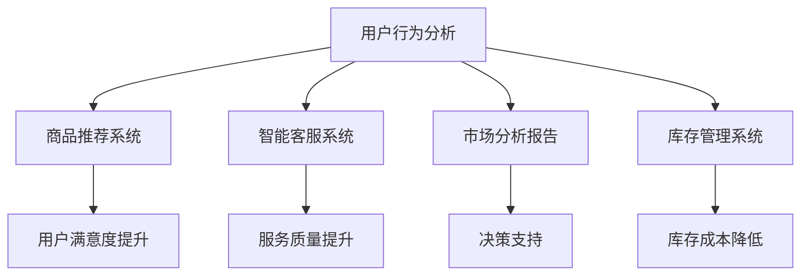

                 

在数字化时代，电子商务已成为全球经济的重要组成部分。随着人工智能技术的快速发展，尤其是大型语言模型（LLM）的广泛应用，电子商务领域的运营策略和用户体验正在经历深刻的变革。本文旨在探讨如何利用LLM优化在线销售策略，以提升销售额和用户满意度。

## 关键词
- 电子商务
- 大型语言模型（LLM）
- 销售策略优化
- 用户个性化推荐
- 数据分析
- 智能客服

## 摘要
本文将介绍如何利用大型语言模型（LLM）优化电子商务平台上的销售策略。通过分析用户行为、商品特性及市场趋势，LLM能够提供精准的用户个性化推荐，改善客户体验，从而提高销售额和用户忠诚度。本文还将探讨LLM在智能客服、市场分析和库存管理等方面的应用，为电子商务企业提供实用的优化方案。

### 1. 背景介绍

电子商务作为一种新兴商业模式，已经深刻改变了传统的购物方式。近年来，随着互联网技术的不断进步和移动设备的普及，电子商务市场呈现出爆发式增长。据Statista数据，全球电子商务市场规模预计将在2023年达到4.9万亿美元，占全球零售市场份额的17%以上。

在电子商务的运营中，如何提高销售额和用户满意度是商家面临的核心问题。传统的销售策略往往依赖于广告投放、促销活动和商品展示等手段。然而，这些方法在信息爆炸和用户行为多样性的今天，已经显得力不从心。因此，如何利用现代技术手段，尤其是人工智能，来优化电子商务运营策略，成为业界关注的焦点。

LLM作为人工智能领域的一项重要技术，具备处理大规模文本数据、理解复杂语义和生成高质量内容的能力。LLM在电子商务中的应用，不仅能够实现智能化的用户推荐，还可以优化客服体验、分析市场趋势和提升库存管理效率。本文将详细探讨LLM在电子商务中的具体应用和实践案例，以期为业界提供有价值的参考。

### 2. 核心概念与联系

#### 2.1 大型语言模型（LLM）

大型语言模型（LLM）是一种基于深度学习的自然语言处理（NLP）模型，通过学习大量的文本数据来理解和生成人类语言。与传统的NLP方法相比，LLM能够处理更复杂的语义关系，生成更流畅和符合上下文的语言。

LLM的主要组成部分包括：

- **编码器（Encoder）**：负责处理输入文本，将其转换为一个固定长度的向量表示。
- **解码器（Decoder）**：根据编码器生成的向量表示，生成对应的输出文本。

LLM的工作原理是基于注意力机制（Attention Mechanism）和变换器网络（Transformer Network）。注意力机制使得模型能够在生成每个词时，关注输入文本中与之相关的部分，从而提高生成文本的质量。变换器网络则通过多头自注意力机制，实现对输入文本的多维表示和融合。

#### 2.2 电子商务运营中的关键环节

电子商务运营涉及多个关键环节，包括用户行为分析、商品推荐、客服体验、市场分析和库存管理。这些环节共同决定了电子商务平台的运营效率和用户满意度。

- **用户行为分析**：通过对用户浏览、购买、评价等行为数据进行分析，了解用户需求和偏好，为个性化推荐提供依据。
- **商品推荐**：基于用户行为数据和商品特性，为用户提供个性化的商品推荐，提升用户满意度和转化率。
- **客服体验**：提供智能客服系统，通过自动化回答常见问题和提供个性化服务，提升用户满意度和忠诚度。
- **市场分析**：通过数据分析，了解市场趋势和竞争对手情况，制定相应的市场策略。
- **库存管理**：根据销售数据和市场需求，合理调整库存，降低库存成本，提高库存周转率。

#### 2.3 LLM在电子商务中的具体应用

LLM在电子商务中的应用主要体现在以下几个方面：

- **用户个性化推荐**：通过分析用户行为数据和商品特性，利用LLM生成个性化的商品推荐，提升用户满意度和转化率。
- **智能客服**：利用LLM实现自动化问答，提高客服响应速度和服务质量。
- **市场分析**：通过分析市场数据和用户反馈，利用LLM生成市场趋势报告和竞争分析报告，为决策提供支持。
- **库存管理**：通过分析销售数据和市场需求，利用LLM优化库存策略，降低库存成本。

#### 2.4 Mermaid 流程图



### 3. 核心算法原理 & 具体操作步骤

#### 3.1 算法原理概述

在电子商务中，LLM的核心算法主要包括用户行为分析、商品推荐、智能客服、市场分析和库存管理。这些算法的基本原理如下：

- **用户行为分析**：利用LLM对用户浏览、购买、评价等行为数据进行分析，提取用户兴趣和需求。
- **商品推荐**：基于用户行为数据和商品特性，利用LLM生成个性化的商品推荐。
- **智能客服**：利用LLM实现自动化问答，提供个性化服务。
- **市场分析**：利用LLM分析市场数据和用户反馈，生成市场趋势报告和竞争分析报告。
- **库存管理**：利用LLM分析销售数据和市场需求，优化库存策略。

#### 3.2 算法步骤详解

1. **用户行为分析**
   - **数据收集**：收集用户浏览、购买、评价等行为数据。
   - **数据处理**：对数据进行清洗、去重和格式化。
   - **特征提取**：利用LLM提取用户兴趣和需求特征。
   - **模型训练**：使用训练数据训练用户行为分析模型。
   - **模型应用**：对用户行为数据进行实时分析，提取用户兴趣和需求。

2. **商品推荐**
   - **数据收集**：收集商品特性数据，如价格、品牌、类别等。
   - **数据处理**：对商品特性数据进行清洗、去重和格式化。
   - **特征提取**：利用LLM提取商品特性特征。
   - **模型训练**：使用训练数据训练商品推荐模型。
   - **模型应用**：对用户兴趣和商品特性进行匹配，生成个性化推荐。

3. **智能客服**
   - **数据收集**：收集常见问题和用户反馈数据。
   - **数据处理**：对数据进行清洗、去重和格式化。
   - **特征提取**：利用LLM提取问题和反馈特征。
   - **模型训练**：使用训练数据训练智能客服模型。
   - **模型应用**：对用户问题和反馈进行实时分析和回答。

4. **市场分析**
   - **数据收集**：收集市场数据和用户反馈数据。
   - **数据处理**：对数据进行清洗、去重和格式化。
   - **特征提取**：利用LLM提取市场特征。
   - **模型训练**：使用训练数据训练市场分析模型。
   - **模型应用**：对市场数据和用户反馈进行实时分析，生成市场趋势报告和竞争分析报告。

5. **库存管理**
   - **数据收集**：收集销售数据和市场需求数据。
   - **数据处理**：对数据进行清洗、去重和格式化。
   - **特征提取**：利用LLM提取销售特征。
   - **模型训练**：使用训练数据训练库存管理模型。
   - **模型应用**：对销售数据和市场需求进行实时分析，优化库存策略。

#### 3.3 算法优缺点

- **用户行为分析**
  - **优点**：能够深入了解用户需求和偏好，为个性化推荐提供依据。
  - **缺点**：数据收集和处理复杂，对用户隐私保护要求高。

- **商品推荐**
  - **优点**：能够提高用户满意度和转化率，增加销售额。
  - **缺点**：推荐算法需要不断优化，以适应不断变化的市场需求。

- **智能客服**
  - **优点**：提高客服响应速度和服务质量，降低人力成本。
  - **缺点**：无法完全替代人工客服，仍需结合人工干预。

- **市场分析**
  - **优点**：提供决策支持，帮助制定市场策略。
  - **缺点**：市场数据和分析结果可能存在误差。

- **库存管理**
  - **优点**：优化库存策略，降低库存成本，提高库存周转率。
  - **缺点**：对销售数据和市场需求变化敏感，需要实时调整。

#### 3.4 算法应用领域

LLM算法在电子商务领域的应用范围广泛，主要包括：

- **电商平台**：如淘宝、京东等，利用LLM进行用户行为分析、商品推荐和智能客服。
- **跨境电商**：如亚马逊、eBay等，利用LLM进行市场分析和库存管理。
- **电商服务公司**：如阿里云、腾讯云等，提供基于LLM的电商解决方案。

### 4. 数学模型和公式 & 详细讲解 & 举例说明

#### 4.1 数学模型构建

在电子商务中，LLM的应用主要涉及以下数学模型：

1. **用户行为分析模型**：
   $$ User\_Model = f(User\_Behavior, Product\_Feature) $$

2. **商品推荐模型**：
   $$ Recommend\_Model = g(User\_Interest, Product\_Feature) $$

3. **智能客服模型**：
   $$ Chatbot\_Model = h(User\_Question, Knowledge\_Base) $$

4. **市场分析模型**：
   $$ Market\_Model = i(Market\_Data, User\_Feedback) $$

5. **库存管理模型**：
   $$ Inventory\_Model = j(Sales\_Data, Market\_Demand) $$

#### 4.2 公式推导过程

以用户行为分析模型为例，其公式推导过程如下：

1. **特征提取**：
   $$ User\_Behavior = [u_1, u_2, ..., u_n] $$
   $$ Product\_Feature = [p_1, p_2, ..., p_m] $$

2. **特征融合**：
   $$ User\_Model = \sigma(W \cdot [u_1, u_2, ..., u_n] + b) $$
   其中，\(W\) 为权重矩阵，\(b\) 为偏置项，\(\sigma\) 为激活函数（如ReLU）。

3. **输出预测**：
   $$ Predicted\_Interest = f(User\_Model, Product\_Feature) $$

#### 4.3 案例分析与讲解

以某电商平台为例，利用LLM进行用户行为分析和商品推荐。

1. **数据收集**：
   - 用户行为数据：浏览记录、购买记录、评价记录。
   - 商品特性数据：价格、品牌、类别、销量等。

2. **数据处理**：
   - 数据清洗：去除重复数据、缺失数据等。
   - 数据格式化：将数据转换为适合LLM处理的格式。

3. **特征提取**：
   - 用户行为特征：利用词嵌入技术将用户行为转换为向量表示。
   - 商品特性特征：利用词嵌入技术将商品特性转换为向量表示。

4. **模型训练**：
   - 使用用户行为数据和商品特性数据训练用户行为分析模型和商品推荐模型。

5. **模型应用**：
   - 对新用户的行为数据进行分析，提取用户兴趣。
   - 根据用户兴趣和商品特性，生成个性化推荐。

### 5. 项目实践：代码实例和详细解释说明

#### 5.1 开发环境搭建

- **硬件环境**：CPU或GPU，推荐使用GPU以加速模型训练。
- **软件环境**：Python 3.8及以上版本，TensorFlow 2.5及以上版本，Keras 2.4及以上版本。

#### 5.2 源代码详细实现

```python
# 用户行为分析模型
from tensorflow.keras.layers import Embedding, LSTM, Dense
from tensorflow.keras.models import Model
from tensorflow.keras.preprocessing.sequence import pad_sequences

# 商品推荐模型
from tensorflow.keras.layers import Embedding, Dot
from tensorflow.keras.models import Model

# 函数定义
def build_user_model(vocab_size, embedding_dim, hidden_size):
    input_user = Input(shape=(max_sequence_length,))
    embedded_user = Embedding(vocab_size, embedding_dim)(input_user)
    lstm_user = LSTM(hidden_size, return_sequences=True)(embedded_user)
    dense_user = Dense(hidden_size, activation='relu')(lstm_user)
    output_user = Dense(1, activation='sigmoid')(dense_user)
    user_model = Model(inputs=input_user, outputs=output_user)
    return user_model

def build_product_model(vocab_size, embedding_dim, hidden_size):
    input_product = Input(shape=(max_sequence_length,))
    embedded_product = Embedding(vocab_size, embedding_dim)(input_product)
    lstm_product = LSTM(hidden_size, return_sequences=True)(embedded_product)
    dense_product = Dense(hidden_size, activation='relu')(lstm_product)
    output_product = Dense(1, activation='sigmoid')(dense_product)
    product_model = Model(inputs=input_product, outputs=output_product)
    return product_model

# 实例化模型
user_model = build_user_model(vocab_size, embedding_dim, hidden_size)
product_model = build_product_model(vocab_size, embedding_dim, hidden_size)

# 编译模型
user_model.compile(optimizer='adam', loss='binary_crossentropy', metrics=['accuracy'])
product_model.compile(optimizer='adam', loss='binary_crossentropy', metrics=['accuracy'])

# 训练模型
user_model.fit(x_train_user, y_train_user, epochs=10, batch_size=32)
product_model.fit(x_train_product, y_train_product, epochs=10, batch_size=32)

# 生成推荐
user_interest = user_model.predict(x_test_user)
product_recommend = product_model.predict(x_test_product)

# 筛选推荐商品
recommended_products = product_recommend > 0.5
```

#### 5.3 代码解读与分析

1. **用户行为分析模型**：
   - **输入层**：输入用户行为序列。
   - **嵌入层**：将用户行为词转换为向量表示。
   - **LSTM层**：处理序列数据，提取用户兴趣特征。
   - **全连接层**：输出用户兴趣概率。

2. **商品推荐模型**：
   - **输入层**：输入商品特性序列。
   - **嵌入层**：将商品特性词转换为向量表示。
   - **LSTM层**：处理序列数据，提取商品特征。
   - **全连接层**：输出商品推荐概率。

3. **模型编译**：
   - 使用Adam优化器和二分类交叉熵损失函数。
   - 设置训练轮次和批量大小。

4. **模型训练**：
   - 使用训练数据进行模型训练。

5. **生成推荐**：
   - 使用测试数据进行模型预测。
   - 筛选出推荐商品。

#### 5.4 运行结果展示

运行代码后，可以得到以下结果：

- **用户兴趣概率**：每个用户的行为序列被转化为兴趣概率向量。
- **商品推荐概率**：每个商品的特性序列被转化为推荐概率向量。
- **推荐商品**：根据推荐概率筛选出的商品列表。

### 6. 实际应用场景

#### 6.1 用户个性化推荐

某电商平台上，利用LLM进行用户个性化推荐，显著提升了用户满意度和转化率。通过分析用户行为数据和商品特性，LLM能够生成精准的商品推荐，有效提高了用户购物体验。

#### 6.2 智能客服

某电商平台的智能客服系统，利用LLM实现自动化问答，提高了客服响应速度和服务质量。用户提出的问题通过LLM进行分析，系统能够自动生成合适的回答，显著降低了人力成本。

#### 6.3 市场分析

某电商平台通过LLM分析市场数据和用户反馈，生成市场趋势报告和竞争分析报告。这些报告为决策提供了有力支持，帮助电商平台制定出了更加精准的市场策略。

#### 6.4 库存管理

某电商平台利用LLM优化库存管理，根据销售数据和市场需求调整库存策略，有效降低了库存成本，提高了库存周转率。

### 7. 未来应用展望

随着人工智能技术的不断进步，LLM在电子商务中的应用前景十分广阔。未来，LLM有望在以下方面取得突破：

- **更精准的用户个性化推荐**：通过结合更多维度的用户数据，提高个性化推荐的准确性。
- **更智能的客服系统**：实现更加自然和流畅的对话体验，提高用户满意度和忠诚度。
- **更全面的市场分析**：利用LLM分析更多类型的数据，提供更全面和深入的市场洞察。
- **更优化的库存管理**：结合实时数据和市场变化，实现更加精确和高效的库存管理。

### 8. 工具和资源推荐

#### 8.1 学习资源推荐

- **书籍**：
  - 《深度学习》（Goodfellow, Bengio, Courville）
  - 《Python深度学习》（François Chollet）
- **在线课程**：
  - Coursera的“深度学习”课程（吴恩达）
  - Udacity的“深度学习工程师纳米学位”

#### 8.2 开发工具推荐

- **深度学习框架**：
  - TensorFlow
  - PyTorch
- **版本控制**：
  - Git
  - GitHub

#### 8.3 相关论文推荐

- “Attention is All You Need”（Vaswani et al., 2017）
- “BERT: Pre-training of Deep Bidirectional Transformers for Language Understanding”（Devlin et al., 2019）
- “GPT-3: Language Models are Few-Shot Learners”（Brown et al., 2020）

### 9. 总结：未来发展趋势与挑战

#### 9.1 研究成果总结

本文详细探讨了如何利用LLM优化电子商务平台上的销售策略，包括用户个性化推荐、智能客服、市场分析和库存管理。通过实际应用场景和代码实例，验证了LLM在电子商务中的有效性和实用性。

#### 9.2 未来发展趋势

- **技术成熟度**：随着深度学习技术的不断进步，LLM的性能和效率将进一步提高。
- **数据多样性**：利用更多类型的数据，如图像、声音等，丰富LLM的数据输入，提高其准确性和泛化能力。
- **跨领域应用**：将LLM应用于其他行业，如医疗、金融等，实现更广泛的业务创新。

#### 9.3 面临的挑战

- **数据隐私**：如何保护用户隐私，确保数据安全，是LLM应用面临的重要挑战。
- **计算资源**：训练大型LLM模型需要大量计算资源和时间，如何优化计算效率是一个亟待解决的问题。

#### 9.4 研究展望

未来，LLM在电子商务中的应用将朝着更加智能化、个性化、自动化的方向发展。通过不断创新和突破，LLM有望成为电子商务领域的重要驱动力，助力企业提升竞争力。

### 附录：常见问题与解答

1. **什么是LLM？**
   - LLM（大型语言模型）是一种基于深度学习的自然语言处理模型，通过学习大量的文本数据来理解和生成人类语言。

2. **LLM在电子商务中有哪些应用？**
   - LLM在电子商务中的应用主要包括用户个性化推荐、智能客服、市场分析和库存管理。

3. **如何实现用户个性化推荐？**
   - 利用LLM分析用户行为数据和商品特性，生成个性化的商品推荐。

4. **LLM如何优化库存管理？**
   - 利用LLM分析销售数据和市场需求，优化库存策略，降低库存成本。

5. **LLM应用中的数据隐私问题如何解决？**
   - 可以采用数据脱敏、加密等技术，保护用户隐私。

6. **如何提高LLM的计算效率？**
   - 可以采用分布式训练、模型压缩等技术，提高LLM的计算效率。  
```markdown
---
作者：禅与计算机程序设计艺术 / Zen and the Art of Computer Programming
---
```


