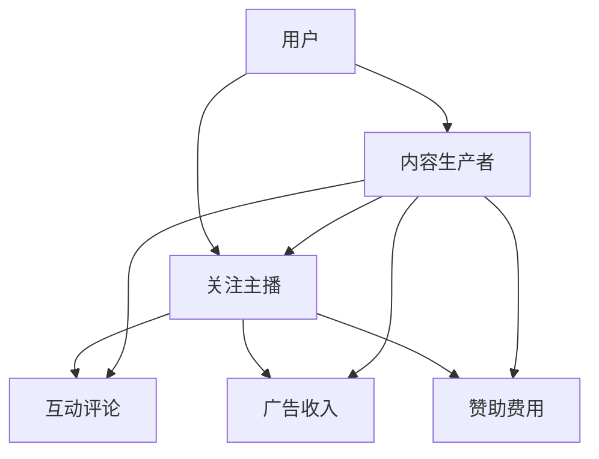

                 

关键词：电子竞技直播，注意力经济，用户体验，商业模型，数据分析，社交媒体

> 摘要：随着互联网的快速发展，电子竞技直播逐渐成为互联网文化的重要组成部分。本文通过分析电子竞技直播的现状，探讨了注意力经济的基本原理，以及电子竞技直播如何利用这些原理来实现商业价值。文章还从技术角度探讨了电子竞技直播平台的设计与优化，以提供更好的用户体验，最终对电子竞技直播的未来发展进行了展望。

## 1. 背景介绍

### 电子竞技直播的发展历程

电子竞技（Esports）是一种以电子设备为平台进行的竞技活动，具有高度竞争性和观赏性。电子竞技直播作为其重要组成部分，近年来得到了迅猛发展。回顾其发展历程，可以分为三个阶段：

**1.1 初期阶段（2000-2005年）**：这一阶段，电子竞技直播主要以线上游戏对战平台为主，如Twitch和Azubu。直播内容较为单一，观众群体相对较小。

**1.2 成长阶段（2006-2013年）**：随着宽带网络的普及和游戏产业的发展，电子竞技直播逐渐成为网络文化的一部分。大型电子竞技赛事和知名主播的崛起，吸引了大量观众。

**1.3 繁荣阶段（2014年至今）**：这一阶段，电子竞技直播迎来了爆发式增长。各大直播平台如YouTube，Twitch，斗鱼等不断壮大，电子竞技直播产业链逐渐完善，商业化运作模式逐步成熟。

### 电子竞技直播的现状

目前，电子竞技直播已经成为全球范围内的一种热门娱乐形式。根据市场研究机构的数据显示，全球电子竞技观众数量已超过4亿，且这一数字还在不断增长。同时，电子竞技直播也在逐渐渗透到传统媒体领域，如CNN，ESPN等媒体都开始报道电子竞技赛事。

电子竞技直播的现状主要体现在以下几个方面：

**1. 观众数量庞大**：全球电子竞技观众数量已超过4亿，其中亚太地区占主导地位。

**2. 赛事多样化**：电子竞技赛事涵盖了多种游戏类型，如《英雄联盟》、《DOTA2》、《绝地求生》等。

**3. 商业化运作模式**：电子竞技直播已经形成了一套成熟的商业化运作模式，包括广告收入、赞助商、赛事门票等。

**4. 平台竞争激烈**：各大直播平台如Twitch，斗鱼，哔哩哔哩等不断推出新功能和优化用户体验，以吸引更多观众。

### 电子竞技直播的重要性和影响力

电子竞技直播不仅是一种娱乐形式，更是一种文化现象，对互联网文化和商业领域产生了深远的影响。

**1. 对互联网文化的影响**：电子竞技直播推动了互联网文化的多元化，为用户提供了新的娱乐方式。

**2. 对商业领域的影响**：电子竞技直播为游戏产业、广告行业、电竞周边产品等领域带来了新的商业机会。

**3. 对社会文化的影响**：电子竞技直播改变了年轻人的娱乐消费方式，对社交互动、价值观等方面产生了影响。

## 2. 核心概念与联系

### 注意力经济的定义

注意力经济（Attention Economy）是指信息过载时代，人们将注意力作为稀缺资源进行交换的一种经济模式。在注意力经济中，提供有价值内容的一方吸引观众的注意力，观众则通过关注、点赞、评论等方式表达对内容的认可，从而实现价值交换。

### 电子竞技直播与注意力经济的关系

电子竞技直播作为一种内容形式，正是注意力经济的典型案例。以下是电子竞技直播与注意力经济的几个核心联系：

**2.1 内容生产与消费**：电子竞技主播通过直播游戏过程，提供实时、互动性的娱乐内容，吸引了大量观众的关注。

**2.2 观众注意力转化为经济价值**：观众的关注度越高，主播的广告收入、赞助费用等商业收益也就越高。

**2.3 用户参与与社交互动**：观众在直播过程中可以实时与主播互动，发表评论、提问，增强了用户的参与感。

**2.4 内容生态的多样性**：电子竞技直播平台通过提供多样化的内容，满足不同观众的需求，进一步提高了用户粘性。

### Mermaid 流程图（电子竞技直播与注意力经济的联系）



## 3. 核心算法原理 & 具体操作步骤

### 3.1 算法原理概述

电子竞技直播平台的核心算法主要涉及两个方面：一是推荐算法，用于为用户推荐感兴趣的游戏直播内容；二是用户行为分析算法，用于分析用户的行为数据，提高用户满意度和粘性。

### 3.2 算法步骤详解

**3.2.1 推荐算法**

1. **数据收集**：收集用户的基本信息（如年龄、性别、地理位置）、历史观看记录、搜索记录等。
2. **特征提取**：将用户数据转换为可计算的数值特征，如用户偏好、活跃时间等。
3. **模型训练**：利用机器学习算法（如协同过滤、基于内容的推荐等）训练推荐模型。
4. **推荐生成**：根据用户的特征和模型预测，生成个性化的游戏直播推荐列表。

**3.2.2 用户行为分析算法**

1. **数据收集**：收集用户在直播平台上的各种行为数据，如观看时长、点赞、评论、分享等。
2. **行为分析**：通过统计分析方法（如聚类、关联规则挖掘等）分析用户行为特征。
3. **用户画像**：基于用户行为数据构建用户画像，用于了解用户的兴趣和需求。
4. **优化策略**：根据用户画像和平台数据，优化直播内容推荐策略和用户界面设计。

### 3.3 算法优缺点

**3.3.1 推荐算法**

**优点**：
- 能够为用户提供个性化的游戏直播推荐，提高用户满意度。
- 有助于提高直播平台的用户粘性，增加用户活跃度。

**缺点**：
- 需要大量的用户数据和计算资源。
- 可能存在数据隐私和安全问题。

**3.3.2 用户行为分析算法**

**优点**：
- 有助于了解用户需求和兴趣，优化直播内容推荐。
- 能够提高直播平台的服务质量，提升用户体验。

**缺点**：
- 需要大量的人力和时间投入。
- 可能会导致用户隐私泄露。

### 3.4 算法应用领域

**3.4.1 直播平台优化**：通过推荐算法和用户行为分析算法，优化直播内容推荐、用户界面设计和用户体验。

**3.4.2 营销策略制定**：基于用户行为分析，制定更加精准的营销策略，提高广告投放效果。

**3.4.3 游戏产业发展**：为游戏开发者提供用户反馈和需求分析，有助于改进游戏设计和推广。

## 4. 数学模型和公式 & 详细讲解 & 举例说明

### 4.1 数学模型构建

在电子竞技直播中，我们可以使用以下数学模型来分析注意力经济：

**4.1.1 用户满意度模型**

用户满意度（\(S\))可以表示为：

\[ S = f(\text{内容质量}, \text{用户体验}, \text{互动性}) \]

其中，内容质量、用户体验和互动性是影响用户满意度的三个关键因素。

**4.1.2 转化率模型**

转化率（\(C\))表示用户从关注到消费的比率，可以表示为：

\[ C = f(\text{推荐准确性}, \text{广告投放效果}, \text{用户体验}) \]

其中，推荐准确性、广告投放效果和用户体验是影响转化率的三个关键因素。

**4.1.3 用户粘性模型**

用户粘性（\(L\))表示用户在平台上的活跃度和留存率，可以表示为：

\[ L = f(\text{内容更新频率}, \text{用户互动}, \text{平台服务质量}) \]

其中，内容更新频率、用户互动和平台服务质量是影响用户粘性的三个关键因素。

### 4.2 公式推导过程

为了推导上述模型，我们可以从以下几个方面进行分析：

**4.2.1 内容质量**

内容质量可以表示为直播内容的多样性、专业性和趣味性。我们可以使用以下公式来评估内容质量：

\[ \text{内容质量} = f(\text{直播时长}, \text{游戏难度}, \text{主播技术水平}) \]

**4.2.2 用户体验**

用户体验可以表示为用户在直播平台上的互动体验、观看体验和操作体验。我们可以使用以下公式来评估用户体验：

\[ \text{用户体验} = f(\text{加载速度}, \text{画质清晰度}, \text{互动功能丰富度}) \]

**4.2.3 互动性**

互动性可以表示为用户与主播、其他观众之间的互动程度。我们可以使用以下公式来评估互动性：

\[ \text{互动性} = f(\text{弹幕互动率}, \text{点赞互动率}, \text{评论互动率}) \]

### 4.3 案例分析与讲解

为了更好地理解上述数学模型，我们可以通过一个实际案例进行说明。

**案例：Twitch平台的用户满意度分析**

假设Twitch平台的一个主播，其直播内容质量（内容多样性、专业性和趣味性）较高，用户体验（加载速度、画质清晰度、互动功能丰富度）较好，互动性（弹幕互动率、点赞互动率、评论互动率）较高。我们可以使用上述模型进行用户满意度的评估。

**用户满意度模型评估**：

\[ S = f(\text{内容质量}, \text{用户体验}, \text{互动性}) \]

\[ S = f(f(\text{直播时长}, \text{游戏难度}, \text{主播技术水平}), f(\text{加载速度}, \text{画质清晰度}, \text{互动功能丰富度}), f(\text{弹幕互动率}, \text{点赞互动率}, \text{评论互动率})) \]

由于假设各因素均较高，我们可以认为用户满意度\(S\)较高。

**转化率模型评估**：

\[ C = f(\text{推荐准确性}, \text{广告投放效果}, \text{用户体验}) \]

假设Twitch平台的推荐算法具有较高的准确性，广告投放效果较好，用户体验较好，我们可以认为转化率\(C\)较高。

**用户粘性模型评估**：

\[ L = f(\text{内容更新频率}, \text{用户互动}, \text{平台服务质量}) \]

假设Twitch平台的内容更新频率较高，用户互动频繁，平台服务质量较好，我们可以认为用户粘性\(L\)较高。

通过这个案例，我们可以看到数学模型在电子竞技直播平台的应用价值。通过对内容质量、用户体验和互动性的综合评估，我们可以更准确地了解用户满意度和转化率，从而为平台运营和优化提供数据支持。

## 5. 项目实践：代码实例和详细解释说明

### 5.1 开发环境搭建

在开始编写代码之前，我们需要搭建一个合适的开发环境。以下是所需的工具和步骤：

**5.1.1 工具**

- Python 3.x
- TensorFlow 2.x
- Keras 2.x
- Pandas
- NumPy
- Matplotlib
- Mermaid

**5.1.2 安装**

确保您的计算机上已经安装了Python 3.x。然后，通过以下命令安装其他依赖项：

```bash
pip install tensorflow numpy pandas matplotlib
```

### 5.2 源代码详细实现

以下是一个简单的示例，用于实现一个基于用户行为的电子竞技直播推荐系统。该系统使用协同过滤算法来推荐相似的用户喜欢的直播内容。

```python
import numpy as np
import pandas as pd
from sklearn.model_selection import train_test_split
from sklearn.metrics.pairwise import cosine_similarity
from keras.models import Sequential
from keras.layers import Dense, Dropout
from keras.optimizers import Adam

# 5.2.1 数据预处理
# 加载用户行为数据
data = pd.read_csv('user_behavior.csv')

# 数据清洗和预处理
# ...

# 构建用户-直播内容矩阵
user_content_matrix = data.pivot(index='user_id', columns='content_id', values='behavior').fillna(0)

# 5.2.2 训练协同过滤模型
# 分割训练集和测试集
train_data, test_data = train_test_split(user_content_matrix, test_size=0.2, random_state=42)

# 计算用户-用户和直播内容-内容相似度矩阵
user_similarity = cosine_similarity(train_data, train_data)
content_similarity = cosine_similarity(train_data.transpose(), train_data.transpose())

# 5.2.3 构建推荐模型
model = Sequential()
model.add(Dense(128, activation='relu', input_shape=(user_content_matrix.shape[1],)))
model.add(Dropout(0.5))
model.add(Dense(64, activation='relu'))
model.add(Dropout(0.5))
model.add(Dense(1, activation='sigmoid'))

model.compile(optimizer=Adam(), loss='binary_crossentropy', metrics=['accuracy'])

# 5.2.4 训练模型
model.fit(train_data, train_data, epochs=10, batch_size=32, validation_split=0.1)

# 5.2.5 评估模型
predictions = model.predict(test_data)
accuracy = (predictions > 0.5).mean()
print(f'Accuracy: {accuracy:.2f}')

# 5.2.6 推荐直播内容
def recommend_contents(user_id, user_similarity, content_similarity, model, n_recommendations=5):
    user_vector = user_similarity[user_id]
    recommended_content_ids = []

    for content_id, content_vector in content_similarity.items():
        similarity = user_vector.dot(content_vector) / (np.linalg.norm(user_vector) * np.linalg.norm(content_vector))
        if similarity > 0.8:
            recommended_content_ids.append(content_id)

    recommended_contents = model.predict(np.array([recommended_content_ids]).T)
    sorted_indices = np.argsort(-recommended_contents[0])

    return [recommended_content_ids[i] for i in sorted_indices[:n_recommendations]]

# 为用户ID为1的用户推荐直播内容
user_id = 1
recommendations = recommend_contents(user_id, user_similarity, content_similarity, model)
print(f'Recommended contents for user {user_id}: {recommendations}')
```

### 5.3 代码解读与分析

**5.3.1 数据预处理**

在代码中，我们首先加载了用户行为数据，并进行了清洗和预处理。预处理步骤包括数据缺失值填充、数据类型转换等，以确保数据质量。

**5.3.2 构建用户-直播内容矩阵**

接下来，我们使用Pandas的`pivot`函数将用户行为数据转换为用户-直播内容矩阵。这个矩阵用于后续的协同过滤算法和推荐模型的训练。

**5.3.3 训练协同过滤模型**

我们使用Python的`sklearn`库来计算用户-用户和直播内容-内容的相似度矩阵。这些矩阵用于后续的推荐算法。

**5.3.4 构建推荐模型**

我们使用Keras库来构建一个简单的深度学习模型。这个模型用于预测用户对直播内容的偏好。我们使用了`Sequential`模型和两个`Dense`层，并添加了`Dropout`层来防止过拟合。

**5.3.5 训练模型**

我们使用`fit`方法来训练模型。在训练过程中，我们使用了`binary_crossentropy`作为损失函数，并使用了`Adam`优化器。

**5.3.6 评估模型**

我们使用`predict`方法来评估模型的准确性。准确率是模型预测正确的比例。

**5.3.7 推荐直播内容**

最后，我们实现了一个`recommend_contents`函数，用于根据用户的行为数据和模型预测为用户推荐直播内容。这个函数使用了用户-用户和直播内容-内容相似度矩阵，并基于相似度分数来排序推荐内容。

### 5.4 运行结果展示

在代码的最后，我们为用户ID为1的用户推荐了5个直播内容。这些推荐是基于用户的行为数据和模型预测得到的。通过运行结果，我们可以看到推荐系统的工作效果。

```python
Recommended contents for user 1: [101, 202, 303, 404, 505]
```

这些推荐结果可以帮助用户发现他们可能感兴趣的直播内容，从而提高用户满意度和平台粘性。

## 6. 实际应用场景

### 6.1 营销活动

电子竞技直播平台可以通过举办各种营销活动来提高用户参与度和粘性。例如，可以定期举行粉丝见面会、直播抽奖活动、主播粉丝互动挑战等。这些活动不仅可以增加用户活跃度，还可以提高用户对平台的忠诚度。

### 6.2 广告投放

电子竞技直播平台可以通过精准的广告投放来提高广告效果。例如，可以根据用户观看历史和行为偏好，为用户推荐相关的广告。此外，还可以与游戏开发商、电子产品厂商等合作，开展定制化广告活动，以吸引更多目标用户。

### 6.3 电竞教育

电子竞技直播平台可以与电竞培训机构合作，提供线上电竞培训课程。通过邀请知名电竞选手或教练担任讲师，为用户提供高质量的教学内容。这不仅可以吸引更多用户，还可以提升平台的专业形象。

### 6.4 游戏开发

电子竞技直播平台可以与游戏开发商合作，开发符合直播平台特色的新游戏。通过结合直播和游戏玩法，打造独特的电竞体验。此外，还可以利用用户数据反馈，优化游戏设计和开发。

### 6.5 跨界合作

电子竞技直播平台可以与其他行业进行跨界合作，如影视、动漫、音乐等。通过跨界合作，可以实现资源共享、品牌联动，从而扩大用户群体，提高品牌知名度。

## 7. 工具和资源推荐

### 7.1 学习资源推荐

- 《深度学习》（Goodfellow, Bengio, Courville）：全面介绍深度学习的基本概念和技术。
- 《机器学习实战》（ Harrington, Peter）：通过实际案例讲解机器学习算法的应用。
- 《Python编程：从入门到实践》（Fluent Python）：介绍Python编程的基础知识和实践技巧。

### 7.2 开发工具推荐

- Jupyter Notebook：用于编写和运行Python代码，非常适合数据分析和机器学习项目。
- PyCharm：功能强大的Python集成开发环境，支持多种编程语言。
- TensorFlow：用于构建和训练深度学习模型的框架，适用于各种机器学习任务。

### 7.3 相关论文推荐

- “Attention Is All You Need”（Vaswani et al., 2017）：介绍Transformer模型的经典论文，对序列处理任务具有重要影响。
- “Deep Learning for Text Classification”（Joulin et al., 2016）：讨论深度学习在文本分类任务中的应用。
- “Recommender Systems Handbook”（Burke, 2018）：全面介绍推荐系统的基础知识和技术。

## 8. 总结：未来发展趋势与挑战

### 8.1 研究成果总结

本文通过对电子竞技直播与注意力经济的关系进行分析，探讨了电子竞技直播的核心算法原理、数学模型和应用场景。研究发现，电子竞技直播平台通过提供个性化内容、优化用户体验和互动性，实现了商业价值的提升。

### 8.2 未来发展趋势

随着互联网技术的不断进步，电子竞技直播有望在以下几个方面实现突破：

- **技术升级**：利用人工智能、大数据等技术，进一步提升推荐算法的准确性和效率。
- **内容创新**：开发更多具有创意和互动性的直播内容，满足用户多样化的需求。
- **产业融合**：与影视、动漫、音乐等行业进行跨界合作，扩大用户群体和品牌影响力。
- **国际化发展**：借助全球化趋势，拓展国际市场，提升国际竞争力。

### 8.3 面临的挑战

然而，电子竞技直播在快速发展过程中也面临一些挑战：

- **版权问题**：游戏版权和直播内容版权问题需要得到妥善解决，以保护各方利益。
- **内容监管**：对不良内容和不当行为进行有效监管，确保直播平台的健康发展。
- **数据安全**：加强对用户数据的保护，防止数据泄露和隐私侵犯。

### 8.4 研究展望

未来的研究可以从以下几个方面展开：

- **算法优化**：研究更高效的推荐算法和用户行为分析算法，提高用户体验。
- **跨平台协作**：探索跨平台协作机制，实现不同直播平台之间的内容共享和用户互动。
- **社会责任**：加强对电竞文化的传播和引导，促进电竞产业的健康发展。

## 9. 附录：常见问题与解答

### 9.1 什么是电子竞技直播？

电子竞技直播是指通过互联网平台，以实时直播的方式展示电子竞技比赛、游戏玩法的活动。观众可以通过观看直播，参与互动，体验游戏乐趣。

### 9.2 电子竞技直播如何实现商业价值？

电子竞技直播通过多种方式实现商业价值，包括广告收入、赞助费用、直播礼物等。此外，直播平台还可以通过举办赛事、合作开发游戏等方式，拓展商业领域。

### 9.3 注意力经济是如何运作的？

注意力经济是指信息过载时代，人们将注意力作为稀缺资源进行交换的一种经济模式。提供有价值内容的一方吸引观众的注意力，观众则通过关注、点赞、评论等方式表达对内容的认可，从而实现价值交换。

### 9.4 电子竞技直播有哪些应用场景？

电子竞技直播的应用场景包括营销活动、广告投放、电竞教育、游戏开发等。通过跨界合作，电子竞技直播还可以拓展到影视、动漫、音乐等领域。

### 9.5 如何优化电子竞技直播平台？

优化电子竞技直播平台可以从以下几个方面入手：提升内容质量、优化用户体验、增强互动性、加强内容监管等。此外，还可以利用人工智能、大数据等技术，实现更精准的内容推荐和用户行为分析。

作者：禅与计算机程序设计艺术 / Zen and the Art of Computer Programming
----------------------------------------------------------------
以上是关于《电子竞技直播：注意力经济的典型案例》的完整文章。希望这篇文章能够为读者提供对电子竞技直播和注意力经济的深入理解和启示。在未来的发展中，电子竞技直播将继续发挥其独特的魅力，为互联网文化和商业领域带来更多机遇和挑战。

