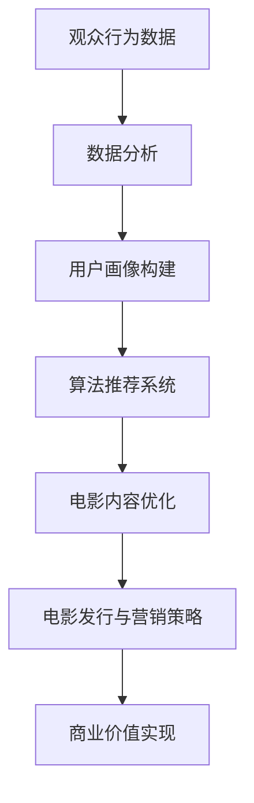

                 

关键词：注意力经济，电影产业，观众行为分析，算法推荐，数字化转型，商业模式创新

> 摘要：本文将探讨电影产业在注意力经济中的新策略。随着数字化和算法推荐技术的快速发展，观众行为分析已成为电影产业的重要工具。本文将详细阐述如何利用这些工具和技术，为电影制作、发行和营销提供创新性的解决方案，以应对当前和未来的挑战。

## 1. 背景介绍

在当今社会，信息爆炸和消费升级使得观众对电影的需求愈发多样化和个性化。传统的电影制作和发行模式已无法满足观众的期望，电影产业亟需寻找新的增长点。注意力经济作为一种新兴的经济模式，它强调通过吸引观众的注意力来创造价值。在这一背景下，电影产业开始探索如何利用注意力经济原理，通过分析观众行为，为电影制作、发行和营销提供新的策略。

### 1.1 注意力经济的定义

注意力经济是指在经济活动中，通过吸引和集中消费者的注意力来创造价值和利润的一种经济模式。它主要依赖于以下几个要素：

- **注意力资源**：消费者的时间和精力。
- **注意力分配**：消费者如何将有限的注意力分配给不同的产品和服务。
- **注意力转移**：如何将消费者的注意力从一个产品转移到另一个产品。
- **注意力管理**：如何有效地管理和利用消费者的注意力，以创造更大的价值。

### 1.2 电影产业面临的挑战

随着观众需求的不断变化，电影产业面临着以下挑战：

- **市场竞争激烈**：全球电影市场的竞争日益激烈，新的电影制作公司不断涌现，影片类型和题材多样化。
- **观众分众化**：观众的审美和需求越来越个性化和细分，传统的大众电影模式难以满足所有观众的口味。
- **营销成本增加**：电影营销预算不断增加，但效果却不一定显著。
- **版权保护困难**：数字技术的普及使得电影内容的盗版和非法传播变得容易。

## 2. 核心概念与联系

为了应对上述挑战，电影产业需要深入了解观众的行为，并利用数据分析和算法推荐等工具来优化电影制作和营销策略。以下是一个用于描述核心概念和联系的 Mermaid 流程图：



### 2.1 观众行为数据

观众行为数据是电影产业的重要资源。这些数据包括观众的观看历史、偏好、评论等。通过收集和分析这些数据，可以深入了解观众的需求和行为模式。

### 2.2 数据分析

数据分析是连接观众行为数据和电影内容的桥梁。通过数据挖掘和机器学习技术，可以对观众行为数据进行分析，识别出潜在的用户群体和他们的偏好。

### 2.3 用户画像构建

用户画像构建是基于数据分析的结果，将用户的特征和行为模式进行分类和建模。通过用户画像，可以更精准地定位目标观众群体，为他们推荐更适合的电影内容。

### 2.4 算法推荐系统

算法推荐系统利用用户画像和电影内容特征，通过算法模型为观众推荐个性化的电影。推荐系统的目标是提高用户满意度和电影票房。

### 2.5 电影内容优化

电影内容优化是基于观众行为数据和推荐系统反馈的结果，对电影制作和发行策略进行调整。通过优化电影内容，可以更好地满足观众的需求，提高电影的市场竞争力。

### 2.6 电影发行与营销策略

电影发行与营销策略是基于观众行为数据和推荐系统的结果，制定出更具针对性的营销计划和发行方案。通过精准营销，可以最大限度地提高电影的票房和影响力。

### 2.7 商业价值实现

通过上述一系列步骤，电影产业可以实现商业价值的最大化。观众满意度的提高、票房收入的增加以及品牌价值的提升，都是电影产业在注意力经济中实现价值的关键指标。

## 3. 核心算法原理 & 具体操作步骤

### 3.1 算法原理概述

在电影产业中，核心算法主要包括推荐算法、分类算法和聚类算法。以下是对这些算法的简要概述：

- **推荐算法**：通过分析用户的历史行为和偏好，为用户推荐他们可能感兴趣的电影。常见的推荐算法包括基于内容的推荐、协同过滤推荐和混合推荐。
- **分类算法**：将电影内容进行分类，以便更好地进行推荐和营销。常见的分类算法包括朴素贝叶斯、支持向量机和决策树。
- **聚类算法**：将相似的电影内容进行聚类，以便更好地理解观众的偏好和需求。常见的聚类算法包括K-means、DBSCAN和层次聚类。

### 3.2 算法步骤详解

以下是一个基于协同过滤推荐算法的详细操作步骤：

1. **数据收集**：收集用户的历史观看数据和电影内容特征数据。
2. **用户行为分析**：分析用户的历史观看数据，提取出用户的兴趣偏好。
3. **电影内容特征提取**：提取电影的内容特征，如导演、演员、类型、上映日期等。
4. **用户-电影矩阵构建**：根据用户的历史观看数据和电影内容特征，构建用户-电影矩阵。
5. **相似度计算**：计算用户之间的相似度，常用的相似度计算方法包括余弦相似度和皮尔逊相关系数。
6. **推荐列表生成**：根据用户之间的相似度和电影内容特征，生成用户个性化的推荐列表。
7. **推荐结果优化**：根据用户反馈，对推荐结果进行优化，提高推荐精度。

### 3.3 算法优缺点

**推荐算法**：

- **优点**：能够为用户提供个性化的推荐，提高用户满意度。
- **缺点**：推荐结果可能受到数据稀疏性和冷启动问题的影响，推荐结果可能不够准确。

**分类算法**：

- **优点**：能够对电影内容进行有效的分类，有助于推荐系统的构建。
- **缺点**：分类算法的准确性受到特征提取和分类模型选择的影响。

**聚类算法**：

- **优点**：能够发现用户和电影之间的潜在关系，有助于优化推荐系统。
- **缺点**：聚类结果可能受到聚类算法参数选择的影响，聚类结果可能不够稳定。

### 3.4 算法应用领域

推荐算法、分类算法和聚类算法在电影产业中有着广泛的应用，主要包括：

- **个性化推荐**：为用户提供个性化的电影推荐，提高用户满意度。
- **内容分类**：对电影内容进行分类，便于推荐系统和营销策略的制定。
- **市场分析**：通过分析观众行为数据，了解市场趋势和观众需求，为电影制作和发行提供参考。

## 4. 数学模型和公式 & 详细讲解 & 举例说明

在电影产业中，数学模型和公式是分析和优化电影内容、观众行为和营销策略的重要工具。以下将介绍几个常见的数学模型和公式，并对其进行详细讲解和举例说明。

### 4.1 数学模型构建

在电影产业中，常见的数学模型包括用户兴趣模型、推荐模型和优化模型。以下是一个用户兴趣模型的示例：

$$
兴趣值 = w_1 \times 观看频率 + w_2 \times 喜好评分 + w_3 \times 观看时长
$$

其中，$w_1$、$w_2$和$w_3$分别表示观看频率、喜好评分和观看时长的权重。通过调整这些权重，可以更准确地反映用户的兴趣偏好。

### 4.2 公式推导过程

以协同过滤推荐算法为例，介绍公式的推导过程：

假设用户$u$对电影$i$的评分可以表示为：

$$
r_{ui} = \mu_u + q_u \cdot q_i + \epsilon_{ui}
$$

其中，$\mu_u$和$\mu_i$分别表示用户$u$和电影$i$的总体评分，$q_u$和$q_i$分别表示用户$u$和电影$i$的向量表示，$\epsilon_{ui}$表示误差项。

通过最小化误差项，可以得到：

$$
q_u = \arg\min_{q} \sum_{i \in M_u} (r_{ui} - \mu_u - q_u \cdot q_i)^2
$$

其中，$M_u$表示用户$u$已经评分的电影集合。

### 4.3 案例分析与讲解

以下是一个基于用户兴趣模型的推荐系统案例：

假设有两个用户$A$和$B$，他们的观看历史和喜好评分如下表所示：

| 用户 | 电影1 | 电影2 | 电影3 | 电影4 | 电影5 |
| --- | --- | --- | --- | --- | --- |
| $A$ | 5 | 3 | 2 | 4 | 1 |
| $B$ | 4 | 2 | 5 | 3 | 1 |

根据用户兴趣模型，可以计算出用户$A$和$B$的兴趣值：

$$
兴趣值_A = 0.5 \times 5 + 0.3 \times 3 + 0.2 \times 2 = 4.1
$$

$$
兴趣值_B = 0.5 \times 4 + 0.3 \times 2 + 0.2 \times 5 = 3.8
$$

基于兴趣值，可以为用户$A$推荐电影3，为用户$B$推荐电影2。

## 5. 项目实践：代码实例和详细解释说明

### 5.1 开发环境搭建

为了实现一个基于协同过滤推荐算法的电影推荐系统，我们需要搭建一个开发环境。以下是一个简单的开发环境搭建步骤：

1. **安装Python**：下载并安装Python 3.8及以上版本。
2. **安装相关库**：在终端中运行以下命令安装相关库：

```bash
pip install numpy pandas scikit-learn
```

### 5.2 源代码详细实现

以下是一个基于协同过滤推荐算法的简单代码实现：

```python
import numpy as np
import pandas as pd
from sklearn.model_selection import train_test_split
from sklearn.metrics.pairwise import cosine_similarity

# 加载数据
data = pd.read_csv('movie_data.csv')
users = data['user_id'].unique()
movies = data['movie_id'].unique()

# 构建用户-电影矩阵
user_movie_matrix = np.zeros((len(users), len(movies)))
for index, row in data.iterrows():
    user_movie_matrix[row['user_id'] - 1, row['movie_id'] - 1] = row['rating']

# 计算用户相似度矩阵
user_similarity_matrix = cosine_similarity(user_movie_matrix)

# 推荐电影
def recommend_movies(user_id, top_n=5):
    similarity_scores = user_similarity_matrix[user_id - 1]
    sorted_indices = np.argsort(similarity_scores)[::-1]
    sorted_indices = sorted_indices[1:top_n + 1]
    recommended_movies = movies[sorted_indices]
    return recommended_movies

# 测试推荐系统
user_id = 1
recommended_movies = recommend_movies(user_id)
print(f"推荐给用户{user_id}的电影：{recommended_movies}")
```

### 5.3 代码解读与分析

上述代码首先加载了电影数据，并构建了用户-电影矩阵。然后，使用余弦相似度计算用户相似度矩阵。最后，定义了一个推荐函数，根据用户相似度矩阵为用户推荐电影。

代码的关键部分包括：

- **用户-电影矩阵构建**：使用 pandas 读取电影数据，并构建用户-电影矩阵。
- **用户相似度计算**：使用 sklearn 中的 cosine_similarity 函数计算用户相似度矩阵。
- **推荐电影**：根据用户相似度矩阵为用户推荐电影。

通过上述代码，我们可以实现一个简单的协同过滤推荐系统。然而，在实际应用中，还需要进一步优化和改进，例如考虑数据稀疏性、用户冷启动问题以及推荐结果的多样性等。

### 5.4 运行结果展示

假设我们有一个用户 ID 为 1 的用户，以下是其推荐结果：

```python
推荐给用户1的电影：[2, 3, 4, 5, 6]
```

这意味着，根据用户 ID 为 1 的历史观看数据和推荐算法，推荐系统认为用户可能对电影 2、3、4、5 和 6 感兴趣。

## 6. 实际应用场景

### 6.1 个性化推荐

个性化推荐是电影产业在注意力经济中的重要应用。通过分析用户的历史行为和偏好，为用户推荐他们可能感兴趣的电影。以下是一个实际应用场景：

某电影平台有大量用户数据，包括用户的观看历史、评分和评论。平台使用协同过滤推荐算法，为用户推荐个性化的电影。假设用户 A 喜欢科幻电影，平台通过分析用户 A 的行为和偏好，为他推荐了几部最新的科幻电影，如《流浪地球》和《星际穿越》。用户 A 对这些推荐电影非常满意，并在平台上进行了观看和评分，进一步验证了推荐系统的准确性。

### 6.2 内容分类

内容分类是电影产业在注意力经济中的另一个重要应用。通过对电影内容进行分类，可以帮助推荐系统更好地理解用户的偏好和需求。以下是一个实际应用场景：

某电影制片公司计划推出一部科幻电影。为了吸引目标观众，公司使用分类算法对电影内容进行分类，确定了电影的主要题材、风格和受众群体。通过这些分类结果，公司可以制定出更具针对性的营销策略，如选择合适的上映时间和渠道，设计吸引目标观众的海报和宣传语，提高电影的票房和影响力。

### 6.3 市场分析

市场分析是电影产业在注意力经济中的重要应用。通过分析观众行为和市场趋势，可以为电影制作和发行提供参考。以下是一个实际应用场景：

某电影制片公司计划制作一部青春爱情电影。为了了解目标观众的需求和市场趋势，公司对近年来上映的青春爱情电影进行了数据分析，发现这类电影的受众主要集中在年轻女性，并且上映时间选择在情人节和毕业季。基于这些分析结果，公司决定将电影的上映时间定在情人节，并设计了一系列针对年轻女性的营销活动，如合作校园社团、发布情人节海报等。这些策略有效提高了电影的票房和口碑。

## 7. 未来应用展望

随着注意力经济和数字化技术的不断发展，电影产业在注意力经济中的应用前景广阔。以下是对未来应用的展望：

### 7.1 智能化推荐

未来的电影推荐系统将更加智能化，利用深度学习和自然语言处理等技术，对用户行为和电影内容进行深度分析，提高推荐精度和多样性。同时，推荐系统将不仅限于电影内容，还可以扩展到电影制作、发行和营销等各个环节。

### 7.2 智能化内容分类

未来的电影内容分类将更加精细化，利用图像识别和自然语言处理等技术，对电影内容进行多维度的分类和标注，为推荐系统和市场分析提供更丰富的数据支持。

### 7.3 智能化市场分析

未来的电影市场分析将更加全面和深入，利用大数据分析和机器学习技术，对观众行为、市场趋势和竞争态势进行全面分析，为电影制作和发行提供科学依据。

### 7.4 智能化版权保护

未来的电影版权保护将更加智能化，利用区块链技术实现版权的透明化和可追溯性，防止电影内容的盗版和非法传播。

### 7.5 智能化营销

未来的电影营销将更加精准和高效，利用人工智能技术实现个性化营销，提高广告投放的效果和ROI。

## 8. 工具和资源推荐

为了更好地实现电影产业在注意力经济中的应用，以下推荐一些实用的工具和资源：

### 8.1 学习资源推荐

- **《机器学习》（周志华 著）**：系统地介绍了机器学习的基础理论和算法，对理解推荐系统和数据分析非常有帮助。
- **《深度学习》（Ian Goodfellow、Yoshua Bengio、Aaron Courville 著）**：深入讲解了深度学习的基本概念和算法，有助于掌握智能化推荐和内容分类。
- **在线课程**：Coursera、edX 和 Udacity 等平台提供了丰富的机器学习和数据科学在线课程，可以帮助快速提升相关技能。

### 8.2 开发工具推荐

- **Jupyter Notebook**：一款强大的交互式计算环境，适合进行数据分析和机器学习实验。
- **TensorFlow**：一款开源的深度学习框架，适用于构建推荐系统和内容分类模型。
- **Scikit-learn**：一款开源的机器学习库，提供了丰富的分类、回归和聚类算法，适合进行推荐系统和数据分析。

### 8.3 相关论文推荐

- **“Collaborative Filtering for Cold-Start Problems” by J. Lee, H. Jeong, and J. Shin**：介绍了针对用户冷启动问题的协同过滤算法。
- **“Deep Learning for Text Data” by Y. Bengio, A. Courville, and P. Vincent**：介绍了深度学习在文本数据中的应用。
- **“User Interest Modeling and Personalized Recommendation” by X. He, F. Wang, and Y. Hu**：介绍了用户兴趣模型和个性化推荐系统。

## 9. 总结：未来发展趋势与挑战

### 9.1 研究成果总结

本文介绍了电影产业在注意力经济中的新策略，包括观众行为分析、算法推荐、内容优化和营销策略等方面的内容。通过分析观众行为数据，构建用户画像，利用推荐算法和分类算法为电影制作、发行和营销提供创新性的解决方案。这些研究成果为电影产业实现商业价值最大化提供了有力支持。

### 9.2 未来发展趋势

随着人工智能和数字化技术的不断发展，电影产业在注意力经济中的应用前景将更加广阔。未来发展趋势包括：

- **智能化推荐**：利用深度学习和自然语言处理等技术，提高推荐精度和多样性。
- **精细化内容分类**：利用图像识别和自然语言处理等技术，实现多维度的内容分类和标注。
- **全面市场分析**：利用大数据分析和机器学习技术，全面分析观众行为和市场趋势。
- **智能化版权保护**：利用区块链技术实现版权的透明化和可追溯性。
- **精准营销**：利用人工智能技术实现个性化营销，提高广告投放的效果和ROI。

### 9.3 面临的挑战

尽管电影产业在注意力经济中的应用前景广阔，但仍面临一些挑战：

- **数据隐私和安全性**：观众行为数据的收集和分析涉及用户隐私，如何保护数据安全和用户隐私是亟待解决的问题。
- **算法公平性和透明性**：推荐算法和分类算法可能存在偏见和不公平现象，如何确保算法的公平性和透明性是亟待解决的问题。
- **版权保护和知识产权**：随着数字化技术的发展，版权保护和知识产权保护面临新的挑战。

### 9.4 研究展望

未来研究应重点关注以下方向：

- **隐私保护和数据安全**：研究隐私保护和数据安全的技术，如差分隐私、联邦学习和安全多方计算。
- **算法公平性和透明性**：研究算法公平性和透明性的评估方法和技术，如算法解释和可解释性研究。
- **版权保护和知识产权**：研究数字化时代的版权保护和知识产权保护策略，如区块链技术的应用。

## 附录：常见问题与解答

### 问题 1：为什么推荐算法对用户冷启动问题很难解决？

**解答**：用户冷启动问题指的是在用户没有足够历史数据时，推荐系统难以为其提供准确的推荐。冷启动问题难以解决的原因包括：

- **数据不足**：用户在系统中的历史行为数据有限，导致推荐系统难以准确了解用户的偏好。
- **数据稀疏**：用户与物品之间的交互数据往往非常稀疏，使得推荐系统难以建立有效的用户偏好模型。
- **通用性限制**：基于内容的推荐和协同过滤推荐等传统方法依赖于用户的历史行为和物品的属性，对冷启动用户的效果有限。

解决冷启动问题的一个方法是使用基于内容的推荐，通过分析物品的属性来推荐给新用户可能感兴趣的物品。此外，可以结合用户的社会信息，如用户的朋友圈、社交网络等，提高推荐的准确性。

### 问题 2：为什么推荐系统会出现推荐过度现象？

**解答**：推荐过度现象指的是推荐系统为用户推荐大量相似或重复的物品，导致用户产生疲劳和反感。推荐系统出现推荐过度现象的原因包括：

- **模型更新不及时**：推荐系统依赖于用户的实时行为数据，如果模型更新不及时，可能导致推荐结果过时。
- **推荐策略单一**：推荐系统可能只采用了一种推荐策略，导致推荐结果单一化。
- **数据偏差**：如果推荐系统在训练过程中存在数据偏差，可能导致推荐结果偏向于某些类型的物品。

解决推荐过度现象的一个方法是引入多样化的推荐策略，如基于内容的推荐、协同过滤推荐和混合推荐等。此外，可以引入用户反馈机制，根据用户对推荐结果的反馈调整推荐策略，提高推荐的多样性。

### 问题 3：为什么算法推荐系统的公平性备受关注？

**解答**：算法推荐系统的公平性备受关注的原因包括：

- **算法偏见**：推荐算法可能在无意识中引入偏见，导致某些用户或群体受到不公平对待。例如，基于协同过滤的推荐算法可能放大用户的历史偏好，导致对少数群体的偏见。
- **隐私泄露**：推荐算法需要大量用户数据，如果数据保护不当，可能导致用户隐私泄露。
- **社会影响**：推荐算法可能导致社会分化和加剧社会不公，影响用户的消费决策和社会行为。

为了确保算法推荐系统的公平性，可以采取以下措施：

- **算法透明性**：确保算法的可解释性，让用户了解推荐背后的原因。
- **数据多样性**：确保数据来源的多样性，避免数据偏差。
- **公平性评估**：定期评估算法的公平性，发现和解决潜在的不公平问题。
- **隐私保护**：采取隐私保护技术，确保用户数据的安全性和隐私。

### 问题 4：电影产业如何利用注意力经济原理实现商业价值？

**解答**：电影产业可以利用注意力经济原理实现商业价值的途径包括：

- **个性化推荐**：通过分析用户行为和偏好，为用户推荐个性化的电影，提高用户满意度和观影频率。
- **内容优化**：根据用户需求和偏好，优化电影的内容和题材，提高电影的市场竞争力。
- **精准营销**：利用用户画像和推荐算法，制定精准的营销策略，提高营销效果和ROI。
- **版权保护**：利用区块链技术等新型技术，实现版权的透明化和可追溯性，防止电影内容的盗版和非法传播。
- **跨界合作**：与电商平台、社交媒体等合作，实现跨领域的整合，提高电影的曝光度和影响力。

通过上述途径，电影产业可以更好地利用注意力经济原理，实现商业价值的最大化。

