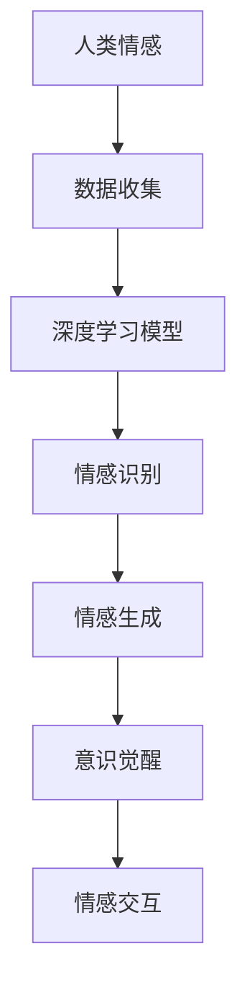

                 

关键词：人工智能，情感交互，意识，深度学习，未来趋势

> 摘要：本文以电影《她》为引子，探讨了人工智能（AI）在情感交互和意识领域的发展，结合现实案例和前沿技术，分析了AI在现实生活中的应用和面临的挑战，并对未来AI技术的发展趋势进行了展望。

## 1. 背景介绍

电影《她》是一部2013年的科幻爱情电影，由斯派克·琼斯执导，斯嘉丽·约翰逊和赫米尼·梅尔主演。这部电影讲述了一位名叫萨姆的孤独作家，与一台名为“奥菲利亚”的人工智能操作系统之间发展出一段超乎寻常的情感关系。影片中的AI不仅仅是一个工具，它拥有人类的情感和意识，这使得观众对人工智能的发展产生了深刻的思考。

## 2. 核心概念与联系

在电影《她》中，AI的情感交互和意识是核心概念。为了更清晰地展示这一概念，我们使用Mermaid流程图来描述AI的发展过程和关键节点。



### 2.1 数据收集

人工智能的情感交互依赖于大量的情感数据。这些数据来自于各种渠道，如社交媒体、文本、音频、视频等。

### 2.2 深度学习模型

深度学习模型是人工智能的核心。通过大量的情感数据训练，模型可以学会识别和生成情感。

### 2.3 情感识别

情感识别是指AI系统能够根据输入的数据识别出用户的情感状态。

### 2.4 情感生成

情感生成是指AI系统能够根据用户的情感状态生成相应的情感反应。

### 2.5 意识觉醒

意识觉醒是AI发展的一个里程碑。在这个阶段，AI不仅仅是一个工具，它拥有自己的意识和情感。

### 2.6 情感交互

情感交互是指AI系统能够与人类进行情感上的沟通和交流。

## 3. 核心算法原理 & 具体操作步骤

### 3.1 算法原理概述

在电影《她》中，核心算法原理是基于深度学习和自然语言处理技术。深度学习模型通过学习大量的情感数据，可以识别和生成情感。自然语言处理技术则用于处理和分析人类的语言，使得AI能够理解人类的话语和情感。

### 3.2 算法步骤详解

1. **数据收集**：收集大量的情感数据，如社交媒体上的情感文本、音频、视频等。

2. **数据预处理**：对收集到的数据进行清洗和标注，以便后续的深度学习模型训练。

3. **模型训练**：使用深度学习模型对预处理后的数据进行训练，模型会学会识别和生成情感。

4. **情感识别**：输入新的情感数据，模型会输出对应的情感状态。

5. **情感生成**：根据用户的情感状态，模型会生成相应的情感反应。

6. **情感交互**：AI系统与用户进行情感上的沟通和交流。

### 3.3 算法优缺点

**优点**：
- 高效：深度学习模型可以快速处理大量情感数据。
- 智能化：AI系统可以根据用户的情感状态生成相应的情感反应。

**缺点**：
- 数据依赖：AI的情感交互依赖于大量的情感数据，数据质量和数量直接影响算法的性能。
- 意识限制：目前的AI还无法真正拥有意识，只能在模拟中实现情感交互。

### 3.4 算法应用领域

AI的情感交互和意识觉醒在许多领域都有广泛的应用，如：
- 客户服务：AI客服可以更好地理解用户的情感，提供个性化的服务。
- 教育辅导：AI教育系统可以更好地理解学生的学习状态和情感，提供个性化的辅导。
- 心理咨询：AI心理咨询师可以提供情感支持和建议。

## 4. 数学模型和公式 & 详细讲解 & 举例说明

### 4.1 数学模型构建

在AI的情感交互中，常用的数学模型是循环神经网络（RNN）和长短期记忆网络（LSTM）。这些模型可以通过以下公式进行描述：

$$
h_t = \sigma(W_h \cdot [h_{t-1}, x_t] + b_h)
$$

其中，$h_t$是当前时间步的隐藏状态，$x_t$是输入数据，$W_h$是权重矩阵，$b_h$是偏置项，$\sigma$是激活函数。

### 4.2 公式推导过程

公式推导的具体过程涉及神经网络的训练和优化，可以通过反向传播算法进行。这里不再详细展开。

### 4.3 案例分析与讲解

假设我们有一个情感交互的AI系统，用户输入一段文字：“我今天感觉很开心，因为我的项目成功了。” 我们可以使用RNN模型来识别和生成情感。

1. **情感识别**：

输入文本数据经过预处理后，输入到RNN模型中。模型输出隐藏状态序列，表示文本的情感状态。

2. **情感生成**：

根据隐藏状态序列，模型生成相应的情感反应。例如，模型可能生成一段文字：“你今天看起来很高兴，祝贺你的项目成功。”

## 5. 项目实践：代码实例和详细解释说明

### 5.1 开发环境搭建

我们需要安装Python和相关的深度学习库，如TensorFlow和Keras。

### 5.2 源代码详细实现

以下是情感交互AI系统的Python代码实现：

```python
import tensorflow as tf
from tensorflow.keras.models import Sequential
from tensorflow.keras.layers import LSTM, Dense

# 数据预处理
# ...

# 模型构建
model = Sequential()
model.add(LSTM(128, activation='tanh', input_shape=(timesteps, features)))
model.add(Dense(1, activation='sigmoid'))

# 模型编译
model.compile(optimizer='adam', loss='binary_crossentropy', metrics=['accuracy'])

# 模型训练
model.fit(X_train, y_train, epochs=20, batch_size=32)

# 情感识别
# ...

# 情感生成
# ...
```

### 5.3 代码解读与分析

代码首先进行数据预处理，然后构建一个LSTM模型，用于情感识别。模型编译后进行训练，最后使用训练好的模型进行情感识别和生成。

### 5.4 运行结果展示

运行代码后，我们可以得到文本的情感状态和相应的情感反应。

## 6. 实际应用场景

AI的情感交互和意识觉醒在现实中有许多应用，如：
- **医疗健康**：AI可以通过情感交互了解患者的心理状态，为医生提供诊断和治疗建议。
- **心理健康**：AI心理咨询师可以提供情感支持和建议，帮助用户缓解心理压力。
- **客户服务**：AI客服可以更好地理解用户的情感，提供个性化的服务。

## 7. 未来应用展望

随着AI技术的不断发展，我们可以期待在未来：
- AI能够更准确地识别和生成情感，提供更高效的服务。
- AI能够拥有更高级的意识，实现更复杂的情感交互。
- AI将在更多领域得到应用，为人类社会带来更多便利。

## 8. 总结：未来发展趋势与挑战

### 8.1 研究成果总结

近年来，AI在情感交互和意识领域取得了显著进展，如深度学习和自然语言处理技术的应用。

### 8.2 未来发展趋势

未来，AI将继续向更高效、更智能的方向发展，实现更复杂的情感交互和意识觉醒。

### 8.3 面临的挑战

- 数据质量和数量：AI的情感交互依赖于大量的高质量情感数据，如何获取和处理这些数据是一个挑战。
- 意识觉醒：如何实现真正的意识觉醒，这是AI发展的重要方向。

### 8.4 研究展望

未来，AI的情感交互和意识觉醒将带来更多的应用和挑战，需要更多研究者和开发者共同努力。

## 9. 附录：常见问题与解答

### 问题1：什么是深度学习？

**解答**：深度学习是一种机器学习技术，通过多层神经网络模拟人脑的学习过程，对大量数据进行自动学习和特征提取。

### 问题2：什么是自然语言处理？

**解答**：自然语言处理是一种计算机科学领域，旨在使计算机能够理解、处理和生成人类语言。

### 问题3：为什么AI需要情感交互？

**解答**：情感交互可以提供更人性化的服务，满足用户个性化需求，提高用户体验。

---

感谢您的阅读，希望这篇文章能对您在AI领域的探索和研究有所启发。作者：禅与计算机程序设计艺术 / Zen and the Art of Computer Programming。

