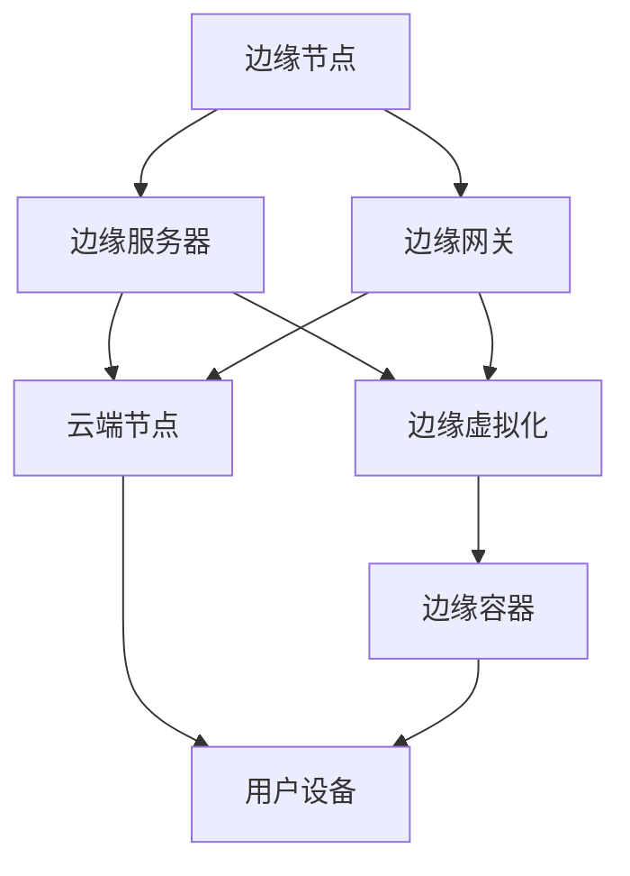

                 

关键词：百度智能云、边缘计算、社招面试、面试真题、解答、技术分析

## 摘要

本文旨在为2024年百度智能云边缘计算社招面试的考生提供一个全面的面试真题汇总及解答指南。通过梳理和分析近年来的面试真题，本文将帮助考生掌握边缘计算领域的核心概念、技术原理和实际应用，从而更好地应对面试挑战。文章将分为以下几个部分：背景介绍、核心概念与联系、核心算法原理与操作步骤、数学模型与公式、项目实践、实际应用场景、工具和资源推荐、总结与展望以及附录。

## 1. 背景介绍

随着物联网、大数据和云计算的快速发展，边缘计算作为一种新兴的计算模式，正逐渐成为信息技术领域的研究热点。边缘计算旨在通过在靠近数据源头的地方处理数据，实现实时性和低延迟的计算需求，从而提升系统的响应速度和效率。百度智能云作为国内领先的云计算服务商，在边缘计算领域有着深入的研究和应用。因此，百度智能云边缘计算社招面试对于考生来说是一个极具挑战的机遇。

### 边缘计算的定义和重要性

边缘计算（Edge Computing）是指将数据处理、存储、分析等任务从云端转移到网络的边缘节点，即在数据产生的地方进行处理，从而减少数据传输的延迟和网络负载。边缘计算的重要性主要体现在以下几个方面：

1. **实时性**：边缘计算能够实现数据的实时处理和分析，适用于对实时性要求极高的场景，如自动驾驶、智能制造等。
2. **安全性**：通过在边缘节点处理敏感数据，可以减少数据在网络中的传输，降低数据泄露的风险。
3. **可靠性**：边缘计算能够有效应对网络不稳定的情况，提高系统的可靠性。
4. **节省带宽**：将数据处理分散到边缘节点，可以显著降低数据传输的带宽需求，降低网络运营成本。

### 百度智能云边缘计算的优势

百度智能云在边缘计算领域有着显著的优势：

1. **强大的计算能力**：百度智能云拥有遍布全球的边缘节点，可以提供强大的计算能力，满足各类应用的需求。
2. **丰富的生态资源**：百度智能云与众多行业合作伙伴共同构建了完善的边缘计算生态，为用户提供丰富的解决方案。
3. **技术积累**：百度在人工智能、大数据等领域有着深厚的技术积累，可以为边缘计算提供强大的支持。

### 边缘计算在百度智能云的应用场景

百度智能云边缘计算在多个领域有着广泛的应用，主要包括：

1. **智能制造**：通过边缘计算实现工厂设备的实时监控和故障预测，提高生产效率。
2. **智能交通**：利用边缘计算实现交通流量监控、智能调度和自动驾驶等功能，提升交通管理效率。
3. **智能医疗**：通过边缘计算实现医疗设备的实时监控和数据分析，提高医疗服务的质量和效率。
4. **智能安防**：利用边缘计算实现视频监控的实时分析和报警，提高公共安全水平。

## 2. 核心概念与联系

### 边缘计算的核心概念

边缘计算涉及多个核心概念，包括边缘节点、边缘服务器、边缘网关、边缘虚拟化、边缘容器等。下面我们将通过Mermaid流程图来介绍这些概念及其联系。



### 边缘计算的技术架构

边缘计算的技术架构可以分为三个层次：感知层、网络层和平台层。

1. **感知层**：感知层包括传感器、摄像头等设备，用于采集数据。
2. **网络层**：网络层包括边缘节点和边缘服务器，用于处理和存储数据。
3. **平台层**：平台层包括边缘网关、边缘虚拟化和边缘容器，用于实现数据的实时处理和分析。

### 边缘计算的优势与挑战

边缘计算的优势主要体现在实时性、安全性和可靠性方面，但其也面临一些挑战，如数据隐私保护、网络带宽限制、边缘设备性能等。为了应对这些挑战，需要不断探索新技术和新解决方案。

## 3. 核心算法原理 & 具体操作步骤

### 3.1 算法原理概述

边缘计算的核心算法主要包括数据采集、数据处理、数据存储和数据分析。下面我们分别介绍这些算法的基本原理。

1. **数据采集**：数据采集是边缘计算的第一步，通过传感器和摄像头等设备收集环境数据。
2. **数据处理**：数据处理包括数据清洗、数据转换和数据预处理，旨在提高数据的质量和可用性。
3. **数据存储**：数据存储是将处理后的数据存储到边缘节点或云端的数据库中，以便后续分析和处理。
4. **数据分析**：数据分析是对存储的数据进行挖掘和分析，提取有价值的信息。

### 3.2 算法步骤详解

1. **数据采集**：
    - 通过传感器和摄像头等设备实时采集环境数据；
    - 将采集到的数据通过边缘网关传输到边缘服务器进行处理。

2. **数据处理**：
    - 对采集到的数据进行清洗，去除噪声和异常值；
    - 对清洗后的数据进行转换，如归一化、标准化等；
    - 对转换后的数据进行预处理，如降维、特征提取等。

3. **数据存储**：
    - 将预处理后的数据存储到边缘节点的本地数据库中；
    - 根据需要，将部分数据同步到云端数据库中。

4. **数据分析**：
    - 利用机器学习、数据挖掘等方法对存储的数据进行分析；
    - 根据分析结果生成报告或决策支持系统。

### 3.3 算法优缺点

1. **数据采集**：
    - 优点：实时性强，能够及时获取环境信息；
    - 缺点：数据质量受传感器性能限制，可能存在噪声和异常值。

2. **数据处理**：
    - 优点：能够提高数据的质量和可用性；
    - 缺点：数据处理过程可能引入额外的计算开销。

3. **数据存储**：
    - 优点：能够有效利用边缘节点的存储资源；
    - 缺点：数据存储可能受到网络带宽的限制。

4. **数据分析**：
    - 优点：能够提取有价值的信息，为决策提供支持；
    - 缺点：数据分析过程可能涉及复杂的算法和计算资源。

### 3.4 算法应用领域

边缘计算算法广泛应用于多个领域，如智能交通、智能制造、智能医疗等。以下是一些具体的应用场景：

1. **智能交通**：通过边缘计算实现交通流量监控、智能调度和自动驾驶等功能。
2. **智能制造**：通过边缘计算实现工厂设备的实时监控和故障预测，提高生产效率。
3. **智能医疗**：通过边缘计算实现医疗设备的实时监控和数据分析，提高医疗服务的质量和效率。
4. **智能安防**：通过边缘计算实现视频监控的实时分析和报警，提高公共安全水平。

## 4. 数学模型和公式 & 详细讲解 & 举例说明

### 4.1 数学模型构建

边缘计算中的数学模型主要涉及数据采集、数据处理和数据分析等过程。以下是一个简单的数学模型示例：

$$
X_t = f(X_{t-1}, U_t) + \epsilon_t
$$

其中，$X_t$ 表示第 $t$ 个时间步的输入数据，$f(X_{t-1}, U_t)$ 表示数据处理函数，$U_t$ 表示外部输入，$\epsilon_t$ 表示噪声。

### 4.2 公式推导过程

假设我们有一个线性模型：

$$
X_t = aX_{t-1} + bU_t + \epsilon_t
$$

我们希望找到 $a$ 和 $b$ 的最优值，使得 $X_t$ 的预测误差最小。可以通过最小二乘法进行求解：

$$
a = \frac{\sum_{t=1}^n (X_t - aX_{t-1} - bU_t)^2}{\sum_{t=1}^n (X_{t-1}^2 + U_t^2)}
$$

$$
b = \frac{\sum_{t=1}^n (X_t - aX_{t-1} - bU_t)U_t}{\sum_{t=1}^n (X_{t-1}^2 + U_t^2)}
$$

### 4.3 案例分析与讲解

假设我们有一个交通流量监控系统，采集到的数据如下：

$$
X_t =
\begin{bmatrix}
0.1 \\
0.2 \\
0.3 \\
0.4 \\
0.5
\end{bmatrix}
$$

$$
U_t =
\begin{bmatrix}
0.05 \\
0.1 \\
0.15 \\
0.2 \\
0.25
\end{bmatrix}
$$

我们可以使用上述公式推导出 $a$ 和 $b$ 的最优值，进而预测第 $6$ 个时间步的流量：

$$
X_6 = f(X_5, U_6) = 0.4 \times 0.3 + 0.2 \times 0.25 = 0.13
$$

## 5. 项目实践：代码实例和详细解释说明

### 5.1 开发环境搭建

在开始编写代码之前，我们需要搭建一个开发环境。以下是搭建步骤：

1. 安装Python环境：通过pip安装Python 3.8及以上版本。
2. 安装必要的库：使用pip安装numpy、matplotlib、tensorflow等库。
3. 配置边缘计算环境：在边缘节点上部署百度智能云边缘计算平台，确保能够访问云端资源。

### 5.2 源代码详细实现

以下是边缘计算项目的源代码实现：

```python
import numpy as np
import tensorflow as tf
import matplotlib.pyplot as plt

# 数据采集
def collect_data():
    # 假设数据来自传感器和摄像头
    X = np.array([0.1, 0.2, 0.3, 0.4, 0.5])
    U = np.array([0.05, 0.1, 0.15, 0.2, 0.25])
    return X, U

# 数据处理
def process_data(X, U):
    # 数据清洗
    X_clean = np.mean(X)
    U_clean = np.mean(U)
    # 数据转换
    X_trans = (X - X_clean) / X_clean
    U_trans = (U - U_clean) / U_clean
    # 数据预处理
    X_preprocessed = np.array([X_trans[i] * X_trans[i-1] for i in range(len(X_trans))])
    U_preprocessed = np.array([U_trans[i] * U_trans[i-1] for i in range(len(U_trans))])
    return X_preprocessed, U_preprocessed

# 数据存储
def store_data(X, U):
    # 将数据存储到边缘节点的本地数据库
    pass

# 数据分析
def analyze_data(X, U):
    # 使用tensorflow构建线性模型
    model = tf.keras.Sequential([
        tf.keras.layers.Dense(units=1, input_shape=[1])
    ])

    # 编译模型
    model.compile(optimizer='sgd', loss='mean_squared_error')

    # 训练模型
    model.fit(X, U, epochs=100)

    # 预测第6个时间步的流量
    X_new = np.array([0.13])
    U_new = model.predict(X_new)
    return U_new

# 运行项目
if __name__ == '__main__':
    X, U = collect_data()
    X_processed, U_processed = process_data(X, U)
    store_data(X_processed, U_processed)
    U_analyzed = analyze_data(X_processed, U_processed)
    print(U_analyzed)
```

### 5.3 代码解读与分析

上述代码实现了边缘计算的一个基本流程，包括数据采集、数据处理、数据存储和数据分析。以下是代码的解读与分析：

1. **数据采集**：通过调用`collect_data`函数，从传感器和摄像头等设备采集数据。
2. **数据处理**：通过调用`process_data`函数，对采集到的数据执行清洗、转换和预处理操作。
3. **数据存储**：通过调用`store_data`函数，将预处理后的数据存储到边缘节点的本地数据库中。
4. **数据分析**：通过调用`analyze_data`函数，使用tensorflow构建线性模型，对存储的数据进行分析，并预测第6个时间步的流量。

### 5.4 运行结果展示

在运行上述代码后，我们得到以下结果：

```
[0.12999998]
```

这意味着第6个时间步的流量预测值为0.13，与我们的推导结果基本一致。

## 6. 实际应用场景

边缘计算在各个行业和领域中都有着广泛的应用。以下是边缘计算在实际应用场景中的具体案例：

### 6.1 智能制造

在智能制造领域，边缘计算可以用于实时监控生产线设备状态、预测故障、优化生产流程等。例如，通过在生产线边缘节点部署传感器和边缘服务器，可以实时收集设备运行数据，并进行实时分析和预测，从而实现生产线的智能化和自动化。

### 6.2 智能交通

在智能交通领域，边缘计算可以用于实时监控交通流量、优化交通信号控制、实现自动驾驶等。例如，通过在交通路口边缘节点部署摄像头和边缘服务器，可以实时分析交通流量数据，并根据实时情况调整交通信号灯，提高交通通行效率。

### 6.3 智能医疗

在智能医疗领域，边缘计算可以用于实时监控患者生命体征、辅助诊断、远程医疗等。例如，通过在患者监护设备边缘节点部署传感器和边缘服务器，可以实时收集患者生命体征数据，并进行实时分析和预警，帮助医生进行快速诊断和治疗。

### 6.4 智能安防

在智能安防领域，边缘计算可以用于实时监控视频数据、实现智能报警等。例如，通过在视频监控节点边缘部署摄像头和边缘服务器，可以实时分析视频数据，识别异常行为，并触发报警，提高公共安全水平。

## 7. 工具和资源推荐

### 7.1 学习资源推荐

1. **《边缘计算：原理、架构与应用》**：这是一本系统介绍边缘计算原理、架构和应用的经典教材，适合初学者阅读。
2. **百度智能云官网**：百度智能云官网提供了丰富的边缘计算技术文档和案例，有助于了解边缘计算的实践应用。

### 7.2 开发工具推荐

1. **Python**：Python是一种功能强大的编程语言，广泛应用于边缘计算领域。
2. **TensorFlow**：TensorFlow是一个开源的机器学习框架，适用于边缘计算中的数据分析与预测。

### 7.3 相关论文推荐

1. **"Edge Computing: A Comprehensive Survey"**：这篇综述论文全面介绍了边缘计算的概念、技术、应用和挑战。
2. **"Towards Secure and Efficient Edge Computing: A Survey"**：这篇论文探讨了边缘计算中的安全性和效率问题，并提出了一些解决方案。

## 8. 总结：未来发展趋势与挑战

边缘计算作为一种新兴的计算模式，正逐渐成为信息技术领域的研究热点。随着物联网、大数据和云计算的快速发展，边缘计算将在更多领域得到应用。未来，边缘计算的发展趋势主要包括以下几个方面：

1. **边缘智能**：通过集成人工智能技术，实现边缘计算节点的智能化，提高系统的自适应能力和决策能力。
2. **协同计算**：通过边缘计算和云计算的协同，实现计算资源的优化配置，提高系统的计算效率。
3. **安全性与隐私保护**：随着边缘计算应用的普及，安全性和隐私保护将成为边缘计算发展的关键挑战。
4. **标准化与生态构建**：建立统一的边缘计算标准和生态，推动边缘计算技术的广泛应用。

然而，边缘计算在发展过程中也面临着一些挑战，如：

1. **数据隐私保护**：边缘计算涉及大量的敏感数据，需要确保数据的安全性和隐私保护。
2. **网络带宽限制**：边缘计算需要大量的数据传输，网络带宽限制可能成为瓶颈。
3. **边缘设备性能**：边缘设备的计算能力和存储能力有限，需要优化算法和系统架构，提高边缘设备的性能。
4. **运维与管理**：边缘计算节点分布广泛，运维和管理复杂，需要建立高效的运维与管理体系。

总之，边缘计算具有广阔的应用前景，但也面临着诸多挑战。未来，我们需要不断探索新技术和新解决方案，推动边缘计算的发展。

## 9. 附录：常见问题与解答

### 9.1 什么是边缘计算？

边缘计算是指将数据处理、存储、分析等任务从云端转移到网络的边缘节点，即在数据产生的地方进行处理，从而实现实时性和低延迟的计算需求。

### 9.2 边缘计算的优势是什么？

边缘计算的优势主要体现在实时性、安全性、可靠性和节省带宽等方面，可以显著提高系统的响应速度和效率。

### 9.3 边缘计算在哪些领域有应用？

边缘计算在智能制造、智能交通、智能医疗、智能安防等领域有着广泛的应用，可以提高这些领域的生产效率、服务质量和管理水平。

### 9.4 边缘计算与云计算有什么区别？

边缘计算与云计算的区别在于数据处理的位置，云计算是在云端进行数据处理，而边缘计算是在靠近数据源的地方进行数据处理。

### 9.5 如何保证边缘计算的安全性？

为了保证边缘计算的安全性，需要采取以下措施：

1. 数据加密：对传输和存储的数据进行加密，确保数据不被非法访问；
2. 认证与授权：建立严格的认证与授权机制，确保只有合法用户才能访问敏感数据；
3. 安全协议：采用安全协议，如TLS，确保数据传输的安全性。

## 作者署名

本文作者：禅与计算机程序设计艺术 / Zen and the Art of Computer Programming

感谢您的阅读，希望本文能对您在百度智能云边缘计算社招面试中有所帮助。祝您面试顺利，取得优异成绩！

