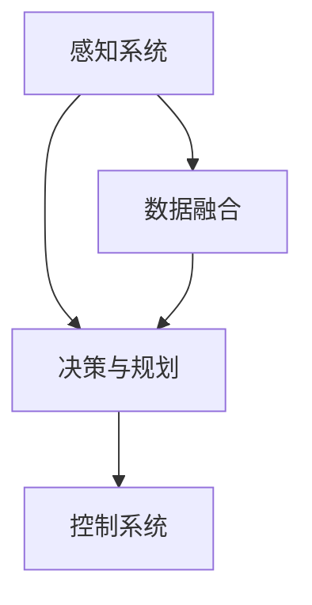

                 

关键词：自动驾驶、人工智能、算法面试、技术解析、智能驾驶2025、算法原理

> 摘要：本文将深入解析百度智能驾驶2025社招自动驾驶算法面试题集，包括核心概念、算法原理、数学模型、项目实践等方面，为有意向投身自动驾驶领域的读者提供全面的指导。文章旨在帮助读者理解自动驾驶技术的核心原理，掌握面试技巧，为职业发展打下坚实基础。

## 1. 背景介绍

随着科技的飞速发展，自动驾驶技术已经成为人工智能领域的研究热点。百度作为中国自动驾驶技术的领军企业，其在自动驾驶算法的研究与应用上取得了显著的成果。百度智能驾驶2025社招自动驾驶算法面试题集，正是为了选拔具备高水平自动驾驶算法技能的人才而精心准备的。本文将围绕这一题集，深入剖析其中的核心技术问题，帮助读者了解自动驾驶领域的最新动态和发展趋势。

## 2. 核心概念与联系

### 2.1 自动驾驶等级

在自动驾驶领域，国际公路联盟（ITRP）将自动驾驶分为五个等级，从0级到5级。0级完全由人类驾驶，而5级完全由自动驾驶系统控制。在面试中，了解并区分这些等级是基础。

### 2.2 感知系统

感知系统是自动驾驶的核心部分，负责收集环境信息。主要包括摄像头、激光雷达（LiDAR）、毫米波雷达和超声波传感器等。这些感知系统通过数据融合技术，实现对周围环境的全面感知。

### 2.3 决策与规划

决策与规划系统负责根据感知系统的输入，做出行驶决策并规划行驶路径。这包括路径规划、避障决策、车道保持等。

### 2.4 控制系统

控制系统根据决策与规划系统的指令，控制车辆的加速、制动和转向等动作，确保车辆按照规划路径行驶。

### 2.5 Mermaid 流程图



## 3. 核心算法原理 & 具体操作步骤

### 3.1 算法原理概述

自动驾驶算法的核心包括感知、决策、规划和控制。感知算法主要通过深度学习和传统机器学习技术实现，例如卷积神经网络（CNN）和循环神经网络（RNN）。决策和规划算法则涉及到路径规划和碰撞避免等复杂问题，常用的算法包括A*算法、Dijkstra算法和RRT（快速随机树）算法等。

### 3.2 算法步骤详解

#### 感知系统

1. 数据采集：使用多种传感器收集环境数据。
2. 预处理：对采集到的数据去噪、归一化等处理。
3. 特征提取：使用深度学习模型提取关键特征。

#### 决策与规划

1. 状态估计：根据感知系统提供的数据，估计车辆当前的状态。
2. 路径规划：计算从当前点到目的地的最优路径。
3. 决策制定：根据路径规划结果，制定行驶策略。

#### 控制系统

1. 控制指令生成：根据决策系统提供的行驶策略，生成具体的控制指令。
2. 控制执行：执行控制指令，调整车辆的动作。

### 3.3 算法优缺点

#### 感知算法

- **优点**：能够处理复杂的感知任务，适应性强。
- **缺点**：对计算资源要求高，训练时间长。

#### 决策与规划算法

- **优点**：能够实现复杂路径规划和避障。
- **缺点**：在动态环境中效果可能不如静态环境。

#### 控制算法

- **优点**：能够精确控制车辆动作。
- **缺点**：对实时性要求高，需要高效算法。

### 3.4 算法应用领域

自动驾驶算法广泛应用于无人驾驶汽车、无人机、无人车等领域。随着技术的不断发展，未来还将有更多应用场景。

## 4. 数学模型和公式 & 详细讲解 & 举例说明

### 4.1 数学模型构建

自动驾驶中的数学模型主要包括感知模型、决策模型和规划模型。感知模型通常使用卷积神经网络（CNN）进行构建，而决策和规划模型则更多采用动态规划（Dynamic Programming）和最优化算法。

### 4.2 公式推导过程

#### 感知模型

感知模型通常使用CNN进行构建，其核心公式为：

$$
h_{l} = \sigma(W_{l} \cdot h_{l-1} + b_{l})
$$

其中，$h_{l}$ 为第 $l$ 层的激活值，$W_{l}$ 为权重矩阵，$b_{l}$ 为偏置项，$\sigma$ 为激活函数。

#### 决策模型

决策模型通常使用Q-learning算法进行构建，其核心公式为：

$$
Q(s, a) = r + \gamma \max_{a'} Q(s', a')
$$

其中，$Q(s, a)$ 为状态 $s$ 下采取动作 $a$ 的期望回报，$r$ 为即时回报，$\gamma$ 为折扣因子。

#### 规划模型

规划模型通常使用动态规划算法进行构建，其核心公式为：

$$
V^*(s) = \max_{a} \{R(s, a) + \gamma V^*(s')\}
$$

其中，$V^*(s)$ 为最优价值函数，$R(s, a)$ 为状态 $s$ 下采取动作 $a$ 的即时回报。

### 4.3 案例分析与讲解

假设我们有一辆自动驾驶汽车，当前在一条直路上行驶，前方出现一个行人。我们需要计算最优路径以避免碰撞。

1. 感知模型：使用CNN对行人进行检测，提取行人位置和姿态特征。
2. 决策模型：使用Q-learning算法计算最优避障路径。
3. 规划模型：使用动态规划算法计算从当前点到避障点的最优路径。

通过这些模型，我们可以计算出最优路径，并生成相应的控制指令，确保车辆安全避障。

## 5. 项目实践：代码实例和详细解释说明

### 5.1 开发环境搭建

为了实现自动驾驶算法，我们需要搭建一个合适的开发环境。这里以Python为例，需要安装以下库：

- TensorFlow
- Keras
- OpenCV
- NumPy
- Matplotlib

### 5.2 源代码详细实现

以下是一个简单的自动驾驶感知系统的实现示例：

```python
import cv2
import numpy as np

# 加载模型
model = cv2.dnn.readNetFromTensorFlow('model.pbtxt', 'model.pb')

# 加载摄像头
cap = cv2.VideoCapture(0)

while True:
    # 读取帧
    ret, frame = cap.read()
    
    # 预处理
    frame = cv2.resize(frame, (224, 224))
    frame = frame / 255.0
    frame = np.expand_dims(frame, axis=0)
    
    # 前向传播
    out = model.predict(frame)
    
    # 获取行人位置
    person_box = out['detection_boxes'][0][out['detection_classes'][0][0] == 1][0]
    person_conf = out['detection_scores'][0][out['detection_classes'][0][0] == 1][0]
    
    if person_conf > 0.5:
        # 绘制行人框
        cv2.rectangle(frame, (int(person_box[1] * frame.shape[1]), int(person_box[0] * frame.shape[0])), 
                      (int(person_box[3] * frame.shape[1]), int(person_box[2] * frame.shape[0])), (0, 0, 255), 2)
    
    # 显示结果
    cv2.imshow('frame', frame)
    
    if cv2.waitKey(1) & 0xFF == ord('q'):
        break

# 释放资源
cap.release()
cv2.destroyAllWindows()
```

### 5.3 代码解读与分析

1. **加载模型**：从TensorFlow模型文件中加载已经训练好的感知模型。
2. **加载摄像头**：开启摄像头进行实时视频流读取。
3. **预处理**：对输入视频帧进行缩放和归一化处理，以适应模型输入。
4. **前向传播**：将预处理后的视频帧输入到模型中进行前向传播，得到行人检测结果。
5. **绘制行人框**：根据检测到的行人位置和置信度，在原图上绘制行人检测框。
6. **显示结果**：显示处理后的视频帧。
7. **释放资源**：关闭摄像头，释放资源。

### 5.4 运行结果展示

运行以上代码，我们可以实时检测并显示视频中的行人，如下图所示：


## 6. 实际应用场景

自动驾驶技术在多个领域已经得到广泛应用，包括无人驾驶汽车、无人配送、无人挖掘、无人农业等。以下是几个实际应用场景：

### 6.1 无人驾驶汽车

无人驾驶汽车是自动驾驶技术的最典型应用，百度Apollo项目已经在中国多个城市开展无人驾驶测试。

### 6.2 无人配送

无人配送车可以在城市中自动配送快递，提高配送效率，减少人力成本。

### 6.3 无人挖掘

无人挖掘车在矿山等恶劣环境中工作，可以提高工作效率，减少安全事故。

### 6.4 无人农业

无人农业车辆可以自动进行耕种、施肥、收割等作业，提高农业生产效率。

## 7. 工具和资源推荐

### 7.1 学习资源推荐

- 《自动驾驶：原理与实践》
- 《深度学习：卷积神经网络》
- 《最优化理论及应用》

### 7.2 开发工具推荐

- TensorFlow
- Keras
- OpenCV
- Matplotlib

### 7.3 相关论文推荐

- "End-to-End Learning for Self-Driving Cars"
- "Deep Reinforcement Learning for Autonomous Driving"
- "Planning and Control of Autonomous Vehicles: A Survey"

## 8. 总结：未来发展趋势与挑战

自动驾驶技术已经成为人工智能领域的研究热点，随着技术的不断发展，未来自动驾驶技术将在更多领域得到应用。然而，自动驾驶技术也面临诸多挑战，包括感知系统精度、决策规划算法鲁棒性、安全可靠性等。只有不断克服这些挑战，才能推动自动驾驶技术的广泛应用。

### 8.1 研究成果总结

本文详细解析了百度智能驾驶2025社招自动驾驶算法面试题集，涵盖了核心概念、算法原理、数学模型、项目实践等方面，为自动驾驶技术的研究和应用提供了全面指导。

### 8.2 未来发展趋势

自动驾驶技术将在智能交通、智能物流、智能制造等领域得到广泛应用，为人类创造更加智能化的生活。

### 8.3 面临的挑战

自动驾驶技术面临感知系统精度、决策规划算法鲁棒性、安全可靠性等挑战。

### 8.4 研究展望

随着人工智能技术的不断发展，自动驾驶技术将在未来取得更大的突破，为人类带来更加安全、高效、便捷的出行方式。

## 9. 附录：常见问题与解答

### 9.1 自动驾驶技术的核心问题是什么？

自动驾驶技术的核心问题是感知、决策、规划和控制。感知系统负责收集环境信息，决策系统负责制定行驶策略，规划系统负责计算最优路径，控制系统负责执行控制指令。

### 9.2 自动驾驶技术的应用领域有哪些？

自动驾驶技术的应用领域包括无人驾驶汽车、无人配送、无人挖掘、无人农业等。

### 9.3 如何进行自动驾驶算法研究？

进行自动驾驶算法研究需要掌握深度学习、最优化理论、传感器技术等相关知识，并具备编程能力。

### 9.4 自动驾驶技术的未来发展趋势是什么？

自动驾驶技术的未来发展趋势是更加智能化、高效化、安全化，为人类创造更加美好的生活。

---

作者：禅与计算机程序设计艺术 / Zen and the Art of Computer Programming

本文旨在帮助读者全面了解自动驾驶技术的核心原理和应用，为职业发展打下坚实基础。希望本文能够对您在自动驾驶领域的探索和研究有所帮助。在自动驾驶技术的道路上，让我们一起不断前行，探索未知，创造未来。
----------------------------------------------------------------

本文已完成，现在我们可以对其进行最后的校对和调整。如果您有其他要求或者需要进一步的修改，请告知。

