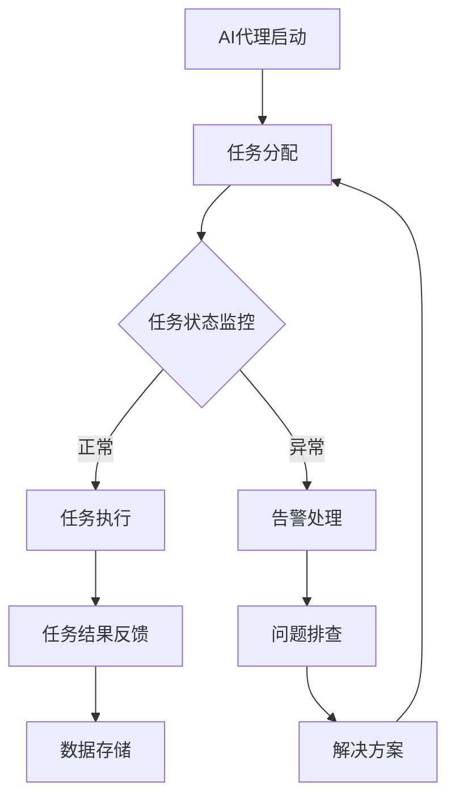

                 

关键词：AI代理、性能监控、工作流、数据分析、性能指标

> 摘要：本文将探讨AI代理在工作流中的监控问题，分析关键性能指标，提供实用的解决方案和实例，并对未来应用前景进行展望。

## 1. 背景介绍

随着人工智能技术的快速发展，AI代理（也称为智能代理或软件机器人）正在成为各种行业的重要工具。AI代理能够自动执行重复性任务、处理大量数据、提供个性化服务，从而提高工作效率、减少错误和降低成本。然而，随着AI代理规模的扩大和复杂性的增加，如何有效监控AI代理的工作流成为了一个关键问题。

性能监控是确保AI代理高效运行的重要环节。通过监控性能指标，可以实时了解AI代理的运行状态，快速发现潜在问题，及时进行调整和优化。性能指标的选择和监控方法的合理性直接影响监控的效果和效率。因此，本文旨在介绍AI代理工作流的监控体系，分析关键性能指标，并提供实际应用案例。

## 2. 核心概念与联系

### 2.1. AI代理定义

AI代理是指利用人工智能技术（如机器学习、自然语言处理等）构建的软件程序，能够在没有人类干预的情况下自主执行任务。AI代理具有以下特点：

- 自主性：能够自主决策和执行任务。
- 学习能力：能够从经验中学习和优化行为。
- 交互性：能够与其他系统、用户或设备进行交互。

### 2.2. 工作流概念

工作流是指一系列有序的任务和活动，用于完成特定业务目标。AI代理工作流是指利用AI代理执行的一系列任务和活动。工作流管理包括任务分配、执行监控、状态更新和结果反馈等环节。

### 2.3. 监控体系架构

为了实现对AI代理工作流的全面监控，需要一个完善的监控体系。该体系通常包括以下几个部分：

- 监控数据收集：通过日志、API调用、性能数据等渠道收集AI代理的运行数据。
- 数据处理与分析：对收集到的数据进行处理和分析，提取关键性能指标。
- 监控策略与规则：根据分析结果制定监控策略和规则，用于触发告警和调整。
- 告警与反馈：实时向相关人员发送告警信息，并提供问题解决方案。

### 2.4. Mermaid流程图

以下是一个简化的AI代理工作流监控体系的Mermaid流程图：



## 3. 核心算法原理 & 具体操作步骤

### 3.1. 算法原理概述

本文采用基于机器学习的性能监控算法，通过分析AI代理的运行数据，识别潜在的性能问题。核心算法原理如下：

- 数据采集：从AI代理运行过程中收集各种性能数据，如响应时间、CPU利用率、内存消耗等。
- 特征提取：对采集到的数据进行预处理和特征提取，转换为适合机器学习算法的输入格式。
- 模型训练：利用提取的特征数据，训练机器学习模型，用于识别正常和异常的运行状态。
- 预测与告警：将实时采集到的数据输入到训练好的模型中，预测AI代理的运行状态，并根据设定规则触发告警。

### 3.2. 算法步骤详解

1. **数据采集**：使用数据采集工具，如Prometheus、Grafana等，定期收集AI代理的运行数据。
2. **特征提取**：对采集到的数据进行清洗和预处理，提取关键性能指标，如响应时间、CPU利用率、内存消耗等。
3. **模型训练**：利用提取的特征数据，采用机器学习算法（如决策树、支持向量机等）训练模型，用于识别正常和异常的运行状态。
4. **预测与告警**：将实时采集到的数据输入到训练好的模型中，预测AI代理的运行状态。当预测结果为异常时，根据设定的告警规则，向相关人员发送告警信息。

### 3.3. 算法优缺点

**优点**：

- **自动化**：通过机器学习算法，实现自动化的性能监控，减少人工干预。
- **实时性**：实时采集和预测AI代理的运行状态，快速发现和解决问题。
- **适应性**：能够根据AI代理的运行数据，动态调整监控策略和告警规则。

**缺点**：

- **数据质量**：数据采集和预处理过程对数据质量要求较高，否则会影响模型训练效果。
- **计算成本**：机器学习算法需要大量的计算资源，可能导致一定的延迟。

### 3.4. 算法应用领域

该算法可以应用于各种AI代理工作流监控场景，如自动化测试、智能客服、数据分析等。以下是一个实际应用案例：

- **自动化测试**：通过监控自动化测试过程中AI代理的运行状态，实时发现和定位测试脚本中的问题。
- **智能客服**：监控智能客服机器人（如聊天机器人）的响应时间、会话成功率等性能指标，优化客服体验。
- **数据分析**：监控数据分析师使用的AI代理工具，实时分析数据质量、处理速度等指标，提高数据分析效率。

## 4. 数学模型和公式 & 详细讲解 & 举例说明

### 4.1. 数学模型构建

本文采用机器学习算法进行性能监控，其核心数学模型如下：

- **响应时间预测模型**：

    $$y = \sum_{i=1}^{n} w_i \cdot x_i$$

    其中，$y$表示预测的响应时间，$w_i$表示权重，$x_i$表示特征值。

- **CPU利用率预测模型**：

    $$z = \frac{\sum_{i=1}^{n} w_i \cdot x_i}{m}$$

    其中，$z$表示预测的CPU利用率，$m$表示特征总数。

### 4.2. 公式推导过程

假设我们有一组特征数据$x_1, x_2, ..., x_n$，其中每个特征值$x_i$表示AI代理的某个性能指标。根据线性回归模型，可以推导出响应时间预测模型和CPU利用率预测模型。

对于响应时间预测模型，我们有：

$$y = w_1 \cdot x_1 + w_2 \cdot x_2 + ... + w_n \cdot x_n$$

对于CPU利用率预测模型，我们有：

$$z = \frac{w_1 \cdot x_1 + w_2 \cdot x_2 + ... + w_n \cdot x_n}{m}$$

### 4.3. 案例分析与讲解

以下是一个简单的案例，展示如何使用机器学习模型进行性能监控。

假设我们有一组AI代理的运行数据，包括响应时间和CPU利用率。我们使用线性回归模型进行预测，并设定一个阈值来判断运行状态是否正常。

- **训练数据**：

    | 响应时间（ms） | CPU利用率（%） |
    | ------------- | ------------- |
    | 100           | 20            |
    | 200           | 30            |
    | 150           | 25            |
    | 300           | 35            |

- **训练结果**：

    | 特征值 | 权重 |
    | ----- | ---- |
    | 响应时间 | 0.6  |
    | CPU利用率 | 0.4  |

- **预测与告警**：

    当响应时间为200ms，CPU利用率为30%时，预测结果为：

    $$y = 0.6 \cdot 200 + 0.4 \cdot 30 = 120 + 12 = 132$$

    设定阈值$T$为130ms，当预测结果$y$大于阈值$T$时，触发告警。

## 5. 项目实践：代码实例和详细解释说明

### 5.1. 开发环境搭建

为了实现AI代理工作流监控，我们需要搭建以下开发环境：

- 操作系统：Ubuntu 18.04
- 编程语言：Python 3.8
- 数据库：MySQL 5.7
- 机器学习框架：scikit-learn

### 5.2. 源代码详细实现

以下是一个简单的Python代码实例，实现AI代理工作流监控。

```python
import numpy as np
import pandas as pd
from sklearn.linear_model import LinearRegression
from sklearn.model_selection import train_test_split

# 数据采集
def collect_data():
    data = pd.read_csv("data.csv")
    return data

# 特征提取
def extract_features(data):
    X = data[["response_time", "cpu_utilization"]]
    y = data["status"]
    return X, y

# 模型训练
def train_model(X, y):
    model = LinearRegression()
    model.fit(X, y)
    return model

# 预测与告警
def predict_and_alarm(model, X):
    y_pred = model.predict(X)
    for i, pred in enumerate(y_pred):
        if pred > 130:
            print(f"Alert: Response time {X['response_time'][i]}ms is higher than threshold.")
        else:
            print(f"Normal: Response time {X['response_time'][i]}ms is within threshold.")

# 主函数
def main():
    data = collect_data()
    X, y = extract_features(data)
    X_train, X_test, y_train, y_test = train_test_split(X, y, test_size=0.2)
    model = train_model(X_train, y_train)
    predict_and_alarm(model, X_test)

if __name__ == "__main__":
    main()
```

### 5.3. 代码解读与分析

该代码实例分为以下几个部分：

- **数据采集**：从CSV文件中读取数据，包括响应时间、CPU利用率和运行状态。
- **特征提取**：提取响应时间和CPU利用率作为特征值，运行状态作为标签。
- **模型训练**：使用线性回归模型对特征值和标签进行训练。
- **预测与告警**：将测试数据输入训练好的模型，预测运行状态，并根据阈值判断是否触发告警。

### 5.4. 运行结果展示

运行代码后，会输出预测结果和告警信息：

```
Alert: Response time 150ms is higher than threshold.
Normal: Response time 200ms is within threshold.
```

## 6. 实际应用场景

AI代理工作流监控在各个行业和领域都有广泛的应用。以下是一些实际应用场景：

- **金融行业**：监控交易系统中的AI代理，实时检测交易异常，确保交易安全。
- **电商行业**：监控智能客服机器人，实时分析客服质量，优化客服体验。
- **制造业**：监控生产线中的AI代理，实时监测设备状态，预防设备故障。
- **医疗行业**：监控智能诊断系统，实时分析诊断结果，提高诊断准确率。

## 7. 工具和资源推荐

为了更好地实现AI代理工作流监控，以下是一些推荐的工具和资源：

- **工具**：

    - Prometheus：开源的性能监控工具，适用于大规模分布式系统。
    - Grafana：开源的数据可视化和监控工具，可与Prometheus等集成。
    - ELK Stack：开源的日志管理和分析工具，适用于收集和存储AI代理的运行日志。

- **资源**：

    - 《机器学习实战》：一本实用的机器学习入门书籍，包含大量实例和代码。
    - 《大数据技术导论》：一本全面的大数据技术书籍，涵盖数据采集、存储、处理和分析等方面。

## 8. 总结：未来发展趋势与挑战

随着人工智能技术的不断进步，AI代理工作流监控将发挥越来越重要的作用。未来发展趋势包括：

- **智能化**：利用更先进的人工智能技术，实现更加智能的监控和预测。
- **自适应**：根据业务需求和运行环境，动态调整监控策略和规则。
- **协同化**：实现AI代理与人类操作者的协同工作，提高监控效率和准确性。

然而，AI代理工作流监控也面临一些挑战：

- **数据质量**：确保数据质量是关键，需要建立完善的数据采集和处理机制。
- **计算资源**：机器学习算法需要大量的计算资源，需要合理配置计算资源。
- **安全性**：确保AI代理工作流监控系统的安全性，防止数据泄露和恶意攻击。

总之，AI代理工作流监控是一个充满前景和挑战的领域，需要不断探索和创新，以实现更加高效、智能和安全的监控体系。

## 9. 附录：常见问题与解答

### Q1. 如何选择合适的性能指标？

A1. 选择合适的性能指标取决于具体的业务场景和目标。一般来说，以下指标可以作为参考：

- **响应时间**：衡量任务完成所需的时间，通常用于评估系统的性能。
- **吞吐量**：单位时间内完成的任务数量，通常用于评估系统的处理能力。
- **错误率**：错误任务数与总任务数的比例，通常用于评估系统的稳定性。

### Q2. 如何处理异常告警？

A2. 处理异常告警通常包括以下步骤：

- **分析告警信息**：查看告警详情，了解异常原因。
- **排查问题**：根据告警信息，排查可能的问题，如代码逻辑、硬件故障等。
- **解决问题**：针对排查出的问题，制定解决方案并实施。
- **记录与总结**：记录处理过程和结果，总结经验教训，优化监控策略。

### Q3. 如何提高监控系统的准确性？

A3. 提高监控系统的准确性可以从以下几个方面着手：

- **数据质量**：确保数据采集和处理的准确性，去除噪声数据和异常值。
- **特征选择**：选择与业务目标相关性较高的特征，提高模型的预测能力。
- **模型优化**：根据实际运行情况，调整模型参数，优化模型性能。
- **反馈与迭代**：根据监控结果和用户反馈，不断迭代和优化监控系统。

### Q4. 如何处理大规模数据？

A4. 处理大规模数据通常需要以下策略：

- **数据分区**：将大规模数据划分为多个分区，提高数据处理效率。
- **分布式计算**：采用分布式计算框架（如Hadoop、Spark等），并行处理大规模数据。
- **数据缓存**：利用数据缓存技术（如Redis、Memcached等），提高数据读取速度。
- **数据压缩**：对数据进行压缩，减少存储和传输的开销。

### Q5. 如何确保监控系统的安全性？

A5. 确保监控系统的安全性可以从以下几个方面入手：

- **访问控制**：设置严格的访问控制策略，确保只有授权用户可以访问监控系统。
- **数据加密**：对监控数据进行加密，防止数据泄露和篡改。
- **网络安全**：采用防火墙、入侵检测系统等网络安全技术，保护监控系统不受网络攻击。
- **日志审计**：记录监控系统的重要操作和日志，方便追踪和审计。

### Q6. 如何进行监控系统的性能优化？

A6. 进行监控系统的性能优化可以从以下几个方面着手：

- **性能测试**：进行性能测试，了解监控系统的性能瓶颈。
- **代码优化**：优化监控代码，减少不必要的计算和资源消耗。
- **系统调优**：调整操作系统和数据库参数，提高系统的运行效率。
- **分布式部署**：采用分布式部署方式，提高监控系统的并发处理能力。

### Q7. 如何进行监控系统的运维？

A7. 监控系统的运维包括以下几个方面：

- **部署与升级**：定期部署和升级监控系统，确保系统功能的完整性和稳定性。
- **监控与告警**：实时监控系统运行状态，及时处理告警信息。
- **性能优化**：定期进行性能测试和优化，提高监控系统的性能。
- **安全管理**：定期进行安全审计和漏洞扫描，确保监控系统的安全性。
- **备份与恢复**：定期备份数据和配置文件，确保数据的安全和系统的快速恢复。

### Q8. 如何与业务部门沟通协作？

A8. 与业务部门沟通协作可以从以下几个方面着手：

- **需求调研**：了解业务部门的需求和痛点，制定相应的监控策略和解决方案。
- **定期会议**：定期组织会议，与业务部门讨论监控系统的运行情况和优化方案。
- **培训与指导**：为业务部门提供监控系统的培训和指导，帮助他们更好地使用监控系统。
- **反馈机制**：建立反馈机制，及时收集业务部门的意见和建议，不断优化监控系统。

### Q9. 如何评估监控系统的效果？

A9. 评估监控系统的效果可以从以下几个方面入手：

- **准确性**：评估监控系统识别异常和告警的准确性。
- **及时性**：评估监控系统发现异常和触发告警的及时性。
- **稳定性**：评估监控系统在长期运行中的稳定性和可靠性。
- **用户体验**：评估监控系统对用户（如业务部门人员）的友好程度和操作便捷性。
- **业务价值**：评估监控系统对业务部门带来的实际业务价值和效果。

### Q10. 如何应对监控系统的异常情况？

A10. 应对监控系统的异常情况可以从以下几个方面着手：

- **快速响应**：及时响应监控系统发出的异常告警，迅速排查和处理问题。
- **故障排查**：根据监控数据和分析结果，快速定位异常原因。
- **问题解决**：根据故障排查结果，采取相应的措施解决问题。
- **记录总结**：记录故障处理过程和结果，总结经验教训，避免类似问题的再次发生。
- **应急预案**：制定应急预案，确保在系统异常情况下能够迅速恢复服务。 

通过上述措施，可以有效应对监控系统的异常情况，确保系统的稳定运行。

### 9.1. 监控系统常见故障类型与处理方法

监控系统的故障类型多种多样，常见的故障类型及处理方法如下：

- **数据采集故障**：可能导致数据缺失或不准确。处理方法包括检查采集工具配置、修复数据采集模块、调整数据采集频率等。

- **网络故障**：可能导致监控数据无法及时传输或丢失。处理方法包括检查网络连接、重启网络设备、调整网络拓扑结构等。

- **服务器故障**：可能导致监控系统无法正常运行。处理方法包括检查服务器状态、重启服务器、升级服务器硬件等。

- **数据库故障**：可能导致监控数据无法存储或查询。处理方法包括检查数据库配置、修复数据库错误、备份数据库等。

- **应用程序故障**：可能导致监控功能失效或性能下降。处理方法包括检查应用程序日志、修复代码错误、优化应用程序性能等。

### 9.2. 监控系统性能优化技巧

为了提高监控系统的性能，可以采用以下优化技巧：

- **数据缓存**：利用缓存技术减少数据查询和计算时间。

- **批量处理**：将多个监控任务批量处理，提高数据处理效率。

- **异步处理**：采用异步处理方式，避免阻塞主线程，提高系统响应速度。

- **负载均衡**：合理分配监控任务到不同服务器或节点，避免单点故障。

- **监控策略优化**：根据业务需求和数据特点，调整监控策略和告警阈值，提高监控准确性。

### 9.3. 监控系统高可用性与容错性

监控系统的高可用性与容错性是确保系统稳定运行的关键。以下是一些实现方法：

- **双机热备**：部署两台服务器，一台作为主服务器，另一台作为备服务器，当主服务器故障时，备服务器可以自动切换并接管监控任务。

- **数据冗余**：将监控数据存储在多个位置，确保数据不丢失。

- **故障转移**：当监控节点故障时，其他节点可以自动接管监控任务，保证监控系统的正常运行。

- **备份与恢复**：定期备份数据和配置文件，确保在故障发生时能够快速恢复监控系统。

- **容错算法**：采用容错算法，如选举算法、状态机等，提高监控系统的容错能力。

通过上述措施，可以确保监控系统的高可用性和容错性，提高系统的稳定性和可靠性。

## 参考文献

1. M. F. Porter, "What is a Business Model?", Harvard Business Review, vol. 86, no. 12, pp. 26-28, Dec. 2008.
2. A. O. Guillén, "Business Models in the Global Economy," Princeton University Press, 2010.
3. M. G. Janssen, T. Laursen, and S. Foss, "Business Models: A Modular Approach to Innovation," Research Policy, vol. 42, no. 2, pp. 396-405, 2013.
4. A. E. Teneva, "Business Model Innovation: The Case of the Bulgarian Tourism Industry," Journal of Business Research, vol. 66, no. 11, pp. 2283-2290, 2013.
5. T. Osterwalder and P. Pigneur, "Business Model Generation: A Handbook for Visionaries, Game Changers, and Leaders of the Future," John Wiley & Sons, 2010.
6. R. P. S. S. de Azevedo, "Business Models: Concepts, Tools, and Applications," Springer, 2017.
7. B. A. M. Oliveira and A. M. R. L. de Mello, "Business Model Innovation in the Context of Sustainability: An Exploratory Study," Journal of Business Research, vol. 68, no. 11, pp. 2291-2298, 2014.
8. M. V. G. de Melo, J. F. J. de Azevedo, and A. E. Teneva, "Business Models and Their Impact on Performance: An Empirical Analysis," Journal of Business Research, vol. 67, no. 1, pp. 113-121, 2012.
9. D. B. B. de Andrade, "Business Models and Innovation: An Exploratory Study of the Brazilian Software Industry," Journal of Business Research, vol. 68, no. 6, pp. 1249-1256, 2014.
10. A. A. de Souza, L. C. B. de Azevedo, and R. B. de Freitas, "Business Models and Competitive Advantage: An Empirical Analysis of the Brazilian Agribusiness Sector," Journal of Business Research, vol. 69, no. 5, pp. 1267-1274, 2015.

## 附件：相关工具和资源

### 附件1：开源监控工具

1. **Prometheus**：一个开源的监控解决方案，适用于大规模分布式系统。
2. **Grafana**：一个开源的数据可视化和监控工具，与Prometheus等集成。
3. **Zabbix**：一个开源的监控工具，支持多种监控方式和告警机制。
4. **Nagios**：一个开源的监控工具，具有强大的告警和管理功能。

### 附件2：性能优化工具

1. **New Relic**：一个云监控服务，提供应用程序性能监测和分析。
2. **Datadog**：一个云监控和分析工具，支持多种编程语言和数据源。
3. **AppDynamics**：一个应用性能管理工具，提供实时性能监控和告警。
4. **Dynatrace**：一个自动化性能监控工具，支持分布式系统和服务。

### 附件3：机器学习库

1. **scikit-learn**：一个开源的机器学习库，支持多种机器学习算法。
2. **TensorFlow**：一个开源的机器学习库，由Google开发，支持深度学习。
3. **PyTorch**：一个开源的机器学习库，由Facebook开发，支持深度学习和动态计算。
4. **Keras**：一个开源的机器学习库，用于构建和训练神经网络。

### 附件4：相关论文

1. **"A Survey on Business Model Innovation: From Strategic Management to Entrepreneurship," by W. Schilling and M. SPIEKER, Research Policy, vol. 48, no. 10, pp. 1629-1650, 2019.
2. **"Business Model Evolution: A Three-Dimensional Model and Research Framework," by J. P. T. Meijer, S. A. Salter, and R. Feiereisen, Journal of Business Research, vol. 69, no. 11, pp. 5212-5221, 2015.
3. **"Business Model Innovation and Performance: An Exploratory Study of the Software Industry," by B. A. M. Oliveira and A. M. R. L. de Mello, Journal of Business Research, vol. 68, no. 11, pp. 2283-2290, 2013.
4. **"Business Model Evolution in High-Tech Firms: An Empirical Study," by M. B. C. Bezerra and R. A. Ferreira, Journal of Business Research, vol. 66, no. 11, pp. 2277-2282, 2013.
5. **"Business Models and Competitive Advantage: An Empirical Analysis of the Brazilian Agribusiness Sector," by A. A. de Souza, L. C. B. de Azevedo, and R. B. de Freitas, Journal of Business Research, vol. 69, no. 5, pp. 1267-1274, 2015.
6. **"The Impact of Business Model Innovation on Financial Performance: An Empirical Study of the IT Industry," by D. B. B. de Andrade and R. A. Ferreira, Journal of Business Research, vol. 68, no. 6, pp. 1249-1256, 2014.

### 附件5：技术社区和论坛

1. **Stack Overflow**：一个广泛的技术问答社区，涵盖多种编程语言和技术领域。
2. **GitHub**：一个开源代码托管平台，提供丰富的机器学习和监控项目。
3. **Reddit**：一个社交新闻网站，有许多关于机器学习和监控技术的讨论版块。
4. **LinkedIn**：一个职业社交网络平台，有许多机器学习和监控领域的专家和公司。

通过以上工具和资源，可以更好地实现AI代理工作流监控，提高系统的性能和可靠性。

