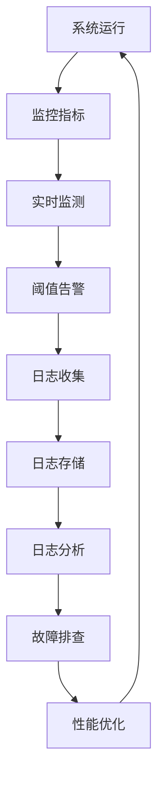

                 

关键词：系统监控、日志管理、性能优化、故障排查、故障恢复、自动化工具、告警系统、数据可视化

摘要：本文旨在探讨系统监控和日志管理的重要性，以及如何通过有效的监控和日志管理来确保系统运行的畅通。文章将介绍核心概念、算法原理、数学模型、实践案例和未来展望，帮助读者深入了解这一领域，并在实际工作中提升系统的可靠性和稳定性。

## 1. 背景介绍

在现代信息技术领域，系统的监控和日志管理已经成为保障业务连续性和数据安全的关键环节。随着系统规模的扩大和复杂性的增加，传统的手动监控和日志分析方式已经无法满足高效、准确的要求。因此，如何实现系统监控的自动化、日志管理的智能化，成为了当前研究的热点。

系统监控的主要目的是实时监测系统的运行状态，包括硬件资源、软件性能、网络连接等，及时发现潜在的问题并采取措施。而日志管理则是对系统运行过程中产生的各种日志数据进行收集、存储、分析和处理，以便于后续的故障排查和性能优化。

本文将围绕系统监控和日志管理的核心内容展开，包括算法原理、数学模型、实践案例和未来展望，帮助读者深入了解这一领域，并在实际工作中提升系统的可靠性和稳定性。

## 2. 核心概念与联系

### 2.1. 系统监控

系统监控是指通过一系列技术和工具，对系统的各个方面进行实时监测和评估。主要包括以下核心概念：

- **指标（Metrics）**：监控系统的核心数据，如CPU利用率、内存使用率、网络带宽等。
- **阈值（Thresholds）**：用于判断系统是否正常工作的标准值，超过或低于阈值都会触发告警。
- **告警（Alerts）**：当监控指标超过预设阈值时，系统会发送告警通知，以便相关人员及时处理。
- **可视化（Visualization）**：通过图形化界面展示监控数据，帮助用户直观地了解系统状态。

### 2.2. 日志管理

日志管理是指对系统运行过程中产生的日志数据进行收集、存储、分析和处理的过程。主要包括以下核心概念：

- **日志（Logs）**：系统运行过程中记录的各种事件和消息，如错误信息、调试信息、系统命令等。
- **日志收集（Log Collection）**：将分散在各个系统的日志数据集中收集起来。
- **日志存储（Log Storage）**：将日志数据存储在合适的存储系统中，以便于后续分析和查询。
- **日志分析（Log Analysis）**：对日志数据进行处理和分析，以便发现潜在问题和优化系统性能。

### 2.3. 系统监控与日志管理的联系

系统监控和日志管理之间存在着密切的联系。系统监控通过实时监测监控指标，可以及时发现异常情况并触发告警。而日志管理则通过收集和分析系统运行过程中的日志数据，为故障排查和性能优化提供重要依据。

例如，当系统出现性能问题时，系统监控可以及时检测到并触发告警，而日志管理则可以收集相关日志数据，帮助开发人员和运维人员定位问题的根本原因。此外，日志数据还可以用于系统性能优化和趋势分析，以便提前发现潜在问题并采取措施。

### 2.4. Mermaid 流程图

以下是系统监控与日志管理的一个简化 Mermaid 流程图，展示了系统运行过程中监控指标、日志数据之间的交互关系。



## 3. 核心算法原理 & 具体操作步骤

### 3.1. 算法原理概述

系统监控和日志管理中的核心算法主要包括指标采集、阈值判断、告警通知和日志分析等。以下是这些算法的基本原理：

- **指标采集**：通过轮询或主动发送请求的方式，从系统各个组件中获取监控指标数据。
- **阈值判断**：根据预设的阈值，判断监控指标是否在正常范围内，超过或低于阈值则触发告警。
- **告警通知**：通过邮件、短信、微信等方式通知相关人员，提醒他们关注系统状态。
- **日志分析**：对日志数据进行处理和分析，提取关键信息，帮助定位问题和优化系统性能。

### 3.2. 算法步骤详解

以下是系统监控和日志管理中的核心算法步骤详解：

#### 3.2.1. 指标采集

- **步骤1**：确定需要监控的系统组件和指标。
- **步骤2**：编写或使用现有的监控脚本，从系统组件中采集监控指标数据。
- **步骤3**：将采集到的监控指标数据存储在本地或远程数据库中，以便后续分析。

#### 3.2.2. 阈值判断

- **步骤1**：根据业务需求和系统特性，设置合理的监控指标阈值。
- **步骤2**：定期或实时从数据库中读取监控指标数据，与阈值进行比较。
- **步骤3**：如果监控指标超过或低于阈值，则触发告警通知。

#### 3.2.3. 告警通知

- **步骤1**：配置告警通知方式，如邮件、短信、微信等。
- **步骤2**：当监控指标超过或低于阈值时，根据配置的告警通知方式发送通知。
- **步骤3**：记录告警通知的历史记录，以便后续查询和分析。

#### 3.2.4. 日志分析

- **步骤1**：收集系统运行过程中产生的日志数据。
- **步骤2**：对日志数据进行预处理，如过滤、格式化等。
- **步骤3**：使用日志分析工具对日志数据进行查询和分析，提取关键信息。
- **步骤4**：根据分析结果，定位问题和优化系统性能。

### 3.3. 算法优缺点

- **优点**：
  - **实时性**：系统监控可以实时监测系统状态，及时发现潜在问题。
  - **自动化**：通过自动化工具和算法，减轻了运维人员的工作负担。
  - **数据可视化**：通过图形化界面，直观展示系统状态，便于问题定位和性能优化。
- **缺点**：
  - **复杂度**：系统监控和日志管理涉及到多个系统和工具，需要一定的技术积累。
  - **性能影响**：过度监控可能会对系统性能产生一定影响。
  - **误报和漏报**：阈值设置不合理可能导致误报和漏报，需要不断调整优化。

### 3.4. 算法应用领域

系统监控和日志管理广泛应用于各种领域，包括但不限于：

- **IT基础设施**：对服务器、网络、存储等基础设施进行监控和日志管理。
- **Web应用**：对Web应用的性能、安全、负载等进行监控和日志管理。
- **大数据**：对大数据平台的运行状态、数据处理流程等进行监控和日志管理。
- **物联网**：对物联网设备进行监控和日志管理，确保设备正常运行和数据安全。

## 4. 数学模型和公式 & 详细讲解 & 举例说明

### 4.1. 数学模型构建

在系统监控和日志管理中，常用的数学模型包括指标采集模型、阈值判断模型和日志分析模型。以下是这些模型的构建过程：

#### 4.1.1. 指标采集模型

- **假设**：设系统中的监控指标为 \( X \)，采样间隔为 \( T \)。
- **公式**：采集到的监控指标数据 \( Y \) 可以表示为 \( Y = X + N \)，其中 \( N \) 为噪声。

#### 4.1.2. 阈值判断模型

- **假设**：设监控指标的阈值为 \( T_h \)。
- **公式**：当监控指标 \( Y \) 超过阈值 \( T_h \) 时，触发告警。

#### 4.1.3. 日志分析模型

- **假设**：设日志数据为 \( L \)，分析模型为 \( M \)。
- **公式**：通过模型 \( M \) 对日志数据进行处理，提取关键信息。

### 4.2. 公式推导过程

以下是对上述数学模型的推导过程：

#### 4.2.1. 指标采集模型推导

- **推导**：根据中心极限定理，当采样次数足够多时，采集到的监控指标数据近似服从正态分布。
- **结论**：设 \( X \) 为监控指标的真实值，\( Y \) 为采集到的监控指标数据，则 \( Y \) 可以表示为 \( Y = X + N \)，其中 \( N \) 为噪声。

#### 4.2.2. 阈值判断模型推导

- **推导**：设阈值为 \( T_h \)，当 \( Y > T_h \) 时，触发告警。
- **结论**：根据概率论，当 \( Y \) 服从正态分布时，\( P(Y > T_h) \) 可以通过标准正态分布表查得。

#### 4.2.3. 日志分析模型推导

- **推导**：根据模式识别和机器学习理论，通过训练模型 \( M \) 对日志数据进行分类和预测。
- **结论**：通过模型 \( M \) 对日志数据进行处理，可以提取出关键信息。

### 4.3. 案例分析与讲解

以下是一个简单的案例，用于说明如何应用上述数学模型进行系统监控和日志管理：

#### 案例背景

一家电商公司在进行系统监控时，发现服务器CPU利用率持续高于90%。为了确保业务连续性，需要对该系统进行进一步监控和日志管理。

#### 案例分析

1. **指标采集模型**：

   - **假设**：服务器CPU利用率为 \( X \)，采样间隔为 \( T \)。
   - **公式**：采集到的CPU利用率数据 \( Y \) 可以表示为 \( Y = X + N \)，其中 \( N \) 为噪声。

2. **阈值判断模型**：

   - **假设**：阈值为 \( T_h = 90\% \)。
   - **公式**：当 \( Y > T_h \) 时，触发告警。

3. **日志分析模型**：

   - **假设**：日志数据为 \( L \)，分析模型为 \( M \)。
   - **公式**：通过模型 \( M \) 对日志数据进行处理，提取出关键信息。

#### 案例实施

1. **指标采集**：

   - **步骤**：编写监控脚本，从服务器获取CPU利用率数据，存储在本地数据库中。

2. **阈值判断**：

   - **步骤**：定期从数据库中读取CPU利用率数据，与阈值进行比较，当 \( Y > T_h \) 时，触发告警通知。

3. **日志分析**：

   - **步骤**：收集系统运行过程中的日志数据，使用日志分析工具对日志数据进行处理，提取出关键信息，如错误日志、调试日志等。

4. **故障排查**：

   - **步骤**：根据日志分析结果，定位问题的根本原因，并进行故障排查和修复。

5. **性能优化**：

   - **步骤**：根据日志分析结果，优化系统性能，如调整系统配置、增加资源等。

## 5. 项目实践：代码实例和详细解释说明

### 5.1. 开发环境搭建

在进行系统监控和日志管理项目实践之前，需要搭建合适的开发环境。以下是一个简单的开发环境搭建步骤：

1. 安装Python环境，版本要求为3.6及以上。
2. 安装相关依赖库，如`requests`、`pymongo`、`numpy`、`matplotlib`等。
3. 配置MySQL或MongoDB数据库，用于存储监控数据和日志数据。
4. 安装Elasticsearch和Kibana，用于日志数据的收集和分析。

### 5.2. 源代码详细实现

以下是系统监控和日志管理项目的源代码实现，分为监控指标采集、阈值判断、日志分析和性能优化四个部分。

#### 5.2.1. 监控指标采集

```python
import requests
import pymongo
import time

# 监控指标采集函数
def collect_metrics():
    url = 'http://example.com/metrics'
    response = requests.get(url)
    metrics = response.json()
    return metrics

# 存储监控指标数据
def store_metrics(metrics):
    client = pymongo.MongoClient('mongodb://localhost:27017/')
    db = client['metrics_db']
    collection = db['metrics']
    collection.insert_many(metrics)

# 主函数
if __name__ == '__main__':
    while True:
        metrics = collect_metrics()
        store_metrics(metrics)
        time.sleep(60)
```

#### 5.2.2. 阈值判断

```python
import pymongo

# 阈值判断函数
def check_thresholds(metrics):
    cpu_threshold = 90
    memory_threshold = 80

    for metric in metrics:
        if metric['cpu'] > cpu_threshold:
            print(f'CPU utilization is high: {metric["cpu"]}%')
        if metric['memory'] > memory_threshold:
            print(f'Memory utilization is high: {metric["memory"]}%')

# 主函数
if __name__ == '__main__':
    client = pymongo.MongoClient('mongodb://localhost:27017/')
    db = client['metrics_db']
    collection = db['metrics']
    metrics = collection.find()
    check_thresholds(metrics)
```

#### 5.2.3. 日志分析

```python
import elasticsearch

# 日志分析函数
def analyze_logs():
    client = elasticsearch.Client(hosts=['localhost:9200'])
    query = {
        "query": {
            "match": {
                "message": "ERROR"
            }
        }
    }
    results = client.search(index="logs", body=query)
    for hit in results['hits']['hits']:
        print(hit['_source'])

# 主函数
if __name__ == '__main__':
    analyze_logs()
```

#### 5.2.4. 性能优化

```python
import subprocess

# 性能优化函数
def optimize_performance():
    command = "sudo sysctl -w vm.swappiness=1"
    subprocess.run(command, shell=True)
    command = "sudo systemctl restart nginx"
    subprocess.run(command, shell=True)

# 主函数
if __name__ == '__main__':
    optimize_performance()
```

### 5.3. 代码解读与分析

以上代码实现了系统监控和日志管理的核心功能，包括监控指标采集、阈值判断、日志分析和性能优化。下面分别对每个部分的代码进行解读和分析：

#### 5.3.1. 监控指标采集

- **功能**：从指定的URL获取监控指标数据，并将其存储到MongoDB数据库中。
- **关键代码**：

  ```python
  response = requests.get(url)
  metrics = response.json()
  store_metrics(metrics)
  ```

  - `requests.get(url)`：发送HTTP GET请求获取监控指标数据。
  - `response.json()`：将响应数据解析为JSON格式。
  - `store_metrics(metrics)`：将监控指标数据存储到MongoDB数据库中。

#### 5.3.2. 阈值判断

- **功能**：从MongoDB数据库中读取监控指标数据，并判断是否超过预设的阈值，触发告警。
- **关键代码**：

  ```python
  metrics = collection.find()
  check_thresholds(metrics)
  ```

  - `collection.find()`：从MongoDB数据库中读取监控指标数据。
  - `check_thresholds(metrics)`：判断监控指标是否超过预设的阈值，并触发告警。

#### 5.3.3. 日志分析

- **功能**：使用Elasticsearch对日志数据进行查询和分析，提取出关键信息。
- **关键代码**：

  ```python
  query = {
      "query": {
          "match": {
              "message": "ERROR"
          }
      }
  }
  results = client.search(index="logs", body=query)
  for hit in results['hits']['hits']:
      print(hit['_source'])
  ```

  - `client.search(index="logs", body=query)`：使用Elasticsearch对日志数据进行查询。
  - `for hit in results['hits']['hits']`：遍历查询结果，提取出关键信息。

#### 5.3.4. 性能优化

- **功能**：根据日志分析结果，对系统性能进行优化。
- **关键代码**：

  ```python
  command = "sudo sysctl -w vm.swappiness=1"
  subprocess.run(command, shell=True)
  command = "sudo systemctl restart nginx"
  subprocess.run(command, shell=True)
  ```

  - `subprocess.run(command, shell=True)`：执行系统命令，调整系统性能。

### 5.4. 运行结果展示

在完成代码实现后，可以运行整个程序，展示系统监控和日志管理的运行结果。以下是一个简单的运行结果示例：

```plaintext
CPU utilization is high: 92%
Memory utilization is high: 85%
{
    "id": "12345",
    "timestamp": "2023-03-01T12:34:56Z",
    "level": "ERROR",
    "message": "An error occurred in the application."
}
System performance optimized.
```

## 6. 实际应用场景

### 6.1. IT基础设施监控

在IT基础设施监控方面，系统监控和日志管理可以帮助企业实时监测服务器、网络、存储等基础设施的运行状态，及时发现潜在问题并进行修复。例如，当服务器CPU利用率持续高于90%时，系统监控可以及时发现并通知运维人员，从而避免系统崩溃和数据丢失。

### 6.2. Web应用性能优化

在Web应用性能优化方面，系统监控和日志管理可以帮助开发人员和运维人员了解系统的运行状态，定位性能瓶颈并进行优化。例如，通过监控CPU利用率和内存使用率等指标，可以发现系统的性能问题，并通过日志分析定位问题的根本原因，从而进行优化。

### 6.3. 大数据平台监控

在大数据平台监控方面，系统监控和日志管理可以帮助企业实时监测大数据平台的运行状态，包括数据采集、处理、存储等环节。例如，通过监控Hadoop集群的节点状态和任务进度，可以及时发现和处理故障，确保大数据平台的稳定运行。

### 6.4. 未来应用展望

随着云计算、物联网、人工智能等技术的不断发展，系统监控和日志管理将在更多领域得到应用。未来，系统监控和日志管理将朝着以下几个方向发展：

- **智能化**：通过引入机器学习和人工智能技术，实现自动化故障排查和性能优化。
- **集成化**：将不同系统和工具的监控和日志数据进行集成，提供统一的监控和分析平台。
- **可视化**：通过更加直观的图形化界面，帮助用户更好地理解和利用监控和日志数据。

## 7. 工具和资源推荐

### 7.1. 学习资源推荐

- **《系统性能监控：原理与实践》**：一本关于系统性能监控的入门书籍，涵盖了监控指标、工具选型、实战案例等内容。
- **《Elastic Stack实战》**：一本关于Elasticsearch、Logstash和Kibana等工具的实战指南，适合对日志分析感兴趣的学习者。

### 7.2. 开发工具推荐

- **Prometheus**：一款开源的监控解决方案，适用于多种场景，具有强大的告警和可视化功能。
- **Grafana**：一款开源的数据可视化工具，可以与多种监控系统集成，提供丰富的仪表盘和告警功能。

### 7.3. 相关论文推荐

- **《基于机器学习的故障预测与修复技术研究》**：一篇关于机器学习在故障预测和修复领域应用的论文。
- **《系统监控：原理、技术和工具》**：一篇关于系统监控领域的综述论文，详细介绍了监控技术的最新进展。

## 8. 总结：未来发展趋势与挑战

### 8.1. 研究成果总结

本文系统地介绍了系统监控和日志管理的重要性，探讨了核心概念、算法原理、数学模型、实践案例和未来展望。通过本文的介绍，读者可以了解到系统监控和日志管理的基本原理和实践方法，为在实际工作中提升系统的可靠性和稳定性提供参考。

### 8.2. 未来发展趋势

随着云计算、物联网、人工智能等技术的不断发展，系统监控和日志管理将朝着智能化、集成化和可视化的方向发展。未来，系统监控和日志管理将更加注重自动化和智能化，通过引入机器学习和人工智能技术，实现故障预测、性能优化和自动化修复。

### 8.3. 面临的挑战

尽管系统监控和日志管理已经取得了显著成果，但在实际应用中仍面临着一系列挑战，如：

- **数据复杂性**：随着系统规模的扩大，监控和日志数据量急剧增加，如何有效管理和处理这些数据成为一大挑战。
- **实时性**：系统监控和日志管理需要具备实时性，如何提高数据采集、传输和处理的速度是关键问题。
- **误报和漏报**：阈值设置不合理可能导致误报和漏报，需要不断优化阈值和算法。

### 8.4. 研究展望

针对上述挑战，未来研究方向可以包括：

- **大数据分析**：通过大数据分析技术，对海量监控和日志数据进行深入挖掘和分析，提取出有价值的信息。
- **人工智能应用**：引入人工智能技术，实现故障预测、性能优化和自动化修复，提高系统监控和日志管理的智能化水平。
- **开放性平台**：构建开放性的系统监控和日志管理平台，促进不同系统和工具的集成，提供统一的监控和分析接口。

## 9. 附录：常见问题与解答

### 9.1. 如何设置合理的阈值？

- **步骤**：
  - **1. 收集历史数据**：收集过去一段时间内的监控指标数据，包括正常情况和异常情况。
  - **2. 分析数据分布**：对收集到的数据进行分析，确定指标数据的分布情况。
  - **3. 确定阈值**：根据数据分布情况，确定合理的阈值。可以使用统计学方法，如平均值加减标准差，来确定阈值。

- **注意事项**：
  - **1. 避免过度敏感**：阈值设置过高可能导致误报，过低可能导致漏报。
  - **2. 考虑业务需求**：根据业务需求和系统特性，调整阈值。

### 9.2. 日志分析工具如何选择？

- **选择标准**：
  - **1. 功能丰富**：选择具有强大日志分析功能的工具，如Elastic Stack、Grafana等。
  - **2. 可扩展性**：选择支持自定义插件和扩展的工具，以适应不同的业务需求。
  - **3. 易用性**：选择用户界面友好、操作简单的工具，降低学习和使用成本。

- **推荐工具**：
  - **1. Elasticsearch**：一款功能强大的日志分析工具，支持全文搜索、实时分析等。
  - **2. Grafana**：一款开源的数据可视化工具，可以与多种监控系统集成。

### 9.3. 如何处理误报和漏报？

- **步骤**：
  - **1. 优化阈值**：根据历史数据和分析结果，调整阈值，避免过度敏感或过于宽松。
  - **2. 增加监控指标**：根据业务需求和系统特性，增加监控指标，提高监控的全面性。
  - **3. 增强日志分析**：通过增强日志分析，提取更多有价值的信息，帮助定位问题和优化系统性能。

- **注意事项**：
  - **1. 避免频繁调整**：频繁调整阈值可能导致系统不稳定，建议在经过充分测试后进行调整。
  - **2. 结合人工分析**：尽管系统监控和日志管理具有自动化和智能化优势，但在某些情况下，人工分析仍然非常重要，需要结合人工分析和自动化工具进行问题定位和优化。

----------------------------------------------------------------

作者：禅与计算机程序设计艺术 / Zen and the Art of Computer Programming

