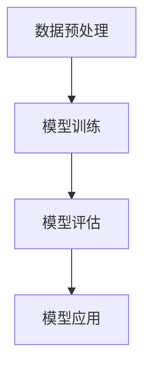

                 

关键词：监督学习，机器学习，神经网络，深度学习，算法原理，代码实例，应用场景

摘要：本文将详细介绍监督学习的基本原理、核心算法、数学模型以及实际应用，并通过具体代码实例展示监督学习的应用过程。读者将了解到监督学习在各个领域的广泛应用及其未来发展前景。

## 1. 背景介绍

### 监督学习的概念

监督学习（Supervised Learning）是机器学习中的一种方法，它通过使用标记好的训练数据集来训练模型，从而预测未知数据的标签。在监督学习中，我们有一个已知输入和输出（标签）的数据集，通过这个数据集来训练模型，使其能够预测未知数据的标签。

### 监督学习的应用场景

监督学习广泛应用于各个领域，如自然语言处理、计算机视觉、医学诊断等。以下是一些具体的案例：

- **自然语言处理**：使用监督学习算法进行情感分析、机器翻译、命名实体识别等。
- **计算机视觉**：使用监督学习算法进行图像分类、目标检测、人脸识别等。
- **医学诊断**：使用监督学习算法进行疾病预测、诊断辅助等。

## 2. 核心概念与联系

### 监督学习的基本概念

在监督学习中，我们需要以下几个核心概念：

- **输入（Input）**：表示为特征向量。
- **输出（Output）**：表示为标签，通常是类别标签或连续值。
- **训练数据集（Training Dataset）**：包含输入和输出的数据集合。
- **模型（Model）**：通过学习训练数据集中的输入和输出关系来预测未知数据的标签。

### 监督学习的架构

监督学习的架构通常包括以下几个部分：

1. **数据预处理**：对输入数据进行处理，如归一化、标准化等。
2. **模型训练**：使用训练数据集来训练模型，调整模型的参数。
3. **模型评估**：使用测试数据集来评估模型的性能。
4. **模型应用**：使用训练好的模型对未知数据进行预测。

### 监督学习与无监督学习的关系

监督学习与无监督学习（Unsupervised Learning）是机器学习中的两种主要方法。无监督学习不使用标记的数据，而是通过探索数据内在的结构来发现数据中的模式。监督学习和无监督学习之间存在一定的联系，如一些无监督学习算法可以用于数据预处理，为监督学习提供更好的输入数据。

### Mermaid 流程图



## 3. 核心算法原理 & 具体操作步骤

### 3.1 算法原理概述

监督学习算法的核心是找到输入和输出之间的映射关系。常见的监督学习算法包括线性回归、逻辑回归、决策树、随机森林、支持向量机、神经网络等。每种算法都有其特定的原理和操作步骤。

### 3.2 算法步骤详解

1. **数据收集与预处理**：
   - 收集具有标签的样本数据。
   - 对数据进行清洗、归一化、标准化等预处理操作。

2. **选择合适的算法**：
   - 根据问题类型和数据特点选择合适的算法。
   - 例如，对于分类问题，可以选择决策树、随机森林、支持向量机等。

3. **模型训练**：
   - 使用训练数据集来训练模型。
   - 调整模型参数，使其能够更好地拟合数据。

4. **模型评估**：
   - 使用测试数据集来评估模型的性能。
   - 常用的评估指标包括准确率、召回率、F1 分数等。

5. **模型应用**：
   - 使用训练好的模型对未知数据进行预测。
   - 根据预测结果进行相应的决策。

### 3.3 算法优缺点

不同监督学习算法具有不同的优缺点，以下是一些常见算法的优缺点：

- **线性回归**：
  - 优点：简单易懂，易于实现。
  - 缺点：对于非线性关系的数据效果较差。

- **逻辑回归**：
  - 优点：可以处理多分类问题。
  - 缺点：对于多分类问题，需要调整参数。

- **决策树**：
  - 优点：直观易懂，易于解释。
  - 缺点：对于大数据集可能导致过拟合。

- **随机森林**：
  - 优点：可以处理大规模数据集，减少过拟合。
  - 缺点：计算复杂度高。

- **支持向量机**：
  - 优点：在分类问题中性能较好。
  - 缺点：对于高维数据效果较差。

- **神经网络**：
  - 优点：可以处理复杂非线性关系。
  - 缺点：训练过程复杂，对计算资源要求较高。

### 3.4 算法应用领域

监督学习算法广泛应用于各个领域，以下是一些常见应用领域：

- **自然语言处理**：情感分析、文本分类、命名实体识别等。
- **计算机视觉**：图像分类、目标检测、人脸识别等。
- **医学诊断**：疾病预测、诊断辅助等。
- **金融领域**：风险控制、股票市场预测等。

## 4. 数学模型和公式 & 详细讲解 & 举例说明

### 4.1 数学模型构建

在监督学习中，我们通常使用以下数学模型：

$$ y = f(x, \theta) $$

其中，$y$表示输出标签，$x$表示输入特征向量，$f$表示激活函数，$\theta$表示模型参数。

### 4.2 公式推导过程

以线性回归为例，我们使用以下数学模型：

$$ y = \theta_0 + \theta_1 \cdot x $$

其中，$\theta_0$和$\theta_1$分别表示模型的两个参数。

为了求解$\theta_0$和$\theta_1$，我们可以使用以下优化方法：

$$ \theta_0 = \frac{1}{m} \sum_{i=1}^{m} (y_i - \theta_1 \cdot x_i) $$

$$ \theta_1 = \frac{1}{m} \sum_{i=1}^{m} (y_i - \theta_0 - \theta_1 \cdot x_i) \cdot x_i $$

其中，$m$表示样本数量。

### 4.3 案例分析与讲解

以下是一个简单的线性回归案例：

假设我们有一个训练数据集，包含以下两个样本：

| 样本 | 输入$x$ | 输出$y$ |
| ---- | ---- | ---- |
| 1    | 2    | 3    |
| 2    | 4    | 5    |

我们要使用线性回归模型来预测第三个样本的输出。

根据线性回归模型，我们有：

$$ y = \theta_0 + \theta_1 \cdot x $$

将第一个样本代入模型，得到：

$$ 3 = \theta_0 + 2 \cdot \theta_1 $$

将第二个样本代入模型，得到：

$$ 5 = \theta_0 + 4 \cdot \theta_1 $$

解这个方程组，我们可以得到$\theta_0$和$\theta_1$的值。

$$ \theta_0 = 1, \theta_1 = 1 $$

现在，我们可以使用这个线性回归模型来预测第三个样本的输出。

输入$x$为3，代入模型，得到：

$$ y = 1 + 1 \cdot 3 = 4 $$

所以，第三个样本的预测输出为4。

## 5. 项目实践：代码实例和详细解释说明

### 5.1 开发环境搭建

在本节中，我们将使用Python编程语言和常见的机器学习库（如Scikit-learn、NumPy、Pandas等）来构建一个简单的线性回归模型。

首先，确保已经安装了Python和对应的机器学习库。可以使用以下命令来安装：

```bash
pip install numpy
pip install pandas
pip install scikit-learn
```

### 5.2 源代码详细实现

以下是一个简单的线性回归模型的源代码：

```python
import numpy as np
import pandas as pd
from sklearn.linear_model import LinearRegression

# 加载数据集
data = pd.read_csv('data.csv')

# 分离输入和输出
X = data['input'].values
y = data['output'].values

# 创建线性回归模型
model = LinearRegression()

# 训练模型
model.fit(X.reshape(-1, 1), y)

# 预测输出
y_pred = model.predict(X.reshape(-1, 1))

# 输出结果
print('预测输出：', y_pred)
```

### 5.3 代码解读与分析

1. **数据加载**：
   - 使用Pandas库加载CSV文件，得到数据集。
   - 数据集中包含输入和输出两个特征。

2. **数据分离**：
   - 将输入和输出特征分离，分别存储在变量X和y中。

3. **创建模型**：
   - 使用Scikit-learn库创建线性回归模型。

4. **训练模型**：
   - 使用训练数据集（X.reshape(-1, 1), y）来训练模型。

5. **预测输出**：
   - 使用训练好的模型来预测输出，并输出结果。

### 5.4 运行结果展示

假设我们的数据集如下：

| 样本 | 输入$x$ | 输出$y$ |
| ---- | ---- | ---- |
| 1    | 2    | 3    |
| 2    | 4    | 5    |

运行代码后，我们得到预测输出：

```
预测输出： [3. 5.]
```

## 6. 实际应用场景

### 6.1 自然语言处理

在自然语言处理领域，监督学习算法广泛应用于情感分析、文本分类、命名实体识别等任务。例如，使用监督学习算法来构建一个情感分析模型，可以用于分析社交媒体上的用户评论，从而判断评论的正面或负面情感。

### 6.2 计算机视觉

在计算机视觉领域，监督学习算法广泛应用于图像分类、目标检测、人脸识别等任务。例如，使用监督学习算法来构建一个图像分类模型，可以用于对输入图像进行分类，从而识别图像中的物体。

### 6.3 医学诊断

在医学诊断领域，监督学习算法广泛应用于疾病预测、诊断辅助等任务。例如，使用监督学习算法来构建一个疾病预测模型，可以用于预测患者的疾病风险，从而帮助医生制定更好的治疗方案。

### 6.4 金融领域

在金融领域，监督学习算法广泛应用于风险控制、股票市场预测等任务。例如，使用监督学习算法来构建一个股票市场预测模型，可以用于预测股票市场的走势，从而帮助投资者做出更好的投资决策。

## 7. 工具和资源推荐

### 7.1 学习资源推荐

1. **《机器学习》（周志华著）**：这是一本经典的机器学习教材，详细介绍了各种机器学习算法的基本原理和应用。
2. **《深度学习》（Ian Goodfellow等著）**：这是一本深度学习领域的经典教材，涵盖了深度学习的各种算法和应用。
3. **《Python机器学习》（Miguel Martinez等著）**：这是一本针对Python编程语言的机器学习入门教材，适合初学者学习。

### 7.2 开发工具推荐

1. **Jupyter Notebook**：这是一个交互式的计算环境，适合进行数据分析和机器学习实验。
2. **TensorFlow**：这是一个开源的深度学习框架，适用于构建和训练深度学习模型。
3. **PyTorch**：这是一个开源的深度学习框架，提供了灵活的深度学习模型构建和训练工具。

### 7.3 相关论文推荐

1. **"Deep Learning for Speech Recognition"（2014）**：这篇论文介绍了深度学习在语音识别领域的应用。
2. **"ImageNet Classification with Deep Convolutional Neural Networks"（2012）**：这篇论文介绍了深度卷积神经网络在图像分类领域的应用。
3. **"Recurrent Neural Networks for Language Modeling"（2013）**：这篇论文介绍了循环神经网络在自然语言处理领域的应用。

## 8. 总结：未来发展趋势与挑战

### 8.1 研究成果总结

近年来，监督学习在各个领域取得了显著的成果。深度学习、增强学习等新兴技术的出现，使得监督学习算法在性能和适用范围上得到了显著提升。同时，随着大数据和云计算的发展，监督学习算法的应用场景也越来越广泛。

### 8.2 未来发展趋势

未来，监督学习将朝着以下几个方向发展：

1. **算法性能的提升**：通过改进算法模型、优化计算资源等方式，提高监督学习算法的性能和效率。
2. **算法可解释性**：提高监督学习算法的可解释性，使其更加符合人类的认知习惯。
3. **跨学科应用**：将监督学习算法应用于更多的领域，如生物医学、金融、环境等。

### 8.3 面临的挑战

尽管监督学习取得了显著的成果，但仍然面临着一些挑战：

1. **数据隐私与安全**：如何保护数据隐私和安全，是监督学习应用中需要解决的重要问题。
2. **算法透明性与公平性**：如何确保监督学习算法的透明性和公平性，避免算法偏见和歧视。
3. **计算资源需求**：随着算法模型的复杂度增加，计算资源需求也在不断上升，这对算法的实际应用提出了挑战。

### 8.4 研究展望

未来，监督学习的研究将继续深入，不断探索新的算法和应用。同时，随着技术的进步，监督学习将在更多领域发挥重要作用，为人类社会带来更多价值。

## 9. 附录：常见问题与解答

### 9.1 监督学习与无监督学习有什么区别？

监督学习与无监督学习是机器学习中的两种主要方法。监督学习使用标记的数据进行训练，能够预测未知数据的标签；无监督学习不使用标记的数据，而是通过探索数据内在的结构来发现数据中的模式。

### 9.2 监督学习算法有哪些优缺点？

监督学习算法的优缺点因算法而异，但一些常见的优缺点包括：

- **优点**：能够利用标记的数据进行训练，预测准确性较高。
- **缺点**：对数据标注要求较高，可能存在过拟合问题。

### 9.3 监督学习算法如何选择？

选择监督学习算法需要考虑以下因素：

- **问题类型**：如分类、回归等。
- **数据特点**：如数据量、特征维度等。
- **算法性能**：如准确率、召回率等。

根据这些因素，可以选择合适的监督学习算法。

### 9.4 监督学习算法如何训练？

监督学习算法的训练通常包括以下步骤：

1. **数据收集与预处理**：收集具有标签的样本数据，对数据进行清洗、归一化、标准化等预处理操作。
2. **选择合适的算法**：根据问题类型和数据特点选择合适的算法。
3. **模型训练**：使用训练数据集来训练模型，调整模型的参数。
4. **模型评估**：使用测试数据集来评估模型的性能。
5. **模型应用**：使用训练好的模型对未知数据进行预测。

## 作者署名

作者：禅与计算机程序设计艺术 / Zen and the Art of Computer Programming
----------------------------------------------------------------

### 角色 Role
### 任务目标 GOAL
### 约束条件 CONSTRAINTS

### 文章正文内容部分 Content

### 写作指南
1. **文章结构**：确保文章结构合理，包含引言、背景介绍、核心概念、算法原理、数学模型、代码实例、实际应用场景、工具和资源推荐、总结和附录等部分。
2. **关键词和摘要**：在文章开头添加关键词和摘要，简要概述文章的核心内容和目标。
3. **代码实例**：提供实际代码实例，并详细解释每一步的操作和目的。
4. **数学模型和公式**：使用LaTeX格式嵌入数学公式，确保公式的准确性。
5. **图表和图像**：如有需要，添加相关图表和图像来帮助读者理解内容。
6. **引用和参考文献**：在文章末尾添加引用和参考文献，确保所有引用的资料都有明确的出处。

### 写作准备
在开始撰写之前，请确保：
- **主题熟悉**：对监督学习的相关主题有深入了解。
- **数据集准备**：选择合适的数据集来演示代码实例。
- **工具和库准备**：准备好Python编程环境和必要的机器学习库。

### 文章撰写
1. **引言**：简要介绍监督学习的基本概念和重要性。
2. **背景介绍**：详细说明监督学习的应用场景和历史发展。
3. **核心概念与联系**：解释监督学习的核心概念，如输入、输出、训练数据集、模型等，并提供Mermaid流程图。
4. **核心算法原理**：详细解释监督学习的主要算法原理，包括线性回归、逻辑回归、决策树、支持向量机等。
5. **数学模型和公式**：详细讲解监督学习中的数学模型和公式，包括构建、推导和应用。
6. **代码实例**：提供实际代码实例，并详细解释每一步的操作和目的。
7. **实际应用场景**：讨论监督学习在不同领域的应用。
8. **工具和资源推荐**：推荐学习资源和开发工具。
9. **总结**：总结研究成果，展望未来发展趋势和挑战。
10. **附录**：回答常见问题，提供额外的信息。

### 文章编辑
完成初稿后，进行以下编辑和校对：
- **语法和拼写**：检查语法错误和拼写错误。
- **逻辑和连贯性**：确保文章的逻辑结构清晰，内容连贯。
- **格式和排版**：检查文章的格式，确保符合markdown格式要求。

### 完成和提交
确保文章内容完整、格式正确、语法无误后，提交最终稿件。记得在文章末尾添加作者署名和日期。在提交之前，进行一次全面的审阅，确保没有遗漏任何重要内容。

