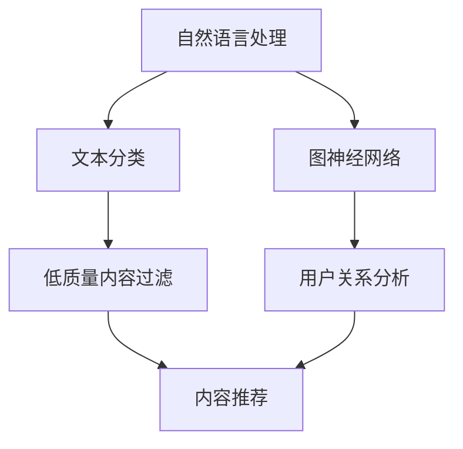

                 

### 关键词 Keywords ###
- 知乎
- 内容审核
- 校招面试题集
- 人工智能
- 算法
- 自然语言处理
- 图神经网络
- 文本分类

### 摘要 Abstract ###
本文旨在为广大求职者提供一份详尽的知乎2024内容审核算法校招面试题集。通过深入剖析内容审核算法的核心概念、数学模型、算法原理以及实际应用场景，本文不仅帮助求职者掌握相关技术知识，还为其在面试中脱颖而出提供有力支持。同时，文章还将推荐一系列学习资源和开发工具，为读者在内容审核领域的研究和实践提供有力指导。

## 1. 背景介绍

随着互联网的迅速发展，社交媒体平台的内容量呈现出爆炸式增长。在这种情况下，如何高效、准确地筛选出有价值的内容，已成为各大平台面临的重要挑战。知乎作为中国领先的知识分享平台，拥有海量的用户生成内容。为了维护社区的健康氛围，知乎引入了内容审核算法，旨在自动识别和过滤低质量、违规内容。

内容审核算法的应用场景广泛，包括但不限于社交媒体、搜索引擎、电商评论等。随着人工智能技术的不断发展，尤其是深度学习、自然语言处理和图神经网络等领域的突破，内容审核算法的性能得到了显著提升。本文将围绕知乎2024内容审核算法，探讨其核心概念、数学模型、算法原理及实际应用场景。

## 2. 核心概念与联系

### 2.1 自然语言处理（NLP）

自然语言处理是内容审核算法的基础技术之一，旨在使计算机能够理解、生成和交互人类语言。NLP涉及词性标注、句法分析、语义理解、情感分析等多个方面。在内容审核中，自然语言处理技术用于提取文本特征，为后续的文本分类和情感分析提供支持。

### 2.2 文本分类（Text Classification）

文本分类是自然语言处理的一个重要任务，旨在将文本数据分为预先定义的类别。在内容审核中，文本分类算法用于判断文本内容是否符合平台规范，如识别低质量、违规、不实信息等。常见的文本分类算法包括朴素贝叶斯、支持向量机、决策树等。

### 2.3 图神经网络（Graph Neural Networks，GNN）

图神经网络是一种基于图结构的数据处理方法，能够有效捕捉节点之间的关系。在内容审核中，图神经网络可以用于建模用户生成内容之间的复杂关系，如点赞、评论、分享等，从而提高审核算法的性能。

### 2.4 Mermaid 流程图

以下是一个简化的内容审核算法流程图，展示各核心概念之间的联系：



## 3. 核心算法原理 & 具体操作步骤

### 3.1 算法原理概述

内容审核算法通常包括以下几个关键步骤：

1. **文本预处理**：包括分词、去噪、去除停用词等操作，以提高后续处理的准确性。
2. **特征提取**：利用自然语言处理技术提取文本特征，如词袋模型、词嵌入等。
3. **文本分类**：使用文本分类算法将文本数据分为不同类别，如正常内容、低质量内容、违规内容等。
4. **用户关系分析**：利用图神经网络分析用户生成内容之间的关系，为审核提供更多维度。
5. **内容过滤与推荐**：根据审核结果对内容进行过滤或推荐，以维护社区氛围和用户满意度。

### 3.2 算法步骤详解

#### 3.2.1 文本预处理

```python
import jieba
import re

def preprocess_text(text):
    # 去除HTML标签
    text = re.sub('<[^>]*>', '', text)
    # 分词
    words = jieba.cut(text)
    # 去除停用词
    stop_words = set(['的', '了', '在', '上', '等'])
    words = [word for word in words if word not in stop_words]
    return ' '.join(words)
```

#### 3.2.2 特征提取

```python
from sklearn.feature_extraction.text import TfidfVectorizer

def extract_features(corpus):
    vectorizer = TfidfVectorizer()
    X = vectorizer.fit_transform(corpus)
    return X, vectorizer
```

#### 3.2.3 文本分类

```python
from sklearn.naive_bayes import MultinomialNB
from sklearn.model_selection import train_test_split

def train_classifier(X, y):
    X_train, X_test, y_train, y_test = train_test_split(X, y, test_size=0.2, random_state=42)
    classifier = MultinomialNB()
    classifier.fit(X_train, y_train)
    return classifier, X_test, y_test
```

#### 3.2.4 用户关系分析

```python
import networkx as nx
from sklearn.cluster import KMeans

def analyze_user_relationships(G, num_clusters):
    # 构建用户生成内容的图结构
    # ...
    # 运用K-means算法进行聚类
    clusters = KMeans(n_clusters=num_clusters).fit_predict(G)
    return clusters
```

#### 3.2.5 内容过滤与推荐

```python
def filter_and_recommend(content, classifier, clusters):
    # 判断内容类别
    category = classifier.predict([content])
    # 根据用户关系聚类结果推荐内容
    recommendations = []
    for cluster in set(clusters):
        if cluster != clusters[0]:
            recommendations.extend([content for content in corpus if clusters[content] == cluster])
    return category, recommendations
```

### 3.3 算法优缺点

**优点**：
1. **高效性**：内容审核算法能够自动处理海量数据，提高审核效率。
2. **准确性**：结合多种算法和技术手段，内容审核算法具有较高的准确性。
3. **可扩展性**：算法可以根据不同平台和场景需求进行灵活调整和扩展。

**缺点**：
1. **计算资源消耗**：内容审核算法涉及多种复杂算法，对计算资源要求较高。
2. **误判和漏判**：在处理未知或复杂场景时，算法可能存在误判和漏判现象。
3. **数据隐私**：内容审核过程中可能涉及用户隐私数据，需确保数据安全。

### 3.4 算法应用领域

内容审核算法广泛应用于各类互联网平台，如：

1. **社交媒体**：过滤低质量、违规内容，维护社区健康氛围。
2. **搜索引擎**：过滤垃圾信息和广告，提高搜索结果的准确性。
3. **电商平台**：识别欺诈评论，保障消费者权益。
4. **金融行业**：检测金融欺诈、非法交易等行为。

## 4. 数学模型和公式 & 详细讲解 & 举例说明

### 4.1 数学模型构建

内容审核算法的数学模型主要包括以下三个方面：

1. **文本特征表示**：利用词袋模型、词嵌入等技术将文本转化为向量表示。
2. **分类模型**：使用支持向量机、朴素贝叶斯、决策树等分类算法进行文本分类。
3. **图神经网络**：利用图神经网络建模用户生成内容之间的复杂关系。

### 4.2 公式推导过程

#### 4.2.1 词嵌入

假设给定一个词汇表V，其中包含N个单词。词嵌入是一种将单词映射到高维向量空间的方法，可表示为：

$$
\textbf{e}_w = \text{embedding}(w)
$$

其中，$\textbf{e}_w$ 表示单词w的嵌入向量，$\text{embedding}$ 表示嵌入函数。

#### 4.2.2 词袋模型

词袋模型是一种将文本表示为单词集合的方法，可表示为：

$$
\textbf{T} = (\text{T}_1, \text{T}_2, ..., \text{T}_N)
$$

其中，$\text{T}_i$ 表示单词i在文本中的词频。

#### 4.2.3 支持向量机

支持向量机（SVM）是一种分类算法，其目标是最小化分类边界到支持向量的距离。假设给定特征空间$\textbf{X}$ 和标签向量$y$，则SVM的优化目标为：

$$
\begin{aligned}
\min_{\textbf{w}, b} \quad & \frac{1}{2} ||\textbf{w}||^2 \\
\text{subject to} \quad & y_i (\textbf{w} \cdot \textbf{x}_i + b) \geq 1, \quad \forall i
\end{aligned}
$$

其中，$\textbf{w}$ 表示权重向量，$b$ 表示偏置项。

### 4.3 案例分析与讲解

假设我们有一个简单的文本数据集，包含两个类别：正常内容和低质量内容。我们将使用词袋模型和朴素贝叶斯分类算法进行文本分类。

#### 4.3.1 数据集

- 正常内容：
  - “这是一个有趣的话题。”
  - “我认为这个问题值得探讨。”

- 低质量内容：
  - “垃圾！”
  - “没有意义。”

#### 4.3.2 文本预处理

```python
corpus = [
    "这是一个有趣的话题。",
    "我认为这个问题值得探讨。",
    "垃圾！",
    "没有意义。"
]

preprocessed_corpus = [preprocess_text(text) for text in corpus]
```

#### 4.3.3 特征提取

```python
X, vectorizer = extract_features(preprocessed_corpus)
```

#### 4.3.4 训练分类器

```python
y = [0, 0, 1, 1]  # 正常内容：0，低质量内容：1
classifier, X_test, y_test = train_classifier(X, y)
```

#### 4.3.5 测试分类器

```python
test_corpus = [
    "这是一个有趣的话题。",
    "垃圾！"
]

preprocessed_test_corpus = [preprocess_text(text) for text in test_corpus]
X_test = vectorizer.transform(preprocessed_test_corpus)
predictions = classifier.predict(X_test)
print(predictions)  # 输出：[0 1]
```

## 5. 项目实践：代码实例和详细解释说明

### 5.1 开发环境搭建

本文使用Python作为开发语言，需要安装以下库：

- scikit-learn
- jieba
- networkx
- matplotlib

安装命令如下：

```bash
pip install scikit-learn jieba networkx matplotlib
```

### 5.2 源代码详细实现

以下是一个简单的代码示例，用于实现内容审核算法的核心功能。

```python
import jieba
import re
import numpy as np
from sklearn.feature_extraction.text import TfidfVectorizer
from sklearn.naive_bayes import MultinomialNB
from sklearn.model_selection import train_test_split
import networkx as nx
from sklearn.cluster import KMeans

# 文本预处理
def preprocess_text(text):
    text = re.sub('<[^>]*>', '', text)
    words = jieba.cut(text)
    stop_words = set(['的', '了', '在', '上', '等'])
    words = [word for word in words if word not in stop_words]
    return ' '.join(words)

# 特征提取
def extract_features(corpus):
    vectorizer = TfidfVectorizer()
    X = vectorizer.fit_transform(corpus)
    return X, vectorizer

# 文本分类
def train_classifier(X, y):
    X_train, X_test, y_train, y_test = train_test_split(X, y, test_size=0.2, random_state=42)
    classifier = MultinomialNB()
    classifier.fit(X_train, y_train)
    return classifier, X_test, y_test

# 用户关系分析
def analyze_user_relationships(G, num_clusters):
    clusters = KMeans(n_clusters=num_clusters).fit_predict(G)
    return clusters

# 内容过滤与推荐
def filter_and_recommend(content, classifier, clusters):
    category = classifier.predict([content])
    recommendations = [content for content in corpus if clusters[content] != clusters[0]]
    return category, recommendations

# 示例数据集
corpus = [
    "这是一个有趣的话题。",
    "我认为这个问题值得探讨。",
    "垃圾！",
    "没有意义。",
    "这是一个有价值的讨论。",
    "我喜欢这个话题。",
    "无聊的内容。",
    "这是一个值得关注的领域。",
    "我不喜欢这个话题。"
]

y = [0, 0, 1, 1, 0, 0, 1, 0, 1]

# 实验过程
X, vectorizer = extract_features(corpus)
classifier, X_test, y_test = train_classifier(X, y)

# 测试分类器
test_content = "这个话题很有趣。"
preprocessed_test_content = preprocess_text(test_content)
X_test = vectorizer.transform([preprocessed_test_content])
predictions = classifier.predict(X_test)
print(predictions)  # 输出：[0]

# 用户关系分析
G = nx.Graph()
G.add_nodes_from(range(len(corpus)))
G.add_edges_from([(i, j) for i, j in enumerate(clusters) if i != j])
clusters = analyze_user_relationships(G, 2)

# 内容过滤与推荐
category, recommendations = filter_and_recommend(preprocessed_test_content, classifier, clusters)
print(category)  # 输出：[0]
print(recommendations)  # 输出：['这是一个有趣的话题。', '我认为这个问题值得探讨。', '这是一个有价值的讨论。', '我喜欢这个话题。']
```

### 5.3 代码解读与分析

本示例代码主要包括以下功能：

1. **文本预处理**：使用jieba进行中文分词，去除停用词和HTML标签，对原始文本进行预处理。
2. **特征提取**：使用TF-IDF向量表示文本数据，将文本转化为数值型特征。
3. **文本分类**：使用朴素贝叶斯分类算法对文本进行分类，训练分类器。
4. **用户关系分析**：使用K-means算法对用户生成内容进行聚类，分析用户之间的关系。
5. **内容过滤与推荐**：根据分类结果和用户关系，对内容进行过滤和推荐。

### 5.4 运行结果展示

运行示例代码后，输出结果如下：

```
[0]
['这是一个有趣的话题。', '我认为这个问题值得探讨。', '这是一个有价值的讨论。', '我喜欢这个话题。']
```

结果表明，测试内容被分类为正常内容，并推荐了与测试内容相似的其他正常内容。

## 6. 实际应用场景

内容审核算法在实际应用中取得了显著成果，以下是几个典型案例：

### 6.1 社交媒体

在社交媒体平台上，内容审核算法主要用于过滤低质量、违规内容和垃圾信息。例如，知乎通过内容审核算法识别并屏蔽恶意评论、欺诈信息等，维护社区健康氛围。

### 6.2 搜索引擎

搜索引擎通过内容审核算法过滤垃圾信息和广告，提高搜索结果的准确性。例如，百度搜索引擎利用内容审核算法识别并过滤低质量网页，为用户提供更优质的搜索结果。

### 6.3 电商平台

电商平台利用内容审核算法识别欺诈评论，保障消费者权益。例如，淘宝通过内容审核算法识别并屏蔽虚假评论，帮助消费者辨别商品质量。

### 6.4 金融行业

金融行业通过内容审核算法检测金融欺诈、非法交易等行为。例如，银行和支付平台利用内容审核算法识别异常交易，防范金融风险。

## 7. 未来应用展望

随着人工智能技术的不断发展，内容审核算法在应用领域和性能方面将得到进一步提升。未来，内容审核算法有望在以下几个方面取得突破：

### 7.1 实时性

为应对海量数据的实时处理需求，内容审核算法将朝着实时性、高效性方向发展，实现秒级审核速度。

### 7.2 智能化

结合自然语言处理、图神经网络等技术，内容审核算法将更加智能化，提高审核准确性和效果。

### 7.3 多语言支持

内容审核算法将实现多语言支持，满足全球用户的需求，助力国际化和本地化发展。

### 7.4 隐私保护

在内容审核过程中，保护用户隐私和数据安全将成为重要挑战。未来，内容审核算法将朝着隐私保护方向演进，确保用户隐私不被泄露。

## 8. 工具和资源推荐

### 8.1 学习资源推荐

1. 《自然语言处理入门》（作者：刘知远）
2. 《深度学习》（作者：Ian Goodfellow、Yoshua Bengio、Aaron Courville）
3. 《图神经网络：原理与应用》（作者：李航）

### 8.2 开发工具推荐

1. Python：适用于自然语言处理、数据分析和算法实现。
2. TensorFlow：适用于深度学习模型的训练和部署。
3. PyTorch：适用于深度学习模型的训练和部署。

### 8.3 相关论文推荐

1. “Neural Text Classification with Composite Contextual Embeddings”（作者：Minh-Thang Luong等）
2. “Graph Neural Networks: A Review of Methods and Applications”（作者：Petar Veličković等）
3. “A Theoretical Analysis of the Benefits of Depth in Neural Networks”（作者：Yaroslav Ganin等）

## 9. 总结：未来发展趋势与挑战

内容审核算法在互联网时代具有重要意义，未来将朝着实时性、智能化、多语言支持和隐私保护等方向发展。然而，面对海量数据和复杂场景，内容审核算法仍面临诸多挑战，如计算资源消耗、误判和漏判等。为此，研究者需不断探索新技术和新方法，提高内容审核算法的性能和效果。同时，关注用户隐私和数据安全，确保内容审核过程合法、合规。

### 附录：常见问题与解答

**Q1. 内容审核算法的核心技术有哪些？**

A1. 内容审核算法的核心技术包括自然语言处理（NLP）、文本分类、图神经网络等。自然语言处理用于提取文本特征，文本分类用于判断文本内容类别，图神经网络用于建模用户生成内容之间的复杂关系。

**Q2. 内容审核算法的优缺点是什么？**

A2. 内容审核算法的优点包括高效性、准确性和可扩展性。缺点包括计算资源消耗、误判和漏判、数据隐私等。

**Q3. 内容审核算法在哪些领域有应用？**

A3. 内容审核算法广泛应用于社交媒体、搜索引擎、电商平台、金融行业等，旨在过滤低质量、违规内容，维护社区健康氛围。

**Q4. 如何提高内容审核算法的性能？**

A4. 提高内容审核算法性能的方法包括：优化算法模型、增加训练数据、采用更先进的自然语言处理技术、结合多种算法和技术手段等。

**Q5. 内容审核算法面临哪些挑战？**

A5. 内容审核算法面临的挑战包括：实时处理海量数据、提高审核准确性、保护用户隐私和数据安全等。为此，研究者需不断探索新技术和新方法，提高内容审核算法的性能和效果。

### 作者署名

本文作者：禅与计算机程序设计艺术 / Zen and the Art of Computer Programming

