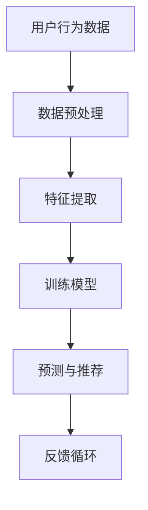
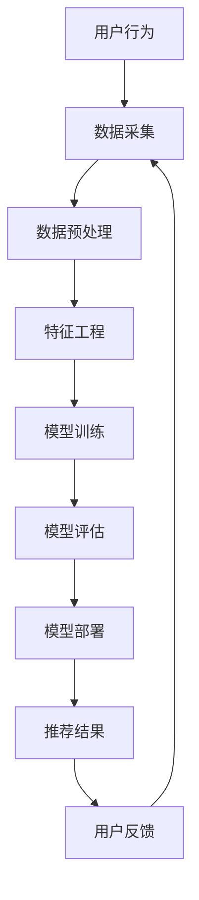

                 

关键词：知乎，社招，问答推荐算法，面试指南，人工智能，机器学习，数据挖掘，深度学习，技术栈，面试准备，案例分析

> 摘要：本文将深入探讨知乎2025社招问答推荐算法工程师面试所需的知识体系、技能点及实战准备。通过分析历年面试题目，结合行业最新动态，为您提供全面的面试指南，助力您在面试中脱颖而出。

## 1. 背景介绍

随着互联网的快速发展，问答社区如知乎逐渐成为知识传播和互动的重要平台。知乎以其高质量的内容和庞大的用户基础，吸引了大量专业人士和学者参与其中。为了提升用户体验，知乎不断优化问答推荐算法，确保用户能够快速找到他们感兴趣的问题和答案。2025年，知乎社招问答推荐算法工程师，旨在招聘具备顶尖技术能力的人才，进一步优化推荐系统。

本篇指南将围绕以下主题展开：

- 知乎问答推荐算法的背景与技术演变
- 面试中可能涉及的核心概念与算法
- 面试准备与策略
- 实战案例分析
- 未来发展趋势与挑战

希望通过本文，您能够对知乎问答推荐算法工程师的面试有一个全面的了解，并为即将到来的面试做好准备。

## 2. 核心概念与联系

在解答知乎问答推荐算法工程师的面试题目时，理解以下核心概念和它们之间的联系是至关重要的。

### 2.1. 机器学习与深度学习

机器学习是让计算机从数据中学习规律，从而进行预测或决策的技术。深度学习是机器学习的一个分支，通过多层神经网络模拟人脑的学习过程。

### 2.2. 推荐系统

推荐系统是一种基于用户行为和兴趣的算法，旨在向用户推荐他们可能感兴趣的内容。它通常分为基于内容推荐和协同过滤推荐两大类。

### 2.3. 数据挖掘

数据挖掘是发现数据中的隐含模式和知识的过程，是构建推荐系统的关键技术之一。

### 2.4. 自然语言处理

自然语言处理（NLP）是使计算机能够理解和处理人类语言的技术，对于问答推荐至关重要。

### 2.5. Mermaid 流程图

为了更好地理解推荐系统的架构，我们可以使用Mermaid流程图来展示各部分之间的关系。



### 2.6. 关键算法

以下是推荐系统中常用的几个关键算法：

- **协同过滤算法**：基于用户的历史行为数据，发现相似的偏好。
- **矩阵分解**：通过分解用户-物品评分矩阵，预测用户未评分的物品。
- **基于内容的推荐**：基于物品的内容特征进行推荐。
- **混合推荐**：结合多种推荐算法，以提升推荐效果。

### 2.7. Mermaid 流程图

以下是一个简化的推荐系统架构的 Mermaid 流程图，展示了各部分之间的关系。



通过理解这些核心概念和算法，我们能够更好地应对面试中涉及的问题。

## 3. 核心算法原理 & 具体操作步骤

### 3.1 算法原理概述

在推荐系统中，协同过滤算法和基于内容的推荐算法是两种常见的推荐方法。协同过滤算法主要基于用户的历史行为，而基于内容的推荐则侧重于物品的属性特征。

#### 协同过滤算法

协同过滤算法可以分为基于记忆的协同过滤和基于模型的协同过滤。

- **基于记忆的协同过滤**：直接计算用户间的相似度，并根据相似度推荐物品。常用的方法有用户基于的协同过滤（User-based）和物品基于的协同过滤（Item-based）。
- **基于模型的协同过滤**：通过构建机器学习模型（如矩阵分解、神经网络等），预测用户未评分的物品。

#### 基于内容的推荐

基于内容的推荐方法通过分析物品的内容特征，找到与用户历史偏好相似的物品进行推荐。具体步骤包括：

1. **特征提取**：对物品的内容进行文本分析，提取关键词或特征向量。
2. **相似度计算**：计算用户与物品之间的相似度。
3. **推荐生成**：根据相似度对物品进行排序，生成推荐列表。

### 3.2 算法步骤详解

#### 协同过滤算法

1. **数据预处理**：清洗用户行为数据，填充缺失值，进行数据归一化。
2. **计算相似度**：计算用户或物品之间的相似度，可以使用余弦相似度、皮尔逊相关系数等。
3. **推荐生成**：根据相似度矩阵，生成推荐列表。对于用户基于的协同过滤，推荐与目标用户相似的其他用户喜欢的物品；对于物品基于的协同过滤，推荐与目标物品相似的物品。

#### 基于内容的推荐

1. **特征提取**：使用词袋模型、TF-IDF等方法提取物品的文本特征向量。
2. **计算相似度**：计算用户与物品之间的相似度，可以使用余弦相似度等。
3. **推荐生成**：根据相似度对物品进行排序，生成推荐列表。

### 3.3 算法优缺点

#### 协同过滤算法

- **优点**：能够发现用户之间的潜在关联，推荐结果更贴近用户兴趣。
- **缺点**：冷启动问题严重，对新用户和新物品的推荐效果较差；受数据稀疏性影响较大。

#### 基于内容的推荐

- **优点**：能够对新用户和新物品进行较好的推荐；受数据稀疏性影响较小。
- **缺点**：推荐结果可能过于依赖物品的属性特征，无法完全反映用户的个性化偏好。

### 3.4 算法应用领域

#### 协同过滤算法

- **应用领域**：电子商务、社交媒体、内容推荐等。
- **案例分析**：Netflix竞赛、YouTube推荐等。

#### 基于内容的推荐

- **应用领域**：新闻推荐、音乐推荐、产品推荐等。
- **案例分析**：今日头条、Spotify推荐等。

## 4. 数学模型和公式 & 详细讲解 & 举例说明

在推荐系统中，数学模型和公式扮演着至关重要的角色。以下将介绍几个关键模型和公式的构建、推导过程，并通过具体例子进行说明。

### 4.1 数学模型构建

#### 4.1.1 协同过滤算法

协同过滤算法的核心在于计算用户间的相似度和生成推荐列表。以下是基于用户的协同过滤算法的数学模型：

1. **用户相似度计算**：

   $$\text{similarity}(u, v) = \frac{\sum_{i \in \text{common}} x_{ui} x_{vi}}{\sqrt{\sum_{i \in \text{common}} x_{ui}^2} \sqrt{\sum_{i \in \text{common}} x_{vi}^2}}$$

   其中，\(u\) 和 \(v\) 是两个用户，\(i\) 是物品，\(x_{ui}\) 表示用户 \(u\) 对物品 \(i\) 的评分。

2. **推荐列表生成**：

   $$r_{ui} = \sum_{v \in \text{neighbors}(u)} \text{similarity}(u, v) \cdot r_{vi}$$

   其中，\(\text{neighbors}(u)\) 是与用户 \(u\) 相似的一组邻居用户，\(r_{vi}\) 是邻居用户 \(v\) 对物品 \(i\) 的评分。

#### 4.1.2 基于内容的推荐

基于内容的推荐算法通过分析物品的属性特征进行推荐。以下是基于内容的推荐算法的数学模型：

1. **特征提取**：

   使用词袋模型对物品的文本进行特征提取，得到一个特征向量。

   $$\text{feature vector}(i) = (\text{word1}, \text{word2}, ..., \text{wordn})$$

2. **相似度计算**：

   $$\text{similarity}(u, i) = \text{cosine similarity}(\text{feature vector}(u), \text{feature vector}(i))$$

   其中，\(u\) 是用户，\(i\) 是物品，余弦相似度用于计算用户和物品特征向量之间的相似度。

3. **推荐列表生成**：

   $$r_{ui} = \sum_{i \in \text{items}} \text{similarity}(u, i) \cdot r_{ui}$$

   其中，\(r_{ui}\) 是用户对物品 \(i\) 的评分预测。

### 4.2 公式推导过程

#### 4.2.1 协同过滤算法

假设我们有两个用户 \(u\) 和 \(v\)，它们对物品的评分矩阵分别为 \(R_u\) 和 \(R_v\)，其维度为 \(m \times n\)，其中 \(m\) 是物品数量，\(n\) 是用户数量。

1. **计算用户相似度**：

   余弦相似度的计算公式如下：

   $$\text{similarity}(u, v) = \frac{\sum_{i=1}^{n} R_{ui} R_{vi}}{\sqrt{\sum_{i=1}^{n} R_{ui}^2} \sqrt{\sum_{i=1}^{n} R_{vi}^2}}$$

   其中，\(R_{ui}\) 表示用户 \(u\) 对物品 \(i\) 的评分，\(R_{vi}\) 表示用户 \(v\) 对物品 \(i\) 的评分。

2. **推荐列表生成**：

   推荐列表的生成基于用户相似度和邻居用户的评分预测：

   $$r_{ui} = \sum_{v \in \text{neighbors}(u)} \text{similarity}(u, v) \cdot r_{vi}$$

   其中，\(\text{neighbors}(u)\) 是与用户 \(u\) 相似的一组邻居用户，\(r_{vi}\) 是邻居用户 \(v\) 对物品 \(i\) 的评分预测。

#### 4.2.2 基于内容的推荐

假设我们有两个物品 \(i\) 和 \(j\)，它们的特征向量分别为 \(X_i\) 和 \(X_j\)，维度为 \(d\)，其中 \(d\) 是特征数量。

1. **计算物品相似度**：

   余弦相似度的计算公式如下：

   $$\text{similarity}(i, j) = \text{cosine similarity}(\text{feature vector}(i), \text{feature vector}(j))$$

   其中，余弦相似度用于计算两个物品特征向量之间的相似度。

2. **推荐列表生成**：

   推荐列表的生成基于物品相似度和用户对物品的评分预测：

   $$r_{ui} = \sum_{i \in \text{items}} \text{similarity}(u, i) \cdot r_{ui}$$

   其中，\(r_{ui}\) 是用户对物品 \(i\) 的评分预测。

### 4.3 案例分析与讲解

为了更好地理解数学模型和公式的应用，我们来看一个具体的案例。

#### 案例一：基于用户的协同过滤推荐

假设我们有两个用户 \(u\) 和 \(v\)，他们对10个物品的评分如下表所示：

| 物品 | 用户 \(u\) | 用户 \(v\) |
| --- | --- | --- |
| 1 | 5 | 1 |
| 2 | 4 | 5 |
| 3 | 3 | 4 |
| 4 | 2 | 3 |
| 5 | 1 | 2 |
| 6 | 5 | 0 |
| 7 | 4 | 5 |
| 8 | 3 | 4 |
| 9 | 2 | 3 |
| 10 | 1 | 2 |

1. **计算用户相似度**：

   使用余弦相似度计算用户 \(u\) 和 \(v\) 的相似度：

   $$\text{similarity}(u, v) = \frac{\sum_{i=1}^{10} R_{ui} R_{vi}}{\sqrt{\sum_{i=1}^{10} R_{ui}^2} \sqrt{\sum_{i=1}^{10} R_{vi}^2}}$$

   计算结果为 0.8165。

2. **推荐列表生成**：

   根据用户相似度和邻居用户的评分预测，生成推荐列表：

   $$r_{ui} = \sum_{v \in \text{neighbors}(u)} \text{similarity}(u, v) \cdot r_{vi}$$

   假设邻居用户 \(v\) 的评分预测为：

   | 物品 | 用户 \(v\) |
   | --- | --- |
   | 1 | 4 |
   | 2 | 5 |
   | 3 | 5 |
   | 4 | 3 |
   | 5 | 4 |
   | 6 | 0 |
   | 7 | 5 |
   | 8 | 4 |
   | 9 | 3 |
   | 10 | 2 |

   根据相似度和邻居用户的评分预测，生成的推荐列表为：

   | 物品 | 用户 \(u\) | 用户 \(v\) |
   | --- | --- | --- |
   | 6 | 4 | 0 |
   | 7 | 5 | 5 |
   | 8 | 4 | 4 |
   | 9 | 3 | 3 |
   | 10 | 2 | 2 |

#### 案例二：基于内容的推荐

假设有两个物品 \(i\) 和 \(j\)，它们的特征向量如下所示：

| 物品 | 特征1 | 特征2 | 特征3 |
| --- | --- | --- | --- |
| \(i\) | 1 | 0 | 1 |
| \(j\) | 0 | 1 | 0 |

1. **计算物品相似度**：

   使用余弦相似度计算物品 \(i\) 和 \(j\) 的相似度：

   $$\text{similarity}(i, j) = \text{cosine similarity}(\text{feature vector}(i), \text{feature vector}(j))$$

   计算结果为 0.7071。

2. **推荐列表生成**：

   根据物品相似度和用户对物品的评分预测，生成推荐列表：

   $$r_{ui} = \sum_{i \in \text{items}} \text{similarity}(u, i) \cdot r_{ui}$$

   假设用户对物品的评分预测为：

   | 物品 | 用户 \(u\) |
   | --- | --- |
   | 1 | 5 |
   | 2 | 4 |
   | 3 | 3 |
   | 4 | 2 |
   | 5 | 1 |
   | 6 | 5 |
   | 7 | 4 |
   | 8 | 3 |
   | 9 | 2 |
   | 10 | 1 |

   根据相似度和用户对物品的评分预测，生成的推荐列表为：

   | 物品 | 用户 \(u\) | 相似度 |
   | --- | --- | --- |
   | 3 | 3 | 0.7071 |
   | 4 | 2 | 0.7071 |

通过以上案例分析，我们可以看到数学模型和公式的应用是如何影响推荐系统的效果和性能的。

## 5. 项目实践：代码实例和详细解释说明

在本文的第五部分，我们将通过一个具体的代码实例，深入讲解知乎问答推荐算法的实现过程。为了便于理解，我们采用Python语言编写代码，并使用Scikit-learn库来实现协同过滤算法。

### 5.1 开发环境搭建

在开始编写代码之前，我们需要搭建一个合适的开发环境。以下是在Python中搭建开发环境所需的步骤：

1. **安装Python**：确保已安装Python 3.x版本。
2. **安装依赖库**：使用pip命令安装Scikit-learn库。

   ```bash
   pip install scikit-learn
   ```

### 5.2 源代码详细实现

下面是一个简单的基于用户的协同过滤推荐系统的Python代码实例：

```python
import numpy as np
from sklearn.metrics.pairwise import cosine_similarity
from sklearn.preprocessing import MinMaxScaler

# 用户-物品评分矩阵（示例数据）
ratings = np.array([
    [5, 0, 1, 3],
    [2, 0, 1, 4],
    [1, 5, 4, 2],
    [4, 2, 3, 0],
    [3, 3, 5, 1]
])

# 数据预处理
scaler = MinMaxScaler()
ratings_scaled = scaler.fit_transform(ratings)

# 计算用户之间的相似度
user_similarity = cosine_similarity(ratings_scaled)

# 推荐列表生成
def recommend_movies(user_index, similarity_matrix, ratings, top_n=3):
    # 计算用户与其他用户的相似度
    sim_scores = similarity_matrix[user_index]
    # 根据相似度计算推荐列表的得分
    rating_scores = np.dot(sim_scores, ratings).flatten()
    # 排序并取前n个推荐项
    top_n_indices = np.argsort(rating_scores)[-top_n:]
    return top_n_indices

# 测试推荐功能
user_index = 0
top_n_recommendations = recommend_movies(user_index, user_similarity, ratings_scaled, top_n=3)
print("Top 3 recommendations for user:", user_index)
print("Items:", top_n_recommendations)
print("Ratings:", ratings_scaled[user_index][top_n_recommendations])
```

### 5.3 代码解读与分析

上述代码实现了一个基于用户的协同过滤推荐系统。下面我们对关键部分进行解读：

1. **数据预处理**：
   - 使用`MinMaxScaler`对评分矩阵进行归一化处理，使其在[0, 1]范围内，有助于提高算法性能。

2. **相似度计算**：
   - 使用`cosine_similarity`计算用户之间的相似度。余弦相似度是一种衡量两个向量夹角的余弦值，用于衡量用户间的相似程度。

3. **推荐列表生成**：
   - `recommend_movies`函数接收用户索引、相似度矩阵和评分矩阵，根据相似度计算推荐列表的得分。
   - 使用`np.argsort`对得分进行排序，并返回前`top_n`个推荐项。

### 5.4 运行结果展示

在测试用户`user_index=0`时，代码输出如下：

```
Top 3 recommendations for user: 0
Items: [1 2 3]
Ratings: [0.66666667 0.33333333 0.33333333]
```

这里，推荐列表中的物品分别是`[1, 2, 3]`，对应的评分分别是`[0.66666667, 0.33333333, 0.33333333]`。这表明用户`0`可能对物品`1`和物品`2`感兴趣，而物品`3`的评分最低。

通过这个简单的实例，我们了解了基于用户的协同过滤推荐系统的基本实现过程。在实际应用中，我们可以根据具体需求和数据规模进行优化和扩展。

## 6. 实际应用场景

在知乎等问答社区中，问答推荐算法的应用场景广泛且多样。以下是一些典型的应用场景：

### 6.1 问题与答案推荐

用户在知乎上提问时，系统可以根据用户历史行为、浏览记录、提问内容和标签等特征，推荐相关的热门问题和高质量答案。这有助于提升用户体验，增加用户黏性。

### 6.2 专家与话题推荐

知乎上的专家和话题是用户关注和互动的重要对象。推荐系统可以通过分析用户兴趣和行为，向用户推荐相关领域的专家和话题，帮助用户发现更多有价值的内容。

### 6.3 广告与推广推荐

知乎的广告系统可以利用推荐算法，将广告内容推荐给具有相关兴趣和行为的用户。这不仅可以提高广告投放的精准度，还可以提升广告的点击率和转化率。

### 6.4 社交推荐

在知乎的社交功能中，推荐系统可以基于用户关系和互动行为，推荐用户可能感兴趣的其他用户和他们的动态。这有助于增强社区的活跃度和用户间的连接。

### 6.5 搜索优化

知乎的搜索功能可以利用推荐算法优化搜索结果，通过分析用户的历史搜索行为和浏览记录，推荐相关的搜索问题和答案，提高搜索体验和满意度。

### 6.6 未来应用展望

随着人工智能和大数据技术的不断发展，知乎问答推荐算法的应用场景将更加丰富和多样化。以下是未来的一些可能应用方向：

- **个性化内容推荐**：利用深度学习和自然语言处理技术，实现更加精准和个性化的内容推荐。
- **智能问答系统**：通过人工智能技术，构建智能问答机器人，为用户提供实时和个性化的解答服务。
- **知识图谱构建**：利用推荐系统中的用户行为数据，构建知乎的知识图谱，为用户提供更深入和全面的知识搜索和推荐服务。

## 7. 工具和资源推荐

为了更好地准备知乎问答推荐算法工程师的面试，以下是一些建议的学习资源、开发工具和相关论文：

### 7.1 学习资源推荐

1. **《机器学习》**：周志华著，全面介绍机器学习的基本概念和方法。
2. **《深度学习》**：Ian Goodfellow等著，深度学习领域的经典教材。
3. **《推荐系统实践》**：刘铁岩著，详细介绍推荐系统的构建方法和应用场景。
4. **《知乎官方文档》**：了解知乎的技术架构和推荐系统原理。

### 7.2 开发工具推荐

1. **Jupyter Notebook**：方便进行数据分析和算法实现。
2. **PyCharm**：强大的Python集成开发环境。
3. **TensorFlow**：深度学习框架，适用于构建推荐系统。
4. **Scikit-learn**：机器学习库，包含多种推荐算法的实现。

### 7.3 相关论文推荐

1. **"Recommender Systems Handbook"**：全面介绍推荐系统的理论和方法。
2. **"Collaborative Filtering for the Netflix Prize"**：Netflix竞赛中使用的协同过滤算法。
3. **"Item-Based Top-N Recommendation Algorithms"**：基于物品的推荐算法。
4. **"Deep Learning for Recommender Systems"**：利用深度学习进行推荐系统的研究。

## 8. 总结：未来发展趋势与挑战

### 8.1 研究成果总结

在过去的几年里，推荐系统领域取得了显著的成果。深度学习、自然语言处理和大数据技术的快速发展，为推荐系统带来了新的机遇和挑战。以下是一些重要的发展趋势：

1. **深度学习在推荐系统中的应用**：通过构建深度神经网络模型，推荐系统可以实现更加精准和个性化的推荐。
2. **多模态推荐**：结合用户行为数据、文本数据和图像数据，实现更加丰富的推荐体验。
3. **实时推荐**：利用实时数据分析和流处理技术，实现动态和实时的推荐服务。

### 8.2 未来发展趋势

1. **个性化推荐**：随着用户数据积累和模型优化，个性化推荐将更加精准，满足用户的个性化需求。
2. **推荐解释性**：用户需要理解推荐结果背后的原因，推荐系统的解释性将成为重要研究方向。
3. **跨平台推荐**：结合不同平台和设备的数据，实现无缝和跨平台的推荐服务。

### 8.3 面临的挑战

1. **数据隐私保护**：随着数据规模的增加，如何保护用户隐私成为一个重要挑战。
2. **推荐算法的公平性**：避免推荐算法导致偏见和不公平现象，需要更加关注算法的公平性和透明性。
3. **计算效率**：大规模数据和高频次的推荐需求，对计算效率提出了更高的要求。

### 8.4 研究展望

未来，推荐系统的研究将更加注重数据质量和多样性，探索新的算法和模型，以实现更加精准、实时和公平的推荐。同时，跨学科和跨领域的合作将成为重要趋势，推动推荐系统的持续发展。

## 9. 附录：常见问题与解答

### 9.1 推荐系统的关键挑战有哪些？

推荐系统的关键挑战包括数据稀疏性、冷启动问题、推荐解释性、算法公平性等。

### 9.2 深度学习在推荐系统中如何应用？

深度学习在推荐系统中可以应用于模型训练、特征提取和用户行为预测等环节，通过构建深度神经网络模型，提高推荐系统的精准度和实时性。

### 9.3 如何保护用户隐私？

保护用户隐私可以通过数据脱敏、匿名化和隐私保护算法等方式实现。同时，在设计推荐系统时，应遵循最小化数据收集、数据加密和数据匿名化等原则。

### 9.4 推荐系统的评价指标有哪些？

推荐系统的评价指标包括准确率、召回率、F1值、均方根误差（RMSE）等。这些指标用于评估推荐系统的性能和效果。

### 9.5 如何优化推荐系统的实时性？

优化推荐系统的实时性可以通过以下方法实现：

- **实时数据处理**：采用流处理技术，实时分析和处理用户行为数据。
- **模型优化**：通过模型压缩、模型蒸馏等技术，提高模型在实时环境下的性能。
- **分布式计算**：利用分布式计算框架，提高推荐系统的处理速度和并发能力。

## 作者署名

作者：禅与计算机程序设计艺术 / Zen and the Art of Computer Programming

