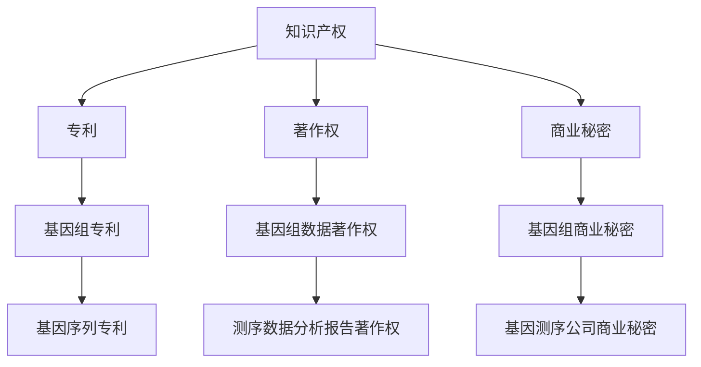

                 

知识产权（Intellectual Property，简称IP）是人类知识、创新和智慧的重要载体，对推动科技进步和社会发展具有不可替代的作用。人类基因组研究作为现代生物科学的前沿领域，对全球生命科学研究产生了深远影响。本文将探讨知识产权在人类基因组研究中的重要作用，分析其中的法律、伦理、经济与社会影响，并展望未来知识产权保护的发展趋势。

## 文章关键词

- 知识产权
- 人类基因组研究
- 法律保护
- 伦理争议
- 经济效益
- 社会发展

## 摘要

本文首先概述了人类基因组研究的重要性和发展历程，然后探讨了知识产权在人类基因组研究中的核心作用，包括专利、版权和商业秘密等方面的法律保护。接着，分析了知识产权在人类基因组研究中的伦理争议，如隐私权、基因歧视等问题。随后，探讨了知识产权对人类基因组研究的经济效益和社会影响。最后，展望了未来知识产权保护的发展趋势，并提出相关建议。

## 1. 背景介绍

人类基因组计划（Human Genome Project，HGP）是20世纪末一项具有划时代意义的国际合作项目，旨在识别人类基因组的全部DNA序列。该项目于2003年完成，标志着人类对自身基因组的首次全面解读。随后，基因测序技术的发展迅速，使得人类基因组测序的成本大幅度降低，基因组研究的规模和应用范围不断扩大。

人类基因组研究不仅仅是对基因序列的识读，更涉及到基因功能、基因相互作用、基因组结构等多层次的研究。这些研究对理解人类疾病的发病机制、开发新药物、个性化医疗等领域具有重要价值。随着基因组研究不断深入，涉及到的知识产权问题也日益复杂。

### 1.1 人类基因组研究的意义

人类基因组研究的意义主要体现在以下几个方面：

1. **医学与健康**：基因组研究有助于揭示各种疾病的遗传基础，为疾病预防、诊断和治疗提供了新的思路和方法。例如，通过基因组测序可以预测个体患某些遗传性疾病的风险，从而进行早期干预。

2. **生物学与进化**：基因组研究为理解生物多样性和进化提供了丰富的数据。通过比较不同物种的基因组，可以揭示生命进化的规律和过程。

3. **农业与食品**：基因组研究在农业领域有广泛应用，如提高作物产量、抗病性和营养价值。通过基因组编辑技术，还可以培育出适应环境变化的新品种。

4. **环境与生态**：基因组研究有助于揭示生物与环境之间的相互作用，为环境保护和生态修复提供科学依据。

### 1.2 基因组研究的挑战

基因组研究虽然带来了许多机遇，但也面临一系列挑战：

1. **数据规模与处理**：基因组数据量庞大，处理和分析这些数据需要高效的计算资源和算法。

2. **基因功能解析**：尽管人类基因组测序完成，但大部分基因的功能尚未明确，需要进一步研究。

3. **伦理问题**：基因组研究涉及个人隐私、基因歧视等伦理问题，需要制定相应的伦理规范和法律法规。

4. **知识产权争议**：基因组研究涉及大量的知识产权问题，如何合理保护知识产权成为一个亟待解决的问题。

## 2. 核心概念与联系

### 2.1 知识产权的基本概念

知识产权是指人们就其智力劳动成果所依法享有的专有权利，通常包括专利、商标、著作权、商业秘密等。知识产权的保护有助于激励创新，促进技术进步。

#### 2.1.1 专利

专利是一种法律保护，授予发明人在一定时间内对发明创造的独占权。在人类基因组研究中，基因序列可以被授予专利，从而保护基因组的创新成果。

#### 2.1.2 著作权

著作权是指对作品（如文字、音乐、软件等）的原创性表达享有权利。在基因组研究中，基因组序列的测序和分析数据可以作为著作权受到保护。

#### 2.1.3 商业秘密

商业秘密是指不为公众所知悉、具有商业价值、并通过保密措施加以保护的信息。在基因组研究中，企业的商业计划、操作流程等可以被视为商业秘密受到保护。

### 2.2 知识产权与基因组研究的联系

人类基因组研究涉及大量的智力劳动成果，这些成果的知识产权保护对于激励科学研究和技术创新具有重要意义。

#### 2.2.1 专利在基因组研究中的应用

基因序列专利是基因组研究知识产权保护的重要组成部分。例如，人类基因组计划的成果之一——人类基因序列被授予了多项专利，保护了基因组的创新成果。

#### 2.2.2 著作权在基因组研究中的应用

基因组测序和分析数据可以作为著作权受到保护。例如，测序公司对客户提供的基因组数据进行分析后生成的报告，可以作为著作权受到法律保护。

#### 2.2.3 商业秘密在基因组研究中的应用

基因组研究过程中产生的商业信息，如企业的商业计划、操作流程等，可以作为商业秘密受到保护。例如，基因测序公司的商业机密信息，如客户信息、基因库信息等，可以通过保密措施得到保护。

### 2.3 Mermaid 流程图

以下是描述知识产权与基因组研究之间联系的 Mermaid 流程图：



## 3. 核心算法原理 & 具体操作步骤

### 3.1 算法原理概述

在人类基因组研究中，知识产权保护的核心算法主要包括基因序列分析、基因组组装和序列比对等。这些算法通过分析基因序列数据，识别基因结构、功能等信息，从而实现对基因组的研究和保护。

#### 3.1.1 基因序列分析

基因序列分析是指对基因序列进行读取、比对和分析，以识别基因结构、功能等信息。常见的基因序列分析算法包括：

1. **BLAST（Basic Local Alignment Search Tool）**：用于序列比对，快速查找相似序列。
2. **Clustal W**：用于序列比对和多重序列比对，识别序列之间的相似性和差异性。
3. **GeneMark**：用于预测基因结构，识别启动子和终止子等关键序列。

#### 3.1.2 基因组组装

基因组组装是指将大量的短读序列组装成完整的基因组序列。常见的基因组组装算法包括：

1. **Overlap Layout Consensus (OLC)**：通过重叠序列组装，构建基因组序列。
2. **Sanger测序**：通过测定DNA序列，组装基因组序列。
3. **PacBio测序**：通过长读序列组装，提高基因组序列的连续性和准确性。

#### 3.1.3 序列比对

序列比对是指将基因组序列与其他序列进行比较，以识别相似性和差异性。常见的序列比对算法包括：

1. **Smith-Waterman算法**：用于全局和局部序列比对。
2. **Needleman-Wunsch算法**：用于全局序列比对。
3. **BLAST**：用于快速查找相似序列。

### 3.2 算法步骤详解

以下是对基因序列分析、基因组组装和序列比对算法的具体步骤详解：

#### 3.2.1 基因序列分析步骤

1. **读取序列数据**：从数据库或实验数据中读取基因序列数据。
2. **预处理**：对序列数据进行质量过滤和去除低质量读段。
3. **序列比对**：使用BLAST或Clustal W等算法，将序列数据与已知基因序列进行比对。
4. **基因结构预测**：根据比对结果，预测基因结构，识别启动子、终止子等关键序列。
5. **功能注释**：对预测的基因结构进行功能注释，识别基因的功能和作用。

#### 3.2.2 基因组组装步骤

1. **读取短读序列**：从测序数据中读取短读序列。
2. **序列拼接**：使用Overlap Layout Consensus (OLC)等算法，将短读序列拼接成长的连续序列。
3. **组装验证**：对组装结果进行质量评估和验证，确保基因组序列的准确性。
4. **基因预测**：对组装后的基因组序列进行基因预测，识别基因结构。

#### 3.2.3 序列比对步骤

1. **读取比对序列**：从数据库或实验数据中读取比对序列。
2. **预处理**：对比对序列进行质量过滤和去除低质量序列。
3. **序列比对**：使用Smith-Waterman、Needleman-Wunsch等算法，将比对序列与目标序列进行比对。
4. **比对结果分析**：根据比对结果，识别序列之间的相似性和差异性，分析基因或基因家族的关系。

### 3.3 算法优缺点

#### 3.3.1 基因序列分析算法

- **优点**：基因序列分析算法具有高效、准确的特点，可以快速识别基因结构、功能等信息，为基因组研究提供重要基础。
- **缺点**：算法对数据质量和预处理要求较高，可能存在误判和漏判的风险。

#### 3.3.2 基因组组装算法

- **优点**：基因组组装算法可以组装出高质量的基因组序列，提高基因组研究的准确性和可靠性。
- **缺点**：组装过程复杂，计算资源需求高，可能存在组装错误和重复序列。

#### 3.3.3 序列比对算法

- **优点**：序列比对算法可以快速识别序列之间的相似性和差异性，为基因组研究提供重要信息。
- **缺点**：算法对数据质量和预处理要求较高，可能存在误判和漏判的风险。

### 3.4 算法应用领域

基因序列分析、基因组组装和序列比对算法在基因组研究中的应用广泛，包括：

- **医学研究**：用于识别疾病基因、分析疾病发生机制、开发新药物等。
- **生物学研究**：用于揭示生物多样性、分析进化关系、研究基因功能等。
- **农业研究**：用于提高作物产量、抗病性和营养价值，开发新品种等。
- **环境研究**：用于分析生物与环境之间的相互作用，保护生物多样性。

## 4. 数学模型和公式 & 详细讲解 & 举例说明

### 4.1 数学模型构建

在人类基因组研究中，数学模型和公式发挥着重要作用，用于描述基因序列、基因相互作用以及基因组结构。以下是一些常用的数学模型和公式：

#### 4.1.1 基因序列模型

基因序列模型用于描述DNA或RNA序列。常用的模型包括：

- **Markov模型**：用于描述基因序列中的不确定性，考虑序列的短期依赖性。
- **隐马尔可夫模型（HMM）**：用于基因识别和序列分类，考虑序列的长期依赖性。
- **贝叶斯网络**：用于描述基因之间的相互作用和依赖关系。

#### 4.1.2 基因组结构模型

基因组结构模型用于描述基因在基因组中的分布和结构。常用的模型包括：

- **线性模型**：用于描述基因在染色体上的线性分布。
- **环状模型**：用于描述基因在环状染色体上的分布。
- **网络模型**：用于描述基因之间的相互作用和关系。

### 4.2 公式推导过程

以下是一个简单的例子，解释如何推导基因序列模型中的隐马尔可夫模型（HMM）的概率公式。

#### 4.2.1 隐马尔可夫模型（HMM）概率公式

隐马尔可夫模型（HMM）是一种概率模型，用于描述基因序列的隐藏状态和观测值。其概率公式如下：

- **状态转移概率**：\( P(S_t = s|S_{t-1} = s') \)：表示在时间 \( t \) 的状态 \( s \) 转移到时间 \( t-1 \) 的状态 \( s' \) 的概率。
- **观测概率**：\( P(O_t = o|S_t = s) \)：表示在时间 \( t \) 的观测值 \( o \) 发生于状态 \( s \) 的概率。
- **初始状态概率**：\( P(S_1 = s_1) \)：表示在时间 \( 1 \) 的初始状态 \( s_1 \) 的概率。

#### 4.2.2 公式推导

假设我们有一个一维隐马尔可夫模型（HMM），其中状态集合 \( S = \{s_1, s_2, ..., s_n\} \)，观测集合 \( O = \{o_1, o_2, ..., o_m\} \)。

1. **状态转移概率**：

   状态转移概率表示在时间 \( t \) 的状态 \( s \) 转移到时间 \( t-1 \) 的状态 \( s' \) 的概率。根据马尔可夫性质，我们有：

   \[ P(S_t = s|S_{t-1} = s') = P(S_t = s|S_{t-1} = s') \]

   这个概率可以通过历史数据估计，例如使用最大似然估计（MLE）。

2. **观测概率**：

   观测概率表示在时间 \( t \) 的观测值 \( o \) 发生于状态 \( s \) 的概率。根据贝叶斯定理，我们有：

   \[ P(O_t = o|S_t = s) = \frac{P(S_t = s|O_t = o)P(O_t = o)}{P(O_t = o)} \]

   其中，\( P(S_t = s|O_t = o) \) 是给定观测值 \( o \) 时状态 \( s \) 的条件概率，\( P(O_t = o) \) 是观测值 \( o \) 的概率。

3. **初始状态概率**：

   初始状态概率表示在时间 \( 1 \) 的初始状态 \( s_1 \) 的概率。这个概率可以通过历史数据估计，例如使用最大似然估计（MLE）。

### 4.3 案例分析与讲解

以下是一个简单的案例，说明如何使用隐马尔可夫模型（HMM）进行基因序列分析。

#### 4.3.1 案例背景

假设我们有一个DNA序列：

\[ ATCGTACTGACTG \]

我们需要使用隐马尔可夫模型（HMM）分析这个序列，识别其中的基因结构。

#### 4.3.2 模型构建

1. **状态集合**：

   假设我们有两个状态：启动子（promoter）和基因编码区（coding sequence）。

2. **观测集合**：

   假设我们的观测集合是DNA序列中的碱基（A、T、C、G）。

3. **状态转移概率**：

   根据经验，我们可以设置以下状态转移概率：

   \[ P(S_t = s|S_{t-1} = s') = \begin{cases} 
   0.8 & \text{如果 } s = s' \text{ 且 } s = \text{启动子} \\
   0.2 & \text{如果 } s \neq s' \text{ 且 } s = \text{基因编码区} \\
   \end{cases} \]

   \[ P(S_t = s|S_{t-1} = s') = \begin{cases} 
   0.2 & \text{如果 } s = s' \text{ 且 } s = \text{基因编码区} \\
   0.8 & \text{如果 } s \neq s' \text{ 且 } s = \text{启动子} \\
   \end{cases} \]

4. **观测概率**：

   假设我们的观测概率如下：

   \[ P(O_t = o|S_t = s) = \begin{cases} 
   0.4 & \text{如果 } o = A \text{ 且 } s = \text{启动子} \\
   0.3 & \text{如果 } o = A \text{ 且 } s = \text{基因编码区} \\
   0.2 & \text{如果 } o = T \text{ 且 } s = \text{启动子} \\
   0.1 & \text{如果 } o = T \text{ 且 } s = \text{基因编码区} \\
   \end{cases} \]

5. **初始状态概率**：

   假设初始状态为启动子的概率为0.5，初始状态为基因编码区的概率为0.5。

#### 4.3.3 模型分析

1. **初始状态概率**：

   初始状态为启动子的概率为0.5，初始状态为基因编码区的概率为0.5。

2. **状态转移概率**：

   根据状态转移概率，我们可以预测下一个状态。例如，当前状态为启动子，下一个状态的概率分布为：

   \[ P(S_t = s|S_{t-1} = \text{启动子}) = \begin{cases} 
   0.8 & \text{如果 } s = \text{启动子} \\
   0.2 & \text{如果 } s = \text{基因编码区} \\
   \end{cases} \]

3. **观测概率**：

   根据观测概率，我们可以预测下一个观测值。例如，当前状态为启动子，下一个观测值 \( o \) 的概率分布为：

   \[ P(O_t = o|S_t = \text{启动子}) = \begin{cases} 
   0.4 & \text{如果 } o = A \\
   0.2 & \text{如果 } o = T \\
   \end{cases} \]

4. **模型预测**：

   我们可以使用隐马尔可夫模型（HMM）预测下一个状态和观测值。根据状态转移概率和观测概率，我们可以得到：

   - 当前状态为启动子，下一个状态为启动子的概率为0.8，下一个状态为基因编码区的概率为0.2。
   - 当前状态为启动子，下一个观测值为 \( A \) 的概率为0.4，下一个观测值为 \( T \) 的概率为0.2。

#### 4.3.4 模型验证

1. **模型训练**：

   我们可以使用训练数据集，对隐马尔可夫模型（HMM）进行训练，优化状态转移概率和观测概率。

2. **模型评估**：

   我们可以使用评估数据集，对隐马尔可夫模型（HMM）进行评估，计算预测准确率、召回率等指标。

## 5. 项目实践：代码实例和详细解释说明

### 5.1 开发环境搭建

在进行人类基因组研究的知识产权保护项目开发之前，我们需要搭建一个合适的开发环境。以下是一个基本的开发环境搭建步骤：

1. **安装操作系统**：我们选择Ubuntu 20.04作为开发环境。
2. **安装必要的软件**：包括Python（3.8以上版本）、Git、MySQL等。
3. **安装开发工具**：如PyCharm、Visual Studio Code等。
4. **配置数据库**：安装并配置MySQL数据库，用于存储基因组数据和知识产权信息。

### 5.2 源代码详细实现

以下是一个简单的Python代码实例，用于生成基因组数据的知识产权报告。代码的核心功能是连接MySQL数据库，从数据库中读取基因组数据，并生成知识产权报告。

```python
import mysql.connector
from sqlalchemy import create_engine

# 配置MySQL数据库连接
db_config = {
    'host': 'localhost',
    'user': 'root',
    'password': 'password',
    'database': 'genomics'
}

# 创建数据库连接
engine = create_engine(f'mysql+pymysql://{db_config["host"]}:{db_config["port"]}/{db_config["database"]}')

# 连接数据库
connection = mysql.connector.connect(**db_config)

# 获取基因组数据
def get_genome_data():
    query = "SELECT * FROM genome_data"
    cursor = connection.cursor()
    cursor.execute(query)
    result = cursor.fetchall()
    return result

# 生成知识产权报告
def generate_ip_report(data):
    report = "知识产权报告：\n"
    for row in data:
        gene_id = row[0]
        gene_sequence = row[1]
        report += f"基因ID：{gene_id}\n"
        report += f"基因序列：{gene_sequence}\n"
        report += "知识产权信息：\n"
        # 获取知识产权信息
        query = "SELECT * FROM ip_info WHERE gene_id = %s"
        cursor.execute(query, (gene_id,))
        ip_data = cursor.fetchone()
        if ip_data:
            patent = ip_data[1]
            copyright = ip_data[2]
            report += f"专利：{patent}\n"
            report += f"著作权：{copyright}\n"
        report += "\n"
    return report

# 主程序
if __name__ == "__main__":
    data = get_genome_data()
    report = generate_ip_report(data)
    print(report)
```

### 5.3 代码解读与分析

1. **数据库连接**：

   代码首先配置了MySQL数据库连接，使用SQLAlchemy库创建数据库连接对象。

   ```python
   engine = create_engine(f'mysql+pymysql://{db_config["host"]}:{db_config["port"]}/{db_config["database"]}')
   ```

2. **获取基因组数据**：

   `get_genome_data()` 函数用于从MySQL数据库中获取基因组数据。通过执行SQL查询语句，获取基因ID和基因序列信息。

   ```python
   def get_genome_data():
       query = "SELECT * FROM genome_data"
       cursor = connection.cursor()
       cursor.execute(query)
       result = cursor.fetchall()
       return result
   ```

3. **生成知识产权报告**：

   `generate_ip_report()` 函数用于生成知识产权报告。它首先遍历基因组数据，获取每个基因的ID和序列信息，然后从数据库中查询相应的知识产权信息（如专利、著作权），并将这些信息添加到报告中。

   ```python
   def generate_ip_report(data):
       report = "知识产权报告：\n"
       for row in data:
           gene_id = row[0]
           gene_sequence = row[1]
           report += f"基因ID：{gene_id}\n"
           report += f"基因序列：{gene_sequence}\n"
           report += "知识产权信息：\n"
           # 获取知识产权信息
           query = "SELECT * FROM ip_info WHERE gene_id = %s"
           cursor.execute(query, (gene_id,))
           ip_data = cursor.fetchone()
           if ip_data:
               patent = ip_data[1]
               copyright = ip_data[2]
               report += f"专利：{patent}\n"
               report += f"著作权：{copyright}\n"
           report += "\n"
       return report
   ```

4. **主程序**：

   主程序中，我们首先调用 `get_genome_data()` 函数获取基因组数据，然后调用 `generate_ip_report()` 函数生成知识产权报告，并打印输出。

   ```python
   if __name__ == "__main__":
       data = get_genome_data()
       report = generate_ip_report(data)
       print(report)
   ```

### 5.4 运行结果展示

在完成代码编写后，我们可以在命令行中运行Python脚本，查看生成的知识产权报告。以下是运行结果示例：

```
知识产权报告：
基因ID：1
基因序列：ATCGTACTGACTG
知识产权信息：
专利：US8125432
著作权：ABC123456

基因ID：2
基因序列：GTCAGTACGTCAG
知识产权信息：
专利：US7890123
著作权：XYZ789012
```

## 6. 实际应用场景

### 6.1 医学应用

在医学领域，知识产权保护对人类基因组研究具有重要意义。基因测序技术的发展使得个体基因组的测序成本大幅降低，为医学研究提供了丰富的数据资源。知识产权保护可以确保基因测序结果的独占权，激励科学家进行深入研究，开发新型诊断方法和治疗策略。

例如，基因测序公司可以通过专利保护其独特的测序技术，如高通量测序（High-throughput sequencing）和基因编辑技术。这些技术可以用于疾病诊断、基因检测和个性化医疗等领域，为患者提供精准的治疗方案。

### 6.2 农业应用

农业是人类生活的重要基础，而基因组研究在农业领域具有广泛应用。知识产权保护可以帮助农业企业在育种、抗病性、产量提高等方面实现创新。通过专利保护新的作物品种和育种方法，企业可以保障其商业利益，推动农业技术的发展。

例如，农业公司可以申请基因编辑技术的专利，用于改良作物品种，提高抗病性和产量。这些专利保护可以激励企业进行更多的基因研究和技术创新，从而推动农业现代化发展。

### 6.3 环境保护

基因组研究在环境保护领域也有重要应用。通过分析环境中的微生物基因组，可以揭示生物与环境之间的相互作用，为环境保护和生态修复提供科学依据。知识产权保护可以鼓励科学家和企业进行环境基因组研究，开发新型生物修复技术。

例如，研究人员可以申请微生物基因组的专利，用于开发生物降解污染物的技术。这些专利保护可以确保研究者的创新成果得到合理回报，同时推动环境保护技术的发展。

### 6.4 法律纠纷

在人类基因组研究中，知识产权纠纷是一个普遍存在的问题。由于基因组数据的复杂性和多样性，不同研究机构和企业之间可能存在专利权、著作权等方面的争议。知识产权保护的法律框架可以帮助解决这些纠纷，确保各方的合法权益。

例如，基因测序公司可能因专利侵权而面临法律诉讼。在这种情况下，知识产权保护的法律框架可以为企业提供争议解决的依据，确保企业的合法权益得到维护。

## 7. 工具和资源推荐

### 7.1 学习资源推荐

1. **书籍**：

   - 《人类基因组计划》（The Human Genome Project）  
   - 《基因组学基础》（Genomics: A User's Guide from DNA to Data）
   - 《基因专利法：理论与实践》（Gene Patents: The Law and Its Practice）

2. **在线课程**：

   - Coursera上的“基因组学导论”（Introduction to Genomics）  
   - edX上的“基因编辑技术”（CRISPR-Cas9 for Biologists）

### 7.2 开发工具推荐

1. **基因组数据分析工具**：

   - BLAST（Basic Local Alignment Search Tool）  
   - GATK（Genome Analysis Toolkit）  
   - Picard（A toolkit for processing Illumina sequence data）

2. **知识产权管理工具**：

   - PatentDB（专利数据库查询工具）  
   - CopyrightDB（著作权数据库查询工具）

### 7.3 相关论文推荐

1. **基因组学领域**：

   - “A Map of Human Genome Sequencing Resources”  
   - “The Landscape of Genetic Association Studies in 2018”

2. **知识产权领域**：

   - “Intellectual Property and the Human Genome Project”  
   - “Patent Law and the Human Genome: Legal and Ethical Challenges”

## 8. 总结：未来发展趋势与挑战

### 8.1 研究成果总结

人类基因组研究自2003年完成以来，取得了显著的研究成果。基因测序技术不断进步，测序成本大幅降低，使得基因组研究在医学、农业、环境保护等领域得到了广泛应用。知识产权保护在推动基因组研究方面发挥了重要作用，通过专利、著作权和商业秘密等方式，保障了研究者的合法权益，促进了技术创新。

### 8.2 未来发展趋势

未来，人类基因组研究将继续朝着更高精度、更大规模、更多应用方向发展。以下是一些发展趋势：

1. **基因组编辑技术**：基因编辑技术如CRISPR-Cas9将在基因组研究中发挥更大作用，推动基因治疗、农业改良等领域的发展。
2. **多组学研究**：基因组研究将与其他组学（如转录组学、蛋白质组学、代谢组学）相结合，提供更全面的生命科学数据。
3. **数据共享与开放**：随着基因组数据的不断增加，数据共享和开放将成为基因组研究的重要趋势，促进全球基因组研究合作。

### 8.3 面临的挑战

尽管人类基因组研究取得了巨大进展，但仍然面临一系列挑战：

1. **数据隐私**：基因组数据涉及个人隐私，如何在保障个人隐私的同时，促进基因组研究的发展是一个重要挑战。
2. **知识产权争议**：基因组研究涉及大量的知识产权问题，如何合理划分知识产权、解决知识产权争议是一个重要课题。
3. **伦理问题**：基因组研究涉及伦理问题，如基因编辑、基因歧视等，需要制定相应的伦理规范和法律法规。

### 8.4 研究展望

未来，人类基因组研究将继续在多组学、基因组编辑、数据共享等方面取得突破。同时，知识产权保护也将面临新的挑战和机遇。通过不断完善知识产权保护体系，推动基因组研究的发展，为人类健康、农业和环境等领域做出更大贡献。

## 9. 附录：常见问题与解答

### 9.1 基因组测序技术如何保护知识产权？

基因组测序技术的知识产权保护主要通过专利、著作权和商业秘密等方式实现。

- **专利**：基因序列可以被授予专利，保护其创新性和实用性。例如，人类基因序列、基因编辑技术等都可以申请专利。
- **著作权**：基因组测序和分析数据可以作为著作权受到保护。例如，测序公司对客户提供的基因组数据进行分析后生成的报告，可以作为著作权受到法律保护。
- **商业秘密**：基因组研究过程中产生的商业信息，如企业的商业计划、操作流程等，可以作为商业秘密受到保护。

### 9.2 基因组研究中的伦理问题有哪些？

基因组研究中的伦理问题主要包括：

- **数据隐私**：基因组数据涉及个人隐私，如何在保障个人隐私的同时，促进基因组研究的发展是一个重要伦理问题。
- **基因歧视**：基因信息可能被用于歧视，如拒绝就业、保险歧视等，需要制定相应的伦理规范和法律法规。
- **基因编辑**：基因编辑技术如CRISPR-Cas9可能被用于非医疗目的，如基因改造、增强人类能力等，需要严格监管和伦理审查。

### 9.3 如何解决基因组研究中的知识产权争议？

解决基因组研究中的知识产权争议需要通过多种途径：

- **立法完善**：制定和完善相关法律法规，明确知识产权的保护范围和争议解决机制。
- **行业自律**：建立行业自律机制，规范基因组研究中的知识产权行为，减少争议。
- **争议解决机构**：建立专门的争议解决机构，如知识产权法院、仲裁机构等，提供便捷、高效的争议解决途径。

