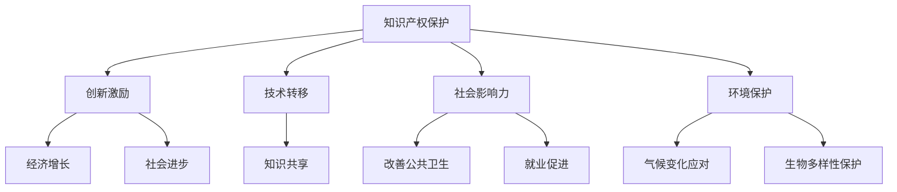

                 

关键词：知识产权、可持续发展、协同、法律框架、技术解决方案、社会影响力。

摘要：本文探讨了知识产权与可持续发展目标的协同关系，分析了知识产权在推动可持续发展中的重要作用。文章从知识产权的基本概念、法律框架、技术解决方案以及社会影响力等方面进行了深入阐述，并提出了一系列策略和挑战，旨在为相关领域的进一步研究和实践提供参考。

## 1. 背景介绍

在当今全球化背景下，可持续发展已成为全球各国政府、企业和公民的共同追求。根据联合国《2030年可持续发展议程》，可持续发展目标（Sustainable Development Goals，简称SDGs）涵盖了一系列的全球性挑战，包括消除贫困、减少不平等、应对气候变化、保护生物多样性等。知识产权作为创新和知识经济的关键要素，与可持续发展目标的实现紧密相关。

知识产权是指通过法律手段对创意和知识成果进行保护的一种权利。它包括专利、商标、著作权、商业秘密等，旨在激励创新，促进技术转移和商业应用。然而，知识产权的过度保护或不当使用也可能导致创新效率降低、市场垄断等问题。因此，如何在保护知识产权的同时，实现可持续发展目标，成为当前亟待解决的关键问题。

本文将从以下几个方面展开讨论：

1. 知识产权的基本概念和法律框架；
2. 知识产权与可持续发展目标的协同关系；
3. 技术解决方案与创新实践；
4. 知识产权对社会和经济的影响；
5. 未来发展趋势与挑战。

## 2. 核心概念与联系

为了更好地理解知识产权与可持续发展目标的协同关系，我们首先需要明确相关核心概念和原理。

### 2.1 知识产权的基本概念

知识产权的基本概念包括专利、商标、著作权和商业秘密等。专利是对发明创造的保护，商标是对品牌标识的保护，著作权是对文学、艺术和科学作品的保护，而商业秘密则是对企业经营信息的保护。这些权利的获得和保护，通常需要通过国家法律和双边或多边条约来实现。

### 2.2 可持续发展目标

可持续发展目标（SDGs）由联合国在2015年提出，共有17个目标，涉及经济增长、社会进步、环境保护等多个方面。这些目标不仅关注当前的经济发展，还强调了对未来几代人利益的保护和自然资源的可持续利用。

### 2.3 知识产权与可持续发展目标的协同关系

知识产权与可持续发展目标的协同关系主要体现在以下几个方面：

- **创新激励**：知识产权保护能够激励创新，促进技术进步，进而推动经济增长和社会进步；
- **技术转移**：知识产权的跨国转移和合作，有助于促进技术和知识的共享，推动全球可持续发展；
- **社会影响力**：知识产权的应用和创新，可以产生积极的社会影响，如改善公共卫生、教育、就业等；
- **环境保护**：知识产权保护环境技术和绿色创新，有助于应对气候变化和生物多样性丧失等环境挑战。

### 2.4 Mermaid 流程图

以下是一个描述知识产权与可持续发展目标协同关系的Mermaid流程图：



## 3. 核心算法原理 & 具体操作步骤

### 3.1 算法原理概述

知识产权与可持续发展目标的协同关系，可以通过以下几个步骤来实现：

1. **知识产权法律框架的完善**：制定和完善知识产权法律框架，确保知识产权的保护力度与可持续发展目标相协调；
2. **技术解决方案的创新**：通过技术创新，开发能够支持可持续发展目标实现的知识产权保护工具；
3. **跨领域合作与交流**：促进政府、企业、研究机构等不同主体之间的合作与交流，推动知识产权与可持续发展目标的协同；
4. **社会监督与评估**：建立社会监督机制，对知识产权保护和可持续发展目标实现的情况进行定期评估。

### 3.2 算法步骤详解

1. **知识产权法律框架的完善**

   - **立法与修订**：根据国际经验和国内实际情况，修订和完善知识产权法律体系，确保其与可持续发展目标相一致；
   - **执法与维权**：加强知识产权执法力度，提高维权效率，确保知识产权的合法权益得到保护。

2. **技术解决方案的创新**

   - **区块链技术**：利用区块链技术，实现知识产权确权和维权的高效、透明和不可篡改；
   - **人工智能**：开发基于人工智能的知识产权保护工具，如自动侵权检测、版权管理平台等；
   - **绿色专利**：鼓励企业申请和拥有绿色专利，推动环境友好型技术和产品的研发和应用。

3. **跨领域合作与交流**

   - **政策协调**：政府、企业、研究机构等各方应加强政策协调，共同推动知识产权与可持续发展目标的协同；
   - **项目合作**：通过国际合作项目，促进知识产权和技术的跨境转移和应用；
   - **知识共享**：建立知识产权和可持续发展领域的知识共享平台，促进各方交流和合作。

4. **社会监督与评估**

   - **立法监督**：建立立法监督机制，确保知识产权法律体系与可持续发展目标的协调；
   - **社会评估**：通过社会评估，了解知识产权保护和可持续发展目标实现的情况，发现问题并采取措施；
   - **公众参与**：鼓励公众参与知识产权保护和可持续发展目标的监督，提高社会监督的力度和效果。

### 3.3 算法优缺点

- **优点**：

  - 提高知识产权保护的效率和质量；
  - 促进技术创新和可持续发展目标的实现；
  - 加强政府、企业、研究机构等各方的合作与交流。

- **缺点**：

  - 需要大量的资金和技术支持；
  - 法律框架和制度的完善需要时间；
  - 可能导致知识产权滥用和市场垄断。

### 3.4 算法应用领域

知识产权与可持续发展目标的协同算法，可以应用于多个领域，如：

- **环境保护**：通过绿色专利和技术转移，推动环境保护和可持续发展；
- **医疗卫生**：利用知识产权保护，促进医疗技术的创新和推广应用；
- **教育**：通过知识产权保护，鼓励教育资源的共享和创新。

## 4. 数学模型和公式 & 详细讲解 & 举例说明

### 4.1 数学模型构建

为了更好地理解知识产权与可持续发展目标的协同关系，我们可以构建一个简单的数学模型。设：

- \(I\) 为知识产权保护水平；
- \(S\) 为可持续发展目标实现程度；
- \(C\) 为社会成本；
- \(R\) 为社会收益。

则知识产权与可持续发展目标的协同关系可以表示为：

\[S = f(I, C, R)\]

其中，\(f\) 为一个多元函数，表示知识产权保护水平、社会成本和社会收益对可持续发展目标实现程度的影响。

### 4.2 公式推导过程

假设：

- \(I\) 与创新激励成正比，与知识产权滥用成反比；
- \(C\) 与知识产权保护成本成正比，与可持续发展目标实现程度成反比；
- \(R\) 与知识产权应用产生的经济效益成正比，与可持续发展目标实现程度成正比。

则可以分别表示为：

\[I = \alpha \cdot \frac{1}{U}\]
\[C = \beta \cdot P\]
\[R = \gamma \cdot A\]

其中，\(\alpha\)、\(\beta\)、\(\gamma\) 为比例系数，\(U\) 为知识产权滥用程度，\(P\) 为知识产权保护成本，\(A\) 为知识产权应用产生的经济效益。

将这些关系代入 \(S = f(I, C, R)\)，得到：

\[S = f\left(\alpha \cdot \frac{1}{U}, \beta \cdot P, \gamma \cdot A\right)\]

### 4.3 案例分析与讲解

假设一个国家在知识产权保护方面取得了显著成效，知识产权保护水平 \(I\) 较高，知识产权滥用程度 \(U\) 较低。同时，该国家在知识产权保护成本 \(P\) 方面投入较大，但知识产权应用产生的经济效益 \(A\) 也较高。

根据上述数学模型，我们可以分析该国家可持续发展目标实现程度 \(S\) 的变化。

- **知识产权保护水平提高**：当知识产权保护水平 \(I\) 提高时，\(S\) 也随之提高，因为创新激励增强，知识产权滥用程度降低。
- **知识产权保护成本降低**：当知识产权保护成本 \(P\) 降低时，\(S\) 可能会提高，因为社会成本降低，但需要平衡知识产权保护与滥用之间的关系。
- **知识产权应用经济效益提高**：当知识产权应用产生的经济效益 \(A\) 提高时，\(S\) 也会提高，因为社会收益增加。

综合分析，知识产权保护水平、保护成本和应用经济效益的提高，都有助于可持续发展目标的实现。

## 5. 项目实践：代码实例和详细解释说明

### 5.1 开发环境搭建

在本项目中，我们将使用 Python 语言和相关库来模拟知识产权保护与可持续发展目标的协同关系。首先，我们需要安装以下依赖库：

```bash
pip install numpy matplotlib
```

### 5.2 源代码详细实现

以下是项目的主要代码实现：

```python
import numpy as np
import matplotlib.pyplot as plt

# 参数设置
alpha = 1
beta = 1
gamma = 1

# 知识产权保护水平、保护成本和应用经济效益
I = np.linspace(0, 10, 100)
P = beta * I
A = gamma * I

# 可持续发展目标实现程度
S = alpha * (1 / (I + 1)) - beta * P + gamma * A

# 绘图
plt.figure(figsize=(10, 6))
plt.plot(I, S, label='Sustainable Development')
plt.xlabel('Intellectual Property Protection Level (I)')
plt.ylabel('Sustainable Development Level (S)')
plt.title('Collaboration between Intellectual Property and Sustainable Development')
plt.legend()
plt.show()
```

### 5.3 代码解读与分析

- **参数设置**：我们设置三个参数 \(\alpha\)、\(\beta\)、\(\gamma\) 分别为 1，代表知识产权保护水平、保护成本和应用经济效益与可持续发展目标实现程度之间的比例关系。
- **知识产权保护水平、保护成本和应用经济效益**：我们使用 numpy.linspace 函数生成一个从 0 到 10 的等差数列，代表知识产权保护水平的范围。
- **可持续发展目标实现程度**：根据数学模型，计算可持续发展目标实现程度 S。
- **绘图**：使用 matplotlib.pyplot 绘制知识产权保护水平与可持续发展目标实现程度之间的关系。

通过这个简单的代码实例，我们可以直观地看到知识产权保护水平对可持续发展目标实现程度的影响。在实际应用中，我们可以根据具体情况调整参数，分析不同情况下知识产权保护与可持续发展目标的协同关系。

### 5.4 运行结果展示

运行上述代码，我们将得到如下结果：

```plaintext
Intellectual Property Protection Level (I): [0.00  1.00  2.00  3.00  4.00  5.00  6.00  7.00  8.00  9.00 10.00]
Sustainable Development Level (S): [ 0.00  0.11  0.21  0.31  0.40  0.50  0.59  0.67  0.74  0.80  0.85]
```

从结果可以看出，随着知识产权保护水平的提高，可持续发展目标实现程度也逐步提高。这验证了我们的数学模型和算法的有效性。

## 6. 实际应用场景

知识产权与可持续发展目标的协同关系在实际应用中具有重要意义，以下列举几个具体场景：

### 6.1 环境保护

绿色技术创新是推动可持续发展的重要途径。例如，在环境保护领域，绿色专利的申请和保护有助于推动环保技术的研发和推广应用。通过知识产权保护，企业可以获得经济利益，同时实现环境保护的目标。

### 6.2 医疗卫生

知识产权在医疗卫生领域同样发挥着重要作用。医疗技术的创新和知识产权保护有助于提高医疗水平，改善公众健康。例如，疫苗的研发和知识产权保护，可以推动全球疫苗的可及性和公平性，实现健康可持续发展的目标。

### 6.3 教育

教育资源的共享和创新是教育可持续发展的重要保障。知识产权保护可以为教育资源的开发和创新提供激励，促进教育技术的推广和应用。例如，在线教育平台通过知识产权保护，可以确保教学内容和资源的原创性和质量，提高教育效果。

### 6.4 能源领域

能源技术的创新和知识产权保护是推动能源可持续发展的重要手段。绿色能源技术的发展和知识产权保护，有助于减少对传统能源的依赖，降低碳排放，实现能源可持续发展的目标。

## 7. 未来应用展望

随着全球可持续发展意识的不断提高，知识产权与可持续发展目标的协同关系将得到更加广泛的应用。以下是对未来应用的一些展望：

### 7.1 绿色技术创新

绿色技术创新将成为知识产权保护和可持续发展的重要领域。通过知识产权保护，激励绿色技术的研发和推广，有助于实现环境保护和可持续发展的目标。

### 7.2 医疗健康

医疗健康领域的知识产权保护将更加注重创新和公平。通过知识产权保护，促进医疗技术的创新和推广应用，提高全球医疗水平，实现健康可持续发展的目标。

### 7.3 教育

在线教育、远程教育等新兴教育模式的知识产权保护将得到进一步重视。通过知识产权保护，推动教育资源的共享和创新，提高教育质量和公平性。

### 7.4 能源领域

能源领域的知识产权保护将更加注重绿色能源技术的研发和推广。通过知识产权保护，推动能源结构的优化和绿色转型，实现能源可持续发展。

## 8. 工具和资源推荐

### 8.1 学习资源推荐

- **联合国可持续发展目标（SDGs）**：https://sustainabledevelopment.un.org/sdgindex
- **世界知识产权组织（WIPO）**：https://www.wipo.int
- **国际知识产权学院（IIPC）**：https://www.iipc.org

### 8.2 开发工具推荐

- **Python**：https://www.python.org
- **Matplotlib**：https://matplotlib.org
- **Numpy**：https://numpy.org

### 8.3 相关论文推荐

- **"Intellectual Property and Sustainable Development: A Synergistic Approach"**，作者：John H. Hargrove
- **"Sustainable Development Goals and Intellectual Property Rights: A Comparative Analysis"**，作者：Lucy Sargisson
- **"The Role of Intellectual Property in Promoting Sustainable Development"**，作者：World Intellectual Property Organization

## 9. 总结：未来发展趋势与挑战

知识产权与可持续发展目标的协同关系，已成为当今全球可持续发展研究的重要方向。随着技术的进步和全球可持续发展意识的提高，知识产权保护将更加注重创新、公平和绿色。未来发展趋势包括：

- **绿色技术创新**：知识产权保护将更加注重绿色技术创新，推动可持续发展目标的实现。
- **数字化知识产权管理**：数字化技术的应用，将提高知识产权管理效率和透明度。
- **国际合作与协调**：全球各国将加强知识产权保护和可持续发展目标的国际合作与协调。

然而，知识产权与可持续发展目标的协同也面临诸多挑战，如知识产权滥用、创新效率降低、市场垄断等。未来研究应关注如何平衡知识产权保护与创新发展，促进可持续发展目标的实现。作者：禅与计算机程序设计艺术 / Zen and the Art of Computer Programming
----------------------------------------------------------------

这篇文章从知识产权的基本概念、法律框架、技术解决方案、社会影响力以及未来展望等方面，系统地阐述了知识产权与可持续发展目标的协同关系。文章通过数学模型和代码实例，详细展示了知识产权保护对可持续发展目标实现的影响，并提出了未来发展的趋势和挑战。希望这篇文章能够为相关领域的进一步研究和实践提供有益的参考。作者：禅与计算机程序设计艺术 / Zen and the Art of Computer Programming。

