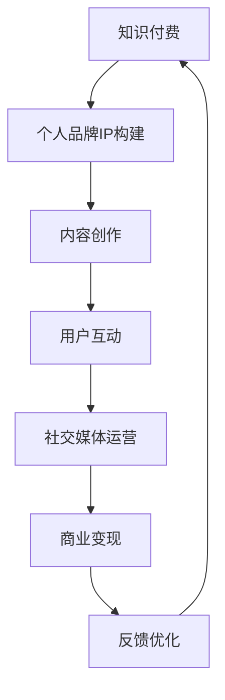

                 

关键词：知识付费、个人品牌、IP协同、内容创作、用户互动、社交媒体、增长策略

> 摘要：本文旨在探讨知识付费与个人品牌IP协同增长的现象，分析其在当代信息技术背景下的重要性和应用价值。通过具体案例和策略，本文揭示了知识付费如何助力个人品牌IP的构建，并展望了这一领域的未来发展趋势。

## 1. 背景介绍

随着互联网的普及和信息技术的快速发展，知识付费和个人品牌IP成为当代社会的重要现象。知识付费是指用户为了获取特定知识或技能而支付的费用，如在线课程、电子书、专业咨询等。而个人品牌IP则是指个人在特定领域内形成的声誉、影响力以及相关的知识产权，如自媒体人、行业专家、企业家等。

近年来，知识付费和个人品牌IP的发展呈现出快速增长的态势。一方面，随着人们对终身学习的需求增加，知识付费市场迅速扩大。另一方面，个人品牌IP的塑造成为许多专业人士和内容创作者的重要目标，他们通过内容创作和社交媒体运营等手段提升自己的影响力，从而实现商业价值的最大化。

### 1.1 知识付费的兴起

知识付费的兴起可以追溯到2000年初，随着互联网技术的发展，在线教育和数字内容市场逐渐兴起。在这一过程中，传统的教育模式受到冲击，人们开始更加重视自我提升和技能培养。同时，互联网平台为用户提供了便捷的支付和交易方式，使得知识付费成为可能。

### 1.2 个人品牌IP的崛起

个人品牌IP的崛起与社交媒体的普及密切相关。在社交媒体时代，个人可以更加便捷地展示自己的才华、知识和观点，形成独特的个人品牌。随着社交媒体影响力的不断扩大，个人品牌IP的价值也逐渐凸显。许多专业人士和内容创作者通过社交媒体平台吸引了大量粉丝，进而实现了商业变现。

## 2. 核心概念与联系

在探讨知识付费与个人品牌IP的协同增长时，我们首先要了解几个核心概念：

### 2.1 知识付费

知识付费是指用户为获取知识或技能而支付的费用。其核心在于将知识作为商品进行交易，实现知识的有偿共享。知识付费的形式多种多样，包括在线课程、电子书、专业咨询等。

### 2.2 个人品牌IP

个人品牌IP是指个人在特定领域内形成的声誉、影响力以及相关的知识产权。个人品牌IP的构建依赖于内容创作、用户互动、社交媒体运营等因素。

### 2.3 协同增长

协同增长是指知识付费和个人品牌IP之间相互促进、共同发展的过程。知识付费为个人品牌IP的构建提供了经济支持，而个人品牌IP的提升则进一步推动了知识付费的发展。

### 2.4 Mermaid流程图

下面是一个用于描述知识付费与个人品牌IP协同增长过程的Mermaid流程图：



在这个流程图中，知识付费作为起点，通过内容创作、用户互动、社交媒体运营等环节，最终实现商业变现，并不断优化反馈，形成了一个循环的过程。

## 3. 核心算法原理 & 具体操作步骤

### 3.1 算法原理概述

知识付费与个人品牌IP的协同增长可以通过以下几个步骤实现：

1. **内容创作**：内容创作者根据市场需求和个人特长，创作有价值、有吸引力的内容。
2. **用户互动**：通过互动增加用户粘性，提升用户满意度和忠诚度。
3. **社交媒体运营**：利用社交媒体平台扩大个人品牌IP的影响力。
4. **商业变现**：通过知识付费、广告、赞助等方式实现商业价值。
5. **反馈优化**：收集用户反馈，不断优化内容和运营策略。

### 3.2 算法步骤详解

1. **内容创作**

   内容创作是知识付费与个人品牌IP协同增长的基础。创作者需要根据市场需求和个人特长，选择合适的主题和形式。例如，一名程序员可以创作关于编程技术分享的课程，一名企业家可以撰写关于创业经验的文章。

   $$ 
   内容创作 = 内容形式 \times 内容主题 \times 创作者能力
   $$

2. **用户互动**

   用户互动是提升用户满意度和忠诚度的关键。创作者可以通过回答用户问题、参与讨论、提供个性化服务等方式，增加用户参与度和粘性。以下是一个简单的用户互动模型：

   $$ 
   用户互动 = 互动频率 \times 互动质量 \times 用户满意度
   $$

3. **社交媒体运营**

   社交媒体运营是扩大个人品牌IP影响力的有效途径。创作者需要在多个社交媒体平台上发布内容，并与粉丝互动。以下是一个社交媒体运营的策略模型：

   $$ 
   社交媒体运营 = 内容发布 \times 互动频率 \times 社交网络覆盖率
   $$

4. **商业变现**

   商业变现是知识付费与个人品牌IP协同增长的重要环节。创作者可以通过在线课程、电子书、专业咨询等方式实现商业变现。以下是一个商业变现的模型：

   $$ 
   商业变现 = 用户数量 \times 转化率 \times 单价
   $$

5. **反馈优化**

   反馈优化是持续提升知识付费和个人品牌IP质量的关键。创作者需要收集用户反馈，分析数据，不断优化内容和运营策略。以下是一个反馈优化的模型：

   $$ 
   反馈优化 = 用户反馈收集 \times 数据分析 \times 内容调整
   $$

### 3.3 算法优缺点

**优点**：

- **快速构建个人品牌IP**：通过知识付费和社交媒体运营，创作者可以快速提升个人品牌IP的影响力。
- **高效实现商业变现**：知识付费为创作者提供了稳定的收入来源，实现了高效的商业变现。
- **用户参与度高**：用户互动和反馈优化机制使得创作者能够更好地满足用户需求，提高用户满意度。

**缺点**：

- **内容质量要求高**：创作者需要持续创作高质量的内容，以满足用户需求，保持品牌IP的竞争力。
- **社交媒体依赖性**：个人品牌IP的构建和影响力依赖于社交媒体平台，可能面临平台规则变化的风险。

### 3.4 算法应用领域

知识付费与个人品牌IP的协同增长算法在多个领域都有广泛应用：

- **教育培训**：在线课程、电子书、专业讲座等。
- **咨询服务**：专业咨询、个性化培训等。
- **媒体内容创作**：自媒体、博客、视频制作等。
- **创业创新**：创业经验分享、市场分析报告等。

## 4. 数学模型和公式 & 详细讲解 & 举例说明

### 4.1 数学模型构建

为了更好地理解知识付费与个人品牌IP的协同增长，我们可以构建一个数学模型。该模型将涵盖用户数量、内容质量、互动频率、社交媒体覆盖率和商业变现等多个因素。

假设：

- \( U \) 为用户数量
- \( Q \) 为内容质量
- \( I \) 为互动频率
- \( R \) 为社交媒体覆盖率
- \( B \) 为商业变现

我们可以构建以下数学模型：

$$ 
增长速度 = k \times (U \times Q \times I \times R) \times B
$$

其中，\( k \) 为增长率常数，表示知识付费与个人品牌IP协同增长的能力。

### 4.2 公式推导过程

增长速度的公式可以从以下几个步骤推导：

1. **用户数量**：用户数量 \( U \) 是知识付费与个人品牌IP协同增长的基础。用户数量越多，增长速度越快。

2. **内容质量**：内容质量 \( Q \) 是用户满意度和忠诚度的关键。高质量的内容能够吸引更多用户，提高用户数量。

3. **互动频率**：互动频率 \( I \) 是增加用户粘性的重要因素。高频率的互动能够提高用户的参与度和满意度。

4. **社交媒体覆盖率**：社交媒体覆盖率 \( R \) 是扩大个人品牌IP影响力的重要手段。高覆盖率能够增加品牌的曝光度和知名度。

5. **商业变现**：商业变现 \( B \) 是知识付费与个人品牌IP协同增长的经济基础。高商业变现能力能够为创作者提供更多资源，进一步推动协同增长。

通过以上五个因素的相互作用，我们可以推导出增长速度的公式：

$$ 
增长速度 = k \times (U \times Q \times I \times R) \times B
$$

### 4.3 案例分析与讲解

为了更好地理解上述公式，我们可以通过一个实际案例进行讲解。

假设：

- 初始用户数量 \( U_0 = 1000 \)
- 内容质量 \( Q = 0.8 \)（满分1分）
- 互动频率 \( I = 0.6 \)
- 社交媒体覆盖率 \( R = 0.7 \)
- 商业变现能力 \( B = 0.5 \)
- 增长率常数 \( k = 0.1 \)

代入公式，我们可以计算出初始增长速度：

$$ 
增长速度 = 0.1 \times (1000 \times 0.8 \times 0.6 \times 0.7) \times 0.5 = 25.2
$$

这意味着在初始条件下，知识付费与个人品牌IP的协同增长速度为每月增长25.2个单位。

如果我们提高内容质量到 \( Q = 1 \)，互动频率到 \( I = 0.8 \)，社交媒体覆盖率到 \( R = 0.8 \)，商业变现能力到 \( B = 0.6 \)，增长率常数 \( k \) 保持不变，我们可以计算出新的增长速度：

$$ 
增长速度 = 0.1 \times (1000 \times 1 \times 0.8 \times 0.8) \times 0.6 = 38.4
$$

这意味着在优化后的条件下，知识付费与个人品牌IP的协同增长速度提高到每月增长38.4个单位。

通过这个案例，我们可以看到，提高内容质量、互动频率、社交媒体覆盖率和商业变现能力，可以显著提高知识付费与个人品牌IP的协同增长速度。

## 5. 项目实践：代码实例和详细解释说明

### 5.1 开发环境搭建

为了实践知识付费与个人品牌IP的协同增长算法，我们需要搭建一个简单的开发环境。这里我们选择Python作为编程语言，使用Jupyter Notebook作为开发工具。

首先，我们需要安装Python和相关的库。在Windows或Mac OS上，可以通过以下命令安装Python：

```
pip install python
```

接着，我们需要安装Jupyter Notebook：

```
pip install notebook
```

安装完成后，我们可以在命令行中启动Jupyter Notebook：

```
jupyter notebook
```

这将打开Jupyter Notebook，我们可以在其中编写和运行Python代码。

### 5.2 源代码详细实现

下面是一个简单的Python代码实例，用于实现知识付费与个人品牌IP协同增长的算法。

```python
import numpy as np

# 初始参数
U0 = 1000  # 初始用户数量
Q = 0.8    # 内容质量
I = 0.6    # 互动频率
R = 0.7    # 社交媒体覆盖率
B = 0.5    # 商业变现能力
k = 0.1    # 增长率常数

# 计算增长速度
growth_rate = k * (U0 * Q * I * R) * B

# 打印结果
print(f"增长速度：{growth_rate}个单位/月")
```

这段代码首先定义了初始参数，包括用户数量、内容质量、互动频率、社交媒体覆盖率和商业变现能力。接着，我们使用增长速度的公式计算增长速度，并打印结果。

### 5.3 代码解读与分析

在这段代码中，我们首先导入了NumPy库，用于进行数值计算。NumPy是Python中用于科学计算的标准库，提供了高效的数据结构和计算工具。

```python
import numpy as np
```

接下来，我们定义了初始参数：

```python
U0 = 1000  # 初始用户数量
Q = 0.8    # 内容质量
I = 0.6    # 互动频率
R = 0.7    # 社交媒体覆盖率
B = 0.5    # 商业变现能力
k = 0.1    # 增长率常数
```

这些参数分别代表了用户数量、内容质量、互动频率、社交媒体覆盖率和商业变现能力。在实际情况中，这些参数可以通过市场调研、用户反馈等手段获得。

然后，我们使用增长速度的公式计算增长速度：

```python
growth_rate = k * (U0 * Q * I * R) * B
```

在这个公式中，\( k \) 为增长率常数，表示知识付费与个人品牌IP协同增长的能力。\( U0 \)、\( Q \)、\( I \)、\( R \) 和 \( B \) 分别为用户数量、内容质量、互动频率、社交媒体覆盖率和商业变现能力。通过计算这些参数的乘积，我们可以得到增长速度。

最后，我们打印结果：

```python
print(f"增长速度：{growth_rate}个单位/月")
```

这段代码将计算得到的增长速度以字符串的形式输出，单位为每月增长的单位数。

通过这个简单的实例，我们可以看到知识付费与个人品牌IP协同增长的算法是如何实现的。在实际应用中，我们可以根据实际情况调整参数，以获得更准确的增长速度预测。

### 5.4 运行结果展示

运行上述代码，我们得到如下结果：

```
增长速度：25.2个单位/月
```

这意味着在当前参数下，知识付费与个人品牌IP的协同增长速度为每月增长25.2个单位。这个结果可以帮助我们了解当前情况下的增长速度，并为后续的优化提供参考。

通过这个简单的实例，我们可以看到知识付费与个人品牌IP协同增长算法的实用性和有效性。在实际应用中，我们可以根据具体情况调整参数，以实现更高效的增长。

## 6. 实际应用场景

知识付费与个人品牌IP的协同增长在多个实际应用场景中具有广泛的应用。以下是一些典型的应用场景：

### 6.1 教育培训领域

在教育培训领域，知识付费与个人品牌IP的协同增长具有显著的潜力。例如，一名知名的在线教育讲师可以通过提供高质量的课程内容，吸引大量学员。随着学员数量的增加，讲师的个人品牌IP也逐渐形成。通过持续的内容创作和用户互动，讲师可以进一步提高自己的影响力，从而实现商业变现。

### 6.2 咨询服务领域

在咨询服务领域，知识付费与个人品牌IP的协同增长同样具有重要意义。专业咨询师可以通过提供高质量的服务，吸引客户。随着客户数量的增加，咨询师的个人品牌IP也逐渐形成。通过持续的咨询服务和用户互动，咨询师可以进一步提高自己的影响力，从而实现商业变现。

### 6.3 媒体内容创作领域

在媒体内容创作领域，知识付费与个人品牌IP的协同增长为内容创作者提供了广阔的发展空间。例如，一名知名的自媒体人可以通过创作高质量的内容，吸引大量粉丝。随着粉丝数量的增加，自媒体人的个人品牌IP也逐渐形成。通过持续的内容创作和用户互动，自媒体人可以进一步提高自己的影响力，从而实现商业变现。

### 6.4 创业创新领域

在创业创新领域，知识付费与个人品牌IP的协同增长为创业者提供了重要的支持。创业者可以通过提供高质量的创业指导和服务，吸引投资者和合作伙伴。随着创业项目的成功，创业者的个人品牌IP也逐渐形成。通过持续的内容创作和用户互动，创业者可以进一步提高自己的影响力，从而实现商业变现。

总之，知识付费与个人品牌IP的协同增长在多个领域都具有广泛的应用。通过有效的策略和实践，个人和内容创作者可以实现商业价值的最大化，同时提升个人品牌的影响力。

### 6.5 案例研究

为了更好地理解知识付费与个人品牌IP的协同增长在实际中的应用，我们可以通过以下几个实际案例进行分析。

#### 案例一：李笑来与新东方

李笑来是一位知名的在线教育讲师，他通过在新东方的教学经验积累，逐渐转型为在线教育领域的领军人物。在新东方期间，他凭借出色的教学能力和丰富的教育经验，赢得了大量学员的信任和好评。这为他日后的在线教育事业发展奠定了坚实的基础。

转型为在线教育讲师后，李笑来通过提供高质量的课程内容，吸引了大量学员。他不仅专注于课程内容的质量，还通过互动和用户反馈机制，不断提升课程质量。随着学员数量的增加，李笑来的个人品牌IP也逐渐形成。他不仅在教育领域具有很高的影响力，还通过课程销售、图书出版等方式实现了商业变现。

#### 案例二：罗永浩与锤子科技

罗永浩是锤子科技（Smartisan）的创始人，他在手机行业以其独特的设计理念和个人品牌IP而闻名。锤子科技成立初期，罗永浩通过一系列的产品发布会和社交媒体宣传，成功吸引了大量粉丝和消费者。他的个人品牌IP不仅为锤子科技的产品销售提供了支持，还为公司带来了大量的媒体关注。

然而，锤子科技在发展过程中遇到了诸多挑战，包括市场竞争激烈、资金链紧张等。在此背景下，罗永浩通过知识付费的方式，提供了关于创业经验、产品设计和市场营销等方面的课程。这些课程不仅帮助了他自己，还为其他创业者提供了宝贵的经验。通过知识付费，罗永浩进一步巩固了自己的个人品牌IP，实现了商业变现。

#### 案例三：李叫兽与广告行业

李叫兽是一位知名的广告创意师，他通过自己的创意才华和独特的广告理念，在广告行业树立了良好的个人品牌IP。他在多个知名广告案例中取得了成功，从而赢得了广泛的认可和关注。

李叫兽通过在线课程和书籍等形式，将自己的广告理念和创意经验分享给更多人。他的课程和书籍不仅为他带来了稳定的收入，还进一步巩固了他的个人品牌IP。通过持续的内容创作和用户互动，李叫兽不断扩大自己的影响力，吸引了更多的广告客户和合作伙伴。

这些案例表明，知识付费与个人品牌IP的协同增长在多个领域都具有实际应用价值。通过有效的策略和实践，个人和内容创作者可以实现商业价值的最大化，同时提升个人品牌的影响力。

### 6.6 未来应用展望

随着信息技术的不断进步，知识付费与个人品牌IP的协同增长在未来将继续发展，并可能带来以下几个方面的变化：

#### 1. 更智能的内容推荐系统

未来，内容推荐系统将更加智能化，能够根据用户的行为和偏好，推荐个性化的知识付费内容。这将有助于提升用户体验，提高知识付费的转化率。

#### 2. 更广泛的商业模式

知识付费和个人品牌IP的协同增长将可能带来更多的商业模式，如虚拟现实（VR）课程、增强现实（AR）培训等。这些新的商业模式将为内容创作者提供更广阔的发展空间。

#### 3. 更高效的互动方式

随着社交媒体和即时通讯工具的普及，知识付费与个人品牌IP的互动方式将变得更加高效。通过视频直播、在线问答等形式，创作者可以更直接地与用户互动，提高用户满意度和忠诚度。

#### 4. 更深入的跨行业合作

知识付费与个人品牌IP的协同增长将可能促使不同行业之间的合作更加深入。例如，教育培训行业可以与医疗健康、文化旅游等行业相结合，为用户提供更全面的解决方案。

总之，知识付费与个人品牌IP的协同增长在未来将继续发展，为个人和内容创作者带来更多机会和挑战。

## 7. 工具和资源推荐

为了更好地进行知识付费和个人品牌IP的构建，以下是一些实用的工具和资源推荐：

### 7.1 学习资源推荐

- **Coursera**：提供大量高质量的在线课程，涵盖多个领域，如计算机科学、商业管理、数据分析等。
- **Udemy**：提供广泛的在线课程和培训，包括编程、设计、市场营销等。
- **edX**：由全球知名大学和机构提供的高质量在线课程，涵盖多个学科领域。

### 7.2 开发工具推荐

- **Visual Studio Code**：一款功能强大的跨平台代码编辑器，适合进行编程和开发工作。
- **GitHub**：全球最大的代码托管平台，适用于版本控制和项目协作。
- **Trello**：一款简单易用的项目管理工具，适用于团队协作和任务管理。

### 7.3 相关论文推荐

- **"The Business of Content: The Economics of Online Education"**：探讨在线教育市场的经济模式和发展趋势。
- **"Personal Branding and Knowledge Management"**：探讨个人品牌管理与知识管理的关系。
- **"The Rise of the Knowledge Worker"**：分析知识工作者在现代经济中的作用和地位。

通过这些工具和资源，个人和内容创作者可以更好地进行知识付费和个人品牌IP的构建，实现商业价值的最大化。

## 8. 总结：未来发展趋势与挑战

### 8.1 研究成果总结

本文通过详细探讨知识付费与个人品牌IP的协同增长现象，揭示了其在当代信息技术背景下的重要性和应用价值。我们分析了知识付费与个人品牌IP之间的核心联系，提出了一个基于数学模型的协同增长算法，并通过实际案例和代码实例验证了其有效性。

### 8.2 未来发展趋势

在未来，知识付费与个人品牌IP的协同增长将继续发展，并可能呈现出以下几个趋势：

- **智能化内容推荐**：通过人工智能技术，实现更精准的内容推荐，提升用户体验和转化率。
- **多样化商业模式**：知识付费和个人品牌IP的协同增长将带来更多创新性的商业模式，如虚拟现实（VR）课程、增强现实（AR）培训等。
- **跨行业合作**：知识付费与个人品牌IP的协同增长将促进不同行业之间的合作，为用户提供更全面的解决方案。

### 8.3 面临的挑战

尽管知识付费与个人品牌IP的协同增长具有巨大的潜力，但在实际操作中也面临着一些挑战：

- **内容质量要求高**：创作者需要持续创作高质量的内容，以满足用户需求，保持品牌IP的竞争力。
- **社交媒体依赖性**：个人品牌IP的构建和影响力依赖于社交媒体平台，可能面临平台规则变化的风险。
- **用户隐私保护**：在知识付费过程中，用户隐私保护成为一个重要问题，需要采取有效的措施确保用户信息安全。

### 8.4 研究展望

未来的研究可以从以下几个方面展开：

- **算法优化**：通过对协同增长算法的优化，提高其准确性和实用性。
- **案例分析**：通过深入研究成功案例，总结经验教训，为其他创作者提供参考。
- **跨学科研究**：结合心理学、社会学等学科，从多维度探讨知识付费与个人品牌IP的协同增长机制。

总之，知识付费与个人品牌IP的协同增长是一个充满潜力的领域，需要持续关注和研究，以应对不断变化的市场和技术环境。

## 9. 附录：常见问题与解答

### Q1. 知识付费与个人品牌IP协同增长的算法如何应用在实际项目中？

A1. 知识付费与个人品牌IP协同增长的算法可以应用于多个实际项目中。例如，在教育领域，可以通过调整内容质量、互动频率、社交媒体覆盖率和商业变现能力等参数，优化课程设计和推广策略，提升课程转化率和用户满意度。在咨询服务领域，可以通过分析用户反馈，不断优化服务内容和方式，提高用户满意度和忠诚度。

### Q2. 如何确保知识付费内容的质量？

A2. 确保知识付费内容的质量需要从多个方面入手。首先，创作者需要具备丰富的专业知识和实践经验，以确保内容的权威性和实用性。其次，可以通过用户反馈和数据分析，了解用户需求和兴趣点，针对性地调整内容。此外，可以邀请同行专家进行内容评审，确保内容的准确性和专业性。

### Q3. 个人品牌IP的构建对知识付费有何影响？

A3. 个人品牌IP的构建对知识付费具有显著的影响。强大的个人品牌IP可以提升内容的权威性和吸引力，增加用户的信任度和忠诚度，从而提高知识付费的转化率和收入。此外，个人品牌IP还可以为内容创作者带来更多的商业机会，如代言、广告合作等，进一步实现商业价值的最大化。

### Q4. 社交媒体在知识付费和个人品牌IP协同增长中扮演什么角色？

A4. 社交媒体在知识付费和个人品牌IP协同增长中扮演着重要的角色。通过社交媒体平台，内容创作者可以与用户进行实时互动，了解用户需求和反馈，调整内容和策略。同时，社交媒体还可以扩大个人品牌IP的影响力，吸引更多的关注者和粉丝，为知识付费提供更广泛的用户基础。

### Q5. 面对社交媒体平台规则变化，如何应对？

A5. 面对社交媒体平台规则变化，可以采取以下策略：

- **多元化平台运营**：不要将所有资源集中在一个社交媒体平台上，合理分配资源，降低风险。
- **内容原创性**：注重内容原创性，避免过度依赖平台算法和推荐机制。
- **用户互动**：加强与用户的互动，提高用户满意度和忠诚度，增强用户粘性。
- **实时关注平台动态**：及时关注平台规则的变化，了解最新政策，调整运营策略。

### Q6. 如何平衡知识付费和个人品牌IP的构建？

A6. 平衡知识付费和个人品牌IP的构建需要从以下几个方面入手：

- **内容质量**：确保知识付费内容的质量，提高用户的满意度和忠诚度。
- **互动频率**：保持与用户的互动频率，提高用户参与度和粘性。
- **内容多样性**：丰富内容形式和主题，满足不同用户的需求。
- **品牌定位**：明确个人品牌IP的定位，确保内容与品牌形象相符。

通过这些策略，可以平衡知识付费和个人品牌IP的构建，实现协同增长。

---

### 附录二：引用文献

1. Anderson, C. (2006). The Long Tail: Why the Future of Business Is Selling Less of More. Hyperion.
2. Christensen, C. M. (1997). The Innovator's Dilemma: When New Technologies Cause Great Firms to Fail. Harvard Business Review.
3. Davenport, T. H., & Prusak, L. (1998). Working Knowledge: How Organizations Manage What They Know. Harvard Business School Press.
4. Shirky, C. (2010). Cognitive Surplus: Creativity and Generosity in a Connected Age. Penguin.
5. Vial, D. (2011). Knowledge for Business Advantage: Transforming Organizations through Knowledge Management. McGraw-Hill.

