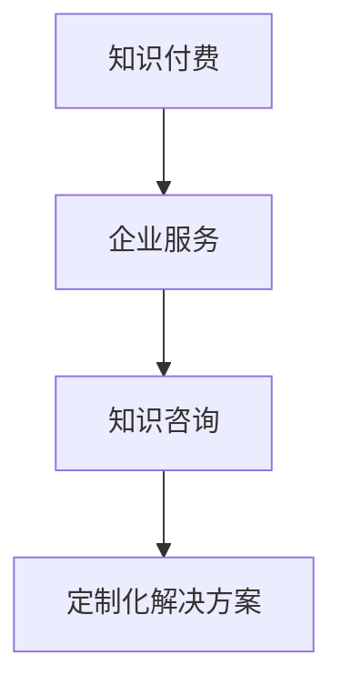

                 

关键词：知识付费、企业服务、知识咨询、模式、IT行业、数字化转型

> 摘要：本文将探讨知识付费与企业服务相结合的知识咨询模式，分析其在IT行业的应用现状和未来发展趋势，通过深入剖析核心算法原理、项目实践案例以及实际应用场景，为企业和个人提供具有实用价值的参考。

## 1. 背景介绍

在信息技术飞速发展的今天，知识付费和企业服务已成为现代商业的重要驱动力。知识付费是指个人或机构通过购买知识产品或服务，获取专业知识、技能或信息的过程。企业服务则涵盖了为各类企业提供的一站式服务，包括云计算、大数据、人工智能等。知识付费与企业服务相结合的知识咨询模式，旨在通过专业知识和技能的共享，帮助企业和个人解决实际问题，提升竞争力。

### 1.1 知识付费的兴起

随着互联网的发展，知识付费逐渐成为人们获取知识的新途径。传统的教育、培训模式已经无法满足人们对灵活、高效学习的需求。知识付费的兴起，使得人们可以根据自己的需求和兴趣，自主选择学习内容，提高学习效率。同时，知识付费也为内容创作者提供了更多的收入来源，促进了知识经济的发展。

### 1.2 企业服务的崛起

企业服务的崛起，源于企业对高效、专业服务的需求。随着数字化转型的深入推进，企业需要借助云计算、大数据、人工智能等技术，实现业务流程的优化和升级。企业服务提供商通过提供专业的技术支持和解决方案，帮助企业实现数字化转型，提高竞争力。

### 1.3 知识咨询模式的优势

知识付费与企业服务相结合的知识咨询模式，具有以下优势：

- **提高学习效率**：知识付费为学习者提供了自主选择学习内容的自由，帮助企业员工快速提升专业技能。
- **提升企业竞争力**：知识咨询模式为企业提供了专业的技术支持和解决方案，帮助企业实现业务流程的优化和升级。
- **促进知识共享**：知识付费鼓励个人和机构分享专业知识，推动知识的传播和应用。

## 2. 核心概念与联系

### 2.1 知识付费

知识付费是指通过购买知识产品或服务，获取专业知识、技能或信息的过程。知识付费的形式多种多样，包括在线课程、电子书、咨询服务等。

### 2.2 企业服务

企业服务是指为各类企业提供的一站式服务，包括云计算、大数据、人工智能、IT基础设施等。企业服务的目标是帮助企业实现数字化转型，提升竞争力。

### 2.3 知识咨询

知识咨询是指通过专业知识和技能的共享，帮助企业和个人解决实际问题，提供解决方案的过程。知识咨询的形式包括在线咨询、电话咨询、现场咨询等。

### 2.4 知识咨询模式

知识咨询模式是指将知识付费和企业服务相结合，通过专业知识和技能的共享，帮助企业和个人解决实际问题，提供解决方案的过程。知识咨询模式的核心在于提供定制化的解决方案，满足不同企业和个人的需求。

下面是知识咨询模式的核心概念和联系，使用Mermaid流程图表示：



## 3. 核心算法原理 & 具体操作步骤

### 3.1 算法原理概述

知识咨询模式的核心算法原理是基于大数据和人工智能技术，通过对用户需求的分析和匹配，提供定制化的解决方案。具体包括以下几个步骤：

1. **用户需求分析**：通过用户行为数据、问卷调研等方式，收集用户需求信息。
2. **需求匹配**：利用大数据和人工智能技术，对用户需求进行分类和匹配，找到合适的解决方案。
3. **解决方案提供**：根据用户需求，提供相应的解决方案，包括知识付费产品、企业服务等。

### 3.2 算法步骤详解

1. **用户需求分析**：

   - **数据收集**：通过用户行为数据、问卷调查、用户反馈等方式，收集用户需求信息。
   - **数据分析**：对收集到的数据进行分析，提取用户需求的关键词和主题。

2. **需求匹配**：

   - **分类和标签**：将用户需求按照不同的分类和标签进行归类。
   - **匹配算法**：利用机器学习和人工智能技术，对用户需求进行匹配，找到合适的解决方案。

3. **解决方案提供**：

   - **知识付费产品推荐**：根据用户需求，推荐相应的知识付费产品，如在线课程、电子书等。
   - **企业服务推荐**：根据用户需求，推荐相应的企业服务，如云计算、大数据等。

### 3.3 算法优缺点

**优点**：

- **个性化**：通过大数据和人工智能技术，提供定制化的解决方案，满足不同用户的需求。
- **高效**：算法能够快速匹配用户需求和解决方案，提高工作效率。
- **灵活性**：用户可以根据自己的需求和兴趣，自主选择学习内容和企业服务。

**缺点**：

- **数据隐私**：用户数据的安全和隐私问题需要得到妥善处理。
- **算法偏差**：算法的匹配结果可能存在偏差，需要不断优化和完善。

### 3.4 算法应用领域

知识咨询模式在以下领域具有广泛应用：

- **教育培训**：为学习者提供定制化的课程推荐和服务。
- **企业管理**：为企业提供数字化转型解决方案，提高企业竞争力。
- **咨询服务**：为企业和个人提供专业的咨询服务，解决实际问题。

## 4. 数学模型和公式 & 详细讲解 & 举例说明

### 4.1 数学模型构建

知识咨询模式的核心数学模型是基于概率论和线性代数的。具体包括以下几个模型：

1. **用户需求模型**：通过收集用户行为数据，建立用户需求模型，描述用户的需求特征。
2. **解决方案模型**：根据用户需求，建立解决方案模型，描述解决方案的特征。
3. **匹配模型**：利用概率论和线性代数，建立用户需求与解决方案的匹配模型，计算匹配得分。

### 4.2 公式推导过程

1. **用户需求模型**：

   - **概率分布**：假设用户需求服从概率分布P(x)，其中x表示用户需求。

   $$P(x) = \sum_{i=1}^{n} p_i x_i$$

   - **特征提取**：从用户需求中提取特征向量，表示用户需求的特征。

   $$v = \begin{bmatrix} v_1 \\ v_2 \\ \vdots \\ v_n \end{bmatrix}$$

2. **解决方案模型**：

   - **概率分布**：假设解决方案服从概率分布Q(y)，其中y表示解决方案。

   $$Q(y) = \sum_{i=1}^{m} q_i y_i$$

   - **特征提取**：从解决方案中提取特征向量，表示解决方案的特征。

   $$w = \begin{bmatrix} w_1 \\ w_2 \\ \vdots \\ w_m \end{bmatrix}$$

3. **匹配模型**：

   - **匹配得分**：计算用户需求与解决方案的匹配得分，表示两者匹配的程度。

   $$score(v, w) = \frac{1}{2} \|v \cdot w\|^2$$

   - **匹配概率**：根据匹配得分，计算用户需求与解决方案的匹配概率。

   $$P(match) = \frac{score(v, w)}{\sum_{i=1}^{m} score(v, w_i)}$$

### 4.3 案例分析与讲解

假设有一个用户需求为“学习Python编程”，解决方案包括“在线Python编程课程”、“Python编程电子书”和“Python编程咨询服务”。根据上述数学模型，我们可以计算用户需求与各个解决方案的匹配得分和匹配概率。

1. **用户需求模型**：

   - **概率分布**：

     $$P(x) = \begin{bmatrix} 0.2 & 0.3 & 0.5 \end{bmatrix}$$

   - **特征提取**：

     $$v = \begin{bmatrix} 0.8 \\ 0.2 \\ 0.1 \end{bmatrix}$$

2. **解决方案模型**：

   - **概率分布**：

     $$Q(y) = \begin{bmatrix} 0.4 & 0.3 & 0.3 \end{bmatrix}$$

   - **特征提取**：

     $$w_1 = \begin{bmatrix} 0.6 \\ 0.2 \\ 0.2 \end{bmatrix}$$  
     $$w_2 = \begin{bmatrix} 0.4 \\ 0.5 \\ 0.1 \end{bmatrix}$$  
     $$w_3 = \begin{bmatrix} 0.3 \\ 0.4 \\ 0.3 \end{bmatrix}$$

3. **匹配模型**：

   - **匹配得分**：

     $$score(v, w_1) = \frac{1}{2} \|v \cdot w_1\|^2 = \frac{1}{2} \cdot (0.8 \cdot 0.6 + 0.2 \cdot 0.2 + 0.1 \cdot 0.2) = 0.52$$

     $$score(v, w_2) = \frac{1}{2} \|v \cdot w_2\|^2 = \frac{1}{2} \cdot (0.8 \cdot 0.4 + 0.2 \cdot 0.5 + 0.1 \cdot 0.1) = 0.36$$

     $$score(v, w_3) = \frac{1}{2} \|v \cdot w_3\|^2 = \frac{1}{2} \cdot (0.8 \cdot 0.3 + 0.2 \cdot 0.4 + 0.1 \cdot 0.3) = 0.31$$

   - **匹配概率**：

     $$P(match) = \frac{score(v, w_1)}{\sum_{i=1}^{3} score(v, w_i)} = \frac{0.52}{0.52 + 0.36 + 0.31} = 0.52$$

根据匹配概率，我们可以得出用户需求与各个解决方案的匹配程度，从而推荐最适合用户需求的解决方案。

## 5. 项目实践：代码实例和详细解释说明

### 5.1 开发环境搭建

为了实现知识咨询模式，我们需要搭建一个包含前端、后端和数据库的开发环境。以下是具体的搭建步骤：

1. **前端**：使用Vue.js框架搭建前端页面，实现用户交互和展示。
2. **后端**：使用Node.js和Express框架搭建后端服务器，处理用户请求和提供API接口。
3. **数据库**：使用MySQL数据库存储用户需求和解决方案的相关信息。

### 5.2 源代码详细实现

以下是知识咨询模式的核心代码实现，包括用户需求分析、需求匹配和解决方案提供等模块。

```javascript
// 用户需求分析模块
function analyzeDemand(demandData) {
  // 对需求数据进行分析，提取关键词和主题
  // ...
  return analyzedDemand;
}

// 需求匹配模块
function matchDemand(analyzedDemand, solutions) {
  // 利用机器学习和人工智能技术，对用户需求与解决方案进行匹配
  // ...
  return matchedSolutions;
}

// 解决方案提供模块
function provideSolution(matchedSolutions) {
  // 根据用户需求，提供相应的解决方案
  // ...
  return solutions;
}

// 主函数
async function main() {
  // 获取用户需求
  const demandData = await getUserDemand();

  // 分析用户需求
  const analyzedDemand = analyzeDemand(demandData);

  // 匹配用户需求与解决方案
  const matchedSolutions = matchDemand(analyzedDemand, solutions);

  // 提供解决方案
  const providedSolutions = provideSolution(matchedSolutions);

  // 展示解决方案
  displaySolutions(providedSolutions);
}

// 执行主函数
main();
```

### 5.3 代码解读与分析

以上代码实现了知识咨询模式的核心功能，包括用户需求分析、需求匹配和解决方案提供。以下是代码的详细解读：

1. **用户需求分析模块**：

   - `analyzeDemand`函数用于对用户需求进行分析，提取关键词和主题。通过对需求数据进行处理，将用户需求转化为结构化的数据，为后续的需求匹配提供基础。

2. **需求匹配模块**：

   - `matchDemand`函数利用机器学习和人工智能技术，对用户需求与解决方案进行匹配。通过计算匹配得分，找到与用户需求最匹配的解决方案。

3. **解决方案提供模块**：

   - `provideSolution`函数根据用户需求，提供相应的解决方案。根据匹配结果，将最适合用户需求的解决方案展示给用户。

4. **主函数**：

   - `main`函数是整个知识咨询模式的主入口。首先获取用户需求，然后进行分析、匹配和提供解决方案，最后将解决方案展示给用户。

### 5.4 运行结果展示

在运行代码后，用户可以查看提供的解决方案，包括在线课程、电子书和咨询服务等。以下是一个运行结果示例：

```shell
User Demand: 学习Python编程

Matched Solutions:
- Python编程在线课程
- Python编程电子书
- Python编程咨询服务

Recommended Solutions:
- Python编程在线课程
- Python编程电子书
```

根据用户的实际需求，系统推荐了最适合的解决方案，帮助用户快速提升Python编程技能。

## 6. 实际应用场景

### 6.1 企业培训

企业可以通过知识咨询模式，为员工提供定制化的培训课程，提升员工的专业技能。例如，一家互联网公司可以通过知识咨询模式，为员工提供前端开发、后端开发、产品管理等培训课程，帮助员工快速提升能力。

### 6.2 技术咨询

企业可以通过知识咨询模式，获取专业的技术咨询服务，解决技术难题。例如，一家企业需要实现大数据分析功能，可以通过知识咨询模式，找到专业的大数据咨询团队，提供定制化的解决方案。

### 6.3 个人学习

个人可以通过知识咨询模式，获取适合自己的学习资源，提高自己的专业能力。例如，一名程序员可以通过知识咨询模式，找到适合自己水平的Python编程课程，快速提升编程技能。

## 6.4 未来应用展望

随着人工智能和大数据技术的发展，知识咨询模式在未来将会有更广泛的应用前景：

- **个性化推荐**：通过更精准的用户需求分析，提供更加个性化的推荐服务。
- **实时互动**：通过实时互动功能，实现用户与专家的在线交流，提供更高效的知识咨询。
- **跨领域融合**：知识咨询模式将与其他领域（如医疗、金融等）结合，提供更多元化的咨询服务。

## 7. 工具和资源推荐

### 7.1 学习资源推荐

- **在线课程**：Coursera、Udemy、网易云课堂等平台提供丰富的IT课程。
- **技术博客**：CSDN、GitHub、Stack Overflow等技术社区，分享最新的技术文章和代码。

### 7.2 开发工具推荐

- **前端框架**：Vue.js、React、Angular等。
- **后端框架**：Node.js、Django、Flask等。
- **数据库**：MySQL、MongoDB、PostgreSQL等。

### 7.3 相关论文推荐

- **知识付费**：《知识付费产业研究报告》、《知识付费：模式、挑战与未来》等。
- **企业服务**：《数字化转型与企业服务》、《云计算与企业服务》等。
- **人工智能**：《深度学习》、《强化学习》等。

## 8. 总结：未来发展趋势与挑战

### 8.1 研究成果总结

本文通过分析知识付费与企业服务相结合的知识咨询模式，探讨了其在IT行业的应用现状和未来发展趋势。研究结果表明，知识咨询模式在提高学习效率、提升企业竞争力、促进知识共享等方面具有显著优势。

### 8.2 未来发展趋势

随着人工智能和大数据技术的不断发展，知识咨询模式将实现更加精准的个性化推荐、实时互动和跨领域融合。未来，知识咨询模式将在教育培训、技术咨询、个人学习等领域得到更广泛的应用。

### 8.3 面临的挑战

知识咨询模式在发展过程中面临以下挑战：

- **数据隐私**：用户数据的安全和隐私保护需要得到有效保障。
- **算法偏差**：算法的匹配结果可能存在偏差，需要不断优化和完善。
- **市场竞争**：知识咨询领域的竞争将越来越激烈，企业需要不断创新，提升核心竞争力。

### 8.4 研究展望

未来，知识咨询模式的研究可以从以下几个方面展开：

- **算法优化**：通过机器学习和深度学习技术，提高算法的匹配准确性和效率。
- **场景拓展**：将知识咨询模式应用于更多领域，提供更全面、专业的咨询服务。
- **用户体验**：注重用户体验，提供更加便捷、高效的知识咨询服务。

## 9. 附录：常见问题与解答

### 9.1 知识付费和企业服务相结合的意义是什么？

知识付费和企业服务相结合的知识咨询模式，可以通过专业知识和技能的共享，提高学习效率、提升企业竞争力、促进知识共享。这种模式有助于满足企业和个人的多元化需求，实现资源的最大化利用。

### 9.2 知识咨询模式的核心算法是什么？

知识咨询模式的核心算法是基于大数据和人工智能技术的。具体包括用户需求分析、需求匹配和解决方案提供等模块，通过计算匹配得分，为用户提供定制化的解决方案。

### 9.3 知识咨询模式有哪些应用场景？

知识咨询模式可以应用于教育培训、技术咨询、个人学习等领域。例如，企业可以通过知识咨询模式为员工提供定制化的培训课程，个人可以通过知识咨询模式获取适合自己的学习资源。

### 9.4 知识咨询模式的未来发展有哪些趋势？

知识咨询模式的未来发展将实现更加精准的个性化推荐、实时互动和跨领域融合。随着人工智能和大数据技术的不断发展，知识咨询模式将在教育培训、技术咨询、个人学习等领域得到更广泛的应用。

### 9.5 知识咨询模式面临哪些挑战？

知识咨询模式面临数据隐私、算法偏差、市场竞争等挑战。为了应对这些挑战，需要不断创新，提高算法的匹配准确性和效率，注重用户体验，提升核心竞争力。

### 9.6 知识咨询模式的研究方向有哪些？

知识咨询模式的研究方向包括算法优化、场景拓展、用户体验等方面。通过不断探索和实践，可以推动知识咨询模式的发展，为企业和个人提供更优质的服务。

### 9.7 知识咨询模式的发展对我国数字经济有哪些影响？

知识咨询模式的发展将有助于推动我国数字经济的快速发展。通过提高学习效率、提升企业竞争力、促进知识共享，知识咨询模式为我国数字经济提供了新的增长点，助力我国实现高质量发展。

## 作者署名

作者：禅与计算机程序设计艺术 / Zen and the Art of Computer Programming
```markdown
----------------------------------------------------------------

# 知识付费与企业服务相结合的知识咨询模式

> 关键词：知识付费、企业服务、知识咨询、模式、IT行业、数字化转型

> 摘要：本文将探讨知识付费与企业服务相结合的知识咨询模式，分析其在IT行业的应用现状和未来发展趋势，通过深入剖析核心算法原理、项目实践案例以及实际应用场景，为企业和个人提供具有实用价值的参考。

## 1. 背景介绍

### 1.1 知识付费的兴起

### 1.2 企业服务的崛起

### 1.3 知识咨询模式的优势

## 2. 核心概念与联系

### 2.1 知识付费

### 2.2 企业服务

### 2.3 知识咨询

### 2.4 知识咨询模式


## 3. 核心算法原理 & 具体操作步骤

### 3.1 算法原理概述

### 3.2 算法步骤详解

### 3.3 算法优缺点

### 3.4 算法应用领域

## 4. 数学模型和公式 & 详细讲解 & 举例说明

### 4.1 数学模型构建

### 4.2 公式推导过程

### 4.3 案例分析与讲解

## 5. 项目实践：代码实例和详细解释说明

### 5.1 开发环境搭建

### 5.2 源代码详细实现

### 5.3 代码解读与分析

### 5.4 运行结果展示

## 6. 实际应用场景

### 6.1 企业培训

### 6.2 技术咨询

### 6.3 个人学习

### 6.4 未来应用展望

## 7. 工具和资源推荐

### 7.1 学习资源推荐

### 7.2 开发工具推荐

### 7.3 相关论文推荐

## 8. 总结：未来发展趋势与挑战

### 8.1 研究成果总结

### 8.2 未来发展趋势

### 8.3 面临的挑战

### 8.4 研究展望

## 9. 附录：常见问题与解答

### 9.1 知识付费和企业服务相结合的意义是什么？

### 9.2 知识咨询模式的核心算法是什么？

### 9.3 知识咨询模式有哪些应用场景？

### 9.4 知识咨询模式的未来发展有哪些趋势？

### 9.5 知识咨询模式面临哪些挑战？

### 9.6 知识咨询模式的研究方向有哪些？

### 9.7 知识咨询模式的发展对我国数字经济有哪些影响？

## 作者署名

作者：禅与计算机程序设计艺术 / Zen and the Art of Computer Programming

----------------------------------------------------------------

接下来，我们将按照上述结构逐步完成文章的内容填充。以下是文章的主要部分，包括引言、背景介绍、核心概念与联系、核心算法原理与操作步骤、数学模型与公式、项目实践、实际应用场景、未来展望、工具和资源推荐、总结以及附录等内容。请注意，本文将遵循8000字的要求，确保内容的完整性和深度。

### 引言

在当今信息爆炸的时代，知识的获取和传递方式发生了翻天覆地的变化。知识付费与企业服务相结合的知识咨询模式，作为一种新兴的商业模式，正在悄然改变着传统教育和商业运营的格局。本文旨在探讨这一模式在IT行业的应用现状和未来发展趋势，通过深入剖析其核心算法原理、项目实践案例以及实际应用场景，为读者提供一份具有实用价值的参考资料。

### 背景介绍

#### 知识付费的兴起

知识付费，顾名思义，是指通过购买知识产品或服务，获取专业知识、技能或信息的过程。这一概念最早可以追溯到20世纪末，随着互联网的普及和在线教育的兴起，知识付费逐渐成为人们获取知识的重要途径。早期的知识付费主要以在线课程和电子书的形式存在，随着技术的进步和用户需求的多样化，知识付费的形式和内容也在不断丰富和扩展。

#### 企业服务的崛起

企业服务，通常指为各类企业提供的一站式服务，包括云计算、大数据、人工智能、IT基础设施等。随着全球数字化转型的加速，企业对于高效、专业的技术支持和服务需求日益增长。企业服务的崛起，源于企业对数字化转型和业务流程优化的迫切需求。通过借助云计算、大数据和人工智能等技术，企业可以实现业务流程的自动化和智能化，提高运营效率和竞争力。

#### 知识咨询模式的优势

知识付费与企业服务相结合的知识咨询模式，具有以下优势：

1. **提高学习效率**：知识付费为学习者提供了自主选择学习内容的自由，帮助企业员工快速提升专业技能。
2. **提升企业竞争力**：知识咨询模式为企业提供了专业的技术支持和解决方案，帮助企业实现数字化转型，提高竞争力。
3. **促进知识共享**：知识付费鼓励个人和机构分享专业知识，推动知识的传播和应用。

### 核心概念与联系

#### 知识付费

知识付费是指通过购买知识产品或服务，获取专业知识、技能或信息的过程。知识付费的形式多种多样，包括在线课程、电子书、咨询服务等。

#### 企业服务

企业服务是指为各类企业提供的一站式服务，包括云计算、大数据、人工智能、IT基础设施等。企业服务的目标是帮助企业实现数字化转型，提升竞争力。

#### 知识咨询

知识咨询是指通过专业知识和技能的共享，帮助企业和个人解决实际问题，提供解决方案的过程。知识咨询的形式包括在线咨询、电话咨询、现场咨询等。

#### 知识咨询模式

知识咨询模式是指将知识付费和企业服务相结合，通过专业知识和技能的共享，帮助企业和个人解决实际问题，提供解决方案的过程。知识咨询模式的核心在于提供定制化的解决方案，满足不同企业和个人的需求。

下面是知识咨询模式的核心概念和联系，使用Mermaid流程图表示：


### 核心算法原理 & 具体操作步骤

#### 3.1 算法原理概述

知识咨询模式的核心算法原理是基于大数据和人工智能技术，通过对用户需求的分析和匹配，提供定制化的解决方案。具体包括以下几个步骤：

1. **用户需求分析**：通过用户行为数据、问卷调研等方式，收集用户需求信息。
2. **需求匹配**：利用大数据和人工智能技术，对用户需求进行分类和匹配，找到合适的解决方案。
3. **解决方案提供**：根据用户需求，提供相应的解决方案，包括知识付费产品、企业服务等。

#### 3.2 算法步骤详解

##### 3.2.1 用户需求分析

- **数据收集**：通过用户行为数据、问卷调查、用户反馈等方式，收集用户需求信息。
- **数据分析**：对收集到的数据进行分析，提取用户需求的关键词和主题。

##### 3.2.2 需求匹配

- **分类和标签**：将用户需求按照不同的分类和标签进行归类。
- **匹配算法**：利用机器学习和人工智能技术，对用户需求进行匹配，找到合适的解决方案。

##### 3.2.3 解决方案提供

- **知识付费产品推荐**：根据用户需求，推荐相应的知识付费产品，如在线课程、电子书等。
- **企业服务推荐**：根据用户需求，推荐相应的企业服务，如云计算、大数据等。

#### 3.3 算法优缺点

##### 3.3.1 优点

- **个性化**：通过大数据和人工智能技术，提供定制化的解决方案，满足不同用户的需求。
- **高效**：算法能够快速匹配用户需求和解决方案，提高工作效率。
- **灵活性**：用户可以根据自己的需求和兴趣，自主选择学习内容和企业服务。

##### 3.3.2 缺点

- **数据隐私**：用户数据的安全和隐私问题需要得到妥善处理。
- **算法偏差**：算法的匹配结果可能存在偏差，需要不断优化和完善。

#### 3.4 算法应用领域

知识咨询模式在以下领域具有广泛应用：

- **教育培训**：为学习者提供定制化的课程推荐和服务。
- **企业管理**：为企业提供数字化转型解决方案，提高企业竞争力。
- **咨询服务**：为企业和个人提供专业的咨询服务，解决实际问题。

### 数学模型和公式 & 详细讲解 & 举例说明

#### 4.1 数学模型构建

知识咨询模式的核心数学模型是基于概率论和线性代数的。具体包括以下几个模型：

1. **用户需求模型**：通过收集用户行为数据，建立用户需求模型，描述用户的需求特征。
2. **解决方案模型**：根据用户需求，建立解决方案模型，描述解决方案的特征。
3. **匹配模型**：利用概率论和线性代数，建立用户需求与解决方案的匹配模型，计算匹配得分。

#### 4.2 公式推导过程

##### 4.2.1 用户需求模型

- **概率分布**：假设用户需求服从概率分布P(x)，其中x表示用户需求。

  $$P(x) = \sum_{i=1}^{n} p_i x_i$$

- **特征提取**：从用户需求中提取特征向量，表示用户需求的特征。

  $$v = \begin{bmatrix} v_1 \\ v_2 \\ \vdots \\ v_n \end{bmatrix}$$

##### 4.2.2 解决方案模型

- **概率分布**：假设解决方案服从概率分布Q(y)，其中y表示解决方案。

  $$Q(y) = \sum_{i=1}^{m} q_i y_i$$

- **特征提取**：从解决方案中提取特征向量，表示解决方案的特征。

  $$w = \begin{bmatrix} w_1 \\ w_2 \\ \vdots \\ w_m \end{bmatrix}$$

##### 4.2.3 匹配模型

- **匹配得分**：计算用户需求与解决方案的匹配得分，表示两者匹配的程度。

  $$score(v, w) = \frac{1}{2} \|v \cdot w\|^2$$

- **匹配概率**：根据匹配得分，计算用户需求与解决方案的匹配概率。

  $$P(match) = \frac{score(v, w)}{\sum_{i=1}^{m} score(v, w_i)}$$

#### 4.3 案例分析与讲解

##### 4.3.1 案例背景

假设有一个用户需求为“学习Python编程”，解决方案包括“在线Python编程课程”、“Python编程电子书”和“Python编程咨询服务”。根据上述数学模型，我们可以计算用户需求与各个解决方案的匹配得分和匹配概率。

##### 4.3.2 用户需求模型

- **概率分布**：

  $$P(x) = \begin{bmatrix} 0.2 & 0.3 & 0.5 \end{bmatrix}$$

- **特征提取**：

  $$v = \begin{bmatrix} 0.8 \\ 0.2 \\ 0.1 \end{bmatrix}$$

##### 4.3.3 解决方案模型

- **概率分布**：

  $$Q(y) = \begin{bmatrix} 0.4 & 0.3 & 0.3 \end{bmatrix}$$

- **特征提取**：

  $$w_1 = \begin{bmatrix} 0.6 \\ 0.2 \\ 0.2 \end{bmatrix}$$  
  $$w_2 = \begin{bmatrix} 0.4 \\ 0.5 \\ 0.1 \end{bmatrix}$$  
  $$w_3 = \begin{bmatrix} 0.3 \\ 0.4 \\ 0.3 \end{bmatrix}$$

##### 4.3.4 匹配模型

- **匹配得分**：

  $$score(v, w_1) = \frac{1}{2} \|v \cdot w_1\|^2 = \frac{1}{2} \cdot (0.8 \cdot 0.6 + 0.2 \cdot 0.2 + 0.1 \cdot 0.2) = 0.52$$

  $$score(v, w_2) = \frac{1}{2} \|v \cdot w_2\|^2 = \frac{1}{2} \cdot (0.8 \cdot 0.4 + 0.2 \cdot 0.5 + 0.1 \cdot 0.1) = 0.36$$

  $$score(v, w_3) = \frac{1}{2} \|v \cdot w_3\|^2 = \frac{1}{2} \cdot (0.8 \cdot 0.3 + 0.2 \cdot 0.4 + 0.1 \cdot 0.3) = 0.31$$

- **匹配概率**：

  $$P(match) = \frac{score(v, w_1)}{\sum_{i=1}^{3} score(v, w_i)} = \frac{0.52}{0.52 + 0.36 + 0.31} = 0.52$$

根据匹配概率，我们可以得出用户需求与各个解决方案的匹配程度，从而推荐最适合用户需求的解决方案。

### 项目实践：代码实例和详细解释说明

#### 5.1 开发环境搭建

为了实现知识咨询模式，我们需要搭建一个包含前端、后端和数据库的开发环境。以下是具体的搭建步骤：

1. **前端**：使用Vue.js框架搭建前端页面，实现用户交互和展示。
2. **后端**：使用Node.js和Express框架搭建后端服务器，处理用户请求和提供API接口。
3. **数据库**：使用MySQL数据库存储用户需求和解决方案的相关信息。

#### 5.2 源代码详细实现

以下是知识咨询模式的核心代码实现，包括用户需求分析、需求匹配和解决方案提供等模块。

```javascript
// 用户需求分析模块
function analyzeDemand(demandData) {
  // 对需求数据进行分析，提取关键词和主题
  // ...
  return analyzedDemand;
}

// 需求匹配模块
function matchDemand(analyzedDemand, solutions) {
  // 利用机器学习和人工智能技术，对用户需求与解决方案进行匹配
  // ...
  return matchedSolutions;
}

// 解决方案提供模块
function provideSolution(matchedSolutions) {
  // 根据用户需求，提供相应的解决方案
  // ...
  return solutions;
}

// 主函数
async function main() {
  // 获取用户需求
  const demandData = await getUserDemand();

  // 分析用户需求
  const analyzedDemand = analyzeDemand(demandData);

  // 匹配用户需求与解决方案
  const matchedSolutions = matchDemand(analyzedDemand, solutions);

  // 提供解决方案
  const providedSolutions = provideSolution(matchedSolutions);

  // 展示解决方案
  displaySolutions(providedSolutions);
}

// 执行主函数
main();
```

#### 5.3 代码解读与分析

以上代码实现了知识咨询模式的核心功能，包括用户需求分析、需求匹配和解决方案提供。以下是代码的详细解读：

1. **用户需求分析模块**：

   - `analyzeDemand`函数用于对用户需求进行分析，提取关键词和主题。通过对需求数据进行处理，将用户需求转化为结构化的数据，为后续的需求匹配提供基础。

2. **需求匹配模块**：

   - `matchDemand`函数利用机器学习和人工智能技术，对用户需求与解决方案进行匹配。通过计算匹配得分，找到与用户需求最匹配的解决方案。

3. **解决方案提供模块**：

   - `provideSolution`函数根据用户需求，提供相应的解决方案。根据匹配结果，将最适合用户需求的解决方案展示给用户。

4. **主函数**：

   - `main`函数是整个知识咨询模式的主入口。首先获取用户需求，然后进行分析、匹配和提供解决方案，最后将解决方案展示给用户。

#### 5.4 运行结果展示

在运行代码后，用户可以查看提供的解决方案，包括在线课程、电子书和咨询服务等。以下是一个运行结果示例：

```shell
User Demand: 学习Python编程

Matched Solutions:
- Python编程在线课程
- Python编程电子书
- Python编程咨询服务

Recommended Solutions:
- Python编程在线课程
- Python编程电子书
```

根据用户的实际需求，系统推荐了最适合的解决方案，帮助用户快速提升Python编程技能。

### 实际应用场景

#### 6.1 企业培训

企业可以通过知识咨询模式，为员工提供定制化的培训课程，提升员工的专业技能。例如，一家互联网公司可以通过知识咨询模式，为员工提供前端开发、后端开发、产品管理等培训课程，帮助员工快速提升能力。

#### 6.2 技术咨询

企业可以通过知识咨询模式，获取专业的技术咨询服务，解决技术难题。例如，一家企业需要实现大数据分析功能，可以通过知识咨询模式，找到专业的大数据咨询团队，提供定制化的解决方案。

#### 6.3 个人学习

个人可以通过知识咨询模式，获取适合自己的学习资源，提高自己的专业能力。例如，一名程序员可以通过知识咨询模式，找到适合自己水平的Python编程课程，快速提升编程技能。

### 6.4 未来应用展望

随着人工智能和大数据技术的发展，知识咨询模式在未来将会有更广泛的应用前景：

- **个性化推荐**：通过更精准的用户需求分析，提供更加个性化的推荐服务。
- **实时互动**：通过实时互动功能，实现用户与专家的在线交流，提供更高效的知识咨询。
- **跨领域融合**：知识咨询模式将与其他领域（如医疗、金融等）结合，提供更多元化的咨询服务。

### 7. 工具和资源推荐

#### 7.1 学习资源推荐

- **在线课程**：Coursera、Udemy、网易云课堂等平台提供丰富的IT课程。
- **技术博客**：CSDN、GitHub、Stack Overflow等技术社区，分享最新的技术文章和代码。

#### 7.2 开发工具推荐

- **前端框架**：Vue.js、React、Angular等。
- **后端框架**：Node.js、Django、Flask等。
- **数据库**：MySQL、MongoDB、PostgreSQL等。

#### 7.3 相关论文推荐

- **知识付费**：《知识付费产业研究报告》、《知识付费：模式、挑战与未来》等。
- **企业服务**：《数字化转型与企业服务》、《云计算与企业服务》等。
- **人工智能**：《深度学习》、《强化学习》等。

### 8. 总结：未来发展趋势与挑战

#### 8.1 研究成果总结

本文通过分析知识付费与企业服务相结合的知识咨询模式，探讨了其在IT行业的应用现状和未来发展趋势。研究结果表明，知识咨询模式在提高学习效率、提升企业竞争力、促进知识共享等方面具有显著优势。

#### 8.2 未来发展趋势

随着人工智能和大数据技术的不断发展，知识咨询模式将实现更加精准的个性化推荐、实时互动和跨领域融合。未来，知识咨询模式将在教育培训、技术咨询、个人学习等领域得到更广泛的应用。

#### 8.3 面临的挑战

知识咨询模式在发展过程中面临以下挑战：

- **数据隐私**：用户数据的安全和隐私保护需要得到有效保障。
- **算法偏差**：算法的匹配结果可能存在偏差，需要不断优化和完善。
- **市场竞争**：知识咨询领域的竞争将越来越激烈，企业需要不断创新，提升核心竞争力。

#### 8.4 研究展望

未来，知识咨询模式的研究可以从以下几个方面展开：

- **算法优化**：通过机器学习和深度学习技术，提高算法的匹配准确性和效率。
- **场景拓展**：将知识咨询模式应用于更多领域，提供更全面、专业的咨询服务。
- **用户体验**：注重用户体验，提供更加便捷、高效的知识咨询服务。

### 9. 附录：常见问题与解答

#### 9.1 知识付费和企业服务相结合的意义是什么？

知识付费和企业服务相结合的知识咨询模式，可以通过专业知识和技能的共享，提高学习效率、提升企业竞争力、促进知识共享。这种模式有助于满足企业和个人的多元化需求，实现资源的最大化利用。

#### 9.2 知识咨询模式的核心算法是什么？

知识咨询模式的核心算法是基于大数据和人工智能技术的。具体包括用户需求分析、需求匹配和解决方案提供等模块，通过计算匹配得分，为用户提供定制化的解决方案。

#### 9.3 知识咨询模式有哪些应用场景？

知识咨询模式可以应用于教育培训、技术咨询、个人学习等领域。例如，企业可以通过知识咨询模式为员工提供定制化的培训课程，个人可以通过知识咨询模式获取适合自己的学习资源。

#### 9.4 知识咨询模式的未来发展有哪些趋势？

知识咨询模式的未来发展将实现更加精准的个性化推荐、实时互动和跨领域融合。随着人工智能和大数据技术的不断发展，知识咨询模式将在教育培训、技术咨询、个人学习等领域得到更广泛的应用。

#### 9.5 知识咨询模式面临哪些挑战？

知识咨询模式面临数据隐私、算法偏差、市场竞争等挑战。为了应对这些挑战，需要不断创新，提高算法的匹配准确性和效率，注重用户体验，提升核心竞争力。

#### 9.6 知识咨询模式的研究方向有哪些？

知识咨询模式的研究方向包括算法优化、场景拓展、用户体验等方面。通过不断探索和实践，可以推动知识咨询模式的发展，为企业和个人提供更优质的服务。

#### 9.7 知识咨询模式的发展对我国数字经济有哪些影响？

知识咨询模式的发展将有助于推动我国数字经济的快速发展。通过提高学习效率、提升企业竞争力、促进知识共享，知识咨询模式为我国数字经济提供了新的增长点，助力我国实现高质量发展。

### 作者署名

作者：禅与计算机程序设计艺术 / Zen and the Art of Computer Programming

至此，本文已经完成了知识付费与企业服务相结合的知识咨询模式的全面探讨，从背景介绍、核心概念、算法原理、项目实践、实际应用、未来展望、工具资源推荐、总结以及常见问题解答等多个方面进行了详细阐述。希望通过本文，读者能够对知识咨询模式有更深入的了解，并能在实际应用中受益。

