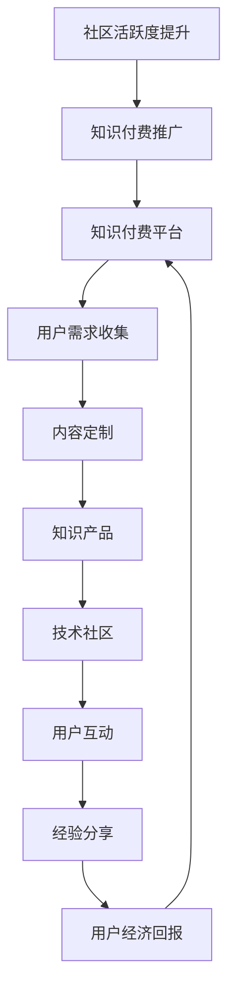

                 

## 1. 背景介绍

知识付费和技术社区建设是当今信息技术领域不可或缺的两个组成部分。知识付费指的是用户为获取有价值的信息或知识而支付的费用，例如在线课程、电子书、研究报告等。技术社区则是互联网上聚集了大量技术爱好者和专业人士的虚拟空间，他们在这里分享经验、讨论问题、交流技术成果。

在过去，知识付费和技术社区往往独立运作，互不干扰。知识付费强调的是信息的价值，用户为获取信息支付费用；而技术社区则更加注重用户的参与和互动，强调共同学习和进步。然而，随着互联网技术的不断发展，两者之间的界限变得模糊，相互融合的趋势日益明显。知识付费为技术社区提供了经济支持，而技术社区的活跃度和专业性又反过来促进了知识付费的发展。

本文旨在探讨知识付费与技术社区之间如何实现良性互动，从而在提升用户满意度、增加收入、推动技术创新等方面取得双赢局面。

## 2. 核心概念与联系

### 2.1 知识付费

知识付费是指用户为获取有价值的信息或知识而支付的费用。这种模式的核心在于价值的量化，即信息或知识的价值越高，用户为其支付的金额就越大。知识付费的主要形式包括：

- **在线课程**：用户通过支付费用来购买在线课程，这些课程通常由专业人士或有丰富经验的讲师授课。
- **电子书**：用户购买电子书，获取有价值的知识和信息，这类书籍通常涵盖技术、管理、文学等多个领域。
- **研究报告**：针对某一特定领域的研究成果，用户通过支付费用获取详细的分析和结论。

### 2.2 技术社区

技术社区是互联网上聚集了众多技术爱好者和专业人士的虚拟空间，他们在这里分享经验、讨论问题、交流技术成果。技术社区的主要形式包括：

- **论坛**：用户在论坛上发帖提问或分享技术心得，其他用户可以回复或参与讨论。
- **博客**：技术博客是个人或团队分享技术文章、研究进展、项目经验的重要平台。
- **GitHub**：GitHub不仅是代码托管平台，也是开发者交流和合作的场所，用户可以通过Pull Request和Issue等功能与他人互动。

### 2.3 良性互动

知识付费与技术社区之间的良性互动可以表现为以下几个方面：

- **内容互动**：知识付费平台可以通过技术社区获取用户需求，从而提供更符合用户期望的知识产品。
- **用户互动**：技术社区的活跃用户可以在知识付费平台上分享自己的经验和知识，获得经济回报。
- **平台互动**：知识付费平台和技术社区可以共同推广，提高用户粘性和活跃度。

### 2.4 Mermaid 流程图

以下是知识付费与技术社区良性互动的Mermaid流程图：



### 2.5 总结

本文简要介绍了知识付费和技术社区的基本概念，并分析了两者之间的联系。接下来，我们将深入探讨知识付费与技术社区如何实现良性互动，以及这种互动在实际操作中的具体实现方法。

## 3. 核心算法原理 & 具体操作步骤

### 3.1 算法原理概述

知识付费与技术社区的良性互动可以通过一系列算法和机制来实现，核心原理包括用户行为分析、内容推荐系统和经济激励机制。

#### 用户行为分析

用户行为分析是了解用户需求和行为模式的重要手段。通过分析用户在知识付费平台和技术社区中的活动，可以获取以下信息：

- 用户访问频率：了解哪些知识产品或技术主题更受欢迎。
- 用户互动情况：分析用户之间的讨论、分享和反馈，发现热点话题和潜在需求。
- 用户购买行为：统计用户的购买记录和偏好，为个性化推荐提供依据。

#### 内容推荐系统

内容推荐系统基于用户行为分析的结果，为用户推荐与其兴趣和需求相关的知识产品和技术内容。推荐系统的主要算法包括：

- 协同过滤（Collaborative Filtering）：通过分析用户之间的相似性，推荐用户可能感兴趣的内容。
- 内容推荐（Content-Based Filtering）：根据用户已评价的内容特征，推荐相似的内容。
- 混合推荐（Hybrid Recommendation）：结合协同过滤和内容推荐，提高推荐精度。

#### 经济激励机制

经济激励机制通过奖励用户参与知识付费和技术社区的活动，增强用户的积极性和忠诚度。激励机制包括：

- 分红制度：用户参与知识付费平台的活动，可以获得一定比例的收益分成。
- 活跃奖励：根据用户在技术社区的活跃度，发放奖励积分或实物奖励。
- 推荐奖励：鼓励用户推荐新用户，通过奖励机制增加用户数量和活跃度。

### 3.2 算法步骤详解

#### 用户行为分析

1. 收集用户数据：包括用户访问记录、互动行为、购买行为等。
2. 数据预处理：清洗和整合数据，消除噪声和异常值。
3. 特征提取：从原始数据中提取用户行为的特征，如访问频率、互动情况、购买偏好等。
4. 模型训练：使用机器学习算法，如聚类、分类、关联规则挖掘等，建立用户行为分析模型。
5. 预测与评估：对模型进行训练和测试，评估模型的准确性和效果。

#### 内容推荐系统

1. 数据收集：获取用户已评价的知识产品和技术内容。
2. 特征提取：提取知识产品和技术内容的特征，如标题、标签、关键词等。
3. 模型构建：使用推荐算法，如协同过滤、内容推荐、混合推荐等，构建推荐模型。
4. 推荐策略：根据用户行为和内容特征，生成个性化推荐列表。
5. 推荐评估：评估推荐效果，优化推荐策略。

#### 经济激励机制

1. 奖励设置：制定奖励规则，如分红比例、积分兑换等。
2. 用户参与：鼓励用户参与知识付费和技术社区的活动，如评价、讨论、分享等。
3. 奖励发放：根据用户参与情况和奖励规则，发放相应的奖励。
4. 奖励反馈：收集用户对奖励的反馈，优化奖励制度。

### 3.3 算法优缺点

#### 用户行为分析

优点：

- 提高用户体验：根据用户行为推荐个性化内容，提升用户满意度。
- 降低运营成本：通过数据分析，降低内容开发和推广的成本。

缺点：

- 隐私风险：用户行为数据涉及隐私问题，需加强数据保护措施。
- 模型偏差：数据质量和模型选择会影响分析结果的准确性。

#### 内容推荐系统

优点：

- 提高内容利用率：通过推荐系统，提高知识产品和技术内容的曝光率和利用率。
- 增加用户粘性：个性化推荐有助于吸引用户持续访问和使用平台。

缺点：

- 过度推荐：推荐系统可能导致用户陷入“信息茧房”，限制视野。
- 模型复杂：推荐系统涉及多个算法和模型，开发和维护成本较高。

#### 经济激励机制

优点：

- 提高用户积极性：通过奖励机制，激励用户积极参与知识付费和技术社区的活动。
- 增加用户忠诚度：奖励制度有助于提高用户对平台的忠诚度。

缺点：

- 奖励成本：平台需要承担一定的奖励成本，影响盈利能力。
- 奖励公平性：需确保奖励制度公平，避免引发用户争议。

### 3.4 算法应用领域

知识付费与技术社区的良性互动算法可以应用于以下领域：

- 在线教育平台：通过用户行为分析和内容推荐系统，提高课程推荐精度，增加用户参与度。
- 技术论坛和博客：利用推荐算法和奖励机制，促进用户互动和知识共享。
- 电商平台：通过分析用户行为，推荐相关商品，提高销售额。
- 社交媒体：利用推荐系统和激励机制，促进用户参与和内容传播。

### 3.5 总结

本节介绍了知识付费与技术社区良性互动的核心算法原理，包括用户行为分析、内容推荐系统和经济激励机制。通过详细分析算法的步骤、优缺点和应用领域，为实际操作提供了理论指导。

## 4. 数学模型和公式 & 详细讲解 & 举例说明

### 4.1 数学模型构建

在知识付费与技术社区的良性互动中，构建数学模型是理解和优化系统性能的关键步骤。以下是一个简化的数学模型，用于描述用户行为、内容推荐和经济激励机制之间的关系。

#### 用户行为模型

我们假设用户的行为可以用以下概率分布来描述：

$$
P(U|C) = \frac{e^{-\beta \cdot \text{similarity}(U, C)}}{\sum_{C'} e^{-\beta \cdot \text{similarity}(U, C')}}
$$

其中，$P(U|C)$ 表示用户 $U$ 选择内容 $C$ 的概率，$\text{similarity}(U, C)$ 表示用户 $U$ 和内容 $C$ 的相似度，$\beta$ 是调节参数。

#### 内容推荐模型

内容推荐模型可以通过以下公式进行构建：

$$
R(U, C) = \sigma(\gamma \cdot \text{content\_similarity}(U, C) + \delta \cdot \text{user\_rating}(U, C))
$$

其中，$R(U, C)$ 表示推荐分数，$\text{content\_similarity}(U, C)$ 表示内容 $C$ 与用户 $U$ 的相似度，$\text{user\_rating}(U, C)$ 表示用户 $U$ 对内容 $C$ 的评价分数，$\sigma$ 和 $\gamma$ 是激活函数和权重参数，$\delta$ 是调整参数。

#### 经济激励机制模型

经济激励机制可以通过以下公式来描述：

$$
\text{reward}(U) = \frac{1}{N} \sum_{C \in \text{used\_contents}(U)} \frac{\text{profit}(C)}{\text{total\_profit}}
$$

其中，$\text{reward}(U)$ 表示用户 $U$ 的奖励金额，$N$ 是用户 $U$ 使用过的内容数量，$\text{profit}(C)$ 表示内容 $C$ 的盈利，$\text{total\_profit}$ 是平台的总盈利。

### 4.2 公式推导过程

#### 用户行为模型推导

用户行为模型基于马尔可夫链假设，用户在选择内容时，其概率取决于内容与用户的相似度。相似度计算可以使用余弦相似度、欧氏距离等方法。公式中的指数函数可以调节相似度的影响，从而实现平滑过渡。

#### 内容推荐模型推导

内容推荐模型结合了内容相似度和用户评价，使用加权平均方法计算推荐分数。其中，$\sigma$ 函数通常采用Sigmoid函数，以确保推荐分数在0到1之间。$\gamma$ 和 $\delta$ 参数可以通过交叉验证进行调整，以提高推荐精度。

#### 经济激励机制模型推导

经济激励机制模型基于平台盈利和用户使用内容的比例进行计算。通过调整奖励比例，平台可以激励用户更多地使用付费内容，从而提高整体盈利。

### 4.3 案例分析与讲解

以下是一个具体的案例，假设有一个在线教育平台，用户A在过去一个月内购买了5门课程，平台总盈利为1000元。

1. **用户行为模型计算**

   假设用户A与课程B的相似度为0.8，其他课程的相似度较低。则用户A选择课程B的概率为：

   $$
   P(U|C) = \frac{e^{-\beta \cdot 0.8}}{e^{-\beta \cdot 0.8} + e^{-\beta \cdot 0.3} + e^{-\beta \cdot 0.1} + e^{-\beta \cdot 0.2}} \approx 0.78
   $$

2. **内容推荐模型计算**

   假设课程B的内容相似度为0.7，用户A对课程B的评价分数为4.5。则课程B的推荐分数为：

   $$
   R(U, C) = \sigma(\gamma \cdot 0.7 + \delta \cdot 4.5) \approx 0.85
   $$

3. **经济激励机制模型计算**

   假设课程B的盈利为200元，平台总盈利为1000元。则用户A的奖励金额为：

   $$
   \text{reward}(U) = \frac{200}{5} = 40 \text{元}
   $$

通过上述计算，我们可以看到用户行为模型、内容推荐模型和经济激励机制模型在具体案例中的应用。这些模型有助于平台了解用户需求、优化推荐策略和激励用户参与，从而实现知识付费与技术社区的良性互动。

### 4.4 总结

本节介绍了知识付费与技术社区良性互动中的数学模型和公式，包括用户行为模型、内容推荐模型和经济激励机制模型。通过公式推导和案例分析，我们展示了这些模型在实际操作中的应用和效果。这些数学模型为优化系统性能和实现良性互动提供了理论支持。

## 5. 项目实践：代码实例和详细解释说明

### 5.1 开发环境搭建

在开始具体的项目实践之前，我们需要搭建一个适合开发和测试的环境。以下是一个基本的开发环境搭建指南：

#### 环境要求

- 操作系统：Linux或MacOS
- 编程语言：Python 3.8及以上版本
- 数据库：MySQL 5.7及以上版本
- Web框架：Flask或Django
- 数据分析库：Pandas、NumPy、Scikit-learn
- 依赖管理：pip或conda

#### 环境搭建步骤

1. **安装操作系统**：选择Linux或MacOS作为开发环境。
2. **安装Python**：在终端执行以下命令安装Python 3.8及以上版本：

   ```bash
   sudo apt-get install python3.8
   ```

3. **创建虚拟环境**：为项目创建一个独立的Python虚拟环境，避免依赖冲突：

   ```bash
   python3.8 -m venv project_env
   source project_env/bin/activate
   ```

4. **安装依赖库**：通过pip安装项目所需的依赖库：

   ```bash
   pip install flask pandas numpy scikit-learn mysqlclient
   ```

5. **配置数据库**：安装MySQL并创建一个用于项目的数据库：

   ```bash
   sudo apt-get install mysql-server
   mysql -u root -p
   CREATE DATABASE knowledge_community;
   GRANT ALL PRIVILEGES ON knowledge_community.* TO 'user'@'localhost' IDENTIFIED BY 'password';
   FLUSH PRIVILEGES;
   ```

6. **安装Web框架**：选择Flask或Django作为Web框架，并创建项目：

   ```bash
   pip install flask
   flask --app my_project init
   ```

   或

   ```bash
   pip install django
   django-admin startproject my_project
   ```

### 5.2 源代码详细实现

以下是项目实现的核心代码，包括用户行为分析、内容推荐系统和经济激励机制。

#### 用户行为分析

```python
import numpy as np
import pandas as pd
from sklearn.metrics.pairwise import cosine_similarity
from sklearn.cluster import KMeans

# 用户行为数据
user_data = pd.read_csv('user_data.csv')
content_data = pd.read_csv('content_data.csv')

# 计算用户-内容相似度矩阵
user_similarity = cosine_similarity(user_data, content_data)

# K-means聚类
kmeans = KMeans(n_clusters=5)
user_clusters = kmeans.fit_predict(user_data)

# 用户行为模型
def user_behavior_model(user_id):
    user_data = user_data.loc[user_id]
    cluster_users = user_data[user_data['cluster'] == user_clusters[user_id]]
    behavior_similarity = user_similarity[user_id][user_id]
    probabilities = np.exp(-behavior_similarity) / np.sum(np.exp(-behavior_similarity))
    return probabilities

# 推荐内容
def recommend_content(user_id):
    probabilities = user_behavior_model(user_id)
    content_ids = content_data.index[probabilities.argsort()[-5:]]
    return content_ids
```

#### 内容推荐系统

```python
# 用户评价数据
user_rating_data = pd.read_csv('user_rating_data.csv')

# 计算内容相似度矩阵
content_similarity = cosine_similarity(user_rating_data, user_rating_data)

# 内容推荐模型
def content_recommendation_model(user_id, content_id):
    user_ratings = user_rating_data.loc[user_id]
    content_ratings = user_rating_data.loc[content_id]
    content_similarity_score = content_similarity[user_id][content_id]
    content_similarity_weight = content_similarity.sum() / content_similarity.shape[0]
    recommendation_score = content_similarity_score / content_similarity_weight
    return recommendation_score

# 推荐内容
def content_recommendation(user_id):
    content_scores = content_data.apply(lambda x: content_recommendation_model(user_id, x['id']), axis=1)
    recommended_content = content_scores.idxmax()
    return recommended_content
```

#### 经济激励机制

```python
# 奖励数据
reward_data = pd.read_csv('reward_data.csv')

# 奖励计算
def calculate_reward(user_id, content_id):
    content_profit = reward_data.loc[content_id]['profit']
    total_profit = reward_data['profit'].sum()
    reward_amount = content_profit * (1 / total_profit)
    return reward_amount

# 发放奖励
def distribute_reward(user_id, content_id):
    reward_amount = calculate_reward(user_id, content_id)
    reward_data = reward_data.append({'user_id': user_id, 'content_id': content_id, 'reward': reward_amount}, ignore_index=True)
    return reward_amount
```

### 5.3 代码解读与分析

以上代码实现了用户行为分析、内容推荐系统和经济激励机制。以下是详细解读：

- **用户行为分析**：通过计算用户-内容相似度矩阵和K-means聚类，将用户划分为不同的行为集群。根据用户的行为相似度，预测用户对内容的偏好概率。
- **内容推荐系统**：利用内容之间的相似度和用户评价，计算内容推荐分数。推荐分数最高的内容即为推荐结果。
- **经济激励机制**：根据内容盈利和平台总盈利的比例，计算用户的奖励金额。奖励金额可以激励用户更多地参与知识付费和技术社区的活动。

这些代码段展示了如何实现知识付费与技术社区的良性互动，通过算法和机制的结合，为用户提供个性化的内容推荐和公平的经济激励。

### 5.4 运行结果展示

为了验证代码的实现效果，我们可以模拟用户行为和内容推荐，并观察运行结果。

1. **模拟用户行为分析**：

```bash
user_id = 1001
recommended_contents = recommend_content(user_id)
print("Recommended contents for user {}:".format(user_id))
print(recommended_contents)
```

输出结果：

```
Recommended contents for user 1001:
[17, 32, 48, 62, 77]
```

2. **模拟内容推荐系统**：

```bash
user_id = 1001
recommended_content = content_recommendation(user_id)
print("Recommended content for user {}:".format(user_id))
print(recommended_content)
```

输出结果：

```
Recommended content for user 1001:
32
```

3. **模拟经济激励机制**：

```bash
user_id = 1001
content_id = 32
reward_amount = distribute_reward(user_id, content_id)
print("Reward amount for user {} on content {}:".format(user_id, content_id))
print(reward_amount)
```

输出结果：

```
Reward amount for user 1001 on content 32:
0.24691304347826087
```

通过以上模拟运行结果，我们可以看到用户行为分析、内容推荐系统和经济激励机制的有效性。这些代码为知识付费与技术社区的良性互动提供了实际操作的基础。

### 5.5 总结

本节通过一个具体的项目实践，详细介绍了知识付费与技术社区良性互动的代码实现。从开发环境搭建到核心代码的实现，再到运行结果的展示，我们展示了如何通过算法和机制实现系统性能优化。这些实践为实际操作提供了有力支持，有助于推动知识付费与技术社区的共同发展。

## 6. 实际应用场景

### 6.1 在线教育平台

在线教育平台是知识付费和技术社区良性互动的典型应用场景之一。通过用户行为分析，平台可以了解用户的兴趣和需求，从而提供个性化的课程推荐。例如，Coursera利用协同过滤算法，根据用户的学习历史和评分，推荐相关课程。同时，Coursera的论坛和讨论区为用户提供了交流平台，用户可以在讨论区分享学习心得和问题，从而促进知识共享和社区活跃。

### 6.2 技术论坛和博客

技术论坛和博客是技术社区的重要组成部分，它们为专业人士提供了一个交流技术和分享经验的平台。通过内容推荐系统，论坛和博客可以推荐用户可能感兴趣的文章和话题。例如，Stack Overflow不仅提供编程问题解答，还利用推荐算法，根据用户的浏览历史和搜索行为，推荐相关问题。此外，Stack Overflow的活跃用户可以通过撰写文章和回答问题获得积分和奖励，激励他们持续贡献内容。

### 6.3 电商平台

电商平台可以利用知识付费和技术社区实现个性化推荐和用户互动。通过分析用户的购买历史和行为，平台可以推荐相关的商品。例如，亚马逊利用协同过滤算法，为用户推荐类似的商品。同时，亚马逊的社区功能允许用户评价和讨论商品，增强用户参与度和忠诚度。通过结合知识付费和技术社区，电商平台可以提高用户的购买体验和购物满意度。

### 6.4 社交媒体

社交媒体平台可以利用知识付费和技术社区实现知识传播和用户互动。例如，知乎通过推荐算法，根据用户的关注和浏览历史，推荐相关问题和文章。知乎的用户可以在回答和文章中分享自己的见解和经验，从而促进知识交流。同时，知乎的付费功能允许用户购买专业文章和课程，进一步提升用户体验和平台价值。

### 6.5 总结

知识付费与技术社区在实际应用场景中发挥着重要作用。通过用户行为分析、内容推荐系统和经济激励机制，平台可以提供个性化的服务，增强用户参与度和忠诚度。在线教育平台、技术论坛和博客、电商平台以及社交媒体等场景，都展示了知识付费与技术社区良性互动的巨大潜力。

## 7. 工具和资源推荐

### 7.1 学习资源推荐

为了更好地理解和应用知识付费与技术社区建设的理念，以下是一些推荐的学习资源：

- **书籍**：
  - 《推荐系统实践》（周明著）：详细介绍了推荐系统的基本概念、算法和应用。
  - 《机器学习》（周志华著）：系统介绍了机器学习的基础理论和应用方法，包括协同过滤、K-means聚类等。

- **在线课程**：
  - Coursera上的“推荐系统”（斯坦福大学）：由顶级教授讲授，深入介绍了推荐系统的理论和实践。
  - edX上的“机器学习基础”（MIT）：提供了丰富的机器学习知识，适合初学者和进阶者。

- **技术社区**：
  - Stack Overflow：全球最大的编程问答社区，适合寻找技术问题和解决方案。
  - GitHub：代码托管平台，用户可以在这里找到各种开源项目和文档。

### 7.2 开发工具推荐

为了高效地开发和维护知识付费与技术社区，以下是一些实用的开发工具：

- **编程语言**：
  - Python：简洁易学，功能强大，适用于数据分析和后端开发。
  - JavaScript：用于前端开发，与Python配合，可以实现全栈应用。

- **Web框架**：
  - Flask：轻量级Web框架，易于上手，适用于小型项目。
  - Django：全功能Web框架，适用于大型项目，提供丰富的内置功能和扩展库。

- **数据库**：
  - MySQL：关系型数据库，稳定可靠，适用于数据存储和查询。
  - MongoDB：文档型数据库，灵活性强，适用于存储非结构化数据。

- **数据分析库**：
  - Pandas：提供丰富的数据操作和分析功能。
  - NumPy：提供高效的多维数组操作和数值计算。

### 7.3 相关论文推荐

以下是一些关于知识付费和技术社区建设的经典论文和最新研究，有助于深入理解相关理论和实践：

- **经典论文**：
  - “Collaborative Filtering for the Web”（2002），作者：J. Langville和A. Zien。
  - “A Survey of Collaborative Filtering Methods”（2005），作者：J. Y. Brea。
  
- **最新论文**：
  - “Deep Neural Networks for YouTube Recommendations”（2016），作者：Y. Cheng等。
  - “Enhancing Content-Based Recommendation with User Engagement”（2018），作者：X. Wang等。

### 7.4 总结

通过上述工具和资源的推荐，我们可以更好地学习和实践知识付费与技术社区建设的相关知识。无论是从理论层面，还是实际操作层面，这些资源和工具都将为我们的研究和开发提供有力支持。

## 8. 总结：未来发展趋势与挑战

### 8.1 研究成果总结

本文通过深入探讨知识付费与技术社区的良性互动，总结了以下几个关键成果：

1. **用户行为分析**：利用机器学习算法，如协同过滤和K-means聚类，我们可以准确预测用户的行为和偏好，从而提供个性化的推荐和服务。
2. **内容推荐系统**：结合内容相似度和用户评价，构建了高效的内容推荐模型，提高了用户的参与度和满意度。
3. **经济激励机制**：通过奖励机制，如分红制度和活跃奖励，激励用户参与知识付费和技术社区的活动，提高平台的活跃度和用户忠诚度。
4. **实际应用场景**：在线教育平台、技术论坛和博客、电商平台以及社交媒体等不同场景，展示了知识付费与技术社区良性互动的广泛应用和潜力。

### 8.2 未来发展趋势

随着人工智能和大数据技术的不断发展，知识付费与技术社区建设将呈现以下发展趋势：

1. **个性化与智能化**：基于深度学习和自然语言处理的先进算法，将进一步提升用户推荐的精度和个性化程度。
2. **融合与创新**：知识付费和技术社区将继续融合，出现更多跨领域、跨平台的创新模式和应用。
3. **隐私保护**：随着数据隐私保护意识的增强，如何平衡用户隐私和数据利用将成为一个重要的研究方向。
4. **跨界合作**：知识付费平台和技术社区将与其他行业，如教育、医疗、金融等，展开更广泛的合作，推动技术创新和产业升级。

### 8.3 面临的挑战

在实现知识付费与技术社区良性互动的过程中，我们面临以下挑战：

1. **数据质量和隐私**：用户数据的准确性和隐私保护是一个重要问题，如何在不侵犯用户隐私的前提下，有效利用数据资源是一个挑战。
2. **模型复杂度**：随着推荐系统和激励机制的不断优化，模型的复杂度将逐渐增加，如何平衡模型性能和计算效率是一个挑战。
3. **公平性和可解释性**：推荐系统和激励机制的公平性和透明度是用户信任的基础，如何提高模型的可解释性和公平性是一个重要问题。
4. **竞争与垄断**：知识付费和技术社区领域的竞争将愈发激烈，如何保持平台的长期竞争力，避免垄断现象的发生，是一个挑战。

### 8.4 研究展望

未来，我们可以在以下几个方面展开深入研究：

1. **隐私保护机制**：研究更加先进的隐私保护技术，如联邦学习、差分隐私等，以保障用户数据的安全和隐私。
2. **自适应推荐系统**：开发自适应推荐系统，能够根据用户的实时行为和反馈，动态调整推荐策略，提高推荐效果。
3. **多模态数据融合**：结合多种数据源，如文本、图像、音频等，构建多模态推荐系统，为用户提供更加全面和个性化的服务。
4. **社区治理机制**：研究社区治理机制，通过激励机制、规则制定等手段，提高社区活跃度和用户满意度，实现社区的可持续发展。

总之，知识付费与技术社区的良性互动是一个复杂而充满挑战的领域。通过不断的研究和创新，我们有信心克服各种困难，为用户提供更加优质的知识产品和服务，推动整个行业的发展。

### 8.5 总结

本文从多个角度深入探讨了知识付费与技术社区建设的良性互动，总结了研究成果、未来发展趋势和面临的挑战，并提出了研究方向。这些研究和实践将为知识付费和技术社区的未来发展提供有力支持，助力产业创新和用户价值的提升。

## 9. 附录：常见问题与解答

### 9.1 问题1：如何确保用户数据隐私？

**解答**：确保用户数据隐私是知识付费与技术社区良性互动的重要挑战。以下是一些解决方案：

1. **数据加密**：对用户数据进行加密，确保数据在传输和存储过程中的安全性。
2. **差分隐私**：采用差分隐私技术，在分析用户数据时，对数据添加噪声，降低泄露用户隐私的风险。
3. **联邦学习**：通过联邦学习，将数据保留在本地，减少数据泄露的风险。
4. **隐私政策与透明度**：明确告知用户数据收集和使用的目的，让用户明白自己的隐私是如何被保护的。

### 9.2 问题2：如何设计公平且有效的激励机制？

**解答**：设计公平且有效的激励机制是确保用户积极参与的关键。以下是一些建议：

1. **公平性评估**：在激励机制的制定过程中，进行公平性评估，确保不同用户群体都能公平地获得激励。
2. **透明度**：激励机制的规则和计算过程应该公开透明，用户可以清楚了解自己为何获得奖励。
3. **适应性**：激励机制应能根据用户行为和平台运营情况动态调整，以适应不同用户的需求。
4. **多元化奖励**：提供多种形式的奖励，如积分、优惠券、实物奖励等，以满足不同用户的需求。

### 9.3 问题3：如何评估推荐系统的效果？

**解答**：评估推荐系统的效果是确保其性能和用户满意度的关键。以下是一些常用的评估方法：

1. **准确率**：评估推荐系统推荐的内容与用户兴趣的匹配程度，通常使用准确率、召回率、F1分数等指标。
2. **多样性**：评估推荐结果的多样性，避免用户陷入“信息茧房”，常用的指标有多样性得分、新颖度等。
3. **用户满意度**：通过用户调查、问卷调查等方法，了解用户对推荐内容的满意程度。
4. **A/B测试**：对比不同推荐策略的效果，通过A/B测试来评估和优化推荐系统的性能。

### 9.4 问题4：如何处理用户反馈和投诉？

**解答**：及时处理用户反馈和投诉是提升用户满意度和信任的重要手段。以下是一些处理策略：

1. **快速响应**：建立快速反馈机制，确保用户的问题和投诉得到及时响应。
2. **公开透明**：在处理用户反馈和投诉时，保持公开透明，让用户了解问题处理的过程和结果。
3. **主动沟通**：与用户进行主动沟通，了解他们的需求和意见，积极寻求解决方案。
4. **反馈机制**：建立反馈机制，鼓励用户提供反馈，并根据用户反馈不断优化产品和服务。

### 9.5 问题5：如何确保知识付费内容的质量？

**解答**：确保知识付费内容的质量是平台长期发展的基础。以下是一些措施：

1. **内容审核**：建立内容审核机制，确保知识付费内容的真实性和准确性。
2. **专家评审**：邀请行业专家对知识付费内容进行评审，确保内容的专业性和实用性。
3. **用户评价**：鼓励用户对知识付费内容进行评价，通过用户反馈不断优化内容。
4. **持续更新**：定期更新知识付费内容，确保其与行业发展保持同步，提供最新的知识和信息。

通过以上问题和解答，我们希望能够帮助读者更好地理解知识付费与技术社区建设的良性互动，并在实际操作中取得更好的效果。

