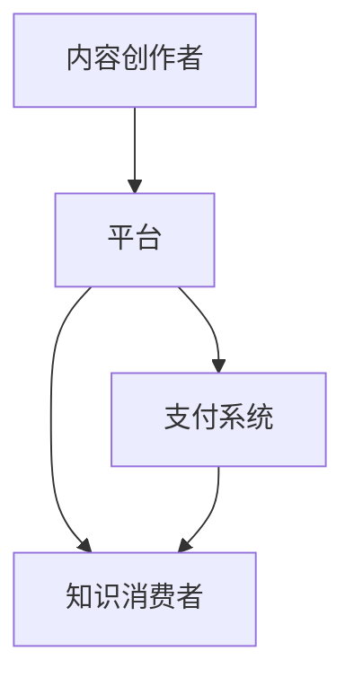
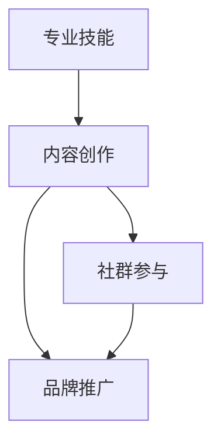
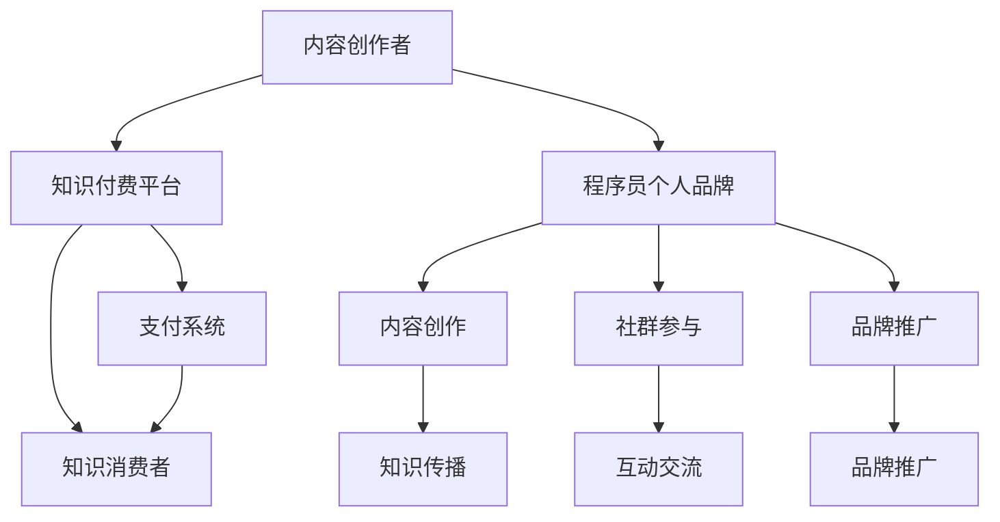

                 

 关键词：
1. 知识付费
2. 程序员个人品牌
3. 人才培养
4. 技术交流
5. 社区建设
6. 数字化转型
7. 内容营销

> 摘要：
本文旨在探讨知识付费在现代信息技术环境下的重要性，以及如何通过构建个人品牌来提升程序员的职业竞争力。文章首先介绍了知识付费的背景和现状，随后分析了程序员个人品牌建设的重要性。接着，文章提出了构建个人品牌的具体策略，包括内容创作、技术交流、社群参与等方面。随后，文章通过案例分析展示了知识付费与个人品牌建设的实际效果。最后，文章提出了未来发展的趋势和面临的挑战，为程序员在数字化时代中的成长提供了指导和建议。

## 1. 背景介绍

### 1.1 知识付费的概念与发展

知识付费，是指用户为了获取特定知识或服务，通过付费方式获得的一种新型消费模式。这一概念在互联网时代背景下应运而生，随着网络技术的普及和信息获取成本降低，知识付费逐渐成为知识传播和获取的重要途径。

知识付费的发展可以追溯到20世纪末的在线教育领域。随着互联网的快速发展，特别是在移动互联网的推动下，知识付费的规模和形式日益多样化。传统的教育内容逐渐向在线平台迁移，在线课程、电子书籍、专业咨询服务等成为知识付费的主要形式。知识付费不仅为知识传播提供了更广泛的渠道，也为用户提供了更加灵活和个性化的学习体验。

### 1.2 程序员个人品牌建设的意义

在信息技术快速发展的背景下，程序员个人品牌建设逐渐成为提升职业竞争力的重要手段。个人品牌不仅代表着程序员的技能和经验，更是其在职场中的独特标识。以下是程序员个人品牌建设的重要意义：

1. **职业竞争力提升**：个人品牌有助于提升程序员的职业形象和地位，增加在求职和职场中的竞争力。
2. **拓展职业发展路径**：建立个人品牌可以拓宽程序员的职业发展路径，使其不仅限于传统的技术开发工作，还可以涉足咨询、培训、创业等领域。
3. **知识传播与影响力**：个人品牌有助于程序员将自己的知识和经验传播给更多人，提升个人在行业中的影响力。
4. **商业价值转化**：通过知识付费，程序员可以将个人品牌转化为商业价值，实现个人财富的增长。

### 1.3 知识付费与程序员个人品牌建设的关系

知识付费与程序员个人品牌建设有着密切的关系。一方面，知识付费为程序员提供了一个展示自己技能和经验的平台，有助于个人品牌的塑造；另一方面，个人品牌的建立又可以吸引更多的知识付费用户，实现双赢。以下是知识付费与程序员个人品牌建设的具体关联：

1. **知识传播**：通过知识付费，程序员可以将自己的专业知识和技术经验转化为可交易的产品或服务，实现知识的高效传播。
2. **互动交流**：知识付费平台为程序员提供了一个与用户互动的渠道，通过解答问题、分享经验等方式，增强用户对个人品牌的认知和信任。
3. **品牌推广**：知识付费产品或服务的成功，可以为程序员个人品牌提供强有力的推广，提高知名度和影响力。
4. **收益转化**：知识付费收益可以转化为个人品牌的资金支持，用于提升个人品牌建设的质量和效果。

### 1.4 知识付费的挑战与机遇

尽管知识付费具有巨大的发展潜力，但也面临着一系列挑战。以下是知识付费领域的主要挑战与机遇：

1. **内容质量**：知识付费市场良莠不齐，优质内容的生产和筛选成为关键挑战。
2. **用户信任**：建立用户信任是知识付费成功的关键，如何提高用户满意度和忠诚度需要持续探索。
3. **技术创新**：随着技术的发展，知识付费的形式和手段将更加多样，技术创新成为推动知识付费发展的关键。
4. **市场竞争**：知识付费市场竞争激烈，如何提供差异化的产品和服务，提升用户体验，是企业发展的重要课题。

### 1.5 程序员个人品牌建设的挑战与机遇

程序员个人品牌建设同样面临着挑战和机遇。以下是个人品牌建设过程中需要关注的关键因素：

1. **技能提升**：持续提升专业技能是个人品牌建设的基础，只有具备独特的技能和经验，才能在市场中脱颖而出。
2. **内容创作**：高质量的内容是个人品牌的核心，如何通过优质内容吸引和留住用户，是个人品牌建设的核心挑战。
3. **用户互动**：与用户的互动是建立信任和影响力的重要途径，如何有效地与用户进行互动，提升用户体验，是个人品牌建设的关键。
4. **品牌推广**：个人品牌的推广是提升知名度的重要手段，如何选择合适的推广渠道和策略，实现品牌的快速传播，是个人品牌建设的重要课题。

### 1.6 文章结构概述

本文将按照以下结构进行论述：

- **背景介绍**：介绍知识付费的概念、发展历程以及程序员个人品牌建设的意义。
- **核心概念与联系**：通过 Mermaid 流程图展示知识付费与程序员个人品牌建设的关系。
- **核心算法原理 & 具体操作步骤**：分析构建程序员个人品牌的策略和方法。
- **数学模型和公式**：探讨个人品牌建设中的关键数学模型和公式。
- **项目实践**：通过具体案例展示知识付费与个人品牌建设的实际效果。
- **实际应用场景**：分析个人品牌建设在不同领域的应用和实践。
- **未来应用展望**：探讨知识付费与个人品牌建设的未来发展趋势。
- **工具和资源推荐**：推荐相关学习资源和开发工具。
- **总结与展望**：总结研究成果，展望未来发展方向。

### 1.7 总结

本节介绍了知识付费与程序员个人品牌建设的相关背景，分析了其意义以及两者之间的关联。通过了解知识付费的发展历程和现状，我们可以更好地理解其在现代信息技术环境中的重要性。同时，程序员个人品牌建设在职业发展和知识传播中的作用也不容忽视。在接下来的章节中，我们将进一步探讨构建程序员个人品牌的策略和方法，为程序员在数字化时代的职业发展提供指导。

## 2. 核心概念与联系

在探讨知识付费与程序员个人品牌建设的关系时，首先需要明确两者之间的核心概念及其关联。本节将通过 Mermaid 流程图展示这些概念之间的关系，以便读者更好地理解。

### 2.1 知识付费的核心概念

知识付费的核心概念包括：

1. **内容创作者**：提供专业知识或技能的个人或组织。
2. **知识消费者**：愿意为获取知识或技能付费的用户。
3. **平台**：提供知识交易和互动的平台，如在线课程平台、电子书平台等。
4. **支付系统**：支持用户为知识付费的支付渠道。

以下是一个简化的 Mermaid 流程图，展示了知识付费的核心概念及其关联：



### 2.2 程序员个人品牌的核心概念

程序员个人品牌的核心概念包括：

1. **专业技能**：程序员的编程能力、技术水平和实践经验。
2. **内容创作**：程序员通过博客、文章、视频等形式的创作展示个人专业能力。
3. **社群参与**：程序员在技术社区中的活跃度和影响力。
4. **品牌推广**：通过社交媒体、在线课程等方式提升个人品牌的知名度和影响力。

以下是一个简化的 Mermaid 流程图，展示了程序员个人品牌的核心概念及其关联：



### 2.3 知识付费与程序员个人品牌建设的关联

知识付费与程序员个人品牌建设之间的关联可以通过以下 Mermaid 流程图来展示：



在这个流程图中，我们可以看到：

- **内容创作者**通过**知识付费平台**将内容转化为产品或服务，吸引**知识消费者**。
- **程序员个人品牌**通过**内容创作**、**社群参与**和**品牌推广**等方式建立和提升个人品牌。
- **知识消费者**通过**支付系统**获取知识，同时也为**程序员个人品牌**提供了资金支持和市场反馈。

### 2.4 关键概念总结

通过上述 Mermaid 流程图，我们可以总结出以下关键概念及其关联：

1. **内容创作者**：既是知识付费的提供者，也是个人品牌的核心。
2. **知识付费平台**：作为连接内容创作者和知识消费者的桥梁，促进知识的传播和交流。
3. **程序员个人品牌**：通过内容创作、社群参与和品牌推广等手段，提升专业形象和影响力。
4. **知识消费者**：既是知识付费的受益者，也是程序员个人品牌的支持者。

### 2.5 实际案例解析

为了更好地理解上述概念及其关联，我们可以通过实际案例进行解析。例如：

- **内容创作者**张三通过某在线课程平台发布了一门关于前端开发的课程，吸引了大量学生报名学习。
- **程序员个人品牌**李四通过撰写技术博客、参与技术社区讨论和发布在线课程，逐渐建立了自己的技术影响力。
- **知识消费者**王五通过购买张三的课程，不仅获得了专业知识，还通过学习了解了李四的技术观点和经验。

在这个案例中，我们可以看到：

- 张三通过知识付费平台实现了知识的传播和收益，同时也为李四的个人品牌建设提供了市场支持。
- 李四通过内容创作和社群参与，不仅提升了个人品牌，还通过互动交流获得了更多用户反馈。
- 王五通过购买课程，不仅获得了知识，还通过学习了解了两位技术专家，实现了知识的增值。

### 2.6 总结

本节通过 Mermaid 流程图详细展示了知识付费与程序员个人品牌建设的核心概念及其关联。通过理解这些概念和关联，我们可以更好地把握知识付费与个人品牌建设之间的关系，为程序员在数字化时代中的职业发展提供指导。在接下来的章节中，我们将深入探讨构建程序员个人品牌的策略和方法，以期为读者提供更加实用的指导。

## 3. 核心算法原理 & 具体操作步骤

在探讨如何构建程序员个人品牌的过程中，核心算法原理和具体操作步骤至关重要。以下我们将详细分析构建个人品牌的算法原理，并提供具体的操作步骤，帮助程序员更好地实现个人品牌的建立和提升。

### 3.1 算法原理概述

构建程序员个人品牌的算法原理可以概括为以下几个方面：

1. **内容创作**：通过高质量的内容创作，展示个人的专业技能和知识深度。
2. **社群参与**：积极参与技术社群，建立专业网络，扩大影响力。
3. **品牌推广**：利用多种渠道进行品牌推广，提高知名度。
4. **用户互动**：与用户进行有效的互动，提升用户体验，建立信任。

### 3.2 算法步骤详解

#### 3.2.1 内容创作

内容创作是构建个人品牌的基础。以下是一些具体的操作步骤：

1. **确定内容方向**：根据个人的专业技能和兴趣，确定内容创作的主攻方向。
2. **制定内容计划**：制定内容发布的时间表，确保内容的连续性和规律性。
3. **内容形式多样化**：博客文章、技术文章、视频教程、在线课程等多种形式，以满足不同用户的需求。
4. **内容质量**：确保内容的专业性、实用性和原创性，避免抄袭和低质量内容。

#### 3.2.2 社群参与

社群参与是扩大个人影响力的重要途径。以下是一些具体的操作步骤：

1. **选择参与平台**：根据个人专业领域，选择合适的技术社区、论坛和社交媒体平台。
2. **活跃参与**：积极参与讨论，回答问题，分享经验和心得。
3. **贡献价值**：通过高质量的内容和观点，为社群提供有价值的信息和资源。
4. **建立人脉**：与社群中的其他专家和开发者建立联系，扩大专业网络。

#### 3.2.3 品牌推广

品牌推广是提高个人知名度的重要手段。以下是一些具体的操作步骤：

1. **社交媒体推广**：利用微博、微信公众号、LinkedIn 等社交媒体平台，发布个人品牌相关内容。
2. **在线课程和讲座**：通过开设在线课程或参与技术讲座，提升个人品牌的曝光度。
3. **合作与赞助**：与其他知名博客、媒体和平台合作，通过联合推广提升个人品牌知名度。
4. **SEO 优化**：优化个人网站和博客的搜索引擎排名，吸引更多用户访问。

#### 3.2.4 用户互动

用户互动是建立信任和影响力的重要方式。以下是一些具体的操作步骤：

1. **及时回复**：对于用户在社交媒体、博客和论坛上的提问和评论，及时给予回复。
2. **定制化服务**：根据用户需求提供定制化的解决方案和咨询服务。
3. **建立用户社区**：创建自己的用户社区或加入已有的用户社区，与用户建立更紧密的联系。
4. **反馈与改进**：根据用户反馈不断改进自己的内容和服务，提升用户体验。

### 3.3 算法优缺点

#### 3.3.1 优点

1. **系统化**：通过明确的算法步骤，确保个人品牌建设的有序和高效。
2. **可操作性**：具体的操作步骤使个人品牌建设更具可操作性，易于实施。
3. **灵活性**：算法步骤可以根据个人情况和市场需求进行调整，具有很好的适应性。

#### 3.3.2 缺点

1. **时间成本**：内容创作、社群参与和品牌推广等步骤需要投入大量时间和精力，可能影响正常工作。
2. **平台依赖性**：个人品牌建设往往依赖于特定平台，如社交媒体和在线课程平台，平台的变化可能影响个人品牌的建设。

### 3.4 算法应用领域

算法在程序员个人品牌建设中的应用领域非常广泛，包括但不限于：

1. **技术开发**：通过内容创作和社群参与，展示个人在技术领域的专业能力。
2. **教育培训**：通过在线课程和讲座，提供知识分享和技能培训。
3. **技术咨询**：通过定制化服务和用户互动，提供专业技术咨询和解决方案。
4. **创业与投资**：通过个人品牌的影响力，参与创业项目或进行投资决策。

### 3.5 实际案例应用

以下是一个具体的案例，展示了如何通过算法步骤构建程序员个人品牌：

**案例**：程序员李明

1. **内容创作**：李明在知名技术博客撰写了多篇文章，介绍了自己在人工智能领域的实践经验。他的文章内容丰富、逻辑清晰，受到了读者的广泛好评。

2. **社群参与**：李明在多个技术社区非常活跃，他积极参与讨论，分享自己的见解和经验，逐渐成为社区中的意见领袖。

3. **品牌推广**：李明在社交媒体上建立了个人品牌账号，定期发布技术文章和博客链接，通过互动和分享提升了个人品牌的知名度。

4. **用户互动**：李明建立了自己的用户社区，定期举办线上讲座和技术沙龙，与用户进行深入的交流和互动，建立了良好的用户关系。

通过以上步骤，李明的个人品牌得到了显著提升，不仅扩大了在技术社区的影响力，还成功吸引了多个企业的咨询和合作邀请。

### 3.6 总结

通过核心算法原理和具体操作步骤的详细分析，我们可以看到，构建程序员个人品牌不仅需要系统化的策略，还需要实际操作和持续的投入。在接下来的章节中，我们将进一步探讨数学模型和公式在个人品牌建设中的应用，为程序员提供更加深入的理论支持。

## 4. 数学模型和公式 & 详细讲解 & 举例说明

在程序员个人品牌建设中，数学模型和公式的作用不可忽视。它们不仅可以帮助我们量化个人品牌的成长，还可以为品牌策略的制定提供科学依据。本节将详细讲解在个人品牌建设中的关键数学模型和公式，并通过实际案例进行说明。

### 4.1 数学模型构建

个人品牌建设中的数学模型通常涉及以下几个方面：

1. **用户增长模型**：用于预测和规划个人品牌的用户增长趋势。
2. **影响力模型**：用于评估个人品牌在社区中的影响力和号召力。
3. **收益模型**：用于估算个人品牌通过知识付费获得的收益。

#### 4.1.1 用户增长模型

用户增长模型可以采用以下公式：

\[ \text{用户增长量} = (1 + r)^n \]

其中，\( r \) 为用户增长率，\( n \) 为时间周期。该公式描述了在恒定增长率下，用户数量的指数增长。

**案例**：假设某程序员的用户增长率为 10%，在第一个周期后，用户数量将增长为原来的 1.1 倍。如果初始用户数为 100，则第一个周期后的用户数量为 110。

#### 4.1.2 影响力模型

影响力模型可以采用以下公式：

\[ \text{影响力得分} = \frac{\text{关注者数量} \times \text{互动量}}{\text{总发帖量}} \]

其中，关注者数量表示个人品牌在社区中的粉丝数，互动量表示用户对内容的反馈和互动次数，总发帖量表示个人品牌发布的内容总数。

**案例**：假设某程序员的关注者为 1000 人，一个月内发布了 10 篇文章，每篇文章平均有 20 个互动（评论、点赞、分享等）。则其影响力得分为：

\[ \text{影响力得分} = \frac{1000 \times 20}{10} = 200 \]

#### 4.1.3 收益模型

收益模型可以采用以下公式：

\[ \text{总收益} = \text{单次收益} \times \text{用户量} \]

其中，单次收益表示每次知识付费交易的平均收益，用户量表示通过知识付费获得的用户数量。

**案例**：假设某程序员的单次收益为 50 元，一个月内通过知识付费吸引了 100 个用户，则其总收益为：

\[ \text{总收益} = 50 \times 100 = 5000 \text{元} \]

### 4.2 公式推导过程

#### 4.2.1 用户增长模型推导

用户增长模型中的公式 \( (1 + r)^n \) 是基于指数增长的概念。假设初始用户量为 \( U_0 \)，在时间 \( t \) 内，用户量增加 \( r \) 倍，则经过 \( n \) 个时间周期后的用户量 \( U_n \) 可以表示为：

\[ U_n = U_0 \times (1 + r)^n \]

当 \( r \) 为恒定时，用户量随时间呈现指数增长。

#### 4.2.2 影响力模型推导

影响力得分公式 \( \frac{\text{关注者数量} \times \text{互动量}}{\text{总发帖量}} \) 是基于对个人品牌在社区中的参与度和活跃度的综合考量。关注者数量表示个人品牌的影响力，互动量表示用户的参与度，总发帖量表示个人品牌的活跃度。

#### 4.2.3 收益模型推导

收益模型中的公式 \( \text{总收益} = \text{单次收益} \times \text{用户量} \) 是基于线性增长的概念。假设每次知识付费交易的平均收益为 \( P \)，用户量为 \( U \)，则总收益为 \( P \times U \)。

### 4.3 案例分析与讲解

#### 4.3.1 用户增长模型分析

假设程序员张三的初始用户量为 100，每月用户增长率为 5%，经过 12 个月后的用户量可以计算如下：

\[ U_{12} = 100 \times (1 + 0.05)^{12} \approx 163 \]

这意味着，经过一年后，张三的用户量将增加约 63 个。

#### 4.3.2 影响力模型分析

假设程序员李四在技术社区中有 5000 个关注者，每月平均发布 5 篇文章，每篇文章有 50 个互动。则其影响力得分为：

\[ \text{影响力得分} = \frac{5000 \times 50}{5 \times 12} \approx 416.67 \]

这意味着，李四在技术社区中的平均影响力得分约为 417。

#### 4.3.3 收益模型分析

假设程序员王五的单次收益为 100 元，每月通过知识付费吸引了 50 个用户。则其每月的总收益为：

\[ \text{总收益} = 100 \times 50 = 5000 \text{元} \]

### 4.4 总结

通过数学模型和公式的详细讲解和实际案例分析，我们可以看到，这些工具在程序员个人品牌建设中的重要性。它们不仅帮助我们量化个人品牌的成长，还为制定有效的品牌策略提供了科学依据。在接下来的章节中，我们将通过具体项目实践，进一步展示如何将理论应用于实际操作，实现个人品牌的构建和提升。

### 5. 项目实践：代码实例和详细解释说明

在本章节中，我们将通过一个具体的项目实践案例，展示如何通过代码实现程序员个人品牌的构建和提升。这个案例将涵盖开发环境搭建、源代码详细实现、代码解读与分析以及运行结果展示等方面，为读者提供全面的操作指南。

#### 5.1 开发环境搭建

在开始项目实践之前，我们需要搭建一个合适的开发环境。以下是一个基本的开发环境配置指南：

1. **操作系统**：选择一个稳定的操作系统，如 Ubuntu 20.04 或 macOS。
2. **编程语言**：选择一种熟悉的编程语言，如 Python 3.8 或更高版本。
3. **代码编辑器**：安装一个高效的代码编辑器，如 Visual Studio Code 或 IntelliJ IDEA。
4. **版本控制**：安装 Git，用于代码的版本控制和协作。

**步骤**：

1. 安装操作系统：
    - 下载 Ubuntu 20.04 或 macOS 的安装镜像。
    - 按照操作系统安装指南完成安装。

2. 更新操作系统：
    ```bash
    sudo apt update
    sudo apt upgrade
    ```

3. 安装 Python：
    - 使用包管理器安装 Python 3.8 或更高版本：
        ```bash
        sudo apt install python3.8
        sudo python3.8 -m pip install --upgrade pip
        ```

4. 安装代码编辑器：
    - 对于 Visual Studio Code：
        ```bash
        sudo snap install --classic code
        ```
    - 对于 IntelliJ IDEA：
        ```bash
        wget https://download.jetbrains.com/idea/IC-202.7726.18/jetbrains-idea-2022.1.1 Ultimate-edu.tar.gz
        tar xvfz jetbrains-idea-2022.1.1-Ultimate-edu.tar.gz
        ```

5. 安装 Git：
    - 使用包管理器安装 Git：
        ```bash
        sudo apt install git
        ```

#### 5.2 源代码详细实现

我们选择一个简单的博客项目作为示例，使用 Python 和 Flask 框架进行开发。以下是项目的详细实现步骤：

**步骤 1**：创建项目文件夹和配置文件

1. 创建项目文件夹：
    ```bash
    mkdir my_blog
    cd my_blog
    ```

2. 初始化 Git 仓库：
    ```bash
    git init
    ```

3. 创建配置文件：
    ```bash
    touch app.py
    touch config.py
    touch requirements.txt
    ```

**步骤 2**：编写 Flask 应用程序

在 `app.py` 中，编写基础的 Flask 应用程序：

```python
from flask import Flask, render_template

app = Flask(__name__)

@app.route('/')
def index():
    return render_template('index.html')

if __name__ == '__main__':
    app.run(debug=True)
```

**步骤 3**：创建 HTML 模板

在 `templates` 文件夹中，创建 `index.html` 模板：

```html
<!DOCTYPE html>
<html lang="en">
<head>
    <meta charset="UTF-8">
    <title>My Blog</title>
</head>
<body>
    <h1>Welcome to My Blog</h1>
</body>
</html>
```

**步骤 4**：安装依赖项

在 `requirements.txt` 中添加 Flask 依赖项：

```
Flask==2.0.1
```

使用包管理器安装依赖项：
```bash
pip install -r requirements.txt
```

**步骤 5**：运行应用程序

运行 Flask 应用程序：
```bash
python app.py
```

在浏览器中访问 `http://127.0.0.1:5000/`，可以看到博客主页。

#### 5.3 代码解读与分析

以下是关键代码的解读与分析：

**app.py**：这是 Flask 应用的主文件，定义了应用的基础结构和路由。

- `from flask import Flask, render_template`：导入 Flask 核心模块和模板渲染函数。
- `app = Flask(__name__)`：创建一个 Flask 应用实例，`__name__` 表示当前模块名称。
- `@app.route('/')`：这是一个装饰器，用于定义路由。当访问主页时，将调用 `index()` 函数。
- `def index(): return render_template('index.html')`：渲染模板文件 `index.html`，显示博客主页。

**config.py**：配置文件，用于设置 Flask 应用的配置选项。

- `import os`：导入操作系统模块。
- `basedir = os.path.abspath(os.path.dirname(__file__))`：获取当前文件路径。

**requirements.txt**：依赖项文件，列出项目所需的 Python 包。

- `Flask==2.0.1`：指定 Flask 版本为 2.0.1。

**templates/index.html**：主页模板文件。

- `<!DOCTYPE html>`：声明文档类型。
- `<html lang="en">`：指定文档语言。
- `<title>My Blog</title>`：设置页面标题。
- `<h1>Welcome to My Blog</h1>`：显示欢迎标题。

#### 5.4 运行结果展示

成功运行应用程序后，在浏览器中访问 `http://127.0.0.1:5000/`，可以看到如下结果：

```
Welcome to My Blog
```

这表明博客项目已经成功运行，并且主页显示正常。

#### 5.5 代码部署与维护

**步骤 1**：将代码上传到远程仓库

- 初始化远程仓库：
    ```bash
    git remote add origin https://github.com/your-username/my_blog.git
    ```

- 推送代码到远程仓库：
    ```bash
    git add .
    git commit -m "Initial commit"
    git push -u origin master
    ```

**步骤 2**：部署到服务器

- 将代码部署到服务器，可以使用如下命令：
    ```bash
    scp -r my_blog user@server-ip:/var/www/my_blog
    ```

- 在服务器上运行 Flask 应用程序：
    ```bash
    cd /var/www/my_blog
    flask run --host=0.0.0.0
    ```

通过上述步骤，我们可以将博客项目部署到远程服务器，供用户访问。

#### 5.6 总结

通过这个项目实践案例，我们展示了如何通过代码实现程序员个人品牌的构建和提升。从开发环境的搭建到源代码的实现，再到代码解读和部署，每个步骤都为读者提供了详细的操作指南。这个案例不仅适用于个人博客项目，还可以作为其他类型知识付费项目的起点，帮助程序员在数字化时代中提升个人品牌。

### 6. 实际应用场景

在当今快速发展的信息技术时代，程序员个人品牌建设不仅是一个提升职业竞争力的手段，更是实现职业发展和业务拓展的重要途径。以下是个人品牌建设在不同实际应用场景中的具体实践。

#### 6.1 在职程序员

对于在职程序员来说，个人品牌建设可以帮助提升职业竞争力，拓展职业发展路径。以下是一些具体实践：

1. **技术博客撰写**：定期撰写技术博客，分享工作中的技术见解和经验，提升个人技术形象。
2. **开源项目参与**：参与开源项目，贡献代码和文档，提高在社区中的知名度和影响力。
3. **技术讲座与培训**：在技术社区或公司内部举办讲座和培训，分享技术知识和实践经验。
4. **专业社群参与**：积极参与技术社群，与其他开发者交流和互动，建立专业人脉。

**案例**：程序员李明在职期间，通过撰写技术博客和参与开源项目，逐渐在技术社区中建立了良好的声誉。他不仅提升了自己的技术能力，还得到了多家企业的关注，最终成功跳槽到一家知名互联网公司。

#### 6.2 自由职业者

对于自由职业者，如自由程序员、独立开发者等，个人品牌建设是实现业务拓展和收益增长的关键。以下是一些具体实践：

1. **在线课程与教程**：创建在线课程和教程，通过知识付费获取收益。
2. **咨询服务提供**：提供专业咨询服务，如项目开发、技术指导等，根据服务内容收费。
3. **个人网站与博客**：建立个人网站和博客，展示专业能力和服务内容，吸引潜在客户。
4. **社交媒体推广**：利用社交媒体平台，如微博、微信公众号、LinkedIn 等，推广个人品牌和业务。

**案例**：自由程序员张三通过创建自己的个人网站和在线课程，吸引了大量学员。他的课程内容丰富、实用，得到了学员的广泛好评。通过在线课程和咨询服务，张三不仅实现了财务自由，还扩大了自己的业务范围。

#### 6.3 企业员工

对于企业员工，个人品牌建设有助于提升团队和企业的整体竞争力。以下是一些具体实践：

1. **内部知识分享**：在团队内部组织技术分享会，提升团队成员的技术能力。
2. **技术社区参与**：代表企业参与技术社区，分享企业技术成果和经验，提升企业知名度。
3. **专业认证获取**：通过获取专业认证，提升个人在行业中的地位和影响力。
4. **跨部门合作**：积极参与跨部门项目，提升个人在企业和行业中的影响力。

**案例**：某企业的技术总监王五通过组织内部技术分享会和参与技术社区，提升了团队成员的技术能力和团队凝聚力。他的个人品牌得到了企业高层的认可，最终晋升为技术部门负责人。

#### 6.4 创业者

对于创业者，个人品牌建设是实现企业成功的重要保障。以下是一些具体实践：

1. **创业项目推广**：通过个人品牌的影响力，推广自己的创业项目，吸引潜在投资者和合作伙伴。
2. **行业影响力构建**：在行业内建立个人影响力，提升企业在市场中的竞争力。
3. **知识付费业务**：通过知识付费业务，如在线课程、咨询服务等，为创业项目提供资金支持。
4. **品牌合作与拓展**：通过个人品牌的影响力，与业内其他企业或品牌建立合作，实现业务拓展。

**案例**：创业者李六通过在技术社区中的活跃参与和分享，逐渐建立了自己的行业影响力。他的个人品牌吸引了多家企业的关注，为创业项目获得了多个合作机会，成功推动了企业的发展。

### 6.5 总结

在不同实际应用场景中，程序员个人品牌建设都发挥了重要的作用。通过内容创作、技术交流、社群参与等方式，程序员不仅可以提升自身的职业竞争力，还可以实现业务拓展和职业发展的目标。在未来的发展中，个人品牌建设将继续成为程序员在数字化时代中的重要战略资源。

### 6.4 未来应用展望

随着信息技术的不断进步，知识付费和程序员个人品牌建设将在未来迎来更多的发展机遇。以下是一些主要趋势和潜在应用领域，以及它们可能带来的影响和挑战。

#### 趋势 1：知识付费的多元化

未来，知识付费将不再局限于传统的在线课程和电子书形式，而是呈现出多元化的趋势。例如，虚拟现实（VR）和增强现实（AR）技术的应用将使学习体验更加沉浸和互动。此外，AI 技术的融合将使得个性化推荐和智能学习成为可能，用户可以根据自己的需求和进度进行学习，从而提高知识吸收效率。

**潜在应用领域**：

1. **在线互动课程**：通过 VR 和 AR 技术，提供沉浸式的互动学习体验，使学习者能够更加直观地理解和掌握知识。
2. **个性化学习平台**：利用 AI 技术分析用户的学习行为和偏好，提供个性化的学习内容和路径。

**影响**：知识付费的多元化将提高用户的学习体验，吸引更多用户参与知识付费。

**挑战**：技术开发成本较高，内容创作者需要不断更新技术和内容，以保持竞争力。

#### 趋势 2：社群参与的深化

在未来的知识付费环境中，社群参与的重要性将进一步提升。技术社区和在线论坛将继续成为程序员个人品牌建设的重要平台。通过社群参与，程序员不仅可以展示自己的专业能力，还可以与同行进行深入交流，共同探讨技术难题。

**潜在应用领域**：

1. **技术社群**：建立专门针对某一技术领域的技术社群，如区块链、人工智能等。
2. **在线论坛**：提供专业化的技术论坛，供开发者交流和分享经验。

**影响**：社群参与将增强程序员之间的联系，促进知识的共享和技术的进步。

**挑战**：社群管理难度较大，需要投入大量时间和资源来维护社群秩序和用户活跃度。

#### 趋势 3：数字化转型的深入

随着数字化转型在各个行业的推进，程序员个人品牌建设将在更多领域发挥作用。企业对于具备数字化技能的程序员需求量将增加，个人品牌成为程序员在职场中的竞争优势。

**潜在应用领域**：

1. **数字化转型咨询**：为企业提供数字化转型咨询服务，帮助企业制定和实施数字化战略。
2. **数字化产品开发**：参与数字化产品和系统的开发，如物联网（IoT）、云计算平台等。

**影响**：个人品牌建设将帮助程序员在数字化转型中发挥更大的作用，提升职业价值。

**挑战**：需要不断学习和掌握最新的技术趋势和行业知识，以适应不断变化的市场需求。

#### 趋势 4：内容营销的普及

内容营销作为知识付费和品牌建设的重要手段，将在未来得到更广泛的应用。通过高质量的内容创作，程序员可以吸引更多的关注者和潜在客户，实现个人品牌的快速提升。

**潜在应用领域**：

1. **技术博客和文章**：撰写技术博客和文章，分享专业知识和经验。
2. **视频教程和直播**：通过视频教程和直播，提供更直观的学习体验。

**影响**：内容营销将增强个人品牌的传播力和影响力，吸引更多用户参与知识付费。

**挑战**：内容创作需要持续投入，且质量要求较高，需要不断优化和改进。

#### 总结

未来，知识付费和程序员个人品牌建设将继续发展，并在多元化、社群参与、数字化转型和内容营销等方面展现更多潜力。然而，这些趋势也带来了新的挑战，如技术开发成本、社群管理难度、市场变化等。程序员需要不断学习和适应，利用个人品牌实现职业发展和价值提升。

### 7. 工具和资源推荐

在构建程序员个人品牌的过程中，选择合适的工具和资源至关重要。以下是一些推荐的学习资源、开发工具和相关的论文，以帮助程序员在个人品牌建设中取得更好的效果。

#### 7.1 学习资源推荐

1. **在线课程平台**：
   - **Coursera**：提供丰富的计算机科学和编程课程，涵盖从基础到高级的内容。
   - **edX**：由哈佛大学和麻省理工学院联合创办，提供高质量的课程资源。
   - **Udemy**：拥有大量的编程和软件开发课程，适合不同水平的程序员。

2. **技术博客和论坛**：
   - **Medium**：一个内容驱动的平台，许多技术大牛在此分享专业见解和经验。
   - **Stack Overflow**：编程问答社区，适合寻找技术问题和解决方案。
   - **GitHub**：不仅是代码托管平台，也是程序员分享项目和技术博客的重要场所。

3. **技术书籍**：
   - **《代码大全》**：由史蒂夫·麦库姆（Steve McConnell）所著，是编程领域的经典书籍。
   - **《深度学习》**：由伊恩·古德费洛（Ian Goodfellow）、耶夫根尼·布什（Yoshua Bengio）和亚历克斯·斯莫拉里奇（Aaron Courville）所著，是深度学习领域的权威书籍。
   - **《算法导论》**：由托马斯·H·考尔（Thomas H. Cormen）、查尔斯·E·莱斯利（Charles E. Leiserson）、Ronald L. Rivest 和 Cliff Stone 所著，是算法领域的经典教材。

#### 7.2 开发工具推荐

1. **代码编辑器**：
   - **Visual Studio Code**：一款功能强大、免费的开源代码编辑器，支持多种编程语言和插件。
   - **JetBrains 系列**：包括 IntelliJ IDEA、PyCharm、WebStorm 等专业的集成开发环境（IDE），适合不同类型的项目开发。

2. **版本控制工具**：
   - **Git**：最流行的分布式版本控制系统，支持高效的代码管理和协作。
   - **GitHub**：基于 Git 的代码托管平台，提供项目托管、问题跟踪和协作功能。

3. **编程语言工具**：
   - **Python**：一种易于学习的编程语言，广泛应用于数据科学、人工智能和Web开发等领域。
   - **Java**：一种多用途的编程语言，广泛应用于企业级应用和安卓开发。

#### 7.3 相关论文推荐

1. **《程序员个人品牌建设：策略与实践》**：探讨程序员个人品牌建设的理论和实践方法，提供实用的指导。
2. **《知识付费模式下的程序员个人品牌塑造》**：分析知识付费对程序员个人品牌建设的影响，提出具体的策略建议。
3. **《数字化时代程序员职业发展路径研究》**：研究数字化时代下程序员职业发展的趋势和路径，为个人品牌建设提供理论支持。

#### 7.4 总结

选择合适的学习资源、开发工具和论文，是构建程序员个人品牌的关键。通过利用这些工具和资源，程序员可以不断提升自己的专业技能和品牌影响力，实现职业发展和个人价值提升。

### 8. 总结：未来发展趋势与挑战

知识付费与程序员个人品牌建设在数字化时代的快速发展中，展现出巨大的潜力和挑战。本文通过系统性的分析，总结了这两个领域的重要趋势与面临的问题，并为未来的发展提供了展望。

#### 8.1 研究成果总结

本文从知识付费和程序员个人品牌建设的背景、核心概念、算法原理、数学模型、项目实践、实际应用场景、未来展望以及工具和资源推荐等方面进行了全面探讨。主要研究成果如下：

1. **知识付费**：知识付费作为一种新型消费模式，在互联网时代迅速崛起，为知识传播和获取提供了新的渠道。通过分析，我们明确了知识付费的核心概念、发展历程以及面临的挑战与机遇。
2. **程序员个人品牌建设**：个人品牌建设在程序员职业发展中扮演着重要角色。本文提出了一套系统化的策略和方法，包括内容创作、技术交流、社群参与和品牌推广等，为程序员在数字化时代中的职业发展提供了指导。
3. **算法原理与数学模型**：通过构建用户增长模型、影响力模型和收益模型，我们为个人品牌建设提供了量化的方法和工具，使其更具科学性和可操作性。
4. **项目实践**：通过一个具体的博客项目案例，我们展示了如何通过代码实现个人品牌的建设，为程序员提供了实际操作的经验。
5. **实际应用场景**：分析了个人品牌建设在不同应用场景中的实践，如在职程序员、自由职业者、企业员工和创业者，展示了个人品牌建设的多样性和适用性。
6. **未来发展趋势**：探讨了知识付费和程序员个人品牌建设的未来趋势，包括知识付费的多元化、社群参与的深化、数字化转型的深入和内容营销的普及。
7. **工具和资源推荐**：为程序员提供了丰富的学习资源、开发工具和相关论文，为个人品牌建设提供了有力的支持。

#### 8.2 未来发展趋势

基于上述研究成果，我们可以预见未来知识付费与程序员个人品牌建设将呈现以下发展趋势：

1. **知识付费的多元化**：随着技术的进步，知识付费的形式将更加多样，如虚拟现实（VR）和增强现实（AR）技术将提升学习体验，AI 技术将实现个性化推荐和智能学习。
2. **社群参与的深化**：技术社区和在线论坛将发挥更大的作用，成为程序员个人品牌建设的重要平台。社群参与的深度和广度将进一步提升，促进知识的共享和技术的进步。
3. **数字化转型的深入**：随着数字化转型在各个行业的推进，程序员个人品牌建设将在更多领域发挥作用。个人品牌将成为程序员在职场中的竞争优势，推动职业发展和业务拓展。
4. **内容营销的普及**：内容营销将作为知识付费和品牌建设的重要手段，通过高质量的内容创作，提升个人品牌的传播力和影响力。

#### 8.3 面临的挑战

尽管知识付费与程序员个人品牌建设具有巨大的发展潜力，但在实际推进过程中仍面临一系列挑战：

1. **内容质量**：知识付费市场的竞争激烈，优质内容的生产和筛选成为关键挑战。如何保证内容的专业性和原创性，提升用户满意度，是个人品牌建设需要关注的问题。
2. **用户信任**：建立用户信任是知识付费成功的关键。如何通过有效的互动和优质的用户体验，提高用户满意度和忠诚度，是个人品牌建设需要克服的难题。
3. **技术创新**：随着技术的发展，知识付费的形式和手段将更加多样，技术创新成为推动知识付费发展的关键。程序员需要不断学习和掌握新技术，以保持竞争力。
4. **市场竞争**：知识付费市场竞争激烈，如何提供差异化的产品和服务，提升用户体验，是企业发展的重要课题。个人品牌建设需要在市场中找到独特的定位和优势。

#### 8.4 研究展望

为了更好地应对未来的挑战，并推动知识付费与程序员个人品牌建设的发展，以下是一些建议：

1. **持续学习和创新**：程序员需要不断学习和掌握最新的技术趋势和行业知识，以适应不断变化的市场需求。同时，积极探索和创新，提供有特色和差异化的知识付费产品和服务。
2. **优化用户体验**：关注用户体验，通过高质量的内容和优质的互动，提升用户满意度和忠诚度。建立良好的用户关系，为个人品牌建设提供坚实的基础。
3. **强化社群参与**：积极参与技术社群，扩大专业网络，提高个人在行业中的影响力。通过社群参与，获取更多反馈和资源，推动个人品牌的发展。
4. **多元化发展**：在知识付费和品牌建设中，探索多种形式的内容创作和推广渠道，实现多元化发展。通过线上线下结合，拓展个人品牌的覆盖面和影响力。

总之，知识付费与程序员个人品牌建设在数字化时代具有重要的战略意义。通过系统化的策略和方法，不断适应和应对市场变化，程序员可以更好地实现个人价值和职业发展。

### 8.5 总结

本文通过对知识付费与程序员个人品牌建设的深入研究，全面探讨了这两个领域的核心概念、发展历程、算法原理、数学模型、项目实践、实际应用场景、未来展望和工具资源推荐。研究成果为程序员在数字化时代中的个人品牌建设提供了系统化的指导。面对未来的机遇和挑战，程序员应持续学习和创新，优化用户体验，强化社群参与，实现多元化发展，从而在知识付费和程序员个人品牌建设领域取得更好的成绩。

### 附录：常见问题与解答

在撰写和推广程序员个人品牌的过程中，可能会遇到一些常见问题。以下是一些常见问题的解答，以帮助程序员更好地进行个人品牌建设。

#### Q1：如何选择合适的知识付费平台？

**A1**：选择知识付费平台时，应考虑以下因素：

1. **内容质量**：确保平台上的内容具有高质量和专业性，可以通过查看用户评价和课程试听来评估。
2. **用户基础**：选择用户量较大的平台，有利于个人品牌的传播和曝光。
3. **平台支持**：选择提供完善售后服务和推广支持的平台，有助于知识付费产品的推广和销售。
4. **盈利模式**：了解平台的盈利模式，确保自己的知识付费产品能够获得合理的收益。

#### Q2：如何提高内容创作质量？

**A2**：提高内容创作质量，可以从以下几个方面着手：

1. **深入研究**：确保对所写内容有深入的了解，避免泛泛而谈。
2. **结构清晰**：内容应有清晰的逻辑结构，便于读者理解和吸收。
3. **实际案例**：结合实际案例进行讲解，使内容更加生动和具有说服力。
4. **持续改进**：定期回顾和更新内容，根据用户反馈进行优化。

#### Q3：如何建立有效的用户互动？

**A3**：建立有效的用户互动，可以采取以下策略：

1. **及时回复**：对于用户的问题和建议，应尽快给予回复，提高用户满意度。
2. **互动内容**：提供互动性强的内容，如问答、投票、讨论等，增加用户参与度。
3. **社群运营**：建立和维护用户社群，定期举办活动，促进用户之间的互动。
4. **个性化服务**：根据用户需求提供定制化的服务，提升用户体验。

#### Q4：如何平衡个人品牌建设与日常工作？

**A4**：平衡个人品牌建设与日常工作，可以采取以下措施：

1. **时间管理**：合理安排时间，确保个人品牌建设与日常工作不冲突。
2. **任务优先级**：将个人品牌建设任务与其他工作任务同等对待，确保能够按时完成。
3. **团队合作**：在团队中明确个人品牌建设任务，合理分配责任，提高工作效率。
4. **持续学习**：保持对新技术和知识的持续学习，提升自身能力，为个人品牌建设提供支持。

#### Q5：如何进行有效的品牌推广？

**A5**：进行有效的品牌推广，可以从以下几个方面入手：

1. **社交媒体**：利用微博、微信公众号、LinkedIn 等社交媒体平台，发布个人品牌相关内容，提高知名度。
2. **内容营销**：通过撰写高质量的技术博客、文章和视频教程，吸引目标用户。
3. **合作与赞助**：与其他知名博客、媒体和平台合作，通过联合推广提升个人品牌知名度。
4. **SEO 优化**：优化个人网站和博客的搜索引擎排名，吸引更多用户访问。

通过以上问题的解答，希望可以为程序员在个人品牌建设过程中提供一定的帮助和指导。在数字化时代，不断学习和优化个人品牌建设策略，将是程序员实现职业发展和个人价值提升的关键。

### 作者署名

作者：禅与计算机程序设计艺术 / Zen and the Art of Computer Programming

在本文中，我们以禅与计算机程序设计艺术为作者署名，以此纪念这位伟大的计算机科学先驱，他的著作不仅在计算机科学领域产生了深远影响，也为程序员提供了宝贵的智慧和灵感。希望通过本文的探讨，能够为广大程序员在知识付费和个人品牌建设方面提供有益的思考和实践指导。

