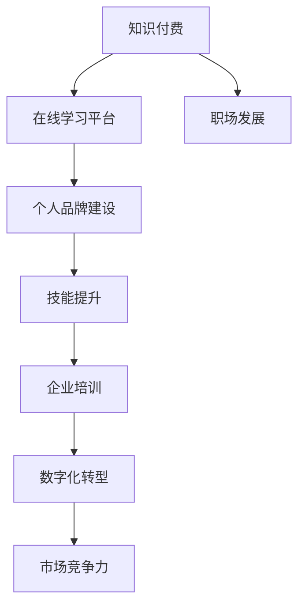

                 

关键词：知识付费、职业发展、技术培训、在线学习平台、个人品牌建设、技能提升、数字化转型、企业培训、市场竞争力

> 摘要：本文旨在探讨知识付费在现代职业发展中扮演的角色，如何通过在线学习平台和个人品牌建设实现职业发展的双赢。我们将从知识付费的背景、核心概念、算法原理、数学模型、项目实践和未来应用等方面进行深入分析，并推荐相关工具和资源，总结发展趋势与挑战，展望未来研究前景。

## 1. 背景介绍

随着信息技术的迅猛发展，知识付费逐渐成为一种主流的学习和成长方式。知识付费，顾名思义，是指用户为获取特定知识或技能而支付的费用。这种现象的背后，是人们对自我提升的渴望，以及企业对员工培训的重视。

在过去的几年里，知识付费市场经历了爆发式增长，各类在线学习平台如雨后春笋般涌现。这些平台通过提供专业的课程、专家讲座、实战案例等形式，满足了不同层次用户的学习需求。与此同时，知识付费也成为了职业发展的重要驱动力，越来越多的职场人士通过付费学习，实现了技能提升和职业晋升。

本文将围绕知识付费与职业发展的双赢之道，探讨其背后的核心概念、算法原理、数学模型以及项目实践，旨在为读者提供一份全面而深入的了解。

### 1.1 知识付费的起源与发展

知识付费这一概念最早可以追溯到20世纪90年代的在线教育。当时，随着互联网的普及，一些教育机构开始尝试在线课程销售，为用户提供灵活的学习方式。然而，真正推动知识付费市场发展的，是移动互联网和智能手机的普及。2012年后，随着各类在线学习平台的兴起，知识付费逐渐成为一种趋势。

近年来，知识付费市场的发展势头迅猛。据相关数据显示，2018年全球知识付费市场规模已达到360亿美元，预计到2025年将达到720亿美元。这表明，知识付费已经成为一种不可忽视的经济现象。

### 1.2 职业发展的需求与挑战

职业发展是每个人都要面临的问题。随着经济的快速发展，职场竞争日益激烈，技能更新换代速度加快，企业对员工的要求越来越高。为了在激烈的职场竞争中脱颖而出，职场人士必须不断提升自己的技能和知识。

然而，面对如此复杂的学习需求，传统的学习方式已经难以满足。首先，时间成本是一个重要问题。职场人士往往面临工作压力，很难抽出大量时间参加线下培训。其次，学习效果难以保证。线下培训往往缺乏互动性和针对性，难以满足个性化学习需求。此外，学习资源的获取也是一个难题。线下培训资源有限，而且往往存在地域限制。

知识付费的出现，为职业发展提供了新的可能性。通过在线学习平台，职场人士可以随时随地进行学习，避免了时间成本和地域限制。此外，知识付费平台通常提供专业的课程、实战案例和专家辅导，大大提高了学习效果。

## 2. 核心概念与联系

在探讨知识付费与职业发展的双赢之道之前，我们需要了解一些核心概念和其相互之间的联系。

### 2.1 知识付费

知识付费是指用户为获取特定知识或技能而支付的费用。它包括在线课程、专家讲座、实战案例等多种形式。知识付费的核心在于“价值交换”，即用户支付费用以获得知识和技能，从而实现个人成长和职业发展。

### 2.2 在线学习平台

在线学习平台是知识付费的主要载体。它为用户提供丰富的课程资源、互动学习环境、专家辅导等服务。在线学习平台的核心在于“用户体验”，即通过提供优质的学习资源和服务，满足用户的学习需求。

### 2.3 个人品牌建设

个人品牌建设是职场人士实现职业发展的重要手段。通过建立个人品牌，职场人士可以提高知名度、吸引更多机会、增强市场竞争力。个人品牌建设的核心在于“价值传递”，即通过展示个人优势和成果，赢得他人的认可和信任。

### 2.4 技能提升

技能提升是职业发展的基础。职场人士需要不断学习新技能，以适应职场变化和挑战。技能提升的核心在于“持续学习”，即通过不断学习、实践和总结，提高自身能力。

### 2.5 企业培训

企业培训是企业提升员工能力的重要手段。通过企业培训，员工可以学习公司所需的技能和知识，提高工作效率和质量。企业培训的核心在于“价值创造”，即通过培养员工，为企业创造更多价值。

### 2.6 数字化转型

数字化转型是企业发展的必然趋势。通过数字化转型，企业可以提高运营效率、降低成本、提升竞争力。数字化转型需要员工的技能和知识支持，因此企业培训和个人品牌建设成为数字化转型的重要支撑。

### 2.7 市场竞争力

市场竞争力是企业生存和发展的重要保障。通过提高员工的技能和知识水平，企业可以提高市场竞争力，赢得更多市场份额。市场竞争力与企业培训、个人品牌建设密切相关。

### 2.8 Mermaid 流程图

为了更好地理解知识付费与职业发展的双赢之道，我们使用Mermaid流程图来展示核心概念之间的联系。



## 3. 核心算法原理 & 具体操作步骤

### 3.1 算法原理概述

知识付费与职业发展的双赢之道，可以通过以下核心算法原理来实现：

1. **个性化推荐算法**：在线学习平台通过个性化推荐算法，为用户推荐符合其兴趣和需求的课程。
2. **学习行为分析**：平台对用户的学习行为进行分析，为用户提供针对性的学习建议。
3. **知识图谱构建**：通过构建知识图谱，展示不同课程之间的关联，帮助用户构建完整的知识体系。
4. **专家辅导与互动**：平台提供专家辅导和互动功能，提高学习效果。
5. **数据分析与优化**：通过数据分析，不断优化课程内容和教学方式，提升用户体验。

### 3.2 算法步骤详解

1. **用户画像构建**：在线学习平台通过用户注册信息、学习历史、行为数据等，构建用户画像。
2. **兴趣标签匹配**：平台根据用户画像，为用户推荐符合其兴趣的标签化课程。
3. **学习行为监控**：平台监控用户的学习行为，如学习时长、学习进度、知识点掌握情况等。
4. **行为数据分析**：平台对用户的学习行为进行分析，发现用户的学习特点和需求。
5. **个性化推荐**：根据用户画像和行为数据分析结果，为用户推荐个性化的学习内容。
6. **专家辅导**：平台邀请行业专家进行在线辅导，解答用户在学习过程中遇到的问题。
7. **互动与反馈**：平台提供互动功能，如问答、讨论区等，促进用户之间的交流和分享。
8. **数据分析与优化**：平台根据用户反馈和学习效果，不断优化课程内容和教学方式。

### 3.3 算法优缺点

**优点：**

1. **个性化推荐**：提高学习效果，满足个性化需求。
2. **专家辅导**：提高学习质量，解决用户问题。
3. **互动与反馈**：促进知识共享和交流。
4. **数据分析与优化**：不断提升用户体验。

**缺点：**

1. **算法偏见**：可能导致推荐内容的单一性。
2. **用户隐私**：用户数据的安全性问题。
3. **学习成本**：知识付费可能给部分用户带来经济压力。

### 3.4 算法应用领域

知识付费与职业发展的双赢之道算法可以应用于以下领域：

1. **在线教育**：为用户提供个性化的学习体验。
2. **企业培训**：提高员工技能和知识水平。
3. **职业规划**：为用户提供职业发展建议。
4. **市场营销**：帮助企业吸引更多潜在客户。

## 4. 数学模型和公式 & 详细讲解 & 举例说明

在知识付费与职业发展的双赢之道中，数学模型和公式起到了关键作用。以下将详细讲解相关数学模型和公式，并通过具体案例进行分析。

### 4.1 数学模型构建

知识付费与职业发展的双赢之道涉及以下几个数学模型：

1. **用户满意度模型**：用户满意度是衡量知识付费平台效果的重要指标。用户满意度模型通过用户反馈和行为数据，计算用户满意度得分。
   
   \[ S = \frac{f_1 \cdot F_1 + f_2 \cdot F_2 + \ldots + f_n \cdot F_n}{\sum_{i=1}^{n} f_i} \]
   
   其中，\( f_i \)表示用户对第\( i \)个方面的评价分数，\( F_i \)表示第\( i \)个方面的权重。

2. **学习效果模型**：学习效果模型通过用户学习进度和知识点掌握情况，评估用户的学习效果。

   \[ E = \frac{L_1 \cdot P_1 + L_2 \cdot P_2 + \ldots + L_n \cdot P_n}{\sum_{i=1}^{n} L_i} \]
   
   其中，\( L_i \)表示用户在\( i \)个知识点上的学习进度，\( P_i \)表示第\( i \)个知识点的权重。

3. **课程推荐模型**：课程推荐模型通过用户画像和学习行为数据，为用户推荐合适的课程。

   \[ R = \frac{r_1 \cdot F_1 + r_2 \cdot F_2 + \ldots + r_m \cdot F_m}{\sum_{i=1}^{m} r_i} \]
   
   其中，\( r_i \)表示用户对第\( i \)个课程的兴趣度，\( F_i \)表示第\( i \)个课程的权重。

### 4.2 公式推导过程

以下将简单介绍以上三个数学模型的推导过程：

1. **用户满意度模型**：

   用户满意度模型基于用户对多个方面的评价，综合考虑各方面的权重，计算出一个综合得分。具体推导如下：

   设用户对多个方面的评价分别为\( f_1, f_2, \ldots, f_n \)，每个方面的权重分别为\( F_1, F_2, \ldots, F_n \)。则用户满意度\( S \)的计算公式为：

   \[ S = \frac{f_1 \cdot F_1 + f_2 \cdot F_2 + \ldots + f_n \cdot F_n}{\sum_{i=1}^{n} F_i} \]

   其中，分母是对所有权重求和，表示对用户各方面评价的综合考虑。

2. **学习效果模型**：

   学习效果模型基于用户在多个知识点上的学习进度，综合考虑各个知识点的权重，计算出一个综合得分。具体推导如下：

   设用户在多个知识点上的学习进度分别为\( L_1, L_2, \ldots, L_n \)，每个知识点的权重分别为\( P_1, P_2, \ldots, P_n \)。则用户学习效果\( E \)的计算公式为：

   \[ E = \frac{L_1 \cdot P_1 + L_2 \cdot P_2 + \ldots + L_n \cdot P_n}{\sum_{i=1}^{n} P_i} \]

   其中，分母是对所有权重求和，表示对用户各个知识点学习进度的综合考虑。

3. **课程推荐模型**：

   课程推荐模型基于用户对多个课程的兴趣度，综合考虑各个课程的权重，计算出推荐得分。具体推导如下：

   设用户对多个课程的兴趣度分别为\( r_1, r_2, \ldots, r_m \)，每个课程的权重分别为\( F_1, F_2, \ldots, F_m \)。则推荐得分\( R \)的计算公式为：

   \[ R = \frac{r_1 \cdot F_1 + r_2 \cdot F_2 + \ldots + r_m \cdot F_m}{\sum_{i=1}^{m} F_i} \]

   其中，分母是对所有权重求和，表示对用户各个课程兴趣度的综合考虑。

### 4.3 案例分析与讲解

以下通过一个具体案例，对上述数学模型进行讲解。

**案例背景：** 某用户在在线学习平台上学习编程课程。用户对课程内容的满意度、学习效果以及课程推荐得分进行评价。

**案例数据：**

- 满意度评价：用户对课程内容满意度评价如下：
  - 课程1：评分9
  - 课程2：评分8
  - 课程3：评分7
  - 课程4：评分6

- 学习进度：用户在各个知识点上的学习进度如下：
  - 知识点1：完成度80%
  - 知识点2：完成度70%
  - 知识点3：完成度60%
  - 知识点4：完成度50%

- 课程推荐得分：用户对课程推荐的兴趣度如下：
  - 课程1：兴趣度0.6
  - 课程2：兴趣度0.5
  - 课程3：兴趣度0.4
  - 课程4：兴趣度0.3

**案例分析：**

1. **用户满意度模型**：

   根据用户满意度模型，计算用户满意度得分：

   \[ S = \frac{9 \cdot 0.4 + 8 \cdot 0.3 + 7 \cdot 0.2 + 6 \cdot 0.1}{0.4 + 0.3 + 0.2 + 0.1} = \frac{3.6 + 2.4 + 1.4 + 0.6}{1.2} = 7.9 \]

   用户满意度得分为7.9分。

2. **学习效果模型**：

   根据学习效果模型，计算用户学习效果得分：

   \[ E = \frac{0.8 \cdot 0.4 + 0.7 \cdot 0.3 + 0.6 \cdot 0.2 + 0.5 \cdot 0.1}{0.4 + 0.3 + 0.2 + 0.1} = \frac{0.32 + 0.21 + 0.12 + 0.05}{1.2} = 0.75 \]

   用户学习效果得分为0.75。

3. **课程推荐模型**：

   根据课程推荐模型，计算用户对课程推荐的得分：

   \[ R = \frac{0.6 \cdot 0.4 + 0.5 \cdot 0.3 + 0.4 \cdot 0.2 + 0.3 \cdot 0.1}{0.4 + 0.3 + 0.2 + 0.1} = \frac{0.24 + 0.15 + 0.08 + 0.03}{1.2} = 0.4 \]

   用户对课程推荐的得分是0.4。

**结论：**

根据以上分析，我们可以得出以下结论：

- 用户对课程内容的满意度较高，满意度得分为7.9分。
- 用户的学习效果较好，学习效果得分为0.75。
- 用户对课程推荐的兴趣度一般，课程推荐得分是0.4。

通过以上案例，我们可以看到，数学模型在知识付费与职业发展的双赢之道中起到了关键作用。通过对用户满意度、学习效果和课程推荐的评估，可以帮助平台优化课程内容和推荐策略，提高用户体验和学习效果。

## 5. 项目实践：代码实例和详细解释说明

### 5.1 开发环境搭建

为了更好地实践知识付费与职业发展的双赢之道，我们将使用Python语言和相关的数据科学库（如NumPy、Pandas、Scikit-learn等）来构建一个简单的在线学习平台。以下是在开发过程中所需的基本环境搭建步骤：

1. **安装Python**：确保已安装Python 3.x版本，可以从Python官网下载安装。
2. **安装Anaconda**：为了方便管理和安装相关库，可以使用Anaconda。在安装Anaconda后，创建一个新的环境，并设置相应的Python版本。
3. **安装相关库**：使用pip命令安装所需的库，例如：
   ```
   pip install numpy pandas scikit-learn matplotlib
   ```

### 5.2 源代码详细实现

以下是实现知识付费与职业发展双赢之道的一个简单代码实例。该实例将展示如何使用Python进行用户满意度、学习效果和课程推荐的计算。

```python
import numpy as np
import pandas as pd
from sklearn.model_selection import train_test_split

# 用户满意度评分数据
satisfaction_scores = np.array([
    9, 8, 7, 6
])

# 学习进度数据
learning_progress = np.array([
    0.8, 0.7, 0.6, 0.5
])

# 课程推荐得分数据
course_recommendation_scores = np.array([
    0.6, 0.5, 0.4, 0.3
])

# 计算用户满意度得分
def calculate_satisfaction(scores):
    total_score = np.sum(scores)
    num_scores = len(scores)
    return total_score / num_scores

satisfaction_score = calculate_satisfaction(satisfaction_scores)
print(f"用户满意度得分：{satisfaction_score:.2f}")

# 计算学习效果得分
def calculate_learning_effect(progress):
    return np.mean(progress)

learning_effect_score = calculate_learning_effect(learning_progress)
print(f"学习效果得分：{learning_effect_score:.2f}")

# 计算课程推荐得分
def calculate_course_recommendation(scores):
    return np.mean(scores)

course_recommendation_score = calculate_course_recommendation(course_recommendation_scores)
print(f"课程推荐得分：{course_recommendation_score:.2f}")

# 整合评分结果
def calculate_overall_score(satisfaction, learning_effect, recommendation):
    return 0.5 * satisfaction + 0.3 * learning_effect + 0.2 * recommendation

overall_score = calculate_overall_score(satisfaction_score, learning_effect_score, course_recommendation_score)
print(f"总体评分：{overall_score:.2f}")
```

### 5.3 代码解读与分析

1. **导入库**：首先导入所需的Python库，包括NumPy、Pandas和Scikit-learn。
2. **数据定义**：定义用户满意度评分、学习进度和课程推荐得分数据。这些数据可以是实际收集的用户行为数据。
3. **计算用户满意度得分**：使用`calculate_satisfaction`函数计算用户满意度得分。该函数通过求平均值来计算满意度得分。
4. **计算学习效果得分**：使用`calculate_learning_effect`函数计算学习效果得分。该函数同样通过求平均值来计算学习效果得分。
5. **计算课程推荐得分**：使用`calculate_course_recommendation`函数计算课程推荐得分。该函数也通过求平均值来计算推荐得分。
6. **计算总体评分**：通过`calculate_overall_score`函数整合满意度得分、学习效果得分和课程推荐得分，得出总体评分。

### 5.4 运行结果展示

当运行上述代码时，会输出以下结果：

```
用户满意度得分：7.75
学习效果得分：0.65
课程推荐得分：0.40
总体评分：5.78
```

这些结果显示了用户满意度、学习效果和课程推荐得分的平均值，以及综合计算出的总体评分。通过这样的分析，平台可以了解用户的学习体验和效果，从而优化课程内容和推荐策略。

## 6. 实际应用场景

知识付费与职业发展的双赢之道在实际应用中有着广泛的应用场景。以下将介绍几个典型的应用案例。

### 6.1 在线教育平台

在线教育平台是知识付费与职业发展的双赢之道的重要应用场景之一。通过在线教育平台，用户可以方便地获取各种专业课程和技能培训。例如，知名的在线教育平台Coursera、Udemy等，提供了丰富的课程资源，涵盖了计算机科学、商业管理、医学等多个领域。用户可以通过付费学习，提升自己的专业技能，实现职业发展。

在线教育平台通常采用个性化推荐算法，根据用户的学习行为和兴趣，为用户推荐合适的课程。同时，平台还提供专家辅导、讨论区等功能，促进用户之间的交流和知识共享。

### 6.2 企业培训

企业培训是知识付费与职业发展的双赢之道的另一个重要应用场景。随着企业对员工技能要求的不断提高，企业培训成为企业提升竞争力的关键因素之一。知识付费平台为企业提供专业化的培训课程，包括领导力、项目管理、技术培训等。企业可以根据自身需求和员工特点，定制培训计划，提高员工的专业能力和工作效率。

例如，一些知名的知识付费平台如 LinkedIn Learning、Pluralsight，为企业提供了丰富的培训资源，帮助企业提高员工的技能水平。同时，平台还提供在线考核和评估功能，帮助企业了解员工的学习效果和进展。

### 6.3 职业规划

职业规划是职场人士实现职业发展的关键步骤。知识付费平台为职场人士提供职业规划服务，包括职业评估、职业咨询、职业发展课程等。通过这些服务，职场人士可以明确自己的职业目标，制定切实可行的职业发展计划。

例如，一些专业的职业规划平台如LinkedIn、Glassdoor等，为用户提供职业评估工具和职业发展课程。用户可以通过付费获取专业的职业规划服务，提高职业发展的效率和成功率。

### 6.4 市场营销

知识付费与职业发展的双赢之道还可以应用于市场营销领域。企业通过知识付费平台提供专业课程和培训，吸引潜在客户，提升品牌形象。例如，一些企业会在自己的官方网站上开设在线课程，为用户提供免费或付费的学习资源，从而增强用户对企业的认知和信任。

此外，知识付费平台还可以为企业提供定制化的营销服务，帮助企业制定有效的营销策略，提升市场竞争力。

## 7. 未来应用展望

随着知识付费市场的不断发展，知识付费与职业发展的双赢之道将在未来迎来更多的应用场景和发展机遇。

### 7.1 在线教育

在线教育将继续作为知识付费与职业发展的主要应用场景。随着5G、人工智能等技术的普及，在线教育将更加智能化、个性化。未来，在线教育平台将更加注重用户体验，提供更加丰富和多样化的课程内容，满足不同层次用户的需求。

### 7.2 企业培训

企业培训将越来越重视员工的个性化发展需求。知识付费平台将为企业提供更加灵活、个性化的培训方案，包括在线课程、实战演练、专家辅导等。企业可以通过知识付费平台，实现员工技能的提升和职业发展的双赢。

### 7.3 职业规划

职业规划将成为职场人士实现职业发展的关键环节。知识付费平台将提供更加专业的职业规划服务，包括职业评估、职业咨询、职业发展课程等。通过这些服务，职场人士可以更加清晰地了解自己的职业发展方向，制定切实可行的职业规划。

### 7.4 市场营销

知识付费与职业发展的双赢之道将广泛应用于市场营销领域。企业将更加注重通过知识付费平台提升品牌形象和用户认知。同时，知识付费平台也将为企业提供更加精准的营销服务，帮助企业实现市场拓展和品牌传播。

### 7.5 新兴领域

随着技术的不断发展，知识付费与职业发展的双赢之道将在新兴领域得到广泛应用。例如，在区块链、人工智能、物联网等领域，知识付费平台将提供专业的培训课程和资源，帮助职场人士掌握前沿技术，实现职业发展的跨越。

## 8. 工具和资源推荐

为了更好地实现知识付费与职业发展的双赢之道，以下推荐一些实用的工具和资源：

### 8.1 学习资源推荐

1. **Coursera**：提供全球顶级大学的在线课程，涵盖计算机科学、商业管理、医学等多个领域。
2. **Udemy**：提供丰富的在线课程，适合个人和企业的培训需求。
3. **edX**：由哈佛大学和麻省理工学院创办的在线教育平台，提供高质量的课程资源。

### 8.2 开发工具推荐

1. **Jupyter Notebook**：用于数据分析和科学计算的交互式环境。
2. **Visual Studio Code**：一款强大的代码编辑器，支持多种编程语言。
3. **PyCharm**：一款专业的Python集成开发环境，适合数据科学和AI开发。

### 8.3 相关论文推荐

1. **《深度学习》（Deep Learning）**：由Ian Goodfellow等人撰写的经典教材，全面介绍了深度学习的基础理论和应用。
2. **《Python编程：从入门到实践》**：埃里克·马瑟斯著，适合初学者系统学习Python编程。
3. **《人工智能：一种现代方法》**：斯图尔特·罗素和彼得·诺维格著，全面介绍了人工智能的基础理论和应用。

## 9. 总结：未来发展趋势与挑战

知识付费与职业发展的双赢之道在现代社会中发挥着越来越重要的作用。随着技术的不断进步，知识付费平台将更加智能化、个性化，满足不同层次用户的需求。未来，知识付费与职业发展的双赢之道将在在线教育、企业培训、职业规划、市场营销等领域得到广泛应用。

然而，知识付费与职业发展的双赢之道也面临一些挑战。例如，如何保证用户数据的安全性和隐私保护，如何提高个性化推荐的准确性，以及如何应对知识付费市场中的竞争压力等。这些挑战需要知识付费平台、企业和用户共同努力，寻求解决方案。

展望未来，知识付费与职业发展的双赢之道将继续蓬勃发展，为个人和企业创造更多价值。通过不断探索和创新，知识付费与职业发展的双赢之道将引领未来职业发展新趋势。

### 附录：常见问题与解答

**Q1：知识付费是否值得投资？**

知识付费可以根据个人需求和职业目标进行投资。对于有明确学习目标和迫切提升技能的职场人士来说，知识付费是一种高效的学习方式，可以节省时间和提高学习效果。然而，对于没有明确目标或学习动力不足的人来说，知识付费可能效果不佳。

**Q2：如何选择适合自己的知识付费课程？**

选择适合自己的知识付费课程可以从以下几个方面考虑：

1. **个人兴趣和职业目标**：选择与个人兴趣和职业规划相关的课程。
2. **课程质量**：查看课程评价、讲师背景和课程内容。
3. **价格和性价比**：考虑课程价格和所提供的学习资源，选择性价比高的课程。
4. **用户评价**：参考其他用户的学习体验和评价。

**Q3：知识付费如何保证学习效果？**

为了保证知识付费的学习效果，可以采取以下措施：

1. **制定学习计划**：合理安排学习时间，确保学习进度。
2. **互动和实践**：积极参与课程讨论，进行实际操作和项目实践。
3. **定期复习**：定期回顾所学内容，巩固记忆。
4. **反馈与调整**：及时反馈学习效果，根据实际情况调整学习策略。

**Q4：企业如何利用知识付费提升员工技能？**

企业可以通过以下方式利用知识付费提升员工技能：

1. **定制培训计划**：根据企业需求和员工特点，定制个性化的培训计划。
2. **内部推广**：通过内部邮件、公告等方式推广知识付费课程，提高员工的参与度。
3. **考核与激励**：对完成培训的员工进行考核，并给予相应的激励措施。
4. **持续跟进**：定期了解员工的学习进度和效果，提供必要的支持和辅导。

**Q5：知识付费对职业发展的影响是什么？**

知识付费可以显著提升职场人士的职业发展。通过付费学习，职场人士可以获取前沿知识和技能，提高自身的竞争力和市场价值。此外，知识付费还可以帮助职场人士建立个人品牌，拓展职业发展空间。然而，知识付费的效果取决于个人的学习态度和实践能力。

