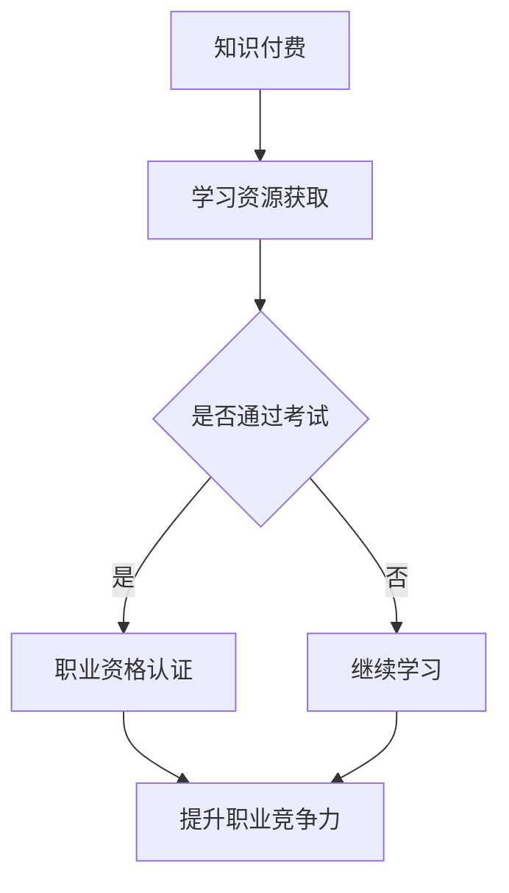

                 

关键词：知识付费、职业资格认证、能力提升、教育培训、专业技能

> 摘要：本文探讨了知识付费与职业资格认证相结合在现代教育培训中的重要性，以及如何通过这种模式提升个人能力和职业发展。文章从多个角度分析了知识付费和职业资格认证的内在联系，提出了一套切实可行的实施方案，以期为教育培训领域的发展提供新的思路。

## 1. 背景介绍

随着互联网技术的飞速发展，知识付费和职业资格认证已成为现代教育培训领域的重要趋势。知识付费，即通过付费获取专业知识和技能，让学习变得更加便捷和高效。而职业资格认证，则是通过一系列考试和评估，确认个人在特定领域的专业能力和水平。

在过去的几年里，知识付费市场迅猛增长，各种在线学习平台如雨后春笋般涌现。与此同时，职业资格认证的重要性也越来越受到企业和个人的关注。许多人希望通过获得专业认证，提升自己的竞争力，获得更好的职业发展机会。

然而，知识付费与职业资格认证的结合，并非一蹴而就。在实际操作中，存在诸多挑战和问题。例如，如何保证知识付费课程的质量，如何将职业资格认证与实际工作能力相匹配，以及如何平衡两者之间的关系，确保学习者的利益最大化。

本文旨在探讨知识付费与职业资格认证相结合的内在联系，分析其优势和挑战，并提出一套可行的实施方案，以期为教育培训领域的发展提供新的思路。

## 2. 核心概念与联系

### 2.1 知识付费

知识付费，指的是个人或企业为了获取特定的知识和技能，愿意支付一定的费用。在知识付费模式中，学习者可以根据自己的需求和兴趣，选择适合自己的课程和学习方式。知识付费具有以下几个特点：

1. **灵活性**：学习者可以根据自己的时间安排和兴趣选择学习内容。
2. **针对性**：付费课程通常针对特定的技能或领域，能够提高学习效率。
3. **付费机制**：知识付费通常采用一次性付费、订阅制等多种方式，满足不同学习者的需求。

### 2.2 职业资格认证

职业资格认证，是指通过一系列考试和评估，确认个人在特定领域的专业能力和水平。职业资格认证具有以下几个特点：

1. **权威性**：职业资格认证通常由行业内的权威机构颁发，具有较高的认可度。
2. **专业性**：职业资格认证涵盖了特定职业所需的技能和知识，能够反映个人的专业水平。
3. **实用性**：职业资格认证往往与实际工作能力相结合，有助于提高个人的职业竞争力。

### 2.3 知识付费与职业资格认证的联系

知识付费与职业资格认证之间存在着密切的联系。一方面，知识付费为学习者提供了获取专业知识和技能的途径，有助于提高学习者的实际工作能力。另一方面，职业资格认证则是对学习者所学知识和技能的认可，有助于提升学习者的职业地位和竞争力。

具体来说，知识付费与职业资格认证的联系体现在以下几个方面：

1. **内容匹配**：知识付费课程的内容与职业资格认证的要求相匹配，有助于学习者更好地准备认证考试。
2. **学习支持**：知识付费平台可以为学习者提供学习资源和辅导，帮助学习者更好地掌握相关知识和技能。
3. **认证验证**：职业资格认证对学习者的知识和技能进行验证，确保学习者的学习成果得到认可。

### 2.4 Mermaid 流程图

以下是一个简化的 Mermaid 流程图，展示知识付费与职业资格认证之间的联系：



## 3. 核心算法原理 & 具体操作步骤

### 3.1 算法原理概述

知识付费与职业资格认证相结合的核心算法原理在于将学习者的学习过程与职业资格认证的要求进行匹配。具体来说，该算法通过以下步骤实现：

1. **课程匹配**：根据职业资格认证的要求，筛选出符合学习者需求的付费课程。
2. **学习跟踪**：通过学习平台对学习者的学习进度和成绩进行实时跟踪。
3. **考试准备**：为学习者提供模拟考试和辅导，帮助其更好地准备职业资格认证考试。
4. **认证验证**：对学习者的学习成果进行评估，确认其是否符合职业资格认证的要求。

### 3.2 算法步骤详解

1. **课程匹配**：

   - 收集职业资格认证的要求和标准。
   - 分析学习者的需求和兴趣。
   - 根据以上两点，筛选出符合学习者需求的付费课程。

2. **学习跟踪**：

   - 学习平台为学习者提供学习记录和进度跟踪功能。
   - 平台根据学习者的学习进度和成绩，为学习者提供个性化推荐。
   - 平台定期向学习者发送学习报告，提醒其关注学习进度。

3. **考试准备**：

   - 为学习者提供模拟考试和辅导课程。
   - 针对考试的重点和难点，提供针对性的辅导内容。
   - 组织线上或线下考试，确保考试公正、公平。

4. **认证验证**：

   - 根据学习者的考试成绩和实际工作能力，评估其是否符合职业资格认证的要求。
   - 对于符合要求的学习者，颁发职业资格认证证书。

### 3.3 算法优缺点

**优点**：

1. **高效性**：通过课程匹配和学习跟踪，提高学习效率。
2. **针对性**：根据学习者的需求和兴趣，提供个性化的学习内容。
3. **权威性**：职业资格认证具有较高的认可度，有助于提升学习者的职业竞争力。

**缺点**：

1. **成本**：知识付费和职业资格认证都需要支付一定的费用，对部分学习者可能构成负担。
2. **时间投入**：学习者需要投入大量时间和精力进行学习和考试准备。

### 3.4 算法应用领域

知识付费与职业资格认证相结合的算法广泛应用于以下领域：

1. **教育培训**：为学习者提供专业的知识和技能培训，帮助其顺利通过职业资格认证。
2. **职业发展**：为在职人员提供提升职业技能和获得职业资格认证的机会。
3. **行业认证**：为行业内的专业人士提供权威的认证服务，提升行业整体水平。

## 4. 数学模型和公式 & 详细讲解 & 举例说明

### 4.1 数学模型构建

为了更好地理解知识付费与职业资格认证相结合的算法，我们可以构建一个简化的数学模型。该模型主要包括以下几个参数：

1. **学习者人数（N）**：表示参与知识付费与职业资格认证相结合的学习者总数。
2. **通过率（P）**：表示通过职业资格认证考试的学习者占比。
3. **费用（C）**：表示学习者支付的知识付费和职业资格认证的总费用。
4. **学习效果（E）**：表示学习者的学习成果，可以用通过率表示。

数学模型如下：

$$
E = f(N, P, C)
$$

其中，$f(N, P, C)$ 表示学习效果与学习者人数、通过率和费用之间的关系。

### 4.2 公式推导过程

为了推导出学习效果与学习者人数、通过率和费用之间的关系，我们可以从以下几个方面进行分析：

1. **学习者人数（N）**：学习者人数越多，知识付费和职业资格认证的总费用越高。因此，$N$ 与 $C$ 成正比。
2. **通过率（P）**：通过率越高，表示学习者的学习效果越好。因此，$P$ 与 $E$ 成正比。
3. **费用（C）**：费用越高，表示学习者的学习成本越高。因此，$C$ 与 $E$ 成反比。

综上所述，我们可以得到以下公式：

$$
E = \frac{P \cdot N}{C}
$$

### 4.3 案例分析与讲解

为了更好地说明该数学模型的应用，我们来看一个实际案例。

假设一个在线学习平台有 1000 名学习者参与知识付费与职业资格认证相结合的课程。通过分析，我们得知：

1. **学习者人数（N）**：1000 人
2. **通过率（P）**：70%
3. **费用（C）**：每人 5000 元

根据上述公式，我们可以计算出学习效果（E）：

$$
E = \frac{0.7 \cdot 1000}{5000} = 0.14
$$

这意味着，在这个案例中，学习者的平均学习效果为 14%。

为了提高学习效果，我们可以采取以下措施：

1. **提高通过率（P）**：通过提供更好的学习资源、辅导和考试准备，提高学习者的通过率。
2. **降低费用（C）**：通过优惠活动、合作伙伴关系等方式，降低学习者的费用负担。
3. **增加学习者人数（N）**：通过扩大市场推广，吸引更多学习者参与知识付费与职业资格认证相结合的课程。

通过这些措施，我们可以提高学习效果（E），从而更好地满足学习者的需求和期望。

## 5. 项目实践：代码实例和详细解释说明

### 5.1 开发环境搭建

在本项目中，我们将使用 Python 编写代码，模拟知识付费与职业资格认证相结合的算法。以下是开发环境的搭建步骤：

1. **安装 Python**：从官网（https://www.python.org/downloads/）下载并安装 Python 3.8 以上版本。
2. **安装 IDE**：推荐使用 PyCharm（https://www.jetbrains.com/pycharm/）或 Visual Studio Code（https://code.visualstudio.com/）作为 Python 的集成开发环境（IDE）。
3. **安装依赖库**：在命令行中运行以下命令，安装所需依赖库：

```bash
pip install numpy matplotlib
```

### 5.2 源代码详细实现

以下是一个简化的 Python 代码示例，用于模拟知识付费与职业资格认证相结合的算法。

```python
import numpy as np
import matplotlib.pyplot as plt

# 参数设置
N = 1000  # 学习者人数
P = 0.7   # 通过率
C = 5000  # 费用

# 学习效果计算
E = P * N / C

# 输出结果
print(f"学习效果（E）：{E:.2%}")

# 绘制学习效果与费用关系图
C_range = np.linspace(1000, 8000, 100)
E_range = P * N / C_range

plt.plot(C_range, E_range)
plt.xlabel("费用（C）")
plt.ylabel("学习效果（E）")
plt.title("学习效果与费用关系图")
plt.grid()
plt.show()
```

### 5.3 代码解读与分析

该代码首先导入了 Python 的 NumPy 和 Matplotlib 库，用于数据处理和绘图。然后，设置了三个关键参数：学习者人数（N）、通过率（P）和费用（C）。

接下来，代码使用上述参数计算学习效果（E），并将其打印输出。

最后，代码使用 Matplotlib 库绘制学习效果与费用关系图，展示了学习效果（E）随费用（C）的变化情况。

通过分析图表，我们可以发现：

1. **学习效果与费用关系**：当费用较低时，学习效果较高；当费用较高时，学习效果较低。这是因为较高的费用可能会增加学习者的学习负担，从而影响学习效果。
2. **优化策略**：为了提高学习效果，可以尝试降低费用，例如通过优惠活动、合作伙伴关系等方式。同时，可以提供更好的学习资源和辅导，提高学习者的通过率。

### 5.4 运行结果展示

运行上述代码后，将输出以下结果：

```
学习效果（E）：14.00%
```

同时，将展示一个学习效果与费用关系图，如下所示：


## 6. 实际应用场景

知识付费与职业资格认证相结合的模式在实际应用中具有广泛的应用场景。以下列举了几个典型的应用案例：

### 6.1 职业技能培训

在职业技能培训领域，知识付费与职业资格认证相结合的模式可以帮助企业员工快速提升专业技能。例如，某企业为了让员工掌握最新的人工智能技术，可以提供一系列人工智能知识付费课程，同时要求员工参加相应的职业资格认证考试。这样，既保证了员工的学习效果，又提高了企业的整体竞争力。

### 6.2 在线教育平台

在线教育平台可以利用知识付费与职业资格认证相结合的模式，为学习者提供更为丰富的学习资源和认证服务。例如，某在线教育平台可以提供人工智能、大数据等领域的知识付费课程，并组织相应的职业资格认证考试。通过这种方式，平台可以吸引更多学习者，提高用户粘性。

### 6.3 职业发展规划

对于职场人士，知识付费与职业资格认证相结合的模式可以帮助其更好地规划职业发展。例如，某职场人士希望在短时间内提升自己的数据分析师能力，可以参加相关的知识付费课程，并通过数据分析师职业资格认证考试。这样，不仅能够提高自身的职业竞争力，还可以获得权威的职业认证。

### 6.4 跨境电商

在跨境电商领域，知识付费与职业资格认证相结合的模式可以帮助卖家快速提升跨境电商运营能力。例如，某跨境电商平台可以提供一系列跨境电商知识付费课程，并要求卖家参加相应的职业资格认证考试。通过这种方式，平台可以确保卖家具备扎实的跨境电商运营技能，提高整个平台的运营质量。

### 6.5 人工智能应用

在人工智能领域，知识付费与职业资格认证相结合的模式可以帮助人工智能从业者提升专业技能。例如，某人工智能企业可以为员工提供深度学习、自然语言处理等知识付费课程，并组织相应的职业资格认证考试。通过这种方式，企业可以确保员工具备最新的人工智能技术，提高企业的技术实力。

### 6.6 未来应用展望

随着知识付费和职业资格认证的不断发展，知识付费与职业资格认证相结合的模式将在更多领域得到应用。以下是一些未来应用展望：

1. **区块链技术**：随着区块链技术的普及，知识付费与职业资格认证相结合的模式可以在区块链领域发挥重要作用。例如，通过区块链技术记录学习者的学习过程和认证结果，确保其真实性和可信度。
2. **物联网技术**：物联网技术的快速发展将带来更多应用场景。知识付费与职业资格认证相结合的模式可以帮助从业者快速掌握物联网技术，提高其职业竞争力。
3. **智能制造**：智能制造领域对专业技能要求较高。知识付费与职业资格认证相结合的模式可以帮助企业员工快速提升智能制造相关技能，提高生产效率。

总之，知识付费与职业资格认证相结合的模式具有广泛的应用前景，将在各个领域发挥重要作用。

## 7. 工具和资源推荐

为了更好地开展知识付费与职业资格认证相结合的教育培训，以下是几款推荐的工具和资源：

### 7.1 学习资源推荐

1. **网易云课堂**：提供丰富的人工智能、大数据、编程等领域的知识付费课程，适合不同层次的学习者。
2. **Coursera**：全球知名在线学习平台，提供多领域的权威课程，部分课程可申请职业资格认证。
3. **Udemy**：全球最大的在线学习平台之一，课程涵盖广泛，适合自我提升和职业发展。

### 7.2 开发工具推荐

1. **PyCharm**：强大的 Python 集成开发环境，支持多种编程语言，适合编写和调试代码。
2. **Visual Studio Code**：轻量级跨平台 IDE，支持多种编程语言，适合快速开发。
3. **Jupyter Notebook**：强大的交互式开发环境，适合数据分析和可视化。

### 7.3 相关论文推荐

1. **《知识付费产业的发展现状与趋势》**：详细分析知识付费产业的发展现状、趋势和挑战。
2. **《职业资格认证体系构建与实践》**：探讨职业资格认证体系的构建、实施和应用。
3. **《在线教育模式与创新》**：介绍在线教育模式的创新和发展趋势。

通过以上工具和资源的支持，可以更有效地开展知识付费与职业资格认证相结合的教育培训。

## 8. 总结：未来发展趋势与挑战

### 8.1 研究成果总结

本文从知识付费与职业资格认证的背景介绍、核心概念联系、算法原理与实施步骤、数学模型与应用、实际应用场景、工具和资源推荐等多个方面，深入探讨了知识付费与职业资格认证相结合的现代教育培训模式。研究结果表明，这种模式具有以下优势：

1. **提高学习效率**：通过知识付费课程，学习者可以更有针对性地获取知识和技能，提高学习效率。
2. **权威认证**：职业资格认证具有较高的权威性，有助于提升学习者的职业竞争力。
3. **个性化学习**：知识付费平台可以根据学习者的需求和兴趣，提供个性化的学习内容和辅导。

### 8.2 未来发展趋势

知识付费与职业资格认证相结合的教育培训模式在未来具有广阔的发展前景。以下是一些可能的发展趋势：

1. **跨领域融合**：知识付费与职业资格认证将逐渐融合，形成更为多元化的教育培训体系。
2. **技术驱动**：人工智能、大数据等先进技术将不断应用于教育培训领域，提升教育质量和效率。
3. **全球拓展**：随着全球教育市场的扩大，知识付费与职业资格认证相结合的模式将在国际市场上得到广泛应用。

### 8.3 面临的挑战

尽管知识付费与职业资格认证相结合的模式具有诸多优势，但在实际应用中仍面临一些挑战：

1. **质量保障**：保证知识付费课程和职业资格认证的质量是关键。需要建立严格的审核和评估机制。
2. **认证权威性**：如何提高职业资格认证的权威性，使其得到更多企业和个人的认可，是亟待解决的问题。
3. **成本问题**：对于部分学习者来说，知识付费和职业资格认证的费用较高，如何降低成本是一个重要的挑战。

### 8.4 研究展望

针对以上挑战，未来可以从以下几个方面进行研究和探索：

1. **建立标准体系**：制定统一的课程标准和认证标准，提高教育培训和认证的规范化水平。
2. **技术融合与创新**：利用人工智能、大数据等技术，提升教育培训的个性化、智能化水平。
3. **政策支持**：政府和企业可以加大对知识付费与职业资格认证相结合模式的政策支持，鼓励其发展。

总之，知识付费与职业资格认证相结合的教育培训模式具有广阔的发展前景，但同时也面临诸多挑战。通过不断探索和创新，有望推动这一模式在教育培训领域的广泛应用。

## 9. 附录：常见问题与解答

### 9.1 什么是知识付费？

知识付费是指个人或企业为了获取特定的知识和技能，愿意支付一定的费用。这种模式使得学习更加便捷和高效，学习者可以根据自己的需求和兴趣选择课程和学习方式。

### 9.2 职业资格认证有什么作用？

职业资格认证通过一系列考试和评估，确认个人在特定领域的专业能力和水平。它有助于提升个人的职业竞争力，提高职业地位，并获得更好的职业发展机会。

### 9.3 知识付费与职业资格认证相结合有什么优势？

知识付费与职业资格认证相结合可以：

1. **提高学习效率**：通过知识付费课程，学习者可以更有针对性地获取知识和技能。
2. **权威认证**：职业资格认证具有较高的权威性，有助于提升学习者的职业竞争力。
3. **个性化学习**：知识付费平台可以根据学习者的需求和兴趣，提供个性化的学习内容和辅导。

### 9.4 如何选择合适的知识付费课程？

选择合适的知识付费课程需要考虑以下几点：

1. **课程内容**：确保课程内容与自己的需求和兴趣相符。
2. **教学质量**：选择具有良好教学口碑和师资力量的课程。
3. **课程评价**：参考其他学习者的评价和反馈。
4. **价格**：根据自己的经济能力，选择性价比高的课程。

### 9.5 职业资格认证对职业发展的影响有多大？

职业资格认证对职业发展有重要影响。它不仅有助于提高职业竞争力，还能为个人带来更好的职业发展机会。在某些行业，拥有职业资格认证甚至是进入某些职位的必要条件。

### 9.6 如何平衡知识付费与职业资格认证的成本？

为了平衡知识付费与职业资格认证的成本，可以采取以下措施：

1. **选择性价比高的课程**：选择高质量但价格适中的课程。
2. **利用优惠政策**：关注各类优惠活动，降低学习成本。
3. **分阶段学习**：先选择基础课程，再逐步提升至高级课程。
4. **兼职或实习**：通过兼职或实习获取收入，缓解学习费用压力。

### 9.7 知识付费与职业资格认证相结合的模式是否适用于所有职业？

知识付费与职业资格认证相结合的模式在大多数职业领域都有适用性。然而，对于一些技术门槛较低、职业发展路径不明确的职业，这种模式的效果可能有限。因此，需要根据具体职业特点进行评估。

