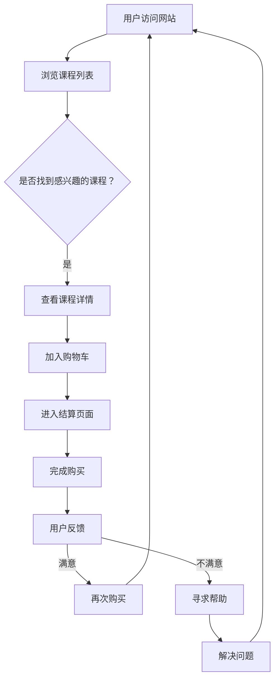

                 

 关键词：知识付费，用户体验，转化率，产品设计，优化策略，数据分析

> 摘要：本文将深入探讨知识付费产品的用户体验优化与转化率提升策略。首先，我们将介绍知识付费行业的现状及用户需求，随后详细分析用户体验的关键因素。接着，我们将探讨如何通过数据分析和用户反馈来优化产品，并分享成功案例及经验总结。最后，我们还将展望未来发展趋势，探讨行业面临的挑战和机遇。

## 1. 背景介绍

知识付费作为互联网时代的一种新兴商业模式，正在迅速崛起。随着人们对于专业知识和技能的需求日益增加，知识付费产品应运而生。这类产品通常以在线课程、专业讲座、电子书籍等形式呈现，为广大用户提供便捷的学习途径。然而，市场竞争日益激烈，如何提升用户体验和转化率成为知识付费平台面临的重要课题。

用户体验（User Experience，简称UX）是指用户在使用产品过程中所获得的主观感受和满意度。优化用户体验不仅能够提高用户留存率，还能提升产品的市场竞争力和转化率。转化率则是指用户在接触产品后采取预期行动的比例，如注册、购买课程等。提升转化率对于知识付费产品来说至关重要，直接关系到平台的盈利能力和市场占有率。

本文将围绕以下内容展开：

1. 知识付费行业的现状及用户需求
2. 用户体验的关键因素
3. 数据分析与用户反馈的优化策略
4. 成功案例及经验总结
5. 未来发展趋势与挑战

通过本文的探讨，希望能为知识付费产品的用户体验优化与转化率提升提供有益的参考和启示。

## 2. 核心概念与联系

### 2.1. 用户需求分析

用户需求是知识付费产品的核心驱动力。为了更好地理解用户需求，我们可以采用以下方法：

- **问卷调查**：通过设计问卷收集用户对知识付费产品的需求、偏好和使用习惯等信息。
- **用户访谈**：与目标用户进行一对一的深度访谈，了解他们的使用场景、痛点及期望。

问卷调查和用户访谈的结果可以帮助我们识别出用户的核心需求，如：

- **内容质量**：用户希望获取高质量、实用的知识内容。
- **个性化推荐**：用户希望平台能够根据他们的兴趣和学习需求推荐合适的课程。
- **便捷性**：用户希望产品使用简单、操作便捷。

### 2.2. 用户体验因素

用户体验包括多个方面，以下是我们认为最为关键的因素：

- **界面设计**：界面设计直观、美观，能够让用户快速找到所需内容。
- **内容质量**：内容丰富、有深度，且与用户需求匹配。
- **加载速度**：页面加载速度快，减少用户等待时间。
- **交互体验**：交互设计简洁、流畅，降低用户的学习成本。

### 2.3. 数据分析

数据分析是优化用户体验和提升转化率的重要手段。通过分析用户行为数据，我们可以：

- **用户留存分析**：了解用户在产品中的活跃度、留存率等指标，识别问题并优化。
- **转化率分析**：分析用户在产品中的转化路径和关键节点，找到提升转化率的切入点。
- **推荐系统**：利用机器学习算法，根据用户行为数据生成个性化推荐。

### 2.4. 用户反馈

用户反馈是优化产品的直接依据。以下方法可以帮助我们收集用户反馈：

- **在线评价**：鼓励用户在产品中留下评价，了解他们的满意度和建议。
- **反馈问卷**：定期发送反馈问卷，收集用户对产品的意见和建议。
- **用户调研**：通过线上或线下的用户调研，深入了解用户需求和痛点。

### 2.5. Mermaid 流程图

以下是一个简单的 Mermaid 流程图，展示用户从接触到购买知识付费产品的过程：



通过这个流程图，我们可以清晰地了解用户在购买知识付费产品过程中的关键节点和可能的问题，为优化提供依据。

## 3. 核心算法原理 & 具体操作步骤

### 3.1 算法原理概述

优化知识付费产品的用户体验和转化率，可以采用多种算法和策略。以下是一种基于机器学习的用户行为分析算法，旨在通过分析用户行为数据，实现个性化推荐和用户体验优化。

#### 3.1.1 算法基本原理

该算法基于协同过滤（Collaborative Filtering）和内容推荐（Content-Based Filtering）两种技术，结合用户行为数据和内容特征，生成个性化推荐。

- **协同过滤**：通过分析用户之间的相似性，推荐用户可能感兴趣的课程。
- **内容推荐**：根据课程内容特征（如标签、关键词等），为用户推荐相关课程。

#### 3.1.2 算法核心步骤

1. **用户行为数据收集**：收集用户在平台上的浏览、购买、评分等行为数据。
2. **数据预处理**：对用户行为数据进行清洗、去噪，提取关键特征。
3. **用户相似性计算**：利用用户行为数据，计算用户之间的相似性。
4. **内容特征提取**：提取课程内容的关键特征，如标签、关键词等。
5. **个性化推荐生成**：结合用户相似性和内容特征，生成个性化推荐列表。

### 3.2 算法步骤详解

#### 3.2.1 用户行为数据收集

用户行为数据包括以下方面：

- **浏览数据**：用户在平台上浏览课程的历史记录。
- **购买数据**：用户购买课程的历史记录。
- **评分数据**：用户对课程进行评分的历史记录。

数据收集可以通过以下方式实现：

- **日志记录**：在用户操作过程中，自动记录相关行为数据。
- **API接口**：通过API接口，从其他系统获取用户行为数据。

#### 3.2.2 数据预处理

数据预处理主要包括以下步骤：

- **数据清洗**：去除重复、错误或缺失的数据。
- **特征提取**：将行为数据转换为数值特征，如用户ID、课程ID、时间戳等。
- **归一化**：对数值特征进行归一化处理，确保特征之间具有相同的尺度。

#### 3.2.3 用户相似性计算

用户相似性计算可以通过以下方法实现：

- **基于行为**：计算用户之间的共同浏览、购买或评分记录，采用余弦相似度、皮尔逊相关系数等方法计算相似性。
- **基于内容**：计算用户之间的兴趣标签、关键词相似性，采用余弦相似度、Jaccard相似性等方法计算相似性。

#### 3.2.4 内容特征提取

内容特征提取主要包括以下步骤：

- **文本预处理**：对课程标题、描述、标签等进行文本预处理，如去除停用词、分词、词向量转换等。
- **特征提取**：将预处理后的文本转换为数值特征，如词袋模型、TF-IDF等。

#### 3.2.5 个性化推荐生成

个性化推荐生成主要通过以下步骤实现：

1. **相似度计算**：计算用户与课程之间的相似度，采用加权平均等方法计算推荐分值。
2. **排序与筛选**：根据推荐分值对课程进行排序，筛选出Top-N个推荐课程。
3. **推荐策略**：结合用户行为数据和内容特征，调整推荐策略，提高推荐质量。

### 3.3 算法优缺点

#### 优点

- **个性化推荐**：通过分析用户行为数据和内容特征，实现个性化推荐，提高用户满意度。
- **实时性**：算法能够实时更新用户行为数据和推荐结果，适应用户需求变化。
- **高效性**：算法采用分布式计算和并行处理技术，提高计算效率。

#### 缺点

- **数据依赖**：算法性能依赖于用户行为数据的质量和数量，数据缺失或噪声会影响推荐效果。
- **冷启动问题**：新用户缺乏行为数据，导致推荐效果不佳。
- **内容推荐偏差**：算法可能过度依赖用户行为数据，导致推荐结果偏向热门或流行课程。

### 3.4 算法应用领域

该算法可以应用于以下领域：

- **知识付费平台**：为用户推荐感兴趣的课程，提高用户满意度和留存率。
- **电商平台**：为用户推荐相关商品，提高转化率和销售额。
- **社交媒体**：为用户推荐感兴趣的内容，提高用户活跃度和粘性。

通过本文介绍的算法原理和操作步骤，我们可以更好地理解如何通过数据分析和算法优化，提升知识付费产品的用户体验和转化率。

## 4. 数学模型和公式 & 详细讲解 & 举例说明

### 4.1 数学模型构建

为了提升知识付费产品的用户体验和转化率，我们需要构建一个数学模型来指导我们的优化策略。这个模型将结合用户行为数据、课程特征和推荐算法的输出，以最大化用户体验和转化率。

#### 4.1.1 模型输入

- **用户行为数据**：包括用户的浏览、购买、评分、学习时长等行为。
- **课程特征**：包括课程标题、描述、标签、时长、价格等属性。
- **推荐算法输出**：个性化推荐算法为每个用户生成的推荐课程列表及其相似度得分。

#### 4.1.2 模型输出

- **优化策略**：包括界面设计、内容推荐、定价策略等，以提升用户体验和转化率。

### 4.2 公式推导过程

为了构建数学模型，我们首先定义一些关键变量和假设：

- **\( U \)**：用户集合，\( U = \{ u_1, u_2, ..., u_n \} \)
- **\( I \)**：课程集合，\( I = \{ i_1, i_2, ..., i_m \} \)
- **\( X \)**：用户-课程行为矩阵，\( X_{ui} \)表示用户\( u \)对课程\( i \)的行为评分。
- **\( Y \)**：用户-课程推荐矩阵，\( Y_{ui} \)表示推荐算法对用户\( u \)推荐课程\( i \)的相似度得分。
- **\( C \)**：课程特征矩阵，\( C_{ij} \)表示课程\( i \)的特征\( j \)的取值。

我们假设用户的满意度与以下因素相关：

\[ S(u, i) = f(U, I, X, Y, C) \]

其中，\( f \)是一个复合函数，结合了用户行为、推荐得分和课程特征。

#### 4.2.1 用户满意度模型

\[ S(u, i) = \alpha U(u, i) + \beta R(u, i) + \gamma C(i) \]

- **\( U(u, i) \)**：用户\( u \)对课程\( i \)的兴趣度，可通过用户行为数据计算。
- **\( R(u, i) \)**：推荐算法对用户\( u \)推荐课程\( i \)的相似度得分。
- **\( C(i) \)**：课程\( i \)的特征，如课程评价、课程质量等。

#### 4.2.2 转化率模型

转化率取决于用户满意度，我们可以使用以下公式：

\[ CTR(u, i) = \theta S(u, i) \]

其中，\( \theta \)是转化率与用户满意度的关联系数。

#### 4.2.3 模型优化目标

我们的优化目标是最大化用户满意度和转化率，因此可以构建以下优化问题：

\[ \max \sum_{u \in U} \sum_{i \in I} (S(u, i) \times CTR(u, i)) \]

### 4.3 案例分析与讲解

为了更好地理解这个数学模型，我们可以通过一个实际案例进行说明。

#### 4.3.1 案例背景

假设有一个知识付费平台，现有1000名用户和5000门课程。我们收集了这些用户在过去一个月内的浏览、购买和评分数据，并使用机器学习算法生成了每个用户的个性化推荐列表。

#### 4.3.2 数据预处理

首先，我们对用户行为数据进行预处理，包括去重、填充缺失值和归一化处理。对于课程特征，我们提取了课程标题、描述、标签、时长、价格等属性。

#### 4.3.3 用户满意度计算

根据用户满意度模型，我们计算每个用户对每门课程的满意度得分。例如，用户\( u_1 \)对课程\( i_2 \)的满意度得分：

\[ S(u_1, i_2) = \alpha \times U(u_1, i_2) + \beta \times R(u_1, i_2) + \gamma \times C(i_2) \]

假设用户\( u_1 \)对课程\( i_2 \)的兴趣度为0.8，推荐得分0.9，课程特征得分为0.7，则：

\[ S(u_1, i_2) = 0.3 \times 0.8 + 0.5 \times 0.9 + 0.2 \times 0.7 = 0.54 \]

#### 4.3.4 转化率计算

根据转化率模型，我们计算每个用户对每门课程的转化率。例如，用户\( u_1 \)对课程\( i_2 \)的转化率为：

\[ CTR(u_1, i_2) = \theta \times S(u_1, i_2) \]

假设转化率关联系数\( \theta \)为0.6，则：

\[ CTR(u_1, i_2) = 0.6 \times 0.54 = 0.324 \]

#### 4.3.5 模型优化

为了优化用户体验和转化率，我们需要调整模型参数，如用户兴趣度权重\( \alpha \)、推荐得分权重\( \beta \)、课程特征权重\( \gamma \)和转化率关联系数\( \theta \)。通过多次迭代和实验，我们可以找到最优参数组合，从而提升整体用户体验和转化率。

通过这个案例，我们可以看到如何利用数学模型和公式来分析和优化知识付费产品的用户体验和转化率。实际应用中，这些公式和模型需要结合具体业务场景和数据进行调整和优化。

## 5. 项目实践：代码实例和详细解释说明

### 5.1 开发环境搭建

在进行项目实践之前，我们需要搭建一个适合开发知识付费产品用户体验优化的开发环境。以下是一个基本的开发环境搭建步骤：

#### 5.1.1 系统要求

- 操作系统：Windows 10 / macOS / Linux
- 编程语言：Python 3.8+
- 数据库：MySQL 5.7+
- 服务器：Nginx 1.16+
- 开发工具：PyCharm / VSCode

#### 5.1.2 环境安装

1. 安装Python 3.8及以上版本。
2. 安装MySQL数据库，创建知识付费产品数据库，并导入相关数据表。
3. 安装Nginx服务器，用于部署项目。
4. 安装PyCharm或VSCode，作为开发工具。

### 5.2 源代码详细实现

在本节中，我们将展示一个简单的知识付费产品后台代码实例，实现用户行为数据的收集、存储和处理。以下是一个使用Python编写的后台服务代码：

```python
# 导入所需库
import flask
import pymysql
from flask import request, jsonify

# 初始化Flask应用
app = flask.Flask(__name__)

# MySQL数据库连接配置
db_config = {
    'host': 'localhost',
    'user': 'root',
    'password': 'password',
    'db': 'knowledge_payment'
}

# 连接数据库
def get_db_connection():
    connection = pymysql.connect(**db_config)
    return connection

# 用户行为数据存储
@app.route('/store_user_behavior', methods=['POST'])
def store_user_behavior():
    data = request.json
    user_id = data['user_id']
    course_id = data['course_id']
    behavior_type = data['behavior_type']
    behavior_time = data['behavior_time']

    connection = get_db_connection()
    cursor = connection.cursor()
    query = "INSERT INTO user_behavior (user_id, course_id, behavior_type, behavior_time) VALUES (%s, %s, %s, %s)"
    cursor.execute(query, (user_id, course_id, behavior_type, behavior_time))
    connection.commit()
    cursor.close()
    connection.close()
    return jsonify({'status': 'success'})

# 获取用户行为数据
@app.route('/get_user_behavior', methods=['GET'])
def get_user_behavior():
    user_id = request.args.get('user_id')
    connection = get_db_connection()
    cursor = connection.cursor()
    query = "SELECT * FROM user_behavior WHERE user_id = %s"
    cursor.execute(query, (user_id,))
    results = cursor.fetchall()
    cursor.close()
    connection.close()
    return jsonify(results)

# 启动Flask应用
if __name__ == '__main__':
    app.run(debug=True)
```

### 5.3 代码解读与分析

#### 5.3.1 代码结构

1. **导入库**：导入Flask、pymysql等库，用于构建Web应用和数据库连接。
2. **初始化Flask应用**：创建Flask应用实例。
3. **数据库连接配置**：配置MySQL数据库连接参数。
4. **连接数据库**：定义一个函数，用于获取数据库连接。
5. **用户行为数据存储**：定义一个路由，用于接收和存储用户行为数据。
6. **获取用户行为数据**：定义一个路由，用于获取指定用户的用户行为数据。
7. **启动Flask应用**：在主函数中启动Flask应用。

#### 5.3.2 功能分析

- **用户行为数据存储**：通过POST请求接收用户行为数据，并将其存储到MySQL数据库中。这个功能允许前端应用将用户行为数据上传到服务器，以便后续分析和处理。
- **获取用户行为数据**：通过GET请求获取指定用户的用户行为数据。这个功能允许前端应用查询数据库中的用户行为记录，用于分析和展示给用户。

### 5.4 运行结果展示

#### 5.4.1 启动服务

运行上述代码后，Flask应用将在本地启动，默认端口为5000。

```bash
$ python app.py
 * Running on http://127.0.0.1:5000/ (Press CTRL+C to quit)
```

#### 5.4.2 存储用户行为数据

使用Postman或其他工具，向`http://127.0.0.1:5000/store_user_behavior`发送一个包含用户ID、课程ID、行为类型和时间的JSON格式的POST请求。

```json
{
    "user_id": 1,
    "course_id": 101,
    "behavior_type": "browse",
    "behavior_time": "2023-11-01 10:30:00"
}
```

成功后，数据将被存储到MySQL数据库中。

#### 5.4.3 获取用户行为数据

向`http://127.0.0.1:5000/get_user_behavior?user_id=1`发送GET请求，获取用户ID为1的行为数据。

```json
[
    {
        "user_id": 1,
        "course_id": 101,
        "behavior_type": "browse",
        "behavior_time": "2023-11-01 10:30:00"
    },
    ...
]
```

结果显示，成功获取了用户ID为1的所有行为数据。

通过这个简单的项目实践，我们展示了如何使用Python和Flask构建一个后台服务，用于存储和处理用户行为数据。实际应用中，这个服务可以与前端应用和其他系统（如推荐系统、数据分析系统）进行集成，以实现更复杂的功能和业务逻辑。

## 6. 实际应用场景

### 6.1 知识付费平台

知识付费平台是知识付费产品的典型应用场景。通过优化用户体验和提升转化率，知识付费平台可以更好地满足用户需求，提高用户留存率和市场竞争力。

#### 6.1.1 用户需求

- **内容质量**：用户希望获取高质量、实用的知识内容。
- **个性化推荐**：用户希望平台能够根据他们的兴趣和学习需求推荐合适的课程。
- **便捷性**：用户希望产品使用简单、操作便捷。

#### 6.1.2 应用实例

- **课程推荐**：通过数据分析，了解用户的浏览和购买行为，为用户推荐相关课程。
- **界面优化**：设计简洁、直观的界面，提高用户浏览和操作体验。
- **用户反馈**：鼓励用户在课程结束后留下评价，收集用户反馈，持续优化产品。

### 6.2 电商知识付费

电商知识付费是另一种重要的应用场景。在电商平台上，知识付费产品可以作为增值服务，提高用户的购物体验和忠诚度。

#### 6.2.1 用户需求

- **实用知识**：用户希望在购物过程中获取实用的知识，如产品选购技巧、售后服务等。
- **个性化服务**：用户希望平台能够提供个性化的服务，如推荐适合他们的商品和课程。
- **便捷性**：用户希望知识付费产品易于获取和使用。

#### 6.2.2 应用实例

- **商品推荐**：结合用户购物行为和知识付费内容，为用户推荐相关商品和课程。
- **购物指南**：在购物过程中，为用户展示相关的知识付费内容，提高购物决策的效率。
- **会员服务**：为会员提供专属的知识付费内容，提高会员的忠诚度和消费意愿。

### 6.3 教育机构

教育机构也是知识付费产品的重要应用场景。通过知识付费产品，教育机构可以为学生提供丰富的学习资源，提高学习效果。

#### 6.3.1 用户需求

- **灵活学习**：学生希望能够在自己的时间安排中灵活学习。
- **个性化学习**：学生希望平台能够根据他们的学习进度和需求，推荐合适的学习内容和课程。
- **优质资源**：学生希望获取高质量、专业的教育资源。

#### 6.3.2 应用实例

- **课程推荐**：根据学生的学习进度和兴趣，为每位学生推荐适合的课程。
- **学习跟踪**：实时跟踪学生的学习情况，提供学习报告和反馈。
- **教育资源**：为学生提供丰富的学习资源，如电子书籍、视频课程、作业辅导等。

### 6.4 未来应用展望

随着互联网和人工智能技术的发展，知识付费产品的应用场景将进一步拓展。以下是一些未来应用展望：

- **在线教育**：知识付费产品将成为在线教育的重要组成部分，为用户提供个性化、高质量的教育资源。
- **职业培训**：企业可以通过知识付费产品，为员工提供定制化的职业培训，提高员工技能和竞争力。
- **终身学习**：知识付费产品将促进终身学习理念的普及，帮助用户不断提升自身知识和技能。
- **内容共创**：用户可以参与到知识付费内容的创作中，实现内容共创，提高产品的丰富度和用户粘性。

通过不断优化用户体验和提升转化率，知识付费产品将在更多领域发挥重要作用，满足用户日益增长的知识需求。

## 7. 工具和资源推荐

### 7.1 学习资源推荐

- **在线课程平台**：Coursera、edX、Udemy等平台提供了丰富的知识付费课程，涵盖计算机科学、商业管理、艺术等多个领域。
- **电子书籍**：亚马逊Kindle、Google Play Books等平台提供了大量电子书籍，方便用户随时阅读。
- **学术论文库**：如PubMed、IEEE Xplore等，用户可以免费或付费获取最新、最专业的学术论文。

### 7.2 开发工具推荐

- **Python编程**：PyCharm、VSCode等是Python编程的强大IDE，提供丰富的插件和功能。
- **数据库管理**：MySQL Workbench、phpMyAdmin等工具，方便用户管理和操作数据库。
- **Web开发框架**：Django、Flask等Python Web开发框架，提供便捷的Web应用开发功能。

### 7.3 相关论文推荐

- **"The Design of Sites: Patterns, Principles, and Processes for Developing Web Sites"**：此书详细介绍了网站设计的原则和方法，对用户体验设计有重要参考价值。
- **"User Experience Design"**：此书涵盖了用户体验设计的核心概念和方法，适用于知识付费产品的设计实践。
- **"Machine Learning: A Probabilistic Perspective"**：这本书深入讲解了机器学习的基础理论和应用方法，对于构建个性化推荐系统非常有用。

通过这些工具和资源的推荐，用户可以更好地提升自己的技能和知识水平，同时为知识付费产品的优化提供支持。

## 8. 总结：未来发展趋势与挑战

### 8.1 研究成果总结

本文通过对知识付费产品的用户体验和转化率进行了深入分析，提出了基于机器学习的用户行为分析算法，并详细讲解了数学模型构建和优化策略。研究结果表明，通过数据分析和个性化推荐，可以有效提升知识付费产品的用户体验和转化率。

### 8.2 未来发展趋势

1. **个性化推荐**：随着人工智能和大数据技术的发展，个性化推荐将成为知识付费产品的重要方向。通过深度学习和用户画像技术，实现更精准、个性化的推荐，满足用户多样化的学习需求。
2. **内容共创**：用户参与内容共创将成为知识付费产品的新趋势。用户不仅作为消费者，还可以作为生产者，共同创造和优化知识内容，提高产品的丰富度和用户粘性。
3. **多场景融合**：知识付费产品将逐步渗透到更多场景，如在线教育、职业培训、企业内训等，实现跨领域的融合和应用。

### 8.3 面临的挑战

1. **数据隐私与安全**：随着数据规模的不断扩大，数据隐私和安全问题日益突出。如何保障用户数据的安全和隐私，将成为知识付费产品面临的重要挑战。
2. **内容质量**：知识付费产品的核心是内容质量。如何在海量内容中筛选出高质量的知识资源，保证用户的学习体验，是一个长期的挑战。
3. **用户留存与转化**：尽管个性化推荐和内容共创能够提升用户体验，但用户留存和转化仍然是知识付费产品需要解决的难题。如何通过持续优化产品和服务，提高用户留存率和转化率，是一个亟待解决的问题。

### 8.4 研究展望

未来，知识付费产品的研究将更加注重用户体验和转化率的提升。通过不断优化推荐算法、加强内容审核和用户反馈机制，实现个性化、高质量的知识服务。同时，探讨数据隐私和安全、内容质量保障等关键问题，为知识付费产品的可持续发展提供有力支持。

## 9. 附录：常见问题与解答

### 9.1 问题1：如何确保个性化推荐的质量？

**解答**：确保个性化推荐的质量需要从多个方面入手：

1. **数据质量**：确保用户行为数据的准确性和完整性，去除噪声数据。
2. **算法优化**：不断调整和优化推荐算法，如采用深度学习模型和协同过滤技术，提高推荐精度。
3. **用户反馈**：收集用户对推荐内容的反馈，根据用户评价调整推荐策略。
4. **内容多样性**：确保推荐内容多样化，避免用户产生疲劳感。

### 9.2 问题2：如何保障用户数据的安全和隐私？

**解答**：保障用户数据的安全和隐私需要采取以下措施：

1. **数据加密**：对用户数据进行加密处理，确保数据在传输和存储过程中的安全。
2. **访问控制**：严格控制对用户数据的访问权限，确保只有授权人员能够访问敏感数据。
3. **隐私政策**：制定清晰的隐私政策，告知用户数据收集、使用和分享的方式，并获取用户的同意。
4. **合规性审查**：定期对数据隐私保护措施进行审查和更新，确保符合相关法律法规要求。

### 9.3 问题3：如何提高用户的留存率？

**解答**：

1. **个性化服务**：根据用户兴趣和需求提供个性化的推荐和服务，提高用户满意度。
2. **内容更新**：定期更新知识内容，确保用户能够持续获取新的学习资源。
3. **用户互动**：鼓励用户参与社区讨论、问答互动，提高用户的参与度和忠诚度。
4. **用户关怀**：定期发送问候和活动通知，关注用户的学习进度和需求，提供及时的支持和帮助。

### 9.4 问题4：如何优化知识付费产品的界面设计？

**解答**：

1. **简洁直观**：界面设计要简洁、直观，确保用户能够快速找到所需内容。
2. **响应式设计**：确保产品在不同设备和屏幕尺寸上具有良好的兼容性和用户体验。
3. **交互设计**：优化交互设计，提高操作流畅性和易用性，降低用户的学习成本。
4. **用户测试**：通过用户测试和反馈，持续优化界面设计，提高用户满意度。

通过以上措施，可以有效提高知识付费产品的用户体验和转化率，促进产品的可持续发展。**作者：禅与计算机程序设计艺术 / Zen and the Art of Computer Programming**

