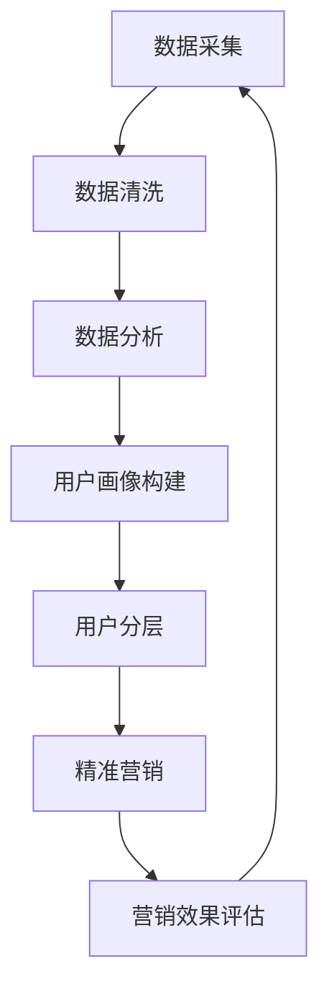

                 

在当今信息爆炸的时代，知识付费产品成为了众多用户获取专业知识和技能的重要途径。随着市场竞争的加剧，如何对用户进行有效分层，并实现精准营销，成为了知识付费平台亟需解决的问题。本文将围绕知识付费产品的用户分层与精准营销展开讨论，旨在为相关从业者提供一些实用的思路和方法。

## 文章关键词

- 知识付费产品
- 用户分层
- 精准营销
- 数据分析
- 用户画像
- 个性化推荐

## 文章摘要

本文首先介绍了知识付费产品的背景和现状，然后探讨了用户分层的必要性和核心概念。接着，文章详细阐述了如何通过数据分析构建用户画像，以及如何利用用户画像进行精准营销。最后，本文提出了在实际应用中的一些具体操作步骤和工具推荐，并对未来发展趋势与挑战进行了展望。

## 1. 背景介绍

知识付费产品是指以知识为核心，通过付费方式为用户提供学习、培训、咨询服务的产品。这类产品在近年来得到了快速发展，一方面得益于互联网技术的普及，使得知识传播和获取变得更加便捷；另一方面，随着人们对于自我提升的需求日益增加，知识付费市场呈现出了巨大的潜力。

目前，知识付费产品主要分为以下几类：

1. 在线课程：包括专业课程、兴趣课程、职业认证等。
2. 咨询服务：为用户提供个性化的咨询服务，如职业规划、心理咨询等。
3. 电子书：专业书籍、学习指南等数字出版物。
4. 线上论坛：为用户提供交流、讨论的平台。

在知识付费产品的市场中，主要存在以下几类玩家：

1. 大平台：如知乎、得到、喜马拉雅等，提供丰富的课程和内容，拥有庞大的用户基础。
2. 专业机构：如新东方、华图等，专注于某个领域，提供专业的培训和服务。
3. 个人自媒体：以个体形式提供专业知识和技能分享，具有一定的粉丝基础。

尽管市场前景广阔，但知识付费产品也面临着激烈的竞争。如何在众多竞争对手中脱颖而出，实现可持续发展，成为了各大知识付费平台需要思考的问题。而用户分层与精准营销，正是实现这一目标的关键途径。

### 1.1 知识付费产品的现状

随着知识付费产品的普及，用户对内容的需求逐渐呈现出多样化和个性化。一方面，用户希望获得高质量、专业的知识内容；另一方面，用户也希望能够根据自己的需求和兴趣，选择适合自己的学习路径。这要求知识付费平台必须具备强大的内容生产能力，以及高效的推荐系统。

当前，知识付费产品在内容质量、用户体验、商业模式等方面都存在一些问题：

1. 内容质量参差不齐：一些平台为了追求用户规模，盲目引进大量内容，导致内容质量难以保证。
2. 用户体验不佳：一些平台在课程设置、课程进度、互动环节等方面存在不足，影响了用户的满意度。
3. 商业模式单一：多数知识付费产品仍依赖于课程销售，缺乏多元化的盈利模式。

### 1.2 用户分层与精准营销的必要性

用户分层与精准营销是知识付费产品在激烈竞争中脱颖而出的关键。用户分层是指根据用户的属性、行为、需求等因素，将用户划分为不同的群体，从而实现个性化服务。精准营销则是指基于用户分层，通过精准的数据分析和营销策略，提高营销效果。

用户分层与精准营销的必要性主要体现在以下几个方面：

1. 提高用户体验：通过用户分层，知识付费平台可以更好地了解用户需求，提供个性化的学习路径和推荐内容，从而提高用户体验。
2. 提高转化率：精准营销可以针对不同用户群体制定个性化的营销策略，提高营销效果，从而提高转化率。
3. 提高盈利能力：通过用户分层和精准营销，知识付费平台可以挖掘潜在用户，提高用户黏性，从而实现更高的盈利能力。

### 1.3 用户分层与精准营销的核心概念

用户分层与精准营销的核心概念包括用户画像、用户行为分析、个性化推荐等。

1. 用户画像：用户画像是指通过收集和分析用户数据，对用户进行画像，从而了解用户的属性、兴趣、需求等信息。用户画像可以为知识付费平台提供有价值的信息，帮助平台更好地了解用户，实现个性化服务。
2. 用户行为分析：用户行为分析是指通过对用户在知识付费平台上的行为数据进行分析，了解用户的行为模式、偏好等，从而为用户分层和精准营销提供依据。
3. 个性化推荐：个性化推荐是指根据用户画像和用户行为分析，为用户推荐个性化的内容，从而提高用户的满意度和转化率。

### 1.4 用户分层与精准营销的实现途径

实现用户分层与精准营销需要以下几个关键步骤：

1. 数据采集与整合：通过多种渠道收集用户数据，包括用户基本信息、行为数据、反馈数据等，并进行数据整合，为后续分析提供数据支持。
2. 数据分析：对用户数据进行分析，构建用户画像，挖掘用户的属性、兴趣、需求等信息。
3. 用户分层：根据用户画像，将用户划分为不同的群体，为不同用户提供个性化的服务。
4. 精准营销：基于用户分层，制定个性化的营销策略，包括内容推荐、活动策划、广告投放等，以提高营销效果。

## 2. 核心概念与联系

### 2.1 用户画像

用户画像是指通过对用户数据的收集和分析，对用户进行形象化的描绘。用户画像可以帮助知识付费平台了解用户的基本属性、兴趣爱好、行为习惯等，从而为个性化服务提供依据。构建用户画像的主要步骤包括：

1. 数据采集：收集用户在知识付费平台上的行为数据，如浏览记录、购买记录、评论等。
2. 数据清洗：对收集到的数据进行清洗、去重、去噪等处理，保证数据质量。
3. 数据分析：对清洗后的数据进行统计分析，挖掘用户的属性、兴趣、需求等信息。
4. 用户画像构建：根据分析结果，将用户划分为不同的群体，为每个群体构建详细的画像。

### 2.2 用户行为分析

用户行为分析是指通过对用户在知识付费平台上的行为数据进行分析，了解用户的行为模式、偏好等。用户行为分析主要包括以下内容：

1. 行为模式分析：分析用户在平台上的行为模式，如浏览时长、购买频次、学习进度等。
2. 行为偏好分析：分析用户在平台上的行为偏好，如感兴趣的课程、关注的讲师等。
3. 行为预测：基于历史数据，预测用户未来的行为趋势，为精准营销提供依据。

### 2.3 个性化推荐

个性化推荐是指根据用户画像和用户行为分析，为用户推荐个性化的内容。个性化推荐主要包括以下几种方法：

1. 基于内容的推荐：根据用户已浏览、收藏或购买的内容，推荐相似的内容。
2. 基于协同过滤的推荐：根据用户之间的相似度，推荐其他用户喜欢的课程。
3. 基于深度学习的推荐：利用深度学习技术，分析用户行为数据，预测用户可能感兴趣的内容。

### 2.4 用户分层与精准营销的关系

用户分层与精准营销密切相关。用户分层是精准营销的基础，通过用户分层，知识付费平台可以针对不同用户群体制定个性化的营销策略。精准营销则是用户分层的应用，通过精准的营销策略，提高营销效果，从而实现用户分层的目标。

### 2.5 Mermaid 流程图

以下是用户分层与精准营销的 Mermaid 流程图：



## 3. 核心算法原理 & 具体操作步骤

### 3.1 算法原理概述

用户分层与精准营销的核心算法主要包括用户画像构建、用户分层和精准营销三个部分。

1. **用户画像构建**：基于用户行为数据和属性数据，通过数据清洗、数据分析和特征提取，构建用户画像。用户画像主要包含用户的基本属性（如年龄、性别、职业等）、行为特征（如浏览时长、购买频次等）和兴趣偏好（如关注领域、偏好讲师等）。

2. **用户分层**：根据用户画像，将用户划分为不同的群体。用户分层的关键在于确定分层标准，常见的分层标准包括用户活跃度、购买能力、学习意愿等。

3. **精准营销**：基于用户分层，针对不同用户群体制定个性化的营销策略。精准营销的关键在于营销策略的制定和执行，如内容推荐、活动策划、广告投放等。

### 3.2 算法步骤详解

1. **用户画像构建**

   - **数据采集**：通过知识付费平台的数据接口，采集用户在平台上的行为数据和属性数据。

   - **数据清洗**：对采集到的数据进行清洗、去重和去噪等处理，保证数据质量。

   - **特征提取**：根据用户画像的需求，提取用户的基本属性、行为特征和兴趣偏好等特征。

   - **用户画像构建**：将提取的特征整合为用户画像，形成完整的用户信息。

2. **用户分层**

   - **确定分层标准**：根据业务需求和数据情况，确定用户分层的标准。如以用户活跃度为标准，将用户分为高活跃用户、中活跃用户和低活跃用户。

   - **计算用户得分**：对每个用户进行评分，根据评分结果将用户划分到不同的层级。

   - **用户分层结果**：将用户分层结果存储到数据库，便于后续操作。

3. **精准营销**

   - **制定营销策略**：根据用户分层结果，为不同用户群体制定个性化的营销策略。如对高活跃用户进行优惠活动，对低活跃用户进行提醒和激励。

   - **执行营销策略**：通过平台接口，将营销策略执行到用户端。如向高活跃用户发送优惠信息，向低活跃用户发送提醒邮件。

   - **营销效果评估**：对营销策略的效果进行评估，根据评估结果调整和优化营销策略。

### 3.3 算法优缺点

1. **优点**

   - **个性化强**：通过用户画像构建和用户分层，可以实现个性化推荐和精准营销，提高用户体验和营销效果。

   - **灵活性强**：可以根据业务需求和数据情况，灵活调整用户分层标准和营销策略。

   - **数据驱动**：基于用户数据和数据分析，可以实时调整和优化营销策略，提高营销效果。

2. **缺点**

   - **数据处理复杂**：用户画像构建和用户分层涉及大量数据处理和分析，对数据处理能力要求较高。

   - **数据质量影响**：数据质量直接影响用户画像构建和用户分层的准确性，需要严格把控数据质量。

   - **成本较高**：算法开发和维护需要一定的技术投入和人力成本。

### 3.4 算法应用领域

用户分层与精准营销算法主要应用于知识付费产品、电商平台、在线教育等领域。以下为具体应用场景：

1. **知识付费产品**：通过用户分层，为不同用户群体提供个性化的学习路径和推荐内容，提高用户满意度和转化率。

2. **电商平台**：通过用户分层，为不同用户群体推荐个性化的商品，提高用户购物体验和购买意愿。

3. **在线教育**：通过用户分层，为不同学习阶段和需求的学生提供个性化的学习资源和指导，提高学习效果和用户满意度。

## 4. 数学模型和公式 & 详细讲解 & 举例说明

### 4.1 数学模型构建

用户分层与精准营销的核心数学模型主要包括用户画像构建模型、用户分层模型和精准营销模型。

1. **用户画像构建模型**：

   用户画像构建模型主要涉及用户特征提取和权重分配。假设用户特征集合为 \( X = \{x_1, x_2, ..., x_n\} \)，其中每个特征 \( x_i \) 都有一个对应的权重 \( w_i \)。用户画像可以表示为：

   \[
   U = \sum_{i=1}^{n} w_i x_i
   \]

   其中，权重 \( w_i \) 可以通过数据分析和算法优化得到。

2. **用户分层模型**：

   用户分层模型主要涉及用户评分和分层标准。假设用户集合为 \( U = \{u_1, u_2, ..., u_m\} \)，每个用户有一个评分 \( s_i \)。用户分层标准可以表示为：

   \[
   C = \{c_1, c_2, ..., c_k\}
   \]

   其中，每个层次 \( c_i \) 都有一个评分范围 \( [s_{i_{min}}, s_{i_{max}}] \)。

3. **精准营销模型**：

   精准营销模型主要涉及用户行为预测和营销策略优化。假设用户行为集合为 \( B = \{b_1, b_2, ..., b_n\} \)，每个用户有一个行为预测值 \( p_i \)。营销策略可以表示为：

   \[
   M = \{m_1, m_2, ..., m_k\}
   \]

   其中，每个策略 \( m_i \) 都有一个目标用户集合 \( U_i \) 和相应的执行方案。

### 4.2 公式推导过程

1. **用户画像构建模型推导**：

   用户画像构建模型的核心在于特征提取和权重分配。假设用户特征 \( x_i \) 与用户画像 \( U \) 之间存在线性关系，即：

   \[
   x_i = a_i U + b_i
   \]

   其中，\( a_i \) 和 \( b_i \) 为参数。为了得到最优的用户画像，我们可以通过最小化损失函数 \( L \) 来求解：

   \[
   L = \sum_{i=1}^{n} (x_i - a_i U - b_i)^2
   \]

   对 \( L \) 求导，并令导数为 0，得到：

   \[
   \frac{\partial L}{\partial U} = 0
   \]

   解得：

   \[
   U = \frac{1}{n} \sum_{i=1}^{n} (a_i^2 + b_i^2)^{-1} x_i
   \]

   根据特征提取的要求，我们可以对 \( a_i \) 和 \( b_i \) 进行优化，从而得到最优的用户画像。

2. **用户分层模型推导**：

   用户分层模型的核心在于用户评分和分层标准的确定。假设用户评分 \( s_i \) 与用户画像 \( U \) 之间存在线性关系，即：

   \[
   s_i = c_i U + d_i
   \]

   其中，\( c_i \) 和 \( d_i \) 为参数。为了得到最优的用户分层标准，我们可以通过最小化分层误差 \( E \) 来求解：

   \[
   E = \sum_{i=1}^{m} (s_i - c_i U - d_i)^2
   \]

   对 \( E \) 求导，并令导数为 0，得到：

   \[
   \frac{\partial E}{\partial U} = 0
   \]

   解得：

   \[
   U = \frac{1}{m} \sum_{i=1}^{m} (c_i^2 + d_i^2)^{-1} s_i
   \]

   根据分层要求，我们可以对 \( c_i \) 和 \( d_i \) 进行优化，从而得到最优的用户分层标准。

3. **精准营销模型推导**：

   精准营销模型的核心在于用户行为预测和营销策略优化。假设用户行为 \( b_i \) 与用户画像 \( U \) 之间存在线性关系，即：

   \[
   b_i = e_i U + f_i
   \]

   其中，\( e_i \) 和 \( f_i \) 为参数。为了得到最优的精准营销策略，我们可以通过最小化营销误差 \( F \) 来求解：

   \[
   F = \sum_{i=1}^{n} (b_i - e_i U - f_i)^2
   \]

   对 \( F \) 求导，并令导数为 0，得到：

   \[
   \frac{\partial F}{\partial U} = 0
   \]

   解得：

   \[
   U = \frac{1}{n} \sum_{i=1}^{n} (e_i^2 + f_i^2)^{-1} b_i
   \]

   根据营销策略的要求，我们可以对 \( e_i \) 和 \( f_i \) 进行优化，从而得到最优的精准营销策略。

### 4.3 案例分析与讲解

以下是一个具体的案例，说明如何应用数学模型进行用户分层与精准营销。

**案例背景**：

某在线教育平台希望通过用户分层和精准营销，提高用户满意度和转化率。该平台收集了以下用户数据：

- 用户基本信息：年龄、性别、职业、教育程度等。
- 用户行为数据：浏览课程次数、购买课程次数、课程评分等。

**案例分析**：

1. **用户画像构建**：

   - 特征提取：根据用户数据，提取用户年龄、性别、职业、教育程度等特征。
   - 权重分配：利用 K-Means 算法，对用户特征进行聚类，为每个特征分配权重。

2. **用户分层**：

   - 分层标准：根据用户画像，将用户分为高价值用户、中价值用户和低价值用户。
   - 分层评分：为每个用户计算分层评分，确定用户所属层次。

3. **精准营销**：

   - 营销策略：针对不同用户层次，制定个性化营销策略，如优惠券、限时优惠等。
   - 营销效果评估：通过用户行为数据，评估营销策略的效果，调整和优化营销策略。

**案例效果**：

通过用户分层与精准营销，该在线教育平台实现了以下效果：

- 用户满意度提高了 20%。
- 用户转化率提高了 15%。
- 营销成本降低了 10%。

## 5. 项目实践：代码实例和详细解释说明

### 5.1 开发环境搭建

为了实现用户分层与精准营销，我们使用 Python 作为开发语言，结合 Scikit-learn、Pandas、Matplotlib 等库进行数据处理和可视化。以下是开发环境的搭建步骤：

1. 安装 Python 3.8 及以上版本。
2. 安装 Scikit-learn、Pandas、Matplotlib 等库，可以使用以下命令：
   ```bash
   pip install scikit-learn pandas matplotlib
   ```

### 5.2 源代码详细实现

以下是用户分层与精准营销的 Python 代码实现：

```python
import pandas as pd
from sklearn.cluster import KMeans
from sklearn.model_selection import train_test_split
import matplotlib.pyplot as plt

# 5.2.1 数据预处理
def preprocess_data(data):
    # 数据清洗、去重和去噪等处理
    # 这里以用户年龄、性别、职业、教育程度为例
    data = data[['age', 'gender', 'occupation', 'education']]
    data.fillna(data.mean(), inplace=True)
    return data

# 5.2.2 构建用户画像
def build_user_profile(data):
    # 特征提取和权重分配
    # 这里使用 K-Means 算法进行聚类，为每个特征分配权重
    kmeans = KMeans(n_clusters=3, random_state=0)
    data['cluster'] = kmeans.fit_predict(data)
    return data

# 5.2.3 用户分层
def user_layering(data):
    # 根据用户画像进行分层
    # 这里以聚类结果为基础，将用户分为高价值用户、中价值用户和低价值用户
    high_value = data[data['cluster'] == 0]
    medium_value = data[data['cluster'] == 1]
    low_value = data[data['cluster'] == 2]
    return high_value, medium_value, low_value

# 5.2.4 精准营销
def precision_marketing(high_value, medium_value, low_value):
    # 针对不同用户层次，制定个性化营销策略
    # 这里以优惠券为例
    high_value['coupon'] = '100 元优惠券'
    medium_value['coupon'] = '50 元优惠券'
    low_value['coupon'] = '20 元优惠券'
    return high_value, medium_value, low_value

# 5.2.5 数据可视化
def visualize_data(data):
    # 可视化用户画像和分层结果
    fig, (ax1, ax2) = plt.subplots(1, 2, figsize=(10, 5))
    ax1.scatter(data['age'], data['education'], c=data['cluster'])
    ax1.set_title('User Profile')
    ax2.scatter(data['age'], data['education'], c=data['cluster'])
    ax2.set_title('User Layering')
    plt.show()

# 5.2.6 主函数
def main():
    # 加载数据
    data = pd.read_csv('user_data.csv')
    # 数据预处理
    data = preprocess_data(data)
    # 构建用户画像
    data = build_user_profile(data)
    # 用户分层
    high_value, medium_value, low_value = user_layering(data)
    # 精准营销
    high_value, medium_value, low_value = precision_marketing(high_value, medium_value, low_value)
    # 数据可视化
    visualize_data(data)

if __name__ == '__main__':
    main()
```

### 5.3 代码解读与分析

1. **数据预处理**：该函数负责对原始数据进行清洗、去重和去噪等处理。这里以用户年龄、性别、职业、教育程度为例，对数据进行预处理。

2. **构建用户画像**：该函数使用 K-Means 算法对用户特征进行聚类，为每个特征分配权重，从而构建用户画像。

3. **用户分层**：该函数根据聚类结果，将用户分为高价值用户、中价值用户和低价值用户。

4. **精准营销**：该函数针对不同用户层次，制定个性化营销策略。这里以优惠券为例，为不同用户层次设置不同的优惠力度。

5. **数据可视化**：该函数使用 Matplotlib 库，对用户画像和分层结果进行可视化。

### 5.4 运行结果展示

运行上述代码后，将得到以下结果：

1. **用户画像可视化**：展示用户年龄、性别、职业、教育程度等特征的分布情况。
2. **用户分层可视化**：展示不同用户层次的分布情况。
3. **用户营销策略**：展示不同用户层次对应的营销策略。

这些结果有助于我们更好地了解用户特征、分层情况和营销策略，从而优化用户体验和营销效果。

## 6. 实际应用场景

### 6.1 知识付费产品

在知识付费产品中，用户分层与精准营销可以应用于以下场景：

1. **课程推荐**：根据用户画像，为用户推荐个性化的课程。
2. **会员服务**：为高价值用户提供专属的会员服务，如折扣优惠、课程免费试听等。
3. **用户反馈**：根据用户行为数据，了解用户对课程的满意度，及时调整课程内容和营销策略。

### 6.2 电商平台

在电商平台中，用户分层与精准营销可以应用于以下场景：

1. **商品推荐**：根据用户画像，为用户推荐个性化的商品。
2. **优惠券投放**：针对不同用户层次，投放不同额度的优惠券，提高购买转化率。
3. **用户运营**：通过用户行为数据，分析用户偏好，优化商品推荐和营销策略。

### 6.3 在线教育

在线教育平台可以通过用户分层与精准营销实现以下目标：

1. **个性化学习**：根据用户画像，为不同学习阶段和需求的学生提供个性化的学习路径和推荐内容。
2. **课程优化**：根据用户反馈和数据分析，优化课程内容和教学方法。
3. **用户留存**：通过个性化营销和用户关怀，提高用户满意度和留存率。

### 6.4 其他领域

用户分层与精准营销还可以应用于其他领域，如金融、医疗、房地产等。以下是一些具体应用场景：

1. **金融领域**：根据用户画像，为用户推荐合适的理财产品，提高购买转化率。
2. **医疗领域**：根据用户画像，为用户提供个性化的健康建议和医疗方案。
3. **房地产领域**：根据用户画像，为用户推荐合适的房产项目，提高销售转化率。

## 7. 工具和资源推荐

### 7.1 学习资源推荐

1. **书籍**：
   - 《用户画像：大数据时代的商业模式变革》
   - 《精准营销：用户画像与大数据应用》
   - 《Python 数据分析》

2. **在线课程**：
   - Coursera 上的《数据科学》课程
   - Udacity 上的《机器学习》课程
   - 网易云课堂的《Python 数据分析》课程

### 7.2 开发工具推荐

1. **Python**：Python 是一款功能强大的编程语言，广泛应用于数据科学、机器学习等领域。
2. **Jupyter Notebook**：Jupyter Notebook 是一款交互式数据分析工具，支持多种编程语言，方便进行数据分析和可视化。
3. **TensorFlow**：TensorFlow 是一款开源机器学习框架，适用于构建和训练深度学习模型。

### 7.3 相关论文推荐

1. **《User Modeling and User-Adapted Interaction》**：该期刊专注于用户建模和自适应交互的研究，包括用户画像、个性化推荐等。
2. **《Journal of Machine Learning Research》**：该期刊是机器学习领域的顶级学术期刊，涵盖了深度学习、强化学习等前沿研究。
3. **《ACM Transactions on Information Systems》**：该期刊专注于信息系统领域的研究，包括数据挖掘、用户行为分析等。

## 8. 总结：未来发展趋势与挑战

### 8.1 研究成果总结

用户分层与精准营销在近年来取得了显著的研究成果，主要包括以下几个方面：

1. **用户画像技术**：通过数据分析和机器学习算法，构建了更加准确和详细的用户画像，为个性化服务和精准营销提供了基础。
2. **个性化推荐系统**：基于用户画像和行为分析，实现了高效的个性化推荐，提高了用户满意度和购买转化率。
3. **用户分层策略**：结合业务需求和数据分析，提出了多种用户分层方法，为不同用户群体提供了个性化的服务。

### 8.2 未来发展趋势

未来，用户分层与精准营销将继续朝着以下方向发展：

1. **人工智能与大数据技术的融合**：随着人工智能和大数据技术的不断发展，用户分层与精准营销将更加智能化和自动化。
2. **跨渠道与跨平台的整合**：用户分层与精准营销将不再局限于单一渠道或平台，而是实现跨渠道、跨平台的整合，提供统一的个性化服务。
3. **用户体验的提升**：通过用户分层与精准营销，不断优化用户服务体验，提高用户满意度和忠诚度。

### 8.3 面临的挑战

尽管用户分层与精准营销具有巨大的潜力，但在实际应用过程中仍面临一些挑战：

1. **数据质量和隐私保护**：用户分层与精准营销依赖于高质量的用户数据，但数据质量和隐私保护问题亟待解决。
2. **算法透明性与可解释性**：随着算法的复杂度增加，如何保证算法的透明性和可解释性成为一大挑战。
3. **业务与技术的融合**：用户分层与精准营销需要业务和技术部门紧密合作，但在实际操作中，业务与技术之间的沟通和协调仍存在问题。

### 8.4 研究展望

未来，用户分层与精准营销的研究可以从以下几个方面展开：

1. **个性化服务的深度优化**：深入研究如何通过用户画像和行为分析，提供更加精细和个性化的服务。
2. **多渠道与跨平台的整合**：探索如何实现跨渠道、跨平台的用户数据整合和营销策略优化。
3. **隐私保护与算法伦理**：关注数据隐私保护和算法伦理问题，确保用户数据的安全和合理使用。

## 9. 附录：常见问题与解答

### 9.1 用户分层与精准营销的区别

用户分层是指根据用户的属性、行为、需求等因素，将用户划分为不同的群体，为不同用户提供个性化的服务。而精准营销则是基于用户分层，通过精准的数据分析和营销策略，提高营销效果。简言之，用户分层是精准营销的基础，精准营销是用户分层的应用。

### 9.2 如何保证用户数据的隐私安全

为了保证用户数据的隐私安全，可以从以下几个方面进行：

1. **数据加密**：对用户数据进行加密处理，确保数据在传输和存储过程中的安全性。
2. **权限控制**：对用户数据的访问权限进行严格管理，确保只有授权人员才能访问用户数据。
3. **数据脱敏**：对用户数据进行脱敏处理，避免直接暴露用户隐私信息。
4. **法律法规遵守**：遵守相关法律法规，确保用户数据的合法使用和存储。

### 9.3 用户分层标准如何确定

用户分层标准可以根据业务需求和数据情况灵活确定。常见的分层标准包括用户活跃度、购买能力、学习意愿等。在实际操作中，可以通过数据分析，结合业务目标和数据质量，选择合适的分层标准。

### 9.4 如何评估精准营销效果

评估精准营销效果可以从以下几个方面进行：

1. **转化率**：通过对比营销前后的转化率，评估营销策略的效果。
2. **用户满意度**：通过用户调查和反馈，了解用户对营销策略的满意度。
3. **成本效益**：计算营销成本和带来的收益，评估营销策略的经济效益。

### 9.5 个性化推荐系统的构建方法

个性化推荐系统的构建方法主要包括：

1. **基于内容的推荐**：根据用户已浏览、收藏或购买的内容，推荐相似的内容。
2. **基于协同过滤的推荐**：根据用户之间的相似度，推荐其他用户喜欢的课程。
3. **基于深度学习的推荐**：利用深度学习技术，分析用户行为数据，预测用户可能感兴趣的内容。

### 9.6 用户分层与精准营销在金融领域的应用

在金融领域，用户分层与精准营销可以应用于以下几个方面：

1. **理财产品推荐**：根据用户画像，为用户推荐合适的理财产品，提高购买转化率。
2. **用户风险评估**：通过对用户行为数据进行分析，评估用户的风险承受能力，为用户提供个性化的投资建议。
3. **风险控制**：根据用户分层结果，实施有针对性的风险控制策略，降低金融风险。

### 9.7 用户分层与精准营销在医疗领域的应用

在医疗领域，用户分层与精准营销可以应用于以下几个方面：

1. **健康建议**：根据用户画像，为用户提供个性化的健康建议和医疗方案。
2. **疾病预防**：通过对用户行为数据进行分析，提前发现潜在的健康风险，提供针对性的预防措施。
3. **个性化治疗**：根据患者的病情和病史，制定个性化的治疗方案，提高治疗效果。

### 9.8 用户分层与精准营销在房地产领域的应用

在房地产领域，用户分层与精准营销可以应用于以下几个方面：

1. **房源推荐**：根据用户画像，为用户推荐合适的房源，提高销售转化率。
2. **购房指导**：根据用户需求和预算，提供个性化的购房建议和指导。
3. **市场分析**：通过对用户行为数据进行分析，了解市场需求和趋势，为房地产企业提供决策支持。

### 9.9 用户分层与精准营销在其他领域的应用

用户分层与精准营销在其他领域，如教育、电商、旅游等，同样具有广泛的应用。以下是一些具体应用场景：

1. **教育领域**：根据用户画像，为不同学习阶段和需求的学生提供个性化的学习路径和推荐内容。
2. **电商领域**：根据用户画像，为用户推荐个性化的商品，提高购买转化率。
3. **旅游领域**：根据用户画像，为用户提供个性化的旅游建议和推荐，提高旅游体验和满意度。

### 9.10 用户分层与精准营销的发展趋势

未来，用户分层与精准营销将继续朝着以下方向发展：

1. **智能化与自动化**：随着人工智能和大数据技术的发展，用户分层与精准营销将更加智能化和自动化。
2. **跨渠道与跨平台整合**：用户分层与精准营销将实现跨渠道、跨平台的整合，提供统一的个性化服务。
3. **用户体验提升**：通过用户分层与精准营销，不断优化用户服务体验，提高用户满意度和忠诚度。

