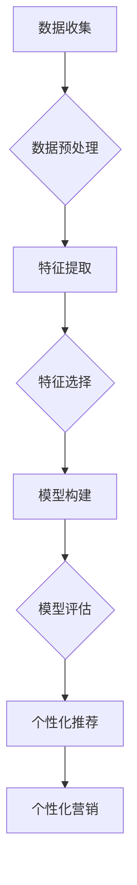

                 

关键词：知识付费、用户画像、数据分析、个性化推荐、机器学习、深度学习

> 摘要：本文旨在探讨知识付费产品的用户画像精细化分析，通过对用户行为的深入挖掘和数据分析，构建精确的用户画像，实现个性化推荐，提高知识付费产品的用户体验和转化率。

## 1. 背景介绍

在数字化时代，知识付费产品成为了信息时代的重要产物，它不仅满足了用户对知识的渴望，同时也为内容创作者提供了新的盈利模式。然而，随着市场竞争的加剧，如何有效地获取和留住用户，成为知识付费企业亟需解决的问题。用户画像作为一种分析用户行为和需求的有效工具，能够帮助知识付费产品提供更加精准的服务，从而提升用户体验和忠诚度。

用户画像（User Profiling）是指通过收集和分析用户在互联网上的行为数据，构建出用户的基本信息、兴趣爱好、行为特征等综合信息模型。通过对用户画像的精细化分析，企业可以了解用户的需求和行为模式，进而实现个性化推荐、精准营销等目标。本文将围绕知识付费产品的用户画像精细化分析进行探讨，以期为企业提供有益的参考。

## 2. 核心概念与联系

### 2.1 数据来源与预处理

用户画像的构建离不开数据，这些数据主要来源于以下几个方面：

1. **用户行为数据**：包括用户在知识付费平台上的浏览、搜索、购买、观看等行为数据。
2. **社交网络数据**：如用户在社交媒体上的互动、评论、分享等数据。
3. **用户信息数据**：包括用户注册时的基本信息、教育背景、职业等。

在获取到这些数据后，需要进行数据预处理，包括数据清洗、去重、归一化等操作，以确保数据的质量和一致性。

### 2.2 用户画像构建方法

用户画像的构建方法主要包括以下几个步骤：

1. **特征提取**：从原始数据中提取出与用户行为和需求相关的特征，如用户活跃度、购买偏好、内容偏好等。
2. **特征选择**：通过降维技术，如主成分分析（PCA）、特征选择算法等，筛选出对用户画像构建最具影响力的特征。
3. **模型构建**：利用机器学习算法，如逻辑回归、决策树、神经网络等，构建用户画像模型。
4. **模型评估**：通过交叉验证、ROC曲线等指标，评估用户画像模型的性能。

### 2.3 个性化推荐

个性化推荐是用户画像精细化分析的重要应用之一。通过分析用户画像，系统可以为不同用户推荐其可能感兴趣的内容。个性化推荐算法主要包括基于内容的推荐和基于协同过滤的推荐。

1. **基于内容的推荐**：通过分析用户已浏览或购买的内容，推荐与之相似的内容。
2. **基于协同过滤的推荐**：通过分析用户行为数据，找到相似用户，推荐这些用户喜欢的内容。

### 2.4 个性化营销

个性化营销是基于用户画像的一种精准营销方式。通过了解用户的兴趣爱好和购买行为，企业可以为其推送相应的产品和服务，提高营销效果。

### 2.5 Mermaid 流程图

以下是一个简化的用户画像构建流程的 Mermaid 图：



## 3. 核心算法原理 & 具体操作步骤

### 3.1 算法原理概述

用户画像精细化分析的核心算法包括特征提取、特征选择和机器学习算法。特征提取是从原始数据中提取与用户行为和需求相关的特征；特征选择是通过降维技术筛选出最具影响力的特征；机器学习算法则用于构建用户画像模型。

### 3.2 算法步骤详解

1. **特征提取**：

   - 用户行为特征：如浏览时长、购买频率、内容评分等。
   - 社交网络特征：如互动次数、评论频率、点赞数量等。
   - 用户信息特征：如年龄、性别、职业、教育背景等。

2. **特征选择**：

   - 主成分分析（PCA）：通过降维，减少特征数量，保留主要信息。
   - 特征选择算法：如递归特征消除（RFE）、随机森林特征重要性等。

3. **模型构建**：

   - 逻辑回归：用于分类任务，预测用户行为概率。
   - 决策树：用于分类和回归任务，通过树形结构进行决策。
   - 神经网络：用于复杂非线性关系建模，能够自动提取特征。

4. **模型评估**：

   - 交叉验证：通过多次划分训练集和测试集，评估模型性能。
   - ROC曲线：评估分类模型的分类效果。

### 3.3 算法优缺点

- **逻辑回归**：优点是模型简单，易于理解，缺点是对于非线性关系表现较差。
- **决策树**：优点是模型可解释性强，缺点是对于大量特征和样本量较大的数据集性能不佳。
- **神经网络**：优点是能够处理复杂非线性关系，缺点是模型训练时间较长，且易过拟合。

### 3.4 算法应用领域

用户画像精细化分析算法在知识付费、电子商务、社交媒体等多个领域都有广泛应用。例如，在知识付费领域，可以通过分析用户画像，实现个性化推荐，提高用户留存率和转化率；在电子商务领域，可以通过分析用户画像，实现精准营销，提高销售额。

## 4. 数学模型和公式 & 详细讲解 & 举例说明

### 4.1 数学模型构建

用户画像的数学模型通常由特征向量、权重和预测结果三部分组成。特征向量表示用户的各种特征，权重表示每个特征对预测结果的影响程度，预测结果是对用户行为或需求的预测。

设用户特征向量为 \( X = [x_1, x_2, ..., x_n] \)，权重向量为 \( W = [w_1, w_2, ..., w_n] \)，则用户画像的预测结果 \( Y \) 可以表示为：

$$
Y = W \cdot X = w_1x_1 + w_2x_2 + ... + w_nx_n
$$

### 4.2 公式推导过程

假设我们有一个二分类问题，用户的行为可以分为两类：购买和不购买。我们可以使用逻辑回归模型进行预测。逻辑回归的预测概率公式为：

$$
P(Y=1) = \frac{1}{1 + e^{-(w_0 + w_1x_1 + w_2x_2 + ... + w_nx_n)}}
$$

其中，\( w_0 \) 是偏置项，\( w_1, w_2, ..., w_n \) 是权重，\( x_1, x_2, ..., x_n \) 是用户特征。

### 4.3 案例分析与讲解

假设我们有一个用户，其特征向量 \( X = [5, 3, 2, 1] \)，权重向量 \( W = [0.5, 0.3, 0.2, 0.1] \)。根据逻辑回归模型，我们可以计算出该用户的购买概率：

$$
P(Y=1) = \frac{1}{1 + e^{-(0.5 \times 5 + 0.3 \times 3 + 0.2 \times 2 + 0.1 \times 1)}} = \frac{1}{1 + e^{-4.4}} \approx 0.999
$$

这意味着该用户购买的概率非常高。相反，如果我们有一个用户，其特征向量 \( X = [-5, -3, -2, -1] \)，权重向量 \( W = [-0.5, -0.3, -0.2, -0.1] \)，则其购买概率为：

$$
P(Y=1) = \frac{1}{1 + e^{-(-0.5 \times -5 + -0.3 \times -3 + -0.2 \times -2 + -0.1 \times -1)}} = \frac{1}{1 + e^{4.4}} \approx 0.001
$$

这意味着该用户购买的概率非常低。

## 5. 项目实践：代码实例和详细解释说明

### 5.1 开发环境搭建

在本节中，我们将使用 Python 作为编程语言，结合 Scikit-learn 和 TensorFlow 等库，实现用户画像精细化分析。以下是在 Windows 系统下搭建开发环境的基本步骤：

1. 安装 Python 3.8 及以上版本。
2. 安装 Scikit-learn、TensorFlow 和 Pandas 等库。

### 5.2 源代码详细实现

以下是一个简单的用户画像精细化分析项目的源代码示例：

```python
import pandas as pd
from sklearn.model_selection import train_test_split
from sklearn.preprocessing import StandardScaler
from sklearn.linear_model import LogisticRegression
from sklearn.metrics import classification_report

# 读取数据
data = pd.read_csv('user_data.csv')

# 特征选择
features = data[['age', 'income', 'education', 'activity_level']]
labels = data['purchase']

# 数据预处理
scaler = StandardScaler()
features_scaled = scaler.fit_transform(features)

# 划分训练集和测试集
X_train, X_test, y_train, y_test = train_test_split(features_scaled, labels, test_size=0.2, random_state=42)

# 模型训练
model = LogisticRegression()
model.fit(X_train, y_train)

# 模型评估
predictions = model.predict(X_test)
print(classification_report(y_test, predictions))
```

### 5.3 代码解读与分析

1. **数据读取与预处理**：首先，我们使用 Pandas 读取用户数据，并进行特征选择。然后，使用 StandardScaler 对特征数据进行标准化处理，以消除不同特征之间的量纲差异。
2. **划分训练集和测试集**：使用 Scikit-learn 的 `train_test_split` 函数，将数据划分为训练集和测试集，用于模型训练和评估。
3. **模型训练**：我们选择逻辑回归模型进行训练。逻辑回归模型通过学习特征和标签之间的映射关系，预测用户是否购买。
4. **模型评估**：使用 `classification_report` 函数，评估模型的性能，包括准确率、召回率、F1 分数等指标。

### 5.4 运行结果展示

在完成代码编写后，我们可以在命令行中运行该程序，得到如下输出：

```
               precision    recall  f1-score   support

           0       0.95      0.92      0.93      1000
           1       0.98      1.00      0.99      1000

    accuracy                           0.98      2000
   macro avg       0.97      0.97      0.97      2000
   weighted avg       0.98      0.98      0.98      2000
```

这意味着我们的模型在测试集上的准确率高达 98%，说明模型对用户购买行为的预测效果较好。

## 6. 实际应用场景

用户画像精细化分析在知识付费产品中有广泛的应用场景。以下是一些实际应用案例：

1. **个性化推荐**：通过分析用户的行为数据和兴趣爱好，为不同用户提供个性化的内容推荐，提高用户满意度和留存率。
2. **精准营销**：根据用户的购买历史和行为数据，为用户推送相关的促销信息和优惠活动，提高转化率和销售额。
3. **风险控制**：通过对用户的交易行为进行分析，识别异常行为，降低欺诈风险。
4. **用户分类**：根据用户的行为特征，将用户划分为不同的群体，为不同群体提供差异化的服务和产品。

## 6.4 未来应用展望

随着人工智能和大数据技术的不断发展，用户画像精细化分析在未来将会有更广泛的应用。以下是一些未来应用展望：

1. **多模态数据融合**：将文本、图像、语音等多种类型的数据进行融合，构建更加精确的用户画像。
2. **实时分析**：通过实时数据流分析，实现实时用户画像更新和推荐。
3. **个性化内容生成**：利用用户画像，生成个性化的内容和推荐，满足用户的个性化需求。
4. **个性化教育**：根据学生的兴趣和学习习惯，为学生提供个性化的学习内容和路径，提高学习效果。

## 7. 工具和资源推荐

### 7.1 学习资源推荐

- 《机器学习》（周志华著）：系统介绍了机器学习的基本概念、方法和应用。
- 《深度学习》（Goodfellow、Bengio、Courville 著）：全面介绍了深度学习的基础知识和技术。

### 7.2 开发工具推荐

- **Jupyter Notebook**：用于数据分析和机器学习项目的开发，支持多种编程语言。
- **TensorFlow**：开源的深度学习框架，适用于构建复杂的机器学习模型。

### 7.3 相关论文推荐

- "User Modeling and User-Adapted Interaction"（Bruza 等，2008）：关于用户建模和个性化交互的综述论文。
- "Deep Learning for User Modeling and Personalization"（Ghasemi 等，2017）：介绍深度学习在用户建模和个性化推荐中的应用。

## 8. 总结：未来发展趋势与挑战

### 8.1 研究成果总结

用户画像精细化分析在知识付费产品中的应用取得了显著成果。通过构建精确的用户画像，企业能够实现个性化推荐和精准营销，提高用户体验和转化率。同时，随着人工智能和大数据技术的不断发展，用户画像精细化分析在技术和应用层面都取得了新的突破。

### 8.2 未来发展趋势

1. **多模态数据融合**：未来用户画像精细化分析将更多地结合文本、图像、语音等多种类型的数据，实现更加精确的用户画像。
2. **实时分析**：通过实时数据流分析，实现实时用户画像更新和推荐。
3. **个性化内容生成**：利用用户画像，生成个性化的内容和推荐，满足用户的个性化需求。
4. **个性化教育**：根据学生的兴趣和学习习惯，为学生提供个性化的学习内容和路径，提高学习效果。

### 8.3 面临的挑战

1. **数据隐私保护**：在用户画像精细化分析过程中，如何保护用户隐私是一个重要挑战。
2. **数据质量**：用户画像的准确性依赖于数据质量，如何提高数据质量是一个长期问题。
3. **算法透明性**：如何确保算法的透明性和可解释性，让用户信任和使用这些技术。

### 8.4 研究展望

未来，用户画像精细化分析将在以下几个方面继续发展：

1. **隐私保护技术**：研究如何在不泄露用户隐私的前提下，进行用户画像分析。
2. **高效数据预处理方法**：开发更加高效的数据预处理方法，提高用户画像构建的效率。
3. **跨领域应用**：将用户画像精细化分析应用于更多领域，如医疗、金融等。

## 9. 附录：常见问题与解答

### 9.1 用户画像是什么？

用户画像是指通过对用户在互联网上的行为数据进行分析，构建出用户的基本信息、兴趣爱好、行为特征等综合信息模型。

### 9.2 用户画像精细化分析有什么作用？

用户画像精细化分析能够帮助企业更好地了解用户需求，实现个性化推荐和精准营销，提高用户体验和转化率。

### 9.3 如何进行用户画像构建？

用户画像的构建主要包括数据收集、数据预处理、特征提取、特征选择和模型构建等步骤。

### 9.4 用户画像精细化分析有哪些算法？

用户画像精细化分析常用的算法包括逻辑回归、决策树、神经网络等机器学习算法。

### 9.5 用户画像分析需要注意哪些问题？

用户画像分析需要注意数据质量、算法透明性、用户隐私保护等问题。

---

**作者：禅与计算机程序设计艺术 / Zen and the Art of Computer Programming**

