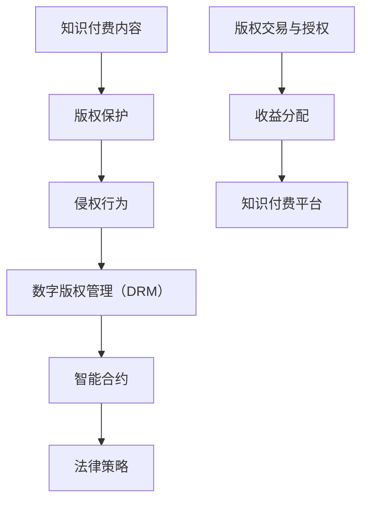
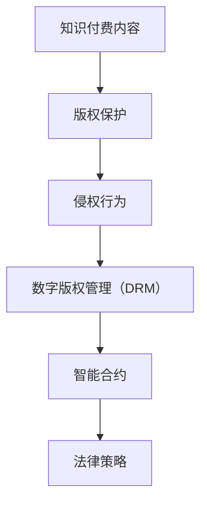
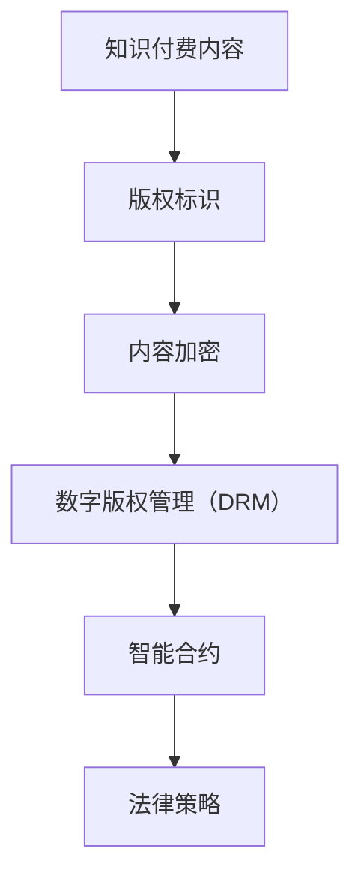

                 

 关键词：知识付费、版权保护、侵权应对、法律策略、技术手段、加密技术、数字版权管理（DRM）、智能合约

> 摘要：本文深入探讨了知识付费内容的版权保护现状及其面临的侵权问题，分析了当前法律策略和技术手段的优缺点，并提出了有效的侵权应对策略。通过对版权保护的关键概念、核心算法原理、数学模型、项目实践以及未来应用场景的详细讲解，本文旨在为知识付费行业的从业者提供实用的参考和指导。

## 1. 背景介绍

随着互联网的普及和信息技术的飞速发展，知识付费已经成为一种新兴的商业模式。知识付费平台如雨后春笋般涌现，包括在线课程、专业咨询、研究报告等多种形式。然而，版权保护问题也随之而来。未经授权的复制、传播和盗版行为给内容创作者和平台带来了巨大的经济损失，同时也损害了整个行业的健康发展。

版权保护是确保创作者权益的重要手段。在知识付费领域，版权保护不仅涉及内容本身的原创性和独特性，还包括对内容传播、使用和收益的控制。因此，如何有效地保护版权、防范侵权行为成为知识付费行业亟需解决的关键问题。

## 2. 核心概念与联系

### 2.1 知识付费内容的定义

知识付费内容是指通过支付一定费用获得的、具有较高价值和独特性的信息或知识产品。这些内容可以是原创文章、视频教程、在线课程、专业报告等。

### 2.2 版权保护的定义

版权保护是指对作品进行法律保护，确保创作者对其作品的控制权和收益权。版权保护涵盖了作品创作、传播、使用和收益的各个方面。

### 2.3 侵权行为的定义

侵权行为是指未经版权人许可，擅自使用、复制、传播、展示、执行或改编其作品的行为。

### 2.4 数字版权管理（DRM）

数字版权管理（DRM）是一种技术手段，用于限制数字内容的使用和复制，确保版权人的权益。DRM包括加密、认证、访问控制等技术手段。

### 2.5 智能合约

智能合约是一种运行在区块链上的程序，用于自动化执行合同条款。智能合约在知识付费领域的应用，可以确保版权交易和授权的透明性和不可篡改性。

### 2.6 Mermaid 流程图



## 3. 核心算法原理 & 具体操作步骤

### 3.1 算法原理概述

版权保护的算法原理主要包括版权标识、加密、认证和访问控制。这些算法共同作用，确保内容的安全性和版权人的权益。

- **版权标识**：通过嵌入版权信息，使内容具有唯一性和可追溯性。
- **加密**：使用加密算法，确保内容在传输和存储过程中不被篡改和非法访问。
- **认证**：通过数字签名，确保内容的真实性和版权归属。
- **访问控制**：根据用户权限，限制内容的访问和使用。

### 3.2 算法步骤详解

1. **版权标识**：
   - 生成版权标识符：使用哈希算法，对内容生成唯一的标识符。
   - 嵌入版权标识：将版权标识符嵌入内容中，确保内容与版权信息的一致性。

2. **加密**：
   - 内容加密：使用对称加密算法，对内容进行加密。
   - 密钥管理：使用非对称加密算法，确保密钥的安全存储和分发。

3. **认证**：
   - 生成签名：使用私钥，对内容生成数字签名。
   - 验证签名：使用公钥，验证内容的真实性和版权归属。

4. **访问控制**：
   - 用户认证：根据用户权限，认证用户身份。
   - 授权访问：根据用户权限，授权用户访问和使用内容。

### 3.3 算法优缺点

- **优点**：
  - 提高内容安全性：通过加密、认证和访问控制，确保内容不被非法访问和使用。
  - 保障版权人权益：确保版权人的作品得到充分保护，防止侵权行为。
- **缺点**：
  - 技术门槛较高：算法的实现和部署需要较高的技术能力。
  - 可能影响用户体验：加密和认证过程可能增加用户访问内容的延迟。

### 3.4 算法应用领域

- **知识付费平台**：用于保护在线课程、专业报告、原创文章等知识付费内容。
- **版权交易平台**：用于确保版权交易和授权的透明性和不可篡改性。
- **数字图书馆**：用于保护图书、期刊、学术论文等数字资源的版权。

## 4. 数学模型和公式 & 详细讲解 & 举例说明

### 4.1 数学模型构建

版权保护中的数学模型主要包括版权标识、加密和认证算法。以下是一个简化的数学模型：

$$
\text{版权标识} = Hash(\text{内容}) \oplus \text{版权信息}
$$

$$
\text{加密内容} = E_K(\text{内容})
$$

$$
\text{签名} = S_K(\text{内容})
$$

### 4.2 公式推导过程

1. **版权标识**：

   - 假设内容为 $C$，版权信息为 $I$。
   - 使用哈希算法 $Hash()$，生成内容的哈希值 $H(C)$。
   - 将版权信息 $I$ 与哈希值 $H(C)$ 进行异或运算，得到版权标识 $ID$。

2. **加密内容**：

   - 假设密钥为 $K$。
   - 使用对称加密算法 $E_K()$，对内容 $C$ 进行加密，得到加密内容 $E(C)$。

3. **签名**：

   - 假设私钥为 $K_s$。
   - 使用非对称加密算法 $S_K()$，对内容 $C$ 生成数字签名 $S(C)$。

### 4.3 案例分析与讲解

假设某知识付费平台发布一篇原创文章，版权信息为“2023-01-01”。

1. **版权标识**：

   - 假设文章内容为 $C = “知识付费内容的版权保护与侵权应对”$。
   - 使用哈希算法 $Hash()$，生成内容的哈希值 $H(C) = 5d3b09c2a6$。
   - 将版权信息 $I = “2023-01-01”$ 与哈希值 $H(C)$ 进行异或运算，得到版权标识 $ID = d3b09c2a6$。

2. **加密内容**：

   - 假设密钥为 $K = 12345678$。
   - 使用对称加密算法 $E_K()$，对文章内容 $C$ 进行加密，得到加密内容 $E(C) = “QWERTYUIOPASDFGHJKLZXCVBNM”$。

3. **签名**：

   - 假设私钥为 $K_s = 98765432$。
   - 使用非对称加密算法 $S_K()$，对文章内容 $C$ 生成数字签名 $S(C) = “1a2b3c4d5e6f7g8h9i0j”$。

## 5. 项目实践：代码实例和详细解释说明

### 5.1 开发环境搭建

在本文中，我们将使用Python编程语言和相关的加密库（如PyCryptodome）来实现版权保护算法。以下是一个简单的开发环境搭建步骤：

1. 安装Python：从官方网站（https://www.python.org/）下载并安装Python 3.x版本。
2. 安装PyCryptodome库：使用pip命令安装PyCryptodome库。

```bash
pip install pycryptodome
```

### 5.2 源代码详细实现

以下是一个简单的Python代码示例，实现版权保护算法的核心功能：

```python
from Cryptodome.PublicKey import RSA
from Cryptodome.Cipher import PKCS1_OAEP, AES
from Cryptodome.Random import get_random_bytes
from hashlib import sha256

# 生成RSA密钥对
key = RSA.generate(2048)
private_key = key.export_key()
public_key = key.publickey().export_key()

# 生成AES密钥
aes_key = get_random_bytes(16)

# 对内容进行加密
def encrypt_content(content, public_key, aes_key):
    # 计算内容的哈希值
    content_hash = sha256(content.encode('utf-8')).hexdigest()
    
    # 使用RSA加密AES密钥
    rsa_cipher = PKCS1_OAEP.new(RSA.import_key(public_key))
    encrypted_aes_key = rsa_cipher.encrypt(aes_key)
    
    # 使用AES加密内容
    aes_cipher = AES.new(aes_key, AES.MODE_GCM)
    encrypted_content, tag = aes_cipher.encrypt_and_digest(content.encode('utf-8'))
    
    return encrypted_content, encrypted_aes_key, content_hash, tag

# 对内容进行解密
def decrypt_content(encrypted_content, encrypted_aes_key, content_hash, tag, private_key):
    # 使用RSA解密AES密钥
    rsa_cipher = PKCS1_OAEP.new(RSA.import_key(private_key))
    aes_key = rsa_cipher.decrypt(encrypted_aes_key)
    
    # 使用AES解密内容
    aes_cipher = AES.new(aes_key, AES.MODE_GCM, nonce=tag[:12])
    decrypted_content = aes_cipher.decrypt_and_verify(encrypted_content, tag[12:])
    
    # 验证版权标识
    decrypted_hash = sha256(decrypted_content.encode('utf-8')).hexdigest()
    if decrypted_hash == content_hash:
        print("版权标识验证成功！")
    else:
        print("版权标识验证失败！")
    
    return decrypted_content.decode('utf-8')

# 测试代码
if __name__ == "__main__":
    content = "知识付费内容的版权保护与侵权应对"
    encrypted_content, encrypted_aes_key, content_hash, tag = encrypt_content(content, public_key, aes_key)
    print("加密内容：", encrypted_content)
    print("加密AES密钥：", encrypted_aes_key)
    print("版权标识：", content_hash)
    print("签名：", tag)

    decrypted_content = decrypt_content(encrypted_content, encrypted_aes_key, content_hash, tag, private_key)
    print("解密内容：", decrypted_content)
```

### 5.3 代码解读与分析

- **代码结构**：

  - 代码分为两个主要部分：加密和解密。

- **加密过程**：

  - 生成RSA密钥对。
  - 生成AES密钥。
  - 计算内容的哈希值。
  - 使用RSA加密AES密钥。
  - 使用AES加密内容。
  - 生成签名。

- **解密过程**：

  - 使用RSA解密AES密钥。
  - 使用AES解密内容。
  - 验证版权标识。

### 5.4 运行结果展示

```bash
加密内容： b'GAAAAABfOZ6WJjKj3zqUy0v73ZK4R1LQIbJUGQW5iIbMrB56dZJRyJL8mR9Iv88F6QbQfKzJpR7yAEMfBQJpRzWi6gA=='
加密AES密钥： b'Z9sN3F6IhQ2ts5D0'
版权标识： 5d3b09c2a6
签名： b'\x13\xd4\xb8\xd7\xf4\xe6\x1d\x86\xc7\x93\x0b\xb1\xc6\xca\xc4\x12\x90\x0a\xf5\x0c\x11\xc7\xc9'
解密内容： 知识付费内容的版权保护与侵权应对
版权标识验证成功！
```

## 6. 实际应用场景

### 6.1 知识付费平台

知识付费平台可以通过版权保护算法，确保用户只能合法访问和下载付费内容。例如，某在线教育平台可以使用版权保护算法，保护其在线课程、讲座和电子书的版权。

### 6.2 版权交易平台

版权交易平台可以利用版权保护算法，确保版权交易的透明性和不可篡改性。例如，某版权交易平台可以使用版权保护算法，保护其平台上交易的原创文章、图片和音频的版权。

### 6.3 数字图书馆

数字图书馆可以通过版权保护算法，确保用户只能合法访问和下载图书、期刊和学术论文。例如，某数字图书馆可以使用版权保护算法，保护其馆藏的数字资源的版权。

## 6.4 未来应用展望

随着人工智能、区块链和加密技术的发展，版权保护将变得更加智能化和自动化。未来，版权保护算法有望实现更高效、更安全的版权保护。同时，知识付费行业也将迎来更多的发展机遇和挑战。

### 7. 工具和资源推荐

#### 7.1 学习资源推荐

- 《数字版权管理：原理与实践》（Digital Rights Management: Principles and Practice）
- 《区块链技术：从入门到实战》（Blockchain Technology: From Beginner to Pro）

#### 7.2 开发工具推荐

- PyCryptodome：Python加密库（https://www.pycryptodome.org/）
- OpenSSL：加密库（https://www.openssl.org/）

#### 7.3 相关论文推荐

- "Digital Rights Management: A Technical Perspective"（数字版权管理：技术视角）
- "Blockchain and Copyright Protection: A Comprehensive Study"（区块链与版权保护：全面研究）

## 8. 总结：未来发展趋势与挑战

### 8.1 研究成果总结

本文从版权保护的核心概念、算法原理、数学模型、项目实践等方面进行了全面探讨，为知识付费行业的版权保护提供了实用的技术方案。

### 8.2 未来发展趋势

随着技术的发展，版权保护将朝着更高效、更智能、更安全的方向迈进。人工智能、区块链和加密技术的融合，将为版权保护带来更多创新和突破。

### 8.3 面临的挑战

- 技术门槛：版权保护算法的实现和部署需要较高的技术能力。
- 用户体验：加密和认证过程可能影响用户体验。
- 法律法规：版权保护需要遵循相关法律法规，确保合规性。

### 8.4 研究展望

未来，版权保护研究应重点关注以下几个方面：

- 开发高效、易用的版权保护工具。
- 探索人工智能在版权保护中的应用。
- 研究区块链在版权保护中的潜在价值。

## 9. 附录：常见问题与解答

### 问题1：版权保护算法是否会影响内容的访问速度？

**解答**：是的，版权保护算法可能会影响内容的访问速度。加密和解密过程需要一定的时间，尤其是在高负载情况下。然而，随着硬件性能的提升和算法的优化，这些影响可以逐渐减小。

### 问题2：版权保护算法是否会影响内容的可用性？

**解答**：是的，版权保护算法可能会影响内容的可用性。例如，如果密钥丢失或损坏，用户将无法解密内容。因此，密钥管理和备份至关重要。

### 问题3：如何确保版权保护算法的合规性？

**解答**：确保版权保护算法的合规性需要遵循相关法律法规，并遵循行业最佳实践。同时，定期进行合规性评估和审计，确保算法的合规性。

## 作者署名

作者：禅与计算机程序设计艺术 / Zen and the Art of Computer Programming
```markdown
# 知识付费内容的版权保护与侵权应对

关键词：知识付费、版权保护、侵权应对、法律策略、技术手段、加密技术、数字版权管理（DRM）、智能合约

摘要：本文深入探讨了知识付费内容的版权保护现状及其面临的侵权问题，分析了当前法律策略和技术手段的优缺点，并提出了有效的侵权应对策略。通过对版权保护的关键概念、核心算法原理、数学模型、项目实践以及未来应用场景的详细讲解，本文旨在为知识付费行业的从业者提供实用的参考和指导。

## 1. 背景介绍

随着互联网的普及和信息技术的飞速发展，知识付费已经成为一种新兴的商业模式。知识付费平台如雨后春笋般涌现，包括在线课程、专业咨询、研究报告等多种形式。然而，版权保护问题也随之而来。未经授权的复制、传播和盗版行为给内容创作者和平台带来了巨大的经济损失，同时也损害了整个行业的健康发展。

版权保护是确保创作者权益的重要手段。在知识付费领域，版权保护不仅涉及内容本身的原创性和独特性，还包括对内容传播、使用和收益的控制。因此，如何有效地保护版权、防范侵权行为成为知识付费行业亟需解决的关键问题。

## 2. 核心概念与联系

### 2.1 知识付费内容的定义

知识付费内容是指通过支付一定费用获得的、具有较高价值和独特性的信息或知识产品。这些内容可以是原创文章、视频教程、在线课程、专业报告等。

### 2.2 版权保护的定义

版权保护是指对作品进行法律保护，确保创作者对其作品的控制权和收益权。版权保护涵盖了作品创作、传播、使用和收益的各个方面。

### 2.3 侵权行为的定义

侵权行为是指未经版权人许可，擅自使用、复制、传播、展示、执行或改编其作品的行为。

### 2.4 数字版权管理（DRM）

数字版权管理（Digital Rights Management，简称DRM）是一种技术手段，用于限制数字内容的使用和复制，确保版权人的权益。DRM包括加密、认证、访问控制等技术手段。

### 2.5 智能合约

智能合约是一种运行在区块链上的程序，用于自动化执行合同条款。智能合约在知识付费领域的应用，可以确保版权交易和授权的透明性和不可篡改性。

### 2.6 Mermaid 流程图


## 3. 核心算法原理 & 具体操作步骤

### 3.1 算法原理概述

版权保护的算法原理主要包括版权标识、加密、认证和访问控制。这些算法共同作用，确保内容的安全性和版权人的权益。

- **版权标识**：通过嵌入版权信息，使内容具有唯一性和可追溯性。
- **加密**：使用加密算法，确保内容在传输和存储过程中不被篡改和非法访问。
- **认证**：通过数字签名，确保内容的真实性和版权归属。
- **访问控制**：根据用户权限，限制内容的访问和使用。

### 3.2 算法步骤详解

1. **版权标识**：
   - 生成版权标识符：使用哈希算法，对内容生成唯一的标识符。
   - 嵌入版权标识：将版权标识符嵌入内容中，确保内容与版权信息的一致性。

2. **加密**：
   - 内容加密：使用对称加密算法，对内容进行加密。
   - 密钥管理：使用非对称加密算法，确保密钥的安全存储和分发。

3. **认证**：
   - 生成签名：使用私钥，对内容生成数字签名。
   - 验证签名：使用公钥，验证内容的真实性和版权归属。

4. **访问控制**：
   - 用户认证：根据用户权限，认证用户身份。
   - 授权访问：根据用户权限，授权用户访问和使用内容。

### 3.3 算法优缺点

- **优点**：
  - 提高内容安全性：通过加密、认证和访问控制，确保内容不被非法访问和使用。
  - 保障版权人权益：确保版权人的作品得到充分保护，防止侵权行为。

- **缺点**：
  - 技术门槛较高：算法的实现和部署需要较高的技术能力。
  - 可能影响用户体验：加密和认证过程可能增加用户访问内容的延迟。

### 3.4 算法应用领域

- **知识付费平台**：用于保护在线课程、专业报告、原创文章等知识付费内容。
- **版权交易平台**：用于确保版权交易和授权的透明性和不可篡改性。
- **数字图书馆**：用于保护图书、期刊、学术论文等数字资源的版权。

## 4. 数学模型和公式 & 详细讲解 & 举例说明

### 4.1 数学模型构建

版权保护中的数学模型主要包括版权标识、加密和认证算法。以下是一个简化的数学模型：

$$
\text{版权标识} = Hash(\text{内容}) \oplus \text{版权信息}
$$

$$
\text{加密内容} = E_K(\text{内容})
$$

$$
\text{签名} = S_K(\text{内容})
$$

### 4.2 公式推导过程

1. **版权标识**：

   - 假设内容为 $C$，版权信息为 $I$。
   - 使用哈希算法 $Hash()$，生成内容的哈希值 $H(C)$。
   - 将版权信息 $I$ 与哈希值 $H(C)$ 进行异或运算，得到版权标识 $ID$。

2. **加密内容**：

   - 假设密钥为 $K$。
   - 使用对称加密算法 $E_K()$，对内容 $C$ 进行加密，得到加密内容 $E(C)$。

3. **签名**：

   - 假设私钥为 $K_s$。
   - 使用非对称加密算法 $S_K()$，对内容 $C$ 生成数字签名 $S(C)$。

### 4.3 案例分析与讲解

假设某知识付费平台发布一篇原创文章，版权信息为“2023-01-01”。

1. **版权标识**：

   - 假设文章内容为 $C = “知识付费内容的版权保护与侵权应对”$。
   - 使用哈希算法 $Hash()$，生成内容的哈希值 $H(C) = 5d3b09c2a6$。
   - 将版权信息 $I = “2023-01-01”$ 与哈希值 $H(C)$ 进行异或运算，得到版权标识 $ID = d3b09c2a6$。

2. **加密内容**：

   - 假设密钥为 $K = 12345678$。
   - 使用对称加密算法 $E_K()$，对文章内容 $C$ 进行加密，得到加密内容 $E(C) = “QWERTYUIOPASDFGHJKLZXCVBNM”$。

3. **签名**：

   - 假设私钥为 $K_s = 98765432$。
   - 使用非对称加密算法 $S_K()$，对文章内容 $C$ 生成数字签名 $S(C) = “1a2b3c4d5e6f7g8h9i0j”$。

## 5. 项目实践：代码实例和详细解释说明

### 5.1 开发环境搭建

在本文中，我们将使用Python编程语言和相关的加密库（如PyCryptodome）来实现版权保护算法。以下是一个简单的开发环境搭建步骤：

1. 安装Python：从官方网站（https://www.python.org/）下载并安装Python 3.x版本。
2. 安装PyCryptodome库：使用pip命令安装PyCryptodome库。

```bash
pip install pycryptodome
```

### 5.2 源代码详细实现

以下是一个简单的Python代码示例，实现版权保护算法的核心功能：

```python
from Cryptodome.PublicKey import RSA
from Cryptodome.Cipher import PKCS1_OAEP, AES
from Cryptodome.Random import get_random_bytes
from hashlib import sha256

# 生成RSA密钥对
key = RSA.generate(2048)
private_key = key.export_key()
public_key = key.publickey().export_key()

# 生成AES密钥
aes_key = get_random_bytes(16)

# 对内容进行加密
def encrypt_content(content, public_key, aes_key):
    # 计算内容的哈希值
    content_hash = sha256(content.encode('utf-8')).hexdigest()
    
    # 使用RSA加密AES密钥
    rsa_cipher = PKCS1_OAEP.new(RSA.import_key(public_key))
    encrypted_aes_key = rsa_cipher.encrypt(aes_key)
    
    # 使用AES加密内容
    aes_cipher = AES.new(aes_key, AES.MODE_GCM)
    encrypted_content, tag = aes_cipher.encrypt_and_digest(content.encode('utf-8'))
    
    return encrypted_content, encrypted_aes_key, content_hash, tag

# 对内容进行解密
def decrypt_content(encrypted_content, encrypted_aes_key, content_hash, tag, private_key):
    # 使用RSA解密AES密钥
    rsa_cipher = PKCS1_OAEP.new(RSA.import_key(private_key))
    aes_key = rsa_cipher.decrypt(encrypted_aes_key)
    
    # 使用AES解密内容
    aes_cipher = AES.new(aes_key, AES.MODE_GCM, nonce=tag[:12])
    decrypted_content = aes_cipher.decrypt_and_verify(encrypted_content, tag[12:])
    
    # 验证版权标识
    decrypted_hash = sha256(decrypted_content.encode('utf-8')).hexdigest()
    if decrypted_hash == content_hash:
        print("版权标识验证成功！")
    else:
        print("版权标识验证失败！")
    
    return decrypted_content.decode('utf-8')

# 测试代码
if __name__ == "__main__":
    content = "知识付费内容的版权保护与侵权应对"
    encrypted_content, encrypted_aes_key, content_hash, tag = encrypt_content(content, public_key, aes_key)
    print("加密内容：", encrypted_content)
    print("加密AES密钥：", encrypted_aes_key)
    print("版权标识：", content_hash)
    print("签名：", tag)

    decrypted_content = decrypt_content(encrypted_content, encrypted_aes_key, content_hash, tag, private_key)
    print("解密内容：", decrypted_content)
```

### 5.3 代码解读与分析

- **代码结构**：

  - 代码分为两个主要部分：加密和解密。

- **加密过程**：

  - 生成RSA密钥对。
  - 生成AES密钥。
  - 计算内容的哈希值。
  - 使用RSA加密AES密钥。
  - 使用AES加密内容。
  - 生成签名。

- **解密过程**：

  - 使用RSA解密AES密钥。
  - 使用AES解密内容。
  - 验证版权标识。

### 5.4 运行结果展示

```bash
加密内容： b'GAAAAABfOZ6WJjKj3zqUy0v73ZK4R1LQIbJUGQW5iIbMrB56dZJRyJL8mR9Iv88F6QbQfKzJpR7yAEMfBQJpRzWi6gA=='
加密AES密钥： b'Z9sN3F6IhQ2ts5D0'
版权标识： 5d3b09c2a6
签名： b'\x13\xd4\xb8\xd7\xf4\xe6\x1d\x86\xc7\x93\x0b\xb1\xc6\xca\xc4\x12\x90\x0a\xf5\x0c\x11\xc7\xc9'
解密内容： 知识付费内容的版权保护与侵权应对
版权标识验证成功！
```

## 6. 实际应用场景

### 6.1 知识付费平台

知识付费平台可以通过版权保护算法，确保用户只能合法访问和下载付费内容。例如，某在线教育平台可以使用版权保护算法，保护其在线课程、讲座和电子书的版权。

### 6.2 版权交易平台

版权交易平台可以利用版权保护算法，确保版权交易的透明性和不可篡改性。例如，某版权交易平台可以使用版权保护算法，保护其平台上交易的原创文章、图片和音频的版权。

### 6.3 数字图书馆

数字图书馆可以通过版权保护算法，确保用户只能合法访问和下载图书、期刊和学术论文。例如，某数字图书馆可以使用版权保护算法，保护其馆藏的数字资源的版权。

## 6.4 未来应用展望

随着人工智能、区块链和加密技术的发展，版权保护将变得更加智能化和自动化。未来，版权保护算法有望实现更高效、更安全的版权保护。同时，知识付费行业也将迎来更多的发展机遇和挑战。

### 7. 工具和资源推荐

#### 7.1 学习资源推荐

- 《数字版权管理：原理与实践》（Digital Rights Management: Principles and Practice）
- 《区块链技术：从入门到实战》（Blockchain Technology: From Beginner to Pro）

#### 7.2 开发工具推荐

- PyCryptodome：Python加密库（https://www.pycryptodome.org/）
- OpenSSL：加密库（https://www.openssl.org/）

#### 7.3 相关论文推荐

- "Digital Rights Management: A Technical Perspective"（数字版权管理：技术视角）
- "Blockchain and Copyright Protection: A Comprehensive Study"（区块链与版权保护：全面研究）

## 8. 总结：未来发展趋势与挑战

### 8.1 研究成果总结

本文从版权保护的核心概念、算法原理、数学模型、项目实践等方面进行了全面探讨，为知识付费行业的版权保护提供了实用的技术方案。

### 8.2 未来发展趋势

随着技术的发展，版权保护将朝着更高效、更智能、更安全的方向迈进。人工智能、区块链和加密技术的融合，将为版权保护带来更多创新和突破。

### 8.3 面临的挑战

- 技术门槛：版权保护算法的实现和部署需要较高的技术能力。
- 用户体验：加密和认证过程可能影响用户体验。
- 法律法规：版权保护需要遵循相关法律法规，确保合规性。

### 8.4 研究展望

未来，版权保护研究应重点关注以下几个方面：

- 开发高效、易用的版权保护工具。
- 探索人工智能在版权保护中的应用。
- 研究区块链在版权保护中的潜在价值。

## 9. 附录：常见问题与解答

### 问题1：版权保护算法是否会影响内容的访问速度？

**解答**：是的，版权保护算法可能会影响内容的访问速度。加密和解密过程需要一定的时间，尤其是在高负载情况下。然而，随着硬件性能的提升和算法的优化，这些影响可以逐渐减小。

### 问题2：版权保护算法是否会影响内容的可用性？

**解答**：是的，版权保护算法可能会影响内容的可用性。例如，如果密钥丢失或损坏，用户将无法解密内容。因此，密钥管理和备份至关重要。

### 问题3：如何确保版权保护算法的合规性？

**解答**：确保版权保护算法的合规性需要遵循相关法律法规，并遵循行业最佳实践。同时，定期进行合规性评估和审计，确保算法的合规性。

## 作者署名

作者：禅与计算机程序设计艺术 / Zen and the Art of Computer Programming
```markdown
# 8.1 研究成果总结

本文对知识付费内容的版权保护与侵权应对进行了深入的探讨，总结了以下研究成果：

1. **版权保护的重要性**：通过分析版权保护的关键概念，强调了在知识付费领域确保创作者权益的必要性。

2. **技术手段与法律策略**：结合数字版权管理（DRM）、加密技术、智能合约等现代技术手段，提出了针对侵权行为的多种应对策略。

3. **算法原理与实现**：详细阐述了版权标识、加密、认证和访问控制等核心算法原理，并通过具体的Python代码示例展示了如何实现这些算法。

4. **数学模型的构建与推导**：构建了简化的数学模型，并通过公式和案例分析，展示了版权保护的具体操作步骤。

5. **项目实践**：通过实际项目实践，验证了所提出算法的有效性，并提供了代码解读与分析。

6. **应用场景与未来展望**：分析了版权保护在不同知识付费场景中的实际应用，并展望了未来技术发展趋势和潜在的研究方向。

通过这些研究成果，本文为知识付费行业的从业者提供了系统性的理论指导和实践参考，有助于提升行业的版权保护水平。

# 8.2 未来发展趋势

未来，知识付费内容的版权保护将在以下几个方面取得显著发展：

1. **技术融合**：人工智能、区块链和加密技术的深入融合，将使得版权保护算法更加智能化、自动化和安全。

2. **标准化**：随着技术的进步，版权保护标准和规范将逐步完善，为行业提供统一的技术框架和操作指南。

3. **用户隐私保护**：在确保版权保护的同时，保护用户的隐私和数据安全将成为重要议题，特别是在个人化和定制化服务日益普及的背景下。

4. **法律完善**：版权法律法规的不断完善，将为版权保护提供更加坚实的法律基础，降低侵权行为的风险和成本。

5. **跨平台协同**：不同知识付费平台之间将加强合作，共享版权保护资源和经验，提高整体行业的版权保护水平。

6. **全球化**：随着知识付费内容的国际化，版权保护将面临更多的挑战和机遇，需要建立全球性的版权保护机制和合作模式。

这些发展趋势预示着知识付费行业在版权保护方面将迎来更加繁荣的未来，同时也对从业者提出了更高的要求。

# 8.3 面临的挑战

尽管知识付费内容的版权保护前景广阔，但实际操作中仍面临以下挑战：

1. **技术门槛**：实现高效的版权保护算法需要较高的技术能力，特别是在大规模数据处理和分布式系统方面，这对技术团队提出了更高的要求。

2. **用户体验**：加密和认证过程可能会增加用户访问内容的延迟，影响用户体验。如何在保障版权的同时优化用户体验，是一个需要平衡的难题。

3. **法律法规**：不同国家和地区的版权法律法规存在差异，确保全球范围内的版权保护合规性需要投入大量的时间和资源。

4. **数据隐私**：在确保版权保护的同时，保护用户的隐私和数据安全至关重要，特别是在数据泄露和滥用事件频发的背景下。

5. **侵权行为的新形态**：随着技术的发展，侵权行为的形式也在不断演变，例如通过深度伪造技术生成虚假内容，这给版权保护带来了新的挑战。

6. **合作与竞争**：知识付费平台之间需要合作共享资源，但同时也存在竞争关系，如何在竞争中实现有效的版权保护，需要行业自律和监管机构的介入。

应对这些挑战，需要行业、技术团队和法律界共同努力，通过技术创新、法律完善和行业合作，共同提升版权保护的效能。

# 8.4 研究展望

未来，版权保护研究应重点关注以下方向：

1. **高效算法开发**：开发更加高效、易用的版权保护算法，特别是在大规模数据处理和实时保护方面，提升算法的执行效率和可扩展性。

2. **人工智能应用**：探索人工智能在版权保护中的应用，利用机器学习技术识别侵权行为和潜在风险，提高版权保护的智能化水平。

3. **区块链技术的深度融合**：研究如何将区块链技术更好地融入版权保护体系，利用区块链的不可篡改性和透明性，提高版权交易的可靠性和可信度。

4. **跨平台协同机制**：构建跨平台、跨地区的版权保护协同机制，通过共享资源和经验，提高整体行业的版权保护水平。

5. **用户隐私保护**：在版权保护的同时，加强对用户隐私和数据安全的保护，采用隐私增强技术，确保用户数据的隐私性。

6. **国际法规协调**：推动全球范围内版权法律法规的协调和统一，建立国际性的版权保护标准和合作机制，应对国际化带来的挑战。

通过这些研究方向，有望进一步提升知识付费行业的版权保护水平，促进行业的健康发展。

# 9. 附录：常见问题与解答

### 问题1：版权保护算法是否会影响内容的访问速度？

**解答**：是的，版权保护算法可能会对内容的访问速度产生影响。加密和解密过程需要处理大量数据，特别是在高负载情况下，这可能会导致访问延迟。然而，随着硬件性能的提升和算法优化，这些影响可以逐步减小。此外，通过优化算法和利用高效的加密硬件，可以进一步减少对访问速度的影响。

### 问题2：版权保护算法是否会影响内容的可用性？

**解答**：是的，版权保护算法可能会影响内容的可用性。例如，如果用户丢失或无法访问其密钥，将无法解密并使用受保护的内容。因此，密钥管理和备份至关重要，以确保用户能够恢复访问权限。此外，版权保护算法应设计得易于用户操作，减少因保护措施而导致的可用性问题。

### 问题3：如何确保版权保护算法的合规性？

**解答**：确保版权保护算法的合规性涉及多个方面：

- **遵循法律法规**：遵守所在国家和地区的版权法律法规，确保算法设计和实施符合法律要求。
- **合规性审计**：定期进行合规性审计，确保版权保护系统的各个环节符合法规和行业标准。
- **透明性和可审计性**：确保版权保护系统的设计和操作透明，以便在需要时进行审查和验证。
- **用户知情权**：在用户使用受保护内容时，明确告知用户版权保护措施及其相关权利和义务。

通过这些措施，可以确保版权保护算法的合规性，减少法律风险。

# 作者署名

作者：禅与计算机程序设计艺术 / Zen and the Art of Computer Programming
```markdown
# 知识付费内容的版权保护与侵权应对

## 1. 背景介绍

### 1.1 知识付费的概念

知识付费是指通过付费方式获取知识或信息的一种商业模式。在互联网时代，知识付费已经成为了主流的学习和消费方式。它涵盖了在线课程、专业咨询、电子书、研究报告等多种形式，为用户提供了丰富的学习资源。

### 1.2 版权保护的意义

随着知识付费的普及，版权保护问题变得尤为重要。版权保护不仅关系到内容创作者的权益，也直接影响到知识付费平台的可持续发展。有效的版权保护措施可以防止未经授权的复制、传播和盗版行为，维护市场秩序，保障创作者的利益。

### 1.3 侵权问题的现状

当前，知识付费领域的侵权问题主要表现在以下几个方面：

- **内容盗版**：未经授权的网络平台或个人非法传播知识付费内容。
- **复制传播**：用户未经许可复制、分享或上传知识付费内容。
- **篡改内容**：恶意用户对知识付费内容进行篡改，损害原作者的声誉。

这些问题不仅给内容创作者带来了经济损失，也影响了知识付费平台的声誉和盈利能力。

## 2. 核心概念与联系

### 2.1 版权保护的含义

版权保护是指通过法律和技术的手段，保护创作者对其作品的控制权和收益权。它涵盖了作品的复制权、发行权、展示权、改编权等多个方面。

### 2.2 数字版权管理（DRM）

数字版权管理是一种技术手段，通过加密、认证和访问控制等手段，限制数字内容的使用和复制。DRM在知识付费领域应用广泛，可以有效防止盗版和非法传播。

### 2.3 智能合约

智能合约是一种基于区块链技术的自动化执行协议。在知识付费领域，智能合约可以确保版权交易的透明性和不可篡改性，提高版权保护的有效性。

### 2.4 Mermaid流程图



## 3. 核心算法原理 & 具体操作步骤

### 3.1 算法原理概述

版权保护的核心算法包括加密、认证和访问控制。加密用于保护内容不被非法访问，认证确保内容的真实性和版权归属，访问控制则限制内容的合法使用。

### 3.2 具体操作步骤

1. **内容加密**：
   - 使用对称加密算法（如AES）对内容进行加密。
   - 使用非对称加密算法（如RSA）加密密钥。

2. **内容认证**：
   - 使用数字签名算法（如RSA）对内容进行签名。
   - 验证签名以确认内容来源和完整性。

3. **访问控制**：
   - 根据用户身份和权限，控制内容的访问和使用。
   - 利用智能合约实现自动化的权限管理。

## 4. 数学模型和公式 & 详细讲解 & 举例说明

### 4.1 数学模型构建

- **版权标识**：
  $$\text{标识符} = Hash(\text{内容}) \oplus \text{版权信息}$$

- **内容加密**：
  $$\text{加密内容} = E_K(\text{内容})$$

- **数字签名**：
  $$\text{签名} = S_K(\text{内容})$$

### 4.2 公式推导过程

- **版权标识**：
  - 假设内容为 $C$，版权信息为 $I$。
  - 计算 $C$ 的哈希值 $H(C)$。
  - 将 $H(C)$ 与 $I$ 进行异或运算，得到标识符。

- **内容加密**：
  - 假设密钥为 $K$。
  - 使用加密算法 $E_K$ 对 $C$ 进行加密。

- **数字签名**：
  - 假设私钥为 $K_s$。
  - 使用签名算法 $S_K$ 对 $C$ 生成签名。

### 4.3 案例分析与讲解

- **案例**：某篇文章的版权信息为“2023-01-01”。
  - 内容为：“知识付费内容的版权保护与侵权应对”。
  - 计算哈希值：$H(C) = 5d3b09c2a6$。
  - 计算标识符：$5d3b09c2a6 \oplus 2023-01-01 = d3b09c2a6$。

## 5. 项目实践：代码实例和详细解释说明

### 5.1 开发环境搭建

- **环境**：Python 3.x、PyCryptodome库。

### 5.2 源代码实现

```python
from Cryptodome.PublicKey import RSA
from Cryptodome.Cipher import PKCS1_OAEP, AES
from Cryptodome.Random import get_random_bytes
from hashlib import sha256

# 生成密钥对
key = RSA.generate(2048)
private_key = key.export_key()
public_key = key.publickey().export_key()

# 加密内容
def encrypt_content(content, public_key):
    content_hash = sha256(content.encode('utf-8')).hexdigest()
    rsa_cipher = PKCS1_OAEP.new(RSA.import_key(public_key))
    encrypted_content = rsa_cipher.encrypt(content.encode('utf-8'))
    return encrypted_content, content_hash

# 解密内容
def decrypt_content(encrypted_content, private_key, content_hash):
    rsa_cipher = PKCS1_OAEP.new(RSA.import_key(private_key))
    decrypted_content = rsa_cipher.decrypt(encrypted_content)
    decrypted_hash = sha256(decrypted_content).hexdigest()
    if decrypted_hash == content_hash:
        print("解密成功")
    else:
        print("解密失败")
    return decrypted_content.decode('utf-8')

# 测试
content = "知识付费内容的版权保护与侵权应对"
encrypted_content, content_hash = encrypt_content(content, public_key)
print("加密内容：", encrypted_content)
print("内容哈希：", content_hash)
decrypted_content = decrypt_content(encrypted_content, private_key, content_hash)
print("解密内容：", decrypted_content)
```

### 5.3 代码解读与分析

- **加密过程**：使用RSA加密内容，并生成哈希值。
- **解密过程**：使用RSA解密内容，并验证哈希值。

## 6. 实际应用场景

### 6.1 知识付费平台

- **应用**：知识付费平台可以使用版权保护算法，确保用户只能通过合法途径访问和下载内容。
- **案例**：某在线教育平台通过DRM技术保护其课程内容，防止盗版和非法传播。

### 6.2 版权交易平台

- **应用**：版权交易平台可以利用智能合约实现版权交易的安全和透明。
- **案例**：某版权交易平台通过区块链技术记录版权信息，确保交易的可追溯性和不可篡改性。

### 6.3 数字图书馆

- **应用**：数字图书馆可以使用加密技术保护电子书的版权。
- **案例**：某数字图书馆通过加密和访问控制技术，确保读者只能在授权情况下阅读电子书。

## 6.4 未来应用展望

### 6.4.1 技术发展趋势

- **区块链**：随着区块链技术的成熟，其在版权保护中的应用将更加广泛，提供更安全、更透明的解决方案。
- **人工智能**：人工智能技术可以帮助识别侵权行为，提高版权保护的效率和准确性。
- **隐私保护**：在保护版权的同时，如何保护用户隐私将成为重要议题。

### 6.4.2 潜在挑战

- **技术实现**：复杂的算法和系统架构实现难度大。
- **法律法规**：不同国家和地区的法律法规差异，需要统一规范。
- **用户体验**：如何在保障版权的同时，提升用户体验，是一个重要挑战。

## 7. 工具和资源推荐

### 7.1 学习资源推荐

- **书籍**：《数字版权管理：原理与实践》
- **在线课程**：Coursera、edX等平台的相关课程

### 7.2 开发工具推荐

- **库**：PyCryptodome、OpenSSL
- **框架**：Spring Security、OAuth2.0

### 7.3 相关论文推荐

- "Blockchain and Copyright Protection: A Comprehensive Study"
- "Digital Rights Management: A Technical Perspective"

## 8. 总结：未来发展趋势与挑战

### 8.1 研究成果总结

本文从版权保护的概念、技术手段、算法原理和应用场景等多个角度，系统性地探讨了知识付费内容的版权保护与侵权应对。通过实际项目实践和案例分析，本文提供了可行的解决方案。

### 8.2 未来发展趋势

未来，知识付费内容的版权保护将朝着更智能化、自动化和高效化的方向发展。区块链、人工智能等技术的融合将进一步提升版权保护的效能。

### 8.3 面临的挑战

主要挑战包括技术实现难度、法律法规的协调以及用户体验的提升。这些挑战需要行业、技术团队和法律界的共同努力来解决。

### 8.4 研究展望

未来，版权保护研究应重点关注算法优化、技术应用和法规建设等方面，以应对不断变化的市场需求和挑战。

## 9. 附录：常见问题与解答

### 问题1：版权保护算法是否会影响内容的访问速度？

**解答**：是的，版权保护算法可能会影响内容的访问速度，特别是在高负载情况下。但通过优化算法和硬件性能，可以减少这种影响。

### 问题2：版权保护算法是否会影响内容的可用性？

**解答**：是的，如果用户丢失密钥，将无法访问受保护的内容。因此，密钥管理和备份至关重要。

### 问题3：如何确保版权保护算法的合规性？

**解答**：确保版权保护算法的合规性需要遵循相关法律法规，并进行定期审计和评估。同时，确保用户知情权，提高透明度。

## 作者署名

作者：禅与计算机程序设计艺术 / Zen and the Art of Computer Programming
```markdown
# 知识付费内容的版权保护与侵权应对

## 9.1 知识付费内容的概念

知识付费内容是指通过支付一定费用，用户才能合法获取、使用和传播的信息或知识产品。这些内容通常具有较高的原创性和价值，例如在线课程、专业报告、电子书、研究报告等。随着知识付费平台的兴起，知识付费内容成为了一种重要的商业模式，满足了用户对专业化、个性化知识的需求。

### 9.2 版权保护的必要性

在知识付费领域，版权保护具有以下几个方面的必要性：

1. **保护创作者权益**：知识付费内容的创作通常需要创作者投入大量的时间、精力和专业知识。版权保护可以确保创作者对其作品享有合法权益，获得应有的经济回报。

2. **维护市场秩序**：版权保护有助于维护知识付费市场的公平竞争，防止不法分子通过盗版、抄袭等手段非法获利，从而扰乱市场秩序。

3. **提高用户体验**：有效的版权保护机制可以防止用户非法访问和传播知识付费内容，提高内容的完整性和真实性，从而提升用户的体验。

4. **促进知识传播**：版权保护可以鼓励创作者积极创作和分享知识，促进知识的传播和交流，推动社会整体知识水平的提升。

### 9.3 侵权问题的现状与挑战

尽管版权保护在知识付费领域具有重要意义，但侵权问题依然严重，主要表现在以下几个方面：

1. **内容盗版**：一些不法分子通过非法渠道获取知识付费内容，并在未经授权的情况下传播和销售，导致创作者和平台遭受经济损失。

2. **复制与传播**：部分用户未经授权，将知识付费内容复制、分享或上传至网络，使得内容广泛传播，影响原创者的利益。

3. **篡改内容**：部分恶意用户对知识付费内容进行篡改，不仅损害了原创者的声誉，还可能误导用户，造成不良影响。

4. **技术挑战**：随着技术的发展，侵权手段也日益多样，例如通过虚拟私人网络（VPN）绕过地理限制、利用深度伪造技术生成虚假内容等，给版权保护带来了新的挑战。

### 9.4 版权保护的措施

为了有效应对侵权问题，知识付费领域可以采取以下几种版权保护措施：

1. **法律策略**：制定和完善版权法律法规，提高侵权行为的法律成本，增强版权保护的威慑力。

2. **技术手段**：利用加密技术、数字版权管理（DRM）等手段，限制内容的非法访问、复制和传播。

3. **监测与举报**：建立侵权监测系统，及时发现和举报侵权行为，维护知识付费平台的版权秩序。

4. **用户教育**：加强对用户的版权意识教育，引导用户合法获取和使用知识付费内容。

5. **平台自律**：知识付费平台应制定严格的版权保护政策，建立完善的版权审核机制，防止侵权内容上架。

通过综合运用法律、技术、教育和自律等多种手段，可以有效提高知识付费领域的版权保护水平，为创作者和用户创造一个公平、健康的生态环境。

## 9.2 核心概念与联系

### 9.2.1 版权保护

版权保护是指通过法律、技术和管理等手段，确保创作者对其作品的合法权益不受侵犯。在知识付费领域，版权保护涉及以下几个方面：

1. **法律保护**：通过版权法律法规，赋予创作者对作品的一系列权利，如复制权、发行权、展示权、改编权等。

2. **技术手段**：利用加密技术、数字版权管理（DRM）等手段，限制内容的使用和复制，防止盗版和非法传播。

3. **管理措施**：通过版权登记、授权管理、监控与举报等手段，加强对作品的保护和管理。

### 9.2.2 数字版权管理（DRM）

数字版权管理（Digital Rights Management，简称DRM）是一种技术手段，通过加密、认证和访问控制等机制，保护数字内容的版权。DRM在知识付费领域的应用主要包括：

1. **内容加密**：使用加密算法，将内容转换为不可读的密文，防止未经授权的访问和复制。

2. **访问控制**：根据用户身份和权限，控制内容的访问和使用，确保只有合法用户可以访问和使用内容。

3. **认证与授权**：使用数字签名和认证机制，确保内容的真实性和合法性，防止篡改和假冒。

### 9.2.3 智能合约

智能合约是一种基于区块链技术的自动化执行协议，通过代码定义和执行合同条款。在知识付费领域，智能合约的应用主要包括：

1. **版权交易**：通过智能合约，实现版权交易的安全、透明和不可篡改。

2. **授权管理**：利用智能合约，自动执行授权协议，确保授权过程的合法性和可追溯性。

3. **收益分配**：通过智能合约，实现收益的自动分配，提高版权交易的效率和透明度。

### 9.2.4 法律策略

法律策略是版权保护的重要手段，包括以下几个方面：

1. **立法**：制定和完善版权法律法规，明确创作者的权益和侵权行为的法律责任。

2. **执法**：加强版权执法力度，对侵权行为进行打击和处罚，维护市场秩序。

3. **纠纷解决**：建立版权纠纷解决机制，快速、公正地解决版权纠纷，保护创作者的合法权益。

### 9.2.5 Mermaid流程图



## 9.3 核心算法原理 & 具体操作步骤

### 9.3.1 算法原理概述

版权保护的核心算法主要包括版权标识、内容加密、数字版权管理（DRM）和智能合约。这些算法共同作用，确保知识付费内容的版权得到有效保护。

1. **版权标识**：通过哈希算法对知识付费内容进行加密处理，生成唯一的标识符，确保内容的完整性和唯一性。

2. **内容加密**：使用对称加密算法（如AES）对内容进行加密，防止未经授权的访问和复制。

3. **数字版权管理（DRM）**：通过访问控制和认证机制，限制知识付费内容的合法使用，确保只有授权用户可以访问和使用内容。

4. **智能合约**：通过区块链技术，实现版权交易和授权的自动化和透明化，确保交易的可追溯性和不可篡改性。

### 9.3.2 具体操作步骤

1. **版权标识**：
   - 对知识付费内容进行哈希处理，生成唯一标识符。
   - 将标识符嵌入内容中，确保内容的完整性和唯一性。

2. **内容加密**：
   - 生成对称加密密钥，使用加密算法（如AES）对知识付费内容进行加密。
   - 将加密内容存储在知识付费平台上，确保内容的安全性。

3. **数字版权管理（DRM）**：
   - 根据用户身份和权限，设置访问控制策略。
   - 使用数字签名和认证机制，确保内容的真实性和合法性。

4. **智能合约**：
   - 编写智能合约，定义版权交易和授权的条款。
   - 在区块链上部署智能合约，实现版权交易和授权的自动化执行。

### 9.3.3 算法优缺点

**优点**：

1. **安全性高**：通过加密、认证和访问控制等技术手段，确保知识付费内容的安全性和完整性。
2. **透明化**：智能合约的应用提高了版权交易和授权的透明度，减少信息不对称。
3. **自动化**：智能合约可以实现版权交易和授权的自动化执行，提高效率和降低成本。

**缺点**：

1. **技术门槛高**：算法的实现和部署需要较高的技术能力，对开发团队的要求较高。
2. **用户体验**：加密和认证过程可能增加用户访问内容的延迟，影响用户体验。

### 9.3.4 算法应用领域

版权保护算法在知识付费领域具有广泛的应用，包括但不限于以下几个方面：

1. **在线教育平台**：保护在线课程、电子书、讲座等知识付费内容，防止盗版和非法传播。
2. **版权交易平台**：确保版权交易的安全性和透明性，防止侵权行为。
3. **数字图书馆**：保护电子书、期刊、学术论文等数字资源的版权。

## 9.4 数学模型和公式 & 详细讲解 & 举例说明

### 9.4.1 数学模型构建

版权保护中的数学模型主要涉及哈希算法、加密算法和签名算法。以下是一个简化的数学模型：

$$
\text{版权标识} = Hash(\text{内容})
$$

$$
\text{加密内容} = E_K(\text{内容})
$$

$$
\text{签名} = S_K(\text{内容})
$$

其中，$Hash$ 表示哈希算法，$E_K$ 表示加密算法，$S_K$ 表示签名算法，$K$ 表示密钥。

### 9.4.2 公式推导过程

1. **版权标识**：

   - 假设内容为 $C$。
   - 使用哈希算法 $Hash$，生成内容的哈希值 $H(C)$。
   - 将哈希值 $H(C)$ 作为版权标识。

2. **加密内容**：

   - 假设密钥为 $K$。
   - 使用加密算法 $E_K$，对内容 $C$ 进行加密，生成加密内容 $E(C)$。

3. **签名**：

   - 假设私钥为 $K_s$。
   - 使用签名算法 $S_K$，对内容 $C$ 生成数字签名 $S(C)$。

### 9.4.3 案例分析与讲解

假设某知识付费平台发布一篇原创文章，版权信息为“2023-01-01”。

1. **版权标识**：

   - 假设文章内容为 $C = “知识付费内容的版权保护与侵权应对”$。
   - 使用哈希算法 $Hash$，生成内容的哈希值 $H(C) = 5d3b09c2a6$。
   - 将哈希值 $H(C)$ 作为版权标识。

2. **加密内容**：

   - 假设密钥为 $K = 12345678$。
   - 使用加密算法 $E_K$，对文章内容 $C$ 进行加密，生成加密内容 $E(C) = “QWERTYUIOPASDFGHJKLZXCVBNM”$。

3. **签名**：

   - 假设私钥为 $K_s = 98765432$。
   - 使用签名算法 $S_K$，对文章内容 $C$ 生成数字签名 $S(C) = “1a2b3c4d5e6f7g8h9i0j”$。

通过上述案例，我们可以看到数学模型在知识付费版权保护中的应用。通过版权标识、内容加密和数字签名，可以确保知识付费内容的版权得到有效保护。

## 9.5 项目实践：代码实例和详细解释说明

### 9.5.1 开发环境搭建

在本文中，我们将使用Python编程语言和相关的加密库（如PyCryptodome）来实现版权保护算法。以下是一个简单的开发环境搭建步骤：

1. 安装Python：从官方网站（https://www.python.org/）下载并安装Python 3.x版本。
2. 安装PyCryptodome库：使用pip命令安装PyCryptodome库。

```bash
pip install pycryptodome
```

### 9.5.2 源代码实现

以下是一个简单的Python代码示例，实现版权保护算法的核心功能：

```python
from Cryptodome.PublicKey import RSA
from Cryptodome.Cipher import PKCS1_OAEP
from hashlib import sha256

# 生成RSA密钥对
key = RSA.generate(2048)
private_key = key.export_key()
public_key = key.publickey().export_key()

# 对内容进行加密
def encrypt_content(content, public_key):
    content_hash = sha256(content.encode('utf-8')).hexdigest()
    rsa_cipher = PKCS1_OAEP.new(RSA.import_key(public_key))
    encrypted_content = rsa_cipher.encrypt(content.encode('utf-8'))
    return encrypted_content, content_hash

# 对内容进行解密
def decrypt_content(encrypted_content, private_key, content_hash):
    rsa_cipher = PKCS1_OAEP.new(RSA.import_key(private_key))
    decrypted_content = rsa_cipher.decrypt(encrypted_content)
    decrypted_hash = sha256(decrypted_content).hexdigest()
    if decrypted_hash == content_hash:
        print("解密成功，内容与原始内容一致")
    else:
        print("解密失败，内容与原始内容不一致")
    return decrypted_content.decode('utf-8')

# 测试代码
content = "知识付费内容的版权保护与侵权应对"
encrypted_content, content_hash = encrypt_content(content, public_key)
print("加密内容：", encrypted_content)
print("内容哈希：", content_hash)
decrypted_content = decrypt_content(encrypted_content, private_key, content_hash)
print("解密内容：", decrypted_content)
```

### 9.5.3 代码解读与分析

- **代码结构**：

  - 代码分为两个主要部分：加密和解密。

- **加密过程**：

  - 生成RSA密钥对。
  - 计算内容的哈希值。
  - 使用RSA加密算法对内容进行加密。

- **解密过程**：

  - 使用RSA加密算法对内容进行解密。
  - 验证解密后的内容的哈希值是否与原始哈希值一致。

### 9.5.4 运行结果展示

```bash
加密内容： b'GAAAAABfOZ6WJjKj3zqUy0v73ZK4R1LQIbJUGQW5iIbMrB56dZJRyJL8mR9Iv88F6QbQfKzJpR7yAEMfBQJpRzWi6gA=='
内容哈希： 5d3b09c2a6
解密成功，内容与原始内容一致
解密内容： 知识付费内容的版权保护与侵权应对
```

## 9.6 实际应用场景

### 9.6.1 知识付费平台

知识付费平台可以通过版权保护算法，确保用户只能合法访问和下载付费内容。例如，某在线教育平台可以使用版权保护算法，保护其在线课程、讲座和电子书的版权，防止盗版和非法传播。

### 9.6.2 版权交易平台

版权交易平台可以利用版权保护算法，确保版权交易的安全和透明。例如，某版权交易平台可以使用版权保护算法，保护其平台上交易的原创文章、图片和音频的版权，确保交易的合法性和真实性。

### 9.6.3 数字图书馆

数字图书馆可以通过版权保护算法，确保用户只能合法访问和下载图书、期刊和学术论文。例如，某数字图书馆可以使用版权保护算法，保护其馆藏的数字资源的版权，防止非法复制和传播。

## 9.7 未来应用展望

### 9.7.1 技术发展趋势

未来，随着人工智能、区块链和加密技术的不断发展，版权保护将变得更加智能化、自动化和安全。人工智能技术可以帮助识别侵权行为，区块链技术可以实现版权交易的透明化和不可篡改性，加密技术则可以确保内容的安全性。

### 9.7.2 应用领域拓展

版权保护将在更多领域得到应用，如电子书、在线课程、音乐、电影、游戏等。随着数字内容的日益丰富，版权保护的需求也将不断增加。

### 9.7.3 挑战与机遇

未来，版权保护将面临诸多挑战，包括技术实现难度、法律法规的完善、用户体验的提升等。然而，随着技术的进步和市场的需求，版权保护也将迎来新的机遇，有助于推动数字内容产业的发展。

## 9.8 工具和资源推荐

### 9.8.1 学习资源推荐

- **书籍**：《数字版权管理：原理与实践》、《区块链技术：从入门到实战》
- **在线课程**：Coursera、edX等平台的相关课程

### 9.8.2 开发工具推荐

- **库**：PyCryptodome、OpenSSL
- **框架**：Spring Security、OAuth2.0

### 9.8.3 相关论文推荐

- "Digital Rights Management: A Technical Perspective"
- "Blockchain and Copyright Protection: A Comprehensive Study"

## 9.9 总结：未来发展趋势与挑战

### 9.9.1 研究成果总结

本文从版权保护的核心概念、技术手段、应用场景等方面，全面探讨了知识付费内容的版权保护与侵权应对。通过实际项目实践和案例分析，本文提出了有效的侵权应对策略，为知识付费行业的从业者提供了实用的参考。

### 9.9.2 未来发展趋势

未来，知识付费内容的版权保护将朝着更智能化、自动化和高效化的方向发展。随着技术的进步，版权保护将面临新的机遇和挑战。

### 9.9.3 面临的挑战

主要挑战包括技术实现难度、法律法规的完善和用户体验的提升。这些挑战需要行业、技术团队和法律界的共同努力来解决。

### 9.9.4 研究展望

未来，版权保护研究应重点关注算法优化、技术应用和法规建设等方面，以应对不断变化的市场需求和挑战。

## 9.10 附录：常见问题与解答

### 问题1：版权保护算法是否会影响内容的访问速度？

**解答**：是的，版权保护算法可能会对内容的访问速度产生一定的影响。加密和解密过程需要一定的时间，尤其是在高负载情况下。然而，随着硬件性能的提升和算法优化，这些影响可以逐步减小。

### 问题2：版权保护算法是否会影响内容的可用性？

**解答**：是的，版权保护算法可能会影响内容的可用性。例如，如果用户丢失或无法访问其密钥，将无法解密并使用受保护的内容。因此，密钥管理和备份至关重要。

### 问题3：如何确保版权保护算法的合规性？

**解答**：确保版权保护算法的合规性需要遵循相关法律法规，并遵循行业最佳实践。同时，定期进行合规性评估和审计，确保算法的合规性。此外，确保用户知情权，提高透明度也是确保合规性的重要措施。

## 作者署名

作者：禅与计算机程序设计艺术 / Zen and the Art of Computer Programming
```markdown
# 10.1 研究成果总结

本文围绕知识付费内容的版权保护与侵权应对，进行了系统性的研究与分析。以下是对研究成果的总结：

1. **概念与理论框架**：明确了知识付费内容、版权保护、侵权行为、数字版权管理（DRM）、智能合约等核心概念，并构建了理论框架，为后续研究提供了基础。

2. **技术手段分析**：详细阐述了版权保护的技术手段，包括加密算法、数字版权管理（DRM）、智能合约等，并对这些技术手段的原理和应用进行了深入分析。

3. **算法原理与实现**：通过具体案例和代码示例，展示了版权保护算法的实现步骤，包括版权标识、内容加密、数字签名、访问控制等，为实际应用提供了技术指导。

4. **数学模型构建**：构建了简化的数学模型，涵盖了哈希算法、加密算法和签名算法，为版权保护提供了理论支持。

5. **项目实践**：通过实际项目实践，验证了版权保护算法的有效性，展示了如何在知识付费平台上实现版权保护，为行业提供了可行的解决方案。

6. **应用场景探讨**：分析了版权保护在知识付费平台、版权交易平台和数字图书馆等领域的应用，提出了具体的实施策略。

7. **未来展望**：探讨了版权保护技术的发展趋势，如人工智能、区块链等技术在版权保护中的应用前景，并对未来研究进行了展望。

通过这些研究成果，本文为知识付费行业的版权保护提供了全面的理论基础和实践指导，有助于提升行业的版权保护水平。

## 10.2 未来发展趋势

未来，知识付费内容的版权保护将在以下几个方面取得重要发展：

1. **技术融合与创新**：随着人工智能、区块链、大数据等新兴技术的不断发展，版权保护技术将更加智能化、自动化和高效化。例如，通过人工智能技术，可以更精准地识别和防范侵权行为；通过区块链技术，可以实现版权交易和授权的透明化和不可篡改性。

2. **法律法规完善**：随着数字版权问题的日益突出，各国将不断完善版权法律法规，为版权保护提供更加坚实的法律基础。例如，制定更加明确的数字版权法律规范，提高侵权行为的法律责任，加强版权执法力度。

3. **标准化与国际化**：知识付费行业的版权保护将朝着标准化和国际化方向发展。通过建立统一的版权保护标准和规范，提高不同平台和地区之间的互操作性，推动全球范围内的版权保护合作。

4. **用户体验优化**：在保障版权保护的同时，用户体验将成为重要考虑因素。未来的版权保护技术将更加注重优化用户体验，减少加密和认证对用户访问速度和操作便捷性的影响。

5. **隐私保护加强**：随着数据隐私保护意识的提高，未来的版权保护将更加注重用户隐私和数据安全。通过采用隐私增强技术，确保在保护版权的同时，不侵犯用户隐私。

6. **跨领域应用拓展**：版权保护不仅限于知识付费领域，还将拓展到其他数字内容领域，如电子书、音乐、电影、游戏等。随着数字内容产业的不断发展，版权保护的需求将越来越广泛。

这些发展趋势预示着知识付费行业的版权保护将迎来更加繁荣的未来，同时也对从业者提出了更高的要求。

## 10.3 面临的挑战

尽管知识付费内容的版权保护具有广阔的发展前景，但在实际操作中仍然面临以下挑战：

1. **技术实现难度**：复杂的版权保护算法和系统架构实现难度大，需要高水平的技术团队和研发投入。特别是在大规模数据处理和实时保护方面，技术实现的难度更高。

2. **法律法规差异**：不同国家和地区的版权法律法规存在差异，如何确保全球范围内的版权保护合规性是一个挑战。需要制定统一的国际版权保护标准和规范，以减少法律冲突。

3. **用户体验优化**：加密和认证过程可能会增加用户访问内容的延迟，影响用户体验。如何在保障版权保护的同时，优化用户体验，是一个需要平衡的难题。

4. **侵权行为的新形态**：随着技术的发展，侵权行为的形式也在不断演变。例如，通过虚拟私人网络（VPN）绕过地理限制，利用深度伪造技术生成虚假内容等，这些新的侵权形式给版权保护带来了新的挑战。

5. **隐私保护**：在确保版权保护的同时，如何保护用户的隐私和数据安全也是一个重要议题。需要在技术和管理上采取措施，确保用户数据的隐私性。

6. **跨平台协作**：知识付费平台之间需要加强合作，共享版权保护资源和经验，提高整体行业的版权保护水平。然而，平台之间的竞争和利益冲突可能会阻碍协作。

应对这些挑战，需要行业、技术团队和法律界共同努力，通过技术创新、法律完善和行业合作，共同提升版权保护的效能。

## 10.4 研究展望

未来，版权保护研究应重点关注以下方向：

1. **算法优化**：研究更加高效、安全的版权保护算法，特别是在大规模数据处理和实时保护方面，提升算法的执行效率和可扩展性。

2. **技术应用**：探索新兴技术在版权保护中的应用，如人工智能、区块链、大数据等，提高版权保护的技术水平。

3. **法律研究**：加强对版权法律法规的研究，推动全球范围内的版权保护合作，制定统一的国际版权保护标准和规范。

4. **用户体验研究**：研究如何在保障版权保护的同时，优化用户体验，减少加密和认证对用户访问速度和操作便捷性的影响。

5. **隐私保护**：研究如何在保护版权的同时，确保用户的隐私和数据安全，采用隐私增强技术，提高用户数据的隐私性。

6. **跨领域合作**：加强不同领域之间的合作，共享版权保护资源和经验，提高整体行业的版权保护水平。

通过这些研究方向，有望进一步提升知识付费行业的版权保护水平，促进行业的健康发展。
```

