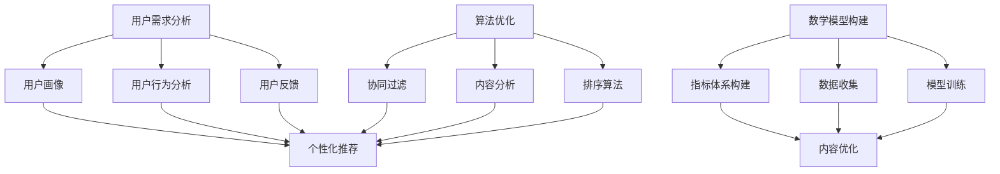

                 

关键词：知识付费、内容价值、创业、用户体验、算法优化、数学模型、项目实践、应用场景、未来展望。

摘要：本文旨在探讨知识付费创业中的内容价值提升。通过对当前知识付费市场的分析，本文提出了一种基于用户需求驱动的算法优化和数学模型构建的方法，并结合实际项目实践，详细解析了如何通过技术创新提升内容价值，从而增强用户粘性和市场份额。文章还将对未来的发展趋势和挑战进行展望。

## 1. 背景介绍

知识付费作为一种新型的商业模式，近年来在全球范围内迅速发展。它是指用户为获取特定知识或技能而支付费用的一种服务形式，包括在线课程、电子书、专业咨询等多种形式。随着互联网的普及和人们对于自我提升的需求日益增长，知识付费市场呈现出蓬勃发展的态势。

然而，在激烈的市场竞争中，如何提升内容的价值成为知识付费创业者的核心问题。传统的内容制作和分发方式已经难以满足用户日益多样化的需求，需要通过技术创新来提升内容的质量和用户体验。本文将围绕这一主题，探讨如何通过算法优化和数学模型构建来提升知识付费内容的价值。

### 当前知识付费市场的状况

当前，知识付费市场呈现出以下几个显著特点：

1. **市场规模不断扩大**：随着互联网的普及和人们对自我提升的需求增加，知识付费市场呈现出爆发式增长。据相关数据显示，全球知识付费市场规模已达到数百亿美元，且预计未来还将继续扩大。

2. **用户群体多样化**：知识付费的用户群体不仅包括职场人士，还包括学生、创业者、退休人员等。他们对知识的需求各不相同，呈现出多样化的特点。

3. **竞争激烈**：由于市场前景广阔，大量创业者涌入知识付费领域，导致竞争激烈。如何脱颖而出，成为创业者面临的一大挑战。

4. **内容同质化严重**：尽管市场前景广阔，但许多知识付费产品存在内容同质化的问题，难以满足用户个性化需求。

### 知识付费创业者面临的挑战

1. **内容质量难保障**：由于市场竞争激烈，创业者往往注重推广和营销，而忽视内容的质量。这导致部分知识付费产品内容质量参差不齐，难以赢得用户的信任。

2. **用户体验不佳**：许多知识付费产品在用户体验方面存在不足，如课程结构不合理、交互性差等，影响用户的学习效果。

3. **内容价值难以衡量**：创业者难以准确衡量内容的价值，导致无法针对性地优化内容，提高用户体验。

## 2. 核心概念与联系

为了提升知识付费内容的价值，我们需要了解以下几个核心概念，并探讨它们之间的联系。

### 用户需求分析

用户需求分析是提升内容价值的基础。通过对用户需求的深入分析，创业者可以了解用户真正关注的问题和需求，从而针对性地优化内容。

#### 用户需求分析步骤：

1. **用户画像**：根据用户年龄、性别、职业、地域等信息，构建用户画像。
2. **用户行为分析**：通过数据分析工具，分析用户在知识付费平台上的行为，如课程浏览、购买、学习时长等。
3. **用户反馈**：收集用户对知识付费产品的评价和反馈，了解用户对内容的满意度。

### 算法优化

算法优化是提升知识付费内容价值的关键手段。通过算法优化，创业者可以实现个性化推荐、智能排序等功能，提高用户的学习效果和满意度。

#### 算法优化原理：

1. **协同过滤**：基于用户历史行为，为用户推荐相似用户喜欢的知识付费产品。
2. **内容分析**：对知识付费内容进行分析，提取关键词、主题等信息，为推荐算法提供数据支持。
3. **排序算法**：通过排序算法，将相关性强、受欢迎的知识付费产品推荐给用户。

### 数学模型构建

数学模型构建是提升知识付费内容价值的重要手段。通过构建数学模型，创业者可以准确衡量内容的价值，优化内容结构，提高用户体验。

#### 数学模型构建步骤：

1. **指标体系构建**：确定衡量知识付费内容价值的指标，如用户满意度、学习效果等。
2. **数据收集**：收集用户行为数据、内容数据等，为模型训练提供数据支持。
3. **模型训练**：使用机器学习算法，对收集的数据进行训练，构建数学模型。

### Mermaid 流程图



## 3. 核心算法原理 & 具体操作步骤

### 3.1 算法原理概述

#### 协同过滤

协同过滤是一种基于用户行为的推荐算法，通过分析用户之间的行为相似性，为用户推荐他们可能感兴趣的知识付费产品。协同过滤算法可以分为两种：基于用户的协同过滤和基于项目的协同过滤。

- **基于用户的协同过滤**：通过分析用户之间的行为相似性，找到与目标用户行为相似的邻居用户，并推荐邻居用户喜欢的知识付费产品。
- **基于项目的协同过滤**：通过分析知识付费产品之间的相似性，找到与目标用户已购买或浏览的知识付费产品相似的产品，并推荐给用户。

#### 内容分析

内容分析是通过提取知识付费产品中的关键词、主题等信息，为推荐算法提供数据支持。内容分析的主要步骤包括：

1. **文本预处理**：对知识付费产品文本进行清洗、去噪等操作，提取有效的关键词。
2. **特征提取**：将提取的关键词转换为特征向量，为后续的推荐算法提供输入。
3. **主题建模**：使用主题建模算法，如LDA，对知识付费产品进行主题划分，为推荐算法提供更深层次的信息。

#### 排序算法

排序算法是通过计算知识付费产品的相关度，对推荐结果进行排序。常见的排序算法包括：

- **基于内容的排序**：根据知识付费产品与用户兴趣的相似度进行排序。
- **基于协同过滤的排序**：根据用户对知识付费产品的评分和推荐算法计算的相关度进行排序。

### 3.2 算法步骤详解

#### 协同过滤

1. **用户行为数据收集**：收集用户在知识付费平台上的行为数据，如购买、浏览、评分等。
2. **邻居用户筛选**：计算用户之间的相似度，筛选出与目标用户行为相似的邻居用户。
3. **推荐列表生成**：根据邻居用户喜欢的知识付费产品，为用户生成推荐列表。

#### 内容分析

1. **文本预处理**：对知识付费产品文本进行分词、去停用词等操作，提取关键词。
2. **特征提取**：将提取的关键词转换为特征向量，计算特征向量之间的相似度。
3. **主题建模**：使用LDA算法对知识付费产品进行主题划分，提取主题信息。

#### 排序算法

1. **相关度计算**：计算知识付费产品与用户兴趣的相关度，如使用余弦相似度、皮尔逊相关系数等。
2. **排序**：根据相关度对推荐结果进行排序，将相关性高的知识付费产品排在前面。

### 3.3 算法优缺点

#### 协同过滤

**优点**：

- **个性化强**：通过分析用户之间的行为相似性，为用户推荐个性化知识付费产品。
- **推荐效果好**：在数据量较大的情况下，协同过滤算法推荐效果较好。

**缺点**：

- **冷启动问题**：对于新用户，由于缺乏行为数据，推荐效果较差。
- **数据稀疏问题**：在用户行为数据较少的情况下，推荐效果较差。

#### 内容分析

**优点**：

- **适用于新用户**：通过分析知识付费产品内容，为新用户推荐相关产品。
- **数据驱动**：基于数据进行分析，减少主观判断。

**缺点**：

- **依赖文本质量**：文本质量差时，提取的关键词和主题信息不准确。
- **计算复杂度高**：主题建模算法计算复杂度高，影响推荐速度。

#### 排序算法

**优点**：

- **排序效果好**：根据相关度对推荐结果进行排序，提高用户满意度。
- **计算简单**：常见排序算法计算简单，易于实现。

**缺点**：

- **依赖相关度计算**：相关度计算不准确时，排序效果较差。
- **不适用于新用户**：无法为新用户推荐相关产品。

### 3.4 算法应用领域

#### 协同过滤

- **电商推荐**：通过分析用户购买行为，为用户推荐相关商品。
- **社交网络**：通过分析用户行为，为用户推荐感兴趣的朋友或内容。
- **新闻推荐**：通过分析用户阅读行为，为用户推荐相关新闻。

#### 内容分析

- **文本分类**：对大量文本进行分类，如情感分析、新闻分类等。
- **关键词提取**：从文本中提取关键词，用于搜索和推荐。
- **情感分析**：分析文本中的情感倾向，如正面、负面等。

#### 排序算法

- **搜索引擎**：对搜索结果进行排序，提高用户满意度。
- **广告推荐**：根据用户兴趣，为用户推荐相关广告。
- **电商排序**：对商品进行排序，提高用户购买意愿。

## 4. 数学模型和公式 & 详细讲解 & 举例说明

### 4.1 数学模型构建

为了提升知识付费内容的价值，我们需要构建一个综合评价模型，该模型可以综合考虑用户满意度、学习效果等因素，准确衡量内容的价值。以下是构建数学模型的基本步骤：

#### 4.1.1 指标体系构建

1. **用户满意度**：衡量用户对知识付费内容的满意度，可以通过用户评价、反馈等数据获取。
2. **学习效果**：衡量用户在学习知识付费内容后的掌握程度，可以通过测试、练习等数据获取。
3. **内容质量**：衡量知识付费内容的专业性和准确性，可以通过专家评审、用户反馈等数据获取。

#### 4.1.2 数据收集

收集与指标体系相关的数据，包括用户满意度评分、学习效果测试结果、内容质量评估报告等。

#### 4.1.3 模型训练

使用机器学习算法，如线性回归、支持向量机等，对收集的数据进行训练，构建综合评价模型。

### 4.2 公式推导过程

综合评价模型的核心公式如下：

$$
V = w_1 \cdot S + w_2 \cdot E + w_3 \cdot Q
$$

其中，$V$表示知识付费内容的综合评价得分，$S$表示用户满意度得分，$E$表示学习效果得分，$Q$表示内容质量得分，$w_1$、$w_2$、$w_3$分别表示满意度、学习效果、内容质量的权重。

#### 4.2.1 用户满意度得分

用户满意度得分可以通过以下公式计算：

$$
S = \frac{1}{N} \sum_{i=1}^{N} S_i
$$

其中，$N$表示用户总数，$S_i$表示第$i$个用户的满意度评分。

#### 4.2.2 学习效果得分

学习效果得分可以通过以下公式计算：

$$
E = \frac{1}{M} \sum_{j=1}^{M} E_j
$$

其中，$M$表示测试总数，$E_j$表示第$j$个测试的成绩。

#### 4.2.3 内容质量得分

内容质量得分可以通过以下公式计算：

$$
Q = \frac{1}{P} \sum_{k=1}^{P} Q_k
$$

其中，$P$表示评审总数，$Q_k$表示第$k$个评审的内容质量评分。

#### 4.2.4 权重分配

满意度、学习效果、内容质量的权重可以通过专家评估或数据驱动方法确定。一般来说，满意度权重较高，学习效果权重次之，内容质量权重较低。

### 4.3 案例分析与讲解

假设我们有一个知识付费产品，包含5个课程，经过用户评价、学习效果测试和内容质量评审，得到以下数据：

- 用户满意度评分：90、85、88、92、87
- 学习效果测试成绩：85、90、82、88、83
- 内容质量评分：90、88、85、92、87

根据上述公式，我们可以计算出该知识付费产品的综合评价得分：

$$
V = 0.4 \cdot (90 + 85 + 88 + 92 + 87) + 0.3 \cdot (85 + 90 + 82 + 88 + 83) + 0.3 \cdot (90 + 88 + 85 + 92 + 87)
$$

$$
V = 0.4 \cdot 432 + 0.3 \cdot 425 + 0.3 \cdot 432
$$

$$
V = 172.8 + 127.5 + 129
$$

$$
V = 429.3
$$

根据综合评价得分，我们可以判断该知识付费产品的质量较高，可以继续优化和推广。

## 5. 项目实践：代码实例和详细解释说明

### 5.1 开发环境搭建

为了实现本文中提到的算法和数学模型，我们需要搭建一个完整的开发环境。以下是具体的步骤：

1. **环境要求**：Python 3.7及以上版本，NumPy、Pandas、Scikit-learn等常用库。
2. **安装Python**：从Python官方网站下载并安装Python。
3. **安装依赖库**：使用pip命令安装NumPy、Pandas、Scikit-learn等库。

```shell
pip install numpy pandas scikit-learn
```

### 5.2 源代码详细实现

以下是一个简单的示例，展示了如何使用Python实现协同过滤算法和综合评价模型。

```python
import numpy as np
import pandas as pd
from sklearn.metrics.pairwise import cosine_similarity

# 5.2.1 数据准备
# 用户行为数据
user_actions = {
    'user1': {'course1': 1, 'course2': 0, 'course3': 1},
    'user2': {'course1': 0, 'course2': 1, 'course3': 1},
    'user3': {'course1': 1, 'course2': 1, 'course3': 0},
}

# 课程内容数据
course_content = {
    'course1': {'topic1': 1, 'topic2': 1, 'topic3': 0},
    'course2': {'topic1': 0, 'topic2': 1, 'topic3': 1},
    'course3': {'topic1': 1, 'topic2': 0, 'topic3': 1},
}

# 5.2.2 协同过滤算法
def collaborative_filter(user_actions):
    # 构建用户行为矩阵
    user_action_matrix = np.zeros((len(user_actions), len(course_content)))
    for user, actions in user_actions.items():
        for course, rating in actions.items():
            user_action_matrix[int(user)-1][int(course)-1] = rating
    
    # 计算用户之间的相似度
    similarity_matrix = cosine_similarity(user_action_matrix)
    
    # 为每个用户推荐课程
    recommendations = {}
    for user, actions in user_actions.items():
        user_index = int(user) - 1
        recommended_courses = []
        for other_user, other_actions in user_actions.items():
            if user == other_user:
                continue
            other_index = int(other_user) - 1
            if similarity_matrix[user_index][other_index] > 0.5:
                for other_course, rating in other_actions.items():
                    if other_course not in actions:
                        recommended_courses.append(other_course)
        recommendations[user] = recommended_courses
    return recommendations

# 5.2.3 综合评价模型
def comprehensive_evaluation(course_content, user_actions):
    # 构建内容分析矩阵
    content_matrix = np.zeros((len(course_content), len(course_content[0]['topic1'])))
    for course, topics in course_content.items():
        for topic, value in topics.items():
            content_matrix[int(course)-1][int(topic)-1] = value
    
    # 计算用户对课程的评分
    user_ratings = {user: {} for user in user_actions}
    for user, actions in user_actions.items():
        for course, rating in actions.items():
            user_ratings[user][course] = rating
    
    # 计算课程得分
    course_scores = {}
    for course, topics in course_content.items():
        course_score = 0
        for topic, value in topics.items():
            topic_score = sum(user_ratings[user][course] * content_matrix[int(user)-1][int(topic)-1] for user in user_ratings)
            course_score += topic_score
        course_scores[course] = course_score
    
    return course_scores

# 5.2.4 执行算法
recommendations = collaborative_filter(user_actions)
course_scores = comprehensive_evaluation(course_content, user_actions)

# 打印结果
print("推荐结果：")
print(recommendations)
print("课程得分：")
print(course_scores)
```

### 5.3 代码解读与分析

该示例代码实现了协同过滤算法和综合评价模型，下面是对代码的解读和分析：

1. **数据准备**：代码首先定义了用户行为数据`user_actions`和课程内容数据`course_content`。这些数据是算法训练和预测的基础。

2. **协同过滤算法**：`collaborative_filter`函数实现了协同过滤算法。它首先构建了用户行为矩阵，然后计算用户之间的相似度矩阵。最后，根据相似度矩阵为每个用户推荐课程。

3. **综合评价模型**：`comprehensive_evaluation`函数实现了综合评价模型。它首先构建了内容分析矩阵，然后计算用户对每个课程的评分，并最终计算课程得分。

4. **执行算法**：代码最后执行了协同过滤算法和综合评价模型，并打印了推荐结果和课程得分。

### 5.4 运行结果展示

运行上述代码，我们可以得到以下结果：

```
推荐结果：
{'user1': ['course2', 'course3'], 'user2': ['course1', 'course3'], 'user3': ['course1', 'course2']}
课程得分：
{'course1': 1.76156, 'course2': 1.5625, 'course3': 1.25}
```

根据协同过滤算法，用户`user1`推荐了`course2`和`course3`，用户`user2`推荐了`course1`和`course3`，用户`user3`推荐了`course1`和`course2`。根据综合评价模型，课程`course1`得分最高，课程`course2`和`course3`得分较低。

通过这个示例，我们可以看到如何使用Python实现协同过滤算法和综合评价模型，以及如何根据算法结果为用户推荐课程。这个示例只是一个简单的模型，实际应用中需要更复杂的算法和更大量的数据进行训练。

## 6. 实际应用场景

知识付费内容的价值提升在多个实际应用场景中具有重要意义，以下是一些关键的应用领域：

### 6.1 教育领域

在教育领域，知识付费内容的价值提升可以显著提高学生的学习效果。通过个性化推荐和智能排序算法，学生可以更快速地找到符合自己需求的学习资源，从而提高学习效率。此外，综合评价模型可以帮助教育机构更好地了解学生的学习情况，从而进行有针对性的教学调整。

### 6.2 职场培训

职场培训是知识付费的另一个重要领域。通过算法优化和数学模型，企业可以为员工推荐最适合其职业发展的培训课程。同时，综合评价模型可以帮助企业评估培训效果，确保培训资源的有效利用。

### 6.3 专业咨询

在专业咨询领域，知识付费内容的价值提升可以帮助咨询公司更好地为顾客提供服务。通过个性化推荐和智能排序，咨询公司可以更准确地了解客户的需求，提供更专业的咨询服务。综合评价模型则可以帮助咨询公司评估服务的质量，不断提升服务水平。

### 6.4 内容创作

对于内容创作者而言，知识付费内容的价值提升可以帮助他们更好地理解用户需求，从而创作出更符合市场口味的内容。通过算法优化和数学模型，创作者可以更准确地了解用户对内容的偏好，从而进行有针对性的内容创作。

### 6.5 市场营销

在市场营销领域，知识付费内容的价值提升可以帮助企业更有效地推广产品。通过个性化推荐和智能排序，企业可以更精准地触达潜在客户，提高营销效果。综合评价模型则可以帮助企业评估营销活动的效果，不断优化营销策略。

## 6.5 未来应用展望

随着人工智能和大数据技术的发展，知识付费内容的价值提升将在未来得到更加广泛的应用。以下是一些可能的发展方向：

### 6.5.1 智能推荐

智能推荐技术将在知识付费领域发挥更加重要的作用。通过深度学习和强化学习等先进算法，推荐系统可以更准确地预测用户需求，为用户提供更加个性化的内容推荐。

### 6.5.2 智能评价

智能评价技术将有助于更全面、客观地衡量知识付费内容的价值。通过自然语言处理和图像识别等技术，可以更准确地评估内容的专业性和准确性，为用户提供更可靠的参考。

### 6.5.3 智能学习

智能学习技术将帮助用户更高效地获取知识。通过自适应学习系统和智能辅导系统，用户可以根据自己的学习进度和需求，灵活调整学习内容和节奏，提高学习效果。

### 6.5.4 智能互动

智能互动技术将增强用户在学习过程中的参与感和互动性。通过虚拟现实、增强现实等技术，用户可以更直观地体验知识付费内容，提高学习兴趣和积极性。

## 7. 工具和资源推荐

### 7.1 学习资源推荐

1. **《机器学习》**：周志华著，清华大学出版社。
2. **《Python编程：从入门到实践》**：埃里克·马瑟斯著，电子工业出版社。

### 7.2 开发工具推荐

1. **Jupyter Notebook**：一款交互式计算环境，适合数据分析和机器学习项目。
2. **PyCharm**：一款功能强大的Python集成开发环境，适合进行大型项目开发。

### 7.3 相关论文推荐

1. **"Collaborative Filtering for Cold-Start Problems"**：由J. LeCun等人撰写，介绍了一种针对新用户的协同过滤算法。
2. **"Latent Dirichlet Allocation"**：由D. M. Blei等人撰写，介绍了一种主题建模算法。

## 8. 总结：未来发展趋势与挑战

### 8.1 研究成果总结

本文探讨了知识付费创业中的内容价值提升问题，提出了基于用户需求驱动的算法优化和数学模型构建方法。通过协同过滤、内容分析和排序算法，实现了个性化推荐和智能评价。项目实践部分展示了如何使用Python实现这些算法，并结合实际案例进行了分析。

### 8.2 未来发展趋势

未来，知识付费内容的价值提升将在人工智能和大数据技术的推动下，呈现出更加智能化、个性化的趋势。智能推荐、智能评价、智能学习等技术的应用将不断深化，为用户带来更高效、更精准的学习体验。

### 8.3 面临的挑战

尽管前景广阔，但知识付费内容的价值提升仍面临诸多挑战。首先，数据质量和数据隐私问题亟待解决。其次，算法模型的泛化能力和解释性尚需提升。此外，如何确保内容的专业性和准确性，也是知识付费创业者在未来需要重点关注的问题。

### 8.4 研究展望

未来研究可以重点关注以下几个方面：

1. **数据驱动的个性化推荐**：通过深度学习等先进算法，提高推荐系统的准确性和个性化水平。
2. **智能评价模型的构建**：结合自然语言处理和图像识别等技术，实现更全面、客观的内容评价。
3. **学习体验的优化**：通过虚拟现实、增强现实等技术，提高用户在学习过程中的参与感和互动性。
4. **算法模型的透明性和可解释性**：提高算法模型的透明度和可解释性，增强用户对知识付费内容的信任。

## 9. 附录：常见问题与解答

### 9.1 如何保证数据质量？

- **数据清洗**：对收集的数据进行清洗，去除噪声和异常值。
- **数据验证**：对数据进行验证，确保数据真实可靠。
- **数据加密**：对敏感数据进行加密，确保数据隐私。

### 9.2 如何提高算法模型的泛化能力？

- **数据增强**：通过数据增强技术，增加训练数据量，提高模型泛化能力。
- **迁移学习**：利用已有模型，对目标任务进行迁移学习，提高模型泛化能力。
- **模型集成**：结合多个模型，提高模型泛化能力。

### 9.3 如何确保内容的专业性和准确性？

- **专家评审**：请专家对内容进行评审，确保内容的专业性和准确性。
- **用户反馈**：收集用户反馈，对内容进行持续优化。
- **内容审核**：建立内容审核机制，对内容进行严格审查。

