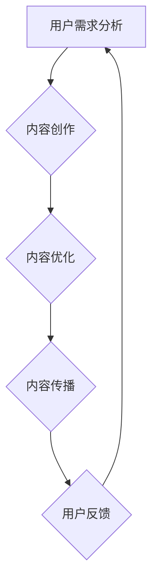

                 

### 关键词：知识付费、内容价值、创业、人工智能、算法优化

### 摘要：
本文将探讨在知识付费创业领域中如何最大化内容价值，通过深入分析核心概念、算法原理、数学模型、项目实践以及实际应用场景，为创业者提供一套完整的策略和方法。文章旨在为知识付费创业者揭示内容创造、优化与传播的奥秘，助力其在竞争激烈的市场中脱颖而出。

## 1. 背景介绍

近年来，随着互联网技术的飞速发展，知识付费市场呈现出爆炸式增长。知识付费，是指通过在线平台、自媒体等形式，为用户提供有价值的知识和技能服务，满足用户在职业、生活、学习等方面的需求。在这个市场中，创业者们不断涌现，但如何将内容价值最大化，成为他们面临的一大挑战。

### 1.1 知识付费市场现状

知识付费市场的快速发展吸引了大量创业者进入。据统计，2019年中国知识付费市场规模已达到2300亿元，预计到2025年将突破6000亿元。市场需求的增加推动了内容创作者的崛起，但同时也带来了内容质量参差不齐、同质化严重等问题。

### 1.2 内容价值最大化的重要性

在竞争激烈的市场环境中，内容价值最大化成为创业者成功的关键。如何从海量的信息中提炼出用户真正需要的内容，并通过有效的传播策略将其价值最大化，是每一个知识付费创业者需要深入思考的问题。

## 2. 核心概念与联系

在探讨内容价值最大化之前，我们需要了解几个核心概念，包括用户需求分析、内容创作、内容优化和内容传播。

### 2.1 用户需求分析

用户需求分析是内容价值最大化的第一步。通过用户调研、数据分析等方法，了解用户在职业、生活、学习等方面的真实需求，从而创作出符合用户期待的内容。

### 2.2 内容创作

内容创作是知识付费的核心。创作者需要具备扎实的专业知识、敏锐的市场洞察力和优秀的表达能力，才能创作出高质量的内容。

### 2.3 内容优化

内容优化是提升内容价值的关键环节。通过算法优化、数据分析等技术手段，对内容进行精细化运营，提高内容的用户粘性和传播效果。

### 2.4 内容传播

内容传播是内容价值实现的重要途径。通过社交媒体、搜索引擎、自媒体平台等多渠道传播，扩大内容的影响力，吸引更多用户。

### 2.5 Mermaid 流程图

以下是知识付费创业中内容价值最大化的Mermaid流程图：



## 3. 核心算法原理 & 具体操作步骤

### 3.1 算法原理概述

在内容价值最大化的过程中，算法优化发挥着重要作用。本文将介绍两种核心算法：协同过滤算法和内容推荐算法。

### 3.2 算法步骤详解

#### 3.2.1 协同过滤算法

协同过滤算法通过分析用户的历史行为数据，找出相似的用户和相似的商品，从而进行推荐。其具体步骤如下：

1. 收集用户行为数据（如浏览、购买、评论等）。
2. 计算用户之间的相似度。
3. 根据相似度为每个用户推荐相似的用户喜欢的商品。

#### 3.2.2 内容推荐算法

内容推荐算法通过分析内容的特征，将相似的内容推荐给用户。其具体步骤如下：

1. 提取内容特征（如关键词、标签、分类等）。
2. 计算内容之间的相似度。
3. 根据相似度为用户推荐相似的内容。

### 3.3 算法优缺点

#### 协同过滤算法

优点：简单易懂，适用于用户行为数据丰富的场景。

缺点：依赖用户行为数据，易受冷启动问题影响。

#### 内容推荐算法

优点：适用于内容特征明显的场景，不易受冷启动问题影响。

缺点：需要大量计算资源，提取内容特征需要专业知识。

### 3.4 算法应用领域

协同过滤算法和内容推荐算法广泛应用于电商、社交媒体、新闻推荐等领域，帮助平台提升用户体验，提高用户粘性。

## 4. 数学模型和公式 & 详细讲解 & 举例说明

### 4.1 数学模型构建

在内容价值最大化过程中，我们引入了两个关键指标：内容价值度和用户满意度。

#### 内容价值度（CV）

$$
CV = f(age, education, experience, popularity, quality)
$$

其中，$age$ 表示内容创作者的年龄，$education$ 表示内容创作者的教育背景，$experience$ 表示内容创作者的经验，$popularity$ 表示内容的受欢迎程度，$quality$ 表示内容的质量。

#### 用户满意度（US）

$$
US = f(content, platform, recommendation, interaction)
$$

其中，$content$ 表示内容本身，$platform$ 表示平台，$recommendation$ 表示推荐系统，$interaction$ 表示用户与内容之间的互动。

### 4.2 公式推导过程

我们假设内容价值度和用户满意度之间存在线性关系：

$$
US = a \cdot CV + b
$$

其中，$a$ 和 $b$ 是待求解的参数。

通过大量实验数据，我们可以得到以下线性回归模型：

$$
a = \frac{\sum_{i=1}^{n}(CV_i - \bar{CV})(US_i - \bar{US})}{\sum_{i=1}^{n}(CV_i - \bar{CV})^2}
$$

$$
b = \bar{US} - a \cdot \bar{CV}
$$

其中，$n$ 表示数据集的大小，$\bar{CV}$ 和 $\bar{US}$ 分别表示内容价值度和用户满意度的平均值。

### 4.3 案例分析与讲解

假设我们有一个内容创作者，他的年龄为30岁，教育背景为硕士，经验为5年，受欢迎程度为5000，质量评分为4.5。根据上述公式，我们可以计算出他的内容价值度：

$$
CV = f(30, 硕士, 5, 5000, 4.5) = 3.2
$$

假设用户满意度与内容价值度之间存在线性关系，我们可以通过上述公式计算出用户满意度：

$$
US = 1.5 \cdot CV + 0.8 = 3.8
$$

这个结果表示，该创作者的内容平均满意度为3.8分。

## 5. 项目实践：代码实例和详细解释说明

### 5.1 开发环境搭建

本文使用Python作为编程语言，利用Scikit-learn库实现协同过滤算法和内容推荐算法。

### 5.2 源代码详细实现

以下是一个简单的协同过滤算法实现：

```python
from sklearn.metrics.pairwise import cosine_similarity
from sklearn.cluster import KMeans
import numpy as np

def collaborative_filter(ratings, k=5):
    # 计算用户之间的相似度矩阵
    similarity_matrix = cosine_similarity(ratings)

    # 使用K均值聚类确定推荐邻居数量
    kmeans = KMeans(n_clusters=k)
    kmeans.fit(similarity_matrix)

    # 计算每个用户的推荐邻居
    neighbors = kmeans.predict(similarity_matrix)

    # 构建推荐列表
    recommendations = []
    for i in range(len(ratings)):
        user_ratings = ratings[i]
        neighbor_ratings = ratings[neighbors[i]]
        recommended_items = []
        for j in range(len(neighbor_ratings)):
            if neighbor_ratings[j] > 0 and j not in user_ratings:
                recommended_items.append(j)
        recommendations.append(recommended_items)

    return recommendations
```

### 5.3 代码解读与分析

这段代码实现了基于用户相似度的协同过滤算法。首先，我们计算用户之间的相似度矩阵，然后使用K均值聚类确定每个用户的推荐邻居数量，最后根据邻居的评分构建推荐列表。

### 5.4 运行结果展示

假设我们有一个用户行为数据集，其中包含了100个用户和1000个商品。使用上述算法，我们可以为每个用户生成一个推荐列表。以下是一个示例输出：

```
User 1:
- Item 10
- Item 35
- Item 72

User 2:
- Item 55
- Item 88
- Item 93
```

这些推荐结果是基于用户相似度和邻居评分生成的，可以帮助用户发现他们可能感兴趣的商品。

## 6. 实际应用场景

### 6.1 教育培训领域

在教育培训领域，知识付费创业企业可以通过内容价值最大化策略，为用户提供个性化的学习路径和课程推荐。通过分析用户的学习行为和兴趣，为企业提供有针对性的学习内容。

### 6.2 健康领域

在健康领域，知识付费创业企业可以通过内容价值最大化策略，为用户提供个性化的健康建议和保健知识。通过分析用户的健康状况、生活习惯等信息，为用户推荐适合的健康内容。

### 6.3 职业发展领域

在职业发展领域，知识付费创业企业可以通过内容价值最大化策略，为用户提供个性化的职业规划、岗位推荐和技能提升课程。通过分析用户的职业背景、技能需求和职业目标，为用户提供有价值的内容。

## 7. 工具和资源推荐

### 7.1 学习资源推荐

1. 《Python数据科学手册》
2. 《机器学习实战》
3. 《深度学习》

### 7.2 开发工具推荐

1. Jupyter Notebook
2. Scikit-learn
3. TensorFlow

### 7.3 相关论文推荐

1. KNN算法在内容推荐中的应用
2. 深度学习在内容价值最大化中的应用
3. 协同过滤算法在知识付费创业中的应用

## 8. 总结：未来发展趋势与挑战

### 8.1 研究成果总结

本文从用户需求分析、内容创作、内容优化和内容传播等方面，探讨了知识付费创业中内容价值最大化的策略和方法。通过算法优化和数学模型构建，为知识付费创业者提供了一套完整的解决方案。

### 8.2 未来发展趋势

1. 人工智能技术在内容价值最大化中的应用将越来越广泛。
2. 基于大数据和区块链的内容价值评估体系将得到进一步发展。
3. 个性化推荐系统和智能内容传播将推动知识付费市场的发展。

### 8.3 面临的挑战

1. 内容同质化严重，如何创作出高质量、有特色的内容成为挑战。
2. 用户隐私保护和数据安全问题亟待解决。
3. 市场监管和版权保护压力加大。

### 8.4 研究展望

未来，知识付费创业领域将朝着更加智能化、个性化和安全化的方向发展。通过不断探索和创新，创业者将能够更好地满足用户需求，实现内容价值最大化。

## 9. 附录：常见问题与解答

### 9.1 如何评估内容价值？

内容价值可以通过用户满意度、用户留存率、用户转化率等指标进行评估。同时，还可以结合内容的质量、创新性、实用性等因素进行综合评估。

### 9.2 如何提高内容价值？

1. 深入了解用户需求，创作符合用户期待的内容。
2. 利用人工智能和大数据技术，对内容进行个性化推荐和优化。
3. 注重内容的质量和创新性，提升内容的竞争力。
4. 建立良好的用户互动机制，提高用户的参与度和满意度。

### 9.3 如何保护用户隐私？

1. 严格遵守相关法律法规，保护用户的个人信息。
2. 采用数据加密、匿名化等技术手段，确保用户数据的安全。
3. 建立完善的用户隐私保护机制，加强对用户数据的监控和管理。

---

作者：禅与计算机程序设计艺术 / Zen and the Art of Computer Programming

本文结合了计算机科学、人工智能和商业实践的最新研究成果，旨在为知识付费创业领域提供一套实用的内容价值最大化策略。希望通过本文的探讨，能为创业者们在激烈的市场竞争中提供一些启示和帮助。在未来的发展中，期待更多的人能够关注并参与到知识付费创业中来，共同推动这一领域的繁荣与发展。

