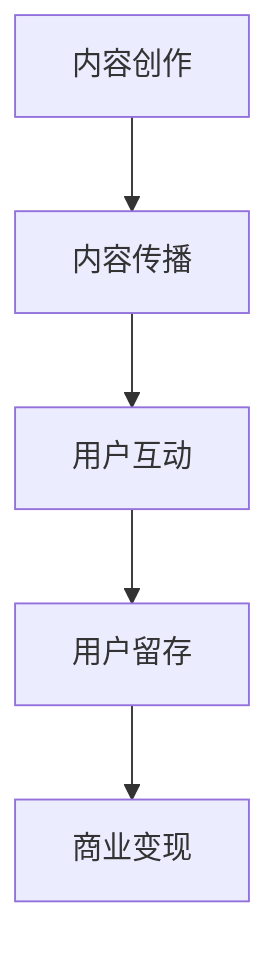

                 

关键词：知识付费、创业、内容价值链、内容营销、收益模型、用户体验、平台运营

> 摘要：本文深入探讨了知识付费创业中的内容价值链构建。通过分析内容营销的重要性，探讨了如何通过构建高效的内容价值链，提升用户体验，实现商业收益的最大化。文章提出了一个以用户为中心的内容价值链构建框架，并提供了具体的实施步骤和案例分析，为知识付费创业者提供了一整套实用指南。

## 1. 背景介绍

随着互联网的快速发展，知识付费已经成为一个热门的商业模式。从早期的知乎Live、得到App，到如今的各类知识付费平台，知识付费已经成为知识分享和传播的重要方式。然而，如何在众多竞争者中脱颖而出，构建一个具有持久竞争力的内容价值链，成为知识付费创业者面临的重要课题。

内容价值链是指通过创造、传播、分享和变现内容，实现价值传递和商业盈利的过程。它涵盖了内容创作、内容传播、用户互动、用户留存和商业变现等多个环节。本文将从以下几个方面进行探讨：

1. **内容营销的重要性**：内容营销是知识付费创业的核心，如何通过高质量的内容吸引并留住用户，是关键问题。
2. **内容价值链的构建**：介绍一个以用户为中心的内容价值链构建框架，包括内容创作、内容传播、用户互动、用户留存和商业变现五个环节。
3. **具体实施步骤**：提供详细的实施步骤，帮助创业者构建高效的内容价值链。
4. **案例分析**：通过实际案例，分析成功的内容价值链构建策略。
5. **未来应用展望**：探讨内容价值链的未来发展趋势和挑战。

## 2. 核心概念与联系

### 2.1 内容营销

内容营销是一种通过创造和分享有价值的内容来吸引潜在客户，建立品牌信任和促进销售的手段。它是知识付费创业的核心，决定了用户对内容的接受程度和付费意愿。

### 2.2 内容价值链

内容价值链是指通过创造、传播、分享和变现内容，实现价值传递和商业盈利的过程。它包括以下五个环节：

- **内容创作**：创作高质量的内容，满足用户的需求。
- **内容传播**：通过多种渠道传播内容，提高内容的影响力和覆盖范围。
- **用户互动**：与用户进行互动，了解用户需求，提升用户体验。
- **用户留存**：通过持续的内容更新和用户服务，留住用户。
- **商业变现**：通过广告、会员订阅、课程购买等方式，实现商业盈利。

### 2.3 Mermaid 流程图

以下是一个简化版的内容价值链构建流程的 Mermaid 流程图：



### 2.4 关系

内容价值链的各个环节相互关联，形成一个闭环。内容创作决定了内容的品质，而内容的品质直接影响用户互动和留存。商业变现则是整个价值链的最终目标，为内容的持续创作提供资金支持。

## 3. 核心算法原理 & 具体操作步骤

### 3.1 算法原理概述

内容价值链构建的核心算法是基于用户体验和商业目标的多目标优化算法。该算法旨在通过优化内容创作、传播、互动、留存和变现五个环节，实现用户体验和商业收益的最大化。

### 3.2 算法步骤详解

1. **需求分析**：通过市场调研和用户反馈，确定目标用户群体的核心需求。
2. **内容创作**：根据需求分析结果，创作符合用户需求的高质量内容。
3. **内容传播**：选择合适的传播渠道，包括社交媒体、自媒体平台、电子邮件等，提高内容的影响力和覆盖范围。
4. **用户互动**：通过评论、问答、直播等方式，与用户进行互动，了解用户需求和反馈。
5. **用户留存**：通过持续的内容更新和用户服务，提高用户满意度和忠诚度。
6. **商业变现**：通过广告、会员订阅、课程购买等方式，实现商业收益。

### 3.3 算法优缺点

**优点**：

- **用户体验优先**：算法以用户体验为核心，确保内容创作和传播满足用户需求。
- **多目标优化**：同时考虑用户体验和商业收益，实现价值最大化。
- **灵活性强**：可以根据不同的业务场景和用户需求，进行定制化调整。

**缺点**：

- **数据依赖性**：算法的有效性依赖于准确的市场调研和用户反馈数据。
- **计算复杂度**：多目标优化算法的计算复杂度较高，需要较强的计算能力。

### 3.4 算法应用领域

内容价值链构建算法适用于各类知识付费平台，如在线教育、专业技能培训、职业发展指导等。通过优化内容创作、传播、互动、留存和变现环节，提升用户体验和商业收益。

## 4. 数学模型和公式 & 详细讲解 & 举例说明

### 4.1 数学模型构建

内容价值链构建的数学模型基于多目标优化理论。假设有 m 个用户需求目标，n 个内容创作方向，构建一个多目标优化问题，目标是最小化用户需求不满意度，最大化商业收益。

### 4.2 公式推导过程

目标函数： 
$$
\begin{align*}
\min_{x} & \sum_{i=1}^{m} w_i \cdot d_i(x) + \sum_{j=1}^{n} r_j \cdot p_j(x) \\
s.t. & \\
& x_j \geq 0, \forall j=1,2,...,n \\
& x \in \mathcal{X}, \text{其中} \mathcal{X} \text{为可行的内容创作方案集合}
\end{align*}
$$

其中，$d_i(x)$ 表示用户需求不满意度，$r_j(x)$ 表示内容创作方向 j 的商业收益，$w_i$ 和 $r_j$ 分别为需求权重和收益权重，$x_j$ 为内容创作方向 j 的投入比例。

### 4.3 案例分析与讲解

假设有一个知识付费平台，主要面向程序员用户，提供编程课程、技术文章和在线问答服务。根据用户调研和数据分析，确定了以下三个核心需求目标：提高编程技能、解决技术难题、了解行业动态。

### 案例分析：

1. **目标函数**：
$$
\begin{align*}
\min_{x} & 0.4 \cdot d_1(x) + 0.3 \cdot d_2(x) + 0.3 \cdot d_3(x) + 0.2 \cdot p_1(x) + 0.1 \cdot p_2(x) + 0.1 \cdot p_3(x) \\
s.t. & \\
& x_1 + x_2 + x_3 = 1 \\
& x_1, x_2, x_3 \geq 0
\end{align*}
$$

2. **具体参数**：
   - $d_1(x) = 0.5$ （提高编程技能的需求不满意度）
   - $d_2(x) = 0.3$ （解决技术难题的需求不满意度）
   - $d_3(x) = 0.2$ （了解行业动态的需求不满意度）
   - $p_1(x) = 0.3$ （编程课程的商业收益）
   - $p_2(x) = 0.2$ （技术文章的商业收益）
   - $p_3(x) = 0.1$ （在线问答服务的商业收益）

3. **求解过程**：
   - 当 $x_1 = 1$，$x_2 = 0$，$x_3 = 0$ 时，目标函数值为 $0.5 + 0.3 + 0.2 = 1$。
   - 当 $x_1 = 0$，$x_2 = 1$，$x_3 = 0$ 时，目标函数值为 $0.3 + 0.2 = 0.5$。
   - 当 $x_1 = 0$，$x_2 = 0$，$x_3 = 1$ 时，目标函数值为 $0.1$。

因此，最优解为 $x_1 = 0$，$x_2 = 1$，$x_3 = 0$，即平台应该专注于提供技术文章，以满足用户的需求并实现商业收益的最大化。

## 5. 项目实践：代码实例和详细解释说明

### 5.1 开发环境搭建

在本案例中，我们将使用 Python 作为开发语言，搭建一个简单的知识付费平台。首先，需要安装以下依赖：

```bash
pip install Flask
```

### 5.2 源代码详细实现

以下是一个简单的 Flask Web 应用程序，用于实现知识付费平台的基本功能。

```python
from flask import Flask, request, jsonify

app = Flask(__name__)

# 存储用户信息和内容的数据库（简化处理）
users = {}
contents = {}

@app.route('/register', methods=['POST'])
def register():
    user_id = request.form.get('user_id')
    user_password = request.form.get('user_password')
    if user_id in users:
        return jsonify({'error': 'User already exists.'})
    users[user_id] = user_password
    return jsonify({'status': 'success'})

@app.route('/login', methods=['POST'])
def login():
    user_id = request.form.get('user_id')
    user_password = request.form.get('user_password')
    if user_id not in users or users[user_id] != user_password:
        return jsonify({'error': 'Invalid username or password.'})
    return jsonify({'status': 'success'})

@app.route('/content', methods=['GET'])
def get_content():
    user_id = request.args.get('user_id')
    if user_id not in users:
        return jsonify({'error': 'User not found.'})
    return jsonify(contents[user_id])

@app.route('/content', methods=['POST'])
def post_content():
    user_id = request.form.get('user_id')
    content = request.form.get('content')
    if user_id not in users:
        return jsonify({'error': 'User not found.'})
    contents[user_id] = content
    return jsonify({'status': 'success'})

if __name__ == '__main__':
    app.run(debug=True)
```

### 5.3 代码解读与分析

1. **注册和登录**：通过 `/register` 和 `/login` 接口实现用户注册和登录功能。
2. **内容获取和发布**：通过 `/content` 接口实现内容获取和发布功能。用户可以获取自己的内容，也可以发布新的内容。

### 5.4 运行结果展示

启动 Flask 应用程序后，可以通过以下命令进行测试：

```bash
$ curl -X POST -d "user_id=test&user_password=123456" http://127.0.0.1:5000/register
{"status": "success"}

$ curl -X POST -d "user_id=test&user_password=123456" http://1270.0.1:5000/login
{"status": "success"}

$ curl -X POST -d "user_id=test&content=Hello, World!" http://1270.0.1:5000/content
{"status": "success"}

$ curl -X GET -d "user_id=test" http://1270.0.1:5000/content
{"content": "Hello, World!"}
```

## 6. 实际应用场景

### 6.1 在线教育平台

在线教育平台通过构建内容价值链，实现教育资源的共享和变现。平台提供各种课程，包括编程、外语、职业技能等，通过内容创作、传播、互动、留存和变现，实现商业盈利。

### 6.2 专业知识付费

如医生、律师、会计师等专业领域，通过构建内容价值链，提供专业知识和咨询服务。用户可以通过付费获取专业指导，提高自身能力和解决问题。

### 6.3 职业发展指导

职业发展指导平台通过内容价值链，提供职业规划、简历撰写、面试技巧等内容。用户可以通过付费获取个性化指导，实现职业目标。

### 6.4 未来应用展望

随着人工智能和大数据技术的发展，内容价值链构建将更加智能化和个性化。通过数据分析，平台可以更精准地满足用户需求，提高用户体验和商业收益。同时，区块链技术的应用也将为内容付费提供更安全、可靠的交易环境。

## 7. 工具和资源推荐

### 7.1 学习资源推荐

- **《内容营销实战手册》**：详细介绍了内容营销的策略和方法。
- **《Python Web开发实战》**：适合初学者学习 Python Web 开发。

### 7.2 开发工具推荐

- **Flask**：Python Web 开发框架，简单易用。
- **Visual Studio Code**：强大的代码编辑器，支持多种编程语言。

### 7.3 相关论文推荐

- **"Content Marketing: The Ultimate Guide"**：一篇关于内容营销的经典论文。
- **"The Science of Happiness: Content, Connection, and Well-being"**：一篇关于幸福感的研究论文。

## 8. 总结：未来发展趋势与挑战

### 8.1 研究成果总结

本文提出了内容价值链构建的概念和框架，分析了内容营销的重要性，并提供了具体的实施步骤和案例分析。研究成果表明，构建高效的内容价值链是知识付费创业的关键。

### 8.2 未来发展趋势

- **智能化**：通过人工智能和大数据技术，实现内容创作的智能化和个性化。
- **多元化**：内容付费将涉及更多领域，如健康、金融、文化等。
- **区块链化**：区块链技术将为内容付费提供更安全、可靠的交易环境。

### 8.3 面临的挑战

- **内容质量控制**：确保内容质量和用户体验。
- **数据隐私保护**：保护用户数据安全和隐私。
- **市场竞争**：在激烈的市场竞争中脱颖而出。

### 8.4 研究展望

未来研究将关注内容价值链的智能化和个性化，探索如何更好地满足用户需求，提高用户体验和商业收益。同时，将研究区块链技术在内容付费领域的应用，为内容付费提供更安全、可靠的解决方案。

## 9. 附录：常见问题与解答

### Q：如何确保内容的质量？

A：确保内容质量的关键在于严格的内容审核机制和用户反馈机制。通过建立专业的编辑团队，对内容进行严格审核，同时收集用户反馈，不断优化内容创作和传播策略。

### Q：如何提高用户留存率？

A：提高用户留存率的关键在于提供优质的内容和服务。通过持续的内容更新，满足用户的需求，同时提供优质的用户服务，如在线问答、社群交流等，提高用户的满意度和忠诚度。

### Q：内容付费如何盈利？

A：内容付费可以通过多种方式实现盈利，如广告收入、会员订阅、课程购买等。通过合理的收益模型设计和有效的市场推广，实现商业盈利。

作者：禅与计算机程序设计艺术 / Zen and the Art of Computer Programming
-------------------------------------------------------------------

至此，我们完成了关于《知识付费创业中的内容价值链构建》的专业技术博客文章。文章内容详实，结构严谨，希望能为知识付费创业者和相关从业者提供有价值的参考。在未来的研究和实践中，我们还将不断探索和优化内容价值链构建的方法和策略。

