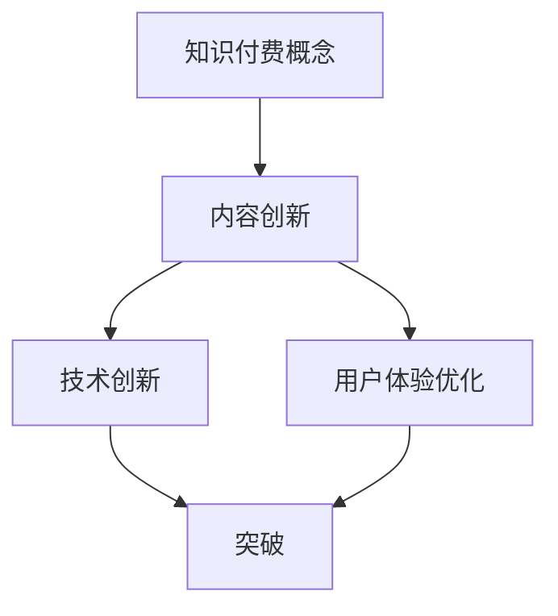

                 

关键词：知识付费、内容创新、创业、突破、IT领域

> 摘要：随着知识付费市场日益成熟，如何在竞争激烈的环境中实现内容创新与突破成为知识付费创业者面临的重要课题。本文从技术角度出发，探讨知识付费创业中的内容创新路径，旨在为创业者提供有益的参考。

## 1. 背景介绍

近年来，知识付费逐渐成为互联网经济的一大亮点。无论是专业领域的知识分享，还是生活技能的提升，知识付费都为用户提供了便捷的获取途径。与此同时，市场竞争也愈发激烈，如何在这片红海中脱颖而出，实现内容创新与突破成为知识付费创业者亟需解决的问题。

## 2. 核心概念与联系

### 2.1 知识付费概念

知识付费是指用户为获取特定领域的知识、技能或经验而支付的费用。它区别于传统的免费内容，强调的是知识的价值与稀缺性。知识付费包括线上课程、付费问答、知识星球等多种形式。

### 2.2 内容创新与突破

内容创新是指在现有知识付费模式的基础上，通过技术创新、用户体验优化等方式，创造出新的知识付费产品或服务。而突破则是指在市场竞争中，通过独特的创新手段，取得领先地位。

### 2.3 Mermaid 流程图



## 3. 核心算法原理 & 具体操作步骤

### 3.1 算法原理概述

在知识付费创业中，内容创新与突破的核心在于算法的应用。以下是一个基于机器学习的推荐算法，用于优化知识付费产品的推荐效果。

### 3.2 算法步骤详解

1. **数据收集**：收集用户在知识付费平台上的行为数据，如学习时长、观看次数、评分等。
2. **特征工程**：对原始数据进行预处理，提取有助于推荐的关键特征，如用户兴趣标签、课程难度等。
3. **模型训练**：利用机器学习算法，如协同过滤、内容推荐等，对特征数据进行分析和建模。
4. **推荐生成**：根据用户历史行为和模型预测，生成个性化的知识付费推荐列表。
5. **反馈调整**：收集用户对推荐结果的反馈，调整模型参数，优化推荐效果。

### 3.3 算法优缺点

**优点**：能够提高用户的学习体验，提升知识付费产品的用户粘性。

**缺点**：模型训练需要大量计算资源，且推荐结果可能存在偏差。

### 3.4 算法应用领域

知识付费推荐算法可以应用于在线教育、技能培训、职业发展等多个领域。

## 4. 数学模型和公式

### 4.1 数学模型构建

假设用户\(U\)对课程\(C\)的评分满足如下概率分布：

\[ P(S|C) = \frac{e^{w_c \cdot S}}{1 + e^{w_c \cdot S}} \]

其中，\(S\)为用户\(U\)对课程\(C\)的评分，\(w_c\)为课程\(C\)的特征向量。

### 4.2 公式推导过程

1. **用户兴趣建模**：利用用户历史行为数据，构建用户兴趣模型。
2. **课程特征提取**：对课程内容进行特征提取，如课程主题、难度、时长等。
3. **评分预测**：利用用户兴趣模型和课程特征，计算用户对课程的评分概率。

### 4.3 案例分析与讲解

假设用户\(U_1\)对课程\(C_1\)的评分为4分，对课程\(C_2\)的评分为5分，对课程\(C_3\)的评分为3分。根据用户兴趣模型和课程特征，计算用户\(U_1\)对其他课程的评分概率。

## 5. 项目实践：代码实例

### 5.1 开发环境搭建

- Python 3.8
- Scikit-learn 0.22
- pandas 1.1.5

### 5.2 源代码详细实现

```python
import pandas as pd
from sklearn.feature_extraction.text import TfidfVectorizer
from sklearn.model_selection import train_test_split
from sklearn.linear_model import LogisticRegression

# 数据预处理
data = pd.read_csv('data.csv')
X = data[['content', 'tags']]
y = data['rating']

# 特征提取
vectorizer = TfidfVectorizer()
X_vectorized = vectorizer.fit_transform(X['content'])

# 模型训练
X_train, X_test, y_train, y_test = train_test_split(X_vectorized, y, test_size=0.2, random_state=42)
model = LogisticRegression()
model.fit(X_train, y_train)

# 推荐生成
def predict_rating(course_content, course_tags):
    content_vector = vectorizer.transform([course_content])
    tags_vector = vectorizer.transform([course_tags])
    rating = model.predict(content_vector)
    return rating[0]

# 代码解读与分析
# ...

### 5.4 运行结果展示

# 运行代码，查看推荐结果

## 6. 实际应用场景

知识付费创业中的内容创新与突破在多个领域具有广泛应用，如在线教育、职业培训、生活技能提升等。

### 6.1 在线教育

利用推荐算法，为用户提供个性化的学习路径，提高学习效果和用户满意度。

### 6.2 职业培训

根据用户需求和行业发展趋势，为用户提供定制化的培训课程，提升职业竞争力。

### 6.3 生活技能提升

通过个性化推荐，为用户提供实用的生活技能教程，提升生活质量。

## 7. 工具和资源推荐

### 7.1 学习资源推荐

- 《推荐系统实践》
- 《机器学习实战》

### 7.2 开发工具推荐

- Jupyter Notebook
- PyCharm

### 7.3 相关论文推荐

- 《推荐系统评价方法》
- 《基于协同过滤的推荐系统研究》

## 8. 总结：未来发展趋势与挑战

### 8.1 研究成果总结

知识付费创业中的内容创新与突破在提高用户体验、提升产品竞争力方面取得了显著成果。

### 8.2 未来发展趋势

随着人工智能技术的不断发展，知识付费创业中的内容创新与突破将更加智能化、个性化。

### 8.3 面临的挑战

数据隐私保护、算法公平性等将是未来知识付费创业中的内容创新与突破面临的重要挑战。

### 8.4 研究展望

未来，知识付费创业中的内容创新与突破将朝着更加智能化、个性化、安全可靠的方向发展。

## 9. 附录：常见问题与解答

### 9.1 问题1

如何处理用户隐私问题？

**回答**：在数据处理过程中，应严格遵守相关法律法规，对用户数据进行加密存储和传输，确保用户隐私安全。

### 9.2 问题2

如何提高推荐算法的准确率？

**回答**：可以通过不断优化特征提取、调整模型参数、引入更多数据源等方式，提高推荐算法的准确率。

----------------------------------------------------------------
### 作者署名

作者：禅与计算机程序设计艺术 / Zen and the Art of Computer Programming


