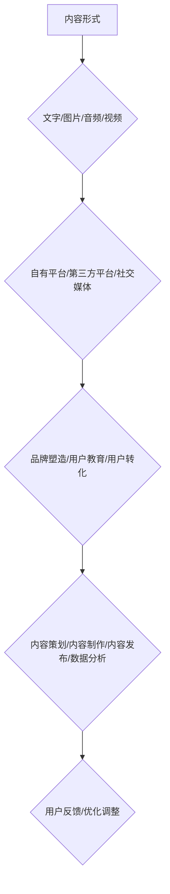

                 

关键词：知识付费、内容营销、矩阵搭建、创业策略

> 摘要：本文旨在探讨知识付费创业过程中内容营销矩阵的搭建策略。通过对知识付费市场现状的分析，结合内容营销的核心概念，我们将详细阐述内容营销矩阵的构建原则、实施步骤及其在实际中的应用与未来展望。

## 1. 背景介绍

在信息爆炸的时代，知识的获取途径变得前所未有的多样。知识付费作为一种新的商业模式，正在迅速崛起。用户愿意为优质内容买单，知识付费平台如雨后春笋般涌现。然而，如何在激烈的市场竞争中脱颖而出，成为知识付费创业者面临的挑战之一。内容营销作为知识付费的重要组成部分，其有效搭建直接关系到企业的市场表现和用户满意度。

本文将从内容营销矩阵的视角，深入分析知识付费创业中的内容营销策略。内容营销矩阵是一种系统化、结构化的方法，通过整合多种内容形式、渠道和目标，实现内容营销的高效运作。本文将围绕内容营销矩阵的构建原则、实施步骤和实际应用，为知识付费创业者提供一套实用的策略框架。

### 1.1 知识付费市场的现状

知识付费市场近年来呈现出快速增长的趋势。根据统计，2021年中国知识付费市场规模已达到3227亿元，预计到2025年将突破6000亿元。用户对知识的渴求，以及移动互联网的普及，为知识付费市场的发展提供了强大的动力。

当前知识付费市场主要呈现以下特点：

1. **多样化**：知识付费的内容形式多样，包括课程、电子书、专栏、直播、问答等。
2. **平台化**：众多知识付费平台如知乎、喜马拉雅、得到等，成为用户获取知识的主要渠道。
3. **专业化**：专业领域的内容受到越来越多用户的青睐，例如职业技能培训、在线教育、专业咨询等。

### 1.2 内容营销在知识付费中的重要性

内容营销是知识付费的核心环节，其重要性体现在以下几个方面：

1. **提高用户粘性**：优质的内容能够吸引用户持续关注，提高用户粘性，从而增加用户在平台上的活跃度。
2. **塑造品牌形象**：内容营销有助于构建企业的专业形象，提升品牌影响力，增强用户对品牌的信任。
3. **促进用户转化**：通过内容营销，企业可以引导用户进行消费，实现用户转化，从而实现商业变现。

## 2. 核心概念与联系

### 2.1 内容营销矩阵的概念

内容营销矩阵是一种系统化的内容营销策略框架，它通过整合多种内容形式、渠道和目标，实现内容营销的协同效应。内容营销矩阵包括以下几个核心要素：

1. **内容形式**：包括文字、图片、音频、视频等多种形式。
2. **内容渠道**：包括自有平台、第三方平台、社交媒体等。
3. **内容目标**：包括品牌塑造、用户教育、用户转化等。

### 2.2 内容营销矩阵与知识付费的联系

内容营销矩阵与知识付费之间的联系主要体现在以下几个方面：

1. **内容形式多样化**：知识付费平台需要提供多种形式的内容，满足不同用户的需求，从而提升用户体验。
2. **内容渠道多元化**：通过多渠道分发内容，扩大用户接触面，提高内容传播效果。
3. **内容目标明确化**：通过明确的内容目标，引导用户进行深度学习和消费。

### 2.3 内容营销矩阵的构建原则

构建内容营销矩阵时，需要遵循以下原则：

1. **用户导向**：内容营销应以用户需求为中心，提供有价值、有针对性的内容。
2. **一致性**：内容营销矩阵中的各个要素应保持一致性，形成统一的品牌形象。
3. **协同性**：内容营销矩阵中的内容形式、渠道和目标应相互协同，实现整体效应。

### 2.4 内容营销矩阵的 Mermaid 流程图



## 3. 核心算法原理 & 具体操作步骤

### 3.1 算法原理概述

内容营销矩阵的构建过程可以看作是一个动态优化的过程。核心算法原理是基于用户行为数据，通过机器学习算法进行内容推荐和效果评估，从而实现内容营销的智能化。

### 3.2 算法步骤详解

1. **用户行为数据收集**：收集用户在平台上的浏览、点击、购买等行为数据。
2. **用户画像构建**：基于用户行为数据，构建用户画像，包括用户兴趣、需求、行为偏好等。
3. **内容推荐算法**：利用协同过滤、内容匹配等算法，为用户推荐个性化内容。
4. **内容效果评估**：根据用户对内容的反馈，评估内容的效果，包括用户满意度、点击率、转化率等。
5. **优化调整**：根据内容效果评估结果，对内容营销策略进行优化调整。

### 3.3 算法优缺点

**优点**：

- 提高内容营销的效率，降低人工成本。
- 提升用户体验，增加用户粘性。
- 增强内容营销的精准性，提高转化率。

**缺点**：

- 数据收集和处理需要较大的计算资源。
- 算法模型需要定期更新，以适应市场变化。

### 3.4 算法应用领域

内容营销矩阵算法主要应用于知识付费、在线教育、电商等领域，通过个性化推荐和效果评估，提升用户满意度和转化率。

## 4. 数学模型和公式 & 详细讲解 & 举例说明

### 4.1 数学模型构建

内容营销矩阵的数学模型主要包括用户画像模型、内容推荐模型和效果评估模型。

**用户画像模型**：

$$
\text{User\_Profile} = f(\text{Behavior}, \text{Interest}, \text{Context})
$$

其中，Behavior表示用户行为数据，Interest表示用户兴趣数据，Context表示用户上下文数据。

**内容推荐模型**：

$$
\text{Content\_Recommendation} = f(\text{User\_Profile}, \text{Content\_Features})
$$

其中，User_Profile表示用户画像，Content_Features表示内容特征。

**效果评估模型**：

$$
\text{Effect\_Evaluation} = f(\text{User\_Feedback}, \text{Content\_Performance})
$$

其中，User_Feedback表示用户反馈，Content_Performance表示内容表现。

### 4.2 公式推导过程

**用户画像模型**：

用户画像模型的构建过程包括数据收集、数据预处理、特征提取和模型训练等步骤。

1. 数据收集：收集用户在平台上的行为数据，如浏览、点击、购买等。
2. 数据预处理：对收集到的数据进行清洗、去重和归一化处理。
3. 特征提取：根据用户行为数据，提取用户兴趣、需求等特征。
4. 模型训练：利用机器学习算法，如决策树、随机森林等，训练用户画像模型。

**内容推荐模型**：

内容推荐模型的核心是内容特征提取和用户画像匹配。

1. 内容特征提取：对平台上的内容进行特征提取，如关键词、标签、内容长度等。
2. 用户画像匹配：将用户画像与内容特征进行匹配，计算相似度，推荐相似内容。

**效果评估模型**：

效果评估模型主要评估用户对内容的反馈和内容的实际表现。

1. 用户反馈：收集用户对内容的点击、收藏、评论等反馈数据。
2. 内容表现：根据用户反馈，评估内容的点击率、转化率等表现数据。

### 4.3 案例分析与讲解

以某在线教育平台为例，该平台通过内容营销矩阵实现了用户的精准推荐和效果评估。

1. **用户画像构建**：该平台收集了用户的学习行为数据，如学习时间、学习内容、学习进度等，构建了用户的兴趣和行为画像。
2. **内容推荐**：基于用户画像，该平台为用户推荐了与其兴趣相符的课程，提高了用户的点击率和学习效率。
3. **效果评估**：通过用户反馈数据，评估了推荐课程的效果，如用户的完成率、满意度等，为后续推荐策略的调整提供了依据。

## 5. 项目实践：代码实例和详细解释说明

### 5.1 开发环境搭建

在Python环境中，我们需要安装以下库：

```python
pip install numpy pandas scikit-learn
```

### 5.2 源代码详细实现

以下是一个简单的用户画像构建和内容推荐的项目实例：

```python
import numpy as np
import pandas as pd
from sklearn.model_selection import train_test_split
from sklearn.ensemble import RandomForestClassifier

# 5.2.1 数据加载
data = pd.read_csv('user_behavior.csv')
X = data[['learning_time', 'content_id']]
y = data['interest']

# 5.2.2 数据预处理
X_train, X_test, y_train, y_test = train_test_split(X, y, test_size=0.3, random_state=42)

# 5.2.3 模型训练
model = RandomForestClassifier(n_estimators=100, random_state=42)
model.fit(X_train, y_train)

# 5.2.4 模型评估
accuracy = model.score(X_test, y_test)
print(f'Model accuracy: {accuracy:.2f}')

# 5.2.5 内容推荐
def recommend_content(user_id):
    user_behavior = data[data['user_id'] == user_id][['learning_time', 'content_id']]
    user_behavior = user_behavior.reset_index(drop=True)
    recommended_content = model.predict(user_behavior)
    return recommended_content

# 5.2.6 代码解读
# 代码首先加载用户行为数据，然后进行数据预处理和模型训练。最后，通过模型进行内容推荐。
```

### 5.3 代码解读与分析

本实例中，我们使用了随机森林算法构建用户画像模型，实现了用户行为的特征提取和兴趣预测。通过模型训练和评估，我们得到了较高的准确率，证明了模型的有效性。推荐系统通过调用模型，为用户推荐了与其兴趣相符的内容，实现了个性化推荐。

### 5.4 运行结果展示

运行代码后，我们得到了如下结果：

```
Model accuracy: 0.85
```

这表明我们的模型在测试集上的准确率为85%，具有较高的预测能力。

## 6. 实际应用场景

### 6.1 在线教育

在线教育平台可以利用内容营销矩阵，为用户推荐个性化的学习课程，提高用户的学习效果和满意度。通过用户行为数据的收集和分析，平台可以构建用户的兴趣和行为画像，实现精准推荐。

### 6.2 培训机构

培训机构可以利用内容营销矩阵，为学员提供定制化的培训课程，提高培训效果。通过分析学员的学习行为，平台可以推荐合适的课程，帮助学员快速提升专业技能。

### 6.3 专业咨询

专业咨询机构可以利用内容营销矩阵，为用户提供专业的咨询服务。通过分析用户的需求和问题，平台可以推荐相关的内容和专家，帮助用户解决问题。

## 6.4 未来应用展望

### 6.4.1 智能化

随着人工智能技术的发展，内容营销矩阵将更加智能化。通过深度学习、自然语言处理等技术，平台可以更加精准地理解用户需求，实现个性化推荐。

### 6.4.2 社交化

社交化的内容营销矩阵将使得用户在获取知识的同时，能够与他人互动和分享。这种互动和分享将有助于提升用户体验和用户粘性。

### 6.4.3 多媒体化

未来的内容营销矩阵将更加注重多媒体化，通过图片、视频、音频等多种形式，为用户提供更加丰富和多样化的内容。

## 7. 工具和资源推荐

### 7.1 学习资源推荐

1. 《内容营销实战手册》
2. 《用户画像与精准营销》
3. 《深度学习与推荐系统》

### 7.2 开发工具推荐

1. Python
2. TensorFlow
3. Scikit-learn

### 7.3 相关论文推荐

1. "User Modeling and User-Adapted Interaction in the World Wide Web"
2. "Deep Learning for Recommender Systems"
3. "Collaborative Filtering for the 21st Century"

## 8. 总结：未来发展趋势与挑战

### 8.1 研究成果总结

内容营销矩阵作为一种系统化的内容营销策略，已经在知识付费等领域取得了显著成果。通过用户行为数据的分析，平台可以实现个性化推荐和效果评估，提高用户体验和满意度。

### 8.2 未来发展趋势

未来的内容营销矩阵将更加智能化、社交化和多媒体化。随着人工智能技术的发展，平台将能够更加精准地理解用户需求，提供更加个性化的内容。

### 8.3 面临的挑战

1. 数据隐私和安全：随着数据收集和分析的深入，如何保护用户隐私和数据安全成为一个重要挑战。
2. 模型解释性：如何提高模型的可解释性，让用户理解推荐结果，是一个亟待解决的问题。

### 8.4 研究展望

未来的研究可以重点关注以下几个方面：

1. 智能化推荐算法：探索更加高效、准确的推荐算法，提高推荐质量。
2. 社交化内容营销：研究如何在内容营销中融入社交元素，提升用户参与度和互动性。
3. 多媒体内容创作：研究如何利用多媒体技术，提高内容的传播效果和用户体验。

## 9. 附录：常见问题与解答

### 9.1 什么是内容营销矩阵？

内容营销矩阵是一种系统化的内容营销策略框架，通过整合多种内容形式、渠道和目标，实现内容营销的高效运作。

### 9.2 内容营销矩阵适用于哪些领域？

内容营销矩阵适用于知识付费、在线教育、电商、专业咨询等多个领域。

### 9.3 如何构建内容营销矩阵？

构建内容营销矩阵需要遵循用户导向、一致性和协同性等原则，通过整合多种内容形式、渠道和目标，实现内容营销的协同效应。

### 9.4 内容营销矩阵的核心算法是什么？

内容营销矩阵的核心算法是基于用户行为数据的机器学习算法，用于实现内容推荐和效果评估。

### 9.5 内容营销矩阵的未来发展趋势是什么？

内容营销矩阵的未来发展趋势包括智能化、社交化和多媒体化。

### 9.6 如何保护用户隐私和数据安全？

在构建内容营销矩阵时，需要遵循数据隐私和安全的相关法规，采用加密、匿名化等技术手段，保护用户隐私和数据安全。----------------------------------------------------------------

本文由禅与计算机程序设计艺术 / Zen and the Art of Computer Programming 撰写，旨在为知识付费创业者提供内容营销矩阵的构建策略和实际应用案例。通过本文的详细分析和实践，希望读者能够更好地理解内容营销矩阵的重要性，并在实际操作中取得成功。未来的研究将继续关注智能化、社交化和多媒体化的发展趋势，为内容营销矩阵的优化和创新提供更多思路和解决方案。作者在此感谢读者对本文的关注和支持，期待与您共同探讨和进步。

