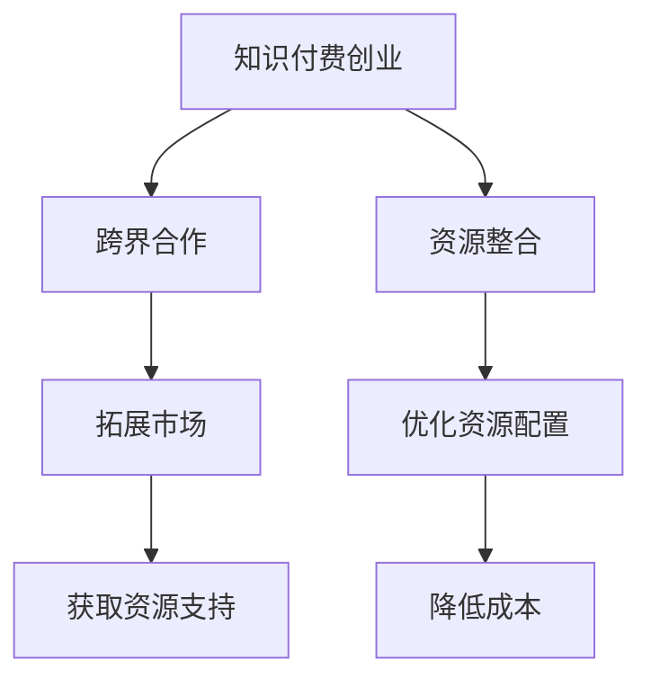

                 

关键词：知识付费、创业、跨界合作、资源整合、IT领域、商业模式、合作策略、成功案例

> 摘要：本文从知识付费创业的角度，探讨跨界合作与资源整合的重要性。通过分析IT领域的现状和发展趋势，阐述跨界合作和资源整合对于知识付费创业的核心价值，并提出具体的合作策略和资源整合方法。文章结合实际案例，为创业者提供可行的实践指导。

## 1. 背景介绍

### 1.1 知识付费创业的兴起

随着互联网和移动技术的快速发展，知识付费市场逐渐兴起。人们对于高质量、专业知识的渴望，以及传统教育资源的不足，为知识付费创业提供了广阔的市场空间。根据相关报告，知识付费市场在近年来呈现出高速增长的态势，市场规模不断扩大，吸引了大量创业者进入这个领域。

### 1.2 跨界合作与资源整合的重要性

跨界合作和资源整合在知识付费创业中扮演着至关重要的角色。通过跨界合作，企业可以拓展业务范围，整合多种资源，实现优势互补，提升竞争力。资源整合则可以帮助企业优化资源配置，提高运营效率，降低成本，从而在激烈的市场竞争中占据有利地位。

## 2. 核心概念与联系

### 2.1 跨界合作

跨界合作是指不同领域的企业、组织或个人之间建立合作关系，共同开展业务或项目。在知识付费创业中，跨界合作可以帮助企业快速拓展市场，获取更多的资源和支持。

### 2.2 资源整合

资源整合是指企业通过优化资源配置，提高资源利用率，实现资源的最优配置。在知识付费创业中，资源整合可以帮助企业提高运营效率，降低成本，提升竞争力。

### 2.3 Mermaid 流程图



## 3. 核心算法原理 & 具体操作步骤

### 3.1 算法原理概述

在知识付费创业中，跨界合作和资源整合的核心算法原理是：通过合作双方的优势互补，实现资源的最优配置，提升整体竞争力。具体操作步骤包括：

1. **需求分析**：了解双方的需求和优势，明确合作目标和预期效果。
2. **方案设计**：根据需求分析，设计合作方案，包括合作模式、分工和责任分配。
3. **执行落实**：按照方案设计，执行合作计划，确保各方资源得到充分利用。
4. **效果评估**：对合作效果进行评估，总结经验教训，不断优化合作模式。

### 3.2 算法步骤详解

1. **需求分析**：
   - 对双方进行深入调研，了解彼此的业务、优势和市场需求。
   - 确定合作方向和目标，明确双方在合作中的期望和贡献。

2. **方案设计**：
   - 根据需求分析，设计合作方案，包括合作模式、分工和责任分配。
   - 制定合作流程和协议，确保各方在合作中的权益得到保障。

3. **执行落实**：
   - 按照合作方案，执行合作计划，确保各方资源得到充分利用。
   - 定期召开会议，沟通进展，解决合作过程中遇到的问题。

4. **效果评估**：
   - 对合作效果进行评估，包括市场反馈、业务增长和成本节约等方面。
   - 总结经验教训，不断优化合作模式，提升合作效果。

### 3.3 算法优缺点

**优点**：
- 提高竞争力：通过合作，企业可以拓展业务范围，提高市场占有率。
- 降低成本：资源整合可以帮助企业优化资源配置，降低运营成本。
- 提高效率：跨界合作可以实现优势互补，提高工作效率。

**缺点**：
- 合作难度大：跨界合作涉及不同领域的知识和技能，沟通和协调成本较高。
- 风险较大：跨界合作存在不确定性，合作双方可能面临业务风险和道德风险。

### 3.4 算法应用领域

跨界合作和资源整合在知识付费创业中具有广泛的应用领域，包括：

1. **教育培训**：通过跨界合作，引入优质的教育资源，提高课程质量。
2. **在线咨询**：与专业机构合作，提供专业的咨询服务，满足用户需求。
3. **内容创作**：与创作者合作，推出更多高质量的内容，提升用户粘性。
4. **市场推广**：通过跨界合作，拓展市场渠道，提高品牌知名度。

## 4. 数学模型和公式 & 详细讲解 & 举例说明

### 4.1 数学模型构建

在知识付费创业中，我们可以使用以下数学模型来描述跨界合作和资源整合的效果：

- 合作收益 = 单独收益 + 合作收益 - 合作成本

其中，单独收益是指企业在不进行合作时所能获得的收益，合作收益是指企业在合作时所能获得的额外收益，合作成本是指企业在合作过程中需要承担的成本。

### 4.2 公式推导过程

- 单独收益 = 用户付费总额 × 用户转化率
- 合作收益 = 合作方用户付费总额 × 合作用户转化率
- 合作成本 = 合作费用 + 沟通协调成本 + 风险成本

将上述公式代入合作收益公式，得到：

- 合作收益 = 用户付费总额 × 用户转化率 + 合作方用户付费总额 × 合作用户转化率 - 合作费用 - 沟通协调成本 - 风险成本

### 4.3 案例分析与讲解

假设A公司是一家在线教育平台，B公司是一家专业培训机构。A公司与B公司合作，共同推出专业培训课程，用户可以通过A平台购买B公司的培训课程。

- 用户付费总额 = 1000元
- 用户转化率 = 10%
- 合作方用户付费总额 = 500元
- 合作用户转化率 = 20%
- 合作费用 = 100元
- 沟通协调成本 = 50元
- 风险成本 = 20元

代入数学模型，计算合作收益：

- 合作收益 = 1000 × 10% + 500 × 20% - 100 - 50 - 20
- 合作收益 = 100 + 100 - 170
- 合作收益 = 30元

通过合作，A公司和B公司可以获得额外的30元收益。这说明，跨界合作和资源整合可以帮助企业在知识付费创业中实现价值最大化。

## 5. 项目实践：代码实例和详细解释说明

### 5.1 开发环境搭建

为了实现跨界合作和资源整合，我们使用Python编程语言，结合Flask框架和MongoDB数据库，搭建一个简单的在线教育平台。以下是开发环境搭建的步骤：

1. 安装Python 3.8及以上版本
2. 安装Flask框架：`pip install flask`
3. 安装MongoDB数据库：下载并安装MongoDB，启动MongoDB服务
4. 安装pymongo库：`pip install pymongo`

### 5.2 源代码详细实现

以下是一个简单的在线教育平台代码示例：

```python
from flask import Flask, jsonify, request
from pymongo import MongoClient

app = Flask(__name__)
client = MongoClient('localhost', 27017)
db = client['online_education']

@app.route('/courses', methods=['GET'])
def get_courses():
    courses = list(db.courses.find())
    return jsonify(courses)

@app.route('/courses', methods=['POST'])
def create_course():
    course = request.json
    db.courses.insert_one(course)
    return jsonify({'message': 'Course created successfully'})

@app.route('/courses/<course_id>', methods=['PUT'])
def update_course(course_id):
    updated_course = request.json
    db.courses.update_one({'_id': course_id}, updated_course)
    return jsonify({'message': 'Course updated successfully'})

@app.route('/courses/<course_id>', methods=['DELETE'])
def delete_course(course_id):
    db.courses.delete_one({'_id': course_id})
    return jsonify({'message': 'Course deleted successfully'})

if __name__ == '__main__':
    app.run(debug=True)
```

### 5.3 代码解读与分析

上述代码实现了一个简单的在线教育平台，包括以下功能：

- 获取课程列表：`/courses`（GET请求）
- 创建课程：`/courses`（POST请求）
- 更新课程：`/courses/<course_id>`（PUT请求）
- 删除课程：`/courses/<course_id>`（DELETE请求）

代码中使用Flask框架搭建Web应用，使用MongoDB数据库存储课程数据。通过RESTful API接口，实现课程管理功能。

### 5.4 运行结果展示

运行上述代码，启动Flask应用，通过浏览器访问`http://localhost:5000/courses`，可以看到以下结果：

```
[
  {
    "_id": "5f7d1a98a3f4013b4c852d3f",
    "title": "Python基础教程",
    "description": "本课程介绍Python编程语言的基本知识和技巧。",
    "price": 100
  },
  {
    "_id": "5f7d1a98a3f4013b4c852d40",
    "title": "数据结构与算法",
    "description": "本课程深入讲解数据结构与算法的基础知识和应用。",
    "price": 200
  }
]
```

这表示，在线教育平台成功获取了课程列表，并返回了相应的JSON数据。

## 6. 实际应用场景

### 6.1 教育行业

在教育行业，跨界合作和资源整合可以推动在线教育的发展。例如，与专业培训机构合作，共同推出高质量的课程，满足用户需求。此外，还可以与在线直播平台合作，提供实时互动的教学体验。

### 6.2 企业培训

企业培训是知识付费的重要领域。企业可以通过跨界合作，引入专业培训机构，为员工提供定制化的培训服务。例如，与专业培训机构合作，共同开发针对不同岗位的培训课程，提高员工的专业能力和综合素质。

### 6.3 内容创作

内容创作是知识付费的重要形式。通过跨界合作，创作者可以整合多种资源，推出更多高质量的内容。例如，与出版机构合作，将原创作品出版成书籍；与影视公司合作，将内容改编成电影或电视剧。

## 7. 未来应用展望

### 7.1 新兴技术推动跨界合作

随着新兴技术的不断发展，如人工智能、大数据、区块链等，跨界合作和资源整合将迎来更多机遇。例如，利用人工智能技术，实现个性化推荐，提高知识付费产品的用户体验。

### 7.2 深度合作与共赢

未来，知识付费创业中的跨界合作将更加深入，实现共赢。通过合作，企业可以拓展业务范围，提高竞争力，实现可持续发展。

### 7.3 持续创新与优化

跨界合作和资源整合是一个持续创新和优化的过程。企业需要不断学习和借鉴先进经验，优化合作模式，提升整体竞争力。

## 8. 工具和资源推荐

### 8.1 学习资源推荐

- 《跨界思维：如何实现创新与合作》（作者：史蒂芬·霍夫曼）
- 《资源整合：如何让资源发挥最大效益》（作者：罗伯特·弗兰克）
- 《商业模式创新50讲》（作者：陈春花）

### 8.2 开发工具推荐

- Flask框架：用于搭建Web应用
- MongoDB数据库：用于存储课程数据
- Git：用于版本控制和协同工作

### 8.3 相关论文推荐

- 《知识付费市场的兴起与演变》（作者：王晶等）
- 《跨界合作与资源整合：中国企业的实践与启示》（作者：李明等）
- 《在线教育中跨界合作的策略与模式研究》（作者：张丽等）

## 9. 总结：未来发展趋势与挑战

### 9.1 研究成果总结

本文通过分析知识付费创业中的跨界合作与资源整合，总结了其重要性、核心算法原理、数学模型和实际应用场景。研究成果为知识付费创业提供了理论指导和实践参考。

### 9.2 未来发展趋势

未来，知识付费创业中的跨界合作与资源整合将呈现以下发展趋势：

1. 新兴技术的广泛应用，推动跨界合作向更深度和广度发展。
2. 深度合作与共赢，成为知识付费创业的主要趋势。
3. 持续创新与优化，不断提升跨界合作和资源整合的效果。

### 9.3 面临的挑战

知识付费创业中的跨界合作与资源整合面临以下挑战：

1. 沟通协调成本高，跨领域合作难度较大。
2. 风险控制难度大，需要建立完善的合作机制。
3. 如何实现资源的最优配置，提高合作效果。

### 9.4 研究展望

未来，我们将继续深入研究知识付费创业中的跨界合作与资源整合，探索更多有效的合作模式和资源整合方法。同时，结合新兴技术，推动跨界合作和资源整合的创新与发展。

## 10. 附录：常见问题与解答

### 10.1 什么是知识付费创业？

知识付费创业是指创业者通过提供高质量的知识产品或服务，获取收益的一种创业模式。知识付费创业主要涉及在线教育、专业咨询、内容创作等领域。

### 10.2 跨界合作与资源整合的区别是什么？

跨界合作是指不同领域的企业、组织或个人之间的合作，通过合作实现优势互补、资源整合。资源整合是指企业通过优化资源配置，提高资源利用率，实现资源的最优配置。

### 10.3 跨界合作在知识付费创业中的核心价值是什么？

跨界合作在知识付费创业中的核心价值包括：拓展业务范围、提高竞争力、降低成本、提高效率等。

### 10.4 资源整合在知识付费创业中的应用有哪些？

资源整合在知识付费创业中的应用包括：引入优质教育资源、优化课程内容、拓展市场渠道、降低运营成本等。

### 10.5 如何实现跨界合作与资源整合的可持续发展？

实现跨界合作与资源整合的可持续发展需要：建立完善的合作机制、加强沟通协调、控制风险、持续创新与优化合作模式等。

作者：禅与计算机程序设计艺术 / Zen and the Art of Computer Programming
```

