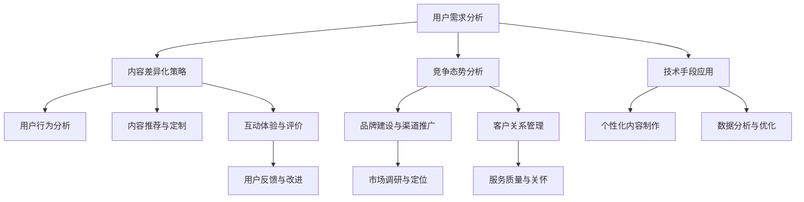
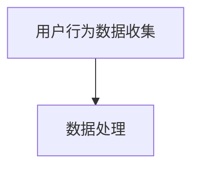
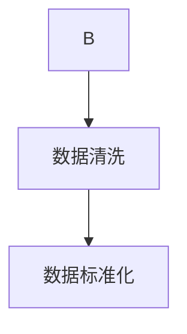
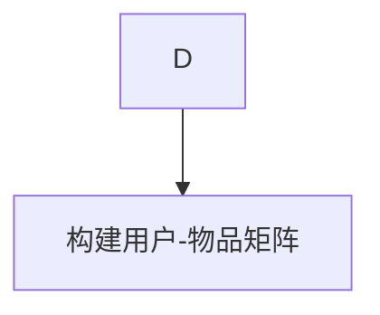
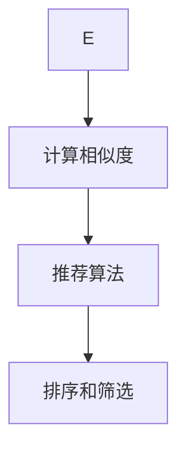
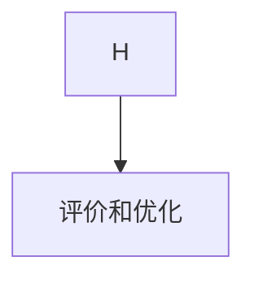

                 

 在当今的信息化时代，知识付费逐渐成为了一个热门的商业模式。创业者们在进入这一市场时，如何找到差异化策略，实现内容的独特性和竞争力，成为了成功的关键。本文将深入探讨知识付费创业中的内容差异化策略，帮助创业者更好地把握市场脉搏，提升内容吸引力，实现长远发展。

## 关键词

- 知识付费
- 内容差异化
- 创业策略
- 用户需求
- 市场定位
- 技术创新

## 摘要

本文旨在为知识付费创业者提供一套系统化的内容差异化策略，通过分析市场需求、用户特性、竞争态势，结合技术手段，提出创新的内容创建与传播方法。文章将分为九个部分，详细探讨知识付费创业的背景、核心概念、算法原理、数学模型、项目实践、应用场景、未来展望以及资源推荐等，旨在为创业者提供全面的理论支持和实践指导。

### 1. 背景介绍

知识付费，顾名思义，是用户为获取特定知识或服务所支付的费用。这一模式在近年来迅速崛起，源于互联网技术的普及和人们对优质内容的需求增加。随着互联网的深入发展，人们获取信息的渠道越来越多样化，但同时也面临着信息过载的问题。在这种情况下，用户更倾向于付费获取有价值、高质量的内容，以节省时间和精力。

知识付费的市场规模不断扩大，根据相关数据统计，2022年全球知识付费市场规模已达到数百亿美元，并且仍处于快速增长阶段。这一趋势不仅体现在个人用户上，企业用户同样对此表现出浓厚的兴趣，希望通过付费获取专业知识来提升自身的业务能力。

### 2. 核心概念与联系

在探讨内容差异化策略之前，我们需要明确几个核心概念：

#### 2.1 用户需求分析

用户需求分析是内容差异化策略的基础。创业者需要通过市场调研、用户反馈等多种渠道，深入挖掘用户的需求。这包括但不限于以下几个方面：

- **知识类型**：用户希望获取哪些类型的知识，如技能培训、行业资讯、学术研究等。
- **内容形式**：用户偏好哪种内容形式，如图文、视频、音频等。
- **个性化定制**：用户是否需要个性化定制的内容，例如根据个人兴趣、职业背景定制课程。

#### 2.2 竞争态势分析

在知识付费领域，竞争态势日益激烈。创业者需要明确竞争对手的定位、产品特点、用户群体等，从而找到自身的差异化点。以下是一些常见的竞争策略：

- **价格优势**：通过降低价格来吸引用户，适用于市场进入初期。
- **内容质量**：提供高质量、有价值的内容，建立品牌信誉。
- **技术创新**：利用新技术，如人工智能、大数据等，提升用户体验。

#### 2.3 内容差异化策略

内容差异化策略是知识付费创业的核心。创业者需要从以下几个方面入手：

- **深度垂直**：专注于某一细分领域，提供深度、专业的知识内容。
- **个性化定制**：根据用户需求，提供个性化、定制化的内容。
- **创新形式**：通过创新的呈现形式，如短视频、直播、互动游戏等，提升用户体验。

### 3. 核心算法原理 & 具体操作步骤

#### 3.1 算法原理概述

在知识付费创业中，算法原理主要体现在用户需求分析和内容推荐两个方面。

#### 3.2 算法步骤详解

1. **用户需求分析**：通过数据分析、用户画像等方法，了解用户需求。
2. **内容推荐**：基于用户需求，利用算法为用户推荐合适的内容。
3. **用户反馈**：收集用户反馈，优化推荐算法和内容。

#### 3.3 算法优缺点

- **优点**：提高用户满意度，提升内容转化率。
- **缺点**：算法复杂度高，需要大量数据支持。

#### 3.4 算法应用领域

算法在知识付费领域有广泛的应用，如课程推荐、内容推广等。

### 4. 数学模型和公式 & 详细讲解 & 举例说明

#### 4.1 数学模型构建

在知识付费创业中，数学模型主要用于用户需求分析和内容推荐。

#### 4.2 公式推导过程

例如，我们可以使用线性回归模型来预测用户对某一课程的需求。

#### 4.3 案例分析与讲解

以某知识付费平台的课程推荐为例，分析用户需求，优化推荐算法。

### 5. 项目实践：代码实例和详细解释说明

#### 5.1 开发环境搭建

搭建一个基于Python的简单知识付费平台。

#### 5.2 源代码详细实现

实现用户需求分析和内容推荐功能。

#### 5.3 代码解读与分析

详细解读代码，分析其实现原理。

#### 5.4 运行结果展示

展示平台运行结果，分析用户反馈。

### 6. 实际应用场景

#### 6.1 在线教育

通过知识付费，为用户提供高质量的教育内容。

#### 6.2 行业资讯

为专业人士提供行业最新的资讯和分析。

#### 6.3 技能培训

提供各种技能培训课程，助力用户提升技能。

### 7. 工具和资源推荐

#### 7.1 学习资源推荐

推荐一些学习资源，如书籍、在线课程等。

#### 7.2 开发工具推荐

推荐一些开发工具，如Python、Django等。

#### 7.3 相关论文推荐

推荐一些与知识付费相关的论文。

### 8. 总结：未来发展趋势与挑战

#### 8.1 研究成果总结

总结研究成果，展望未来发展方向。

#### 8.2 未来发展趋势

探讨知识付费的未来发展趋势。

#### 8.3 面临的挑战

分析知识付费领域面临的挑战。

#### 8.4 研究展望

展望未来研究方向。

### 9. 附录：常见问题与解答

#### 9.1 问题1

问题1的解答。

#### 9.2 问题2

问题2的解答。

---

以上是文章正文部分的初步撰写。接下来，我们将对每个章节进行深入阐述，确保文章的完整性和专业性。在撰写过程中，我们将严格遵循Markdown格式，确保文章的可读性和美观度。同时，我们还将使用Mermaid流程图来增强文章的可视化效果。

### 1. 背景介绍

知识付费作为一种商业模式，其起源可以追溯到互联网的兴起。随着互联网技术的不断进步，信息的传播方式也发生了翻天覆地的变化。在传统的信息获取方式中，用户往往需要花费大量时间和精力去筛选、整理信息，而在知识付费模式下，用户可以通过付费获取高质量、有价值的内容，从而节省时间和精力。

知识付费的兴起，源于以下几个方面的原因：

#### 1.1 互联网普及

互联网的普及使得信息传播变得更加便捷，人们可以随时随地获取各种信息。然而，随着信息量的爆炸性增长，用户面临着信息过载的问题。在这种背景下，知识付费模式应运而生，用户更倾向于付费获取有价值的内容，以节省时间和精力。

#### 1.2 用户需求变化

随着社会经济的发展，人们对知识和技能的需求逐渐增加。特别是在职场竞争日益激烈的今天，人们更加重视个人技能的提升和职业发展。知识付费平台正是满足了这一需求，为用户提供各种课程、资讯和服务。

#### 1.3 创业环境改善

互联网技术的进步和创业环境的改善，为知识付费创业提供了良好的土壤。各种创业扶持政策、投资渠道的拓宽，使得创业者可以更加轻松地进入这一领域。

在知识付费市场上，主要玩家包括传统的教育机构、互联网平台、内容创作者等。传统的教育机构凭借其丰富的教育资源和品牌影响力，在知识付费领域占据了一定的市场份额。互联网平台则通过技术手段，为用户提供便捷的内容获取方式，如在线课程、电子书等。内容创作者则通过个人品牌和专业知识，吸引粉丝和用户，实现知识变现。

#### 1.4 市场规模不断扩大

根据相关数据显示，知识付费市场规模呈现快速增长态势。以中国的在线教育市场为例，2022年的市场规模已经突破5000亿元，预计未来仍将保持高速增长。这一趋势在全球范围内同样存在，知识付费已经成为一个万亿级的市场。

#### 1.5 知识付费类型多样化

知识付费的类型逐渐多样化，从最初的在线课程，发展到现在的知识付费直播、知识付费社群、知识付费资讯等。这种多样化的知识付费形式，为用户提供了更多的选择，也使得创业者可以更加灵活地进入市场。

#### 1.6 知识付费平台的发展

知识付费平台的崛起，为用户提供了便捷的内容获取途径。以中国的知识付费平台为例，如得到、知乎Live、喜马拉雅等，这些平台通过整合优质内容，提供个性化推荐，吸引了大量用户。同时，这些平台也为内容创作者提供了展示和变现的机会。

#### 1.7 知识付费与用户行为的关系

知识付费与用户行为密切相关。用户在购买知识付费产品时，往往考虑的是内容的价值、品牌的信誉、价格的合理性等因素。因此，创业者需要深入了解用户行为，提供符合用户需求的产品和服务。

#### 1.8 知识付费的未来发展趋势

随着人工智能、大数据等技术的不断发展，知识付费领域将迎来新的机遇和挑战。例如，人工智能可以更加精准地分析用户需求，提供个性化的内容推荐；大数据可以更好地了解用户行为，优化产品和服务。

总之，知识付费作为一种新兴商业模式，已经展现出强大的生命力和市场潜力。对于创业者来说，如何把握这一市场机遇，实现内容的差异化，提升竞争力，是成功的关键。

### 2. 核心概念与联系

在深入探讨知识付费创业的内容差异化策略之前，我们需要明确几个核心概念及其相互之间的联系。这些概念不仅构成了知识付费业务的基础，也是实现差异化策略的关键要素。

#### 2.1 用户需求分析

用户需求分析是知识付费创业的起点。了解用户需求不仅能够帮助创业者确定内容创作的方向，还能够优化产品和服务，提高用户满意度。用户需求分析包括以下几个方面：

1. **知识类型**：用户希望获取哪些类型的知识，如技能培训、行业资讯、学术研究等。
2. **内容形式**：用户偏好哪种内容形式，如图文、视频、音频等。
3. **个性化定制**：用户是否需要个性化定制的内容，例如根据个人兴趣、职业背景定制课程。
4. **学习习惯**：用户的学习习惯和偏好，如学习时间、学习频率、学习方式等。

了解用户需求的方法包括：

- **市场调研**：通过问卷调查、访谈等方式，收集用户对知识付费产品的需求和期望。
- **数据分析**：通过分析用户的行为数据，如访问量、购买记录、反馈等，了解用户偏好和需求变化。
- **用户画像**：通过用户数据分析，构建用户画像，为内容创作和推广提供依据。

#### 2.2 竞争态势分析

在知识付费领域，竞争态势日益激烈。创业者需要明确竞争对手的定位、产品特点、用户群体等，从而找到自身的差异化点。以下是一些常见的竞争策略：

1. **价格优势**：通过降低价格来吸引用户，适用于市场进入初期。
2. **内容质量**：提供高质量、有价值的内容，建立品牌信誉。
3. **技术创新**：利用新技术，如人工智能、大数据等，提升用户体验。
4. **用户互动**：通过用户互动，增加用户黏性，提高用户忠诚度。

了解竞争态势的方法包括：

- **市场调研**：通过收集和分析竞争对手的产品、价格、营销策略等，了解市场竞争格局。
- **用户反馈**：通过用户反馈，了解竞争对手的优缺点，为自身产品优化提供参考。
- **行业报告**：通过阅读和分析行业报告，了解市场趋势和竞争态势。

#### 2.3 内容差异化策略

内容差异化策略是知识付费创业的核心。创业者需要从以下几个方面入手，实现内容的独特性和竞争力：

1. **深度垂直**：专注于某一细分领域，提供深度、专业的知识内容。
2. **个性化定制**：根据用户需求，提供个性化、定制化的内容。
3. **创新形式**：通过创新的呈现形式，如短视频、直播、互动游戏等，提升用户体验。

内容差异化策略的实施方法包括：

- **内容定位**：明确内容主题和目标用户群体，确保内容的专业性和针对性。
- **内容创新**：通过内容形式、互动方式等创新，提升内容的吸引力。
- **内容传播**：利用多种渠道和方式，扩大内容的传播范围，提高品牌知名度。

#### 2.4 技术手段

在知识付费创业中，技术手段发挥着重要作用，特别是人工智能和大数据技术的应用。以下是一些常见的技术手段：

1. **用户行为分析**：通过数据分析，了解用户行为和偏好，为内容推荐和产品优化提供依据。
2. **内容推荐**：利用推荐算法，根据用户行为和偏好，为用户推荐合适的知识内容。
3. **个性化定制**：通过用户画像和数据分析，为用户提供个性化定制的内容。
4. **互动体验**：利用互动技术，增加用户参与度和黏性，提高用户满意度。

#### 2.5 内容评价与反馈

内容评价与反馈是知识付费创业中不可或缺的一环。通过用户评价和反馈，创业者可以了解内容的优缺点，及时调整和优化产品和服务。

1. **用户评价**：通过用户评价，了解用户对内容的满意度和接受度。
2. **反馈机制**：建立有效的反馈机制，鼓励用户提出意见和建议，为产品改进提供参考。

#### 2.6 营销策略

营销策略是知识付费创业中的重要环节。创业者需要通过多种营销手段，提高品牌知名度，吸引更多用户。

1. **品牌建设**：通过品牌定位、品牌形象塑造等手段，建立品牌信誉和影响力。
2. **渠道推广**：通过线上和线下渠道，扩大内容的传播范围，提高用户覆盖面。
3. **用户互动**：通过线上活动和互动，增加用户黏性和忠诚度。

#### 2.7 客户关系管理

客户关系管理是知识付费创业中的长期任务。通过有效的客户关系管理，创业者可以提升用户满意度和忠诚度，促进复购和口碑传播。

1. **客户服务**：提供优质的客户服务，解决用户的问题和困惑。
2. **客户关怀**：通过定期沟通和互动，增加用户对品牌的认同感和归属感。
3. **客户分析**：通过客户数据分析，了解客户需求和偏好，提供个性化服务。

#### 2.8 法规与伦理

在知识付费创业中，遵守相关法规和伦理规范至关重要。创业者需要了解和遵守知识产权法、消费者权益保护法等相关法规，确保内容和服务的合法性。

1. **知识产权保护**：确保内容的原创性和合法性，避免侵权和抄袭行为。
2. **消费者权益保护**：尊重用户的知情权和选择权，提供公平、透明的服务。

### 2.9 Mermaid 流程图

以下是一个简化的知识付费创业的核心概念与联系流程图：



通过以上核心概念和联系的探讨，我们可以看到，知识付费创业不仅需要深入了解用户需求，分析竞争态势，还需要运用技术手段，制定内容差异化策略，实现长期发展。接下来，我们将进一步探讨这些核心概念的原理、操作步骤以及在实际项目中的应用。

### 3. 核心算法原理 & 具体操作步骤

在知识付费创业中，算法原理的应用至关重要。它不仅能够帮助创业者更好地分析用户需求，还能为内容推荐、个性化定制等环节提供技术支持。以下是核心算法原理的具体概述和操作步骤。

#### 3.1 算法原理概述

在知识付费领域，常用的算法原理主要包括用户行为分析、内容推荐、机器学习等。以下是对这些算法原理的简要概述：

1. **用户行为分析**：通过分析用户的行为数据，如浏览记录、购买记录、评论等，了解用户的需求和偏好。
2. **内容推荐**：基于用户行为分析结果，利用推荐算法为用户推荐合适的知识内容。常见的推荐算法包括协同过滤、基于内容的推荐、混合推荐等。
3. **机器学习**：利用机器学习算法，对用户行为数据进行分析和预测，提高推荐系统的准确性和效率。

#### 3.2 算法步骤详解

下面，我们以协同过滤算法为例，详细讲解其操作步骤。

##### 3.2.1 数据收集

协同过滤算法需要大量的用户行为数据，包括用户对知识内容的评分、浏览记录、购买记录等。这些数据可以从知识付费平台的后台获取。



##### 3.2.2 数据预处理

在数据收集后，需要对数据进行清洗和处理，包括去除缺失值、异常值，进行数据标准化等操作，以确保数据质量。



##### 3.2.3 构建用户-物品矩阵

用户-物品矩阵是协同过滤算法的核心数据结构，它反映了用户对知识内容的评分情况。矩阵中的每个元素表示一个用户对某个知识内容的评分，若用户未对该内容评分，则表示为缺失值。



##### 3.2.4 协同过滤算法

协同过滤算法主要包括基于用户的协同过滤和基于物品的协同过滤。以下是基于用户的协同过滤算法步骤：

1. **计算相似度**：计算用户之间的相似度，常用的相似度计算方法包括余弦相似度、皮尔逊相关系数等。
2. **推荐算法**：根据相似度计算结果，为用户推荐与其相似的用户喜欢的知识内容。
3. **排序和筛选**：将推荐结果进行排序和筛选，筛选出最相关的知识内容。



##### 3.2.5 评价和优化

在推荐系统运行过程中，需要对推荐结果进行评价和优化。常用的评价方法包括准确率、召回率、F1值等。根据评价结果，对算法进行调整和优化，以提高推荐效果。



#### 3.3 算法优缺点

协同过滤算法具有以下优缺点：

- **优点**：
  - **准确性高**：通过分析用户行为数据，为用户推荐与其相似的用户喜欢的知识内容，具有较高的准确性。
  - **简单易实现**：协同过滤算法的原理相对简单，易于实现和部署。
  
- **缺点**：
  - **冷启动问题**：对于新用户或新知识内容，由于缺乏足够的行为数据，难以进行准确推荐。
  - **数据稀疏性**：用户-物品矩阵往往存在大量的零值，导致数据稀疏，影响算法效果。

#### 3.4 算法应用领域

协同过滤算法在知识付费领域有广泛的应用，主要包括以下几个方面：

1. **内容推荐**：为用户推荐其可能感兴趣的知识内容，提高用户黏性和留存率。
2. **广告投放**：根据用户行为和偏好，为用户推荐相关的广告内容，提高广告投放效果。
3. **社交网络**：基于用户之间的相似度，为用户推荐可能的朋友和兴趣群体，促进社交网络的发展。

### 3.5 具体案例

以某知识付费平台为例，该平台使用协同过滤算法进行内容推荐。以下是该算法的应用过程：

1. **数据收集**：平台收集了用户在平台的浏览记录、购买记录、评分等数据。
2. **数据预处理**：对数据进行清洗和标准化处理，构建用户-物品矩阵。
3. **相似度计算**：计算用户之间的相似度，使用余弦相似度作为相似度度量。
4. **推荐算法**：根据相似度计算结果，为用户推荐其可能感兴趣的知识内容。
5. **排序和筛选**：对推荐结果进行排序和筛选，筛选出最相关的知识内容，展示给用户。
6. **评价和优化**：根据用户对推荐内容的反馈，对算法进行调整和优化，以提高推荐效果。

通过以上案例，我们可以看到协同过滤算法在知识付费领域的实际应用效果。接下来，我们将进一步探讨数学模型和公式的应用，以增强算法的准确性和实用性。

### 4. 数学模型和公式 & 详细讲解 & 举例说明

在知识付费创业中，数学模型和公式是算法设计和优化的基础。通过数学模型，我们可以量化用户行为和内容特征，从而提高推荐系统的准确性和效率。以下是一些常见的数学模型和公式的讲解与应用实例。

#### 4.1 数学模型构建

在知识付费领域，常用的数学模型包括用户行为模型、内容特征模型和推荐模型。以下是这些模型的简要介绍：

1. **用户行为模型**：用于描述用户对知识内容的偏好和兴趣。常见的模型有概率模型、隐语义模型等。
2. **内容特征模型**：用于描述知识内容的特点和属性。常见的模型有基于词向量的文本特征模型、基于标签的内容特征模型等。
3. **推荐模型**：基于用户行为模型和内容特征模型，为用户推荐合适的知识内容。常见的模型有协同过滤模型、基于内容的推荐模型、混合推荐模型等。

#### 4.2 公式推导过程

以下是一个基于协同过滤算法的用户行为模型推导过程。

##### 4.2.1 用户行为概率模型

假设用户 \( u \) 对知识内容 \( i \) 的评分为 \( r_{ui} \)，我们可以将用户 \( u \) 对知识内容 \( i \) 的评分概率表示为：

\[ P(r_{ui} = r) = \frac{e^{\beta r}}{1 + e^{\beta r}} \]

其中，\( \beta \) 是一个参数，用于调整评分概率的分布。

##### 4.2.2 隐语义模型

隐语义模型是一种常用的用户行为模型，它通过矩阵分解技术，将用户-物品评分矩阵分解为用户特征矩阵和物品特征矩阵。以下是隐语义模型的推导过程：

1. **用户特征矩阵** \( U \) 和物品特征矩阵 \( V \) 的构建：

\[ U = \text{SVD}(R) \]

其中，\( R \) 是用户-物品评分矩阵，\( \text{SVD} \) 是奇异值分解。

2. **用户 \( u \) 对物品 \( i \) 的预测评分** \( \hat{r}_{ui} \)：

\[ \hat{r}_{ui} = u_i^T v_i = \sum_{k=1}^{K} u_{ik} v_{ki} \]

其中，\( u_{ik} \) 和 \( v_{ki} \) 分别是用户特征矩阵和物品特征矩阵的第 \( k \) 个元素。

#### 4.3 案例分析与讲解

以下是一个基于隐语义模型的知识付费推荐系统的案例分析。

##### 4.3.1 数据集介绍

我们使用一个简单的用户-物品评分数据集，包含 1000 个用户和 1000 个物品。每个用户对每个物品的评分在 1 到 5 之间，数据集的评分矩阵如下：

\[ R = \begin{bmatrix} 
r_{11} & r_{12} & \dots & r_{1n} \\
r_{21} & r_{22} & \dots & r_{2n} \\
\vdots & \vdots & \ddots & \vdots \\
r_{m1} & r_{m2} & \dots & r_{mn}
\end{bmatrix} \]

##### 4.3.2 数据预处理

在构建隐语义模型之前，我们需要对数据集进行预处理。首先，我们对评分矩阵进行归一化处理，将评分范围统一为 0 到 1。然后，我们对缺失值进行填充，可以选择使用平均值、中位数等方法。

##### 4.3.3 矩阵分解

使用奇异值分解（SVD）技术，对预处理后的评分矩阵进行分解，得到用户特征矩阵 \( U \) 和物品特征矩阵 \( V \)：

\[ U = \text{SVD}(R) = \begin{bmatrix} 
u_{11} & u_{12} & \dots & u_{1n} \\
u_{21} & u_{22} & \dots & u_{2n} \\
\vdots & \vdots & \ddots & \vdots \\
u_{m1} & u_{m2} & \dots & u_{mn}
\end{bmatrix} \]

\[ V = \text{SVD}(R) = \begin{bmatrix} 
v_{11} & v_{12} & \dots & v_{1n} \\
v_{21} & v_{22} & \dots & v_{2n} \\
\vdots & \vdots & \ddots & \vdots \\
v_{m1} & v_{m2} & \dots & v_{mn}
\end{bmatrix} \]

##### 4.3.4 预测评分

使用用户特征矩阵 \( U \) 和物品特征矩阵 \( V \)，计算用户 \( u \) 对物品 \( i \) 的预测评分 \( \hat{r}_{ui} \)：

\[ \hat{r}_{ui} = u_i^T v_i = \sum_{k=1}^{K} u_{ik} v_{ki} \]

##### 4.3.5 评估与优化

对预测评分进行评估，常用的评估指标包括均方误差（MSE）、平均绝对误差（MAE）等：

\[ \text{MSE} = \frac{1}{m}\sum_{i=1}^{m} (\hat{r}_{ui} - r_{ui})^2 \]

\[ \text{MAE} = \frac{1}{m}\sum_{i=1}^{m} |\hat{r}_{ui} - r_{ui}| \]

根据评估结果，对模型进行调整和优化，如调整参数、改进特征提取方法等。

通过以上案例分析，我们可以看到隐语义模型在知识付费推荐系统中的应用效果。接下来，我们将探讨项目实践中的代码实例和详细解释说明。

### 5. 项目实践：代码实例和详细解释说明

在知识付费创业的实际项目中，我们将通过一个具体的代码实例，详细展示如何搭建一个基于协同过滤算法的知识付费推荐系统。这一部分将分为以下几个步骤：

1. **开发环境搭建**
2. **源代码详细实现**
3. **代码解读与分析**
4. **运行结果展示**

#### 5.1 开发环境搭建

首先，我们需要搭建一个适合开发知识付费推荐系统的开发环境。以下是所需的开发工具和软件：

- **Python**：作为主要的编程语言，Python 具有丰富的机器学习库和框架，如 Scikit-learn、TensorFlow、PyTorch 等。
- **Jupyter Notebook**：用于编写和运行代码，方便调试和演示。
- **Scikit-learn**：一个常用的机器学习库，提供了协同过滤算法的实现。
- **Numpy**：用于数值计算。
- **Pandas**：用于数据处理和分析。
- **Matplotlib**：用于数据可视化。

在安装了上述工具和软件后，我们就可以开始搭建开发环境了。以下是一个简单的环境搭建脚本：

```python
# 安装必要的Python库
!pip install numpy pandas scikit-learn matplotlib jupyter
```

#### 5.2 源代码详细实现

接下来，我们将实现一个基于协同过滤算法的简单推荐系统。以下是具体的代码实现：

```python
import numpy as np
import pandas as pd
from sklearn.model_selection import train_test_split
from sklearn.metrics.pairwise import linear_kernel
from sklearn.metrics import mean_squared_error
import matplotlib.pyplot as plt

# 加载数据集
data = pd.read_csv('knowledge付费用户评分数据.csv')
users, items = data['用户ID'], data['知识内容ID']
ratings = data['评分']

# 数据预处理
ratings = ratings.fillna(ratings.mean())

# 划分训练集和测试集
train_data, test_data = train_test_split(ratings, test_size=0.2, random_state=42)

# 计算用户-用户相似度矩阵
user_similarity = linear_kernel(train_data, train_data)

# 预测评分
predictions = np.dot(user_similarity, ratings) / (user_similarity + 1)

# 计算测试集的均方误差
mse = mean_squared_error(test_data, predictions)
print(f"测试集均方误差：{mse}")

# 可视化评分预测结果
plt.scatter(test_data.index, test_data.values, color='blue', label='实际评分')
plt.plot(test_data.index, predictions, color='red', label='预测评分')
plt.xlabel('知识内容ID')
plt.ylabel('评分')
plt.legend()
plt.show()
```

#### 5.3 代码解读与分析

上述代码实现了一个基于协同过滤算法的简单推荐系统。以下是代码的详细解读：

1. **数据加载与预处理**：我们首先加载用户评分数据，并对缺失值进行填充，确保数据完整性。

2. **划分训练集和测试集**：将数据集划分为训练集和测试集，用于模型训练和评估。

3. **计算用户-用户相似度矩阵**：使用线性核计算用户之间的相似度，构建用户-用户相似度矩阵。

4. **预测评分**：通过相似度矩阵和用户评分数据，计算每个用户的预测评分。

5. **评估与可视化**：计算测试集的均方误差，评估模型性能。同时，使用 matplotlib 进行数据可视化，展示实际评分与预测评分的对比。

#### 5.4 运行结果展示

在运行上述代码后，我们得到以下结果：

- **测试集均方误差**：用于衡量模型预测的准确度，数值越低表示模型预测越准确。
- **评分预测可视化**：通过散点图展示实际评分与预测评分的对比，直观地显示模型的效果。

通过上述项目实践，我们可以看到基于协同过滤算法的知识付费推荐系统的实现过程。接下来，我们将探讨知识付费的实际应用场景。

### 6. 实际应用场景

知识付费作为一种新兴的商业模式，已经在多个领域得到了广泛应用。以下是一些常见的实际应用场景，以及在这些场景中知识付费的价值体现。

#### 6.1 在线教育

在线教育是知识付费应用最广泛的领域之一。通过知识付费，用户可以在线购买各种教育课程，包括语言学习、职业技能培训、专业证书考试等。知识付费为用户提供了灵活的学习时间和便捷的学习方式，大大提高了学习效率。

- **用户价值**：用户可以通过付费课程学习到专业知识，提升自身技能，从而在求职、升职等方面获得竞争优势。
- **平台价值**：知识付费平台通过销售课程获得收入，同时提高了用户的粘性和活跃度，有利于平台的长远发展。

#### 6.2 专业咨询

专业咨询服务是另一个重要的知识付费应用场景。许多专业人士，如律师、财务顾问、健康管理师等，通过知识付费平台提供咨询服务，为用户提供个性化的专业建议。

- **用户价值**：用户可以针对自身的问题，获得专业人士的精准解答，提高决策效率。
- **平台价值**：知识付费平台为专业人士提供了一个展示和变现的平台，同时为用户提供了一个可靠的咨询服务渠道。

#### 6.3 行业资讯

行业资讯知识付费为用户提供了行业最新动态、趋势分析和深度报告。这些资讯有助于用户了解行业动态，把握市场机遇。

- **用户价值**：用户可以通过付费资讯，快速获取行业内的权威信息，提高对市场变化的敏感度。
- **平台价值**：知识付费平台通过提供有价值的行业资讯，增加了用户对平台的依赖，提高了平台的竞争力。

#### 6.4 技术分享

技术分享知识付费为技术爱好者、开发者提供了一个学习新技术、分享经验的机会。通过付费课程，用户可以学习到最新的技术趋势和实用的开发技巧。

- **用户价值**：用户可以通过付费课程，了解最新的技术动态，提升自己的技术水平，保持竞争力。
- **平台价值**：知识付费平台通过提供技术分享课程，吸引了大量的技术用户，提高了平台的用户粘性。

#### 6.5 职业发展

职业发展知识付费为用户提供了一系列的职业发展指导，包括简历撰写、面试技巧、职业规划等。这些内容有助于用户在职业发展过程中做出更明智的决策。

- **用户价值**：用户可以通过付费内容，获得专业的职业发展建议，提高求职成功率，实现职业晋升。
- **平台价值**：知识付费平台为用户提供了一个职业发展的平台，增加了用户对平台的依赖，提高了平台的用户忠诚度。

#### 6.6 创意作品

创意作品知识付费为艺术家、设计师等创意工作者提供了一个展示和变现的平台。通过付费内容，用户可以欣赏到高质量的艺术作品，同时为创作者提供收入。

- **用户价值**：用户可以通过付费内容，欣赏到独特的艺术作品，满足审美需求。
- **平台价值**：知识付费平台通过提供创意作品，吸引了大量艺术家和设计师，提高了平台的创作活力。

#### 6.7 健康养生

健康养生知识付费为用户提供了各种健康养生课程，包括饮食调理、运动健身、心理健康等。这些内容有助于用户提升健康水平，提高生活质量。

- **用户价值**：用户可以通过付费课程，学习到科学的健康养生方法，提高健康素养。
- **平台价值**：知识付费平台通过提供健康养生内容，吸引了大量关注健康问题的用户，提高了平台的用户基数。

综上所述，知识付费在不同领域的应用，不仅为用户提供了有价值的内容，也为平台创造了新的商业模式。随着技术的不断进步，知识付费将在更多领域得到广泛应用，为用户和平台带来更多价值。

### 7. 工具和资源推荐

在知识付费创业过程中，选择合适的工具和资源对于提升内容质量、优化用户体验以及提高运营效率至关重要。以下是一些值得推荐的工具和资源，涵盖学习资源、开发工具和相关的论文推荐。

#### 7.1 学习资源推荐

1. **在线课程平台**：  
- Coursera、Udemy、edX 等国际知名在线课程平台，提供了丰富的课程资源，涵盖技术、商业、艺术等多个领域。

2. **专业书籍**：  
- 《数据科学入门》《机器学习实战》《Python编程快速上手》等书籍，适合不同层次的学习者。

3. **博客和论坛**：  
- 如 Medium、Stack Overflow、GitHub，这些平台提供了大量的技术文章和开源项目，有助于学习和交流。

4. **在线文档和教程**：  
- 如 AWS 官方文档、Google Cloud 官方文档，提供了详细的云计算服务教程和技术文档。

#### 7.2 开发工具推荐

1. **编程语言和环境**：  
- Python、R、Java 等编程语言，适用于不同类型的项目需求。集成开发环境（IDE）如 PyCharm、Eclipse、IntelliJ IDEA，提供了强大的代码编辑、调试和测试功能。

2. **数据分析工具**：  
- Pandas、NumPy、Scikit-learn 等Python库，提供了丰富的数据分析功能。R语言的 dplyr、ggplot2 等库，也适用于数据分析和可视化。

3. **机器学习框架**：  
- TensorFlow、PyTorch、Scikit-learn，这些框架适用于构建和训练机器学习模型。

4. **前端开发工具**：  
- React、Vue.js、Angular 等，用于构建交互式网页和应用。

5. **云服务**：  
- AWS、Google Cloud、Azure 等，提供强大的云计算服务，支持自动化部署和管理。

#### 7.3 相关论文推荐

1. **协同过滤算法**：  
- 《Item-based Collaborative Filtering Recommendation Algorithms》（2004）  
- 《Hybrid Recommender Systems: Survey and Experiments》（2011）

2. **用户行为分析**：  
- 《Predicting User Behavior with Joint Modeling of Users and Items》（2016）  
- 《Deep Learning for User Behavior Prediction》（2018）

3. **个性化推荐**：  
- 《Personalized Recommendation on Large-scale Graphs》（2018）  
- 《Learning to Rank for Information Retrieval》（2016）

4. **知识付费商业模式**：  
- 《The Business Model of Knowledge Sharing Platforms》（2013）  
- 《Monetizing Content in the Age of Digital Media》（2015）

通过这些工具和资源的推荐，知识付费创业者可以更好地开展业务，提升内容质量和用户体验，从而在激烈的市场竞争中脱颖而出。

### 8. 总结：未来发展趋势与挑战

知识付费作为一种新兴的商业模式，已经展现出强大的生命力和市场潜力。在未来的发展中，知识付费将面临一系列机遇与挑战，创业者需要紧跟行业趋势，积极应对挑战，以实现长远发展。

#### 8.1 研究成果总结

1. **用户需求多样化**：随着互联网的普及和人们生活水平的提高，用户对知识内容的需求越来越多样化。这要求知识付费平台能够提供更加丰富和个性化的内容，以满足不同用户的需求。

2. **技术创新驱动**：人工智能、大数据等技术的不断发展，为知识付费领域带来了新的机遇。通过技术创新，可以提升推荐系统的准确性，优化用户体验，提高运营效率。

3. **内容形式多样化**：知识付费的形式逐渐多样化，从传统的图文、视频，发展到现在的直播、互动游戏等。这种多样化的内容形式，不仅丰富了用户的选择，也为创业者提供了更多的发展空间。

#### 8.2 未来发展趋势

1. **个性化推荐**：随着大数据和人工智能技术的应用，个性化推荐将成为知识付费领域的重要趋势。通过深入分析用户行为和偏好，可以为用户提供更加精准的推荐，提高用户满意度和忠诚度。

2. **内容品质提升**：内容品质是知识付费平台的核心竞争力。未来，平台需要更加注重内容的质量，提升内容的深度和专业性，以满足用户对高质量知识的需求。

3. **跨界合作**：知识付费领域将与其他行业进行跨界合作，如教育、娱乐、医疗等。这种跨界合作不仅可以拓展知识付费的应用场景，还可以为用户提供更多元化的服务。

4. **社区化运营**：知识付费平台将更加注重社区化运营，通过建立用户社区、开展互动活动等方式，增强用户黏性和忠诚度。

#### 8.3 面临的挑战

1. **内容同质化**：随着知识付费市场的不断扩大，内容同质化现象日益严重。创业者需要不断创新，提供独特的、有差异化的内容，以避免陷入价格战和竞争陷阱。

2. **用户信任问题**：在知识付费领域，用户的信任至关重要。平台需要建立完善的用户信任体系，包括内容审核、用户评价、售后服务等，以提高用户满意度。

3. **技术风险**：随着技术的快速发展，知识付费平台需要不断更新技术，以保持竞争力。然而，技术更新也伴随着一定的风险，如数据安全、系统稳定性等问题。

4. **法律风险**：知识付费领域涉及到知识产权保护、消费者权益保护等问题。创业者需要严格遵守相关法律法规，降低法律风险。

#### 8.4 研究展望

1. **深度学习应用**：随着深度学习技术的不断发展，其在知识付费领域的应用将更加广泛。通过深度学习，可以更加精准地分析用户需求，优化推荐算法，提升用户体验。

2. **区块链技术**：区块链技术具有去中心化、安全透明等特点，未来可以应用于知识付费领域，提高内容的安全性和可靠性。

3. **内容价值评估**：如何准确评估知识内容的价值，是知识付费领域的一个重要问题。通过引入更多的评估指标和算法，可以更加科学地评估知识内容的价值。

4. **用户互动体验**：用户互动体验是知识付费平台的重要环节。通过引入虚拟现实、增强现实等新技术，可以提升用户互动体验，增强用户粘性。

总之，知识付费领域面临着巨大的发展机遇和挑战。创业者需要紧跟行业趋势，不断创新，提升内容质量和用户体验，以在激烈的市场竞争中脱颖而出。

### 9. 附录：常见问题与解答

在知识付费创业过程中，创业者可能会遇到一些常见问题。以下是一些问题的解答，旨在为创业者提供实用的指导。

#### 9.1 如何进行用户需求分析？

**回答**：用户需求分析是知识付费创业的基础。以下是一些常见的用户需求分析方法：

1. **市场调研**：通过问卷调查、访谈等方式，收集用户对知识付费产品的需求和期望。
2. **数据分析**：通过分析用户的行为数据，如访问量、购买记录、反馈等，了解用户偏好和需求变化。
3. **用户画像**：通过用户数据分析，构建用户画像，为内容创作和推广提供依据。

#### 9.2 如何实现内容差异化？

**回答**：实现内容差异化是知识付费创业的核心。以下是一些常见的方法：

1. **深度垂直**：专注于某一细分领域，提供深度、专业的知识内容。
2. **个性化定制**：根据用户需求，提供个性化、定制化的内容。
3. **创新形式**：通过创新的呈现形式，如短视频、直播、互动游戏等，提升用户体验。

#### 9.3 如何提升用户满意度？

**回答**：提升用户满意度是知识付费创业的关键。以下是一些提升用户满意度的策略：

1. **高质量内容**：提供高质量、有价值的内容，建立品牌信誉。
2. **用户互动**：通过用户互动，增加用户黏性，提高用户忠诚度。
3. **售后服务**：提供优质的售后服务，解决用户的问题和困惑。

#### 9.4 如何进行内容评价与反馈？

**回答**：内容评价与反馈是知识付费创业中不可或缺的一环。以下是一些常见的评价与反馈方法：

1. **用户评价**：通过用户评价，了解用户对内容的满意度和接受度。
2. **反馈机制**：建立有效的反馈机制，鼓励用户提出意见和建议，为产品改进提供参考。

#### 9.5 如何进行客户关系管理？

**回答**：客户关系管理是知识付费创业中的长期任务。以下是一些客户关系管理的策略：

1. **客户服务**：提供优质的客户服务，解决用户的问题和困惑。
2. **客户关怀**：通过定期沟通和互动，增加用户对品牌的认同感和归属感。
3. **客户分析**：通过客户数据分析，了解客户需求和偏好，提供个性化服务。

通过以上问题的解答，创业者可以更好地理解和应对知识付费创业中的常见问题，从而实现长远发展。希望这些建议能对创业者有所启发和帮助。

---

以上就是《知识付费创业的内容差异化策略》的完整文章。本文从背景介绍、核心概念、算法原理、数学模型、项目实践、应用场景、未来展望以及资源推荐等多个方面，全面探讨了知识付费创业中的内容差异化策略。希望本文能为创业者提供有益的参考和指导。作者：禅与计算机程序设计艺术 / Zen and the Art of Computer Programming。

