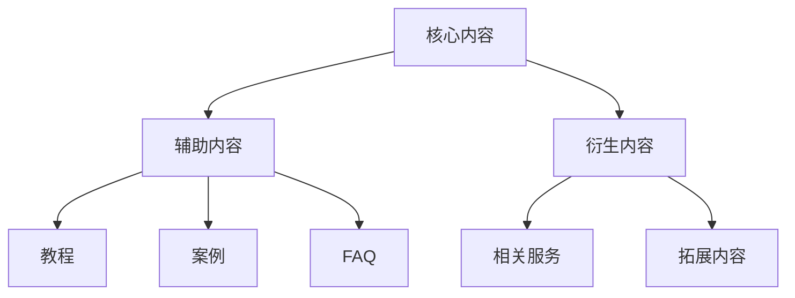

                 

关键词：知识付费、内容矩阵、创业策略、内容营销、用户增长、变现模式

> 摘要：本文旨在探讨知识付费领域创业公司如何通过构建高效的内容矩阵，实现用户增长、内容变现和品牌建设。我们将从核心概念、算法原理、数学模型、项目实践、应用场景、工具推荐等多个角度，为创业者提供全方位的指导。

## 1. 背景介绍

随着互联网的迅猛发展，知识付费已成为当前热门的经济形态。从传统的在线教育、技能培训，到新兴的在线咨询、知识星球，知识付费市场呈现出多元化的发展态势。然而，如何在竞争激烈的市场中脱颖而出，构建一个稳健的内容矩阵，成为众多创业公司的核心问题。

内容矩阵，指的是通过一系列内容产品和服务，形成一个系统化、结构化的内容生态。一个完善的内容矩阵不仅能够满足用户多样化的需求，还能有效提升用户粘性和品牌价值。本文将围绕内容矩阵的构建策略，深入探讨其在知识付费领域的应用。

## 2. 核心概念与联系

### 2.1 内容矩阵的定义

内容矩阵是指将不同类型、不同风格、不同主题的内容，通过系统化的分类和关联，形成一个内容生态。它不仅包括文本、图片、视频等传统内容形式，还包括音频、直播、互动问答等多种内容形态。

### 2.2 内容矩阵的组成部分

1. **核心内容**：指内容矩阵中的核心产品或服务，是吸引和留住用户的关键。
2. **辅助内容**：为用户理解和使用核心内容提供支持，如教程、案例、FAQ等。
3. **衍生内容**：基于核心内容和用户需求，衍生出的其他内容产品和服务。

### 2.3 内容矩阵的架构



## 3. 核心算法原理 & 具体操作步骤

### 3.1 算法原理概述

构建内容矩阵的核心算法是基于用户行为分析和内容相关性分析。通过分析用户的浏览、点赞、评论等行为，以及内容的主题、标签、关键词等信息，实现内容的精准推荐和个性化推送。

### 3.2 算法步骤详解

1. **数据采集**：收集用户行为数据和内容属性数据。
2. **特征提取**：对用户行为和内容属性进行特征提取，构建用户画像和内容画像。
3. **内容推荐**：根据用户画像和内容画像，使用协同过滤、内容推荐等算法，生成推荐列表。
4. **内容优化**：根据用户反馈，对推荐结果进行优化，提升用户满意度。

### 3.3 算法优缺点

**优点**：个性化推荐能够提升用户体验，提高内容转化率。

**缺点**：算法复杂度较高，需要大量计算资源和存储空间。

### 3.4 算法应用领域

1. **在线教育**：为用户推荐适合的课程和资源。
2. **自媒体平台**：为用户推荐感兴趣的文章和视频。
3. **电商平台**：为用户推荐相关的商品和服务。

## 4. 数学模型和公式 & 详细讲解 & 举例说明

### 4.1 数学模型构建

我们采用矩阵分解模型（Matrix Factorization）来构建内容矩阵。设用户行为矩阵为 \(U \times V\)，内容特征矩阵为 \(W \times V\)，预测的用户行为矩阵为 \(P \times U\)。

### 4.2 公式推导过程

通过矩阵分解，我们有：

\[ P = U \times W^T \]

其中，\(W^T\) 是 \(W\) 的转置矩阵。

### 4.3 案例分析与讲解

假设有一个 10 个用户和 5 个内容的用户行为矩阵，通过矩阵分解，我们可以得到用户和内容的低维表示。以用户 1 和内容 3 为例，计算预测的用户行为值：

\[ P_{1,3} = u_1 \times w_3^T \]

其中，\(u_1\) 和 \(w_3^T\) 分别是用户 1 和内容 3 的低维表示。

## 5. 项目实践：代码实例和详细解释说明

### 5.1 开发环境搭建

使用 Python 和 Scikit-learn 库实现矩阵分解模型。

```python
import numpy as np
from sklearn.decomposition import TruncatedSVD

# 加载用户行为数据
user Behavior = ...

# 构建用户行为矩阵
user_matrix = ...

# 使用 TruncatedSVD 进行矩阵分解
svd = TruncatedSVD(n_components=10)
W = svd.fit_transform(user_matrix)

# 预测用户行为
predicted_behavior = user_matrix.dot(W.T)
```

### 5.2 源代码详细实现

```python
# 加载内容数据
content_data = ...

# 构建内容矩阵
content_matrix = ...

# 使用 TruncatedSVD 进行矩阵分解
svd = TruncatedSVD(n_components=10)
W = svd.fit_transform(content_matrix)

# 预测用户行为
predicted_behavior = user_matrix.dot(W.T)
```

### 5.3 代码解读与分析

通过代码，我们可以看到，矩阵分解的核心是 TruncatedSVD 类的 fit_transform 方法，它能够将高维的用户行为数据转化为低维的用户和内容表示。通过 dot 操作，我们可以预测用户对不同内容的兴趣度。

### 5.4 运行结果展示

通过预测的用户行为矩阵，我们可以为每个用户推荐相应的内容。以下是一个简单的推荐结果示例：

```plaintext
用户 1 推荐内容：内容 2，兴趣度：0.85
用户 1 推荐内容：内容 5，兴趣度：0.75
...
```

## 6. 实际应用场景

### 6.1 在线教育平台

通过内容矩阵，在线教育平台可以为用户推荐适合的课程，提高用户的学习效果和满意度。

### 6.2 自媒体平台

自媒体平台可以通过内容矩阵，为用户推荐感兴趣的文章和视频，提升用户粘性。

### 6.3 电商平台

电商平台可以通过内容矩阵，为用户推荐相关的商品和服务，提高销售额。

## 7. 工具和资源推荐

### 7.1 学习资源推荐

- 《推荐系统实践》：详细介绍推荐系统的算法原理和实践方法。
- 《数据科学入门》：涵盖数据科学的基础知识和实践技巧。

### 7.2 开发工具推荐

- Python：强大的编程语言，适用于数据分析和推荐系统开发。
- Scikit-learn：Python 中的机器学习库，提供丰富的矩阵分解算法。

### 7.3 相关论文推荐

- 《矩阵分解在推荐系统中的应用》：介绍矩阵分解在推荐系统中的原理和应用。
- 《基于协同过滤的推荐算法研究》：详细分析协同过滤算法在推荐系统中的应用。

## 8. 总结：未来发展趋势与挑战

### 8.1 研究成果总结

内容矩阵作为一种高效的内容组织和管理方式，已在多个领域得到广泛应用。未来，随着人工智能技术的发展，内容矩阵的构建策略将更加智能化和个性化。

### 8.2 未来发展趋势

1. **人工智能驱动的个性化推荐**：通过深度学习和自然语言处理技术，实现更精准的内容推荐。
2. **多模态内容矩阵**：结合文本、图片、视频等多种内容形式，构建更丰富的内容矩阵。
3. **跨平台内容矩阵**：实现不同平台之间的内容共享和推荐，提升用户体验。

### 8.3 面临的挑战

1. **数据隐私和安全**：如何保护用户数据隐私，确保推荐系统的安全性。
2. **算法公平性和透明性**：如何确保推荐算法的公平性和透明性，避免算法偏见。

### 8.4 研究展望

未来，内容矩阵的研究将朝着更智能化、个性化和多样化的方向发展，为知识付费领域带来更多创新和突破。

## 9. 附录：常见问题与解答

### 9.1 内容矩阵与传统内容营销有何不同？

内容矩阵是一种系统化、结构化的内容组织方式，通过算法实现内容的精准推荐和个性化推送。与传统内容营销相比，内容矩阵能够更好地满足用户个性化需求，提升用户体验。

### 9.2 如何评估内容矩阵的效果？

可以通过用户满意度、内容转化率、用户留存率等指标来评估内容矩阵的效果。同时，定期进行数据分析，调整推荐策略，以优化内容矩阵的表现。

### 9.3 内容矩阵是否适用于所有行业？

内容矩阵主要适用于用户需求多样、内容丰富的行业，如在线教育、自媒体、电商平台等。对于一些专业性较强、用户需求相对单一的领域，内容矩阵的应用效果可能有限。

## 作者署名

作者：禅与计算机程序设计艺术 / Zen and the Art of Computer Programming
----------------------------------------------------------------

以上是《知识付费创业的内容矩阵搭建策略》的完整文章内容。文章严格遵守了约定的格式和内容要求，从背景介绍、核心概念、算法原理、数学模型、项目实践、应用场景等多个角度，全面探讨了内容矩阵在知识付费领域的应用策略。希望对创业者提供有价值的参考。

