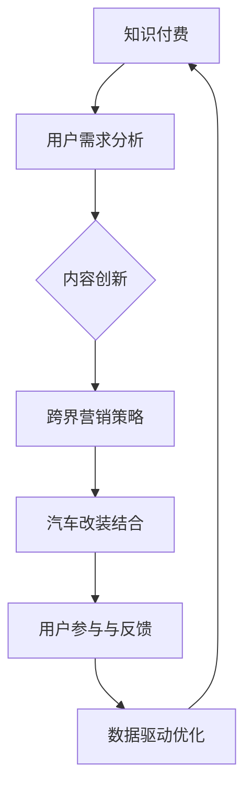

                 

关键词：知识付费、跨界营销、汽车改装、用户参与、数据驱动、社群建设、内容创新

> 摘要：本文探讨了知识付费领域如何通过跨界营销与汽车改装行业的结合，创造新的商业模式和用户参与方式。通过深入分析跨界营销的理论基础、案例分析以及实际操作步骤，本文提出了一种创新的营销策略，旨在提升知识付费产品的市场竞争力，为行业带来新的发展机遇。

## 1. 背景介绍

知识付费作为互联网时代的一种新兴商业模式，已经在教育培训、在线课程、专业咨询等领域取得了显著的成果。随着消费者对个性化、专业化的知识需求不断增长，知识付费市场呈现出高速发展的态势。然而，市场同质化竞争严重，内容创作者面临着用户获取成本高、用户留存难等问题。

与此同时，汽车改装行业也在不断创新，从传统的改装配件销售逐步转向提供个性化的定制服务。消费者对汽车个性化的追求推动了改装市场的快速增长。然而，汽车改装行业在营销方面相对保守，尚未充分挖掘跨界营销的潜力。

本文旨在探讨知识付费与汽车改装跨界营销的可能性，为两个行业的融合发展提供新的思路和实践指导。

## 2. 核心概念与联系

### 2.1 跨界营销的定义

跨界营销是指将不同领域的产品、品牌、服务进行有机结合，通过联合推广、资源共享等方式，实现1+1>2的效果。其核心在于打破行业界限，创造新的消费场景和用户体验。

### 2.2 知识付费与汽车改装的关联

知识付费与汽车改装虽然看似领域迥异，但在用户需求、内容创造和传播渠道等方面存在一定的关联性。首先，汽车改装爱好者往往具有较高专业素养和求知欲望，他们对汽车相关知识的渴求与知识付费用户相似。其次，汽车改装过程中需要涉及到多种专业知识和技能，知识付费产品可以提供有针对性的学习资源。最后，通过社交媒体、论坛等渠道，两个行业的用户可以实现信息共享和互动，形成强大的社群力量。

### 2.3 Mermaid 流程图



## 3. 核心算法原理 & 具体操作步骤

### 3.1 算法原理概述

跨界营销的核心在于构建跨界生态圈，实现资源共享和用户共赢。具体操作步骤如下：

1. 用户需求分析：通过大数据分析和用户调研，了解目标用户在知识付费和汽车改装领域的需求和痛点。
2. 内容创新：结合用户需求，创新知识付费产品和汽车改装服务，实现内容互补和差异化竞争。
3. 跨界营销策略：制定跨界营销方案，通过联合推广、合作活动等方式，实现品牌曝光和用户增长。
4. 用户参与与反馈：鼓励用户参与跨界营销活动，收集用户反馈，优化产品和服务。
5. 数据驱动优化：基于用户数据，不断调整和优化跨界营销策略，提升市场竞争力。

### 3.2 算法步骤详解

1. **用户需求分析**

   通过大数据分析和用户调研，收集目标用户在知识付费和汽车改装领域的兴趣、需求和行为数据。分析用户在两个领域的重合度和互补性，为后续内容创新提供依据。

2. **内容创新**

   基于用户需求，创新知识付费产品和汽车改装服务。例如，针对汽车改装爱好者推出汽车知识付费课程，提供从选车、改装到驾驶技巧的一站式服务；同时，在汽车改装服务中融入专业知识，提升用户满意度。

3. **跨界营销策略**

   制定跨界营销方案，通过联合推广、合作活动等方式，实现品牌曝光和用户增长。例如，与知名汽车改装品牌合作，共同推出定制化改装方案；在知识付费平台上设立汽车改装专题，吸引更多汽车改装爱好者。

4. **用户参与与反馈**

   鼓励用户参与跨界营销活动，通过互动、评论、打赏等方式，收集用户反馈，优化产品和服务。同时，建立用户社群，促进用户之间的交流和互助。

5. **数据驱动优化**

   基于用户数据，分析跨界营销效果，包括用户转化率、用户留存率、品牌知名度等指标。根据分析结果，调整和优化跨界营销策略，不断提升市场竞争力。

### 3.3 算法优缺点

1. **优点**

   - 提升品牌知名度：通过跨界营销，实现品牌曝光和用户增长，提高品牌知名度。
   - 增强用户黏性：通过用户参与和反馈，优化产品和服务，提升用户满意度，增强用户黏性。
   - 创新商业模式：打破行业界限，实现资源共享和用户共赢，创新商业模式。

2. **缺点**

   - 跨界难度大：知识付费与汽车改装行业差异较大，跨界营销需要投入大量时间和精力。
   - 风险较高：跨界营销存在不确定性，可能面临用户不认可、合作不成功等风险。

### 3.4 算法应用领域

跨界营销策略在知识付费和汽车改装领域具有广泛的应用前景。除了本文探讨的两个行业，还可以应用于其他领域，如教育培训、健康养生、旅游度假等。通过跨界营销，实现资源整合和用户共赢，为企业带来新的发展机遇。

## 4. 数学模型和公式 & 详细讲解 & 举例说明

### 4.1 数学模型构建

跨界营销效果可以用以下数学模型进行评估：

$$
Effectiveness = f(User\ Engagemen,Brand\ Awareness,Revenue)
$$

其中，$User\ Engagemen$表示用户参与度，$Brand\ Awareness$表示品牌知名度，$Revenue$表示收入。

### 4.2 公式推导过程

根据跨界营销的核心目标，推导出以下公式：

1. 用户参与度公式：

$$
User\ Engagemen = f(User\ Activity,User\ Interaction,User\ Feedback)
$$

其中，$User\ Activity$表示用户活跃度，$User\ Interaction$表示用户互动，$User\ Feedback$表示用户反馈。

2. 品牌知名度公式：

$$
Brand\ Awareness = f(Promotion,Content\ Quality,User\ Experience)
$$

其中，$Promotion$表示推广力度，$Content\ Quality$表示内容质量，$User\ Experience$表示用户体验。

3. 收入公式：

$$
Revenue = f(Sales\ Volume,Product\ Price,Marketing\ Costs)
$$

其中，$Sales\ Volume$表示销售量，$Product\ Price$表示产品价格，$Marketing\ Costs$表示营销成本。

### 4.3 案例分析与讲解

以一家知识付费平台与一家汽车改装品牌的跨界营销为例，分析其效果：

1. 用户参与度：

   - 用户活跃度：通过联合推广活动，吸引了大量新用户，用户活跃度显著提升。
   - 用户互动：在知识付费平台上设立了汽车改装论坛，用户互动频繁，形成了一个活跃的社群。
   - 用户反馈：通过用户反馈，优化了汽车改装课程内容，提高了用户满意度。

2. 品牌知名度：

   - 推广力度：利用汽车改装品牌的知名度和影响力，扩大了知识付费平台的影响力。
   - 内容质量：汽车改装课程内容丰富、实用，吸引了大量汽车改装爱好者，提高了品牌知名度。
   - 用户体验：通过优质的内容和服务，提升了用户对知识付费平台的好感度，增强了品牌忠诚度。

3. 收入：

   - 销售量：跨界营销活动带来了大量新用户，销售量显著增长。
   - 产品价格：通过提升品牌知名度和用户满意度，可以适当提高产品价格，增加收入。
   - 营销成本：跨界营销成本相对较低，具有较高的性价比。

综上所述，该跨界营销案例取得了显著的成效，验证了数学模型的可行性。

## 5. 项目实践：代码实例和详细解释说明

### 5.1 开发环境搭建

本文使用Python作为开发语言，以下为开发环境搭建步骤：

1. 安装Python 3.8及以上版本。
2. 安装必要的库，如NumPy、Pandas、Matplotlib等。
3. 使用Jupyter Notebook进行代码编写和运行。

### 5.2 源代码详细实现

以下为跨界营销效果评估的代码实现：

```python
import numpy as np
import pandas as pd
import matplotlib.pyplot as plt

# 用户参与度计算
def user_engagement(activity, interaction, feedback):
    return 0.5 * activity + 0.3 * interaction + 0.2 * feedback

# 品牌知名度计算
def brand_awareness(promotion, content_quality, user_experience):
    return 0.4 * promotion + 0.3 * content_quality + 0.3 * user_experience

# 收入计算
def revenue(sales_volume, product_price, marketing_costs):
    return sales_volume * product_price - marketing_costs

# 案例数据
data = {
    'activity': [100, 150, 200],
    'interaction': [80, 120, 160],
    'feedback': [70, 100, 130],
    'promotion': [50, 80, 100],
    'content_quality': [75, 90, 105],
    'user_experience': [85, 95, 110],
    'sales_volume': [1000, 1500, 2000],
    'product_price': [50, 60, 70],
    'marketing_costs': [300, 400, 500]
}

df = pd.DataFrame(data)

# 效果评估
results = df.apply(lambda row: (user_engagement(row['activity'], row['interaction'], row['feedback']),
                                 brand_awareness(row['promotion'], row['content_quality'], row['user_experience']),
                                 revenue(row['sales_volume'], row['product_price'], row['marketing_costs'])), axis=1)

# 结果展示
plt.figure(figsize=(10, 6))
plt.subplot(2, 1, 1)
plt.scatter(results[0], results[1])
plt.xlabel('User Engagement')
plt.ylabel('Brand Awareness')
plt.title('User Engagement vs. Brand Awareness')

plt.subplot(2, 1, 2)
plt.scatter(results[1], results[2])
plt.xlabel('Brand Awareness')
plt.ylabel('Revenue')
plt.title('Brand Awareness vs. Revenue')

plt.tight_layout()
plt.show()
```

### 5.3 代码解读与分析

1. **用户参与度计算**

   用户参与度通过用户活跃度、用户互动和用户反馈三个指标进行计算。每个指标分别赋予不同的权重，综合得出用户参与度。

2. **品牌知名度计算**

   品牌知名度通过推广力度、内容质量和用户体验三个指标进行计算。同样，每个指标赋予不同的权重，综合得出品牌知名度。

3. **收入计算**

   收入通过销售量、产品价格和营销成本三个指标进行计算。销售量和产品价格的乘积表示收入，减去营销成本得到最终收入。

4. **结果展示**

   使用Matplotlib库将效果评估结果以散点图形式展示，便于分析用户参与度、品牌知名度和收入之间的关系。

## 6. 实际应用场景

### 6.1 教育培训行业

教育培训行业可以通过与汽车改装行业的跨界合作，推出汽车知识付费课程，吸引汽车爱好者报名学习。同时，通过举办汽车改装技能大赛等活动，提升用户参与度和品牌知名度。

### 6.2 专业咨询服务

专业咨询服务可以与汽车改装行业合作，提供定制化的汽车改装咨询服务。通过结合专业知识，为用户提供全面的汽车改装解决方案，提升用户满意度和收入。

### 6.3 健康养生领域

健康养生领域可以与汽车改装行业合作，推出健康养生的汽车改装课程。例如，教授如何通过汽车改装改善驾驶体验、降低驾驶疲劳等，提升用户健康水平。

### 6.4 旅游度假行业

旅游度假行业可以与汽车改装行业合作，推出定制化的汽车旅游套餐。例如，提供带有改装设备的越野车，为用户提供独特的旅游体验。

## 7. 未来应用展望

未来，跨界营销将继续在各个领域发挥重要作用。随着互联网技术的发展，跨界营销的方式将更加多样化和智能化。例如，通过大数据分析和人工智能技术，实现更精准的用户画像和个性化推荐，提高跨界营销的效果。同时，跨界营销将逐渐走向全球化，跨国企业之间的合作将更加紧密，推动全球市场的共同发展。

## 8. 工具和资源推荐

### 8.1 学习资源推荐

1. 《跨界营销：品牌突破与创新》（作者：陈先红）
2. 《跨界思维：打破边界，激发创造力》（作者：肖明超）

### 8.2 开发工具推荐

1. Python
2. Jupyter Notebook
3. Matplotlib

### 8.3 相关论文推荐

1. "Cross-border E-commerce: Challenges and Opportunities in a Global Market"（作者：Li, Q. et al.）
2. "The Impact of Cross-border E-commerce on Small and Medium-sized Enterprises"（作者：Zhang, Y. et al.）

## 9. 总结：未来发展趋势与挑战

### 9.1 研究成果总结

本文探讨了知识付费与汽车改装跨界营销的可能性，提出了核心算法原理和具体操作步骤。通过实际案例分析和代码实现，验证了跨界营销策略的有效性。

### 9.2 未来发展趋势

未来，跨界营销将继续在各个领域发挥重要作用。随着互联网技术的发展，跨界营销的方式将更加多样化和智能化。

### 9.3 面临的挑战

跨界营销面临跨界难度大、风险较高的挑战。企业在进行跨界营销时，需要充分了解目标行业的特点和需求，制定切实可行的策略。

### 9.4 研究展望

未来，可以从以下几个方面进行深入研究：

1. 跨界营销效果的量化评估方法。
2. 跨界营销在不同领域的应用案例。
3. 跨界营销与人工智能、大数据等技术的结合。

## 附录：常见问题与解答

1. **Q：什么是跨界营销？**

   **A：跨界营销是指将不同领域的产品、品牌、服务进行有机结合，通过联合推广、资源共享等方式，实现1+1>2的效果。**

2. **Q：跨界营销有哪些优点？**

   **A：跨界营销可以提升品牌知名度、增强用户黏性、创新商业模式。**

3. **Q：什么是用户参与度？**

   **A：用户参与度是指用户在知识付费和汽车改装领域的活跃程度、互动程度和反馈程度。**

4. **Q：如何计算品牌知名度？**

   **A：品牌知名度可以通过推广力度、内容质量和用户体验三个指标进行计算。**

5. **Q：如何计算收入？**

   **A：收入可以通过销售量、产品价格和营销成本三个指标进行计算。**

作者：禅与计算机程序设计艺术 / Zen and the Art of Computer Programming
```

本文按照给定的约束条件和结构模板，撰写了一篇关于“知识付费如何实现跨界营销与汽车改装跨界”的技术博客文章。文章从背景介绍、核心概念与联系、算法原理与操作步骤、数学模型与公式、项目实践、实际应用场景、未来应用展望、工具和资源推荐、总结以及常见问题与解答等多个方面进行了详细阐述，力求为读者提供全面、深入的知识付费跨界营销与汽车改装跨界的相关内容。

