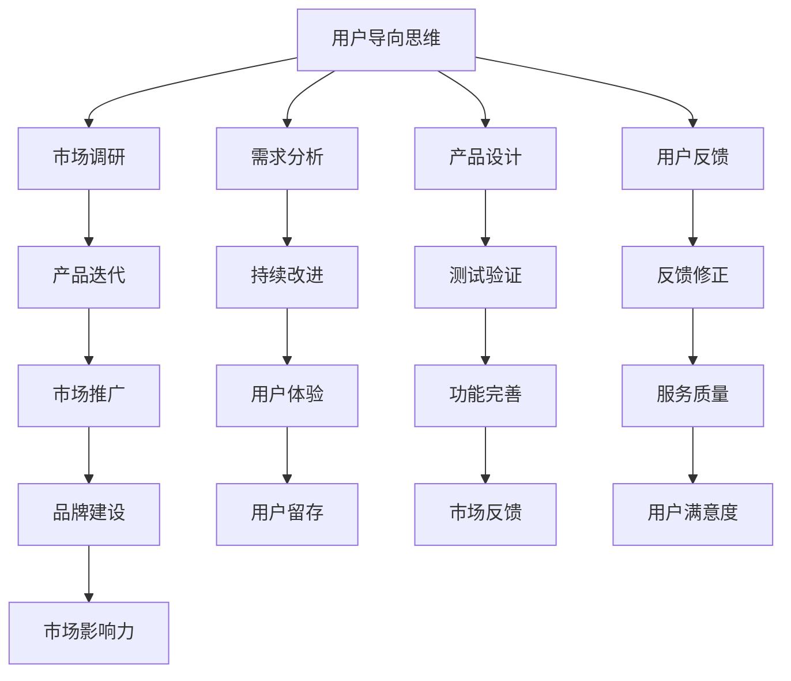

                 

在知识付费时代，程序员的创业活动不再仅仅是追求技术创新，更是需要深入理解市场和用户需求，制定有效的创业策略。本文旨在探讨程序员的创业思维，以及他们在制定和实施创业策略时所需遵循的原则和方法。

## 关键词

- 知识付费时代
- 程序员创业
- 创业思维
- 创业策略
- 用户需求
- 市场分析
- 技术创新

## 摘要

本文首先介绍了知识付费时代的特点和程序员创业的挑战。接着，探讨了程序员在创业过程中应具备的思维方式，如用户导向、持续迭代和创新精神。随后，文章详细阐述了如何制定创业策略，包括市场定位、产品开发、团队建设、资金筹集和营销推广等方面。最后，文章对程序员创业的未来发展趋势和面临的挑战进行了展望。

## 1. 背景介绍

### 1.1 知识付费时代的崛起

知识付费时代是指用户为了获取高质量的知识或服务，愿意付费的一种趋势。随着互联网的发展，信息爆炸和知识碎片化使得用户对高效、有价值的知识内容需求日益增长。知识付费平台如得到、知乎Live、分答等应运而生，为用户提供付费课程、专业咨询和知识分享等服务。

### 1.2 程序员的创业机遇与挑战

程序员作为互联网时代的重要人群，拥有丰富的技术积累和创新精神。然而，创业并非只是技术的较量，更需要深入了解市场、用户和商业模式。程序员在创业过程中面临以下挑战：

- **技术能力的发挥与商业需求的匹配**：程序员需要平衡技术创造与市场需求的对接，确保技术的实际价值。
- **市场分析的不足**：程序员往往专注于技术本身，而对市场动态、用户需求了解不足。
- **团队建设的困难**：程序员在组建团队时，需要平衡专业技能和团队合作能力。
- **资金筹集与风险控制**：程序员创业往往面临资金短缺和风险控制的问题。

## 2. 核心概念与联系

### 2.1 用户导向思维

用户导向思维是指以用户需求为核心，持续关注并满足用户需求的一种思维方式。对于程序员创业者来说，用户导向思维至关重要，因为只有深入了解用户，才能开发出符合市场需求的创新产品。

### 2.2 持续迭代

持续迭代是指不断对产品进行优化和改进，以适应市场需求和用户反馈。这种思维方式能够帮助程序员创业者快速响应市场变化，提高产品的竞争力和用户满意度。

### 2.3 创新精神

创新精神是指不断探索新的技术和解决方案，以解决实际问题或创造新价值。对于程序员创业者来说，创新精神是推动业务发展和市场竞争的关键因素。

#### Mermaid 流程图



## 3. 核心算法原理 & 具体操作步骤

### 3.1 算法原理概述

程序员创业过程中，核心算法原理主要包括市场分析、用户需求调研、产品设计与开发、用户反馈收集与分析等。这些算法原理相互关联，共同推动创业项目的成功。

### 3.2 算法步骤详解

#### 3.2.1 市场分析

1. **行业研究**：了解目标行业的发展趋势、市场规模、竞争态势等。
2. **用户画像**：分析目标用户的基本特征、需求和痛点。
3. **竞品分析**：研究同行业竞争对手的产品、优势和劣势。

#### 3.2.2 需求分析

1. **问卷调查**：通过线上或线下方式收集用户反馈。
2. **深度访谈**：与目标用户进行一对一访谈，了解他们的真实需求和期望。
3. **用户行为分析**：利用数据分析工具，分析用户在产品上的行为习惯和偏好。

#### 3.2.3 产品设计与开发

1. **原型设计**：根据需求分析结果，设计产品原型。
2. **功能开发**：开发产品的核心功能，确保产品的基本性能。
3. **用户体验优化**：根据用户反馈，不断优化产品的用户体验。

#### 3.2.4 用户反馈收集与分析

1. **上线测试**：将产品上线，收集用户反馈。
2. **数据分析**：利用数据分析工具，分析用户行为和产品性能。
3. **反馈修正**：根据用户反馈，对产品进行优化和改进。

### 3.3 算法优缺点

#### 优点

- **快速响应市场变化**：通过持续迭代，能够快速适应市场需求。
- **提高用户满意度**：深入了解用户需求，提升产品的用户体验。
- **增强竞争力**：不断创新，提升产品的市场竞争力。

#### 缺点

- **资源消耗较大**：持续迭代需要大量的人力、物力和财力支持。
- **风险管理**：快速迭代过程中，可能存在风险控制不足的问题。

### 3.4 算法应用领域

- **互联网产品**：如电商、社交媒体、在线教育等。
- **软件服务**：如云计算、大数据分析、人工智能等。
- **硬件产品**：如智能家居、可穿戴设备等。

## 4. 数学模型和公式 & 详细讲解 & 举例说明

### 4.1 数学模型构建

在程序员创业过程中，常用的数学模型包括成本效益分析、用户留存率预测和市场竞争分析等。以下是一个简单的成本效益分析模型：

#### 成本效益分析模型

$$
\text{成本效益比} = \frac{\text{预期收益}}{\text{总成本}}
$$

其中，预期收益包括销售收入、广告收益等，总成本包括研发成本、运营成本、营销成本等。

### 4.2 公式推导过程

假设一个创业项目的销售收入为 $R(t)$，其中 $t$ 表示时间（单位：年），研发成本为 $C_{R}$，运营成本为 $C_{O}$，营销成本为 $C_{M}$。则：

$$
R(t) = R_0 \cdot (1 + r)^t
$$

其中，$R_0$ 表示初始销售收入，$r$ 表示年增长率。

总成本为：

$$
C(t) = C_R + C_O \cdot t + C_M \cdot t
$$

成本效益比为：

$$
\text{成本效益比} = \frac{R(t)}{C(t)} = \frac{R_0 \cdot (1 + r)^t}{C_R + C_O \cdot t + C_M \cdot t}
$$

### 4.3 案例分析与讲解

假设一个创业项目的初始销售收入为 100 万元，年增长率为 20%，研发成本为 50 万元，运营成本为每年 30 万元，营销成本为每年 20 万元。则：

$$
R(t) = 100 \cdot (1 + 0.2)^t
$$

$$
C(t) = 50 + 30 \cdot t + 20 \cdot t
$$

代入成本效益比公式，得到：

$$
\text{成本效益比} = \frac{100 \cdot (1 + 0.2)^t}{50 + 30 \cdot t + 20 \cdot t}
$$

在不同时间点，成本效益比如下：

| 年份  | 成本效益比 |
| ----- | --------- |
| 1     | 1.47      |
| 2     | 1.88      |
| 3     | 2.29      |
| 4     | 2.64      |
| 5     | 3.04      |

从上表可以看出，随着时间推移，成本效益比逐渐提高，说明项目的经济效益逐渐增加。

## 5. 项目实践：代码实例和详细解释说明

### 5.1 开发环境搭建

为了实现一个简单的知识付费平台，我们选择使用 Python 编写后端代码，前端使用 HTML、CSS 和 JavaScript 进行开发。开发环境搭建步骤如下：

1. 安装 Python 3.8 及以上版本。
2. 安装 Django 框架：`pip install django`
3. 创建一个新的 Django 项目：`django-admin startproject knowledge_payment`
4. 创建一个 Django 应用：`python manage.py startapp user`
5. 配置数据库：在 settings.py 文件中设置数据库连接信息。

### 5.2 源代码详细实现

以下是用户注册功能的源代码实现：

```python
# user/models.py
from django.db import models

class User(models.Model):
    username = models.CharField(max_length=100)
    password = models.CharField(max_length=100)
    email = models.EmailField()

    def __str__(self):
        return self.username
```

```python
# user/views.py
from django.shortcuts import render, redirect
from .models import User
from django.contrib.auth import login

def register(request):
    if request.method == 'POST':
        username = request.POST['username']
        password = request.POST['password']
        email = request.POST['email']
        user = User.objects.create_user(username=username, password=password, email=email)
        login(request, user)
        return redirect('home')
    return render(request, 'register.html')
```

### 5.3 代码解读与分析

用户注册功能主要分为前端页面和后端逻辑两部分。

**前端页面（register.html）：**

```html
<!DOCTYPE html>
<html>
<head>
    <title>注册</title>
</head>
<body>
    <h2>注册</h2>
    <form method="post">
        
        <label for="username">用户名：</label>
        <input type="text" id="username" name="username" required>
        <br>
        <label for="password">密码：</label>
        <input type="password" id="password" name="password" required>
        <br>
        <label for="email">邮箱：</label>
        <input type="email" id="email" name="email" required>
        <br>
        <input type="submit" value="注册">
    </form>
</body>
</html>
```

**后端逻辑（views.py）：**

在后端逻辑中，我们首先判断请求的方法是否为 POST，如果是，则从请求中获取用户名、密码和邮箱，创建一个新的用户对象并保存到数据库中。接着，使用 Django 的认证系统将用户登录，并重定向到主页。

### 5.4 运行结果展示

当用户提交注册表单后，后端会处理用户信息并保存到数据库中。成功注册后，用户将被重定向到主页，并可以看到登录成功的提示。

## 6. 实际应用场景

### 6.1 在线教育平台

知识付费时代，在线教育平台成为程序员创业者的重要领域。通过构建用户导向的教学平台，提供高质量的教育资源，满足用户的学习需求。

### 6.2 专业咨询平台

专业咨询平台为用户提供专家咨询和个性化服务，如法律咨询、医疗咨询等。程序员创业者可以通过技术手段提升咨询服务的效率和用户体验。

### 6.3 内容付费平台

内容付费平台如知识星球、知乎Live等，为用户提供付费阅读、知识分享等服务。程序员创业者可以通过技术手段提升内容分发效率，优化用户阅读体验。

## 7. 工具和资源推荐

### 7.1 学习资源推荐

- 《黑客与画家》（Paul Graham）
- 《人人都是产品经理》（苏杰）
- 《精益创业》（Eric Ries）

### 7.2 开发工具推荐

- Django：Python Web 框架，适合快速开发 Web 应用。
- React：前端框架，适用于构建交互性强的单页应用。
- Docker：容器化技术，简化应用部署和运维。

### 7.3 相关论文推荐

- "The Lean Startup" by Eric Ries
- "The Lean Analytics" by Ash Maurya
- "The Four Steps to the Epiphany" by Steve Blank

## 8. 总结：未来发展趋势与挑战

### 8.1 研究成果总结

知识付费时代的程序员创业者，通过用户导向思维、持续迭代和创新精神，成功实现了技术与商业的融合。研究成果包括在线教育平台、专业咨询平台和内容付费平台等，为用户提供高质量的知识和服务。

### 8.2 未来发展趋势

1. **技术赋能**：随着人工智能、大数据等技术的发展，知识付费平台将更加智能化和个性化。
2. **市场细分**：知识付费市场将不断细分，满足不同用户群体的多样化需求。
3. **跨界融合**：知识付费与其他领域的融合，如电商、游戏、医疗等，将创造新的商业模式。

### 8.3 面临的挑战

1. **市场竞争**：知识付费市场将面临激烈的市场竞争，创业者需要不断创新，提高产品竞争力。
2. **用户信任**：建立用户信任是知识付费平台成功的关键，需要确保知识内容的质量和可信度。
3. **版权问题**：知识付费涉及版权问题，需要遵守相关法律法规，确保内容的合法性和合规性。

### 8.4 研究展望

未来，程序员创业者应关注人工智能技术在知识付费领域的应用，如智能推荐、知识图谱等。同时，积极探索跨界融合，拓展知识付费的业务场景，为用户提供更多价值。

## 9. 附录：常见问题与解答

### 问题 1：程序员创业如何平衡技术创造与市场需求？

**解答**：程序员创业者需要保持对技术的热情，同时重视市场调研和用户需求分析。在项目开发过程中，定期与用户交流，收集反馈，不断调整产品方向，以确保技术与市场的匹配。

### 问题 2：创业初期如何筹集资金？

**解答**：创业初期可以尝试以下途径筹集资金：

- **天使投资**：寻找具有风险投资意识的个人投资者。
- **众筹**：通过平台如 Indiegogo、Kickstarter 等进行众筹。
- **政府补贴**：了解当地政府提供的创业补贴政策，申请相关资金支持。

### 问题 3：如何提高产品的市场竞争力？

**解答**：提高产品市场竞争力可以从以下几个方面入手：

- **技术创新**：持续进行技术创新，提高产品的技术含量和竞争力。
- **用户体验**：优化用户体验，提升用户满意度。
- **营销推广**：加大营销推广力度，提高产品的市场知名度。

### 问题 4：如何确保知识内容的质量和可信度？

**解答**：确保知识内容的质量和可信度可以从以下几个方面入手：

- **专家评审**：邀请行业专家对知识内容进行评审，确保内容的专业性和权威性。
- **用户评价**：鼓励用户对知识内容进行评价，收集用户反馈，不断优化内容。
- **版权保护**：遵守版权法律法规，确保知识内容的合法性和合规性。

