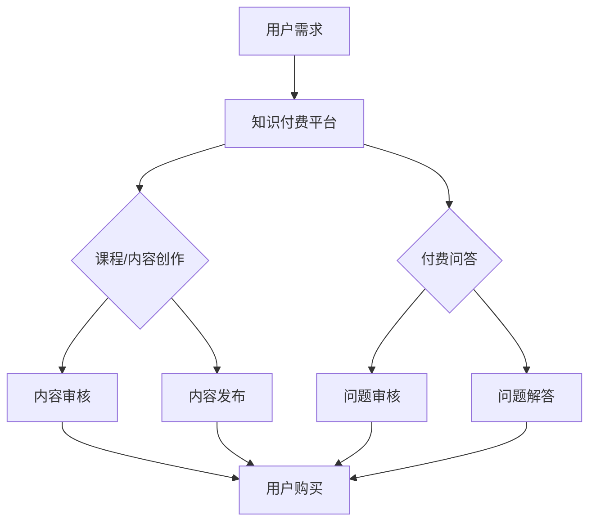

                 

在当今这个知识付费的时代，程序员无疑站在了技术的风口浪尖。然而，如何在这个充满竞争的领域找到自己的立足点，实现财富的增长，是一个值得深思的问题。本文将探讨知识付费时代程序员的致富之路，从多个角度分析如何在这个时代实现财务自由。

## 文章关键词

- 知识付费
- 程序员
- 财富增长
- 技术能力
- 个人品牌
- 创业机会

## 文章摘要

本文旨在探讨知识付费时代，程序员如何通过提升自身技术能力、构建个人品牌、抓住创业机会等方式实现财富增长。我们将深入分析程序员在知识付费时代的职业发展路径，并给出具体可行的建议。

## 1. 背景介绍

### 1.1 知识付费时代的到来

知识付费时代的到来，源于互联网的普及和信息爆炸。在这个时代，人们对于知识和信息的获取方式发生了翻天覆地的变化。传统的知识获取渠道，如书籍、讲座、课程等，逐渐被在线教育、知识付费平台所取代。人们可以通过付费的方式，迅速获取高质量的知识和技能，实现自我提升。

### 1.2 程序员职业的特点

程序员作为知识付费时代的重要受益者，具有以下特点：

1. 技术门槛高：程序员需要具备深厚的计算机专业知识，掌握多种编程语言和框架。
2. 更新速度快：随着技术的不断发展，程序员需要不断学习新知识，以适应市场需求。
3. 创造价值高：程序员通过编写代码，可以直接创造价值，推动社会进步。
4. 灵活性强：程序员可以根据市场需求，选择不同的项目和工作方式，实现职业发展。

## 2. 核心概念与联系

### 2.1 知识付费的概念

知识付费是指用户通过支付一定费用，获取知识服务或内容的行为。在知识付费时代，用户可以通过购买课程、订阅专栏、付费问答等方式，获取高质量的知识和技能。

### 2.2 程序员与知识付费的关系

程序员与知识付费的关系体现在以下几个方面：

1. **付费课程的学习**：程序员可以通过付费课程，学习新的技术和编程语言，提升自身技能。
2. **知识付费平台的推广**：程序员可以成为知识付费平台的讲师，通过授课获得收入。
3. **付费内容的创作**：程序员可以通过创作技术博客、编写技术书籍等方式，分享知识，获得知识付费的机会。

### 2.3 知识付费时代的 Mermaid 流程图



## 3. 核心算法原理 & 具体操作步骤

### 3.1 算法原理概述

在知识付费时代，程序员的财富增长主要依赖于以下几个方面：

1. **技术能力提升**：通过不断学习，掌握前沿技术，提升自身竞争力。
2. **个人品牌建设**：通过在社交媒体、技术社区等平台展示个人技术能力，建立个人品牌。
3. **知识付费项目**：参与付费课程、知识付费平台项目等，获得收入。
4. **创业机会**：抓住知识付费的风口，创业实现财务自由。

### 3.2 算法步骤详解

1. **技术能力提升**：

   - **定期学习**：制定学习计划，定期学习新的技术和编程语言。
   - **实践项目**：参与开源项目，提升实战能力。
   - **技术分享**：在技术社区、博客等平台分享技术心得，提升知名度。

2. **个人品牌建设**：

   - **社交媒体运营**：在微博、知乎等平台发布技术文章，分享经验。
   - **技术社区活跃**：在GitHub、Stack Overflow等平台积极参与讨论。
   - **线上讲座**：通过直播、录播等方式，分享技术知识和经验。

3. **知识付费项目**：

   - **成为讲师**：在知识付费平台开设课程，分享技术知识。
   - **付费咨询**：提供技术咨询服务，解决用户问题。
   - **内容创作**：编写技术书籍、博客文章等，分享知识。

4. **创业机会**：

   - **项目孵化**：抓住知识付费的风口，孵化自己的项目。
   - **技术外包**：为企业提供技术解决方案，获得收入。
   - **技术培训**：为企业提供技术培训，提升企业员工的技能。

### 3.3 算法优缺点

#### 优点：

1. **技术能力提升**：通过学习，不断提升自身技术能力，提升竞争力。
2. **个人品牌建设**：通过分享和交流，建立个人品牌，提升知名度。
3. **知识付费项目**：获得额外的收入来源。
4. **创业机会**：抓住知识付费的风口，实现财务自由。

#### 缺点：

1. **学习成本高**：需要投入大量的时间和精力进行学习。
2. **市场竞争激烈**：知识付费市场竞争激烈，需要不断提升自身竞争力。
3. **创业风险**：创业过程中存在风险，需要谨慎评估。

### 3.4 算法应用领域

1. **在线教育**：程序员可以通过开设在线课程，分享技术知识，获得收入。
2. **技术咨询**：程序员可以通过提供技术咨询服务，解决用户问题，获得收入。
3. **内容创作**：程序员可以通过编写技术书籍、博客文章等方式，分享知识，获得收入。
4. **创业**：程序员可以通过创业，抓住知识付费的风口，实现财务自由。

## 4. 数学模型和公式 & 详细讲解 & 举例说明

### 4.1 数学模型构建

在知识付费时代，程序员的收入可以看作是一个数学模型。我们可以将程序员的收入分为两部分：固定收入和浮动收入。

#### 固定收入：

$$
R_f = T \times S
$$

其中，$R_f$ 表示固定收入，$T$ 表示工作时间，$S$ 表示单位时间的收入。

#### 浮动收入：

$$
R_v = C \times P
$$

其中，$R_v$ 表示浮动收入，$C$ 表示项目数量，$P$ 表示单位项目的收入。

#### 总收入：

$$
R = R_f + R_v
$$

其中，$R$ 表示总收入。

### 4.2 公式推导过程

固定收入是通过工作时间和单位时间的收入计算得出的。浮动收入是通过项目数量和单位项目的收入计算得出的。总收入是固定收入和浮动收入的总和。

### 4.3 案例分析与讲解

假设程序员每天工作8小时，单位时间的收入为100元。一年中，他参与了10个项目，每个项目的收入为5000元。那么，他的年收入为：

$$
R_f = 8 \times 365 \times 100 = 292,000 \text{元}
$$

$$
R_v = 10 \times 5000 = 50,000 \text{元}
$$

$$
R = R_f + R_v = 292,000 + 50,000 = 342,000 \text{元}
$$

在这个案例中，程序员的年收入为342,000元。

## 5. 项目实践：代码实例和详细解释说明

### 5.1 开发环境搭建

在开始项目实践之前，我们需要搭建一个基本的开发环境。这里以Python为例，介绍如何搭建开发环境。

1. **安装Python**：从Python官网下载Python安装包，并安装到本地计算机。
2. **安装IDE**：安装一个Python集成开发环境（如PyCharm、VSCode等）。
3. **安装依赖库**：在Python中，我们需要安装一些常用的依赖库，如requests、BeautifulSoup等。

### 5.2 源代码详细实现

以下是一个简单的Python爬虫示例，用于爬取某个网站的文章内容。

```python
import requests
from bs4 import BeautifulSoup

# 发送HTTP请求
url = 'https://www.example.com'
response = requests.get(url)

# 解析HTML内容
soup = BeautifulSoup(response.text, 'html.parser')

# 获取文章标题
title = soup.find('h1').text

# 获取文章内容
content = soup.find('div', {'class': 'content'}).text

# 打印文章标题和内容
print(f'标题：{title}')
print(f'内容：{content}')
```

### 5.3 代码解读与分析

上述代码实现了一个简单的爬虫，用于获取网站的文章标题和内容。

- 第一行：引入requests库，用于发送HTTP请求。
- 第二行：引入BeautifulSoup库，用于解析HTML内容。
- 第四行：发送HTTP GET请求，获取网站内容。
- 第六行：使用BeautifulSoup解析HTML内容。
- 第八行：获取文章标题。
- 第九行：获取文章内容。
- 第十一行：打印文章标题和内容。

### 5.4 运行结果展示

运行上述代码，我们可以在控制台看到爬取到的文章标题和内容。

```
标题：Python爬虫实战
内容：本文介绍了Python爬虫的基本原理和实战技巧，包括如何发送HTTP请求、如何解析HTML内容、如何存储爬取的数据等。
```

## 6. 实际应用场景

### 6.1 知识付费平台

知识付费平台是程序员实现财富增长的重要渠道。程序员可以通过以下方式在知识付费平台获利：

- **开设在线课程**：分享自己的技术知识和经验，开设在线课程，通过学员的付费学习获得收入。
- **提供付费咨询服务**：针对技术问题，提供付费咨询服务，帮助用户解决技术难题。
- **编写技术书籍**：将自身的知识体系整理成书，通过出版获得收入。

### 6.2 技术社区

技术社区是程序员展示个人技术能力，建立个人品牌的重要平台。程序员可以通过以下方式在技术社区实现财富增长：

- **撰写技术文章**：在技术社区发布高质量的技术文章，吸引读者关注，提升知名度。
- **参与开源项目**：参与开源项目，提升实战能力，增加个人技术影响力。
- **组织技术活动**：组织技术沙龙、讲座等活动，吸引业界人士参与，提升个人品牌。

### 6.3 创业

创业是程序员实现财富增长的一种方式。程序员可以通过以下方式创业：

- **技术培训**：为企业提供技术培训服务，提升企业员工的技能。
- **技术咨询**：为企业提供技术咨询服务，解决企业面临的技术难题。
- **技术开发**：开发自己的技术产品，实现商业化。

## 7. 未来应用展望

### 7.1 技术发展趋势

随着人工智能、大数据、云计算等技术的快速发展，程序员将面临更多的机遇和挑战。未来的程序员需要具备以下能力：

- **跨学科知识**：具备跨学科的知识，如数据分析、机器学习等。
- **创新思维**：具备创新思维，能够应对快速变化的技术环境。
- **团队协作**：具备良好的团队协作能力，能够与团队成员共同推动项目进展。

### 7.2 财富增长机会

未来的知识付费市场将更加繁荣，程序员可以通过以下方式实现财富增长：

- **内容创作**：创作高质量的技术内容，分享知识和经验，吸引粉丝和用户。
- **在线教育**：开设在线课程，分享自己的技术知识和经验，获得收入。
- **技术创业**：抓住知识付费的风口，创业实现财务自由。

## 8. 工具和资源推荐

### 8.1 学习资源推荐

- **在线课程平台**：Coursera、Udacity、edX等。
- **技术社区**：GitHub、Stack Overflow、CSDN等。
- **技术博客**：JQuery、React、Vue等。

### 8.2 开发工具推荐

- **集成开发环境**：PyCharm、VSCode、IntelliJ IDEA等。
- **代码管理工具**：Git、GitHub、GitLab等。
- **版本控制工具**：SVN、Git等。

### 8.3 相关论文推荐

- **深度学习**：《Deep Learning》（Goodfellow, Bengio, Courville著）。
- **人工智能**：《Artificial Intelligence: A Modern Approach》（Russell, Norvig著）。
- **大数据**：《Big Data: A Revolution That Will Transform How We Live, Work, and Think》（Vikas Snajay著）。

## 9. 总结：未来发展趋势与挑战

### 9.1 研究成果总结

知识付费时代为程序员提供了丰富的机会，包括在线教育、技术咨询、内容创作等。通过提升自身技术能力、构建个人品牌、抓住创业机会，程序员可以实现财富增长。

### 9.2 未来发展趋势

1. **技术能力要求提升**：未来的程序员需要具备跨学科的知识和技能，能够应对快速变化的技术环境。
2. **个人品牌建设重要**：个人品牌将越来越成为程序员职业发展的重要推动力。
3. **创业机会增加**：知识付费为程序员提供了更多的创业机会，创业者可以通过技术创新实现财务自由。

### 9.3 面临的挑战

1. **市场竞争激烈**：知识付费市场竞争激烈，程序员需要不断提升自身竞争力。
2. **技术更新速度快**：程序员需要不断学习新知识，以适应市场需求。
3. **创业风险**：创业过程中存在风险，需要谨慎评估。

### 9.4 研究展望

未来的研究可以关注以下几个方面：

1. **知识付费模式创新**：探索新的知识付费模式，提高用户满意度。
2. **技术能力培养**：研究如何更有效地培养程序员的技术能力。
3. **创业环境优化**：为创业者提供更好的创业环境，降低创业风险。

## 10. 附录：常见问题与解答

### 10.1 程序员如何提升自身技术能力？

**解答**：程序员可以通过以下方式提升自身技术能力：

1. **学习新技术**：关注技术发展趋势，学习新的编程语言、框架和工具。
2. **实践项目**：参与开源项目，提升实战能力。
3. **阅读技术书籍**：阅读技术书籍，系统地学习编程知识。
4. **参加技术会议**：参加技术会议，了解行业动态。

### 10.2 程序员如何在知识付费平台获利？

**解答**：程序员可以通过以下方式在知识付费平台获利：

1. **开设在线课程**：分享自己的技术知识和经验，开设在线课程。
2. **提供付费咨询服务**：针对技术问题，提供付费咨询服务。
3. **编写技术书籍**：将自身的知识体系整理成书，通过出版获得收入。

### 10.3 程序员如何创业？

**解答**：程序员可以通过以下方式创业：

1. **确定创业方向**：根据自身兴趣和市场需求，确定创业方向。
2. **组建团队**：招募志同道合的团队成员，共同推进项目。
3. **寻找投资**：寻找投资，获得创业资金支持。
4. **持续迭代**：不断优化产品，提升用户体验。

本文旨在为程序员在知识付费时代提供致富之路的参考。通过提升自身技术能力、构建个人品牌、抓住创业机会，程序员可以实现财富增长。然而，实现这一目标需要持续的学习和实践，以及坚定的决心。希望本文能为您的职业发展提供一些启示。作者：禅与计算机程序设计艺术 / Zen and the Art of Computer Programming
----------------------------------------------------------------

### 结束语 Conclusion

通过本文的探讨，我们清晰地了解了在知识付费时代，程序员如何通过提升自身技术能力、构建个人品牌、抓住创业机会等多种方式实现财富增长。在这个过程中，程序员不仅需要不断学习新技术，提升自身竞争力，还需要善于利用各种平台和资源，展示自己的专业能力和价值。同时，创业也是一个值得探索的途径，但需要谨慎评估风险，制定详细的创业计划。

未来，随着技术的不断进步，程序员将面临更多的机遇和挑战。如何在这场技术革命中保持领先地位，实现财富增长，是每一个程序员都需要思考的问题。希望本文能为您的职业发展提供一些有益的启示和方向。

最后，感谢您阅读本文，希望您能在知识付费时代找到属于自己的致富之路，实现财务自由。作者：禅与计算机程序设计艺术 / Zen and the Art of Computer Programming。再次感谢！

