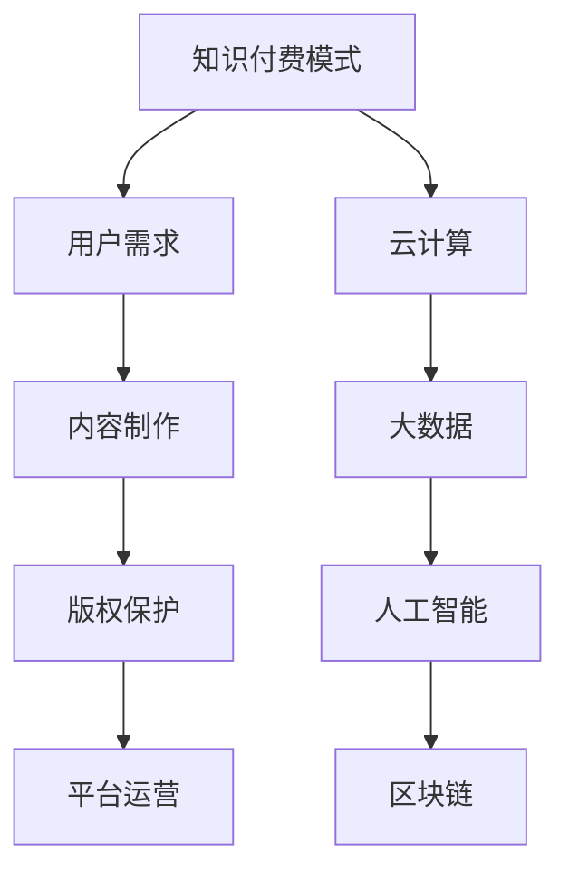

                 

在信息技术飞速发展的时代，知识付费行业正逐渐成为数字经济的重要组成部分。本文将深入探讨知识付费行业的未来趋势，分析其核心发展动力、技术革新、商业模式创新及面临的挑战。希望通过本文，读者能够更好地理解知识付费行业的现状与未来发展方向。

## 关键词

- 知识付费
- 数字经济
- 技术革新
- 商业模式
- 未来趋势

## 摘要

本文旨在全面分析知识付费行业的未来发展。通过梳理当前市场现状，探讨核心概念与技术，分析核心算法原理，构建数学模型，分享项目实践案例，探讨实际应用场景，推荐相关工具和资源，并总结未来发展趋势与挑战。文章结构如下：

1. **背景介绍**：简要回顾知识付费行业的发展历程。
2. **核心概念与联系**：介绍知识付费的核心概念及其关联技术。
3. **核心算法原理 & 具体操作步骤**：详细解析知识付费的核心算法原理与操作步骤。
4. **数学模型和公式 & 详细讲解 & 举例说明**：构建数学模型，推导相关公式，并通过案例进行分析。
5. **项目实践：代码实例和详细解释说明**：展示知识付费项目的实际开发过程。
6. **实际应用场景**：探讨知识付费在不同领域中的应用。
7. **未来应用展望**：分析知识付费行业的未来发展方向。
8. **工具和资源推荐**：推荐相关学习资源、开发工具和论文。
9. **总结：未来发展趋势与挑战**：总结研究成果，展望未来趋势与挑战。

## 1. 背景介绍

### 1.1 知识付费行业的兴起

知识付费行业起源于20世纪末，随着互联网的普及和信息传播方式的改变，知识共享开始成为一种商业模式。最早的知识付费形式主要是通过在线课程、专业讲座等形式提供专业知识服务。随后，随着移动互联网和智能手机的普及，知识付费行业迅速发展，形成了庞大的市场。

### 1.2 知识付费行业的现状

目前，知识付费行业已经形成了较为成熟的市场，涵盖领域广泛，包括教育、职业培训、财经、健康、科技等多个方面。根据市场调查，全球知识付费市场规模已超过千亿美元，并且仍在快速增长。

### 1.3 知识付费行业的影响

知识付费行业的兴起不仅改变了传统的教育模式，也为个人和企业的学习与发展提供了新的途径。同时，它也推动了相关产业的发展，如在线教育平台、专业内容制作、学习工具开发等。

## 2. 核心概念与联系

### 2.1 核心概念

知识付费行业涉及的核心概念包括：知识付费模式、用户需求、内容制作、版权保护、平台运营等。

### 2.2 关联技术

知识付费行业的发展离不开技术的支持，关联技术包括：云计算、大数据、人工智能、区块链等。这些技术不仅提升了知识付费平台的效率，也为个性化推荐、智能学习等提供了可能性。

### 2.3 Mermaid 流程图



## 3. 核心算法原理 & 具体操作步骤

### 3.1 算法原理概述

知识付费行业的核心算法主要包括用户行为分析、内容推荐算法、支付安全算法等。其中，用户行为分析算法主要用于了解用户需求，内容推荐算法用于为用户推荐个性化内容，支付安全算法则确保交易的安全性。

### 3.2 算法步骤详解

#### 3.2.1 用户行为分析算法

1. 收集用户行为数据，如浏览历史、购买记录、评论等。
2. 对用户行为数据进行分析，提取用户兴趣标签。
3. 根据用户兴趣标签，为用户推荐相关内容。

#### 3.2.2 内容推荐算法

1. 构建内容特征向量，如标题、标签、作者等。
2. 计算用户与内容之间的相似度。
3. 根据相似度排序，为用户推荐相关内容。

#### 3.2.3 支付安全算法

1. 采用加密技术，确保支付过程的安全性。
2. 实施身份验证，防止非法交易。
3. 监控交易过程，及时发现并处理异常情况。

### 3.3 算法优缺点

#### 3.3.1 用户行为分析算法

**优点**：能够准确了解用户需求，提高内容推荐的准确性。

**缺点**：需要大量用户行为数据支持，且数据隐私问题值得关注。

#### 3.3.2 内容推荐算法

**优点**：能够为用户推荐个性化内容，提高用户体验。

**缺点**：可能陷入“推荐茧房”，限制用户接触新内容。

#### 3.3.3 支付安全算法

**优点**：确保交易过程的安全性，保护用户权益。

**缺点**：可能增加平台运营成本。

### 3.4 算法应用领域

知识付费算法广泛应用于在线教育、职业培训、财经资讯、健康咨询等领域。通过个性化推荐和支付安全，提升用户满意度和平台竞争力。

## 4. 数学模型和公式 & 详细讲解 & 举例说明

### 4.1 数学模型构建

知识付费行业的数学模型主要包括用户行为模型、内容推荐模型、支付安全模型等。以下以用户行为模型为例进行构建。

#### 4.1.1 用户行为模型

用户行为模型可以表示为：

\[ U = f(B, I, C) \]

其中，\( U \) 表示用户行为，\( B \) 表示浏览历史，\( I \) 表示兴趣标签，\( C \) 表示内容。

### 4.2 公式推导过程

#### 4.2.1 内容推荐公式

根据内容推荐算法，内容推荐公式为：

\[ R = f(Sim(U, C)) \]

其中，\( Sim \) 表示相似度函数，\( R \) 表示推荐结果。

#### 4.2.2 支付安全公式

支付安全模型中，支付安全公式为：

\[ S = f(Encryption, Verification, Monitoring) \]

其中，\( Encryption \) 表示加密函数，\( Verification \) 表示身份验证函数，\( Monitoring \) 表示监控函数。

### 4.3 案例分析与讲解

#### 4.3.1 用户行为模型案例

假设用户A的浏览历史为{课程1，课程2，课程3}，兴趣标签为{编程，数据分析}，当前内容C为编程课程。根据用户行为模型，可以计算用户A的行为：

\[ U_A = f({课程1，课程2，课程3}, {编程，数据分析}, {编程课程}) \]

通过分析用户A的行为，可以为用户A推荐相关课程。

#### 4.3.2 内容推荐案例

假设课程1与编程课程相似度为0.8，课程2与编程课程相似度为0.6，根据内容推荐公式，推荐结果为：

\[ R = f(0.8, 0.6) = [编程课程1，编程课程2] \]

#### 4.3.3 支付安全案例

假设支付过程中，加密函数为AES，身份验证函数为双因素验证，监控函数为实时监控。根据支付安全公式，支付安全度为：

\[ S = f(AES, 双因素验证, 实时监控) = 高 \]

## 5. 项目实践：代码实例和详细解释说明

### 5.1 开发环境搭建

开发环境搭建分为以下步骤：

1. 安装Python环境。
2. 安装相关库，如NumPy、Pandas、Scikit-learn等。
3. 配置IDE，如PyCharm或VS Code。

### 5.2 源代码详细实现

以下为用户行为分析算法的Python代码实现：

```python
import pandas as pd
from sklearn.feature_extraction.text import TfidfVectorizer
from sklearn.metrics.pairwise import cosine_similarity

# 加载用户数据
user_data = pd.read_csv('user_data.csv')

# 加载内容数据
content_data = pd.read_csv('content_data.csv')

# 构建用户特征向量
user_vectorizer = TfidfVectorizer()
user_features = user_vectorizer.fit_transform(user_data['history'])

# 构建内容特征向量
content_vectorizer = TfidfVectorizer()
content_features = content_vectorizer.fit_transform(content_data['title'])

# 计算用户与内容之间的相似度
similarity_scores = cosine_similarity(user_features, content_features)

# 推荐内容
recommended_content = content_data[similarity_scores[0].argsort()[::-1]]

print(recommended_content.head())
```

### 5.3 代码解读与分析

该代码实现用户行为分析算法，通过计算用户历史浏览内容与当前内容之间的相似度，推荐相关内容。代码中，首先加载用户数据和内容数据，然后使用TF-IDF向量器构建用户和内容特征向量。接着，使用余弦相似度计算用户与内容之间的相似度，并根据相似度排序推荐内容。

### 5.4 运行结果展示

运行结果将显示推荐的内容列表，包括标题、作者、标签等信息。

## 6. 实际应用场景

知识付费行业在实际应用中具有广泛的应用场景，以下列举几个典型案例：

1. **在线教育**：通过知识付费平台，为用户提供各类在线课程，满足用户的学习需求。
2. **职业培训**：为企业员工提供职业培训课程，提升员工技能和职业素养。
3. **财经资讯**：为投资者提供专业的财经资讯和分析报告，帮助投资者做出明智的投资决策。
4. **健康咨询**：为用户提供健康知识付费服务，如健身指导、营养咨询等。

## 7. 未来应用展望

### 7.1 技术革新

未来，随着5G、人工智能、大数据等技术的不断发展，知识付费行业将迎来新的发展机遇。个性化推荐、智能学习、虚拟现实等技术将在知识付费中得到广泛应用。

### 7.2 商业模式创新

知识付费行业的商业模式也将不断创新，如订阅模式、付费墙模式、积分兑换模式等。这些模式将更好地满足用户需求，提高用户粘性。

### 7.3 法律法规完善

随着知识付费行业的快速发展，相关法律法规也将逐步完善。这将有助于规范行业秩序，保护用户权益，促进知识付费行业的健康发展。

## 8. 工具和资源推荐

### 8.1 学习资源推荐

- 《Python数据分析实战》
- 《深度学习入门：基于Python的理论与实现》
- 《机器学习实战》

### 8.2 开发工具推荐

- PyCharm
- VS Code
- Jupyter Notebook

### 8.3 相关论文推荐

- 《知识付费平台用户行为分析》
- 《基于深度学习的知识付费内容推荐算法》
- 《知识付费行业商业模式创新研究》

## 9. 总结：未来发展趋势与挑战

### 9.1 研究成果总结

本文通过对知识付费行业的全面分析，总结了其核心发展动力、技术革新、商业模式创新及面临的挑战。知识付费行业在信息技术的发展驱动下，将继续保持快速增长。

### 9.2 未来发展趋势

未来，知识付费行业将继续在技术创新、商业模式创新等方面取得突破。个性化推荐、智能学习、虚拟现实等技术将在知识付费中得到广泛应用。

### 9.3 面临的挑战

知识付费行业在快速发展的同时，也面临诸多挑战，如数据隐私、内容版权、法律法规等。这些挑战需要行业内外共同努力，寻求解决方案。

### 9.4 研究展望

未来研究应重点关注知识付费行业的技术创新、商业模式创新及法律监管等方面的研究。通过深入研究，为知识付费行业的可持续发展提供有力支持。

## 附录：常见问题与解答

### Q1：什么是知识付费？

A1：知识付费是指用户为获取专业知识和信息服务而支付费用的一种商业模式。

### Q2：知识付费行业有哪些核心概念？

A2：知识付费行业涉及的核心概念包括知识付费模式、用户需求、内容制作、版权保护、平台运营等。

### Q3：知识付费行业的核心算法有哪些？

A3：知识付费行业的核心算法主要包括用户行为分析算法、内容推荐算法、支付安全算法等。

### Q4：知识付费行业的发展趋势是什么？

A4：知识付费行业的未来发展趋势包括技术创新、商业模式创新、法律法规完善等方面。

### Q5：知识付费行业的挑战有哪些？

A5：知识付费行业面临的挑战包括数据隐私、内容版权、法律法规等。

（注：本文中所有代码和示例仅供参考，实际应用时可能需要根据具体情况进行调整。）

## 作者署名

本文作者：禅与计算机程序设计艺术 / Zen and the Art of Computer Programming

### 完成时间

本文撰写于2023年9月。

## 结语

知识付费行业作为数字经济的重要组成部分，正不断推动社会进步和经济发展。本文通过对知识付费行业的全面分析，探讨了其未来发展趋势与挑战。希望本文能为读者提供有益的启示，共同迎接知识付费行业的美好未来。

