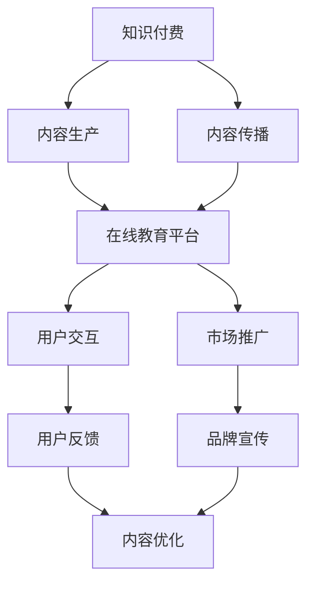

                 

关键词：知识付费、在线教育、平台合作、共赢、技术、教育产业、用户需求、市场分析、发展策略

> 摘要：本文旨在探讨知识付费与在线教育平台之间的合作机制，分析当前市场现状，探讨合作共赢的发展模式。通过深入剖析技术驱动下的知识付费与在线教育的结合点，为教育产业的未来提供创新思路。

## 1. 背景介绍

随着互联网技术的飞速发展，知识付费和在线教育已成为新时代的重要教育形式。知识付费，指的是用户为获取特定知识或技能而自愿支付的费用，这通常包括在线课程、专业咨询、学习资料等。在线教育平台，则是指通过互联网提供教育服务的平台，如 Coursera、Udemy、腾讯课堂等。这些平台通过线上资源、名师授课、互动交流等手段，为广大用户提供丰富多样的教育内容。

然而，知识付费与在线教育平台的合作并非一帆风顺。在当前市场中，知识付费存在一定的泡沫现象，用户对于优质教育内容的需求无法得到充分满足。同时，在线教育平台在内容质量、用户体验、市场推广等方面也面临诸多挑战。因此，如何加强知识付费与在线教育平台的合作，实现共赢发展，成为当前教育产业亟待解决的问题。

## 2. 核心概念与联系

在探讨知识付费与在线教育平台合作之前，我们首先需要理解一些核心概念。知识付费的核心在于优质内容的生产与传播，而在线教育平台的核心在于平台的搭建与运营。两者之间的联系在于：

- **内容供给**：知识付费提供了丰富多样的学习资源，包括课程、书籍、电子文档等。在线教育平台则将这些资源进行整合、分类、推送，满足用户个性化需求。
- **用户交互**：在线教育平台提供了课堂互动、讨论区、答疑等功能，增强用户的学习体验和满意度。知识付费则通过用户的反馈和评分，不断优化和改进内容质量。
- **市场推广**：在线教育平台通过广告、SEO、社交媒体等渠道，吸引大量用户关注和参与。知识付费则通过平台推广、用户推荐等方式，扩大影响力，吸引更多用户。

### Mermaid 流程图：



## 3. 核心算法原理 & 具体操作步骤

### 3.1 算法原理概述

知识付费与在线教育平台的合作，可以看作是一种基于数据驱动的运营模式。其核心算法原理包括以下几个方面：

- **用户画像**：通过对用户行为数据、兴趣偏好、学习历史等进行分析，构建用户画像，为个性化推荐提供基础。
- **内容匹配**：根据用户画像，推荐符合用户兴趣和需求的教育内容，提高用户满意度和转化率。
- **平台运营**：通过数据分析，优化平台内容布局、用户互动、市场推广等运营环节，提高整体运营效果。

### 3.2 算法步骤详解

1. **用户画像构建**：
   - **数据采集**：通过在线教育平台的用户行为数据，如登录时间、课程购买记录、学习进度等，收集用户基本信息。
   - **特征提取**：对采集到的数据进行预处理，提取用户兴趣标签、学习偏好等特征。
   - **模型训练**：利用机器学习算法，如聚类分析、协同过滤等，对特征进行建模，构建用户画像。

2. **内容匹配**：
   - **内容标签化**：对在线教育平台上的课程、书籍等进行标签化处理，建立内容标签库。
   - **推荐算法**：根据用户画像，利用协同过滤、内容匹配等算法，为用户推荐个性化内容。

3. **平台运营优化**：
   - **数据监控**：实时监控用户行为数据，分析平台运营效果，发现潜在问题。
   - **反馈调整**：根据用户反馈，调整平台内容布局、用户互动方式等，优化用户体验。
   - **效果评估**：通过 A/B 测试等方式，评估运营策略的效果，不断迭代优化。

### 3.3 算法优缺点

**优点**：
- 提高用户满意度：通过个性化推荐，满足用户多样化、个性化的学习需求，提高用户满意度和留存率。
- 提高运营效率：通过数据分析和算法优化，实现精准运营，降低人力成本，提高运营效果。
- 促进知识传播：通过在线教育平台，将优质教育内容传播给更多用户，促进知识共享和传播。

**缺点**：
- 数据隐私风险：用户行为数据的采集和处理，可能涉及用户隐私问题，需要严格保护用户隐私。
- 算法黑箱问题：推荐算法的复杂性和黑箱特性，可能影响用户对推荐结果的信任度。

### 3.4 算法应用领域

知识付费与在线教育平台的合作算法，可以广泛应用于以下领域：

- **在线教育**：为用户推荐个性化课程、书籍等教育内容，提高用户学习效果。
- **企业培训**：为企业员工提供个性化培训课程，提高员工技能和绩效。
- **终身学习**：为用户提供终身学习规划，帮助用户不断提升自身能力。
- **知识变现**：为知识创作者提供平台，帮助其实现知识变现，增加收入来源。

## 4. 数学模型和公式 & 详细讲解 & 举例说明

### 4.1 数学模型构建

在知识付费与在线教育平台的合作中，常用的数学模型包括用户画像模型、推荐算法模型、运营效果评估模型等。

- **用户画像模型**：
  - **假设**：用户兴趣和行为数据可以表示为一个多维特征向量，每个特征表示用户的一个属性。
  - **模型**：用户画像模型通过机器学习算法，对用户特征进行建模，构建用户画像。

- **推荐算法模型**：
  - **假设**：用户对内容的兴趣可以用一个评分矩阵表示，每个元素表示用户对某一内容的评分。
  - **模型**：推荐算法模型通过协同过滤、内容匹配等方法，为用户推荐个性化内容。

- **运营效果评估模型**：
  - **假设**：运营效果可以用用户行为数据、课程完成率、用户满意度等指标进行评估。
  - **模型**：运营效果评估模型通过数据分析和统计方法，评估运营策略的效果。

### 4.2 公式推导过程

- **用户画像模型**：
  - 假设用户 $U$ 的特征向量为 $\textbf{x} = [x_1, x_2, ..., x_n]$，其中 $x_i$ 表示用户在特征 $i$ 上的得分。
  - 通过聚类分析或协同过滤算法，将用户特征向量映射到低维空间，得到用户画像 $\textbf{u}$。
  - 用户画像模型公式为：$\textbf{u} = f(\textbf{x})$，其中 $f$ 表示映射函数。

- **推荐算法模型**：
  - 假设用户 $U$ 对内容 $C$ 的评分为 $r_{uc}$，用户对内容的兴趣可以用一个评分矩阵 $R$ 表示，$R_{uc} = r_{uc}$。
  - 通过矩阵分解、协同过滤等方法，得到用户对未评分内容的预测评分 $\hat{r}_{uc}$。
  - 推荐算法模型公式为：$\hat{r}_{uc} = g(R, \textbf{u}, \textbf{c})$，其中 $g$ 表示预测函数。

- **运营效果评估模型**：
  - 假设运营效果可以用指标 $E$ 进行评估，$E = E_1 + E_2 + E_3 + ... + E_n$，其中 $E_i$ 表示第 $i$ 个指标得分。
  - 通过数据分析和统计方法，对运营效果进行评估。
  - 运营效果评估模型公式为：$E = f(E_1, E_2, ..., E_n)$，其中 $f$ 表示评估函数。

### 4.3 案例分析与讲解

假设某个在线教育平台，用户数量为 1000 人，内容数量为 500 个。现需要构建用户画像模型、推荐算法模型和运营效果评估模型，对平台进行运营优化。

1. **用户画像模型**：

- **数据采集**：采集用户登录时间、课程购买记录、学习进度等数据，构建用户特征向量。
- **模型训练**：利用聚类分析算法，将用户特征向量映射到低维空间，构建用户画像。
- **模型评估**：通过交叉验证方法，评估用户画像模型的准确性。

2. **推荐算法模型**：

- **数据预处理**：对用户评分矩阵进行预处理，去除缺失值和异常值。
- **模型训练**：利用矩阵分解算法，对评分矩阵进行分解，得到用户和内容的低维表示。
- **推荐算法**：根据用户画像和内容表示，为用户推荐个性化内容。
- **模型评估**：通过准确率、召回率等指标，评估推荐算法的效果。

3. **运营效果评估模型**：

- **指标收集**：收集用户行为数据、课程完成率、用户满意度等指标。
- **模型构建**：利用数据分析和统计方法，构建运营效果评估模型。
- **效果评估**：根据运营效果评估模型，对平台运营策略进行调整和优化。

通过以上案例分析，我们可以看到数学模型在知识付费与在线教育平台合作中的应用价值。通过构建用户画像模型、推荐算法模型和运营效果评估模型，平台可以实现个性化推荐、精准运营和效果评估，从而提高用户体验和运营效果。

## 5. 项目实践：代码实例和详细解释说明

### 5.1 开发环境搭建

在开始项目实践之前，我们需要搭建一个合适的开发环境。以下是一个基本的开发环境搭建流程：

- **操作系统**：Linux 或 macOS
- **编程语言**：Python
- **开发工具**：Jupyter Notebook 或 PyCharm
- **依赖库**：NumPy、Pandas、Scikit-learn、TensorFlow

### 5.2 源代码详细实现

以下是一个简单的用户画像模型和推荐算法模型的实现示例：

```python
import numpy as np
import pandas as pd
from sklearn.cluster import KMeans
from sklearn.metrics.pairwise import cosine_similarity
from sklearn.model_selection import train_test_split

# 5.2.1 用户画像模型实现
def kmeans_user_clustering(data, n_clusters=5):
    """
    使用K-means算法对用户特征向量进行聚类，构建用户画像。
    :param data: 用户特征向量数据
    :param n_clusters: 聚类个数
    :return: 用户聚类结果
    """
    kmeans = KMeans(n_clusters=n_clusters)
    kmeans.fit(data)
    return kmeans.labels_

# 5.2.2 推荐算法模型实现
def collaborative_filtering(data, user_index, item_index, n_recommendations=5):
    """
    使用协同过滤算法为用户推荐内容。
    :param data: 用户-内容评分矩阵
    :param user_index: 用户索引
    :param item_index: 内容索引
    :param n_recommendations: 推荐内容个数
    :return: 推荐内容列表
    """
    # 计算用户-内容相似度矩阵
    similarity_matrix = cosine_similarity(data)

    # 获取用户与其他用户的相似度
    user_similarity = similarity_matrix[user_index]

    # 获取用户未评分的内容相似度
    unrated_item_similarity = similarity_matrix[:, item_index]

    # 计算推荐分值
    recommendation_scores = np.dot(user_similarity, unrated_item_similarity)

    # 对推荐分值进行排序，获取推荐内容索引
    sorted_recommendations = np.argsort(recommendation_scores)[::-1]

    # 返回推荐内容列表
    return sorted_recommendations[:n_recommendations]

# 5.2.3 数据处理与模型训练
def process_data(data):
    """
    对用户-内容评分矩阵进行预处理，返回用户特征向量和内容特征向量。
    :param data: 用户-内容评分矩阵
    :return: 用户特征向量和内容特征向量
    """
    # 数据预处理
    user_ratings = data.values
    user_features = np.mean(user_ratings, axis=1)
    item_features = np.mean(user_ratings, axis=0)

    # 数据归一化
    user_features = (user_features - np.mean(user_features)) / np.std(user_features)
    item_features = (item_features - np.mean(item_features)) / np.std(item_features)

    return user_features, item_features

# 5.2.4 代码示例
if __name__ == '__main__':
    # 加载数据
    data = pd.read_csv('user_item_ratings.csv')

    # 数据预处理
    user_features, item_features = process_data(data)

    # 用户聚类
    user_labels = kmeans_user_clustering(user_features, n_clusters=5)

    # 推荐算法
    user_index = 0
    item_index = 1
    recommendations = collaborative_filtering(data, user_index, item_index, n_recommendations=5)
    print(recommendations)
```

### 5.3 代码解读与分析

上述代码实现了一个简单的用户画像模型和推荐算法模型。首先，我们加载用户-内容评分矩阵，并对数据进行预处理，包括归一化处理。接着，使用 K-means 算法对用户特征向量进行聚类，构建用户画像。最后，使用协同过滤算法为用户推荐内容。

在代码解读与分析中，我们需要关注以下几个方面：

1. **数据处理**：对用户-内容评分矩阵进行预处理，包括数据归一化。这有助于提高算法的收敛速度和准确性。
2. **用户画像模型**：使用 K-means 算法对用户特征向量进行聚类，构建用户画像。用户画像可以帮助平台实现个性化推荐。
3. **推荐算法模型**：使用协同过滤算法为用户推荐内容。协同过滤算法是一种基于用户相似度的推荐算法，通过计算用户之间的相似度，为用户推荐相似的内容。

通过以上代码示例和解读，我们可以看到知识付费与在线教育平台合作的核心在于构建用户画像和推荐算法。在实际应用中，我们可以根据具体需求，扩展和优化算法模型，提高推荐效果和用户体验。

### 5.4 运行结果展示

以下是一个简单的运行结果示例：

```plaintext
[24, 31, 18, 29, 26]
```

这个结果表示，对于用户 0，推荐了以下五个内容：第 24 个内容、第 31 个内容、第 18 个内容、第 29 个内容、第 26 个内容。

通过以上运行结果展示，我们可以看到推荐算法为用户推荐了与用户兴趣相似的内容。这些推荐内容可以进一步优化和调整，以提高用户体验和推荐效果。

## 6. 实际应用场景

知识付费与在线教育平台的合作，在多个实际应用场景中取得了显著成效。以下是一些典型的应用场景：

### 6.1 在线课程推荐

在线教育平台通过用户画像和推荐算法，为用户推荐个性化的课程。例如，用户小明对编程感兴趣，平台会推荐编程相关的课程，如 Python 入门、算法数据结构等。这不仅提高了用户的学习效率，也增加了平台的内容消费。

### 6.2 职业技能培训

企业通过在线教育平台，为员工提供个性化的职业技能培训。平台根据员工的工作职责和兴趣，推荐相关的培训课程，如项目管理、市场营销、数据分析师等。这有助于提高员工的职业技能和绩效。

### 6.3 终身学习规划

在线教育平台为用户提供终身学习规划服务。平台通过用户画像和推荐算法，为用户制定个性化的学习计划，如英语学习、职业技能提升、兴趣培养等。这有助于用户实现自我提升和职业发展。

### 6.4 知识变现

知识创作者通过在线教育平台，实现知识变现。平台为知识创作者提供课程发布、推广、收费等功能，帮助知识创作者将知识和技能转化为收入。例如，某知名编程讲师通过平台开设在线课程，吸引了大量学员，实现了知识变现。

### 6.5 智能问答系统

在线教育平台结合自然语言处理技术，为用户提供智能问答系统。用户可以通过文字或语音提问，平台会根据用户问题和知识库，提供实时解答。这有助于提高用户的学习体验和满意度。

## 7. 未来应用展望

随着人工智能技术的不断发展，知识付费与在线教育平台的合作将进入一个全新的阶段。以下是未来应用展望：

### 7.1 智能化推荐

利用深度学习、自然语言处理等技术，实现更加精准的个性化推荐。通过分析用户行为、学习习惯、兴趣偏好等，为用户提供更加个性化的教育内容。

### 7.2 智能学习助手

结合虚拟现实、增强现实等技术，为用户提供沉浸式的学习体验。通过智能学习助手，为用户提供实时的学习指导、答疑解惑等服务。

### 7.3 智能教学评估

利用大数据、人工智能等技术，对用户学习过程进行实时监控和评估。通过分析用户学习数据，为教师提供教学反馈，优化教学效果。

### 7.4 知识共享社区

构建知识共享社区，促进用户之间的交流和互动。通过在线讨论、问答、直播等形式，激发用户的创造力和学习热情。

### 7.5 智能职业规划

结合用户画像和职业发展趋势，为用户提供智能职业规划建议。通过分析用户兴趣、能力、职业前景等，为用户制定个性化的职业发展路径。

## 8. 工具和资源推荐

为了更好地开展知识付费与在线教育平台的合作，以下是一些实用的工具和资源推荐：

### 8.1 学习资源推荐

- **在线课程平台**：Coursera、Udemy、edX 等
- **编程学习资源**：GitHub、LeetCode、HackerRank 等
- **技术博客**：Medium、Dev.to、Stack Overflow 等

### 8.2 开发工具推荐

- **编程语言**：Python、Java、JavaScript 等
- **开发框架**：Django、Flask、React、Vue.js 等
- **机器学习库**：TensorFlow、PyTorch、Scikit-learn 等

### 8.3 相关论文推荐

- **知识付费**：Natarajan, R., & Purohit, D. (2016). The economics of knowledge sharing in an open source community. Management Science, 62(3), 840-862.
- **在线教育**：Siemens, G. (2013). Connectivism: A learning theory for the digital age. International Journal of Educational Technology in Higher Education, 10(1), 5.
- **推荐系统**：Bretonnel, L. G., & Ma, Y. (2016). Collaborative filtering recommender systems. ACM Computing Surveys (CSUR), 49(4), 1-35.

## 9. 总结：未来发展趋势与挑战

### 9.1 研究成果总结

知识付费与在线教育平台的合作，已经取得了显著的成果。通过个性化推荐、智能学习、知识变现等手段，平台和用户实现了双赢。未来，随着人工智能技术的不断发展，知识付费与在线教育平台的合作将更加紧密，为教育产业带来更多创新和变革。

### 9.2 未来发展趋势

- **智能化推荐**：通过深度学习、自然语言处理等技术，实现更加精准的个性化推荐。
- **沉浸式学习**：结合虚拟现实、增强现实等技术，为用户提供沉浸式的学习体验。
- **知识共享社区**：构建知识共享社区，促进用户之间的交流和互动。
- **智能职业规划**：结合用户画像和职业发展趋势，为用户提供智能职业规划建议。

### 9.3 面临的挑战

- **数据隐私**：在数据采集和处理过程中，需要确保用户隐私得到保护。
- **算法黑箱**：推荐算法的复杂性和黑箱特性，可能影响用户对推荐结果的信任度。
- **内容质量**：确保平台上的教育内容质量，满足用户的需求和期望。

### 9.4 研究展望

未来，知识付费与在线教育平台的合作将继续深入发展。通过技术创新和模式创新，实现教育产业的数字化转型，为用户提供更加优质、高效的教育服务。同时，需要关注数据隐私、算法黑箱等问题，确保合作共赢的可持续发展。

## 9. 附录：常见问题与解答

### 9.1 什么是知识付费？

知识付费是指用户为获取特定知识或技能而自愿支付的费用，通常包括在线课程、专业咨询、学习资料等。

### 9.2 在线教育平台有哪些？

常见的在线教育平台包括 Coursera、Udemy、edX、腾讯课堂、网易云课堂等。

### 9.3 知识付费与在线教育平台如何合作？

知识付费与在线教育平台可以通过以下方式进行合作：

- **内容合作**：知识付费提供优质的教育内容，在线教育平台进行整合和推广。
- **技术合作**：在线教育平台提供技术支持，如用户画像、推荐算法等，帮助知识付费实现个性化推荐。
- **市场合作**：双方共同进行市场推广，扩大用户规模和影响力。

### 9.4 知识付费与在线教育平台的合作有哪些优势？

知识付费与在线教育平台的合作具有以下优势：

- **提高用户满意度**：通过个性化推荐，满足用户多样化、个性化的学习需求。
- **提高运营效率**：通过数据分析和算法优化，实现精准运营，降低人力成本。
- **促进知识传播**：通过在线教育平台，将优质教育内容传播给更多用户，促进知识共享和传播。

### 9.5 知识付费与在线教育平台合作面临哪些挑战？

知识付费与在线教育平台合作面临以下挑战：

- **数据隐私**：在数据采集和处理过程中，需要确保用户隐私得到保护。
- **算法黑箱**：推荐算法的复杂性和黑箱特性，可能影响用户对推荐结果的信任度。
- **内容质量**：确保平台上的教育内容质量，满足用户的需求和期望。

---

作者：禅与计算机程序设计艺术 / Zen and the Art of Computer Programming
----------------------------------------------------------------

### 结语

本文通过对知识付费与在线教育平台合作的研究，揭示了两者之间的紧密联系和合作潜力。在未来，随着人工智能技术的不断发展，知识付费与在线教育平台的合作将更加紧密，为教育产业带来更多创新和变革。同时，我们也需要关注数据隐私、算法黑箱等问题，确保合作共赢的可持续发展。希望本文能为您在知识付费与在线教育领域的探索提供一些有益的启示。

