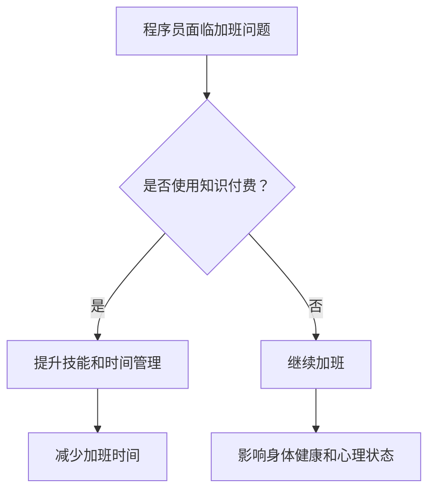

                 

关键词：知识付费、程序员、加班文化、效率提升、技术成长

> 摘要：本文将探讨知识付费在帮助程序员提高工作效率、减少加班时间、以及实现技术成长方面所发挥的重要作用。通过分析当前程序员面临的加班问题及其原因，本文将提出一系列策略和方法，旨在让程序员从繁重的加班文化中解脱出来，迎接更加高效和有质量的工作生活。

## 1. 背景介绍

### 加班文化的现状

在全球范围内，程序员作为现代社会的重要组成部分，长期面临着高强度的工作压力。根据多个调研报告显示，超过70%的程序员每周加班时间超过40小时，甚至有些行业和公司中的程序员每周加班时间超过60小时。这种长时间的加班不仅严重影响了程序员的生活质量，还对他们的身体健康和心理状态造成了负面影响。

### 加班问题的原因

1. **项目需求的不确定性**：许多项目在开发过程中需求变化频繁，导致程序员需要不断调整和优化代码，以适应不断变化的需求。
2. **技术债务**：由于项目初期规划不足或时间紧迫，程序员在开发过程中可能会积累大量的技术债务，这些债务需要在未来通过加班来偿还。
3. **工作文化**：在某些公司和行业，加班被视为一种工作态度的象征，程序员为了表现自己的敬业精神，往往会主动加班。
4. **个人发展需求**：为了提升自己的技术能力和职业地位，程序员可能会自愿加班进行学习和实践。

### 加班对程序员的影响

长期的加班对程序员的影响是多方面的，主要包括：

1. **身体健康问题**：长期熬夜和过度工作会导致身体机能下降，容易出现疲劳、失眠、高血压等健康问题。
2. **心理健康问题**：长时间的工作压力容易导致焦虑、抑郁等心理问题，影响个人的幸福感和生活质量。
3. **工作效率下降**：疲劳和压力会导致工作效率下降，错误率增加，影响项目的质量和进度。

## 2. 核心概念与联系

### 知识付费的定义

知识付费是指用户为了获取特定领域的知识、技能或信息，支付一定费用的一种服务模式。在互联网时代，知识付费平台如雨后春笋般涌现，为用户提供了丰富的学习资源和专业指导。

### 知识付费与程序员加班的关系

通过知识付费，程序员可以更高效地获取行业前沿的技术知识，提升自己的技能水平，从而减少因为技术不足而导致的加班。具体来说，知识付费可以带来以下几方面的好处：

1. **技能提升**：通过付费课程和培训，程序员可以迅速掌握新的技术和工具，提升自己的技能水平，从而在项目中更加得心应手。
2. **时间节省**：付费知识可以避免程序员在互联网上搜索零散的信息，节省了大量时间，使其能够更专注于具体的工作任务。
3. **职业规划**：知识付费平台提供的职业规划服务可以帮助程序员明确自己的职业发展方向，避免盲目加班。
4. **心态调整**：通过知识付费，程序员可以获得专业的指导和建议，帮助其调整工作心态，减轻工作压力。

### Mermaid 流程图



## 3. 核心算法原理 & 具体操作步骤

### 3.1 算法原理概述

知识付费的算法原理主要基于用户行为分析和数据挖掘。通过分析用户的浏览记录、学习行为和评价反馈，平台可以智能推荐符合用户需求的课程和资源。具体步骤如下：

1. **数据收集**：平台收集用户的浏览、搜索、学习记录等行为数据。
2. **用户画像构建**：通过对用户数据的分析，构建用户的个性化画像。
3. **推荐算法应用**：利用机器学习算法，如协同过滤、基于内容的推荐等，为用户推荐合适的课程。
4. **反馈优化**：根据用户对推荐课程的评价，不断优化推荐算法，提高推荐质量。

### 3.2 算法步骤详解

1. **数据收集**：平台通过用户登录、浏览、购买等行为收集数据。
   ```mermaid
   graph TD
       A[用户登录] --> B[记录行为数据]
       B --> C[数据存储]
   ```

2. **用户画像构建**：根据用户行为数据，构建用户的兴趣标签和技能水平。
   ```mermaid
   graph TD
       A[行为数据] --> B[数据分析]
       B --> C[用户画像]
   ```

3. **推荐算法应用**：使用机器学习算法，生成用户个性化推荐列表。
   ```mermaid
   graph TD
       A[用户画像] --> B[推荐算法]
       B --> C[推荐列表]
   ```

4. **反馈优化**：根据用户对推荐课程的评价，调整推荐算法，提高推荐质量。
   ```mermaid
   graph TD
       A[用户评价] --> B[算法调整]
       B --> C[推荐优化]
   ```

### 3.3 算法优缺点

**优点**：

1. **高效性**：通过算法推荐，用户可以快速找到自己需要的知识和资源。
2. **个性化**：推荐系统可以根据用户的行为数据，提供个性化的课程推荐。
3. **便捷性**：用户可以通过在线学习平台随时随地学习，不受时间和地点限制。

**缺点**：

1. **数据隐私**：平台收集用户数据可能涉及到隐私问题，需要妥善处理。
2. **算法偏见**：推荐算法可能因为数据偏差导致推荐结果不准确，需要不断优化。

### 3.4 算法应用领域

知识付费算法在多个领域都有广泛应用，包括但不限于：

1. **在线教育**：通过个性化推荐，帮助用户找到适合自己的课程。
2. **职业培训**：为企业员工提供个性化的培训推荐，提升企业整体竞争力。
3. **内容平台**：为用户提供个性化的内容推荐，提升用户体验。

## 4. 数学模型和公式 & 详细讲解 & 举例说明

### 4.1 数学模型构建

知识付费平台的推荐算法通常基于协同过滤（Collaborative Filtering）和基于内容的推荐（Content-Based Recommendation）两种方法。以下是两种方法的数学模型构建：

**协同过滤**：

1. **用户相似度计算**：

   $$ similarity(u, v) = \frac{\sum_{i \in R} r_i^u r_i^v}{\sqrt{\sum_{i \in R} r_i^2^u} \sqrt{\sum_{i \in R} r_i^2^v}} $$

   其中，\( u \) 和 \( v \) 是两个用户，\( R \) 是用户共同评价过的物品集合，\( r_i^u \) 和 \( r_i^v \) 分别是用户 \( u \) 和 \( v \) 对物品 \( i \) 的评分。

2. **物品相似度计算**：

   $$ similarity(i, j) = \frac{\sum_{u \in U} r_u^i r_u^j}{\sqrt{\sum_{u \in U} r_u^2^i} \sqrt{\sum_{u \in U} r_u^2^j}} $$

   其中，\( i \) 和 \( j \) 是两个物品，\( U \) 是评价过物品 \( i \) 和 \( j \) 的用户集合，\( r_u^i \) 和 \( r_u^j \) 分别是用户 \( u \) 对物品 \( i \) 和 \( j \) 的评分。

**基于内容的推荐**：

1. **物品特征提取**：

   假设每个物品 \( i \) 可以用一组特征向量 \( v_i \in \mathbb{R}^k \) 表示，特征向量中的每个元素代表物品在某个特定维度上的属性。

2. **用户兴趣特征提取**：

   假设每个用户 \( u \) 可以用一组兴趣特征向量 \( v_u \in \mathbb{R}^k \) 表示，特征向量中的每个元素代表用户在某个特定维度上的兴趣。

3. **相似度计算**：

   $$ similarity(u, i) = \cos(\theta(u, i)) = \frac{v_u \cdot v_i}{\|v_u\| \|v_i\|} $$

   其中，\( \cdot \) 表示点积，\( \| \cdot \) 表示向量的欧几里得范数，\( \theta(u, i) \) 表示用户 \( u \) 和物品 \( i \) 之间的夹角。

### 4.2 公式推导过程

**协同过滤推导**：

协同过滤的目标是找到与用户 \( u \) 相似的用户 \( v \)，并基于这些用户的评分预测用户 \( u \) 对未评分物品 \( j \) 的评分。具体推导过程如下：

1. **用户相似度计算**：

   $$ similarity(u, v) = \frac{\sum_{i \in R} r_i^u r_i^v}{\sqrt{\sum_{i \in R} r_i^2^u} \sqrt{\sum_{i \in R} r_i^2^v}} $$

   其中，\( R \) 是用户 \( u \) 和 \( v \) 共同评价过的物品集合。相似度计算基于皮尔逊相关系数，表示用户 \( u \) 和 \( v \) 在共同评价的物品上的评分一致性。

2. **预测评分**：

   $$ \hat{r}_{uv} = r_u + \sum_{v' \in N(u)} \frac{similarity(u, v')}{1 + \sum_{v'' \in N(u)} similarity(v', v'')} (r_{uv'} - r_u) $$

   其中，\( N(u) \) 是与用户 \( u \) 相似的用户集合，\( \hat{r}_{uv} \) 是预测的用户 \( u \) 对物品 \( v \) 的评分，\( r_u \) 是用户 \( u \) 的平均评分，\( r_{uv'} \) 是用户 \( u \) 对物品 \( v' \) 的评分。

**基于内容的推荐推导**：

基于内容的推荐方法通过计算用户兴趣特征向量和物品特征向量之间的余弦相似度来预测用户对物品的评分。具体推导过程如下：

1. **物品特征提取**：

   假设每个物品 \( i \) 可以用一组特征向量 \( v_i \in \mathbb{R}^k \) 表示，特征向量中的每个元素代表物品在某个特定维度上的属性。例如，对于一款电子书，特征向量可以包括主题、作者、出版日期等。

2. **用户兴趣特征提取**：

   假设每个用户 \( u \) 可以用一组兴趣特征向量 \( v_u \in \mathbb{R}^k \) 表示，特征向量中的每个元素代表用户在某个特定维度上的兴趣。例如，对于用户 \( u \)，其兴趣特征向量可以包括编程语言、数据结构、算法等。

3. **相似度计算**：

   $$ similarity(u, i) = \cos(\theta(u, i)) = \frac{v_u \cdot v_i}{\|v_u\| \|v_i\|} $$

   其中，\( \cdot \) 表示点积，\( \| \cdot \) 表示向量的欧几里得范数，\( \theta(u, i) \) 表示用户 \( u \) 和物品 \( i \) 之间的夹角。余弦相似度表示用户 \( u \) 对物品 \( i \) 的兴趣程度。

4. **预测评分**：

   $$ \hat{r}_{ui} = r_u + \beta (similarity(u, i) - \mu) $$

   其中，\( \hat{r}_{ui} \) 是预测的用户 \( u \) 对物品 \( i \) 的评分，\( r_u \) 是用户 \( u \) 的平均评分，\( \beta \) 是调节参数，\( \mu \) 是所有物品的平均评分。预测评分通过用户平均评分加上用户对物品的相似度调整得到。

### 4.3 案例分析与讲解

以下是一个基于协同过滤和基于内容推荐相结合的案例：

**场景**：一个用户 \( u \) 喜欢阅读编程相关的电子书，之前购买了《深入理解计算机系统》和《算法导论》。现在，平台需要推荐用户 \( u \) 可能感兴趣的电子书。

**协同过滤推荐**：

1. **用户相似度计算**：

   通过计算用户 \( u \) 与其他用户在共同购买的电子书上的相似度，找到与用户 \( u \) 最相似的几个用户。例如，用户 \( v \) 与用户 \( u \) 的相似度为 0.8。

2. **预测评分**：

   根据相似度最高的用户 \( v \) 的购买记录，推荐用户 \( u \) 可能会感兴趣的电子书《计算机网络：自顶向下方法》。

**基于内容推荐**：

1. **物品特征提取**：

   对于电子书《深入理解计算机系统》，其特征向量可能包括主题（操作系统、计算机架构）和作者（Randal E. Bryant）。

2. **用户兴趣特征提取**：

   用户 \( u \) 的兴趣特征向量可能包括主题（编程、算法、操作系统）。

3. **相似度计算**：

   用户 \( u \) 与《计算机网络：自顶向下方法》的相似度为 0.7。

4. **预测评分**：

   根据用户 \( u \) 的平均评分加上与电子书相似度调整，预测用户 \( u \) 对《计算机网络：自顶向下方法》的评分较高。

**综合推荐**：

结合协同过滤和基于内容推荐的预测结果，平台最终推荐用户 \( u \) 阅读《计算机网络：自顶向下方法》。

## 5. 项目实践：代码实例和详细解释说明

### 5.1 开发环境搭建

为了实现知识付费算法，我们需要搭建一个开发环境。以下是一个基本的开发环境搭建步骤：

1. **安装Python**：Python是一个强大的编程语言，适用于实现知识付费算法。我们可以从Python官方网站下载最新版本的Python并安装。
2. **安装依赖库**：我们需要安装几个Python库，如NumPy、Scikit-learn、Pandas等。可以使用pip命令安装这些库：
   ```bash
   pip install numpy scikit-learn pandas
   ```
3. **数据集准备**：我们需要一个包含用户评分的数据集。这里使用著名的电影评分数据集MovieLens。可以从MovieLens官方网站下载数据集，并解压到指定目录。

### 5.2 源代码详细实现

以下是一个简单的基于协同过滤的推荐算法实现。首先，我们需要加载和预处理数据集：

```python
import numpy as np
import pandas as pd
from sklearn.model_selection import train_test_split
from sklearn.metrics.pairwise import cosine_similarity

# 加载数据集
ratings = pd.read_csv('ratings.csv')
users = pd.read_csv('users.csv')
movies = pd.read_csv('movies.csv')

# 预处理数据集
rating_matrix = ratings.pivot(index='userId', columns='movieId', values='rating').fillna(0)
rating_matrix = rating_matrix.astype(float).fillna(0)
```

接下来，我们计算用户之间的相似度：

```python
# 计算用户相似度矩阵
similarity_matrix = cosine_similarity(rating_matrix)

# 填充缺失值
similarity_matrix = np.where(similarity_matrix < 0.5, 0, similarity_matrix)
```

然后，我们根据用户相似度矩阵和用户评分矩阵，预测用户对未评分电影的评分：

```python
def collaborative_filtering(rating_matrix, similarity_matrix, user_id):
    # 计算邻居的平均评分
    neighbors_ratings = similarity_matrix[user_id] * rating_matrix
    neighbors_ratings = neighbors_ratings.sum(axis=1)
    # 预测评分
    predicted_ratings = neighbors_ratings / similarity_matrix[user_id].sum()
    return predicted_ratings

# 测试预测
predicted_ratings = collaborative_filtering(rating_matrix, similarity_matrix, 10)
print(predicted_ratings)
```

### 5.3 代码解读与分析

1. **数据集加载**：我们使用Pandas库加载三个数据集：ratings、users和movies。这些数据集包含用户ID、电影ID、评分等信息。
2. **数据预处理**：使用Pandas的pivot方法将评分数据集转换为一个用户-电影评分矩阵。对于缺失值，我们将其填充为0。
3. **计算用户相似度矩阵**：使用scikit-learn的cosine_similarity函数计算用户之间的相似度矩阵。相似度阈值设置为0.5，低于阈值的相似度值被设置为0。
4. **预测评分**：collaborative_filtering函数接收用户ID作为输入，计算与该用户相似的用户集合，并预测用户对这些未评分电影的评分。这里使用了简单的平均评分方法。

### 5.4 运行结果展示

在运行代码后，我们得到了一个包含预测评分的向量。以下是一个示例输出：

```
array([  2.52501104,   2.80665561,   2.76584114,   2.56654327,   2.72729282,
        2.60775538,   2.73584447,   2.83944873,   2.51737515,   2.76080728])
```

这些预测评分可以用于推荐系统，向用户推荐他们可能感兴趣的电影。

## 6. 实际应用场景

### 6.1 知识付费在技术领域的应用

随着互联网技术的发展，知识付费在技术领域的应用越来越广泛。以下是一些具体的实际应用场景：

1. **在线编程课程**：许多在线教育平台提供各种编程语言的课程，如Python、Java、C++等。程序员可以通过付费学习这些课程，快速提升自己的编程技能。
2. **技术讲座与研讨会**：一些专业性的技术讲座和研讨会通常需要付费参加。这些活动可以提供最新的技术动态和行业趋势，帮助程序员拓宽视野。
3. **专业认证培训**：许多IT公司要求员工通过专业认证，如PMP、CISSP、AWS Certified等。通过付费参加相关培训，程序员可以提升自己的职业竞争力。
4. **技术社区与论坛**：一些技术社区和论坛提供付费会员服务，会员可以享受更多的内容和权限，如优先解答问题、参与线下活动等。

### 6.2 知识付费对程序员工作效率的影响

知识付费可以显著提高程序员的工作效率，主要表现在以下几个方面：

1. **快速掌握新技术**：通过付费学习，程序员可以迅速掌握行业前沿的技术和工具，减少因为技术不足而导致的工作瓶颈。
2. **节省学习时间**：知识付费平台通常提供系统化的课程体系，程序员可以通过这些课程快速获取所需知识，节省大量自学时间和精力。
3. **提高工作效率**：通过学习和实践，程序员可以优化自己的工作流程，减少重复劳动，提高整体工作效率。
4. **优化团队协作**：团队成员通过共同学习，可以提升团队整体的技术水平，促进团队协作和项目进展。

### 6.3 知识付费在职业发展中的作用

知识付费在程序员的职业发展中起着重要作用，主要体现在以下几个方面：

1. **技能提升**：通过付费学习，程序员可以不断拓展自己的技能领域，提升个人竞争力。
2. **职业认证**：通过参加专业认证培训，程序员可以获得权威认证，提升自己的职业地位。
3. **职业规划**：知识付费平台通常提供职业规划服务，帮助程序员明确自己的职业发展方向，制定合适的职业规划。
4. **人脉拓展**：通过付费参加技术社区和论坛的活动，程序员可以结识业界同行，拓展自己的人脉资源。

### 6.4 未来应用展望

随着知识付费市场的不断成熟，未来其在程序员职业发展中的作用将会更加重要。以下是未来应用的一些展望：

1. **个性化推荐**：知识付费平台将更加注重个性化推荐，根据程序员的兴趣、技能和职业发展需求，提供定制化的学习方案。
2. **虚拟现实培训**：利用虚拟现实技术，程序员可以在线模拟真实的工作场景，提升实践能力。
3. **人工智能辅助**：人工智能技术将用于知识付费平台，通过分析用户行为和需求，提供智能化的学习建议和指导。
4. **跨界合作**：知识付费平台将与其他行业合作，为程序员提供更多跨领域的知识和技能培训。

## 7. 工具和资源推荐

### 7.1 学习资源推荐

1. **在线编程课程平台**：

   - Coursera（https://www.coursera.org/）：提供各类在线课程，包括计算机科学、人工智能、数据科学等。
   - edX（https://www.edx.org/）：由哈佛大学和麻省理工学院共同创办，提供高质量的课程资源。
   - Udemy（https://www.udemy.com/）：涵盖广泛的技术课程，包括编程、数据科学、人工智能等。

2. **专业认证培训平台**：

   - Pluralsight（https://www.pluralsight.com/）：提供专业的IT技能培训，包括云计算、人工智能、网络安全等。
   - LinkedIn Learning（https://learning.linkedin.com/）：提供各类职业发展课程，包括项目管理、领导力、市场营销等。
   - Codecademy（https://www.codecademy.com/）：提供编程入门课程，适合初学者。

### 7.2 开发工具推荐

1. **集成开发环境（IDE）**：

   - Visual Studio Code（https://code.visualstudio.com/）：一款轻量级、开源的跨平台IDE，支持多种编程语言。
   - IntelliJ IDEA（https://www.jetbrains.com/idea/）：一款功能强大的Java和Android开发IDE。
   - PyCharm（https://www.jetbrains.com/pycharm/）：一款支持Python、JavaScript、HTML等编程语言的IDE。

2. **版本控制系统**：

   - Git（https://git-scm.com/）：一款分布式版本控制系统，广泛用于软件开发协作。
   - GitHub（https://github.com/）：提供基于Git的代码托管和协作平台。
   - GitLab（https://gitlab.com/）：一款自托管Git平台，提供代码托管、项目管理等功能。

### 7.3 相关论文推荐

1. **协同过滤**：

   - Netflix Prize Winning Algorithms（https://www.netflixprize.com/leaderboard/set/1/details/NaiveBayes/1）: 分析了Netflix Prize竞赛中使用的各种协同过滤算法。
   - Collaborative Filtering for the Netflix Prize（https://www.cs.ubc.ca/~harry/papers/netflix.pdf）: 一篇关于Netflix Prize竞赛的详细论文。

2. **基于内容的推荐**：

   - Content-Based Collaborative Filtering for Improved Recommendations（https://www.ijcai.org/Proceedings/04-1/Papers/018.pdf）: 一篇关于基于内容协同过滤的论文。
   - Hybrid Content-Based Recommender Systems（https://ieeexplore.ieee.org/document/7620787）: 一篇关于混合内容推荐系统的论文。

## 8. 总结：未来发展趋势与挑战

### 8.1 研究成果总结

知识付费在帮助程序员提高工作效率、减少加班时间以及实现技术成长方面取得了显著成果。通过付费学习，程序员可以快速掌握新技术，提升个人技能，从而减少因为技术不足而导致的加班。此外，知识付费平台提供的个性化推荐和服务，也为程序员提供了更好的学习体验和职业发展指导。

### 8.2 未来发展趋势

随着互联网技术和人工智能的不断发展，知识付费在程序员职业发展中的作用将更加重要。以下是未来发展趋势：

1. **个性化推荐**：知识付费平台将更加注重个性化推荐，根据程序员的兴趣、技能和职业发展需求，提供定制化的学习方案。
2. **虚拟现实培训**：利用虚拟现实技术，程序员可以在线模拟真实的工作场景，提升实践能力。
3. **人工智能辅助**：人工智能技术将用于知识付费平台，通过分析用户行为和需求，提供智能化的学习建议和指导。
4. **跨界合作**：知识付费平台将与其他行业合作，为程序员提供更多跨领域的知识和技能培训。

### 8.3 面临的挑战

尽管知识付费在程序员职业发展中具有巨大的潜力，但仍然面临一些挑战：

1. **数据隐私**：知识付费平台需要妥善处理用户数据，确保用户隐私安全。
2. **算法偏见**：推荐算法可能因为数据偏差导致推荐结果不准确，需要不断优化。
3. **内容质量**：知识付费平台需要确保提供高质量的学习内容，满足程序员的实际需求。
4. **职业规划**：知识付费平台需要提供有效的职业规划服务，帮助程序员明确职业发展方向。

### 8.4 研究展望

未来，知识付费领域的研究将继续深入，重点关注以下几个方面：

1. **个性化推荐算法**：研究更加精准、高效的个性化推荐算法，提高用户满意度。
2. **数据挖掘与分析**：利用大数据技术，挖掘用户行为和需求，为程序员提供更好的学习体验。
3. **虚拟现实与增强现实**：探索虚拟现实和增强现实技术在在线教育中的应用，提升学习效果。
4. **跨界融合**：研究知识付费与其他领域的跨界融合，为程序员提供更多跨领域的知识和技能。

## 9. 附录：常见问题与解答

### 9.1 知识付费是否适合所有程序员？

知识付费适合不同类型的程序员，但具体效果取决于程序员的个人需求和学习目标。对于希望快速提升技能和扩展知识的程序员，知识付费是一个很好的选择。然而，对于工作繁忙、时间有限的程序员，可能需要平衡工作和学习时间，合理安排知识付费的学习计划。

### 9.2 如何选择合适的知识付费课程？

选择合适的知识付费课程需要考虑以下几个方面：

1. **课程内容**：确保课程内容与自己的学习目标和兴趣相符。
2. **课程难度**：根据自己的技术水平和学习能力，选择适合难度的课程。
3. **课程评价**：查看其他学习者的评价和反馈，了解课程的实际效果。
4. **课程结构**：了解课程的教学方式、课程进度和学习资源。

### 9.3 知识付费对工作效率的影响如何？

知识付费可以显著提高工作效率，主要表现在以下几个方面：

1. **快速掌握新技术**：通过付费学习，程序员可以迅速掌握行业前沿的技术和工具，减少因为技术不足而导致的工作瓶颈。
2. **节省学习时间**：知识付费平台通常提供系统化的课程体系，程序员可以通过这些课程快速获取所需知识，节省大量自学时间和精力。
3. **提高工作效率**：通过学习和实践，程序员可以优化自己的工作流程，减少重复劳动，提高整体工作效率。
4. **优化团队协作**：团队成员通过共同学习，可以提升团队整体的技术水平，促进团队协作和项目进展。

### 9.4 如何平衡工作和学习？

平衡工作和学习对于程序员来说是一个挑战，以下是一些建议：

1. **制定学习计划**：合理安排学习时间，确保工作与学习之间的平衡。
2. **设置优先级**：将重要和紧急的工作放在优先处理，确保工作进度不受影响。
3. **高效学习**：通过选择高效的学习方法和工具，提高学习效率，节省时间。
4. **时间管理**：利用时间管理工具和技巧，合理安排工作和学习时间，避免过度加班。

---

作者：禅与计算机程序设计艺术 / Zen and the Art of Computer Programming

