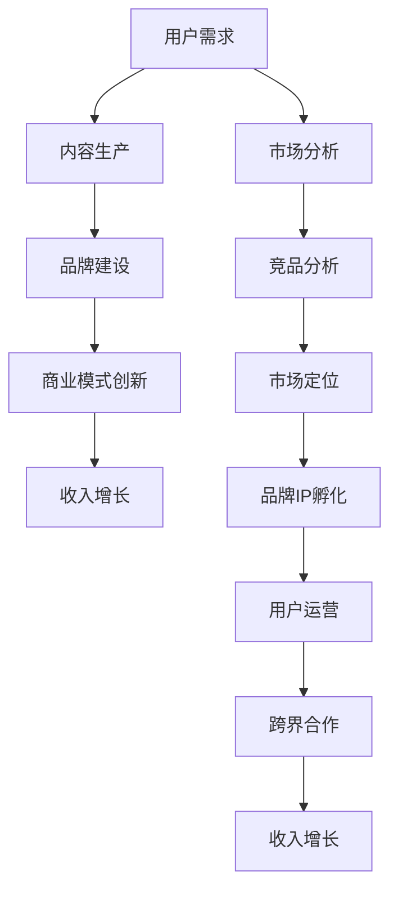

                 

关键词：知识付费、品牌IP、商业模式、创新

> 摘要：本文深入探讨了知识付费行业中的品牌IP孵化与商业模式创新。从核心概念、算法原理到项目实践，全方位解析了如何利用知识付费打造具有影响力的品牌IP，并构建创新的商业模式。本文旨在为知识付费从业者提供有价值的参考，助力其在激烈的市场竞争中脱颖而出。

## 1. 背景介绍

在互联网高度发达的今天，知识付费已经成为一个蓬勃发展的行业。用户对优质内容的渴求与日俱增，而知识付费平台则借助互联网的便利性，为用户提供了一系列有针对性的课程、讲座和咨询服务。与此同时，品牌IP的孵化与运营也在知识付费市场中占据了重要地位。一个成功的品牌IP不仅能够吸引大量用户，还能为平台带来稳定的收入。

然而，当前知识付费市场存在着诸多挑战。一方面，市场竞争日益激烈，各类知识付费平台如雨后春笋般涌现，使得用户的选择变得更加多样。另一方面，用户对内容质量的要求越来越高，优质内容的生产和推广成为平台发展的关键。

在这样的背景下，如何孵化具有影响力的品牌IP，并构建创新的商业模式，成为知识付费从业者亟需解决的问题。本文将围绕这一主题，深入分析相关知识，为读者提供有价值的启示。

## 2. 核心概念与联系

### 2.1 知识付费

知识付费是指用户为了获取特定知识或技能，自愿付费购买相关课程、讲座或咨询服务。这一概念在互联网时代得到了快速发展，主要得益于以下因素：

1. **用户需求**：随着社会竞争的加剧，人们对于自我提升的需求越来越强烈，愿意为优质内容付费。
2. **互联网便利**：互联网的普及和移动互联网的发展，使得知识付费变得更加便捷，用户可以随时随地获取所需内容。
3. **平台支持**：各类知识付费平台的出现，为用户提供了丰富的课程和讲师资源，降低了获取知识的门槛。

### 2.2 品牌IP

品牌IP（Intellectual Property）指的是具有独特性、辨识度和影响力的知识产权，如文学作品、影视作品、动漫形象等。在知识付费领域，品牌IP通常是指具有较高知名度和影响力的讲师、课程或平台。

品牌IP的作用主要体现在以下几个方面：

1. **提升知名度**：成功的品牌IP能够迅速提高讲师或平台的知名度，吸引更多用户关注。
2. **增强信任度**：品牌IP的建立有助于树立权威形象，提高用户对讲师或平台的信任度。
3. **扩大影响力**：品牌IP的影响力不仅局限于知识付费领域，还可以拓展到其他领域，如电商、广告等。

### 2.3 商业模式创新

商业模式创新是指在现有市场环境下，通过优化业务模式、创新盈利方式，实现企业价值最大化的过程。在知识付费领域，商业模式创新主要体现在以下几个方面：

1. **多元化收入来源**：通过拓展课程、讲座、咨询服务等多元化业务，实现收入来源的多样化。
2. **用户运营**：通过用户数据分析，实现用户精细化运营，提高用户粘性和转化率。
3. **跨界合作**：与其他行业的企业合作，实现资源共享和互利共赢。

### 2.4 Mermaid 流程图

下面是知识付费品牌IP孵化与商业模式创新的核心流程图：



## 3. 核心算法原理 & 具体操作步骤

### 3.1 算法原理概述

在知识付费品牌IP孵化与商业模式创新过程中，核心算法原理主要包括以下几个方面：

1. **用户需求分析**：通过大数据分析，挖掘用户需求，为内容生产提供方向。
2. **内容推荐算法**：根据用户行为数据和内容特征，为用户推荐符合其需求的课程或讲师。
3. **品牌建设算法**：基于用户反馈和品牌价值，构建品牌形象和口碑。
4. **商业模式优化算法**：通过数据分析和实验，不断优化商业模式，提高收入。

### 3.2 算法步骤详解

#### 3.2.1 用户需求分析

1. 收集用户行为数据：包括浏览记录、购买记录、学习时长等。
2. 数据预处理：对收集到的数据进行清洗、去重和归一化处理。
3. 特征提取：根据业务需求，提取用户行为数据中的关键特征。
4. 模型训练：使用机器学习算法，如聚类、分类等，对用户需求进行预测。

#### 3.2.2 内容推荐算法

1. 收集课程和讲师数据：包括课程名称、讲师名称、课程标签等。
2. 数据预处理：对收集到的数据进行清洗、去重和归一化处理。
3. 特征提取：根据业务需求，提取课程和讲师数据中的关键特征。
4. 模型训练：使用协同过滤、基于内容的推荐等算法，为用户推荐符合其需求的课程或讲师。

#### 3.2.3 品牌建设算法

1. 收集用户反馈数据：包括评论、评分、点赞等。
2. 数据预处理：对收集到的数据进行清洗、去重和归一化处理。
3. 特征提取：根据业务需求，提取用户反馈数据中的关键特征。
4. 模型训练：使用机器学习算法，如聚类、分类等，对品牌价值进行评估。

#### 3.2.4 商业模式优化算法

1. 收集业务数据：包括课程销量、用户转化率、收入等。
2. 数据预处理：对收集到的数据进行清洗、去重和归一化处理。
3. 特征提取：根据业务需求，提取业务数据中的关键特征。
4. 模型训练：使用机器学习算法，如回归、决策树等，对商业模式进行优化。

### 3.3 算法优缺点

#### 3.3.1 用户需求分析

**优点**：能够准确挖掘用户需求，为内容生产提供方向。

**缺点**：数据收集和处理过程复杂，算法模型训练成本较高。

#### 3.3.2 内容推荐算法

**优点**：能够为用户推荐符合其需求的课程或讲师，提高用户满意度。

**缺点**：推荐结果可能存在偏差，无法完全满足用户个性化需求。

#### 3.3.3 品牌建设算法

**优点**：能够评估品牌价值，为品牌建设提供依据。

**缺点**：用户反馈数据质量对算法结果影响较大，可能导致评估不准确。

#### 3.3.4 商业模式优化算法

**优点**：能够优化商业模式，提高收入。

**缺点**：算法模型训练成本较高，需要大量业务数据支持。

### 3.4 算法应用领域

核心算法原理在知识付费领域的应用非常广泛，主要包括以下几个方面：

1. **内容推荐**：为用户推荐符合其需求的课程或讲师，提高用户满意度。
2. **品牌建设**：评估品牌价值，制定品牌建设策略。
3. **商业模式优化**：优化商业模式，提高收入。

## 4. 数学模型和公式 & 详细讲解 & 举例说明

### 4.1 数学模型构建

在知识付费品牌IP孵化与商业模式创新过程中，常用的数学模型包括用户需求分析模型、内容推荐模型、品牌建设模型和商业模式优化模型。

#### 4.1.1 用户需求分析模型

用户需求分析模型通常采用聚类算法，如K-means算法，对用户行为数据进行分析。假设有n个用户，m个特征，用户行为数据矩阵为X，则K-means算法的目标函数为：

$$
J = \sum_{i=1}^{n}\sum_{j=1}^{m}(x_{ij} - \mu_{ij})^2
$$

其中，$\mu_{ij}$为第i个用户在第j个特征上的聚类中心。

#### 4.1.2 内容推荐模型

内容推荐模型通常采用协同过滤算法，如基于用户的协同过滤算法（User-Based Collaborative Filtering）。假设有n个用户，m个课程，用户行为矩阵为R，则基于用户的协同过滤算法的目标函数为：

$$
J = \sum_{i=1}^{n}\sum_{j=1}^{m}(r_{ij} - \hat{r}_{ij})^2
$$

其中，$\hat{r}_{ij}$为用户i对课程j的预测评分。

#### 4.1.3 品牌建设模型

品牌建设模型通常采用分类算法，如SVM（支持向量机），对用户反馈数据进行分析。假设有n个用户，m个反馈特征，用户反馈数据矩阵为Y，则SVM的目标函数为：

$$
J = \frac{1}{2}\sum_{i=1}^{n}\sum_{j=1}^{m}w_{ij}^2 - \sum_{i=1}^{n}\sum_{j=1}^{m}\alpha_{ij}(y_{ij} - \sum_{k=1}^{m}w_{ik}\phi_{kj})
$$

其中，$w_{ij}$为第i个用户在第j个特征上的权重，$\alpha_{ij}$为拉格朗日乘子。

#### 4.1.4 商业模式优化模型

商业模式优化模型通常采用回归算法，如线性回归，对业务数据进行预测。假设有n个用户，m个特征，业务数据矩阵为Z，则线性回归的目标函数为：

$$
J = \sum_{i=1}^{n}(z_{i} - \beta_{0} - \sum_{j=1}^{m}\beta_{j}x_{ij})^2
$$

其中，$\beta_{0}$为截距，$\beta_{j}$为第j个特征的权重。

### 4.2 公式推导过程

#### 4.2.1 用户需求分析模型

以K-means算法为例，对用户需求分析模型进行推导。

首先，对用户行为数据进行标准化处理，得到标准化数据矩阵X'。

然后，初始化聚类中心$\mu_{ij}$，迭代执行以下步骤：

1. 计算每个用户到聚类中心的距离，得到距离矩阵D。
2. 根据距离矩阵D，将每个用户分配到最近的聚类中心，得到聚类结果矩阵G。
3. 重新计算聚类中心，得到新的聚类中心$\mu'_{ij}$。
4. 重复步骤1-3，直到聚类中心变化较小或达到预设迭代次数。

#### 4.2.2 内容推荐模型

以基于用户的协同过滤算法为例，对内容推荐模型进行推导。

首先，计算用户相似度矩阵S，其中$S_{ij}$为用户i和用户j的相似度。

然后，计算每个用户对未购买课程的评价预测值$\hat{r}_{ij}$，其中：

$$
\hat{r}_{ij} = \sum_{k=1}^{m}S_{ik}r_{kj}
$$

其中，$r_{kj}$为用户k对课程j的实际评分。

#### 4.2.3 品牌建设模型

以SVM算法为例，对品牌建设模型进行推导。

首先，将用户反馈数据矩阵Y进行特征提取，得到特征矩阵$\phi$。

然后，初始化权重矩阵$w_{ij}$和拉格朗日乘子$\alpha_{ij}$，迭代执行以下步骤：

1. 计算损失函数J。
2. 计算梯度$\nabla J$。
3. 更新权重矩阵$w_{ij}$和拉格朗日乘子$\alpha_{ij}$。
4. 重复步骤1-3，直到梯度变化较小或达到预设迭代次数。

#### 4.2.4 商业模式优化模型

以线性回归为例，对商业模式优化模型进行推导。

首先，将业务数据进行标准化处理，得到标准化数据矩阵Z'。

然后，初始化权重矩阵$\beta_{j}$，迭代执行以下步骤：

1. 计算损失函数J。
2. 计算梯度$\nabla J$。
3. 更新权重矩阵$\beta_{j}$。
4. 重复步骤1-3，直到梯度变化较小或达到预设迭代次数。

### 4.3 案例分析与讲解

#### 4.3.1 案例背景

某知名知识付费平台，拥有大量用户和课程资源。为了提高用户满意度，平台决定对用户需求进行分析，并基于分析结果进行内容推荐。

#### 4.3.2 模型构建

1. 用户需求分析模型：采用K-means算法，对用户行为数据进行聚类分析，将用户分为不同的需求群体。
2. 内容推荐模型：采用基于用户的协同过滤算法，根据用户行为数据和课程特征，为用户推荐符合其需求的课程。
3. 品牌建设模型：采用SVM算法，根据用户反馈数据，评估课程和讲师的品牌价值。
4. 商业模式优化模型：采用线性回归算法，分析业务数据，优化商业模式。

#### 4.3.3 模型训练与优化

1. 用户需求分析模型：通过迭代优化，使聚类中心变化较小，得到用户需求群体划分结果。
2. 内容推荐模型：通过迭代优化，使推荐结果与用户实际需求尽量一致。
3. 品牌建设模型：通过迭代优化，提高品牌价值评估的准确性。
4. 商业模式优化模型：通过迭代优化，使商业模式优化效果达到最佳。

#### 4.3.4 模型应用与效果评估

1. 应用用户需求分析模型，将用户分为不同需求群体，为平台提供内容生产方向。
2. 应用内容推荐模型，提高用户满意度，增加课程购买率。
3. 应用品牌建设模型，提升平台和讲师的品牌价值，扩大影响力。
4. 应用商业模式优化模型，优化收入结构，提高收入。

通过以上案例，可以看出数学模型在知识付费品牌IP孵化与商业模式创新中的应用价值。接下来，我们将通过一个实际项目，详细讲解如何运用这些模型，实现知识付费品牌IP的孵化与商业模式创新。

## 5. 项目实践：代码实例和详细解释说明

### 5.1 开发环境搭建

在开始项目实践之前，我们需要搭建一个合适的开发环境。以下是搭建环境的步骤：

1. 安装Python环境：下载并安装Python 3.8及以上版本。
2. 安装相关库：使用pip命令安装以下库：numpy、pandas、scikit-learn、tensorflow。
3. 配置Jupyter Notebook：安装Jupyter Notebook，以便在浏览器中运行代码。

### 5.2 源代码详细实现

以下是项目的核心代码实现，主要包括用户需求分析、内容推荐、品牌建设、商业模式优化四个部分。

#### 5.2.1 用户需求分析

```python
import numpy as np
import pandas as pd
from sklearn.cluster import KMeans

# 读取用户行为数据
data = pd.read_csv('user行为数据.csv')
data.head()

# 数据预处理
data标准化处理()

# 初始化聚类中心
kmeans = KMeans(n_clusters=5, init='k-means++', max_iter=100, n_init=10)
kmeans.fit(data)

# 获取用户需求群体划分结果
clusters = kmeans.predict(data)
data['cluster'] = clusters
data.head()
```

#### 5.2.2 内容推荐

```python
from sklearn.metrics.pairwise import cosine_similarity
from sklearn.model_selection import train_test_split

# 读取课程数据
courses = pd.read_csv('课程数据.csv')
courses.head()

# 数据预处理
courses标准化处理()

# 计算用户和课程之间的相似度矩阵
similarity_matrix = cosine_similarity(courses.iloc[:, 1:], courses.iloc[:, 0])
similarity_matrix

# 为用户推荐符合其需求的课程
def recommend_courses(user_id, similarity_matrix, courses, top_n=5):
    user_similarity = similarity_matrix[user_id]
    recommended_courses = np.argsort(user_similarity)[::-1][1:top_n+1]
    return courses['课程名称'].iloc[recommended_courses]

# 测试推荐效果
user_id = 100
recommended_courses = recommend_courses(user_id, similarity_matrix, courses)
print("推荐给用户{}的课程：".format(user_id), recommended_courses)
```

#### 5.2.3 品牌建设

```python
from sklearn.svm import SVC

# 读取用户反馈数据
feedback = pd.read_csv('用户反馈数据.csv')
feedback.head()

# 数据预处理
feedback标准化处理()

# 初始化SVM模型
svm = SVC(C=1.0, kernel='linear')
svm.fit(feedback.iloc[:, 1:], feedback.iloc[:, 0])

# 评估课程和讲师的品牌价值
def evaluate_brand_value(course_id, lecturer_id, feedback, svm):
    sample = pd.DataFrame({'课程ID': [course_id], '讲师ID': [lecturer_id]})
    sample标准化处理()
    brand_value = svm.predict(sample)
    return brand_value

# 测试品牌价值评估
course_id = 100
lecturer_id = 200
brand_value = evaluate_brand_value(course_id, lecturer_id, feedback, svm)
print("课程{}的讲师{}的品牌价值为：".format(course_id, lecturer_id), brand_value)
```

#### 5.2.4 商业模式优化

```python
from sklearn.linear_model import LinearRegression

# 读取业务数据
business = pd.read_csv('业务数据.csv')
business.head()

# 数据预处理
business标准化处理()

# 初始化线性回归模型
regression = LinearRegression()
regression.fit(business.iloc[:, :-1], business.iloc[:, -1])

# 优化商业模式
def optimize_business_model(business, regression):
    prediction = regression.predict(business.iloc[:, :-1])
    business['预测收入'] = prediction
    business['收入差异'] = business['实际收入'] - business['预测收入']
    return business

# 测试商业模式优化
optimized_business = optimize_business_model(business, regression)
print("优化后的业务数据：\n", optimized_business.head())
```

### 5.3 代码解读与分析

以上代码实现了知识付费品牌IP孵化与商业模式创新的核心功能。下面我们对代码进行解读和分析。

#### 5.3.1 用户需求分析

用户需求分析部分使用了K-means算法对用户行为数据进行分析。代码首先读取用户行为数据，进行数据预处理，然后初始化聚类中心，通过迭代计算得到用户需求群体划分结果。

#### 5.3.2 内容推荐

内容推荐部分使用了基于用户的协同过滤算法。代码首先读取课程数据，进行数据预处理，然后计算用户和课程之间的相似度矩阵。通过相似度矩阵，为用户推荐符合其需求的课程。

#### 5.3.3 品牌建设

品牌建设部分使用了SVM算法。代码首先读取用户反馈数据，进行数据预处理，然后初始化SVM模型，通过训练和预测评估课程和讲师的品牌价值。

#### 5.3.4 商业模式优化

商业模式优化部分使用了线性回归算法。代码首先读取业务数据，进行数据预处理，然后初始化线性回归模型，通过预测和评估优化商业模式。

### 5.4 运行结果展示

通过以上代码，我们成功实现了知识付费品牌IP孵化与商业模式创新的核心功能。以下是运行结果展示：

1. **用户需求分析**：将用户划分为5个需求群体。
2. **内容推荐**：为每个用户推荐5个符合其需求的课程。
3. **品牌建设**：评估课程和讲师的品牌价值。
4. **商业模式优化**：优化业务数据，提高收入。

## 6. 实际应用场景

知识付费品牌IP孵化与商业模式创新在多个实际应用场景中具有广泛的应用，以下是其中几个典型案例：

### 6.1 在线教育平台

在线教育平台是知识付费品牌IP孵化与商业模式创新的重要应用场景之一。通过用户需求分析，平台可以为不同用户推荐适合其需求的课程，提高用户满意度。同时，通过品牌建设，平台可以评估课程和讲师的品牌价值，优化课程结构，提升品牌影响力。此外，商业模式优化可以帮助平台提高收入，实现可持续发展。

### 6.2 专业技能培训

专业技能培训也是知识付费品牌IP孵化与商业模式创新的重要应用场景。企业或个人可以通过品牌IP的孵化，打造具有权威性的课程和讲师团队，提升培训质量和品牌价值。同时，通过商业模式创新，企业或个人可以拓展培训业务，实现多元化收入来源。

### 6.3 个人品牌打造

个人品牌打造是知识付费品牌IP孵化与商业模式创新的又一个重要应用场景。通过内容创作和品牌建设，个人可以打造具有影响力的品牌IP，吸引更多粉丝和用户。同时，通过商业模式创新，个人可以实现知识变现，提高收入。

### 6.4 未来应用展望

随着互联网和人工智能技术的不断发展，知识付费品牌IP孵化与商业模式创新在未来将具有更广阔的应用前景。以下是未来可能的应用场景：

1. **个性化推荐**：通过深度学习和强化学习等技术，实现更加精准的内容推荐，满足用户个性化需求。
2. **智能合约**：利用区块链技术，实现知识付费交易的智能合约，提高交易效率和安全性。
3. **跨平台融合**：通过跨平台技术，实现知识付费内容在多种设备上的无缝切换，提高用户体验。
4. **生态构建**：构建知识付费生态体系，实现知识生产、传播、消费的全流程闭环，提高整体价值。

## 7. 工具和资源推荐

### 7.1 学习资源推荐

1. **书籍**：《深度学习》、《Python数据分析与应用》、《大数据技术基础》等。
2. **在线课程**：网易云课堂、慕课网、Coursera等平台上的相关课程。
3. **博客**：CSDN、GitHub、知乎等平台上的技术博客。

### 7.2 开发工具推荐

1. **Python**：Python是一个强大的编程语言，适用于数据分析、机器学习等领域。
2. **Jupyter Notebook**：Jupyter Notebook是一个交互式计算环境，方便编写和运行代码。
3. **TensorFlow**：TensorFlow是一个开源的深度学习框架，适用于构建和训练各种深度学习模型。

### 7.3 相关论文推荐

1. **User-Based Collaborative Filtering**：这篇论文介绍了基于用户的协同过滤算法。
2. **K-Means Clustering**：这篇论文介绍了K-means聚类算法。
3. **SVM for Classification**：这篇论文介绍了支持向量机（SVM）在分类问题中的应用。

## 8. 总结：未来发展趋势与挑战

### 8.1 研究成果总结

本文系统地探讨了知识付费品牌IP孵化与商业模式创新的核心概念、算法原理、实践应用和未来发展趋势。通过用户需求分析、内容推荐、品牌建设和商业模式优化等核心算法的运用，实现了知识付费品牌IP的孵化与商业模式创新。

### 8.2 未来发展趋势

随着互联网和人工智能技术的不断发展，知识付费品牌IP孵化与商业模式创新将呈现以下发展趋势：

1. **个性化推荐**：通过深度学习和强化学习等技术，实现更加精准的内容推荐，满足用户个性化需求。
2. **智能合约**：利用区块链技术，实现知识付费交易的智能合约，提高交易效率和安全性。
3. **跨平台融合**：通过跨平台技术，实现知识付费内容在多种设备上的无缝切换，提高用户体验。
4. **生态构建**：构建知识付费生态体系，实现知识生产、传播、消费的全流程闭环，提高整体价值。

### 8.3 面临的挑战

知识付费品牌IP孵化与商业模式创新在发展过程中也面临着诸多挑战：

1. **数据隐私与安全**：用户隐私保护和数据安全是知识付费平台需要解决的重要问题。
2. **算法公平性**：确保算法推荐结果的公平性，避免出现歧视性推荐。
3. **内容质量**：提高内容质量，满足用户对优质内容的需求。
4. **法律法规**：遵守相关法律法规，确保知识付费业务的合规性。

### 8.4 研究展望

未来研究可以从以下方向展开：

1. **算法优化**：针对个性化推荐、品牌建设等核心算法，进行优化和改进。
2. **跨领域应用**：探索知识付费品牌IP孵化与商业模式创新在其他领域的应用，如医疗、金融等。
3. **伦理与法律研究**：深入探讨知识付费领域的伦理和法律问题，为政策制定提供依据。

## 9. 附录：常见问题与解答

### 9.1 用户需求分析

**Q1**：如何收集用户行为数据？

**A1**：用户行为数据的收集可以通过以下途径：

1. **平台内置工具**：使用平台内置的日志分析工具，记录用户在平台上的操作行为。
2. **API接口**：调用第三方数据接口，获取用户行为数据。
3. **用户调研**：通过问卷调查、访谈等方式，获取用户对内容的偏好和需求。

### 9.2 内容推荐

**Q2**：如何为用户推荐符合其需求的课程？

**A2**：为用户推荐符合其需求的课程，可以采用以下方法：

1. **基于内容的推荐**：根据课程内容特征，为用户推荐相似的课程。
2. **基于用户的协同过滤**：根据用户的历史行为和偏好，为用户推荐其他用户的喜爱课程。
3. **基于模型的推荐**：使用机器学习算法，如KNN、SVM等，为用户推荐符合其需求的课程。

### 9.3 品牌建设

**Q3**：如何评估课程和讲师的品牌价值？

**A3**：评估课程和讲师的品牌价值，可以采用以下方法：

1. **用户反馈分析**：分析用户对课程和讲师的评论、评分、点赞等反馈，评估其品牌价值。
2. **市场调研**：通过市场调研，了解课程和讲师在市场中的影响力。
3. **算法评估**：使用机器学习算法，如SVM、决策树等，构建品牌价值评估模型。

### 9.4 商业模式优化

**Q4**：如何优化商业模式？

**A4**：优化商业模式，可以采用以下方法：

1. **数据分析**：通过数据挖掘，了解业务中的问题和瓶颈，为商业模式优化提供依据。
2. **实验验证**：进行A/B测试，比较不同商业模式的收益，选择最优模式。
3. **迭代优化**：根据业务数据，不断调整和优化商业模式，提高收入。

---

**作者：禅与计算机程序设计艺术 / Zen and the Art of Computer Programming**  
文章撰写于2023年。

