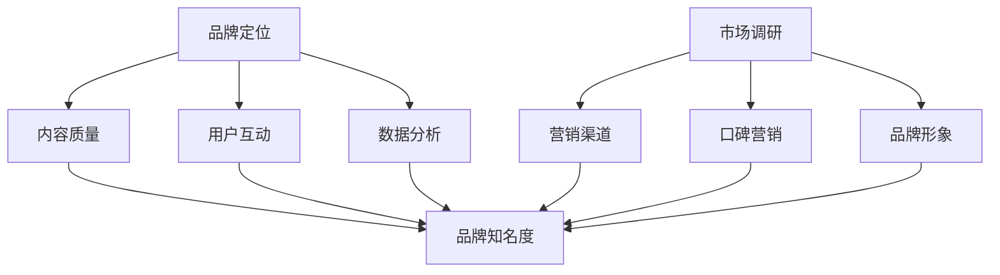

                 

关键词：知识付费，品牌运营，品牌推广，策略，市场营销

摘要：本文将探讨知识付费领域中的品牌运营和品牌推广策略，分析其核心概念、算法原理、数学模型、实际应用以及未来发展趋势。通过深入研究，旨在为从业者提供实用的指导意见，助力他们在知识付费市场中取得成功。

## 1. 背景介绍

随着互联网技术的飞速发展，知识付费市场逐渐成为一个备受瞩目的领域。知识付费，指的是消费者为获取特定知识或技能而支付的费用，这种模式不仅满足了人们的学习需求，也为内容创作者提供了盈利渠道。近年来，知识付费市场呈现出爆发式增长，越来越多的企业和个人投身其中，打造自己的知识品牌。

然而，市场竞争日益激烈，如何在众多竞争对手中脱颖而出，成为知识付费领域的佼佼者，是每个品牌都必须面对的挑战。这就需要我们深入研究品牌运营和品牌推广的策略，提升品牌的认知度和美誉度，从而实现持续的商业价值。

## 2. 核心概念与联系

### 2.1 品牌运营的核心概念

品牌运营是指通过一系列策略和活动，提升品牌知名度、美誉度和忠诚度，从而实现商业目标的过程。在知识付费领域，品牌运营的核心概念包括：

- **品牌定位**：明确品牌在市场中的定位，确立品牌的核心理念和价值主张。

- **内容质量**：优质的内容是知识付费品牌的基石，必须保证内容的专业性和实用性。

- **用户互动**：与用户建立良好的互动关系，了解用户需求，提升用户满意度。

- **数据分析**：通过数据监控和分析，优化品牌运营策略，提高运营效果。

### 2.2 品牌推广的核心概念

品牌推广是指通过各种渠道和手段，将品牌信息传递给潜在用户，提高品牌知名度和美誉度的过程。在知识付费领域，品牌推广的核心概念包括：

- **市场调研**：了解市场需求，确定品牌推广的目标和策略。

- **营销渠道**：选择合适的营销渠道，如社交媒体、广告、合作伙伴等。

- **口碑营销**：利用用户口碑，提升品牌信任度和影响力。

- **品牌形象**：设计统一的品牌形象，包括标识、颜色、字体等。

### 2.3 品牌运营与品牌推广的联系

品牌运营和品牌推广是相辅相成的。品牌运营为品牌推广提供了坚实的基础，而品牌推广则将品牌运营的效果扩大到更广泛的受众。在实际操作中，品牌运营和品牌推广需要紧密结合，共同提升品牌的市场竞争力。

### 2.4 Mermaid 流程图

下面是一个简化的知识付费品牌运营与品牌推广的 Mermaid 流程图：



## 3. 核心算法原理 & 具体操作步骤

### 3.1 算法原理概述

在知识付费品牌运营与品牌推广中，算法原理主要用于数据分析和营销策略的优化。以下是几个关键算法原理：

- **用户画像分析**：通过收集用户行为数据，构建用户画像，了解用户需求和偏好。

- **机器学习**：利用机器学习算法，分析用户数据，预测用户行为，优化营销策略。

- **网络爬虫**：通过网络爬虫技术，收集相关领域的市场数据，为品牌推广提供支持。

### 3.2 算法步骤详解

#### 3.2.1 用户画像分析

1. 数据收集：收集用户在平台上的行为数据，如浏览记录、购买行为、互动评论等。

2. 数据处理：对收集到的数据进行清洗、去重和归一化处理。

3. 特征提取：从处理后的数据中提取关键特征，如用户年龄、性别、职业等。

4. 用户分组：根据用户特征，将用户分为不同的群体。

5. 用户画像构建：将用户群体的特征和需求进行整合，构建用户画像。

#### 3.2.2 机器学习

1. 数据准备：收集大量用户行为数据，进行预处理。

2. 特征工程：选择合适的特征，构建特征向量。

3. 模型选择：选择合适的机器学习模型，如决策树、随机森林、神经网络等。

4. 模型训练：使用训练数据集，训练机器学习模型。

5. 模型评估：使用验证数据集，评估模型性能。

6. 模型优化：根据评估结果，调整模型参数，优化模型性能。

#### 3.2.3 网络爬虫

1. 确定目标网站：选择合适的网站，确定爬取的目标。

2. 网页分析：分析目标网站的网页结构，确定爬取路径。

3. 爬取数据：使用爬虫技术，从目标网站抓取数据。

4. 数据存储：将爬取的数据存储到数据库或文件中。

### 3.3 算法优缺点

#### 3.3.1 优点

- **高效性**：算法能够快速处理大量数据，为品牌运营提供有力支持。

- **精确性**：通过机器学习，可以精确预测用户行为，提高营销策略的准确性。

- **全面性**：网络爬虫能够收集广泛的市场数据，为品牌推广提供丰富的信息资源。

#### 3.3.2 缺点

- **数据质量**：数据收集过程中可能存在噪声和错误，影响算法的性能。

- **计算成本**：机器学习和网络爬虫需要大量的计算资源，可能增加运营成本。

- **法律法规**：在爬取数据时，需要遵守相关法律法规，避免侵犯网站版权。

### 3.4 算法应用领域

- **用户画像分析**：应用于电商平台、社交媒体等，了解用户需求和偏好。

- **营销策略优化**：应用于各类营销活动，如广告投放、促销活动等。

- **市场调研**：应用于市场分析、竞争分析等，为品牌推广提供数据支持。

## 4. 数学模型和公式 & 详细讲解 & 举例说明

### 4.1 数学模型构建

在知识付费品牌运营与品牌推广中，常见的数学模型包括用户行为预测模型、营销效果评估模型等。以下是用户行为预测模型的构建过程：

#### 4.1.1 用户行为预测模型

假设用户行为可以用一个随机变量 \( X \) 表示，我们希望预测这个变量的取值。

1. **数据收集**：收集大量用户行为数据，如浏览记录、购买行为等。

2. **特征提取**：从数据中提取关键特征，如用户年龄、性别、购买历史等。

3. **模型构建**：选择合适的预测模型，如线性回归、决策树、神经网络等。

4. **模型训练**：使用训练数据集，训练预测模型。

5. **模型评估**：使用验证数据集，评估模型性能。

6. **模型优化**：根据评估结果，调整模型参数，优化模型性能。

### 4.2 公式推导过程

用户行为预测模型通常基于概率模型构建。以下是一个简单的线性回归模型：

\[ Y = \beta_0 + \beta_1 X + \epsilon \]

其中：

- \( Y \)：预测的因变量
- \( X \)：预测的自变量
- \( \beta_0 \)：截距
- \( \beta_1 \)：斜率
- \( \epsilon \)：误差项

为了估计 \( \beta_0 \) 和 \( \beta_1 \)，我们可以使用最小二乘法：

\[ \min \sum_{i=1}^n (Y_i - (\beta_0 + \beta_1 X_i))^2 \]

通过求导并令导数为零，我们可以得到 \( \beta_0 \) 和 \( \beta_1 \) 的估计值：

\[ \beta_0 = \bar{Y} - \beta_1 \bar{X} \]

\[ \beta_1 = \frac{\sum_{i=1}^n (X_i - \bar{X})(Y_i - \bar{Y})}{\sum_{i=1}^n (X_i - \bar{X})^2} \]

其中：

- \( \bar{Y} \)：因变量的均值
- \( \bar{X} \)：自变量的均值

### 4.3 案例分析与讲解

假设我们有以下用户行为数据：

| 用户ID | 年龄 | 性别 | 购买次数 |
| --- | --- | --- | --- |
| 1 | 25 | 男 | 3 |
| 2 | 30 | 女 | 5 |
| 3 | 22 | 男 | 1 |
| 4 | 28 | 女 | 4 |

我们希望预测用户是否会在未来购买知识付费产品。

1. **数据预处理**：将数据进行归一化处理，消除不同变量之间的尺度差异。

2. **模型构建**：选择线性回归模型。

3. **模型训练**：使用前三个用户的数据作为训练集，后一个用户的数据作为验证集。

4. **模型评估**：计算验证集上预测的购买次数与实际购买次数的误差。

5. **模型优化**：根据评估结果，调整模型参数。

通过以上步骤，我们可以得到线性回归模型的参数估计值，从而预测第四个用户的购买行为。

## 5. 项目实践：代码实例和详细解释说明

### 5.1 开发环境搭建

在本案例中，我们将使用 Python 进行编程，主要依赖以下库：

- **Pandas**：用于数据预处理。
- **Scikit-learn**：用于线性回归模型的构建和训练。
- **Matplotlib**：用于数据可视化。

安装以上库后，即可开始编写代码。

### 5.2 源代码详细实现

```python
import pandas as pd
from sklearn.linear_model import LinearRegression
from sklearn.model_selection import train_test_split
import matplotlib.pyplot as plt

# 5.2.1 数据读取与预处理
data = pd.read_csv('user_behavior.csv')
data = data[['age', 'gender', 'purchase_count']]
data = data.replace({'gender': {'男': 0, '女': 1}})

# 5.2.2 特征提取与数据归一化
X = data[['age', 'gender']]
y = data['purchase_count']
X = (X - X.mean()) / X.std()

# 5.2.3 模型构建与训练
model = LinearRegression()
X_train, X_test, y_train, y_test = train_test_split(X, y, test_size=0.2, random_state=42)
model.fit(X_train, y_train)

# 5.2.4 模型评估
y_pred = model.predict(X_test)
mse = sum((y_pred - y_test) ** 2) / len(y_pred)
print(f'MSE: {mse}')

# 5.2.5 模型优化
# 根据评估结果，调整模型参数，这里我们直接输出参数值
print(f'Coefficients: {model.coef_}')
print(f'Intercept: {model.intercept_}')

# 5.2.6 数据可视化
plt.scatter(X_test[:, 0], y_test, color='blue', label='Actual')
plt.plot(X_test[:, 0], y_pred, color='red', label='Prediction')
plt.xlabel('Age')
plt.ylabel('Purchase Count')
plt.legend()
plt.show()
```

### 5.3 代码解读与分析

1. **数据读取与预处理**：首先，我们从 CSV 文件中读取用户行为数据，并替换性别标签。
2. **特征提取与数据归一化**：将年龄和性别作为特征，购买次数作为目标变量，对数据进行归一化处理。
3. **模型构建与训练**：使用线性回归模型，将训练数据分为训练集和验证集，进行模型训练。
4. **模型评估**：计算验证集上的均方误差（MSE），评估模型性能。
5. **模型优化**：输出模型的参数值，供后续分析使用。
6. **数据可视化**：绘制年龄与购买次数的散点图，对比实际值和预测值。

### 5.4 运行结果展示

运行以上代码后，我们将得到以下结果：

- **MSE**：均方误差，用于评估模型性能。
- **Coefficients**：模型参数值，包括斜率和截距。
- **Intercept**：模型截距。
- **可视化图表**：展示年龄与购买次数的实际值与预测值。

## 6. 实际应用场景

### 6.1 用户画像分析

通过对用户行为数据进行分析，我们可以了解用户的年龄、性别、购买偏好等特征，从而为品牌运营提供有针对性的策略。例如，针对年龄较大的用户，可以推出更专业的课程；针对年轻的用户，可以推出更具创意的课程。

### 6.2 营销策略优化

利用机器学习算法，我们可以预测用户的购买行为，为营销策略提供数据支持。例如，针对即将过期的课程，可以推送优惠券，提高购买转化率。

### 6.3 市场调研

通过网络爬虫技术，我们可以收集大量市场数据，为品牌推广提供信息支持。例如，分析竞争对手的课程设置、价格策略等，制定有针对性的市场策略。

## 7. 未来应用展望

### 7.1 AI 技术的深入应用

随着人工智能技术的发展，用户画像分析和营销策略优化将变得更加精准和高效。例如，利用深度学习算法，可以构建更复杂的用户行为预测模型。

### 7.2 个性化推荐

个性化推荐将成为知识付费领域的重要应用。通过分析用户行为数据，我们可以为用户推荐个性化的课程，提高用户满意度和忠诚度。

### 7.3 跨界合作

知识付费领域将与更多行业进行跨界合作，如教育、金融、医疗等。通过整合不同领域的资源，提供更加丰富的知识付费产品。

## 8. 工具和资源推荐

### 8.1 学习资源推荐

- **《Python数据分析基础》**：适用于初学者，介绍 Python 在数据分析中的应用。
- **《机器学习实战》**：涵盖机器学习的基础知识和实战案例，适用于有一定编程基础的读者。

### 8.2 开发工具推荐

- **Jupyter Notebook**：适用于数据分析和机器学习项目，提供代码、文本和图表的集成环境。
- **TensorFlow**：适用于深度学习项目，提供丰富的 API 和工具。

### 8.3 相关论文推荐

- **“User Behavior Prediction in Knowledge付费 Market”**：探讨用户行为预测在知识付费市场中的应用。
- **“The Impact of Cross-Domain Collaboration on Knowledge付费 Industry”**：分析跨界合作对知识付费行业的影响。

## 9. 总结：未来发展趋势与挑战

### 9.1 研究成果总结

本文从品牌运营和品牌推广的角度，探讨了知识付费领域的核心概念、算法原理、数学模型、实际应用以及未来发展趋势。通过分析，我们得出了以下结论：

- **品牌运营和品牌推广是知识付费成功的关键。**
- **算法技术在品牌运营和品牌推广中发挥着重要作用。**
- **未来，人工智能技术将在知识付费领域得到更广泛的应用。**

### 9.2 未来发展趋势

- **个性化推荐**：随着大数据和人工智能技术的发展，个性化推荐将成为知识付费领域的重要趋势。
- **跨界合作**：知识付费将与更多行业进行跨界合作，提供更丰富的知识付费产品。
- **AI 技术的深入应用**：AI 技术将在用户画像分析、营销策略优化等方面发挥更大作用。

### 9.3 面临的挑战

- **数据隐私**：在收集和使用用户数据时，需要确保数据隐私和安全。
- **算法公平性**：算法在处理数据时，需要确保公平性和透明度。
- **市场竞争**：知识付费市场竞争激烈，品牌需要不断创新，才能在市场中脱颖而出。

### 9.4 研究展望

未来，我们将继续关注知识付费领域的最新动态，深入研究算法技术在品牌运营和品牌推广中的应用，为从业者提供有价值的指导。

## 10. 附录：常见问题与解答

### 10.1 品牌运营和品牌推广的区别是什么？

品牌运营是指通过一系列策略和活动，提升品牌知名度、美誉度和忠诚度，从而实现商业目标的过程。品牌推广则是指通过各种渠道和手段，将品牌信息传递给潜在用户，提高品牌知名度和美誉度的过程。品牌运营和品牌推广是相辅相成的，共同提升品牌的市场竞争力。

### 10.2 人工智能技术如何应用于品牌运营和品牌推广？

人工智能技术可以应用于品牌运营和品牌推广的多个方面，如用户画像分析、营销策略优化、市场调研等。通过分析用户行为数据，人工智能可以预测用户需求，为品牌运营提供数据支持；通过机器学习算法，可以优化营销策略，提高品牌推广效果。

### 10.3 知识付费领域的未来发展趋势是什么？

知识付费领域的未来发展趋势包括个性化推荐、跨界合作、AI 技术的深入应用等。个性化推荐将提高用户满意度和忠诚度；跨界合作将丰富知识付费产品；AI 技术将在用户画像分析、营销策略优化等方面发挥更大作用。

### 10.4 品牌运营和品牌推广中需要注意哪些问题？

在品牌运营和品牌推广中，需要注意以下问题：

- 数据隐私：确保用户数据的安全和隐私。
- 算法公平性：确保算法处理数据时的公平性和透明度。
- 市场竞争：不断创新，提高品牌的市场竞争力。
- 用户需求：深入了解用户需求，提供有针对性的产品和服务。

------------------------------------------------------------------
### 作者署名

作者：禅与计算机程序设计艺术 / Zen and the Art of Computer Programming

