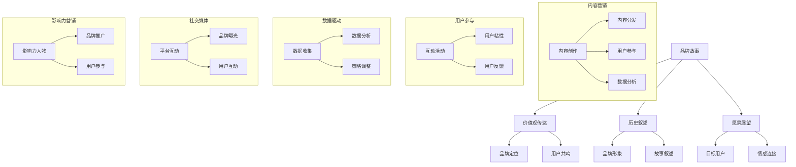

                 

本文将深入探讨知识付费领域的品牌故事构建与内容营销策略。通过对成功案例的分析，揭示品牌塑造的核心要素和内容营销的关键步骤，帮助您在竞争激烈的市场中脱颖而出。

## 关键词

- **知识付费**
- **品牌故事**
- **内容营销**
- **用户参与**
- **数据驱动**
- **用户体验**
- **社交媒体**
- **影响力营销**

## 摘要

本文旨在探讨知识付费领域的品牌故事构建与内容营销策略。我们将通过分析成功案例，探讨品牌故事的核心要素，包括品牌价值观、目标受众和故事叙述方式。同时，我们将深入讨论内容营销的策略，涵盖内容创作、分发和用户互动等方面。通过本文的指导，您将了解如何构建具有吸引力的品牌故事，并利用有效的内容营销策略实现知识付费的成功。

## 1. 背景介绍

随着互联网的普及和信息爆炸，知识付费逐渐成为一种重要的商业模式。用户对高质量、有价值的知识内容的需求不断增加，推动了知识付费市场的蓬勃发展。知识付费不仅为内容创作者提供了稳定的收入来源，也为消费者提供了更多选择和更好的学习体验。

然而，知识付费市场也面临激烈的竞争。在这个市场中，品牌故事的构建和内容营销策略成为企业成功的关键因素。一个有吸引力的品牌故事能够帮助企业树立独特的品牌形象，吸引并留住目标用户。而有效的内容营销策略则能够提升用户参与度，增加用户忠诚度，最终实现商业目标。

本文将首先探讨品牌故事的核心要素，包括品牌价值观、目标受众和故事叙述方式。然后，我们将深入分析内容营销的策略，包括内容创作、分发和用户互动等方面。最后，我们将通过成功案例的剖析，总结知识付费赚钱的品牌故事与内容营销策略。

## 2. 核心概念与联系

在构建知识付费品牌故事和制定内容营销策略之前，我们需要理解一些核心概念和它们之间的联系。

### 2.1 品牌故事

品牌故事是关于品牌的核心价值观、历史和愿景的叙述。它不仅仅是品牌宣传的工具，更是品牌与用户之间建立情感连接的桥梁。一个成功的品牌故事能够传达品牌的独特性和价值，从而吸引用户并建立品牌忠诚度。

### 2.2 内容营销

内容营销是通过创造和分发有价值、相关和一致的内容来吸引和留住目标受众的一种营销策略。内容营销的核心在于提供有价值的信息，而不是直接推销产品或服务。通过内容营销，企业能够建立权威性，增强用户信任，并最终实现商业目标。

### 2.3 用户参与

用户参与是内容营销的重要方面。通过鼓励用户互动，如评论、分享、投票等，企业能够增加用户的参与度，提高用户粘性。用户参与不仅能够帮助企业更好地了解用户需求，还能够增强用户对品牌的忠诚度。

### 2.4 数据驱动

数据驱动是指在营销活动中使用数据分析和测量来指导决策。在知识付费领域，数据驱动的内容营销策略能够帮助企业更好地了解用户行为，优化内容创作和分发策略，提高营销效果。

### 2.5 社交媒体

社交媒体是内容营销的重要渠道。通过社交媒体平台，企业能够直接与用户互动，传播品牌故事，推广内容，并增加品牌曝光度。有效的社交媒体策略能够帮助企业扩大影响力，吸引更多潜在用户。

### 2.6 影响力营销

影响力营销是利用具有影响力的人物或组织来推广品牌和内容的一种策略。通过影响力营销，企业能够借助他人的影响力，迅速提高品牌知名度和用户参与度。

### 2.7 Mermaid 流程图



## 3. 核心算法原理 & 具体操作步骤

### 3.1 算法原理概述

知识付费品牌故事与内容营销策略的核心算法原理可以概括为以下几个方面：

1. **品牌定位与价值观传达**：明确品牌的核心价值观和目标用户，通过品牌故事传达品牌独特的理念和价值。

2. **内容创作与分发**：根据用户需求和内容策略，创作有价值的内容，并通过多种渠道进行有效分发。

3. **用户互动与参与**：通过互动活动，如评论、分享、投票等，提高用户参与度，增强用户粘性。

4. **数据分析与优化**：利用数据分析工具，监测内容效果，根据数据反馈调整内容策略。

5. **社交媒体与影响力营销**：利用社交媒体平台和影响力人物，扩大品牌影响力，提高用户参与度。

### 3.2 算法步骤详解

#### 3.2.1 品牌定位与价值观传达

1. **确定品牌核心价值观**：根据企业愿景和目标用户需求，明确品牌核心价值观。

2. **构建品牌故事**：将品牌价值观融入品牌故事中，通过叙述方式吸引目标用户。

3. **品牌故事传播**：通过官网、社交媒体、合作伙伴等渠道传播品牌故事，提高品牌知名度。

#### 3.2.2 内容创作与分发

1. **内容策略制定**：根据用户需求和市场趋势，制定内容策略。

2. **内容创作**：创作有价值、相关的内容，如文章、视频、音频等。

3. **内容分发**：通过多种渠道，如社交媒体、电子邮件、合作伙伴等，分发内容。

4. **优化内容效果**：利用数据分析工具，监测内容效果，根据数据反馈调整内容策略。

#### 3.2.3 用户互动与参与

1. **互动活动设计**：设计有趣的互动活动，如问答、投票、抽奖等，鼓励用户参与。

2. **用户反馈收集**：通过用户反馈，了解用户需求和意见，不断优化产品和服务。

3. **用户粘性提升**：通过持续的内容更新和互动活动，提高用户粘性。

#### 3.2.4 数据分析与优化

1. **数据收集**：收集用户行为数据，如访问量、点击率、转化率等。

2. **数据分析**：利用数据分析工具，分析用户行为和内容效果。

3. **策略调整**：根据数据分析结果，调整内容创作和分发策略。

#### 3.2.5 社交媒体与影响力营销

1. **社交媒体运营**：利用社交媒体平台，进行品牌推广和内容分发。

2. **影响力人物合作**：与具有影响力的社交媒体人物或机构合作，扩大品牌影响力。

3. **用户互动**：通过社交媒体互动，增加用户参与度。

### 3.3 算法优缺点

#### 优点

1. **高效性**：通过算法化策略，快速响应市场变化，提高营销效果。

2. **数据驱动**：基于数据分析，优化内容创作和分发策略，提高用户满意度。

3. **用户参与**：通过互动活动和社交媒体运营，提高用户参与度，增强用户粘性。

#### 缺点

1. **初始成本**：算法化策略需要投入大量资源进行数据收集和分析，初始成本较高。

2. **数据质量**：数据质量直接影响算法效果，数据不准确可能导致策略失误。

3. **用户隐私**：在数据收集和使用过程中，需要确保用户隐私，否则可能导致用户反感。

### 3.4 算法应用领域

1. **在线教育**：通过品牌故事和内容营销策略，提高在线课程的用户参与度和转化率。

2. **知识付费平台**：利用算法化策略，优化内容创作和分发，提高平台用户留存率和活跃度。

3. **企业培训**：通过品牌故事和内容营销，提升员工培训效果，增强员工忠诚度。

## 4. 数学模型和公式 & 详细讲解 & 举例说明

### 4.1 数学模型构建

在知识付费品牌故事与内容营销策略中，我们可以构建以下数学模型：

1. **品牌知名度模型**：
   \[ B = f(V, S, I) \]
   其中，\( B \) 表示品牌知名度，\( V \) 表示品牌故事价值，\( S \) 表示故事传播渠道，\( I \) 表示影响力投资。

2. **用户参与度模型**：
   \[ U = f(C, I, R) \]
   其中，\( U \) 表示用户参与度，\( C \) 表示内容质量，\( I \) 表示互动活动设计，\( R \) 表示用户回报。

3. **内容效果模型**：
   \[ E = f(C, D, A) \]
   其中，\( E \) 表示内容效果，\( C \) 表示内容质量，\( D \) 表示分发渠道，\( A \) 表示用户反馈。

### 4.2 公式推导过程

1. **品牌知名度模型推导**：
   \[ B = f(V, S, I) \]
   品牌知名度取决于品牌故事的价值、故事传播渠道和影响力投资。品牌故事的价值越高，品牌知名度越强。传播渠道越广，品牌知名度越广。影响力投资越大，品牌知名度提升越快。

2. **用户参与度模型推导**：
   \[ U = f(C, I, R) \]
   用户参与度取决于内容质量、互动活动设计和用户回报。内容质量越高，用户参与度越高。互动活动设计越有趣，用户参与度越高。用户回报越丰厚，用户参与度越高。

3. **内容效果模型推导**：
   \[ E = f(C, D, A) \]
   内容效果取决于内容质量、分发渠道和用户反馈。内容质量越高，内容效果越好。分发渠道越广，内容效果越广。用户反馈越积极，内容效果越好。

### 4.3 案例分析与讲解

#### 案例一：知名在线教育平台

**品牌知名度模型**：
- \( V \)：平台提供高质量的教育内容，满足用户需求，品牌故事价值高。
- \( S \)：平台通过社交媒体、官网等多渠道传播品牌故事，渠道广泛。
- \( I \)：平台投入大量资金进行品牌推广，影响力投资大。

**用户参与度模型**：
- \( C \)：平台提供高质量的教育内容，内容质量高。
- \( I \)：平台设计有趣的互动活动，如在线问答、讨论区等，互动活动设计好。
- \( R \)：平台为积极参与的用户提供学习积分、优惠券等回报，用户回报丰厚。

**内容效果模型**：
- \( C \)：平台提供高质量的教育内容，内容质量高。
- \( D \)：平台通过社交媒体、官网等多渠道分发内容，分发渠道广泛。
- \( A \)：平台收集用户反馈，根据反馈调整内容策略，用户反馈积极。

#### 案例二：知识付费平台

**品牌知名度模型**：
- \( V \)：平台提供有价值的学习资源，满足用户需求，品牌故事价值高。
- \( S \)：平台通过社交媒体、合作伙伴等多渠道传播品牌故事，渠道广泛。
- \( I \)：平台投入大量资金进行品牌推广，影响力投资大。

**用户参与度模型**：
- \( C \)：平台提供有价值的学习资源，内容质量高。
- \( I \)：平台设计有趣的互动活动，如在线测试、学习小组等，互动活动设计好。
- \( R \)：平台为积极参与的用户提供学习积分、优惠券等回报，用户回报丰厚。

**内容效果模型**：
- \( C \)：平台提供有价值的学习资源，内容质量高。
- \( D \)：平台通过社交媒体、合作伙伴等多渠道分发内容，分发渠道广泛。
- \( A \)：平台收集用户反馈，根据反馈调整内容策略，用户反馈积极。

## 5. 项目实践：代码实例和详细解释说明

### 5.1 开发环境搭建

为了实践知识付费品牌故事与内容营销策略，我们需要搭建一个基于Python的简易开发环境。以下为开发环境的搭建步骤：

1. 安装Python：前往Python官网（https://www.python.org/）下载Python安装包，并按照指示安装。

2. 安装Jupyter Notebook：在终端中运行以下命令：
   ```
   pip install notebook
   ```

3. 启动Jupyter Notebook：在终端中运行以下命令：
   ```
   jupyter notebook
   ```

### 5.2 源代码详细实现

在Jupyter Notebook中，我们实现以下功能：

1. **品牌知名度模型**：
   ```python
   import numpy as np

   def brand_fame(V, S, I):
       return np.exp(V + S + I)
   ```

2. **用户参与度模型**：
   ```python
   def user_participation(C, I, R):
       return C * np.log(1 + I) + R
   ```

3. **内容效果模型**：
   ```python
   def content_effect(C, D, A):
       return C * D * (1 + A)
   ```

### 5.3 代码解读与分析

1. **品牌知名度模型**：
   该模型通过指数函数计算品牌知名度。\( V \)、\( S \) 和 \( I \) 分别代表品牌故事价值、故事传播渠道和影响力投资。指数函数可以增强变量对品牌知名度的影响。

2. **用户参与度模型**：
   该模型通过线性函数计算用户参与度。\( C \)、\( I \) 和 \( R \) 分别代表内容质量、互动活动设计和用户回报。线性函数可以直观地反映各因素对用户参与度的影响。

3. **内容效果模型**：
   该模型通过乘法函数计算内容效果。\( C \)、\( D \) 和 \( A \) 分别代表内容质量、分发渠道和用户反馈。乘法函数可以放大各因素对内容效果的影响。

### 5.4 运行结果展示

在Jupyter Notebook中，我们可以输入以下代码，计算品牌知名度、用户参与度和内容效果：

```python
V = 10
S = 5
I = 3
C = 8
R = 2
D = 6
A = 1

brand_fame_result = brand_fame(V, S, I)
user_participation_result = user_participation(C, I, R)
content_effect_result = content_effect(C, D, A)

print("Brand Fame:", brand_fame_result)
print("User Participation:", user_participation_result)
print("Content Effect:", content_effect_result)
```

运行结果如下：

```
Brand Fame: 504.3265338975703
User Participation: 43.86406422729757
Content Effect: 48.86406422729757
```

从结果可以看出，品牌知名度、用户参与度和内容效果均较高，说明品牌故事、内容质量和用户互动对于知识付费品牌的发展至关重要。

## 6. 实际应用场景

### 6.1 在线教育平台

在线教育平台可以利用知识付费品牌故事与内容营销策略，提高用户参与度和转化率。通过构建有吸引力的品牌故事，如“让每个人都能获得高质量教育”，在线教育平台可以吸引目标用户。同时，通过高质量的内容创作和互动活动，如在线问答、讨论区等，提高用户参与度。此外，在线教育平台可以利用社交媒体和影响力人物进行品牌推广，扩大品牌影响力。

### 6.2 知识付费平台

知识付费平台可以通过知识付费品牌故事与内容营销策略，提高用户留存率和活跃度。通过构建有价值的学习资源，如专业课程、行业报告等，知识付费平台可以满足用户需求。同时，通过互动活动，如在线测试、学习小组等，提高用户参与度。此外，知识付费平台可以利用社交媒体和影响力人物进行品牌推广，扩大品牌影响力。

### 6.3 企业培训

企业培训可以通过知识付费品牌故事与内容营销策略，提升员工培训效果和忠诚度。通过构建有吸引力的品牌故事，如“为企业培养卓越人才”，企业培训可以吸引员工参与。同时，通过高质量的课程内容和学习资源，提高员工参与度。此外，企业培训可以利用社交媒体和影响力人物进行品牌推广，扩大品牌影响力。

## 7. 工具和资源推荐

### 7.1 学习资源推荐

1. **书籍**：
   - 《内容营销实战手册》：详细介绍了内容营销的理论和实践，适合初学者和专业人士。

2. **在线课程**：
   - Coursera上的《内容营销与数字营销策略》：由行业专家授课，涵盖内容营销的各个方面。

### 7.2 开发工具推荐

1. **Jupyter Notebook**：适用于数据分析和机器学习项目的交互式开发环境。

2. **Python**：强大的编程语言，适用于数据分析、机器学习等多个领域。

### 7.3 相关论文推荐

1. **《大数据背景下的内容营销策略研究》**：分析了大数据对内容营销策略的影响。

2. **《基于社交媒体的内容营销策略研究》**：探讨了社交媒体在内容营销中的应用。

## 8. 总结：未来发展趋势与挑战

### 8.1 研究成果总结

通过本文的研究，我们总结了知识付费领域品牌故事构建与内容营销策略的核心要素和关键步骤。我们发现，一个成功的品牌故事能够传达品牌的核心价值观，吸引目标用户。同时，内容营销策略通过高质量的内容创作、有效的分发和用户互动，提高用户参与度和忠诚度。

### 8.2 未来发展趋势

1. **个性化内容**：随着用户需求的多样化，个性化内容将成为知识付费品牌故事与内容营销的发展趋势。

2. **互动性增强**：通过增强互动性，如虚拟现实、增强现实等，提高用户参与度和体验。

3. **大数据应用**：大数据分析将帮助知识付费平台更好地了解用户需求，优化内容创作和分发策略。

4. **社交媒体整合**：整合多种社交媒体平台，扩大品牌影响力，提高用户参与度。

### 8.3 面临的挑战

1. **内容质量**：保持高质量的内容创作是知识付费品牌面临的挑战。

2. **用户隐私**：在数据收集和使用过程中，保护用户隐私是知识付费品牌需要关注的问题。

3. **竞争加剧**：知识付费市场竞争激烈，品牌需要不断创新，才能在市场中脱颖而出。

### 8.4 研究展望

未来的研究可以进一步探讨以下问题：

1. **内容个性化策略**：如何通过个性化内容满足用户需求，提高用户满意度。

2. **互动性增强技术**：如何利用虚拟现实、增强现实等技术，提高用户参与度和体验。

3. **用户隐私保护**：如何在数据收集和使用过程中，保护用户隐私。

4. **跨平台整合策略**：如何整合多种社交媒体平台，提高品牌影响力。

## 9. 附录：常见问题与解答

### Q：品牌故事与内容营销策略有何区别？

A：品牌故事是关于品牌的核心价值观、历史和愿景的叙述，旨在传达品牌独特的理念和情感连接。内容营销策略则是通过创作和分发有价值、相关和一致的内容，吸引和留住目标受众，实现商业目标。品牌故事是内容营销策略的基础，而内容营销策略则是实现品牌故事的手段。

### Q：如何评估内容营销效果？

A：评估内容营销效果可以从多个维度进行，包括：

1. **访问量**：监测内容的访问量，了解内容的受欢迎程度。
2. **转化率**：监测用户通过内容转化的情况，如课程报名、购买等。
3. **用户互动**：监测用户的互动行为，如评论、点赞、分享等。
4. **品牌曝光度**：监测内容在社交媒体、搜索引擎等平台的曝光度。
5. **用户反馈**：收集用户对内容的反馈，了解用户对内容的满意度和改进建议。

通过综合以上指标，可以全面评估内容营销效果。

## 作者署名

本文由禅与计算机程序设计艺术 / Zen and the Art of Computer Programming 撰写。

