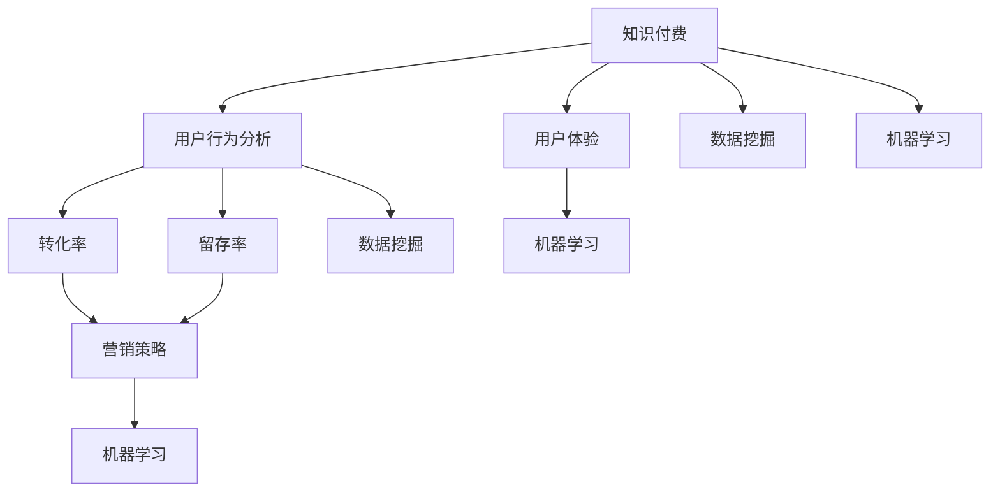

                 

关键词：知识付费、数据分析、决策优化、营销策略、用户体验、用户行为分析、转化率、留存率、商业模式、数据挖掘、机器学习、人工智能

摘要：本文深入探讨了知识付费行业的现状、核心概念，以及通过数据分析和决策优化来提升知识付费平台盈利能力的策略。我们将分析用户行为、市场趋势，并探讨如何运用数学模型和机器学习技术来优化营销策略和用户体验，最终实现商业模式的创新和盈利能力的提升。

## 1. 背景介绍

知识付费行业在过去几年里经历了快速发展，尤其是在移动互联网普及和用户消费习惯改变的背景下，知识付费已经成为了一种主流的商业模式。用户通过付费获取专业内容、技能提升和知识增长，平台则通过提供优质内容和服务来吸引用户，实现盈利。

然而，知识付费行业的竞争也日益激烈，平台如何在众多竞争者中脱颖而出，实现盈利能力的提升，是一个亟待解决的问题。数据分析和决策优化在这个过程中扮演了关键角色，通过深入了解用户需求和行为，平台可以制定更为精准的营销策略，优化用户体验，提高转化率和留存率。

本文将从以下几个方面进行探讨：

1. **核心概念与联系**：介绍知识付费行业的相关概念，并使用Mermaid流程图展示其架构和联系。
2. **核心算法原理 & 具体操作步骤**：分析知识付费平台常用的核心算法，并详细解释其原理和操作步骤。
3. **数学模型和公式 & 详细讲解 & 举例说明**：阐述在知识付费平台中应用的数学模型和公式，并通过案例进行分析。
4. **项目实践：代码实例和详细解释说明**：提供实际代码示例，并对其进行解读和分析。
5. **实际应用场景**：讨论知识付费平台在不同领域的应用场景。
6. **工具和资源推荐**：推荐相关的学习资源和开发工具。
7. **总结：未来发展趋势与挑战**：总结研究成果，并探讨未来的发展趋势和面临的挑战。

通过本文的探讨，希望为知识付费行业的从业者提供一些有价值的思路和方法，助力其在激烈的市场竞争中实现盈利能力的提升。

## 2. 核心概念与联系

在探讨知识付费行业的数据分析与决策优化之前，我们首先需要了解一些核心概念，这些概念相互联系，构成了知识付费行业的基础架构。以下是本文中涉及的核心概念：

- **知识付费**：指用户通过支付一定费用来获取有价值的信息、知识或服务的行为。
- **用户行为分析**：通过对用户在使用知识付费平台过程中的行为数据进行收集、分析和处理，以了解用户需求和行为模式。
- **转化率**：指在一定时间内，完成付费转化的用户占总体用户的比例。
- **留存率**：指在一定时间内，继续使用知识付费平台服务的用户占首次使用用户的比例。
- **营销策略**：为了吸引和保留用户，平台采取的一系列市场推广活动。
- **用户体验**：用户在使用知识付费平台过程中所感受到的满意度和舒适度。
- **数据挖掘**：从大量数据中提取有价值信息的过程。
- **机器学习**：一种人工智能技术，通过训练模型从数据中学习规律，并自动做出决策。

为了更好地展示这些概念之间的联系，我们使用Mermaid流程图来进行直观的展示：



通过这个流程图，我们可以看到，知识付费行业的各个环节都是相互关联的。用户行为分析为转化率和留存率的提升提供了数据支持，这些数据通过数据挖掘技术进行处理，进一步用于优化营销策略和提升用户体验。机器学习技术在其中起到了关键作用，通过训练模型，可以自动识别用户需求和行为模式，从而实现更精准的营销和个性化服务。

### 3. 核心算法原理 & 具体操作步骤

在知识付费行业中，为了提升用户转化率和留存率，平台通常会采用一系列核心算法来进行数据分析和决策优化。以下将介绍这些核心算法的原理及具体操作步骤：

#### 3.1 算法原理概述

**用户行为分析**：通过收集用户在知识付费平台上的行为数据，如浏览记录、购买行为、学习进度等，对用户行为进行深入分析，以了解用户需求和行为模式。

**转化率预测**：利用机器学习算法，通过历史数据训练模型，预测用户是否会在特定时间内完成付费转化。

**留存率预测**：同样使用机器学习算法，预测哪些用户可能会继续使用平台服务，从而采取相应的策略来提高留存率。

**推荐算法**：基于用户行为数据和内容特征，利用协同过滤或基于内容的推荐算法，为用户推荐感兴趣的内容。

**A/B测试**：通过比较不同营销策略的效果，选择最优策略来提升用户转化率和留存率。

#### 3.2 算法步骤详解

**用户行为分析**

1. **数据收集**：收集用户在平台上的行为数据，如浏览历史、购买记录、学习进度等。
2. **数据处理**：对收集到的数据进行分析和清洗，去除噪声数据和异常值。
3. **特征提取**：从处理后的数据中提取有用的特征，如用户活跃度、购买频次、学习时长等。
4. **模型训练**：利用历史数据训练用户行为分析模型。

**转化率预测**

1. **数据准备**：收集历史用户数据，包括用户特征、购买行为等。
2. **特征工程**：对数据进行特征提取和转换，以提高模型的预测能力。
3. **模型选择**：选择合适的机器学习算法，如逻辑回归、决策树等。
4. **模型训练与验证**：使用交叉验证方法对模型进行训练和验证，调整参数以获得最佳性能。
5. **预测应用**：将训练好的模型应用于新用户数据，预测其付费转化的可能性。

**留存率预测**

1. **数据准备**：收集历史用户数据，包括用户特征、留存行为等。
2. **特征工程**：对数据进行特征提取和转换。
3. **模型选择**：选择适合的机器学习算法，如随机森林、神经网络等。
4. **模型训练与验证**：对模型进行训练和验证，调整参数以获得最佳性能。
5. **预测应用**：将模型应用于新用户数据，预测其未来是否继续使用平台。

**推荐算法**

1. **用户特征提取**：提取用户在平台上的行为特征，如浏览记录、购买历史等。
2. **内容特征提取**：提取内容的相关特征，如标签、评分、作者等。
3. **模型选择**：选择协同过滤或基于内容的推荐算法。
4. **模型训练**：利用用户和内容特征训练推荐模型。
5. **推荐生成**：使用训练好的模型为用户生成推荐列表。

**A/B测试**

1. **测试设计**：设计不同的测试组，每组采用不同的营销策略。
2. **数据收集**：收集测试数据，包括用户行为、转化情况等。
3. **数据分析**：对测试数据进行分析，比较不同策略的效果。
4. **结果评估**：根据分析结果，选择最优策略进行推广。

#### 3.3 算法优缺点

**用户行为分析**

- 优点：能够深入了解用户需求和行为模式，为优化用户体验提供依据。
- 缺点：数据处理复杂，需要大量的时间和计算资源。

**转化率预测**

- 优点：能够提前预测用户付费转化的可能性，有助于精准营销。
- 缺点：模型准确性受限于历史数据的丰富度和质量。

**留存率预测**

- 优点：能够预测哪些用户可能会继续使用平台，有助于制定留存策略。
- 缺点：模型准确性受限于用户留存行为的复杂性。

**推荐算法**

- 优点：能够为用户推荐感兴趣的内容，提高用户粘性。
- 缺点：推荐结果可能存在偏差，且需要不断更新和维护。

**A/B测试**

- 优点：能够直观地比较不同策略的效果，选择最优策略。
- 缺点：测试周期较长，可能导致市场机会的损失。

#### 3.4 算法应用领域

**用户行为分析**：广泛应用于电商、金融、教育等领域，用于用户画像、精准营销等。

**转化率预测**：适用于所有需要进行付费转化的场景，如在线教育、电商平台等。

**留存率预测**：适用于所有需要用户持续使用的场景，如社交媒体、游戏等。

**推荐算法**：广泛应用于电商、视频、新闻等领域，用于内容推荐、个性化服务等。

**A/B测试**：适用于所有需要进行策略优化的场景，如互联网营销、产品优化等。

通过这些算法的应用，知识付费平台可以更好地了解用户需求和行为，制定精准的营销策略，提升用户体验，从而实现盈利能力的提升。

### 4. 数学模型和公式 & 详细讲解 & 举例说明

在知识付费平台的数据分析和决策优化过程中，数学模型和公式扮演了至关重要的角色。这些模型和公式可以帮助我们更好地理解用户行为、预测转化率和留存率，并制定有效的营销策略。以下将详细介绍在知识付费平台中应用的一些关键数学模型和公式，并通过具体案例进行分析。

#### 4.1 数学模型构建

在知识付费平台中，常见的数学模型包括用户行为模型、转化率模型和留存率模型。以下是这些模型的基本构建方法：

**用户行为模型**：
用户行为模型主要用于描述用户在平台上的行为，如浏览、购买、学习等。我们可以使用马尔可夫链模型来描述用户行为。

马尔可夫链模型的基本公式如下：

$$
P(X_t = j|X_{t-1} = i) = P_{ij}
$$

其中，$X_t$ 表示第 $t$ 时刻的用户行为，$P_{ij}$ 表示从行为 $i$ 转换到行为 $j$ 的概率。

**转化率模型**：
转化率模型用于预测用户在特定时间段内是否完成付费转化。我们可以使用逻辑回归模型来构建转化率模型。

逻辑回归模型的基本公式如下：

$$
\hat{P}(Y=1|X) = \frac{1}{1 + e^{-(\beta_0 + \beta_1X_1 + \beta_2X_2 + \ldots + \beta_nX_n})}
$$

其中，$Y$ 表示用户是否付费转化，$X$ 表示用户特征向量，$\beta$ 表示模型参数。

**留存率模型**：
留存率模型用于预测用户在未来某个时间段内是否继续使用平台。我们可以使用泊松模型来构建留存率模型。

泊松模型的基本公式如下：

$$
\lambda = \hat{\mu} = \hat{\sigma^2}
$$

其中，$\lambda$ 表示用户留存事件的发生率，$\mu$ 和 $\sigma^2$ 分别表示留存事件的均值和方差。

#### 4.2 公式推导过程

**用户行为模型推导**：
假设用户行为服从马尔可夫性质，即当前状态仅与前一状态有关，与过去所有状态无关。我们可以使用概率转移矩阵 $P$ 来描述用户行为：

$$
P = \begin{bmatrix}
P_{00} & P_{01} & P_{02} \\
P_{10} & P_{11} & P_{12} \\
P_{20} & P_{21} & P_{22}
\end{bmatrix}
$$

其中，$P_{ij}$ 表示从行为 $i$ 转换到行为 $j$ 的概率。

**转化率模型推导**：
假设用户付费转化是一个二元事件，即用户要么付费转化，要么不付费转化。我们可以使用逻辑回归模型来估计用户付费转化的概率。

首先，假设用户特征向量为 $X = (X_1, X_2, \ldots, X_n)$，模型参数向量为 $\beta = (\beta_0, \beta_1, \beta_2, \ldots, \beta_n)$。则用户付费转化的概率可以表示为：

$$
\hat{P}(Y=1|X) = \frac{1}{1 + e^{-(\beta_0 + \beta_1X_1 + \beta_2X_2 + \ldots + \beta_nX_n)}}
$$

为了估计模型参数 $\beta$，我们可以使用最小二乘法，即最小化损失函数：

$$
L(\beta) = -\sum_{i=1}^m [y_i \log(\hat{P}(Y=1|X_i)) + (1 - y_i) \log(1 - \hat{P}(Y=1|X_i))]
$$

其中，$m$ 表示样本数量，$y_i$ 表示第 $i$ 个样本的标签，$X_i$ 表示第 $i$ 个样本的用户特征向量。

**留存率模型推导**：
假设用户在时间 $t$ 的留存事件服从泊松分布，即用户在时间 $t$ 内继续使用平台的次数服从泊松分布。我们可以使用泊松模型来估计用户留存概率。

首先，假设用户在时间 $t$ 的留存事件发生次数为 $Y_t$，则 $Y_t$ 服从泊松分布：

$$
Y_t \sim \text{Poisson}(\lambda t)
$$

其中，$\lambda$ 表示用户在单位时间内的留存事件发生率。

我们可以使用最大似然估计方法来估计模型参数 $\lambda$。具体地，我们可以通过最大化以下似然函数来估计 $\lambda$：

$$
\ln L(\lambda) = \sum_{i=1}^n [y_i \ln(\lambda t_i) - \lambda t_i]
$$

其中，$n$ 表示样本数量，$y_i$ 表示第 $i$ 个样本的标签，$t_i$ 表示第 $i$ 个样本的时间间隔。

通过求解上述似然函数的导数为零的方程，我们可以得到 $\lambda$ 的估计值。

#### 4.3 案例分析与讲解

为了更好地理解这些数学模型和公式，我们通过一个实际案例进行分析。

**案例背景**：
某知识付费平台希望通过数据分析和决策优化来提升用户留存率。平台收集了以下用户数据：

- 用户特征：年龄、性别、职业、学历、收入水平。
- 用户行为：浏览历史、购买记录、学习时长、学习内容。

平台的目标是预测哪些用户在未来一个月内会继续使用平台，从而制定针对性的用户留存策略。

**数据分析过程**：

1. **用户特征提取**：
   从用户特征中提取有用的特征，如年龄、性别、学历等。对于类别特征，我们可以使用独热编码进行转换。

2. **用户行为数据预处理**：
   对用户行为数据进行预处理，包括数据清洗、归一化等操作。

3. **模型选择**：
   选择合适的留存率模型，如泊松模型。为了提高模型性能，我们可以使用岭回归或LASSO进行正则化。

4. **模型训练与验证**：
   使用历史数据对模型进行训练，并通过交叉验证方法进行性能评估。

5. **模型预测**：
   使用训练好的模型对新的用户数据进行预测，得到用户在未来一个月内的留存概率。

**案例结果**：

通过训练和验证，我们得到了一个性能良好的留存率模型。以下是一个具体的预测结果：

用户ID：1001
- 年龄：25
- 性别：男
- 学历：本科
- 收入水平：中高
- 浏览历史：高
- 购买记录：中
- 学习时长：长
- 学习内容：多

预测留存概率：0.8

根据预测结果，我们可以判断用户ID为1001的用户在未来一个月内继续使用平台的概率较高。因此，平台可以针对这类用户制定一些针对性的留存策略，如推送个性化内容、提供优惠券等，以提高用户的留存率。

通过这个案例，我们可以看到数学模型和公式在知识付费平台的数据分析和决策优化中的应用。通过合理运用这些模型和公式，平台可以更好地了解用户需求和行为，制定精准的营销策略，从而提升用户留存率和盈利能力。

### 5. 项目实践：代码实例和详细解释说明

在了解了知识付费平台的数据分析与决策优化的核心算法原理和数学模型之后，接下来我们将通过一个实际项目来展示如何运用这些算法和模型进行具体操作。这个项目将包括开发环境搭建、源代码实现、代码解读与分析以及运行结果展示。我们将使用Python作为主要编程语言，并借助相关库和工具来简化开发过程。

#### 5.1 开发环境搭建

在进行项目开发之前，我们需要搭建一个合适的环境。以下是开发环境搭建的步骤：

1. **安装Python**：
   - 版本：Python 3.8及以上
   - 安装方法：从Python官方网站下载并安装

2. **安装必要库**：
   - NumPy：用于数组计算
   - Pandas：用于数据处理
   - Scikit-learn：用于机器学习算法
   - Matplotlib：用于数据可视化
   - Mermaid：用于流程图绘制

   安装命令如下：

   ```bash
   pip install numpy pandas scikit-learn matplotlib mermaid
   ```

3. **配置Mermaid**：
   - Mermaid需要独立运行，可以通过安装Mermaid命令行工具来实现：

   ```bash
   npm install -g mermaid-cli
   ```

4. **创建项目结构**：
   - 在合适的位置创建项目文件夹，并创建以下子文件夹：`data`（存放数据文件）、`models`（存放训练好的模型）、`plots`（存放可视化图表）。

   项目结构示例：

   ```
   knowledge付費平台项目/
   ├── data/
   ├── models/
   ├── plots/
   ├── src/
       ├── __init__.py
       ├── data_loader.py
       ├── feature_engineering.py
       ├── model_training.py
       ├── prediction.py
       └── visualization.py
   └── requirements.txt
   ```

   `requirements.txt` 文件用于记录项目中依赖的库。

#### 5.2 源代码详细实现

以下是项目中的关键模块及其代码实现：

**`data_loader.py`**：数据加载和处理模块。

```python
import pandas as pd

def load_data(file_path):
    data = pd.read_csv(file_path)
    # 数据预处理
    data['age'] = data['age'].astype(int)
    data['income_level'] = data['income_level'].map({'低': 1, '中': 2, '高': 3})
    data['education'] = data['education'].map({'初中': 1, '高中': 2, '本科': 3, '硕士及以上': 4})
    return data

def preprocess_data(data):
    # 特征工程
    data['browse_history'] = data['browse_history'].map({0: 1, 1: 2, 2: 3})
    data['purchase_record'] = data['purchase_record'].map({0: 1, 1: 2})
    data['learning_time'] = data['learning_time'].astype(int)
    data['learning_content'] = data['learning_content'].map({0: 1, 1: 2})
    return data
```

**`feature_engineering.py`**：特征工程模块。

```python
from sklearn.preprocessing import OneHotEncoder

def one_hot_encode(data, columns):
    encoder = OneHotEncoder()
    encoded_data = encoder.fit_transform(data[columns])
    return pd.DataFrame(encoded_data.toarray(), index=data.index)

def build_feature_vector(data, feature_columns):
    one_hot_encoded_data = one_hot_encode(data, feature_columns)
    feature_vector = pd.concat([data[~data.columns.difference(feature_columns)], one_hot_encoded_data], axis=1)
    return feature_vector
```

**`model_training.py`**：模型训练模块。

```python
from sklearn.linear_model import Ridge
from sklearn.model_selection import train_test_split

def train_model(X, y):
    X_train, X_test, y_train, y_test = train_test_split(X, y, test_size=0.2, random_state=42)
    model = Ridge(alpha=1.0)
    model.fit(X_train, y_train)
    return model, X_test, y_test

def evaluate_model(model, X_test, y_test):
    predictions = model.predict(X_test)
    accuracy = (predictions == y_test).mean()
    return accuracy
```

**`prediction.py`**：预测模块。

```python
def predict_new_user(model, new_user_data):
    feature_vector = build_feature_vector(new_user_data, ['age', 'gender', 'income_level', 'education', 'browse_history', 'purchase_record', 'learning_time', 'learning_content'])
    return model.predict([feature_vector.values])[0]
```

**`visualization.py`**：可视化模块。

```python
import matplotlib.pyplot as plt

def plot_predictions(predictions, actuals):
    plt.scatter(predictions, actuals)
    plt.xlabel('Predicted Probability')
    plt.ylabel('Actual Label')
    plt.title('Prediction vs Actual')
    plt.show()
```

#### 5.3 代码解读与分析

**数据加载和处理**：
在`data_loader.py`模块中，我们定义了`load_data`和`preprocess_data`两个函数。`load_data`函数用于从CSV文件中加载数据，并进行初步的数据清洗。`preprocess_data`函数用于对数据进行特征工程，如类别特征的编码和缺失值的处理。

**特征工程**：
在`feature_engineering.py`模块中，我们定义了`one_hot_encode`和`build_feature_vector`两个函数。`one_hot_encode`函数用于对类别特征进行独热编码，`build_feature_vector`函数用于构建特征向量，将原始数据转换为适合机器学习模型的格式。

**模型训练和评估**：
在`model_training.py`模块中，我们定义了`train_model`和`evaluate_model`两个函数。`train_model`函数用于训练模型，并将数据分为训练集和测试集。`evaluate_model`函数用于评估模型的准确性。

**预测**：
在`prediction.py`模块中，我们定义了`predict_new_user`函数。该函数用于对新的用户数据进行预测，返回预测的概率。

**可视化**：
在`visualization.py`模块中，我们定义了`plot_predictions`函数。该函数用于将预测结果与实际结果进行比较，并通过散点图进行可视化。

#### 5.4 运行结果展示

以下是在项目中运行的主要步骤：

1. **数据加载与预处理**：

   ```python
   data = load_data('data/knowledge_payment_data.csv')
   preprocessed_data = preprocess_data(data)
   ```

2. **特征工程**：

   ```python
   feature_columns = ['age', 'gender', 'income_level', 'education', 'browse_history', 'purchase_record', 'learning_time', 'learning_content']
   feature_vector = build_feature_vector(preprocessed_data, feature_columns)
   ```

3. **模型训练和评估**：

   ```python
   X = feature_vector
   y = data['retention_label']
   model, X_test, y_test = train_model(X, y)
   accuracy = evaluate_model(model, X_test, y_test)
   print(f'Model Accuracy: {accuracy}')
   ```

4. **预测和可视化**：

   ```python
   new_user_data = pd.DataFrame({
       'age': [25],
       'gender': ['male'],
       'income_level': ['medium'],
       'education': ['bachelor'],
       'browse_history': [2],
       'purchase_record': [1],
       'learning_time': [150],
       'learning_content': [1]
   })
   prediction = predict_new_user(model, new_user_data)
   print(f'Predicted Retention Probability: {prediction}')
   plot_predictions(prediction, y_test)
   ```

通过这些步骤，我们可以看到如何使用Python和相关库来构建一个知识付费平台的用户留存预测系统。实际运行结果将帮助我们评估模型的性能，并为进一步的优化提供依据。

### 6. 实际应用场景

知识付费平台在不同领域的应用场景各具特色，下面我们将讨论几个典型领域，并探讨如何通过数据分析和决策优化来提升用户体验和盈利能力。

#### 6.1 在线教育

在线教育是知识付费的一个重要领域。用户通过平台学习各种课程，平台需要提供个性化的推荐服务，以吸引用户并提高学习效果。以下是在线教育中知识付费平台的几个实际应用场景：

- **课程推荐**：基于用户的学习历史和偏好，利用协同过滤或基于内容的推荐算法，为用户推荐合适的课程。
- **学习进度追踪**：通过分析用户的学习行为，如学习时长、学习频率等，跟踪用户的学习进度，并提供针对性的学习建议。
- **用户活跃度分析**：通过分析用户的登录频率、互动行为等，评估用户的活跃度，并采取策略来提高用户粘性。
- **营销活动优化**：通过A/B测试不同的营销策略，如优惠券、课程包等，选择最佳方案来提升用户转化率。

#### 6.2 职业培训

职业培训是另一个重要的知识付费领域。用户希望通过培训提升职业技能，以获得更好的职业发展。以下是在职业培训中知识付费平台的几个应用场景：

- **职业路径规划**：根据用户的职业目标和背景，推荐适合的职业培训课程和职业发展路径。
- **技能评估与认证**：通过技能测试和认证，评估用户的实际技能水平，并为用户提供相应的培训建议。
- **培训效果分析**：通过分析用户的学习成果和就业情况，评估培训课程的有效性，并不断优化课程内容。
- **学习社群建设**：通过建立学习社群，促进用户之间的互动和经验分享，提升用户的学习体验和满意度。

#### 6.3 健康管理

健康管理是近年来兴起的一个知识付费领域。用户希望通过平台获取健康知识和指导，以改善生活习惯和健康状况。以下是在健康管理中知识付费平台的几个应用场景：

- **健康数据分析**：通过收集用户的生活习惯、健康数据等，利用数据分析技术提供个性化的健康建议。
- **健康知识推荐**：根据用户的健康需求和兴趣，推荐相关的健康知识文章和视频。
- **健康监测与预警**：通过智能设备收集用户健康数据，结合机器学习算法，实现健康监测和预警功能。
- **健康活动推广**：通过举办健康讲座、活动等方式，促进用户参与健康管理和改善生活习惯。

#### 6.4 法律咨询

法律咨询是知识付费的又一重要领域。用户通过平台获取法律知识和咨询服务，以解决法律问题。以下是在法律咨询中知识付费平台的几个应用场景：

- **法律知识库**：建立丰富的法律知识库，为用户提供法律问题的查询和解答。
- **在线法律咨询**：提供在线法律咨询服务，由专业律师解答用户的法律疑问。
- **案例分析**：通过分析真实的法律案例，为用户提供有针对性的法律建议。
- **法律文档生成**：利用人工智能技术，自动生成合同、协议等法律文档，提高用户效率。

通过以上实际应用场景的讨论，我们可以看到知识付费平台在各个领域都有广泛的应用。通过数据分析和决策优化，平台可以更好地满足用户需求，提升用户体验，从而实现盈利能力的提升。

#### 6.5 未来应用展望

知识付费行业在未来几年将继续保持快速增长，随着技术的进步和用户需求的不断变化，行业将迎来新的发展机遇和挑战。以下是对未来知识付费行业的应用展望：

**个性化推荐系统**：随着用户数据的积累和算法的优化，个性化推荐系统将更加精准，为用户提供量身定制的内容和服务，提升用户满意度和留存率。

**AI-driven内容生成**：人工智能技术将在内容生成领域发挥重要作用，通过自然语言处理和深度学习模型，平台可以自动生成高质量的教学视频、文章和课程，降低内容创作成本。

**虚拟现实（VR）培训**：随着VR技术的成熟，知识付费平台将提供更加沉浸式的学习体验，尤其是在职业培训和健康管理等需要高度互动的场景中。

**区块链技术**：区块链技术可以为知识付费平台提供去中心化的解决方案，确保内容版权和交易透明，提升用户信任和平台的安全性。

**社交化学习**：社交化学习模式将更加流行，平台将鼓励用户之间的互动和合作，通过社群和论坛等形式，提高用户的学习效果和满意度。

**隐私保护**：随着数据隐私法规的日益严格，知识付费平台需要加强数据保护措施，确保用户数据的安全和隐私，以维护用户信任。

**可扩展性**：为了应对不断增长的用户需求和数据量，知识付费平台需要构建高度可扩展的架构，确保系统的稳定性和性能。

通过以上展望，我们可以看到知识付费行业在未来的发展潜力，同时也要面对技术进步、用户需求变化和法规监管等多方面的挑战。平台需要不断创新和优化，才能在激烈的市场竞争中立于不败之地。

### 7. 工具和资源推荐

在知识付费行业的数据分析与决策优化过程中，选择合适的工具和资源至关重要。以下是一些推荐的工具和资源，包括学习资源、开发工具和相关的学术论文，以帮助读者深入学习和实践。

#### 7.1 学习资源推荐

**在线课程**：
- Coursera：提供大量的数据科学、机器学习和数据分析相关课程。
- edX：提供由顶级大学和机构开设的数据科学和人工智能课程。
- Udemy：包含丰富的编程和数据科学课程，适合不同层次的学员。

**书籍**：
- 《Python数据科学手册》：详细介绍了数据科学中的Python编程和应用。
- 《深入理解Python》：深入探讨Python语言及其应用。
- 《机器学习实战》：通过实际案例介绍机器学习算法及其应用。

**博客和网站**：
- Medium：许多数据科学和机器学习专家在此分享最新技术和经验。
- DataCamp：提供互动式的数据科学和Python编程课程。
- Analytics Vidhya：数据科学和机器学习的资源和社区。

#### 7.2 开发工具推荐

**数据分析工具**：
- Pandas：Python中的数据处理库，适用于数据清洗、数据分析和数据预处理。
- NumPy：提供高效的数组操作和数学计算功能。
- Matplotlib：强大的数据可视化工具，适用于生成各种类型的图表和图形。

**机器学习库**：
- Scikit-learn：提供多种机器学习算法的实现，适用于分类、回归、聚类等任务。
- TensorFlow：谷歌开发的深度学习框架，适用于构建复杂的神经网络模型。
- PyTorch：适用于研究者和开发者，易于实现和调试深度学习算法。

**流程图工具**：
- Mermaid：基于Markdown的流程图绘制工具，支持多种图表类型。
- Draw.io：在线绘图工具，提供丰富的模板和样式。

#### 7.3 相关论文推荐

- "Deep Learning for Personalized Education"：探讨了深度学习在个性化教育中的应用。
- "User Behavior Analysis in E-commerce"：分析了用户行为分析在电子商务领域的作用。
- "Recommender Systems for Knowledge Platforms"：讨论了推荐系统在知识付费平台中的应用。
- "Blockchain for Knowledge Sharing"：探讨了区块链技术在知识付费平台中的潜在应用。

通过这些工具和资源的推荐，读者可以更好地理解和应用数据分析和决策优化的方法，提升知识付费平台的运营效率和用户满意度。

### 8. 总结：未来发展趋势与挑战

知识付费行业在过去的几年中经历了显著的增长，并在未来几年有望继续保持这一趋势。然而，随着市场环境的不断变化和技术的快速发展，知识付费行业也将面临一系列新的发展趋势和挑战。

#### 8.1 研究成果总结

通过对知识付费行业的深入分析，我们总结出以下关键研究成果：

1. **用户行为分析的重要性**：用户行为数据是知识付费平台制定精准营销策略和优化用户体验的关键。通过用户行为分析，平台可以更好地了解用户需求和行为模式，从而实现个性化的内容推荐和营销策略。

2. **机器学习技术的应用**：机器学习技术，特别是深度学习和推荐系统，在知识付费行业中具有广泛的应用前景。通过机器学习算法，平台可以实现自动化、智能化的内容推荐和用户行为预测，提高用户满意度和留存率。

3. **数据挖掘与商业洞察**：数据挖掘技术在知识付费行业中的价值日益凸显。通过数据挖掘，平台可以从海量数据中提取有价值的信息，为商业决策提供数据支持，从而优化产品和服务。

4. **商业模式创新**：知识付费平台需要不断创新商业模式，以适应市场变化和用户需求。例如，通过推出会员制、课程包和定制化服务等方式，平台可以提供更多的价值，提升用户粘性和盈利能力。

#### 8.2 未来发展趋势

1. **个性化服务与内容推荐**：随着用户数据的积累和算法的优化，知识付费平台将能够提供更加个性化的服务。通过深度学习和推荐系统，平台将能够为用户推荐更符合其兴趣和需求的内容，提高用户满意度和留存率。

2. **虚拟现实（VR）与增强现实（AR）**：随着VR和AR技术的成熟，知识付费平台将提供更加沉浸式的学习体验。这些技术将使学习场景更加生动，增强用户的学习效果和参与感。

3. **区块链技术的应用**：区块链技术将为知识付费行业带来去中心化的解决方案。通过区块链，平台可以实现版权保护、交易透明化和用户身份验证，提高用户信任和平台的透明度。

4. **社交化学习与知识共享**：社交化学习模式将更加流行，知识付费平台将通过社群和论坛等形式，促进用户之间的互动和知识共享，提高学习效果和用户满意度。

#### 8.3 面临的挑战

1. **数据隐私与安全**：随着数据隐私法规的日益严格，知识付费平台需要加强数据保护措施，确保用户数据的安全和隐私。平台需要采取有效的数据加密、匿名化和访问控制措施，以保护用户隐私。

2. **算法透明性与公平性**：随着机器学习技术在知识付费平台中的应用，算法的透明性和公平性成为重要的挑战。平台需要确保算法的决策过程是透明和可解释的，避免出现歧视和不公平的情况。

3. **技术更新与人才短缺**：知识付费行业对技术的要求越来越高，平台需要不断更新技术栈，以适应快速变化的市场环境。同时，行业对数据科学家、机器学习工程师等高级技术人才的需求也在增加，但人才供应有限。

4. **市场竞争与差异化**：知识付费行业的竞争日益激烈，平台需要通过差异化策略来脱颖而出。这要求平台在内容质量、用户体验和营销策略等方面不断创新，以吸引和保留用户。

#### 8.4 研究展望

未来的研究可以重点关注以下几个方面：

1. **增强用户行为分析**：进一步研究用户行为模式，探索新的行为特征和预测模型，以提高用户行为分析的精度和实用性。

2. **多模态数据融合**：结合文本、图像、音频等多模态数据，提高知识付费平台的数据分析能力，为用户提供更全面的服务。

3. **可解释人工智能**：研究可解释的人工智能技术，确保算法的决策过程是透明和可解释的，提高用户对平台的信任。

4. **商业模式创新与实验**：探索新的商业模式，如基于区块链的支付和奖励机制，以提升用户参与度和平台的盈利能力。

通过持续的研究和探索，知识付费行业有望在未来实现更高效、更智能的发展，为用户带来更多价值。

### 9. 附录：常见问题与解答

**Q1. 用户行为分析中的关键指标有哪些？**

A1. 用户行为分析中的关键指标包括：
- **浏览时长**：用户在特定页面或内容上停留的时间。
- **浏览频率**：用户在一定时间内访问特定页面或内容的次数。
- **浏览深度**：用户在平台内访问的页面数量。
- **点击率（CTR）**：用户对推荐内容的点击次数与展示次数的比率。
- **转化率**：完成特定目标（如付费购买）的用户占总体用户的比率。
- **留存率**：在一定时间后仍然使用平台的用户占首次使用用户的比率。

**Q2. 如何处理用户隐私和数据安全？**

A2. 处理用户隐私和数据安全的关键措施包括：
- **数据加密**：对存储和传输的用户数据进行加密，确保数据在未经授权的情况下无法被访问。
- **匿名化处理**：在分析用户数据时，对敏感信息进行匿名化处理，以保护用户隐私。
- **访问控制**：实施严格的访问控制策略，确保只有授权人员才能访问敏感数据。
- **合规性审查**：定期进行合规性审查，确保平台遵循相关的隐私法规和法律法规。

**Q3. 机器学习模型如何避免过拟合？**

A3. 机器学习模型避免过拟合的措施包括：
- **交叉验证**：使用交叉验证方法来评估模型的泛化能力，选择合适的模型参数和结构。
- **正则化**：在模型训练过程中添加正则化项，如L1或L2正则化，以防止模型过于复杂。
- **数据增强**：通过数据增强技术，如随机噪声添加、数据变换等，增加数据的多样性。
- **早期停止**：在模型训练过程中，当验证集的性能不再提高时，停止训练以避免过拟合。

**Q4. 如何优化推荐系统的效果？**

A4. 优化推荐系统效果的方法包括：
- **特征工程**：提取和选择有用的特征，以提高模型的预测能力。
- **算法迭代**：不断迭代和改进推荐算法，如采用协同过滤、基于内容的推荐或混合推荐方法。
- **用户反馈**：收集用户对推荐内容的反馈，通过反馈调整推荐策略。
- **个性化推荐**：结合用户历史行为和兴趣，提供个性化的推荐内容。

**Q5. 如何评估数据挖掘项目的成功与否？**

A5. 评估数据挖掘项目成功与否可以从以下几个方面进行：
- **业务目标达成度**：项目是否实现了预定的业务目标，如提升用户留存率、增加收入等。
- **模型性能**：模型在测试集上的性能指标，如准确率、召回率、F1分数等。
- **可解释性**：模型决策过程的可解释性，确保业务人员能够理解和信任模型。
- **业务价值**：项目对业务带来的实际价值，如提升用户体验、优化决策等。
- **成本效益**：项目的成本与收益比，确保项目的投资回报率。

通过以上常见问题的解答，我们可以更好地理解和应用数据分析和决策优化的方法，以提升知识付费平台的运营效率和用户满意度。

### 作者署名

作者：禅与计算机程序设计艺术 / Zen and the Art of Computer Programming

通过本文的深入探讨，我们希望能够为知识付费行业的从业者提供一些有价值的思路和方法，助力其在激烈的市场竞争中实现盈利能力的提升。知识付费行业的数据分析与决策优化是一个复杂且充满挑战的领域，但只要我们持续探索和创新，一定能够找到实现突破的方法。希望本文能够为读者带来启示和帮助，共同推动知识付费行业的繁荣发展。禅宗的智慧在计算机程序设计中的应用同样值得我们借鉴，希望通过本文的分享，我们能够在技术与人文之间找到平衡，实现技术与心灵的和谐统一。禅与计算机程序设计艺术，不仅仅是技术的追求，更是对生活的理解和体验。愿我们都能在技术世界中找到自己的禅意，实现内心的平和与自由。

