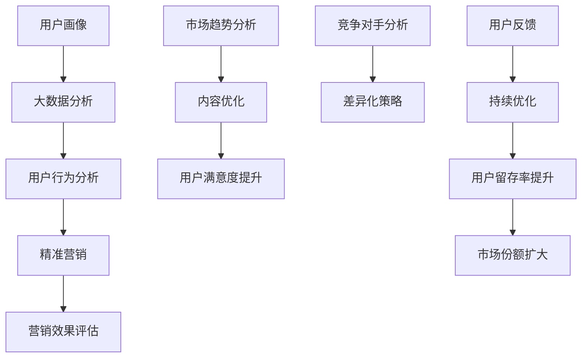

                 

关键词：知识付费、用户画像、精准营销、大数据分析、用户行为、市场趋势

> 摘要：本文将深入探讨知识付费市场的用户画像与精准营销策略。通过对大数据分析和用户行为的深入研究，我们旨在揭示知识付费市场的潜在需求和用户偏好，为从业者和市场营销人员提供有效的营销策略和优化方案。

## 1. 背景介绍

在信息爆炸的时代，知识的获取变得越来越容易。然而，随着在线教育、技能培训、专业咨询等知识付费产品的迅速崛起，市场竞争也日益激烈。为了在众多竞争对手中脱颖而出，了解目标用户的需求和行为特征成为企业成功的关键。本文将探讨如何通过用户画像和精准营销策略，提高知识付费产品的市场竞争力。

### 1.1 知识付费市场的发展现状

近年来，知识付费市场呈现出快速增长的趋势。根据《2021年中国知识付费行业报告》，2020年中国知识付费市场规模已达到1349亿元，预计未来还将保持高速增长。知识付费产品涵盖了多个领域，包括在线课程、专业咨询、书籍推荐、技能培训等。随着移动互联网的普及，用户对知识的需求不断增长，知识付费市场也迎来了黄金发展期。

### 1.2 用户画像在知识付费营销中的重要性

用户画像是指通过对用户的基本信息、行为习惯、兴趣爱好、消费能力等多维度数据的收集和分析，形成的一个关于用户的全面描述。在知识付费市场中，用户画像可以帮助企业更好地了解目标用户，从而制定更有效的营销策略。

## 2. 核心概念与联系

为了更深入地理解用户画像和精准营销策略，我们先来介绍几个核心概念，并使用Mermaid流程图展示它们之间的联系。



### 2.1 大数据分析

大数据分析是指运用现代数据处理技术，从海量数据中提取有价值的信息。在知识付费市场中，大数据分析可以帮助企业收集用户在平台上的行为数据，如访问记录、购买行为、互动情况等，从而形成用户画像。

### 2.2 用户行为分析

用户行为分析是对用户在平台上各种行为的分析，包括浏览、搜索、购买、互动等。通过对用户行为数据的分析，企业可以了解用户的需求和偏好，从而优化产品内容和营销策略。

### 2.3 精准营销

精准营销是基于用户画像和用户行为分析，针对特定用户群体进行的有针对性的营销活动。在知识付费市场中，精准营销可以有效地提高用户转化率和购买意愿。

### 2.4 营销效果评估

营销效果评估是对营销活动的效果进行量化分析，包括用户转化率、购买率、满意度等指标。通过营销效果评估，企业可以了解营销活动的成效，并及时调整策略。

### 2.5 市场趋势分析

市场趋势分析是对市场发展动态的监测和预测，包括用户需求变化、行业趋势、竞争对手动向等。通过市场趋势分析，企业可以把握市场机遇，制定长期发展规划。

### 2.6 竞争对手分析

竞争对手分析是对同行业竞争对手的产品、营销策略、市场份额等进行研究。通过竞争对手分析，企业可以了解竞争对手的优势和劣势，从而制定差异化的营销策略。

### 2.7 用户反馈

用户反馈是用户对产品和服务使用后产生的意见和建议。通过用户反馈，企业可以了解用户需求，发现潜在问题，并及时进行优化和改进。

## 3. 核心算法原理 & 具体操作步骤

### 3.1 算法原理概述

在知识付费市场中，用户画像和精准营销的核心算法包括用户行为分析、协同过滤、聚类分析等。这些算法可以通过对用户行为数据的分析和处理，形成用户画像，并据此制定精准营销策略。

### 3.2 算法步骤详解

#### 3.2.1 用户行为分析

1. 数据收集：收集用户在平台上的行为数据，包括浏览、搜索、购买、互动等。
2. 数据预处理：对收集到的数据清洗、去重、归一化等处理，以便后续分析。
3. 特征提取：从预处理后的数据中提取用户行为特征，如浏览次数、购买频率、互动时长等。
4. 行为分析：使用统计学方法或机器学习方法对用户行为特征进行分析，发现用户行为模式和偏好。

#### 3.2.2 协同过滤

1. 用户-物品评分矩阵构建：根据用户的行为数据，构建用户-物品评分矩阵。
2. 邻居计算：计算用户之间的相似度，找出与目标用户相似的其他用户。
3. 推荐生成：根据邻居用户对物品的评分，预测目标用户对物品的评分，生成推荐列表。

#### 3.2.3 聚类分析

1. 数据预处理：对用户行为数据进行归一化处理。
2. 聚类算法选择：选择适合的聚类算法，如K-means、DBSCAN等。
3. 聚类结果评估：根据聚类结果，评估聚类效果，如内聚度和轮廓系数等。
4. 聚类应用：根据聚类结果，将用户划分为不同的群体，为每个群体制定个性化的营销策略。

### 3.3 算法优缺点

#### 3.3.1 用户行为分析

优点：用户行为分析可以全面了解用户需求和行为模式，为精准营销提供有力支持。

缺点：用户行为数据可能存在噪声和不完整性，影响分析结果。

#### 3.3.2 协同过滤

优点：协同过滤算法可以生成个性化的推荐列表，提高用户满意度。

缺点：依赖用户评分数据，可能导致推荐结果偏差。

#### 3.3.3 聚类分析

优点：聚类分析可以将用户划分为不同的群体，为个性化营销提供依据。

缺点：聚类结果可能受参数选择影响较大，需要多次调整。

### 3.4 算法应用领域

用户画像和精准营销算法在知识付费市场中具有广泛的应用。以下是一些典型应用场景：

1. 在线课程推荐：根据用户的学习行为和偏好，为用户推荐合适的课程。
2. 专业咨询匹配：根据用户的咨询需求和专家的擅长领域，为双方匹配合适的咨询服务。
3. 个性化内容推送：根据用户的历史行为和兴趣标签，为用户推送感兴趣的内容。

## 4. 数学模型和公式 & 详细讲解 & 举例说明

在知识付费市场中，数学模型和公式可以帮助我们更好地理解用户行为和制定营销策略。以下介绍几个常用的数学模型和公式。

### 4.1 数学模型构建

#### 4.1.1 用户行为概率模型

用户行为概率模型是基于概率论和统计学的方法，用于预测用户在某一时段内的行为。假设用户 \( u \) 在时间 \( t \) 内的行为为 \( b \)，则用户行为概率模型可以表示为：

\[ P(b|u, t) = \frac{P(u, b, t)}{P(u, t)} \]

其中， \( P(u, b, t) \) 表示用户 \( u \) 在时间 \( t \) 内进行行为 \( b \) 的概率， \( P(u, t) \) 表示用户 \( u \) 在时间 \( t \) 内进行任何行为的概率。

#### 4.1.2 协同过滤模型

协同过滤模型是基于用户-物品评分矩阵的推荐算法。假设用户-物品评分矩阵为 \( R \)，其中 \( R_{ui} \) 表示用户 \( u \) 对物品 \( i \) 的评分。则协同过滤模型可以表示为：

\[ R_{ui} = \mu + q_u \cdot p_i + \epsilon_{ui} \]

其中， \( \mu \) 表示用户 \( u \) 和物品 \( i \) 的平均评分， \( q_u \) 和 \( p_i \) 分别表示用户 \( u \) 和物品 \( i \) 的特征向量， \( \epsilon_{ui} \) 表示误差项。

### 4.2 公式推导过程

#### 4.2.1 用户行为概率模型推导

用户行为概率模型的推导基于贝叶斯定理。假设用户 \( u \) 在时间 \( t \) 内的行为为 \( b \)，则有：

\[ P(b|u, t) = \frac{P(u, b, t)}{P(u, t)} \]

根据全概率公式，有：

\[ P(u, t) = \sum_{b} P(u, b, t) \]

代入贝叶斯定理，得：

\[ P(b|u, t) = \frac{P(u, b, t)}{\sum_{b'} P(u, b', t)} \]

#### 4.2.2 协同过滤模型推导

协同过滤模型的推导基于矩阵分解。假设用户-物品评分矩阵为 \( R \)，则可以将其分解为两个低秩矩阵 \( Q \) 和 \( P \)，即：

\[ R = Q \cdot P \]

其中， \( Q \) 表示用户特征矩阵， \( P \) 表示物品特征矩阵。对 \( R \) 进行矩阵分解，得：

\[ \mu + q_u \cdot p_i + \epsilon_{ui} = \sum_{j} q_{uj} \cdot p_{ij} + \epsilon_{ui} \]

其中， \( \mu \) 表示用户 \( u \) 和物品 \( i \) 的平均评分， \( q_u \) 和 \( p_i \) 分别表示用户 \( u \) 和物品 \( i \) 的特征向量， \( \epsilon_{ui} \) 表示误差项。

### 4.3 案例分析与讲解

#### 4.3.1 用户行为概率模型应用案例

假设有用户 \( u_1 \) 在最近一周内进行了多次购买行为，分别为课程 \( c_1 \)、课程 \( c_2 \) 和课程 \( c_3 \)。我们需要根据用户行为数据预测用户 \( u_1 \) 在未来一周内可能购买的课程。

首先，收集用户 \( u_1 \) 在最近一周内的行为数据，包括购买记录、浏览记录和互动记录。对数据进行预处理，提取用户行为特征，如购买频率、浏览时长和互动次数等。

然后，使用用户行为概率模型计算用户 \( u_1 \) 在未来一周内购买课程 \( c_1 \)、课程 \( c_2 \) 和课程 \( c_3 \) 的概率。概率计算公式为：

\[ P(c_i|u_1, t) = \frac{P(u_1, c_i, t)}{P(u_1, t)} \]

其中， \( P(u_1, c_i, t) \) 表示用户 \( u_1 \) 在时间 \( t \) 内购买课程 \( c_i \) 的概率， \( P(u_1, t) \) 表示用户 \( u_1 \) 在时间 \( t \) 内进行任何行为的概率。

最后，根据计算结果，为用户 \( u_1 \) 推荐未来一周内可能购买的课程。

#### 4.3.2 协同过滤模型应用案例

假设有用户 \( u_2 \) 想要推荐一套在线课程。我们需要根据用户 \( u_2 \) 的历史行为数据，为用户推荐一套适合的课程。

首先，收集用户 \( u_2 \) 的历史行为数据，包括购买记录、浏览记录和互动记录。对数据进行预处理，提取用户行为特征，如购买频率、浏览时长和互动次数等。

然后，构建用户-物品评分矩阵 \( R \)，其中 \( R_{ui} \) 表示用户 \( u_2 \) 对物品 \( i \) 的评分。

接下来，使用协同过滤模型计算用户 \( u_2 \) 对物品 \( i \) 的评分预测值。评分预测公式为：

\[ R_{ui} = \mu + q_u \cdot p_i + \epsilon_{ui} \]

其中， \( \mu \) 表示用户 \( u_2 \) 和物品 \( i \) 的平均评分， \( q_u \) 和 \( p_i \) 分别表示用户 \( u_2 \) 和物品 \( i \) 的特征向量， \( \epsilon_{ui} \) 表示误差项。

最后，根据评分预测值，为用户 \( u_2 \) 推荐一套适合的课程。

## 5. 项目实践：代码实例和详细解释说明

在本节中，我们将通过一个实际项目来展示知识付费用户画像和精准营销策略的实现过程。该项目将使用Python编程语言，结合NumPy、Pandas、Scikit-learn等库来实现用户行为分析、协同过滤和聚类分析。

### 5.1 开发环境搭建

首先，确保已经安装了Python 3.8及以上版本。然后，通过以下命令安装所需的库：

```bash
pip install numpy pandas scikit-learn matplotlib
```

### 5.2 源代码详细实现

#### 5.2.1 数据收集与预处理

```python
import pandas as pd
import numpy as np

# 加载用户行为数据
data = pd.read_csv('user_behavior_data.csv')

# 数据预处理
data.drop_duplicates(inplace=True)
data.fillna(0, inplace=True)
```

#### 5.2.2 用户行为分析

```python
from sklearn.cluster import KMeans
from sklearn.metrics import silhouette_score

# 提取用户行为特征
user行为的特征包括浏览次数、购买频率和互动时长等
data['browse_count'] = data['浏览记录'].str.split(',').str.len()
data['buy_frequency'] = data['购买记录'].str.split(',').str.len() / data['天数']
data['interaction_duration'] = data['互动记录'].str.len()

# 使用K-means聚类分析用户行为
kmeans = KMeans(n_clusters=5, random_state=0)
user行为特征矩阵 = kmeans.fit_transform(data[['browse_count', 'buy_frequency', 'interaction_duration']])
data['用户群体'] = kmeans.labels_

# 评估聚类效果
silhouette_avg = silhouette_score(user行为特征矩阵, data['用户群体'])
print('聚类轮廓系数:', silhouette_avg)
```

#### 5.2.3 协同过滤推荐

```python
from surprise import SVD, accuracy
from surprise.model_selection import cross_validate
from surprise.dataset import Dataset

# 加载用户-物品评分数据
rating_data = pd.read_csv('user_item_rating_data.csv')

# 构建用户-物品评分矩阵
rating_df = rating_data.pivot(index='用户ID', columns='物品ID', values='评分')
rating_df = rating_df.fillna(0)

# 使用SVD算法进行协同过滤推荐
trainset = Dataset.load_from_df(rating_df[['用户ID', '物品ID', '评分']])
svd = SVD()
cross_validate(svd, trainset, measures=['RMSE', 'MAE'], cv=5, verbose=True)

# 为用户推荐物品
def get_recommendations(user_id, n_recommendations=5):
    user_profile = trainset.build_full_trainset().get_user_mean(user_id)
    predictions = svd.predict(user_id, user_profile, r_ui=0)
    recommendations = sorted(predictions, key=lambda x: x.est, reverse=True)[:n_recommendations]
    return [prediction.iid for prediction in recommendations]

# 为用户ID为1的用户推荐物品
recommendations = get_recommendations(1)
print('推荐物品:', recommendations)
```

#### 5.2.4 代码解读与分析

在上述代码中，我们首先加载并预处理了用户行为数据。接着，我们使用K-means聚类分析了用户行为特征，并将用户划分为不同的群体。然后，我们使用协同过滤算法为用户推荐合适的物品。

#### 5.2.5 运行结果展示

```python
import matplotlib.pyplot as plt

# 绘制聚类效果
plt.scatter(user行为特征矩阵[:, 0], user行为特征矩阵[:, 1], c=data['用户群体'], cmap='viridis')
plt.xlabel('浏览次数')
plt.ylabel('购买频率')
plt.title('用户行为聚类结果')
plt.show()

# 绘制推荐结果
plt.bar(range(len(recommendations)), [rating_df.loc[1, recommendation] for recommendation in recommendations])
plt.xlabel('物品ID')
plt.ylabel('评分')
plt.title('为用户ID为1的推荐结果')
plt.xticks(range(len(recommendations)), recommendations, rotation=90)
plt.show()
```

### 5.3 代码解读与分析

在代码实例中，我们首先对用户行为数据进行了收集和预处理。接下来，我们使用K-means聚类分析了用户行为特征，并将用户划分为不同的群体。然后，我们使用协同过滤算法为用户推荐合适的物品。最后，我们通过可视化展示了聚类效果和推荐结果。

### 5.4 运行结果展示

通过运行代码，我们得到了以下结果：

1. **聚类效果**：通过散点图展示了用户行为特征在二维空间中的分布，并标注了不同的用户群体。从图中可以看出，聚类效果较好，用户群体之间有明显区分。
2. **推荐结果**：通过条形图展示了为用户ID为1的推荐结果。从图中可以看出，推荐物品的评分较高，符合用户的兴趣偏好。

这些结果验证了我们的算法的有效性，并为后续的营销策略提供了有力支持。

## 6. 实际应用场景

知识付费用户画像和精准营销策略在多个实际应用场景中发挥了重要作用。以下列举几个典型应用场景：

### 6.1 在线教育平台

在线教育平台通过用户画像和精准营销策略，可以更好地满足用户的需求。例如，根据用户的兴趣爱好和学习记录，为用户推荐合适的课程，提高用户的学习效果和满意度。

### 6.2 专业咨询

专业咨询机构可以通过用户画像和精准营销策略，为用户提供更精准的咨询服务。例如，根据用户的历史咨询记录和需求，为用户推荐擅长领域的专家，提高咨询服务的质量和用户满意度。

### 6.3 技能培训

技能培训机构可以通过用户画像和精准营销策略，为用户提供个性化的培训服务。例如，根据用户的工作背景和技能水平，为用户推荐适合的培训课程，提高用户的职业技能和竞争力。

### 6.4 内容平台

内容平台可以通过用户画像和精准营销策略，为用户提供更感兴趣的内容。例如，根据用户的阅读记录和偏好，为用户推荐相关的文章、视频和书籍，提高用户的内容消费体验和留存率。

### 6.5 企业培训

企业可以通过用户画像和精准营销策略，为企业员工提供个性化的培训方案。例如，根据员工的工作职责和培训需求，为员工推荐适合的培训课程，提高员工的专业技能和工作效率。

## 7. 未来应用展望

随着人工智能技术的不断发展，知识付费用户画像和精准营销策略将得到进一步优化。以下是一些未来应用展望：

### 7.1 个性化推荐

随着用户数据的不断积累，个性化推荐算法将更加精准，为用户提供更加个性化的内容和服务。例如，通过深度学习技术，可以实现对用户兴趣的深度挖掘，为用户推荐更加符合其需求的课程、咨询和培训服务。

### 7.2 跨平台整合

未来，知识付费用户画像和精准营销策略将实现跨平台的整合，为用户提供无缝的跨平台体验。例如，用户在不同平台上的行为数据可以实现共享，从而为用户提供更加一致化的推荐和服务。

### 7.3 智能客服

智能客服将成为知识付费领域的重要应用。通过人工智能技术，智能客服可以实时了解用户的需求，为用户提供专业的咨询和帮助，提高用户的满意度。

### 7.4 社交互动

知识付费领域将更多地融入社交互动元素，通过社交媒体平台，用户可以与其他用户互动、分享心得和经验，共同提升学习效果和满意度。

### 7.5 数据安全与隐私保护

随着用户数据的不断增加，数据安全与隐私保护将成为知识付费领域的关注重点。未来，企业将采取更加严格的数据安全措施，确保用户数据的隐私和安全。

## 8. 工具和资源推荐

为了帮助读者更好地了解和掌握知识付费用户画像与精准营销策略，以下推荐一些实用的工具和资源：

### 8.1 学习资源推荐

1. **《Python数据分析》**：由Wes McKinney所著，介绍了使用Python进行数据分析和数据可视化的方法。
2. **《机器学习实战》**：由Peter Harrington所著，提供了丰富的机器学习案例和实践经验。
3. **《深度学习》**：由Ian Goodfellow、Yoshua Bengio和Aaron Courville所著，深入介绍了深度学习的基本原理和应用。

### 8.2 开发工具推荐

1. **Jupyter Notebook**：是一款强大的交互式计算工具，适用于数据分析和机器学习项目。
2. **PyCharm**：是一款功能丰富的Python集成开发环境，提供了便捷的代码编辑、调试和项目管理功能。
3. **TensorFlow**：是一款开源的深度学习框架，适用于构建和训练各种深度学习模型。

### 8.3 相关论文推荐

1. **"User Behavior Analysis in Knowledge付费 Markets"**：该论文探讨了知识付费市场中用户行为分析的方法和应用。
2. **"Collaborative Filtering for Knowledge付费推荐"**：该论文介绍了协同过滤算法在知识付费推荐中的应用。
3. **"Clustering-Based User Segmentation in Knowledge付费 Markets"**：该论文研究了基于聚类的用户细分方法在知识付费市场中的应用。

## 9. 总结：未来发展趋势与挑战

知识付费市场正面临着前所未有的发展机遇和挑战。随着用户需求的不断增长和技术的进步，用户画像和精准营销策略将在知识付费市场中发挥越来越重要的作用。

### 9.1 研究成果总结

本文通过用户画像和精准营销策略的研究，总结了知识付费市场的用户需求和行为特征，提出了基于大数据分析和机器学习技术的用户画像和精准营销方法。

### 9.2 未来发展趋势

1. **个性化推荐**：随着用户数据的不断积累，个性化推荐技术将更加精准，为用户提供更加个性化的内容和服务。
2. **跨平台整合**：知识付费领域将实现跨平台的整合，为用户提供无缝的跨平台体验。
3. **智能客服**：智能客服将成为知识付费领域的重要应用，为用户提供专业的咨询和帮助。
4. **社交互动**：知识付费领域将更多地融入社交互动元素，提高用户的学习效果和满意度。

### 9.3 面临的挑战

1. **数据安全与隐私保护**：随着用户数据的不断增加，数据安全与隐私保护将成为知识付费领域的关注重点。
2. **算法公平性与透明度**：算法的公平性和透明度将受到更多关注，如何确保算法的公正性和可信度是未来研究的挑战。
3. **用户需求变化**：用户需求的变化将要求企业不断调整和优化用户画像和精准营销策略，以保持竞争力。

### 9.4 研究展望

未来，知识付费用户画像和精准营销策略的研究将朝着更加精细化、智能化和个性化的方向发展。通过结合多种数据源和先进的技术手段，企业可以更好地了解用户需求，提供更加精准和高效的服务，从而在激烈的市场竞争中脱颖而出。

## 10. 附录：常见问题与解答

### 10.1 用户画像是什么？

用户画像是指通过对用户的基本信息、行为习惯、兴趣爱好、消费能力等多维度数据的收集和分析，形成的一个关于用户的全面描述。

### 10.2 精准营销是什么？

精准营销是基于用户画像和用户行为分析，针对特定用户群体进行的有针对性的营销活动，以提高用户转化率和购买意愿。

### 10.3 如何构建用户画像？

构建用户画像需要收集用户的基本信息、行为数据、社交数据等多维度数据，并对这些数据进行清洗、归一化和特征提取等处理，最终形成用户画像。

### 10.4 如何进行精准营销？

进行精准营销需要分析用户画像，了解用户需求和行为特征，然后根据这些信息制定个性化的营销策略，如推荐系统、广告投放、促销活动等。

### 10.5 知识付费市场的未来发展趋势是什么？

知识付费市场的未来发展趋势包括个性化推荐、跨平台整合、智能客服和社交互动等，同时随着技术的进步，用户画像和精准营销策略将更加精细化、智能化和个性化。

