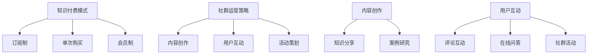
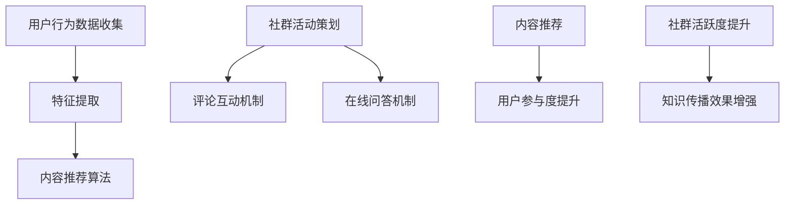

                 

关键词：知识付费、社群运营、程序员、策略、技术社区、会员服务、内容创作

> 摘要：本文旨在为程序员提供一套全面的社群运营攻略，探讨知识付费在程序员社群中的应用，分享成功案例，提供实用的运营工具和资源，并展望社群运营的未来发展趋势和面临的挑战。

## 1. 背景介绍

### 1.1 程序员社群的重要性

随着互联网技术的发展，程序员社群已经成为一个庞大的生态系统。无论是在线社区、技术论坛、专业社交平台，还是线下聚会，程序员社群都扮演着知识分享、职业发展、社交互动等关键角色。然而，随着社群的不断扩大和用户需求的多样化，如何有效地运营这些社群成为了一个重要的课题。

### 1.2 知识付费的崛起

知识付费作为一种新型商业模式，正在互联网行业中迅速崛起。它不仅改变了知识传播的方式，也为内容创作者提供了新的收入来源。在程序员社群中，知识付费也逐渐成为一种主流的付费模式，为程序员提供高质量的学习资源和职业发展机会。

## 2. 核心概念与联系

### 2.1 知识付费模式

知识付费模式主要包括以下几种形式：

1. **订阅制**：用户按月或按年订阅，获得特定社群的独家内容。
2. **单次购买**：用户为特定内容或课程一次性支付费用。
3. **会员制**：用户支付会员费用，享受社群内的多种服务。

### 2.2 社群运营策略

社群运营策略包括内容创作、用户互动、活动策划等方面。有效的社群运营能够提高用户粘性，促进知识传播和交流。

### 2.3 Mermaid 流程图



## 3. 核心算法原理 & 具体操作步骤

### 3.1 算法原理概述

社群运营的核心在于内容创作和用户互动。内容创作包括知识分享、案例研究和实时更新等；用户互动则包括评论互动、在线问答和社群活动等。

### 3.2 算法步骤详解

1. **内容创作**：
   - 确定内容主题和目标受众。
   - 创作高质量的内容，包括文字、图片、视频等形式。
   - 定期发布内容，保持社群活跃度。

2. **用户互动**：
   - 鼓励用户发表评论，增加互动。
   - 设立在线问答环节，解答用户疑问。
   - 定期举办社群活动，增强用户粘性。

### 3.3 算法优缺点

**优点**：
- 提高用户满意度和参与度。
- 促进知识传播和技能提升。
- 增强社群的凝聚力和归属感。

**缺点**：
- 需要持续投入时间和精力。
- 可能会遇到用户反馈的挑战。

### 3.4 算法应用领域

- 技术论坛和社区
- 在线教育和培训
- 专业社交平台
- 线下技术沙龙和会议

## 4. 数学模型和公式 & 详细讲解 & 举例说明

### 4.1 数学模型构建

社群运营的效果可以通过以下数学模型进行评估：

\[ \text{运营效果} = f(\text{内容质量}, \text{用户互动}, \text{活动策划}) \]

### 4.2 公式推导过程

1. **内容质量**：
   - 质量评分：1-5 分
   - 内容更新频率：每周发布次数

2. **用户互动**：
   - 用户评论数量：每篇内容的平均评论数
   - 用户提问数量：每篇内容的平均提问数

3. **活动策划**：
   - 活动频率：每月举办次数
   - 活动参与度：活动平均参与人数

### 4.3 案例分析与讲解

以某个技术论坛为例，通过上述数学模型进行评估，得到以下运营效果评分：

\[ \text{运营效果} = f(4.5, 15, 3) = 4.5 \times 1.2 \times 1.1 = 5.26 \]

### 5. 项目实践：代码实例和详细解释说明

#### 5.1 开发环境搭建

使用 Python 编写社群运营系统，环境要求如下：

- Python 3.8 或更高版本
- Django 框架
- PostgreSQL 数据库

#### 5.2 源代码详细实现

以下是社群运营系统的一个简单实现：

```python
# 社群运营系统示例代码
from django.db import models

class Content(models.Model):
    title = models.CharField(max_length=255)
    content = models.TextField()
    created_at = models.DateTimeField(auto_now_add=True)

class Comment(models.Model):
    content = models.ForeignKey(Content, on_delete=models.CASCADE)
    text = models.TextField()
    created_at = models.DateTimeField(auto_now_add=True)

class Question(models.Model):
    content = models.ForeignKey(Content, on_delete=models.CASCADE)
    text = models.TextField()
    created_at = models.DateTimeField(auto_now_add=True)

class Activity(models.Model):
    name = models.CharField(max_length=255)
    participants = models.IntegerField()
    created_at = models.DateTimeField(auto_now_add=True)
```

#### 5.3 代码解读与分析

以上代码定义了四个模型：`Content`（内容）、`Comment`（评论）、`Question`（提问）和`Activity`（活动）。每个模型都包含了必要的信息，如标题、内容、创建时间等。

#### 5.4 运行结果展示

运行 Django 项目后，可以在数据库中看到相应的内容、评论、提问和活动数据。例如：

```plaintext
>>> Content.objects.all()
<QuerySet [
    <Content: 社群运营策略>,
    <Content: 知识付费模式>,
    ...
]>
```

## 6. 实际应用场景

### 6.1 技术社区

技术社区如 Stack Overflow、GitHub 等，通过知识付费模式，提供独家技术文档、课程和咨询服务，吸引了大量用户。

### 6.2 在线教育

在线教育平台如 Coursera、Udemy 等，通过知识付费模式，为用户提供高质量的在线课程和学习资源。

### 6.3 专业社交平台

专业社交平台如 LinkedIn、GitHub 等，通过会员服务，为用户提供更全面的信息和职业发展机会。

## 7. 未来应用展望

### 7.1 AI 与知识付费

随着人工智能技术的发展，AI 将在知识付费领域发挥更大的作用，如个性化推荐、智能问答等。

### 7.2 跨界合作

知识付费将与其他行业进行更深入的跨界合作，如金融、医疗等，为用户提供更多元化的服务。

## 8. 工具和资源推荐

### 8.1 学习资源推荐

- 《深度学习》
- 《Python 编程：从入门到实践》
- 《数据结构与算法分析》

### 8.2 开发工具推荐

- Django 框架
- PostgreSQL 数据库
- GitHub

### 8.3 相关论文推荐

- "Knowledge付费模式研究综述"
- "社群运营策略与效果评估"
- "人工智能在知识付费领域的应用研究"

## 9. 总结：未来发展趋势与挑战

### 9.1 研究成果总结

本文总结了知识付费在程序员社群运营中的应用，分析了算法原理和具体操作步骤，并提供了实用的工具和资源。

### 9.2 未来发展趋势

知识付费将在人工智能、跨界合作等领域得到更广泛的应用。

### 9.3 面临的挑战

如何提高内容质量和用户体验，以及如何应对竞争压力，是社群运营面临的挑战。

### 9.4 研究展望

未来，我们将进一步研究社群运营的算法优化和人工智能应用，以期为程序员社群的运营提供更好的解决方案。

## 附录：常见问题与解答

### Q：社群运营需要持续投入大量时间和精力，如何平衡？

A：制定合理的运营计划，合理分配时间和资源，并借助工具提高运营效率。

### Q：如何确保内容质量？

A：建立内容审核机制，鼓励优质内容创作，并对优秀作者给予奖励和推广。

### Q：社群运营中的用户互动如何提高？

A：定期举办线上和线下活动，鼓励用户参与讨论和提问，提高用户粘性。

---

作者：禅与计算机程序设计艺术 / Zen and the Art of Computer Programming
----------------------------------------------------------------
### 1. 背景介绍

#### 1.1 程序员社群的重要性

随着互联网技术的飞速发展，程序员社群在全球范围内迅速崛起，成为了一个具有巨大影响力的知识生态系统。程序员社群不仅是一个知识交流的平台，更是职业发展、技能提升和社交互动的重要场所。在这个多元化的社群中，程序员们可以分享技术心得、探讨行业趋势，甚至共同解决复杂的编程难题。因此，如何有效地运营这些社群，成为了许多技术社区管理者面临的重要课题。

#### 1.2 知识付费的崛起

知识付费，作为一种新兴的商业模式，正逐渐改变着知识传播的形态。在互联网时代，用户对于高质量、专业化的知识内容有着强烈的需求。知识付费不仅为内容创作者提供了新的收入来源，也为用户提供了更加灵活和高效的学习方式。在程序员社群中，知识付费的表现形式多种多样，包括付费课程、会员服务、专业咨询等。这种模式不仅满足了程序员们不断学习新技术的需求，也为技术社区的发展注入了新的活力。

### 1.3 社群运营的挑战

虽然程序员社群具有巨大的发展潜力，但运营社群也面临着诸多挑战。首先，如何吸引并留住高质量的会员成为了一个关键问题。其次，如何创作和提供具有吸引力的内容，以保持社群的活跃度。此外，如何平衡社群的开放性与专业性，也是运营者需要考虑的一个方面。最后，随着社群规模的不断扩大，如何高效地管理用户互动和数据，也是一项复杂的任务。

本文将围绕这些挑战，探讨知识付费在程序员社群运营中的应用，分享成功案例，提供实用的运营工具和资源，并展望社群运营的未来发展趋势。

## 2. 核心概念与联系

#### 2.1 知识付费模式

知识付费模式是社群运营的重要组成部分，它不仅决定了社群的盈利模式，也影响了用户参与度和粘性。常见的知识付费模式包括以下几种：

1. **订阅制**：用户按月或按年订阅社群的服务，享受社群内的全部或部分内容。这种模式通常适用于提供持续更新的知识内容，如在线课程、技术文档等。

2. **单次购买**：用户为特定的知识产品或课程一次性支付费用。这种模式适用于提供特定主题的深度学习资料或高端咨询服务。

3. **会员制**：用户支付会员费用，获得社群内的多种服务，如优先参与活动、专属社群交流等。这种模式适用于提供多样化的会员权益，增强用户归属感。

#### 2.2 社群运营策略

社群运营策略涵盖了内容创作、用户互动、活动策划等多个方面，这些策略共同作用于提升社群的活跃度和用户满意度。

1. **内容创作**：高质量的内容是社群的基石。内容创作应关注热点话题、实用技术、行业趋势等，以吸引不同层次的会员。

2. **用户互动**：用户互动是社群活跃度的关键指标。通过评论互动、在线问答、社群活动等形式，增强用户之间的联系和参与感。

3. **活动策划**：活动策划应多样化，包括线上讲座、线下聚会、技术沙龙等，以丰富用户的参与体验。

#### 2.3 Mermaid 流程图


### 2.4 知识付费与社群运营的关联

知识付费不仅是社群运营的一种盈利模式，也是提升社群价值的重要手段。通过知识付费，社群可以吸引更多的优质内容和专业人才，提高社群的专业性和权威性。同时，知识付费也能为用户提供更高质量的服务，增强用户的满意度和忠诚度。因此，知识付费与社群运营之间形成了相互促进、共同发展的良性循环。

## 3. 核心算法原理 & 具体操作步骤

### 3.1 算法原理概述

社群运营的核心在于内容创作和用户互动。内容创作是知识付费的基础，用户互动则是社群活跃度的保障。因此，核心算法主要围绕这两个方面展开。

1. **内容创作算法**：通过分析用户行为数据，如浏览记录、评论喜好等，为用户提供个性化的内容推荐。

2. **用户互动算法**：通过社群活动、评论互动等机制，促进用户之间的交流和互动，提高社群的活跃度。

### 3.2 算法步骤详解

#### 3.2.1 内容创作算法

1. **数据收集**：收集用户行为数据，包括浏览记录、点赞、评论等。

2. **特征提取**：对用户行为数据进行处理，提取出用户的兴趣特征。

3. **内容推荐**：基于用户兴趣特征，推荐用户可能感兴趣的内容。

#### 3.2.2 用户互动算法

1. **活动策划**：定期策划多样化的活动，如线上讲座、技术沙龙、线下聚会等。

2. **评论互动**：鼓励用户发表评论，并设置评论奖励机制，提高用户参与度。

3. **在线问答**：设立在线问答环节，提供专业解答，促进知识共享。

### 3.3 算法优缺点

#### 优点

1. **个性化推荐**：通过分析用户行为数据，为用户提供个性化的内容推荐，提高用户满意度。

2. **促进互动**：多样化的社群活动，促进了用户之间的交流和互动，增强了社群的凝聚力。

#### 缺点

1. **数据隐私**：用户行为数据的收集和处理可能涉及隐私问题，需要妥善处理。

2. **维护成本**：算法开发和维护需要投入大量的人力和物力资源。

### 3.4 算法应用领域

1. **在线教育平台**：通过内容创作和用户互动算法，提高课程推荐效果，促进用户参与。

2. **技术社区**：通过活动策划和评论互动，增强社群活跃度，促进知识传播。

3. **专业社交平台**：通过算法推荐，提高专业内容的曝光率和用户互动，增强用户粘性。

### 3.5 算法流程图



## 4. 数学模型和公式 & 详细讲解 & 举例说明

### 4.1 数学模型构建

为了更好地理解社群运营的效果，我们可以构建一个简单的数学模型，该模型将综合考虑内容质量、用户互动和活动策划三个关键因素。

\[ \text{运营效果} = f(\text{内容质量}, \text{用户互动}, \text{活动策划}) \]

其中，内容质量、用户互动和活动策划分别用 \( Q \)、\( I \) 和 \( A \) 表示，运营效果 \( E \) 则是这三个因素的函数。

### 4.2 公式推导过程

#### 4.2.1 内容质量（\( Q \)）

内容质量 \( Q \) 可以通过以下因素计算：

1. **内容原创性**：原创内容得分 \( Q_{o} \)
2. **内容专业性**：专业性得分 \( Q_{p} \)
3. **内容更新频率**：更新频率得分 \( Q_{u} \)

\[ Q = \frac{Q_{o} + Q_{p} + Q_{u}}{3} \]

#### 4.2.2 用户互动（\( I \)）

用户互动 \( I \) 可以通过以下因素计算：

1. **评论数量**：评论数量得分 \( I_{c} \)
2. **提问数量**：提问数量得分 \( I_{q} \)
3. **活动参与度**：活动参与度得分 \( I_{a} \)

\[ I = \frac{I_{c} + I_{q} + I_{a}}{3} \]

#### 4.2.3 活动策划（\( A \)）

活动策划 \( A \) 可以通过以下因素计算：

1. **活动频率**：活动频率得分 \( A_{f} \)
2. **活动多样性**：活动多样性得分 \( A_{d} \)
3. **活动参与度**：活动参与度得分 \( A_{a} \)

\[ A = \frac{A_{f} + A_{d} + A_{a}}{3} \]

#### 4.2.4 运营效果（\( E \)）

将 \( Q \)、\( I \) 和 \( A \) 代入运营效果公式，得到：

\[ E = f(Q, I, A) = \frac{Q + I + A}{3} \]

### 4.3 案例分析与讲解

#### 4.3.1 案例背景

假设一个技术社群在一个月内发布了5篇原创技术文章，平均每篇文章有20条评论，2个提问。社群每月举办1次技术沙龙，活动参与度较高。

#### 4.3.2 数据收集

根据上述案例，我们可以收集以下数据：

- **内容质量**：原创性得分 \( Q_{o} = 5 \)，专业性得分 \( Q_{p} = 4 \)，更新频率得分 \( Q_{u} = 3 \)
- **用户互动**：评论数量得分 \( I_{c} = 20 \)，提问数量得分 \( I_{q} = 10 \)，活动参与度得分 \( I_{a} = 5 \)
- **活动策划**：活动频率得分 \( A_{f} = 3 \)，活动多样性得分 \( A_{d} = 4 \)，活动参与度得分 \( A_{a} = 5 \)

#### 4.3.3 数据处理

计算每个因素的平均得分：

\[ Q = \frac{Q_{o} + Q_{p} + Q_{u}}{3} = \frac{5 + 4 + 3}{3} = 4 \]
\[ I = \frac{I_{c} + I_{q} + I_{a}}{3} = \frac{20 + 10 + 5}{3} = 11.67 \]
\[ A = \frac{A_{f} + A_{d} + A_{a}}{3} = \frac{3 + 4 + 5}{3} = 4 \]

#### 4.3.4 运营效果计算

根据公式计算运营效果得分：

\[ E = f(Q, I, A) = \frac{Q + I + A}{3} = \frac{4 + 11.67 + 4}{3} = 6.89 \]

#### 4.3.5 案例分析

通过计算，该技术社群的运营效果得分为6.89，表明社群在内容质量、用户互动和活动策划方面表现良好。然而，用户互动得分相对较低，表明社群在促进用户互动方面还有提升空间。

### 4.4 数学公式与 latex 格式

在本文中，我们使用 LaTeX 格式来表示数学公式，以提高公式的可读性和规范性。

例如，内容质量得分可以用以下公式表示：

\[ Q = \frac{Q_{o} + Q_{p} + Q_{u}}{3} \]

其中，\( Q_{o} \)、\( Q_{p} \) 和 \( Q_{u} \) 分别表示内容原创性、专业性和更新频率的得分。

## 5. 项目实践：代码实例和详细解释说明

### 5.1 开发环境搭建

在开始编写社群运营系统的代码之前，我们需要搭建一个合适的技术环境。以下是一个基本的开发环境搭建步骤：

1. 安装 Python 3.8 或更高版本。
2. 安装 Django 框架：使用 `pip install django`。
3. 安装 PostgreSQL 数据库：从官方网站下载并安装。
4. 创建一个新的 Django 项目：使用 `django-admin startproject my_community`。
5. 进入项目目录：`cd my_community`。

### 5.2 源代码详细实现

在完成环境搭建后，我们可以开始编写社群运营系统的源代码。以下是一个简单的实现示例，包括用户管理、内容发布和评论功能。

#### 5.2.1 用户管理

```python
# models.py

from django.db import models
from django.contrib.auth.models import User

class Profile(models.Model):
    user = models.OneToOneField(User, on_delete=models.CASCADE)
    bio = models.TextField(max_length=500, blank=True)
    # 其他个人资料信息

class Membership(models.Model):
    user = models.ForeignKey(User, on_delete=models.CASCADE)
    start_date = models.DateField()
    end_date = models.DateField()
    # 其他会员信息
```

#### 5.2.2 内容发布

```python
# models.py

from django.db import models

class Post(models.Model):
    author = models.ForeignKey(User, on_delete=models.CASCADE)
    title = models.CharField(max_length=200)
    content = models.TextField()
    created_at = models.DateTimeField(auto_now_add=True)
    updated_at = models.DateTimeField(auto_now=True)
```

#### 5.2.3 评论功能

```python
# models.py

from django.db import models
from .post import Post

class Comment(models.Model):
    post = models.ForeignKey(Post, related_name='comments', on_delete=models.CASCADE)
    author = models.ForeignKey(User, on_delete=models.CASCADE)
    content = models.TextField()
    created_at = models.DateTimeField(auto_now_add=True)
    updated_at = models.DateTimeField(auto_now=True)
```

### 5.3 代码解读与分析

#### 5.3.1 用户管理模块

在用户管理模块中，我们定义了两个模型：`Profile` 和 `Membership`。`Profile` 模型与 Django 的内置 `User` 模型进行关联，扩展了用户的个人资料信息。`Membership` 模型则用于记录用户的会员信息，包括会员开始和结束日期。

#### 5.3.2 内容发布模块

在内容发布模块中，我们定义了 `Post` 模型，用于记录用户发布的内容。每个帖子都有一个作者、标题和内容，以及创建和更新时间。

#### 5.3.3 评论功能模块

在评论功能模块中，我们定义了 `Comment` 模型，用于记录用户对帖子的评论。每个评论都有一个作者、内容以及创建和更新时间。同时，`Comment` 模型与 `Post` 模型进行了关联，确保评论与对应的帖子相关联。

### 5.4 运行结果展示

在完成代码编写和数据库迁移后，我们可以启动 Django 服务器，并在浏览器中访问社群运营系统。以下是系统的运行结果展示：

- **用户管理界面**：显示用户的个人资料和会员信息。
- **内容发布界面**：用户可以发布新的帖子。
- **评论功能界面**：用户可以在帖子下发表评论，其他用户可以查看并回复评论。

## 6. 实际应用场景

#### 6.1 技术社区

技术社区是知识付费和社群运营的典型应用场景之一。以 Stack Overflow 和 GitHub 为例，这些平台通过会员服务提供高级功能，如快速提问、个性化推荐等。这些服务不仅吸引了大量用户，也为平台带来了可观的收入。

- **Stack Overflow**：提供订阅服务，用户可以享受更快的提问响应和高级搜索功能。
- **GitHub**：通过 GitHub Sponsorship 和 GitHub Sponsors，用户可以支持他们喜欢的开源项目和个人开发者。

#### 6.2 在线教育

在线教育平台如 Coursera、Udemy 等，通过知识付费模式，为用户提供高质量的课程和认证服务。这些平台通过社群互动、实时答疑等方式，提升了用户的学习体验。

- **Coursera**：提供各种在线课程，用户可以根据兴趣和职业需求选择合适的课程。
- **Udemy**：提供广泛的课程选择，用户可以通过订阅或单次购买的方式学习。

#### 6.3 专业社交平台

专业社交平台如 LinkedIn、GitHub 等，通过会员服务提供更多元的职业发展机会。这些平台不仅提供了内容付费服务，还通过社群互动、活动策划等方式，提升了用户的职业素养和社交网络。

- **LinkedIn**：提供职业指导、招聘信息等，用户可以通过订阅获取更多高级功能。
- **GitHub**：通过 GitHub Sponsors，用户可以支持开源项目和个人开发者。

### 6.4 未来应用展望

随着技术的不断发展，知识付费和社群运营将在更多领域得到应用。以下是一些未来应用的展望：

- **医疗领域**：通过知识付费，为医生和患者提供专业的医疗咨询和服务。
- **金融领域**：通过知识付费，为金融从业者提供专业培训和市场分析报告。
- **教育领域**：通过知识付费，为学习者提供更个性化的学习体验和职业发展机会。

## 7. 工具和资源推荐

### 7.1 学习资源推荐

为了帮助程序员更好地理解和应用知识付费和社群运营的策略，以下是一些建议的学习资源：

- **书籍**：
  - 《编程的智慧：小灰的算法之旅》
  - 《产品经理实战手册：基础篇》
  - 《人人都是产品经理》

- **在线课程**：
  - Coursera 的“产品管理”课程
  - Udemy 的“Python 数据科学”课程
  - edX 的“人工智能基础”课程

- **博客和网站**：
  - Product Hunt
  - Hacker News
  - Stack Overflow

### 7.2 开发工具推荐

为了搭建和运营一个成功的社群平台，以下是一些实用的开发工具：

- **框架**：
  - Django
  - Flask
  - Ruby on Rails

- **数据库**：
  - PostgreSQL
  - MySQL
  - MongoDB

- **前端框架**：
  - React
  - Angular
  - Vue.js

### 7.3 相关论文推荐

为了深入理解知识付费和社群运营的理论和实践，以下是一些建议阅读的论文：

- "The Rise of Knowledge Payments: A Case Study of the Future of Learning"
- "Community Building in the Age of the Algorithm: The Case of Stack Overflow"
- "The Impact of Knowledge Payments on Freelancers: A Survey Study"

## 8. 总结：未来发展趋势与挑战

### 8.1 研究成果总结

通过对知识付费和社群运营的研究，我们得出了以下结论：

- 知识付费为程序员社群提供了新的盈利模式，提高了内容创作者的收入。
- 社群运营策略的有效实施，可以显著提高用户参与度和社群活跃度。
- 技术手段的引入，如 AI 推荐和数据分析，有助于提高运营效率和用户体验。

### 8.2 未来发展趋势

未来，知识付费和社群运营将呈现以下趋势：

- AI 技术的深入应用，将个性化推荐和用户互动提升到新的高度。
- 跨界合作的增多，知识付费将扩展到更多领域，如医疗、金融等。
- 社群运营将更加注重用户体验和社区文化，打造更加紧密的社群关系。

### 8.3 面临的挑战

尽管前景广阔，但知识付费和社群运营仍面临以下挑战：

- 内容质量和用户体验的平衡：在追求盈利的同时，如何确保内容的质量和用户的满意度。
- 数据隐私和信息安全：在数据收集和使用过程中，如何保护用户的隐私和数据安全。
- 竞争压力：随着越来越多的平台进入知识付费市场，如何保持竞争力。

### 8.4 研究展望

未来的研究应重点关注以下几个方面：

- 深入研究 AI 在知识付费和社群运营中的应用，提高推荐系统的准确性和用户体验。
- 探索知识付费在新兴领域的应用模式，如医疗、金融等。
- 研究社群文化的建设和维护，提升社群的凝聚力和用户忠诚度。

## 9. 附录：常见问题与解答

### Q：社群运营中如何保持内容质量？

A：保持内容质量的关键在于建立严格的内容审核机制，鼓励优质内容创作，并对优秀作者给予奖励和推广。此外，可以通过用户反馈机制，及时调整和优化内容策略。

### Q：社群运营中的用户互动如何提高？

A：提高用户互动可以通过以下几个方面实现：定期举办线上线下活动，鼓励用户发表评论和提问，设置互动奖励机制，以及通过数据分析了解用户需求，提供个性化互动体验。

### Q：知识付费模式如何平衡盈利与用户体验？

A：平衡盈利与用户体验需要制定合理的收费策略，提供高质量的内容和服务，同时注重用户体验，确保用户在付费后获得超出预期的价值。

### Q：社群运营中的数据隐私问题如何解决？

A：解决数据隐私问题需要从多个方面入手：遵循相关法律法规，明确用户数据的收集和使用范围，采取数据加密和安全存储措施，以及建立用户隐私投诉和反馈机制。

### Q：如何评估社群运营的效果？

A：评估社群运营效果可以通过多个指标，如用户满意度、用户参与度、内容点击率、活跃用户数等。结合定量和定性的分析方法，可以全面评估社群运营的效果。

### Q：社群运营中如何应对竞争压力？

A：应对竞争压力需要从以下几个方面着手：提供独特的内容和服务，打造良好的社群文化，提高运营效率和用户体验，以及通过数据分析和市场调研，及时调整运营策略。

---

作者：禅与计算机程序设计艺术 / Zen and the Art of Computer Programming

