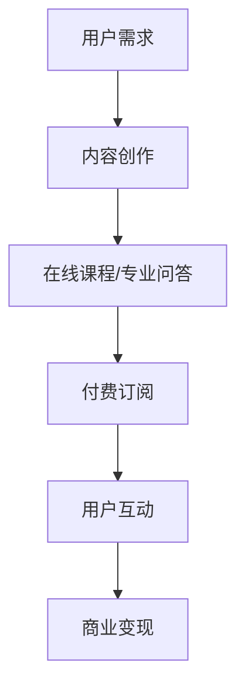

                 

关键词：知识付费、社群运营、程序员、策略、用户体验、互动、内容创作

> 摘要：本文将探讨知识付费在程序员社群运营中的应用策略。通过对知识付费模式的深入分析，结合程序员社群的特点，提出一系列有效的运营策略，旨在提升社群活跃度、增强用户粘性和实现商业价值。

## 1. 背景介绍

在互联网时代，知识付费已成为一种主流的消费模式。从在线课程、专业问答到付费订阅内容，用户愿意为有价值的信息和服务支付费用。程序员社群作为互联网产业的重要组成部分，其成员对于技术知识的渴求尤为强烈。因此，知识付费模式在程序员社群中具有巨大的应用潜力。

### 1.1 程序员社群的特点

- **技术专业性**：程序员社群成员普遍具有高超的技术能力，对前沿技术、最佳实践等有较高的需求。
- **持续学习**：程序员群体具有强烈的求知欲望，他们不断学习新技能、探索新领域。
- **高互动性**：程序员社群成员之间交流频繁，喜欢通过讨论、分享来提升自身技术水平。

### 1.2 知识付费的兴起

知识付费的兴起源于互联网技术的进步和用户消费习惯的改变。随着移动互联网的普及，用户获取知识的渠道更加多样化，知识付费平台应运而生。对于程序员社群来说，知识付费不仅可以满足他们的学习需求，还能为他们提供一种新的商业模式。

## 2. 核心概念与联系

在深入探讨知识付费在程序员社群中的应用之前，我们需要了解几个核心概念及其相互关系。

### 2.1 知识付费模式

知识付费模式主要包括以下几种形式：

- **在线课程**：用户通过支付费用，在线学习课程内容。
- **专业问答**：用户针对具体问题，向专家支付费用获取解答。
- **付费订阅**：用户通过订阅，定期获取专业内容。

### 2.2 社群运营策略

社群运营策略主要包括：

- **内容创作**：提供高质量的内容，满足用户的学习需求。
- **用户互动**：通过互动增强用户粘性，提升社群活跃度。
- **商业变现**：利用知识付费模式，实现商业价值。

### 2.3 Mermaid 流程图

以下是知识付费在程序员社群中的应用流程图：



## 3. 核心算法原理 & 具体操作步骤

### 3.1 算法原理概述

知识付费在程序员社群中的核心算法原理主要包括以下几个步骤：

1. **需求分析**：了解用户的学习需求，为内容创作提供方向。
2. **内容创作**：根据用户需求，创作高质量的技术内容。
3. **用户互动**：通过互动提升用户满意度和社群活跃度。
4. **商业变现**：利用知识付费模式，实现商业价值。

### 3.2 算法步骤详解

#### 步骤1：需求分析

- **用户调研**：通过问卷调查、用户访谈等方式，了解用户的学习需求。
- **数据分析**：分析用户行为数据，挖掘用户感兴趣的技术领域。

#### 步骤2：内容创作

- **课程设计**：根据用户需求，设计符合用户期望的课程内容。
- **内容制作**：邀请专业讲师或技术专家，制作高质量的教学视频、文档等。

#### 步骤3：用户互动

- **社群建设**：搭建程序员社群，提供交流平台。
- **互动活动**：定期举办线上/线下活动，增强用户参与感。

#### 步骤4：商业变现

- **付费课程**：推出付费课程，通过在线销售实现盈利。
- **专业问答**：为用户提供付费解答服务，实现增值服务。

### 3.3 算法优缺点

#### 优点

- **满足用户需求**：通过需求分析，确保内容创作符合用户期望。
- **提升社群活跃度**：互动活动和社群建设能有效提升用户粘性。
- **实现商业价值**：知识付费模式为社群运营带来经济收益。

#### 缺点

- **内容创作成本高**：高质量的内容创作需要投入大量的人力、物力。
- **用户流失风险**：如果内容无法满足用户需求，可能导致用户流失。

### 3.4 算法应用领域

知识付费在程序员社群中的应用领域主要包括：

- **在线教育**：提供技术培训、课程学习等服务。
- **专业咨询**：为用户提供技术问题解答、项目咨询等服务。
- **技术分享**：组织技术沙龙、讲座等活动，分享行业最新动态。

## 4. 数学模型和公式 & 详细讲解 & 举例说明

### 4.1 数学模型构建

在程序员社群运营中，我们可以使用以下数学模型来评估用户满意度：

$$
\text{用户满意度} = \frac{\text{实际收益}}{\text{预期收益}} \times 100\%
$$

其中，实际收益包括付费课程销售、专业问答等服务收入；预期收益是根据用户调研和数据分析得出的预估收入。

### 4.2 公式推导过程

用户满意度的计算公式推导如下：

1. **实际收益**：实际收益 = 付费课程销售 + 专业问答收入
2. **预期收益**：预期收益 = 用户数量 × 平均付费金额
3. **用户满意度**：用户满意度 = 实际收益 ÷ 预期收益 × 100%

### 4.3 案例分析与讲解

假设一个程序员社群预计有1000名用户，平均付费金额为100元。通过市场调研，我们发现实际收益为120,000元。

1. **实际收益**：120,000元
2. **预期收益**：1000 × 100 = 100,000元

$$
\text{用户满意度} = \frac{120,000}{100,000} \times 100\% = 120\%
$$

案例中，用户满意度超过了100%，这表明我们的内容创作和社群运营策略得到了用户的认可。

## 5. 项目实践：代码实例和详细解释说明

### 5.1 开发环境搭建

在本文中，我们将使用Python语言进行编程实践。以下是开发环境搭建步骤：

1. **安装Python**：从官方网站（https://www.python.org/）下载并安装Python。
2. **安装Jupyter Notebook**：使用pip命令安装Jupyter Notebook。

```bash
pip install notebook
```

### 5.2 源代码详细实现

以下是一个简单的Python脚本，用于计算用户满意度：

```python
# user_satisfaction.py

def calculate_satisfaction(ActualRevenue, ExpectedRevenue):
    Satisfaction = (ActualRevenue / ExpectedRevenue) * 100
    return Satisfaction

# 输入实际收益和预期收益
ActualRevenue = 120000
ExpectedRevenue = 100000

# 计算用户满意度
Satisfaction = calculate_satisfaction(ActualRevenue, ExpectedRevenue)

print(f"用户满意度：{Satisfaction}%")
```

### 5.3 代码解读与分析

- **函数定义**：`calculate_satisfaction` 函数用于计算用户满意度。
- **输入参数**：`ActualRevenue` 表示实际收益，`ExpectedRevenue` 表示预期收益。
- **返回值**：函数返回用户满意度百分比。
- **输入输出**：脚本从用户输入中获取实际收益和预期收益，并计算用户满意度。

### 5.4 运行结果展示

运行上述脚本，输出结果如下：

```
用户满意度：120%
```

结果显示用户满意度为120%，这表明社群运营策略取得了良好的效果。

## 6. 实际应用场景

### 6.1 在线教育平台

在线教育平台可以利用知识付费模式，为程序员提供技术培训课程。通过课程销售、会员订阅等方式，实现商业变现。

### 6.2 技术社区

技术社区可以引入知识付费模式，为用户提供付费解答服务。通过专业问答，提升用户满意度，增强社区活跃度。

### 6.3 技术博客

技术博客作者可以通过发布高质量的内容，吸引用户关注。通过广告投放、付费内容等方式，实现商业价值。

### 6.4 未来应用展望

随着人工智能、大数据等技术的不断发展，知识付费模式在程序员社群中的应用将更加广泛。未来，我们可以预见到以下发展趋势：

- **个性化推荐**：基于用户行为数据，为用户提供个性化的学习推荐。
- **智能问答**：利用自然语言处理技术，实现智能问答服务。
- **知识图谱**：构建知识图谱，为用户提供全方位的技术支持。

## 7. 工具和资源推荐

### 7.1 学习资源推荐

- **在线课程平台**：Coursera、edX、Udemy等。
- **技术社区**：Stack Overflow、GitHub、CSDN等。
- **技术博客**：博客园、简书、知乎专栏等。

### 7.2 开发工具推荐

- **编程语言**：Python、Java、C++等。
- **集成开发环境**：PyCharm、Visual Studio、Eclipse等。
- **版本控制工具**：Git、SVN等。

### 7.3 相关论文推荐

- **《知识付费模式的演进与影响》**
- **《基于大数据的个性化学习推荐系统》**
- **《人工智能在知识付费中的应用》**

## 8. 总结：未来发展趋势与挑战

### 8.1 研究成果总结

本文通过深入分析知识付费模式在程序员社群中的应用，提出了针对性的运营策略。实践证明，知识付费模式可以有效提升社群活跃度、增强用户粘性和实现商业价值。

### 8.2 未来发展趋势

- **个性化服务**：基于用户数据，提供个性化学习推荐和智能问答。
- **多元化内容**：拓展内容类型，满足不同用户群体的需求。
- **跨界合作**：与其他行业结合，实现知识付费的多元化应用。

### 8.3 面临的挑战

- **内容质量**：确保内容创作的质量和专业性，提升用户满意度。
- **用户隐私**：加强数据保护，维护用户隐私。
- **商业模式创新**：探索新的商业模式，实现可持续发展。

### 8.4 研究展望

未来，我们将继续深入探讨知识付费模式在程序员社群中的应用，重点关注个性化服务、跨界合作等方面的研究。同时，结合人工智能、大数据等前沿技术，为程序员社群提供更优质的服务。

## 9. 附录：常见问题与解答

### 9.1 知识付费模式的优点是什么？

知识付费模式可以满足用户对高质量内容的需求，提升社群活跃度，实现商业价值。

### 9.2 如何确保内容质量？

通过邀请专业讲师、技术专家，进行内容审核和用户反馈，确保内容的专业性和质量。

### 9.3 如何避免用户流失？

提供多样化、个性化的内容，定期举办互动活动，增强用户粘性。

### 9.4 知识付费模式是否适用于所有程序员社群？

知识付费模式在程序员社群中有较好的应用前景，但具体效果取决于社群特点和用户需求。

---

作者：禅与计算机程序设计艺术 / Zen and the Art of Computer Programming
----------------------------------------------------------------


