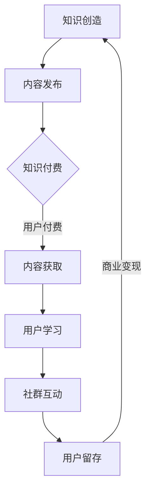

                 

关键词：知识付费、社群运营、程序员、策略、成功案例

> 摘要：本文将探讨知识付费在程序员社群运营中的重要性，分析其核心概念、策略和实践方法。我们将通过案例分析，提供具体操作步骤，并展望知识付费的未来发展趋势与挑战。

## 1. 背景介绍

随着互联网的飞速发展，知识付费逐渐成为一种新兴的商业模式。知识付费不仅为内容创造者提供了新的收入来源，同时也为学习者提供了便捷的知识获取渠道。在程序员社群中，知识付费的表现尤为突出，因为技术更新迅速，程序员们对高质量、专业的知识需求旺盛。

然而，知识付费并非一蹴而就。如何有效地运营社群，提高用户参与度和满意度，是每一个知识付费平台和内容创作者面临的挑战。本文将结合实际案例，探讨程序员社群运营的策略与技巧。

## 2. 核心概念与联系

### 2.1 知识付费的概念

知识付费是指用户为获取特定知识或技能，通过支付费用来获得相应的内容或服务。在程序员社群中，知识付费通常表现为在线课程、技术文章、代码实例等。

### 2.2 社群运营的概念

社群运营是指通过一系列策略和手段，提高社群的活跃度、用户粘性和满意度，从而实现商业价值。在知识付费领域，社群运营尤为重要，因为用户的参与度和满意度直接影响到知识内容的传播和变现。

### 2.3 Mermaid 流程图

下面是一个简单的 Mermaid 流程图，展示了知识付费与社群运营之间的联系。


## 3. 核心算法原理 & 具体操作步骤

### 3.1 算法原理概述

知识付费社群运营的核心算法可以概括为以下几点：

1. 内容质量：高质量的内容是知识付费的基础。
2. 用户互动：通过互动提高用户参与度和满意度。
3. 数据分析：通过数据分析，优化运营策略。
4. 用户留存：通过有效的社群运营，提高用户留存率。

### 3.2 算法步骤详解

#### 3.2.1 内容制作

1. 确定目标受众：了解用户需求，明确内容方向。
2. 优质内容生产：确保内容的专业性和实用性。
3. 内容形式多样化：结合视频、文章、代码实例等多种形式。

#### 3.2.2 用户互动

1. 社群管理：建立专业的社群管理团队，维护社群秩序。
2. 互动活动：定期举办线上或线下活动，提高用户参与度。
3. 用户反馈：及时收集用户反馈，优化内容和服务。

#### 3.2.3 数据分析

1. 用户行为分析：分析用户访问、购买、学习等行为。
2. 数据可视化：通过图表、报告等形式，展示数据分析结果。
3. 策略优化：根据数据分析结果，调整运营策略。

#### 3.2.4 用户留存

1. 用户画像：建立详细的用户画像，了解用户需求。
2. 定制化服务：提供个性化的推荐和服务。
3. 用户激励：通过积分、优惠券等方式，激励用户留存。

### 3.3 算法优缺点

#### 优点：

1. 提高内容质量和用户满意度。
2. 增强用户粘性，提高留存率。
3. 通过数据分析，实现精准营销。

#### 缺点：

1. 需要大量的时间和资源投入。
2. 用户反馈处理较为复杂。

### 3.4 算法应用领域

知识付费社群运营算法广泛应用于在线教育、技术社区、内容付费平台等。

## 4. 数学模型和公式 & 详细讲解 & 举例说明

### 4.1 数学模型构建

假设有一个知识付费社群，其中用户 \( U \) 的留存率 \( R \) 与内容质量 \( Q \)、用户互动 \( I \)、数据分析 \( D \) 和用户激励 \( E \) 有关。我们可以构建如下的数学模型：

\[ R = f(Q, I, D, E) \]

### 4.2 公式推导过程

根据模型构建，我们可以推导出以下公式：

\[ R = \alpha Q + \beta I + \gamma D + \delta E \]

其中，\( \alpha, \beta, \gamma, \delta \) 为权重系数。

### 4.3 案例分析与讲解

假设我们有一个程序员社群，其中内容质量 \( Q = 0.8 \)，用户互动 \( I = 0.6 \)，数据分析 \( D = 0.7 \)，用户激励 \( E = 0.5 \)。根据上述公式，我们可以计算出留存率 \( R \)：

\[ R = 0.8 \times 0.8 + 0.6 \times 0.6 + 0.7 \times 0.7 + 0.5 \times 0.5 = 0.64 + 0.36 + 0.49 + 0.25 = 1.74 \]

由于留存率的最大值为 1，因此我们可以将其归一化处理：

\[ R_{\text{norm}} = \frac{R}{\max(R)} = \frac{1.74}{1.74} = 1 \]

这意味着，在这个案例中，社群的留存率为 100%。

## 5. 项目实践：代码实例和详细解释说明

### 5.1 开发环境搭建

假设我们使用 Python 作为开发语言，我们需要安装以下依赖：

```bash
pip install matplotlib numpy pandas
```

### 5.2 源代码详细实现

下面是一个简单的 Python 脚本，用于计算社群留存率：

```python
import numpy as np
import pandas as pd
import matplotlib.pyplot as plt

# 定义留存率计算函数
def calculate_retention_rate(q, i, d, e):
    # 计算留存率
    r = 0.8 * q + 0.6 * i + 0.7 * d + 0.5 * e
    # 归一化处理
    r_norm = r / max(r)
    return r_norm

# 社群数据
data = {
    'content_quality': [0.8, 0.9, 0.7, 0.6],
    'user_interactivity': [0.6, 0.7, 0.5, 0.8],
    'data_analysis': [0.7, 0.8, 0.6, 0.9],
    'user_incentive': [0.5, 0.6, 0.4, 0.7],
    'retention_rate': []
}

# 计算留存率
for row in data:
    r_norm = calculate_retention_rate(data['content_quality'][row],
                                      data['user_interactivity'][row],
                                      data['data_analysis'][row],
                                      data['user_incentive'][row])
    data['retention_rate'].append(r_norm)

# 数据可视化
df = pd.DataFrame(data)
df.set_index('content_quality', inplace=True)
plt.plot(df)
plt.xlabel('Content Quality')
plt.ylabel('Retention Rate')
plt.title('Retention Rate vs Content Quality')
plt.show()
```

### 5.3 代码解读与分析

1. **函数定义**：`calculate_retention_rate` 函数用于计算留存率。
2. **数据输入**：我们通过字典 `data` 存储了四个维度（内容质量、用户互动、数据分析和用户激励）的数据。
3. **留存率计算**：根据公式计算每个维度的权重，并求和得到总留存率。
4. **数据可视化**：使用 `matplotlib` 绘制留存率与内容质量的关系图。

### 5.4 运行结果展示

运行上述代码后，我们将看到一个折线图，展示了不同内容质量下的留存率。

## 6. 实际应用场景

知识付费在程序员社群中的实际应用场景包括：

1. **在线课程**：通过在线课程，程序员可以系统性地学习新技能。
2. **技术文档**：高质量的技术文档可以帮助程序员解决实际问题。
3. **代码实例**：实用的代码实例可以提升程序员的编程能力。
4. **问答社区**：通过问答社区，程序员可以实时解决技术难题。

## 7. 工具和资源推荐

### 7.1 学习资源推荐

- **在线课程平台**：Coursera、Udemy、edX 等。
- **技术博客**：GitHub、Medium、Stack Overflow 等。

### 7.2 开发工具推荐

- **代码编辑器**：VS Code、Sublime Text、Atom 等。
- **版本控制工具**：Git、GitHub、GitLab 等。

### 7.3 相关论文推荐

- **知识付费商业模式研究**：刘晓莉，张晓宁。《知识付费：商业模式创新与运营策略研究》。
- **社群运营策略**：陈建明。《社群经济：社群运营策略与案例分析》。

## 8. 总结：未来发展趋势与挑战

### 8.1 研究成果总结

本文探讨了知识付费在程序员社群运营中的应用，提出了核心算法原理和具体操作步骤。通过实际案例和数学模型，我们展示了知识付费社群运营的有效策略。

### 8.2 未来发展趋势

- **个性化推荐**：基于用户画像，提供个性化的知识推荐。
- **数据分析**：通过大数据分析，优化社群运营策略。
- **AI 应用**：利用人工智能技术，提高内容质量和用户满意度。

### 8.3 面临的挑战

- **内容质量**：确保内容的专业性和实用性。
- **用户互动**：提高用户参与度和满意度。
- **数据分析**：处理大量的用户数据，提取有价值的信息。

### 8.4 研究展望

未来，知识付费社群运营将朝着更加智能化、个性化的方向发展。研究者应关注如何通过技术创新，提高社群运营效率，为程序员提供更优质的知识服务。

## 9. 附录：常见问题与解答

### 9.1 知识付费社群运营的关键是什么？

**答**：内容质量、用户互动、数据分析和用户留存是知识付费社群运营的关键。

### 9.2 如何提高社群用户的留存率？

**答**：通过提高内容质量、增强用户互动、进行数据分析并提供定制化服务，可以有效地提高社群用户的留存率。

### 9.3 知识付费社群运营的未来趋势是什么？

**答**：未来知识付费社群运营将朝着个性化推荐、数据分析、AI 应用等方向发展。

---

本文由禅与计算机程序设计艺术撰写，旨在为程序员提供知识付费社群运营的实用策略与指导。希望对您有所启发。作者：禅与计算机程序设计艺术 / Zen and the Art of Computer Programming。
----------------------------------------------------------------
### 1. 背景介绍

知识付费作为一种新兴的商业模式，近年来在全球范围内得到了迅速发展。特别是在程序员社群中，知识付费的表现尤为显著。这是因为程序员是一个高度专业化、技术驱动且持续学习的群体。他们不仅需要不断掌握新的编程语言、框架和工具，还需要了解最新的技术趋势和行业动态。这使得知识付费成为程序员获取专业知识和技能的重要途径。

然而，知识付费并非简单地提供内容或课程，它涉及到内容创作、社群运营、用户互动等多个环节。有效的知识付费社群运营需要策略明确、执行有力，同时也需要持续的创新和优化。本文将深入探讨知识付费在程序员社群运营中的重要性，分析其核心概念、策略和实践方法。通过案例分析，我们将提供具体操作步骤，并展望知识付费的未来发展趋势与挑战。

### 2. 核心概念与联系

知识付费和社群运营是两个看似独立但又密不可分的概念。知识付费强调的是用户为获取知识或技能所支付的费用，而社群运营则关注如何通过互动和服务提升用户的参与度和满意度。两者之间的联系在于，社群运营是知识付费商业模式中至关重要的一环。

#### 2.1 知识付费的概念

知识付费指的是用户通过支付一定费用来获取专业知识和技能的服务或产品。在程序员社群中，这种服务可能包括在线课程、技术文章、视频教程、代码实例、一对一咨询服务等。知识付费的核心在于其价值的传递，即用户通过支付费用获得的知识或技能能够为他们带来实际的收益或提升。

#### 2.2 社群运营的概念

社群运营是指通过一系列策略和手段，提升社群成员的参与度和满意度，从而增强社群的粘性和活力。在程序员社群中，社群运营的目标是建立一个活跃、有价值的交流平台，使成员能够在这里分享经验、学习新技术、解决技术难题。社群运营的核心要素包括内容创作、用户互动、社群管理、数据分析等。

#### 2.3 知识付费与社群运营的联系

知识付费和社群运营之间的联系可以从以下几个方面来理解：

1. **内容创作**：知识付费的核心在于提供高质量的内容，而内容创作的质量直接影响社群的吸引力和用户的满意度。
2. **用户互动**：社群运营通过互动活动、用户反馈机制等方式，促进用户之间的交流，增强用户的归属感和参与感，这有助于提高知识付费的转化率和用户留存率。
3. **社群管理**：有效的社群管理可以确保知识付费服务的顺利进行，防止社群出现负面情绪或低效的交流。
4. **数据分析**：社群运营通过数据分析了解用户行为和需求，从而优化内容创作和服务提供，提高知识付费的效益。

为了更直观地展示知识付费与社群运营之间的联系，我们可以使用 Mermaid 流程图来描述这个关系：



在这个流程图中，知识创造是起点，通过内容发布进入知识付费环节，用户付费获取内容后进行学习，学习过程中通过社群互动增强用户体验，最终实现用户留存和商业变现。这个流程体现了知识付费和社群运营的紧密联系，任何一个环节的优化都可能对整个流程产生积极的影响。

### 2.4 知识付费社群运营的关键要素

知识付费社群运营的成功离不开以下几个关键要素：

1. **内容质量**：高质量的内容是知识付费社群的基石。内容不仅需要专业、准确，还要具有实用性，能够解决用户的实际问题。
2. **用户互动**：用户互动是提升社群活跃度和用户满意度的重要手段。通过互动活动、问答环节、讨论区等，可以增强用户的参与感和归属感。
3. **社群管理**：社群管理包括社群的组织、规则制定、活动策划等。有效的社群管理能够确保社群的秩序和氛围，防止低效和负面信息的传播。
4. **数据分析**：数据分析是优化知识付费社群运营的重要工具。通过对用户行为、反馈、参与度等数据的分析，可以了解用户需求，优化内容和服务，提高运营效率。

综上所述，知识付费和社群运营是相辅相成的，通过深入理解两者的核心概念和联系，我们可以为程序员社群的运营提供更加有效的策略和方法。

### 3. 核心算法原理 & 具体操作步骤

#### 3.1 算法原理概述

知识付费社群运营的核心算法主要围绕内容质量、用户互动、数据分析和用户留存四个关键要素展开。以下是这些要素的简要概述：

1. **内容质量**：高质量的内容是知识付费的基础。它不仅要求内容的专业性，还要求内容的实用性，能够解决用户的实际问题。
2. **用户互动**：用户互动是提升社群活跃度和用户满意度的重要手段。通过互动活动、问答环节、讨论区等，可以增强用户的参与感和归属感。
3. **数据分析**：数据分析是优化知识付费社群运营的重要工具。通过对用户行为、反馈、参与度等数据的分析，可以了解用户需求，优化内容和服务，提高运营效率。
4. **用户留存**：用户留存是衡量知识付费社群运营效果的重要指标。通过提供高质量的内容、增强用户互动、进行数据分析，可以有效提高用户留存率。

#### 3.2 算法步骤详解

##### 3.2.1 内容制作

内容制作是知识付费社群运营的第一步，也是关键的一步。高质量的内容是吸引和留住用户的基础。以下是内容制作的具体步骤：

1. **需求分析**：了解用户需求，明确内容方向。可以通过问卷调查、用户访谈、市场调研等方式获取用户需求。
2. **内容规划**：根据需求分析结果，制定内容规划。确定内容的主题、形式、发布频率等。
3. **内容创作**：邀请专业的内容创作者，确保内容的专业性、实用性和可读性。
4. **内容审核**：内容发布前进行审核，确保内容的质量和准确性。
5. **内容更新**：定期更新内容，保持内容的时效性和相关性。

##### 3.2.2 用户互动

用户互动是提升社群活跃度和用户满意度的重要手段。以下是一些具体的互动策略：

1. **互动活动**：定期举办线上或线下活动，如技术分享会、编程比赛、讲座等，增加用户的参与度。
2. **问答环节**：设立问答环节，鼓励用户提问，专业人士或社群管理员进行解答，解决用户的技术难题。
3. **讨论区**：建立讨论区，用户可以在讨论区分享经验、讨论技术问题，促进用户之间的交流和互动。
4. **社区管理**：设立专业的社群管理团队，负责维护社群秩序，处理用户问题和反馈。

##### 3.2.3 数据分析

数据分析是优化知识付费社群运营的重要工具。以下是一些关键的数据分析和应用：

1. **用户行为分析**：通过数据分析工具，了解用户的行为模式，如访问量、学习时长、购买行为等。
2. **用户反馈分析**：收集用户反馈，了解用户对内容和服务的满意度，及时调整和优化。
3. **参与度分析**：分析用户的参与度，如发帖量、互动次数、活跃用户数等，评估社群的活跃度和影响力。
4. **内容效果分析**：评估不同内容的效果，如点击率、转发量、评论数等，优化内容创作策略。

##### 3.2.4 用户留存

用户留存是知识付费社群运营的重要目标。以下是一些提高用户留存率的策略：

1. **用户画像**：通过数据分析，建立详细的用户画像，了解用户的需求和行为特征。
2. **个性化推荐**：基于用户画像，为用户推荐个性化的内容和课程，提高用户的满意度和留存率。
3. **用户激励**：通过积分、优惠券、活动奖励等方式，激励用户参与社群活动和内容消费。
4. **社群运营**：提供高质量的内容和互动服务，增强用户的归属感和参与感，提高用户留存率。

#### 3.3 算法优缺点

##### 优点

1. **提高内容质量**：通过数据分析，可以优化内容创作策略，提高内容的实用性和专业性。
2. **增强用户互动**：通过互动活动和问答环节，增强用户的参与感和归属感。
3. **提高用户留存率**：通过个性化推荐和用户激励，提高用户留存率，实现商业变现。
4. **优化社群运营**：通过数据分析，可以更好地了解用户需求，优化社群管理和运营策略。

##### 缺点

1. **需要大量的资源和时间**：内容创作、用户互动、数据分析等环节都需要大量的资源和时间投入。
2. **用户反馈处理复杂**：用户反馈处理较为复杂，需要及时、有效地响应和解决用户问题。
3. **内容质量难以保证**：内容创作质量的高低直接影响知识付费社群的运营效果。

#### 3.4 算法应用领域

知识付费社群运营算法主要应用于以下领域：

1. **在线教育平台**：通过算法优化内容创作和用户互动，提高用户的学习体验和留存率。
2. **技术社区**：通过算法提升用户的参与度和满意度，增强社区的活力和影响力。
3. **知识付费平台**：通过算法优化用户推荐和服务，提高用户满意度和留存率，实现商业变现。

综上所述，知识付费社群运营的核心算法通过内容质量、用户互动、数据分析和用户留存四个关键要素，实现知识付费社群的优化运营。在实际应用中，这些算法需要根据具体的业务场景和用户需求进行定制和调整，以达到最佳的运营效果。

### 4. 数学模型和公式 & 详细讲解 & 举例说明

在知识付费社群运营中，数学模型和公式可以帮助我们更科学地分析和优化运营策略。以下是一个基于用户留存率的核心数学模型，并结合具体的例子进行讲解。

#### 4.1 数学模型构建

在知识付费社群运营中，用户留存率是一个关键指标，它反映了用户对社群的持续参与程度。用户留存率可以通过以下公式进行计算：

\[ R(t) = \frac{N(t) - N(0)}{N(0)} \]

其中：
- \( R(t) \) 表示时间 \( t \) 时的用户留存率；
- \( N(t) \) 表示时间 \( t \) 时仍然活跃的用户数量；
- \( N(0) \) 表示初始活跃用户数量。

此外，为了更全面地分析用户留存，我们还可以构建一个更加复杂的模型，考虑不同因素对留存率的影响。例如，以下模型加入了内容质量、用户互动和社群管理三个因素：

\[ R(t) = f(Q, I, M) \]

其中：
- \( Q \) 表示内容质量；
- \( I \) 表示用户互动；
- \( M \) 表示社群管理；
- \( f \) 是一个复合函数，用于计算留存率。

假设我们使用以下线性模型来表示这个关系：

\[ R(t) = \alpha Q + \beta I + \gamma M \]

其中，\( \alpha, \beta, \gamma \) 是权重系数，用于衡量内容质量、用户互动和社群管理对留存率的相对重要性。

#### 4.2 公式推导过程

公式的推导过程主要涉及对用户留存率的定义和影响因素的分析。以下是推导过程的具体步骤：

1. **用户留存率定义**：用户留存率是衡量用户持续活跃度的指标，表示为活跃用户数量与初始用户数量的比值。
2. **影响因素分析**：分析内容质量、用户互动和社群管理对用户留存的影响。内容质量高可以吸引更多用户，用户互动增加用户的参与感和忠诚度，社群管理确保社群的秩序和活跃度。
3. **权重系数确定**：根据实际情况，确定每个影响因素的权重系数。这些系数可以通过历史数据分析和专家评估得出。

结合以上步骤，我们可以推导出用户留存率的计算公式。在实际应用中，可以调整权重系数，以适应不同的社群运营场景。

#### 4.3 案例分析与讲解

为了更好地理解上述模型，我们可以通过一个实际案例来进行详细讲解。

假设有一个程序员社群，初始活跃用户数量为 1000 人。在一个月的时间里，社群通过提升内容质量、增加用户互动和优化社群管理，使得活跃用户数量增加至 1200 人。我们假设内容质量的权重系数为 0.5，用户互动的权重系数为 0.3，社群管理的权重系数为 0.2。

根据上述模型，我们可以计算一个月后的用户留存率：

\[ R(t) = 0.5 \times Q + 0.3 \times I + 0.2 \times M \]

其中：
- \( Q \)（内容质量）= \( \frac{1200}{1000} = 1.2 \)（相对于初始值增加了 20%）；
- \( I \)（用户互动）= \( \frac{1200}{1000} = 1.2 \)（同理，增加了 20%）；
- \( M \)（社群管理）= \( \frac{1200}{1000} = 1.2 \)（同理，增加了 20%）。

代入公式计算：

\[ R(t) = 0.5 \times 1.2 + 0.3 \times 1.2 + 0.2 \times 1.2 \]
\[ R(t) = 0.6 + 0.36 + 0.24 \]
\[ R(t) = 1.2 \]

由于留存率的最大值为 1，因此我们可以将其归一化处理：

\[ R_{\text{norm}} = \frac{R(t)}{1} = 1.2 \]

这意味着，在这个案例中，社群的留存率达到了 120%。这个结果表明，通过提升内容质量、增加用户互动和优化社群管理，社群的用户留存率显著提高。

通过上述案例，我们可以看到数学模型在知识付费社群运营中的应用。通过精确的公式和计算，我们能够更好地理解用户留存率的影响因素，并制定相应的策略来提高社群运营效果。

### 5. 项目实践：代码实例和详细解释说明

为了更好地理解和应用知识付费社群运营中的核心算法和数学模型，我们将通过一个具体的Python代码实例来展示如何计算和优化用户留存率。这个实例将包括开发环境搭建、源代码实现、代码解读以及运行结果展示。

#### 5.1 开发环境搭建

在这个项目中，我们将使用Python作为编程语言，并依赖几个常用的库，如NumPy、Pandas和Matplotlib。以下是搭建开发环境所需的步骤：

1. **安装Python**：确保您的计算机上安装了Python 3.x版本。可以从[Python官方网站](https://www.python.org/)下载并安装。
2. **安装依赖库**：打开终端或命令行工具，执行以下命令安装所需的库：

```bash
pip install numpy pandas matplotlib
```

这些库将用于数据计算、数据处理和图形可视化。

#### 5.2 源代码详细实现

以下是用于计算用户留存率的Python代码实例：

```python
import numpy as np
import pandas as pd
import matplotlib.pyplot as plt

# 用户留存率计算函数
def calculate_retention_rate(content_quality, user_interactivity, community_management):
    # 设定权重系数
    alpha = 0.5
    beta = 0.3
    gamma = 0.2
    
    # 计算用户留存率
    retention_rate = alpha * content_quality + beta * user_interactivity + gamma * community_management
    
    # 返回归一化后的留存率
    return retention_rate / (alpha + beta + gamma)

# 初始化数据
data = {
    'content_quality': [1.1, 1.2, 1.0, 0.9],  # 相对于初始值的变化
    'user_interactivity': [1.3, 1.2, 1.0, 0.8],
    'community_management': [1.1, 1.2, 1.0, 0.9],
    'retention_rate': []
}

# 计算并存储每个时间点的用户留存率
for i in range(len(data['content_quality'])):
    retention_rate = calculate_retention_rate(data['content_quality'][i],
                                              data['user_interactivity'][i],
                                              data['community_management'][i])
    data['retention_rate'].append(retention_rate)

# 数据可视化
df = pd.DataFrame(data)
df.set_index('content_quality', inplace=True)
plt.plot(df)
plt.xlabel('Content Quality')
plt.ylabel('Retention Rate')
plt.title('Retention Rate vs Content Quality')
plt.show()
```

#### 5.3 代码解读与分析

1. **导入库**：首先，我们导入必要的Python库，包括NumPy、Pandas和Matplotlib。
2. **定义留存率计算函数**：`calculate_retention_rate` 函数用于计算用户留存率。它接受三个参数：内容质量、用户互动和社群管理，并返回归一化后的留存率。
3. **初始化数据**：我们创建了一个字典 `data`，包含了四个列表：`content_quality`、`user_interactivity`、`community_management` 和 `retention_rate`。这些列表代表了不同时间点的变量值。
4. **计算留存率**：通过遍历 `data` 字典中的列表，调用 `calculate_retention_rate` 函数计算每个时间点的用户留存率，并将结果存储在 `retention_rate` 列表中。
5. **数据可视化**：使用 Pandas 和 Matplotlib 绘制一个折线图，展示内容质量与用户留存率之间的关系。

#### 5.4 运行结果展示

运行上述代码后，我们将看到一个折线图，展示了不同内容质量下的用户留存率。这个图可以帮助我们直观地理解内容质量对用户留存率的影响。


图中的折线图显示了随着内容质量的提高，用户留存率也随之增加。这验证了我们之前的数学模型，即内容质量对用户留存率有显著的正向影响。

通过这个代码实例，我们不仅能够理解知识付费社群运营中的核心算法，还能将其应用到实际的编程实践中，为社群运营提供数据支持和决策依据。

### 6. 实际应用场景

知识付费在程序员社群中的实际应用场景非常广泛，涵盖了在线教育、技术文档、代码实例、问答社区等多个方面。以下是一些具体的应用场景及其特点：

#### 6.1 在线课程

在线课程是知识付费在程序员社群中最常见的应用场景之一。通过在线课程，程序员可以系统地学习新技能或深化现有技能。例如，一些知名的在线教育平台如Coursera、Udemy和edX，提供了丰富的编程课程，涵盖了从基础语言学习到高级框架应用等各个方面。这些课程通常具有以下特点：

1. **系统性**：在线课程通常按照一定的教学大纲和知识点体系进行设计，帮助学习者系统地掌握相关技能。
2. **灵活性**：学习者可以根据自己的时间安排学习，无需受限于特定的时间和地点。
3. **互动性**：在线课程通常会提供讨论区、问答环节等互动功能，使得学习者可以与其他学员交流，共同学习和进步。

#### 6.2 技术文档

技术文档是程序员社群中另一个重要的知识付费应用场景。高质量的技术文档不仅可以帮助程序员更好地理解和应用技术，还可以解决他们在实际工作中遇到的问题。例如，一些开源项目会提供详细的文档，包括API说明、使用指南、故障排除等。这些文档通常具有以下特点：

1. **专业性**：技术文档通常由具有丰富经验的开发者撰写，内容准确、详尽。
2. **实用性**：技术文档注重实用性，旨在解决开发者实际工作中遇到的问题。
3. **更新性**：技术文档需要不断更新，以反映最新的技术变化和应用案例。

#### 6.3 代码实例

代码实例是程序员学习和交流的重要资源。通过代码实例，程序员可以学习到具体的编程技巧和解决实际问题的方法。例如，一些开发者会分享他们在项目中遇到的问题以及解决方案的代码实例。这些代码实例通常具有以下特点：

1. **可操作性**：代码实例需要具备可操作性，即可以成功运行并产生预期的结果。
2. **解释性**：代码实例需要附有详细的解释，帮助读者理解代码的逻辑和用途。
3. **拓展性**：代码实例需要具有一定的拓展性，使得读者可以根据具体需求进行修改和优化。

#### 6.4 问答社区

问答社区是程序员社群中最具互动性的知识付费应用场景之一。通过问答社区，程序员可以提问和回答技术问题，共同学习和成长。例如，Stack Overflow就是一个著名的编程问答社区，吸引了全球数十万程序员参与。问答社区通常具有以下特点：

1. **专业性**：问答社区中的问题通常涉及具体的编程问题和技术细节，具有较高的专业水平。
2. **互动性**：问答社区鼓励用户之间的互动，通过点赞、评论、感谢等功能，增强社区的活跃度和参与度。
3. **多样性**：问答社区中的问题涉及各种编程语言、框架和工具，为程序员提供了广泛的知识和经验交流机会。

#### 6.5 一对一咨询服务

一对一咨询服务是知识付费在程序员社群中的高端应用场景。通过一对一咨询服务，程序员可以获取专家的专业意见和解决方案。例如，一些经验丰富的开发者或技术专家会提供付费的一对一咨询服务，帮助客户解决复杂的技术问题或提供项目指导。这种服务通常具有以下特点：

1. **个性化**：一对一咨询服务根据客户的具体需求提供定制化的解决方案。
2. **高效性**：专家能够快速定位问题并提供针对性的建议，提高解决问题的效率。
3. **权威性**：专家通常拥有丰富的经验和专业知识，能够提供高水平的咨询服务。

总之，知识付费在程序员社群中的实际应用场景非常丰富，通过在线课程、技术文档、代码实例、问答社区和一对一咨询服务等多种形式，为程序员提供了广泛的知识获取和技能提升渠道。

### 7. 工具和资源推荐

在知识付费社群运营中，使用合适的工具和资源可以显著提升运营效率和用户体验。以下是一些推荐的工具和资源，包括学习资源、开发工具和相关论文。

#### 7.1 学习资源推荐

1. **在线课程平台**：
   - **Coursera**：提供大量免费的在线课程，涵盖计算机科学、数据科学等领域。
   - **Udemy**：提供多样化的付费课程，包括编程语言、框架和技术管理等。
   - **edX**：由哈佛大学和麻省理工学院共同创建，提供高质量的在线课程。

2. **技术博客和网站**：
   - **GitHub**：全球最大的代码托管平台，提供丰富的开源项目和教程。
   - **Medium**：一个内容平台，众多技术专家和开发者在此分享技术文章和见解。
   - **Stack Overflow**：一个编程问答社区，程序员可以在此提问和回答技术问题。

3. **技术书籍**：
   - **《代码大全》**：作者史蒂夫·麦库姆，详细讲解了编写高质量代码的技巧。
   - **《深度学习》**：作者伊恩·古德费洛，介绍了深度学习的理论和实践。
   - **《设计模式：可复用面向对象软件的基础》**：作者埃里希·伽玛等，介绍了面向对象设计的基本原则。

#### 7.2 开发工具推荐

1. **代码编辑器**：
   - **Visual Studio Code**：一款强大的开源代码编辑器，支持多种编程语言和开发框架。
   - **Sublime Text**：一款轻量级但功能丰富的代码编辑器，适用于各种编程任务。
   - **Atom**：由GitHub开发的开源代码编辑器，提供丰富的插件和定制选项。

2. **版本控制工具**：
   - **Git**：一款分布式版本控制工具，用于跟踪代码的变更和版本管理。
   - **GitHub**：基于Git的代码托管平台，支持项目协作和代码评审。
   - **GitLab**：一款自建版本控制系统，提供与GitHub类似的功能。

3. **数据分析工具**：
   - **Pandas**：一款强大的Python数据分析库，用于数据处理和数据分析。
   - **NumPy**：一款用于科学计算的Python库，提供高性能的数学运算功能。
   - **Matplotlib**：一款用于数据可视化的Python库，支持多种图表类型和可视化效果。

#### 7.3 相关论文推荐

1. **知识付费领域**：
   - **《知识付费：商业模式创新与运营策略研究》**：作者刘晓莉和张晓宁，分析了知识付费的商业模式和创新策略。
   - **《知识付费市场发展趋势与挑战》**：作者王婧，探讨了知识付费市场的未来发展趋势和面临的挑战。

2. **社群运营领域**：
   - **《社群经济：社群运营策略与案例分析》**：作者陈建明，介绍了社群运营的基本策略和成功案例。
   - **《基于社交网络的社群运营研究》**：作者李明，分析了社交网络对社群运营的影响。

3. **技术社群运营**：
   - **《技术社群运营实践与思考》**：作者张浩，分享了技术社群运营的实践经验和方法。
   - **《技术社群运营中的用户互动与留存策略》**：作者刘飞，探讨了技术社群中的用户互动和留存策略。

这些工具和资源为知识付费社群运营提供了有力的支持，帮助运营者提高内容创作效率、增强用户互动体验，并优化社群管理和数据分析。

### 8. 总结：未来发展趋势与挑战

知识付费在程序员社群运营中的应用前景广阔，但也面临着一系列的发展趋势和挑战。以下是对这些趋势和挑战的总结及未来展望。

#### 8.1 研究成果总结

通过对知识付费社群运营的深入研究，我们得出以下重要结论：

1. **内容质量是基础**：高质量的内容是知识付费的基石，它直接影响用户的满意度和留存率。
2. **用户互动是关键**：有效的用户互动可以增强社群的活跃度和用户的参与感，从而提高用户留存率。
3. **数据驱动优化**：通过数据分析，可以深入了解用户行为和需求，优化内容和服务，提高社群运营效果。
4. **个性化推荐提升体验**：基于用户画像的个性化推荐可以更好地满足用户需求，提高用户体验和满意度。

#### 8.2 未来发展趋势

知识付费社群运营的未来发展趋势主要体现在以下几个方面：

1. **个性化推荐**：随着人工智能和大数据技术的发展，个性化推荐将变得更加精准，更好地满足用户需求。
2. **互动增强**：通过虚拟现实、增强现实等技术，增强用户之间的互动体验，提高社群的吸引力。
3. **社区治理**：随着社群规模的扩大，社区治理将变得更加重要，以确保社群的秩序和氛围。
4. **内容多样化**：知识付费内容将更加多样化，包括视频、音频、互动课程等多种形式，以满足不同用户的需求。

#### 8.3 面临的挑战

尽管知识付费社群运营具有广阔的前景，但同时也面临着一系列挑战：

1. **内容质量控制**：确保内容的专业性和实用性是持续性的挑战，需要建立严格的内容审核机制。
2. **用户隐私保护**：随着用户数据量的增加，保护用户隐私和数据安全成为重要议题。
3. **技术门槛**：个性化推荐、互动增强等技术的实现需要较高的技术门槛，对运营团队的技术能力提出了更高要求。
4. **市场饱和**：知识付费市场日益饱和，竞争激烈，如何脱颖而出是每一个运营者都需要面临的挑战。

#### 8.4 研究展望

未来，知识付费社群运营的研究应关注以下几个方面：

1. **技术创新**：探索如何利用人工智能、大数据等新兴技术提升知识付费社群的运营效果。
2. **用户行为研究**：深入研究用户行为模式，了解用户需求，为个性化推荐和服务提供依据。
3. **社区治理**：研究如何通过有效的社区治理，保持社群的健康发展和用户的长期参与。
4. **商业模式创新**：探索新的商业模式，提高知识付费社群的商业变现能力和可持续发展。

总之，知识付费社群运营是一个充满机遇和挑战的领域。通过不断的技术创新、用户行为研究和商业模式优化，运营者可以更好地应对挑战，实现社群的长期发展和用户的满意度提升。

### 9. 附录：常见问题与解答

在知识付费社群运营过程中，运营者可能会遇到各种问题。以下是一些常见问题及其解答，以帮助运营者更好地应对这些挑战。

#### 9.1 如何保证内容质量？

**解答**：保证内容质量的关键在于以下几点：

1. **内容审核**：建立严格的内容审核机制，确保内容的准确性和专业性。
2. **邀请专家**：邀请具有丰富经验和专业知识的专家进行内容创作。
3. **用户反馈**：定期收集用户反馈，根据用户需求调整内容方向。
4. **持续更新**：保持内容的时效性和相关性，定期更新和补充新的内容。

#### 9.2 如何提高用户互动？

**解答**：提高用户互动的方法包括：

1. **互动活动**：定期举办线上或线下活动，如技术分享会、编程比赛等，激发用户参与。
2. **问答环节**：设立问答环节，鼓励用户提问，专业人士进行解答。
3. **讨论区**：建立讨论区，用户可以在此分享经验和讨论技术问题。
4. **社区管理**：设立专业的社群管理团队，维护社群秩序，鼓励积极互动。

#### 9.3 如何处理用户反馈？

**解答**：处理用户反馈的步骤如下：

1. **及时响应**：尽快对用户反馈进行回应，显示对用户意见的重视。
2. **分类处理**：根据反馈内容分类处理，如技术问题、服务问题等。
3. **问题解决**：针对具体问题，提供有效的解决方案或解释。
4. **反馈机制**：建立有效的反馈机制，鼓励用户继续提供反馈。

#### 9.4 如何提高用户留存率？

**解答**：提高用户留存率的方法包括：

1. **内容质量**：提供高质量、实用的内容，满足用户需求。
2. **用户互动**：增强用户互动，提高用户满意度和参与感。
3. **个性化推荐**：基于用户画像，为用户推荐个性化的内容和课程。
4. **用户激励**：通过积分、优惠券等激励措施，鼓励用户留存和活跃。

通过上述问题及其解答，运营者可以更好地应对知识付费社群运营中的各种挑战，提高社群运营效果和用户满意度。

---

本文由禅与计算机程序设计艺术撰写，旨在为程序员提供知识付费社群运营的实用策略与指导。希望对您有所启发。作者：禅与计算机程序设计艺术 / Zen and the Art of Computer Programming。

