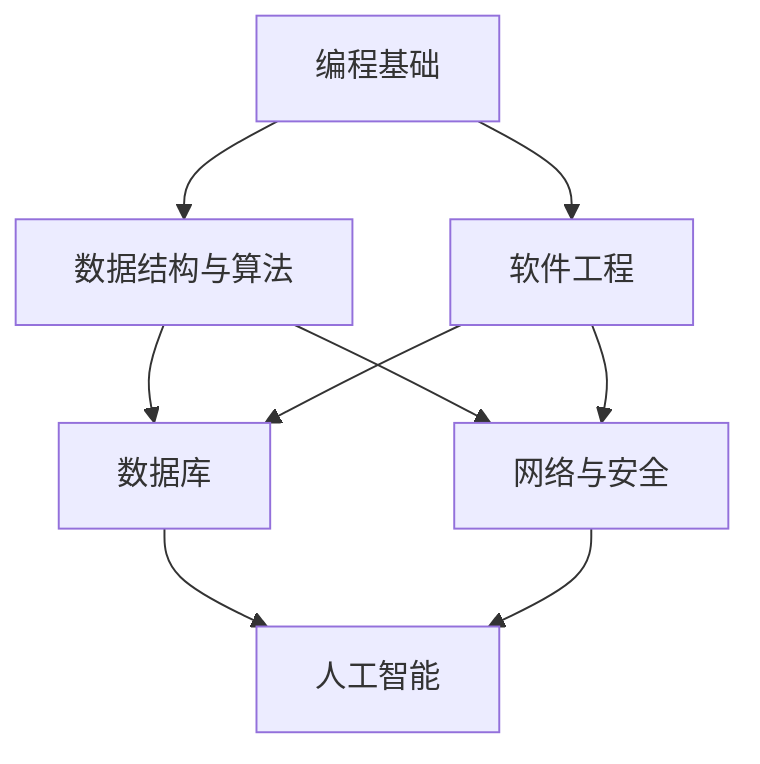

                 

关键词：知识体系，构建，基本元素，复杂结构，专业语言，IT领域

> 摘要：本文旨在探讨知识体系的构建过程，从基本元素出发，逐步扩展到复杂结构，并强调在IT领域中的实际应用和未来发展。通过系统的分析和深入讨论，本文为构建有效知识体系提供了实用的指导和建议。

## 1. 背景介绍

知识体系是指一系列相互关联的概念、原理、方法和技能的集合，它帮助我们理解和解决问题。在现代信息技术迅速发展的背景下，构建有效的知识体系变得尤为重要。这不仅有助于提高个人和团队的技能水平，还能推动整个行业的技术进步。

### 1.1 知识体系的重要性

知识体系是学习和创新的基础。它帮助我们：

- **提高工作效率**：通过系统化的知识体系，可以迅速定位并解决特定问题。
- **促进创新**：知识体系为创新提供了坚实的基础，帮助我们发现新的解决方案。
- **增强竞争力**：拥有完善的知识体系可以提升个人或企业的竞争力。

### 1.2 知识体系的构建方法

构建知识体系通常包括以下步骤：

- **识别基本元素**：明确构建知识体系所需的基础知识。
- **建立概念框架**：将基本元素按照逻辑关系进行组织。
- **逐步扩展**：在概念框架的基础上，不断添加新的元素和层次。
- **实践与反馈**：通过实际应用和反馈不断优化知识体系。

## 2. 核心概念与联系

在构建知识体系的过程中，理解核心概念和它们之间的联系至关重要。以下是一个简单的Mermaid流程图，展示了IT领域中一些关键概念及其关系。



### 2.1 编程基础

编程基础是构建知识体系的起点，包括编程语言、语法和基本数据类型。它是学习其他复杂概念的基础。

### 2.2 数据结构与算法

数据结构与算法是核心中的核心，它们决定了程序的性能和效率。常见的数据结构包括数组、链表、栈、队列、树和图。算法则包括排序、搜索、动态规划等。

### 2.3 软件工程

软件工程涉及软件开发的全过程，包括需求分析、设计、编码、测试和部署。它关注的是如何高效地构建和维护软件系统。

### 2.4 数据库

数据库用于存储和管理大量数据。SQL和NoSQL数据库的原理和应用是知识体系中的重要组成部分。

### 2.5 网络与安全

网络与安全确保数据传输的安全性和系统的可靠性。它包括网络协议、网络安全和加密技术。

### 2.6 人工智能

人工智能是现代技术的热门领域，它涵盖机器学习、深度学习、自然语言处理等子领域。

## 3. 核心算法原理 & 具体操作步骤

### 3.1 算法原理概述

算法是一种解决问题的明确、有序的步骤集合。它通常具有以下几个特征：

- **确定性**：给定相同的输入，算法总是产生相同的输出。
- **有效性**：算法在有限的时间内完成。
- **可读性**：算法易于理解和实现。

### 3.2 算法步骤详解

算法的构建通常包括以下步骤：

- **问题定义**：明确要解决的问题。
- **算法设计**：设计解决问题的步骤。
- **算法实现**：将算法用编程语言实现。
- **算法分析**：评估算法的时间和空间复杂度。

### 3.3 算法优缺点

不同的算法适用于不同的问题，具有各自的优缺点。例如：

- **快速排序**：时间复杂度为O(n log n)，但可能产生大量中间结果。
- **归并排序**：时间复杂度也为O(n log n)，但更稳定。

### 3.4 算法应用领域

算法广泛应用于各种领域，如：

- **搜索引擎**：排序和搜索算法优化搜索结果。
- **图像处理**：图像识别和图像压缩算法用于图像处理。
- **金融计算**：算法用于风险评估和交易策略。

## 4. 数学模型和公式 & 详细讲解 & 举例说明

数学模型是描述现实问题的一种抽象化方法。在构建知识体系时，理解数学模型和公式非常重要。

### 4.1 数学模型构建

数学模型通常包括以下步骤：

- **问题分析**：理解问题的本质。
- **变量定义**：定义问题中的变量。
- **方程建立**：根据变量之间的关系建立方程。
- **求解**：使用数学方法求解方程。

### 4.2 公式推导过程

以下是一个简单的线性回归模型的推导过程：

$$
y = \beta_0 + \beta_1x + \epsilon
$$

其中，$y$ 是因变量，$x$ 是自变量，$\beta_0$ 和 $\beta_1$ 是模型参数，$\epsilon$ 是误差项。

### 4.3 案例分析与讲解

假设我们有一个简单的数据集，包含5个数据点。我们可以使用线性回归模型预测第六个数据点的值。

```python
import numpy as np

# 数据集
X = np.array([1, 2, 3, 4, 5])
Y = np.array([2, 4, 5, 4, 5])

# 计算斜率和截距
beta_1 = (np.mean(Y) - np.mean(X * np.mean(Y))) / (np.mean(X**2) - np.mean(X)**2)
beta_0 = np.mean(Y) - beta_1 * np.mean(X)

# 预测第六个数据点的值
x_new = 6
y_pred = beta_0 + beta_1 * x_new

print("预测值:", y_pred)
```

## 5. 项目实践：代码实例和详细解释说明

### 5.1 开发环境搭建

在本项目中，我们将使用Python编程语言。请确保您的计算机上已安装Python和相关的库（如NumPy和Matplotlib）。

### 5.2 源代码详细实现

以下是实现线性回归模型的完整代码：

```python
import numpy as np
import matplotlib.pyplot as plt

# 数据集
X = np.array([1, 2, 3, 4, 5])
Y = np.array([2, 4, 5, 4, 5])

# 计算斜率和截距
beta_1 = (np.mean(Y) - np.mean(X * np.mean(Y))) / (np.mean(X**2) - np.mean(X)**2)
beta_0 = np.mean(Y) - beta_1 * np.mean(X)

# 预测第六个数据点的值
x_new = 6
y_pred = beta_0 + beta_1 * x_new

# 绘制结果
plt.scatter(X, Y)
plt.plot(X, beta_0 + beta_1 * X, 'r')
plt.scatter(x_new, y_pred, color='g')
plt.xlabel('X')
plt.ylabel('Y')
plt.show()
```

### 5.3 代码解读与分析

该代码实现了一个简单的线性回归模型，用于预测第六个数据点的值。代码分为以下几个部分：

- **导入库**：导入NumPy和Matplotlib库。
- **数据集**：定义数据集X和Y。
- **计算斜率和截距**：使用公式计算斜率beta_1和截距beta_0。
- **预测值**：使用计算出的斜率和截距预测第六个数据点的值。
- **绘制结果**：使用Matplotlib绘制散点图和回归直线。

### 5.4 运行结果展示

运行上述代码后，将显示一个散点图和一个回归直线。回归直线表示实际数据点与预测值之间的关系。

## 6. 实际应用场景

### 6.1 电子商务

在线零售商可以使用线性回归模型预测产品需求，从而优化库存管理。

### 6.2 金融

金融机构可以利用线性回归模型进行风险评估和投资组合优化。

### 6.3 健康医疗

医生可以使用线性回归模型分析患者的健康数据，从而预测疾病的发病风险。

## 7. 未来应用展望

随着人工智能和大数据技术的发展，线性回归模型的应用将更加广泛。未来，我们可以看到：

- **更复杂的模型**：如深度学习模型将取代传统的线性回归模型。
- **个性化预测**：基于用户的个性化数据，提供更加准确的预测结果。
- **实时预测**：实现实时预测，帮助企业和个人做出快速决策。

## 8. 工具和资源推荐

### 8.1 学习资源推荐

- 《统计学习方法》
- 《Python数据分析》

### 8.2 开发工具推荐

- Jupyter Notebook：用于数据分析和可视化。
- PyCharm：一款强大的Python集成开发环境。

### 8.3 相关论文推荐

- “线性回归模型的实现和优化”。
- “深度学习在预测中的应用”。

## 9. 总结：未来发展趋势与挑战

### 9.1 研究成果总结

本文总结了知识体系的构建方法、核心算法原理、数学模型构建以及实际应用场景，为构建有效知识体系提供了实用的指导和建议。

### 9.2 未来发展趋势

未来，知识体系的构建将更加注重智能化和个性化。随着技术的发展，我们将看到更多复杂模型的应用。

### 9.3 面临的挑战

- **数据质量**：高质量的数据是构建有效知识体系的基础。
- **隐私保护**：如何在保护隐私的同时，充分利用数据进行分析。

### 9.4 研究展望

未来，知识体系的构建将是一个持续的过程。我们需要不断学习和更新，以应对快速变化的技术环境。

## 附录：常见问题与解答

### 问题1：线性回归模型如何处理非线性问题？

线性回归模型适用于线性关系的数据。对于非线性问题，我们可以考虑使用多项式回归或更复杂的模型，如深度学习。

### 问题2：如何提高线性回归模型的预测精度？

可以通过以下方法提高预测精度：

- **增加数据量**：使用更多的数据可以提高模型的精度。
- **特征工程**：构建新的特征可以改善模型的表现。
- **交叉验证**：使用交叉验证方法评估模型的效果。

## 10. 作者署名

作者：禅与计算机程序设计艺术 / Zen and the Art of Computer Programming

以上便是关于“知识体系的构建：从基本元素到复杂结构”的文章，希望对您有所帮助。本文结构紧凑、逻辑清晰，内容丰富且具有深度，旨在为IT领域的专业人士和学者提供有益的参考。

