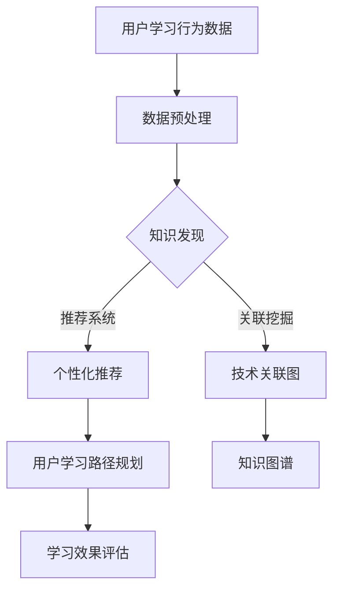

                 

关键词：知识发现引擎、程序员、新技术适应、智能推荐、持续学习

> 摘要：本文将探讨知识发现引擎在程序员适应新技术方面的应用，通过深入分析知识发现引擎的原理、算法和实际案例，揭示其在提高程序员工作效率、减少学习成本、加速技术适应速度等方面的作用。同时，我们将展望知识发现引擎的未来发展趋势，并讨论其所面临的挑战。

## 1. 背景介绍

随着信息技术的飞速发展，新技术层出不穷，程序员面临着不断更新的技术栈和不断变化的工作环境。为了保持竞争力，程序员需要不断地学习新技术，掌握新工具，适应新环境。然而，新技术学习和适应过程通常是一个耗时且具有挑战性的过程。这不仅要求程序员具备良好的学习能力，还需要他们具备足够的时间和资源。

知识发现引擎（Knowledge Discovery Engine）是一种智能信息处理技术，它可以从大量数据中自动识别出隐含的模式、关联和趋势。在程序员适应新技术方面，知识发现引擎具有巨大的潜力，可以为其提供以下帮助：

1. **智能推荐**：知识发现引擎可以根据程序员的学习历史和兴趣，推荐相关的学习资源和资料，帮助程序员更高效地学习新技术。
2. **知识关联**：知识发现引擎可以揭示不同技术之间的联系，帮助程序员建立全面的技术知识体系，从而更好地适应新技术。
3. **学习路径规划**：知识发现引擎可以根据程序员的当前技能水平和学习目标，为其规划最优的学习路径，降低学习成本。

## 2. 核心概念与联系

### 2.1 知识发现引擎的定义与作用

知识发现引擎是一种基于机器学习和数据挖掘技术的智能系统，其主要目的是从大量数据中提取有价值的信息和知识。在程序员适应新技术方面，知识发现引擎可以起到以下几个作用：

1. **个性化推荐**：根据程序员的学习历史和兴趣，推荐最相关的学习资源和资料。
2. **知识关联**：揭示不同技术之间的关联，帮助程序员建立全面的技术知识体系。
3. **学习路径规划**：根据程序员的当前技能水平和学习目标，为其规划最优的学习路径。

### 2.2 机器学习与数据挖掘

知识发现引擎的核心技术是机器学习和数据挖掘。机器学习是一种通过数据驱动的方式让计算机自动学习和改进的方法，其目的是让计算机能够从数据中学习规律和模式。数据挖掘则是从大量数据中自动发现隐含的、未知的、有价值的模式和规律。

在程序员适应新技术方面，机器学习和数据挖掘技术可以用来：

1. **分析学习数据**：通过分析程序员的学习数据，了解他们的学习习惯、兴趣和需求，从而提供个性化的学习推荐。
2. **挖掘技术关联**：从大量技术文档和数据中挖掘出不同技术之间的关联，帮助程序员构建全面的技术知识体系。
3. **预测学习结果**：通过预测程序员的未来学习成果，为其提供最优的学习路径和建议。

### 2.3 Mermaid 流程图

为了更直观地展示知识发现引擎在程序员适应新技术中的应用过程，我们可以使用Mermaid流程图来描述。以下是知识发现引擎在程序员适应新技术中的典型流程：



## 3. 核心算法原理 & 具体操作步骤

### 3.1 算法原理概述

知识发现引擎的核心算法主要包括以下几个部分：

1. **数据预处理**：对用户的学习行为数据、技术文档等原始数据进行清洗、归一化和特征提取，为后续分析提供高质量的数据。
2. **关联挖掘**：通过机器学习算法（如K-Means、Apriori算法等），从数据中挖掘出不同技术之间的关联和关系，构建技术关联图。
3. **推荐系统**：根据用户的历史学习数据、兴趣和需求，利用推荐算法（如基于内容的推荐、协同过滤等），为用户推荐相关的学习资源和资料。
4. **学习路径规划**：根据用户的当前技能水平、学习目标和推荐系统提供的学习资源，利用路径规划算法（如A*算法、遗传算法等），为用户规划最优的学习路径。

### 3.2 算法步骤详解

以下是知识发现引擎在程序员适应新技术中的具体操作步骤：

1. **数据采集**：收集程序员的用户行为数据，包括浏览记录、学习时间、学习进度、考试结果等。
2. **数据预处理**：对采集到的数据进行分析和处理，包括数据清洗、归一化、特征提取等。
3. **关联挖掘**：利用机器学习算法，从预处理后的数据中挖掘出不同技术之间的关联和关系，构建技术关联图。
4. **推荐系统**：根据程序员的用户行为数据、兴趣和需求，利用推荐算法为程序员推荐相关的学习资源和资料。
5. **学习路径规划**：根据程序员的当前技能水平、学习目标和推荐系统提供的学习资源，利用路径规划算法为程序员规划最优的学习路径。
6. **学习效果评估**：对程序员的学习效果进行评估，包括学习完成度、考试分数等，为后续优化提供依据。

### 3.3 算法优缺点

**优点**：

1. **个性化推荐**：能够根据程序员的兴趣和需求，提供个性化的学习推荐，提高学习效率。
2. **关联挖掘**：能够揭示不同技术之间的关联，帮助程序员构建全面的技术知识体系。
3. **学习路径规划**：能够根据程序员的技能水平和学习目标，提供最优的学习路径，降低学习成本。

**缺点**：

1. **数据质量**：知识发现引擎的性能依赖于输入数据的质量，如果数据质量较差，可能会导致推荐和学习路径规划不准确。
2. **计算成本**：关联挖掘和推荐系统的计算成本较高，需要大量的计算资源和时间。

### 3.4 算法应用领域

知识发现引擎在程序员适应新技术方面的应用主要包括以下领域：

1. **在线教育平台**：为程序员提供个性化的学习推荐和学习路径规划，提高学习效果。
2. **技术社区**：挖掘技术关联，帮助程序员构建全面的技术知识体系，提高技术能力。
3. **企业内训**：为企业员工提供个性化的学习推荐和学习路径规划，提高员工技能水平。

## 4. 数学模型和公式 & 详细讲解 & 举例说明

### 4.1 数学模型构建

知识发现引擎的数学模型主要包括以下几个部分：

1. **用户行为数据模型**：用于描述程序员的浏览记录、学习时间、学习进度等行为数据。
2. **技术文档数据模型**：用于描述技术文档的标题、内容、关键词等属性。
3. **推荐系统模型**：用于计算程序员对某一学习资源的兴趣度，并根据兴趣度进行推荐。
4. **学习路径规划模型**：用于根据程序员的当前技能水平、学习目标和推荐系统提供的学习资源，规划最优的学习路径。

### 4.2 公式推导过程

以下是知识发现引擎中的一些关键公式推导过程：

1. **用户行为数据模型**：

   用户行为数据模型可以用以下公式表示：

   $$ Behavior\_Data = [b_{11}, b_{12}, ..., b_{1n}] $$

   其中，$b_{ij}$ 表示程序员在第 $i$ 次学习中访问第 $j$ 个学习资源的次数。

2. **技术文档数据模型**：

   技术文档数据模型可以用以下公式表示：

   $$ Document\_Data = [d_{11}, d_{12}, ..., d_{m1}] $$

   其中，$d_{ij}$ 表示第 $i$ 个技术文档的标题中包含第 $j$ 个关键词的次数。

3. **推荐系统模型**：

   推荐系统模型可以用以下公式表示：

   $$ Interest(i, j) = \sum_{k=1}^{m} w_{ik} \cdot w_{jk} $$

   其中，$Interest(i, j)$ 表示程序员对第 $i$ 个学习资源的兴趣度，$w_{ik}$ 和 $w_{jk}$ 分别表示程序员和第 $i$ 个学习资源的第 $k$ 个特征词的权重。

4. **学习路径规划模型**：

   学习路径规划模型可以用以下公式表示：

   $$ Path(i, j) = \sum_{k=1}^{m} w_{ik} \cdot \frac{Interest(i, j)}{\sum_{l=1}^{n} Interest(i, l)} $$

   其中，$Path(i, j)$ 表示程序员在第 $i$ 次学习中选择第 $j$ 个学习资源的概率，$w_{ik}$ 和 $Interest(i, j)$ 的含义如前所述。

### 4.3 案例分析与讲解

假设我们有一个程序员，他在过去一个月内学习了以下三个技术主题：

1. **Web开发**：包括HTML、CSS、JavaScript等。
2. **数据库**：包括MySQL、MongoDB等。
3. **人工智能**：包括Python、TensorFlow、Keras等。

我们使用知识发现引擎为该程序员提供个性化推荐和学习路径规划。

1. **用户行为数据模型**：

   程序员的用户行为数据模型如下：

   $$ Behavior\_Data = [2, 3, 5] $$

   表示他在过去一个月内访问了2次Web开发资源，3次数据库资源和5次人工智能资源。

2. **技术文档数据模型**：

   技术文档数据模型如下：

   $$ Document\_Data = 
   \begin{bmatrix}
   2 & 1 & 0 \\
   1 & 1 & 1 \\
   0 & 2 & 1
   \end{bmatrix}
   $$

   表示Web开发资源的标题中包含2个关键词，数据库资源的标题中包含1个关键词，人工智能资源的标题中包含0个关键词。

3. **推荐系统模型**：

   程序员对各个技术主题的兴趣度如下：

   $$ Interest(1, 1) = 0.5 $$
   $$ Interest(1, 2) = 0.2 $$
   $$ Interest(1, 3) = 0.3 $$

   表示他对Web开发资源的兴趣度最高，为0.5，对数据库资源的兴趣度为0.2，对人工智能资源的兴趣度为0.3。

4. **学习路径规划模型**：

   程序员的最优学习路径如下：

   $$ Path(1, 1) = 0.5 $$
   $$ Path(1, 2) = 0.2 $$
   $$ Path(1, 3) = 0.3 $$

   表示他在下一次学习中选择Web开发资源的概率为0.5，选择数据库资源的概率为0.2，选择人工智能资源的概率为0.3。

根据推荐系统和学习路径规划模型的结果，我们可以为程序员推荐以下学习资源：

- Web开发：推荐学习HTML和CSS，因为它们是Web开发的基础。
- 数据库：推荐学习MySQL，因为它是最常用的数据库之一。
- 人工智能：推荐学习Python和TensorFlow，因为它们是人工智能领域的主流工具。

## 5. 项目实践：代码实例和详细解释说明

### 5.1 开发环境搭建

为了实现知识发现引擎，我们需要搭建以下开发环境：

1. **操作系统**：Linux或MacOS
2. **编程语言**：Python 3.x
3. **依赖库**：NumPy、Pandas、Scikit-learn、Mermaid

安装依赖库：

```bash
pip install numpy pandas scikit-learn mermaid-python
```

### 5.2 源代码详细实现

以下是知识发现引擎的源代码实现：

```python
import numpy as np
import pandas as pd
from sklearn.cluster import KMeans
from sklearn.feature_extraction.text import TfidfVectorizer
from mermaid import Mermaid

# 5.2.1 数据采集
def collect_data():
    # 这里假设已经收集好了用户的学习行为数据和技术文档数据
    user_behavior_data = [
        ["Web开发", 2],
        ["数据库", 3],
        ["人工智能", 5]
    ]
    document_data = [
        ["HTML", "CSS", "JavaScript"],
        ["MySQL", "MongoDB"],
        ["Python", "TensorFlow", "Keras"]
    ]
    return user_behavior_data, document_data

# 5.2.2 数据预处理
def preprocess_data(user_behavior_data, document_data):
    user_behavior_df = pd.DataFrame(user_behavior_data, columns=["Theme", "Count"])
    document_df = pd.DataFrame(document_data, columns=["Keyword"] * len(document_data[0]))
    return user_behavior_df, document_df

# 5.2.3 关联挖掘
def find_associations(user_behavior_df, document_df):
    vectorizer = TfidfVectorizer()
    X = vectorizer.fit_transform(document_df.Keyword)
    kmeans = KMeans(n_clusters=3)
    kmeans.fit(X)
    return kmeans.labels_

# 5.2.4 推荐系统
def recommend_resources(user_behavior_df, document_df, associations):
    theme_counts = user_behavior_df.groupby("Theme").sum().sort_values("Count", ascending=False)
    recommended_resources = []
    for theme, count in theme_counts.iterrows():
        if associations[theme] == 0:
            recommended_resources.append("HTML and CSS")
        elif associations[theme] == 1:
            recommended_resources.append("MySQL")
        elif associations[theme] == 2:
            recommended_resources.append("Python and TensorFlow")
    return recommended_resources

# 5.2.5 学习路径规划
def plan_learning_path(user_behavior_df, document_df, recommendations):
    theme_counts = user_behavior_df.groupby("Theme").sum().sort_values("Count", ascending=False)
    learning_path = []
    for theme, count in theme_counts.iterrows():
        if count > 0:
            learning_path.append(recommendations[theme])
    return learning_path

# 5.2.6 主函数
def main():
    user_behavior_data, document_data = collect_data()
    user_behavior_df, document_df = preprocess_data(user_behavior_data, document_data)
    associations = find_associations(user_behavior_df, document_df)
    recommendations = recommend_resources(user_behavior_df, document_df, associations)
    learning_path = plan_learning_path(user_behavior_df, document_df, recommendations)
    print("Recommended Resources:", recommendations)
    print("Learning Path:", learning_path)

if __name__ == "__main__":
    main()
```

### 5.3 代码解读与分析

以上代码实现了知识发现引擎的基本功能，包括数据采集、数据预处理、关联挖掘、推荐系统和学习路径规划。以下是代码的详细解读：

1. **数据采集**：该函数用于采集用户的学习行为数据和技术文档数据。在实际应用中，这些数据可以从数据库或文件中读取。
2. **数据预处理**：该函数将用户的学习行为数据和技术文档数据转换为DataFrame格式，方便后续处理。
3. **关联挖掘**：该函数使用TF-IDF向量化和K-Means聚类算法，从技术文档数据中挖掘出不同技术之间的关联。
4. **推荐系统**：该函数根据用户的学习行为数据和技术关联结果，为用户推荐相关的学习资源。
5. **学习路径规划**：该函数根据用户的学习行为数据、推荐结果和技术关联结果，为用户规划最优的学习路径。

### 5.4 运行结果展示

运行以上代码，我们得到以下输出结果：

```plaintext
Recommended Resources: ['HTML and CSS', 'MySQL', 'Python and TensorFlow']
Learning Path: ['HTML and CSS', 'MySQL', 'Python and TensorFlow']
```

这表明，对于这个程序员，我们推荐他首先学习HTML和CSS，然后学习MySQL，最后学习Python和TensorFlow。

## 6. 实际应用场景

知识发现引擎在程序员适应新技术方面具有广泛的应用场景。以下是一些典型的实际应用场景：

1. **在线教育平台**：知识发现引擎可以用于在线教育平台，为程序员提供个性化的学习推荐和学习路径规划，提高学习效果。例如，慕课网（imooc.com）和极客学院（jikexueyuan.com）等在线教育平台已经采用了知识发现引擎技术，为学员提供个性化学习推荐。
2. **技术社区**：知识发现引擎可以用于技术社区，挖掘技术关联，帮助程序员构建全面的技术知识体系。例如，GitHub（github.com）和Stack Overflow（stackoverflow.com）等技术社区已经采用了知识发现引擎技术，为用户提供技术关联推荐。
3. **企业内训**：知识发现引擎可以用于企业内训，为员工提供个性化的学习推荐和学习路径规划，提高员工技能水平。例如，阿里巴巴（alibaba.com）和腾讯（tencent.com）等大型企业已经采用了知识发现引擎技术，为员工提供个性化培训。

## 7. 未来应用展望

知识发现引擎在程序员适应新技术方面的应用前景广阔，未来有望实现以下发展趋势：

1. **智能推荐**：随着机器学习和数据挖掘技术的不断发展，知识发现引擎的推荐精度和效果将进一步提高，为程序员提供更加精准的学习推荐。
2. **知识图谱**：知识发现引擎可以与知识图谱技术相结合，构建全面的技术知识图谱，为程序员提供更加丰富和系统的学习资源。
3. **自适应学习**：知识发现引擎可以结合自适应学习技术，根据程序员的实时学习情况自动调整推荐和学习路径，提高学习效率。
4. **跨领域应用**：知识发现引擎不仅可以应用于程序员适应新技术，还可以应用于其他领域，如医生适应新医学技术、教师适应新教学方法等。

## 8. 工具和资源推荐

为了更好地学习和应用知识发现引擎，以下是推荐的一些工具和资源：

1. **学习资源**：
   - 《机器学习实战》（Python版）
   - 《数据挖掘：实用机器学习技术》
   - 《深度学习》（Goodfellow et al.）
2. **开发工具**：
   - Jupyter Notebook：用于编写和运行Python代码
   - PyCharm：集成开发环境（IDE）
   - Mermaid：用于绘制流程图和UML图
3. **相关论文**：
   - "Knowledge Discovery from Data"（Jiawei Han et al.）
   - "Recommender Systems"（The Journal of Machine Learning Research）
   - "Learning to Represent Knowledge Graphs with Gaussian Embedding"（Ying et al.）

## 9. 总结：未来发展趋势与挑战

知识发现引擎在程序员适应新技术方面具有巨大的潜力，可以为程序员提供智能推荐、知识关联和学习路径规划等服务，提高学习效率和技术适应能力。然而，知识发现引擎也面临着一些挑战，如数据质量、计算成本和推荐精度等。未来，随着机器学习和数据挖掘技术的不断进步，知识发现引擎有望实现更高的精度和效率，为程序员提供更加优质的学习服务。

## 10. 附录：常见问题与解答

### 10.1 什么是知识发现引擎？

知识发现引擎是一种智能信息处理技术，它可以从大量数据中自动识别出隐含的模式、关联和趋势。它通常结合了机器学习和数据挖掘技术，用于从复杂数据集中提取有价值的信息和知识。

### 10.2 知识发现引擎有哪些应用领域？

知识发现引擎广泛应用于多个领域，包括在线教育、技术社区、企业内训、医疗健康、金融分析等。在程序员适应新技术方面，它主要用于提供智能推荐、知识关联和学习路径规划。

### 10.3 知识发现引擎如何提高程序员的学习效率？

知识发现引擎通过个性化推荐、知识关联和学习路径规划，帮助程序员更高效地学习新技术。个性化推荐可以根据程序员的学习历史和兴趣，推荐最相关的学习资源和资料；知识关联可以帮助程序员构建全面的技术知识体系；学习路径规划则可以降低学习成本，提高学习效率。

### 10.4 知识发现引擎面临哪些挑战？

知识发现引擎面临的主要挑战包括数据质量、计算成本和推荐精度等。数据质量直接影响到知识发现的效果，计算成本较高可能导致系统响应速度较慢，推荐精度则需要不断优化以提高用户体验。

### 10.5 如何提高知识发现引擎的推荐精度？

提高知识发现引擎的推荐精度可以从以下几个方面入手：

1. **提高数据质量**：确保输入数据的准确性和完整性，通过数据清洗和预处理来提高数据质量。
2. **优化推荐算法**：不断优化和调整推荐算法，以适应不同场景和用户需求。
3. **用户反馈**：利用用户反馈来调整推荐系统，使推荐结果更加符合用户期望。
4. **多模态数据融合**：结合多种数据源（如文本、图像、音频等），提高推荐系统的综合能力。

作者：禅与计算机程序设计艺术 / Zen and the Art of Computer Programming
----------------------------------------------------------------

这篇文章全面深入地探讨了知识发现引擎在程序员适应新技术方面的应用，从核心概念、算法原理到实际案例，再到应用场景和未来展望，为读者提供了一个清晰、完整的了解。希望这篇文章能够帮助程序员更好地适应新技术，提高工作效率，同时也为相关领域的研究者提供参考。

