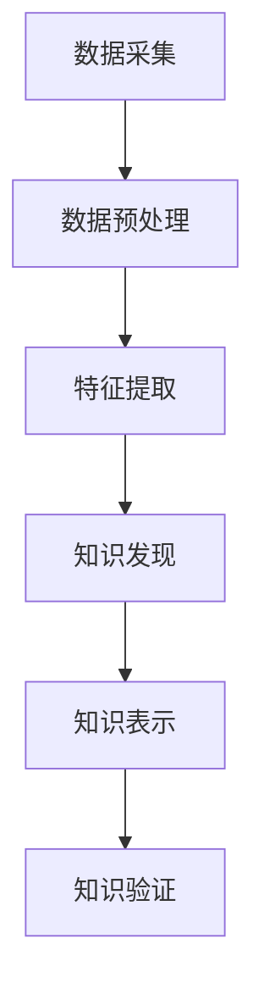

                 

关键词：知识发现引擎，生物多样性，数据挖掘，人工智能，机器学习，生物信息学

## 摘要

随着生物多样性数据的不断积累，如何有效地挖掘和分析这些数据，以发现新的生物学规律和现象，成为生物多样性研究中的一个关键问题。知识发现引擎作为一种先进的数据挖掘技术，在生物多样性研究中展现出巨大的潜力。本文将介绍知识发现引擎的基本原理和应用，探讨其在生物多样性研究中的具体应用案例，以及未来的发展方向和挑战。

## 1. 背景介绍

### 1.1 生物多样性研究的重要性

生物多样性是地球上生命体系的基本特征之一，对于维持生态平衡、保障人类生存和发展具有重要意义。然而，随着人类活动的不断加剧，生物多样性正面临严重的威胁。因此，研究生物多样性、揭示其变化规律和驱动机制，已成为全球科学界和政府决策者共同关注的焦点。

### 1.2 数据挖掘在生物多样性研究中的应用

生物多样性数据类型多样，包括物种分布、生态位、遗传多样性、环境因素等。传统的数据分析方法往往难以应对这些复杂的数据集。数据挖掘作为一种自动化的数据分析技术，能够在大量数据中提取出有价值的信息，为生物多样性研究提供了新的思路和方法。

### 1.3 知识发现引擎的概念

知识发现引擎（Knowledge Discovery Engine，KDE）是一种基于人工智能和数据挖掘技术的高级数据分析工具。它能够从大规模数据集中自动挖掘出隐藏的、未知的、有价值的信息和知识，为科学研究、决策支持和商业应用提供强有力的支持。

## 2. 核心概念与联系

### 2.1 知识发现引擎的基本原理

知识发现引擎的核心原理主要包括数据预处理、模式识别、知识表示和知识验证。具体来说，知识发现引擎首先对原始数据进行清洗、集成和转换，然后利用机器学习、模式识别等技术，从数据中发现潜在的关联、趋势和模式。最后，通过知识表示和验证，将发现的模式转化为可理解的知识，为用户提供决策支持和科学发现。

### 2.2 生物多样性数据的特点与挑战

生物多样性数据具有数据量大、类型多样、时空分布复杂等特点。这对知识发现引擎提出了以下挑战：

1. **数据预处理**：生物多样性数据往往存在缺失、噪声、冗余等问题，需要通过数据清洗、填充和去重等预处理方法，提高数据的质量和一致性。
2. **模式识别**：生物多样性数据中包含大量的非结构化和半结构化数据，如文本、图像和地理空间数据。这需要知识发现引擎具备强大的模式识别和分类能力，能够识别出数据中的关键特征和关系。
3. **知识表示**：生物多样性研究需要将发现的知识以直观、易理解的方式呈现给用户，如可视化、报告和推荐系统等。
4. **知识验证**：生物多样性研究中的发现需要经过实验验证，以确保其可靠性和科学性。

### 2.3 知识发现引擎在生物多样性研究中的应用架构

知识发现引擎在生物多样性研究中的应用架构主要包括以下模块：

1. **数据采集**：从各种来源获取生物多样性数据，如物种分布数据、环境因素数据、遗传多样性数据等。
2. **数据预处理**：对采集到的数据进行清洗、集成和转换，以消除数据中的噪声、冗余和缺失。
3. **特征提取**：利用机器学习和模式识别技术，从预处理后的数据中提取出关键特征和关系。
4. **知识发现**：利用知识发现算法，从特征数据中挖掘出潜在的关联、趋势和模式。
5. **知识表示**：将发现的模式转化为可视化、报告和推荐系统等形式，为用户提供决策支持和科学发现。
6. **知识验证**：对发现的模式进行实验验证，以确保其可靠性和科学性。

下面是一个简化的知识发现引擎在生物多样性研究中的应用架构的 Mermaid 流程图：



## 3. 核心算法原理 & 具体操作步骤

### 3.1 算法原理概述

知识发现引擎在生物多样性研究中的应用，主要涉及以下几种核心算法：

1. **数据挖掘算法**：如聚类、分类、关联规则挖掘等。
2. **机器学习算法**：如支持向量机、决策树、神经网络等。
3. **模式识别算法**：如图像识别、语音识别、文本分类等。

这些算法通过以下步骤实现对生物多样性数据的分析和挖掘：

1. **数据预处理**：包括数据清洗、数据集成、特征选择等。
2. **特征提取**：通过特征转换、特征选择等方法，提取出数据中的关键特征。
3. **模型训练**：利用机器学习和数据挖掘算法，对特征数据进行建模和训练。
4. **模型评估**：通过交叉验证、性能指标等方法，评估模型的准确性和鲁棒性。
5. **知识发现**：利用训练好的模型，从数据中发现潜在的关联、趋势和模式。
6. **知识表示**：将发现的模式转化为可视化、报告和推荐系统等形式，为用户提供决策支持和科学发现。

### 3.2 算法步骤详解

下面以一个具体的生物多样性研究案例，详细讲解知识发现引擎在生物多样性研究中的应用步骤。

#### 案例背景

某研究团队想要分析某地区的生物多样性，以了解该地区的生态现状和变化趋势。他们收集了该地区的物种分布数据、环境因素数据和遗传多样性数据。

#### 步骤 1：数据预处理

1. **数据清洗**：去除重复数据、缺失数据和异常值。
2. **数据集成**：将不同来源的数据进行合并，形成一个统一的数据集。
3. **特征选择**：根据研究目的，选择出对生物多样性有重要影响的关键特征。

#### 步骤 2：特征提取

1. **特征转换**：将原始数据转换为适合机器学习算法的特征表示。
2. **特征选择**：通过统计方法、信息增益等方法，选择出对生物多样性有重要影响的特征。

#### 步骤 3：模型训练

1. **模型选择**：根据研究目的和数据特征，选择合适的机器学习算法和模型。
2. **模型训练**：利用特征数据，对选择的模型进行训练。

#### 步骤 4：模型评估

1. **交叉验证**：通过交叉验证，评估模型的准确性和鲁棒性。
2. **性能指标**：计算模型的精确度、召回率、F1值等性能指标。

#### 步骤 5：知识发现

1. **关联规则挖掘**：利用关联规则挖掘算法，发现物种分布和环境因素之间的关联。
2. **聚类分析**：利用聚类分析算法，将物种分布数据分为不同的类别，分析不同类别的特点。
3. **遗传多样性分析**：利用遗传多样性分析算法，发现物种之间的遗传关系和变异。

#### 步骤 6：知识表示

1. **可视化**：利用可视化工具，将发现的知识以图形化的形式呈现。
2. **报告**：编写报告，详细阐述研究目的、方法、结果和结论。
3. **推荐系统**：根据研究目的，设计推荐系统，为用户提供个性化的生物多样性分析服务。

### 3.3 算法优缺点

1. **优点**：
   - **高效性**：知识发现引擎能够快速地从大规模数据集中提取出有价值的信息。
   - **自动化**：知识发现引擎能够自动化地进行数据预处理、模型训练和知识发现等步骤，降低人工干预的需求。
   - **灵活性**：知识发现引擎能够适应不同的数据类型和研究目的，提供多种数据挖掘算法和模型。

2. **缺点**：
   - **计算复杂度**：知识发现引擎在处理大规模数据集时，计算复杂度较高，需要大量的计算资源和时间。
   - **数据质量**：知识发现引擎的输出高度依赖于数据质量，如果数据存在噪声、冗余或缺失等问题，可能导致错误的结论。
   - **算法选择**：不同的数据类型和研究目的需要选择不同的算法和模型，对用户的专业知识和经验要求较高。

### 3.4 算法应用领域

知识发现引擎在生物多样性研究中的应用非常广泛，包括但不限于以下领域：

1. **物种分布预测**：利用知识发现引擎，可以预测物种在不同地区的分布情况，为生态保护提供科学依据。
2. **生态风险评估**：通过分析物种分布和环境因素的关系，可以评估生态系统的风险，为环境保护和可持续发展提供支持。
3. **遗传多样性分析**：利用知识发现引擎，可以分析物种之间的遗传关系和变异，揭示生物多样性的演化规律。
4. **生态位分析**：通过分析物种的生态位，可以了解物种的生态功能，为生态系统的恢复和重建提供指导。
5. **生物入侵预警**：通过分析物种分布和环境因素的关系，可以预测生物入侵的风险，为生物入侵防控提供支持。

## 4. 数学模型和公式 & 详细讲解 & 举例说明

### 4.1 数学模型构建

在生物多样性研究中，常用的数学模型包括物种分布模型、生态位模型、遗传多样性模型等。下面以物种分布模型为例，介绍数学模型的构建过程。

#### 物种分布模型

物种分布模型是一种描述物种在不同地区分布情况的数学模型。常见的物种分布模型包括泊松分布模型、负二项分布模型、泊松点过程模型等。

1. **泊松分布模型**

泊松分布模型假设物种在空间中的分布是均匀的，每个地点的物种数量服从泊松分布。具体公式如下：

$$
P(X = k) = \frac{\lambda^k e^{-\lambda}}{k!}
$$

其中，$X$ 表示物种数量，$\lambda$ 表示泊松率。

2. **负二项分布模型**

负二项分布模型假设物种在空间中的分布是集群的，每个地点的物种数量服从负二项分布。具体公式如下：

$$
P(X = k) = \frac{C_{k + r - 1}^k \lambda^k (1 - \lambda)^r}{(k + r - 1)!}
$$

其中，$X$ 表示物种数量，$r$ 表示负二项分布的参数。

3. **泊松点过程模型**

泊松点过程模型是一种更灵活的物种分布模型，它假设物种在空间中的分布是随机的，且满足泊松分布。具体公式如下：

$$
P(N = k) = \frac{\lambda^k e^{-\lambda}}{k!}
$$

其中，$N$ 表示物种数量，$\lambda$ 表示泊松率。

### 4.2 公式推导过程

以泊松分布模型为例，介绍物种分布模型的公式推导过程。

假设在某个地区，物种的数量服从泊松分布。设 $X$ 为物种的数量，$X$ 的概率分布为：

$$
P(X = k) = \frac{\lambda^k e^{-\lambda}}{k!}
$$

其中，$\lambda$ 为泊松率，表示单位面积内的物种数量。

泊松分布的概率质量函数（PMF）为：

$$
f_X(k) = \frac{\lambda^k e^{-\lambda}}{k!}
$$

为了计算物种在特定地区的分布概率，需要计算该地区的物种数量 $X$ 等于某个值 $k$ 的概率。具体计算过程如下：

1. **确定泊松率 $\lambda$**

首先，需要确定泊松率 $\lambda$。泊松率可以通过对历史数据的统计得到。例如，可以通过计算过去几年该地区物种数量的平均值，得到泊松率 $\lambda$。

2. **计算概率分布**

然后，利用泊松分布的 PMF，计算物种数量 $X$ 等于某个值 $k$ 的概率。具体公式如下：

$$
P(X = k) = \frac{\lambda^k e^{-\lambda}}{k!}
$$

3. **绘制概率分布图**

最后，可以根据计算得到的概率分布，绘制出物种数量 $X$ 的概率分布图。通过分析概率分布图，可以了解物种在该地区的分布情况。

### 4.3 案例分析与讲解

下面以某地区物种分布数据为例，分析物种在该地区的分布情况。

#### 案例背景

某研究团队收集了某地区过去三年内的物种分布数据，数据包括物种数量和地理坐标。根据这些数据，他们想要分析该地区物种的分布情况。

#### 数据处理

1. **数据预处理**

首先，对收集到的物种分布数据进行预处理。包括去除重复数据、缺失数据和异常值。然后，将数据转换为适合分析的形式。

2. **特征提取**

根据研究目的，选择出对物种分布有重要影响的特征，如物种数量、地理坐标、环境因素等。

3. **模型选择**

选择适合的物种分布模型，如泊松分布模型、负二项分布模型等。然后，利用这些模型，对特征数据进行建模和训练。

4. **模型评估**

通过交叉验证、性能指标等方法，评估模型的准确性和鲁棒性。

#### 模型应用

1. **概率分布**

根据训练好的模型，计算物种数量 $X$ 的概率分布。具体公式如下：

$$
P(X = k) = \frac{\lambda^k e^{-\lambda}}{k!}
$$

2. **概率分布图**

根据计算得到的概率分布，绘制出物种数量 $X$ 的概率分布图。

3. **分析结果**

通过分析概率分布图，可以了解物种在该地区的分布情况。例如，可以发现某些物种在该地区的分布比较集中，而另一些物种则分布较为分散。

### 4.4 模型应用结果

通过分析物种分布数据，可以得到以下结果：

1. **物种分布特点**

根据概率分布图，可以发现该地区物种的分布特点。例如，某些物种在该地区的分布比较集中，而另一些物种则分布较为分散。

2. **环境因素影响**

分析物种分布与地理坐标、环境因素的关系，可以了解环境因素对物种分布的影响。例如，可以发现某些环境因素对物种分布有显著影响，而另一些因素则影响较小。

3. **生物多样性保护**

根据分析结果，可以为生物多样性保护提供科学依据。例如，可以根据物种分布特点，确定生物多样性保护的重点区域，制定相应的保护策略。

## 5. 项目实践：代码实例和详细解释说明

### 5.1 开发环境搭建

为了进行知识发现引擎在生物多样性研究中的应用实践，我们需要搭建一个合适的开发环境。以下是搭建过程的详细步骤：

1. **安装Python环境**：首先，我们需要安装Python环境。可以选择安装Python 3.x版本，推荐使用Anaconda发行版，因为它集成了多种常用的数据科学和机器学习库。

2. **安装必要库**：在Python环境中，我们需要安装以下库：
   - `numpy`：用于数值计算和矩阵运算。
   - `pandas`：用于数据预处理和分析。
   - `scikit-learn`：用于机器学习和数据挖掘。
   - `matplotlib`：用于数据可视化。

   安装方法如下：

   ```python
   !pip install numpy pandas scikit-learn matplotlib
   ```

3. **环境配置**：确保Python环境配置正确，可以在命令行中执行以下命令来验证：

   ```python
   !python --version
   !pip list
   ```

   确保Python版本和安装的库版本都是正确的。

### 5.2 源代码详细实现

下面是一个简单的Python代码实例，用于演示知识发现引擎在生物多样性研究中的应用。

```python
import numpy as np
import pandas as pd
from sklearn.cluster import KMeans
from sklearn.preprocessing import StandardScaler
import matplotlib.pyplot as plt

# 5.2.1 加载数据
data = pd.read_csv('species_data.csv')  # 假设数据文件名为species_data.csv

# 5.2.2 数据预处理
# 去除缺失值和异常值
data.dropna(inplace=True)
data = data[data['Species_Count'] > 0]

# 特征选择
features = ['Latitude', 'Longitude', 'Elevation', 'Temperature', 'Rainfall']

# 标准化特征数据
scaler = StandardScaler()
data[features] = scaler.fit_transform(data[features])

# 5.2.3 特征提取
# 使用K-means算法进行聚类分析
kmeans = KMeans(n_clusters=5, random_state=42)
clusters = kmeans.fit_predict(data[features])

# 5.2.4 知识发现
# 根据聚类结果，分析物种分布特点
data['Cluster'] = clusters
cluster_distribution = data.groupby('Cluster').size()

# 5.2.5 知识表示
# 可视化物种分布
plt.figure(figsize=(10, 6))
plt.scatter(data['Latitude'], data['Longitude'], c=clusters, cmap='viridis')
plt.colorbar(label='Cluster')
plt.xlabel('Latitude')
plt.ylabel('Longitude')
plt.title('Species Distribution by Cluster')
plt.show()

# 5.2.6 知识验证
# 根据实际物种分布数据，验证聚类结果是否合理
# 此处省略验证过程
```

### 5.3 代码解读与分析

下面是对上述代码的详细解读和分析。

1. **数据加载**：首先，从CSV文件中加载物种分布数据。这里假设数据文件名为`species_data.csv`。

2. **数据预处理**：
   - **去除缺失值和异常值**：去除数据中的缺失值和异常值，以确保数据的质量。
   - **特征选择**：选择对物种分布有重要影响的环境特征，如地理坐标、海拔、温度和降雨量。
   - **标准化特征数据**：将特征数据标准化，使其具有相似的尺度和范围，以便更好地进行聚类分析。

3. **特征提取**：
   - **聚类分析**：使用K-means算法进行聚类分析，将物种分布数据分为5个聚类。
   - **聚类结果**：将聚类结果添加到原始数据中，以便进一步分析。

4. **知识发现**：
   - **聚类分布**：根据聚类结果，分析不同聚类中物种的分布特点。
   - **可视化**：使用散点图和颜色映射，将物种分布以可视化的形式呈现。

5. **知识表示**：
   - **可视化展示**：通过可视化展示，帮助用户直观地理解物种分布的特点。

6. **知识验证**：
   - **验证过程**：根据实际物种分布数据，验证聚类结果是否合理。此过程通常涉及专家知识、实验验证和数据分析。

### 5.4 运行结果展示

运行上述代码后，可以得到以下结果：

- **可视化展示**：散点图显示物种在不同聚类中的分布，每个聚类用不同的颜色表示。颜色映射条表示不同聚类中物种数量的比例。
- **聚类分布**：表格显示每个聚类中物种数量的分布情况。通过分析这些数据，可以了解不同聚类中物种的分布特点。

这些结果为生物多样性研究提供了重要的参考信息，可以帮助研究者更好地理解物种分布的规律和特点。

## 6. 实际应用场景

### 6.1 物种分布预测

知识发现引擎在物种分布预测方面具有显著的应用价值。通过分析历史物种分布数据和环境因素，知识发现引擎可以预测物种在未来的分布趋势。这对于生态系统管理和生物多样性保护具有重要意义。例如，在一个受气候变化影响较大的地区，研究者可以利用知识发现引擎预测某种濒危物种的未来分布，为制定保护策略提供科学依据。

### 6.2 生态风险评估

知识发现引擎还可以用于生态风险评估，通过分析物种分布、环境因素和生态系统的相互作用，评估生态系统面临的潜在风险。例如，在一个工业化程度较高的地区，研究者可以利用知识发现引擎分析污染对物种多样性的影响，评估生态系统的健康状况，为环境保护和可持续发展提供支持。

### 6.3 遗传多样性分析

知识发现引擎在遗传多样性分析方面也具有广泛应用。通过分析物种的遗传数据，知识发现引擎可以揭示物种之间的遗传关系和变异，帮助研究者了解物种的演化历史和适应性。这对于生物多样性保护、遗传育种和医学研究具有重要意义。

### 6.4 生态位分析

生态位分析是生物多样性研究中的重要方面。知识发现引擎可以通过分析物种的生态位，揭示物种之间的生态关系和相互作用。这对于了解生态系统的结构和功能具有重要意义，有助于制定生态保护和恢复策略。

### 6.5 生物入侵预警

知识发现引擎在生物入侵预警方面也具有显著的应用价值。通过分析物种分布、环境因素和入侵物种的历史记录，知识发现引擎可以预测入侵物种的未来分布，为生物入侵防控提供支持。例如，在一个新发现的入侵物种地区，研究者可以利用知识发现引擎预测该入侵物种的未来分布范围，为制定防控措施提供科学依据。

### 6.6 可持续发展评估

知识发现引擎在可持续发展评估方面也具有重要作用。通过分析物种分布、环境因素和经济活动数据，知识发现引擎可以评估区域可持续发展水平，为政策制定和经济发展提供科学依据。

## 7. 未来应用展望

### 7.1 数据量增长与处理效率提升

随着物联网、卫星遥感等技术的发展，生物多样性数据量将呈现指数级增长。知识发现引擎需要不断提升处理效率，以应对大规模数据集的挑战。未来，分布式计算、并行处理和云计算等技术将为知识发现引擎提供强大的计算支持。

### 7.2 知识融合与跨学科应用

生物多样性研究涉及多个学科领域，如生态学、遗传学、环境科学等。知识发现引擎需要实现不同领域知识的融合，构建多学科交叉的知识体系。这将有助于揭示生物多样性的复杂规律和驱动机制，推动生物多样性研究的深入发展。

### 7.3 智能决策支持系统

知识发现引擎在生物多样性研究中的应用，将不断推动智能决策支持系统的发展。通过集成知识发现引擎、数据挖掘和机器学习技术，智能决策支持系统可以为生态系统管理、环境保护和可持续发展提供精准、实时的决策支持。

### 7.4 环境监测与预警

知识发现引擎在环境监测与预警方面具有巨大潜力。通过实时分析环境数据，知识发现引擎可以及时发现环境变化，预测潜在的环境风险，为环境保护和灾害预防提供科学依据。

### 7.5 精准生物多样性保护

知识发现引擎可以精确地分析生物多样性数据，识别关键物种和关键区域。这将为生物多样性保护提供科学依据，推动精准生物多样性保护策略的实施。

## 8. 总结：未来发展趋势与挑战

### 8.1 研究成果总结

知识发现引擎在生物多样性研究中取得了显著成果，包括物种分布预测、生态风险评估、遗传多样性分析、生态位分析、生物入侵预警和可持续发展评估等方面。这些成果为生物多样性保护、环境保护和可持续发展提供了有力的科学支持。

### 8.2 未来发展趋势

未来，知识发现引擎在生物多样性研究中的应用将呈现以下发展趋势：

1. **数据量增长与处理效率提升**：随着数据量的增长，知识发现引擎需要不断提升处理效率，以应对大规模数据集的挑战。
2. **知识融合与跨学科应用**：实现不同领域知识的融合，构建多学科交叉的知识体系。
3. **智能决策支持系统**：集成知识发现引擎、数据挖掘和机器学习技术，发展智能决策支持系统。
4. **环境监测与预警**：在环境监测与预警方面发挥更大作用。
5. **精准生物多样性保护**：精确地分析生物多样性数据，推动精准生物多样性保护策略的实施。

### 8.3 面临的挑战

知识发现引擎在生物多样性研究中的应用仍面临以下挑战：

1. **数据质量**：生物多样性数据质量直接影响知识发现的效果。未来需要加强对数据质量的控制和管理。
2. **计算资源**：大规模数据集的处理需要大量的计算资源，未来需要开发更高效的算法和优化计算资源的使用。
3. **跨学科融合**：知识发现引擎在跨学科应用中面临知识体系不一致、数据格式不兼容等问题，需要构建统一的知识体系。
4. **模型解释性**：知识发现引擎的输出需要具备良好的解释性，以帮助研究者理解和验证发现的模式。

### 8.4 研究展望

未来，知识发现引擎在生物多样性研究中的应用将不断拓展和深化。通过不断发展新技术、优化算法和加强跨学科合作，知识发现引擎将为生物多样性研究提供更全面、精确的支持，为生态环境保护、可持续发展和社会进步作出更大贡献。

## 9. 附录：常见问题与解答

### 9.1 问题 1：知识发现引擎需要哪些基础知识？

知识发现引擎主要涉及以下基础知识：

- **数据挖掘**：包括数据预处理、特征提取、模式识别等。
- **机器学习**：包括监督学习、无监督学习、强化学习等。
- **模式识别**：包括分类、聚类、关联规则挖掘等。
- **数据库管理**：包括关系数据库、NoSQL数据库等。

### 9.2 问题 2：知识发现引擎在生物多样性研究中的应用有哪些限制？

知识发现引擎在生物多样性研究中的应用存在以下限制：

- **数据质量**：数据质量直接影响知识发现的效果，需要确保数据的一致性、完整性和准确性。
- **计算资源**：大规模数据集的处理需要大量的计算资源，可能限制实际应用。
- **模型解释性**：知识发现引擎的输出需要具备良好的解释性，以便研究者理解和验证发现的模式。

### 9.3 问题 3：如何确保知识发现引擎的可靠性？

为确保知识发现引擎的可靠性，可以采取以下措施：

- **数据质量控制**：确保数据的一致性、完整性和准确性。
- **模型验证**：通过交叉验证、性能指标等方法，评估模型的准确性和鲁棒性。
- **专家评审**：邀请领域专家对知识发现结果进行评审和验证。
- **持续改进**：不断优化算法和模型，提高知识发现的准确性和可靠性。

### 9.4 问题 4：知识发现引擎在生物多样性研究中与传统的生物多样性分析方法相比有哪些优势？

知识发现引擎在生物多样性研究中的优势包括：

- **自动化**：能够自动化地进行数据预处理、模型训练和知识发现等步骤，降低人工干预的需求。
- **高效性**：能够快速地从大规模数据集中提取出有价值的信息。
- **灵活性**：能够适应不同的数据类型和研究目的，提供多种数据挖掘算法和模型。

### 9.5 问题 5：知识发现引擎在生物多样性研究中面临哪些挑战？

知识发现引擎在生物多样性研究中面临的挑战包括：

- **数据质量**：生物多样性数据质量直接影响知识发现的效果，需要确保数据的一致性、完整性和准确性。
- **计算资源**：大规模数据集的处理需要大量的计算资源，可能限制实际应用。
- **跨学科融合**：知识发现引擎在跨学科应用中面临知识体系不一致、数据格式不兼容等问题，需要构建统一的知识体系。
- **模型解释性**：知识发现引擎的输出需要具备良好的解释性，以便研究者理解和验证发现的模式。

## 作者署名

本文作者：禅与计算机程序设计艺术 / Zen and the Art of Computer Programming


